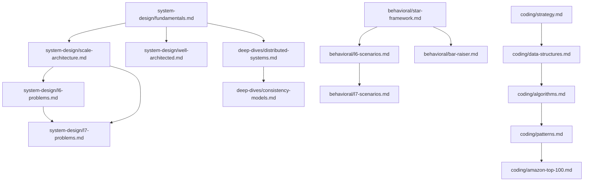

# MkDocs Content Tracking System
## SystemCraft Amazon L6/L7 Interview Prep Documentation

**Last Updated**: August 20, 2025  
**Total Empty Files**: 35  
**Total Word Count Needed**: ~52,000-65,000 words  
**Estimated Completion Time**: 8-12 weeks (full-time)  

---

## 📊 Executive Summary

| Status | Files | Word Count | Percentage |
|--------|-------|------------|------------|
| **Completed** | 13 | ~23,000 | 37% |
| **Empty (Critical)** | 35 | ~52,000 | 63% |
| **Total** | 48 | ~75,000 | 100% |

---

## 🎯 Priority-Ranked Missing Content

### P0 - Critical (Must Complete First)
*These files are essential for basic functionality and user experience*

#### 1. **System Design Fundamentals** 
- **File**: `/home/deepak/SystemCraft/docs/system-design/fundamentals.md`
- **Priority**: P0 (Critical)
- **Estimated Words**: 2,500-3,000
- **Dependencies**: None (foundational)
- **Completion Target**: Week 1

**Key Topics to Cover**:
- CAP Theorem and distributed systems principles
- Scalability patterns (horizontal vs vertical)
- Load balancing strategies
- Database design patterns (SQL vs NoSQL)
- Caching strategies (Redis, Memcached, CDN)
- Message queues and event-driven architecture
- Microservices vs monolithic architectures

**Content Outline**:
```markdown
1. Distributed Systems Foundations (500 words)
2. Scalability Fundamentals (600 words) 
3. Data Storage Patterns (500 words)
4. Communication Patterns (400 words)
5. Performance & Reliability (300 words)
6. AWS Implementation Examples (200 words)
```

**Reference Materials**: 
- Use `/home/deepak/SystemCraft/docs/system-design/index.md` (1,451 words) for tone/style
- AWS Services doc (1,980 words) for technical depth

---

#### 2. **System Design Scale & Architecture**
- **File**: `/home/deepak/SystemCraft/docs/system-design/scale-architecture.md`
- **Priority**: P0 (Critical)
- **Estimated Words**: 3,000-3,500
- **Dependencies**: `system-design/fundamentals.md`
- **Completion Target**: Week 1

**Key Topics to Cover**:
- Horizontal scaling patterns
- Database sharding and partitioning
- Content Delivery Networks (CDN)
- Auto-scaling strategies
- Load balancer types and algorithms
- Caching layers and strategies
- Microservices communication patterns

**Content Outline**:
```markdown
1. Scaling Fundamentals (600 words)
2. Database Scaling Strategies (700 words)
3. Application Scaling Patterns (600 words)
4. Infrastructure Scaling (500 words)
5. Monitoring & Observability (400 words)
6. Real-world Amazon Examples (200 words)
```

---

#### 3. **L6 System Design Problems**
- **File**: `/home/deepak/SystemCraft/docs/system-design/l6-problems.md`
- **Priority**: P0 (Critical)
- **Estimated Words**: 4,000-5,000
- **Dependencies**: `fundamentals.md`, `scale-architecture.md`
- **Completion Target**: Week 2

**Key Topics to Cover**:
- URL Shortener (Bitly/TinyURL)
- Chat Application (WhatsApp/Slack)
- Social Media Feed (Facebook/Twitter)
- File Storage System (Dropbox/Google Drive)
- Search Engine (simplified Google)
- Recommendation System (Amazon/Netflix)
- Real-time Analytics Dashboard

**Content Outline**:
```markdown
1. Problem Categories & Approach (400 words)
2. URL Shortener Deep Dive (600 words)
3. Chat Application Architecture (600 words)
4. Social Media Feed Design (600 words)
5. File Storage System (500 words)
6. Search Engine Basics (500 words)
7. Practice Framework & Tips (300 words)
```

---

#### 4. **L7 System Design Problems**
- **File**: `/home/deepak/SystemCraft/docs/system-design/l7-problems.md`
- **Priority**: P0 (Critical)
- **Estimated Words**: 4,500-5,500
- **Dependencies**: `l6-problems.md`, `scale-architecture.md`
- **Completion Target**: Week 2

**Key Topics to Cover**:
- Multi-region distributed systems
- Global content delivery networks
- Payment processing systems
- Live streaming platforms
- Global chat systems
- Search at billion-user scale
- ML recommendation platforms

**Content Outline**:
```markdown
1. L7 vs L6 Complexity Differences (500 words)
2. Global Payment System (800 words)
3. Live Streaming Platform (700 words)
4. Global Search System (700 words)
5. ML Recommendation Engine (600 words)
6. Multi-region Architecture (500 words)
7. Leadership & Decision Framework (200 words)
```

---

#### 5. **Behavioral STAR Framework**
- **File**: `/home/deepak/SystemCraft/docs/behavioral/star-framework.md`
- **Priority**: P0 (Critical)
- **Estimated Words**: 2,000-2,500
- **Dependencies**: None (foundational)
- **Completion Target**: Week 1

**Key Topics to Cover**:
- STAR methodology breakdown
- Amazon-specific STAR adaptations
- Story engineering techniques
- Quantifying impact effectively
- Leadership principle connections
- Common mistakes and pitfalls

**Content Outline**:
```markdown
1. STAR Framework Fundamentals (400 words)
2. Amazon STAR Modifications (400 words)
3. Story Engineering Workshop (500 words)
4. Impact Quantification (300 words)
5. Leadership Principle Mapping (300 words)
6. Practice Exercises (100 words)
```

**Reference Materials**:
- Use `/home/deepak/SystemCraft/docs/behavioral/star-plus-plus-template.md` (1,543 words) for advanced techniques
- Behavioral index.md (2,445 words) for context and real questions

---

### P1 - High Priority (Complete by Week 3-4)
*Essential for comprehensive preparation*

#### 6. **L6 Behavioral Scenarios**
- **File**: `/home/deepak/SystemCraft/docs/behavioral/l6-scenarios.md`
- **Priority**: P1 (High)
- **Estimated Words**: 2,500-3,000
- **Dependencies**: `star-framework.md`
- **Completion Target**: Week 3

**Key Topics to Cover**:
- People management scenarios
- Technical leadership challenges
- Cross-functional collaboration
- Conflict resolution
- Performance management
- Project delivery under pressure

---

#### 7. **L7 Behavioral Scenarios**
- **File**: `/home/deepak/SystemCraft/docs/behavioral/l7-scenarios.md`
- **Priority**: P1 (High)
- **Estimated Words**: 3,000-3,500
- **Dependencies**: `l6-scenarios.md`
- **Completion Target**: Week 3

**Key Topics to Cover**:
- Organizational transformation
- Strategic technical decisions
- Multi-team leadership
- VP-level stakeholder management
- Cultural change initiatives
- Long-term vision setting

---

#### 8. **Bar Raiser Preparation**
- **File**: `/home/deepak/SystemCraft/docs/behavioral/bar-raiser.md`
- **Priority**: P1 (High)
- **Estimated Words**: 2,000-2,500
- **Dependencies**: `star-framework.md`
- **Completion Target**: Week 3

**Key Topics to Cover**:
- Bar Raiser role and expectations
- Culture fit evaluation criteria
- Advanced leadership scenarios
- Edge case handling
- Bar Raiser specific questions
- Success strategies

---

#### 9. **Decision Making Framework**
- **File**: `/home/deepak/SystemCraft/docs/behavioral/decision-making.md`
- **Priority**: P1 (High)
- **Estimated Words**: 1,800-2,200
- **Dependencies**: None
- **Completion Target**: Week 3

**Key Topics to Cover**:
- Amazon decision-making principles
- One-way vs two-way door decisions
- Data-driven decision frameworks
- Stakeholder alignment strategies
- Risk assessment and mitigation

---

#### 10. **Coding Strategy**
- **File**: `/home/deepak/SystemCraft/docs/coding/strategy.md`
- **Priority**: P1 (High)
- **Estimated Words**: 2,200-2,800
- **Dependencies**: None
- **Completion Target**: Week 4

**Key Topics to Cover**:
- Amazon coding interview format
- Problem-solving methodology
- Time management strategies
- Communication during coding
- Edge case handling
- Code quality expectations

---

### P2 - Medium Priority (Complete by Week 5-7)
*Important for depth and completeness*

#### 11. **Data Structures Deep Dive**
- **File**: `/home/deepak/SystemCraft/docs/coding/data-structures.md`
- **Priority**: P2 (Medium)
- **Estimated Words**: 2,800-3,200
- **Dependencies**: `coding/strategy.md`
- **Completion Target**: Week 5

---

#### 12. **Algorithms Mastery**
- **File**: `/home/deepak/SystemCraft/docs/coding/algorithms.md`
- **Priority**: P2 (Medium)
- **Estimated Words**: 3,000-3,500
- **Dependencies**: `data-structures.md`
- **Completion Target**: Week 5

---

#### 13. **Problem Patterns**
- **File**: `/home/deepak/SystemCraft/docs/coding/patterns.md`
- **Priority**: P2 (Medium)
- **Estimated Words**: 2,500-3,000
- **Dependencies**: `algorithms.md`
- **Completion Target**: Week 5

---

#### 14. **Amazon Top 100 Problems**
- **File**: `/home/deepak/SystemCraft/docs/coding/amazon-top-100.md`
- **Priority**: P2 (Medium)
- **Estimated Words**: 3,500-4,000
- **Dependencies**: `patterns.md`
- **Completion Target**: Week 6

---

#### 15. **Well-Architected Framework**
- **File**: `/home/deepak/SystemCraft/docs/system-design/well-architected.md`
- **Priority**: P2 (Medium)
- **Estimated Words**: 2,500-3,000
- **Dependencies**: `fundamentals.md`
- **Completion Target**: Week 6

---

### P3 - Lower Priority (Complete by Week 8-12)
*Nice to have for comprehensive preparation*

#### 16. **Technical Deep Dives Index**
- **File**: `/home/deepak/SystemCraft/docs/deep-dives/index.md`
- **Priority**: P3 (Low)
- **Estimated Words**: 1,200-1,500
- **Dependencies**: None
- **Completion Target**: Week 8

---

#### 17. **Distributed Systems Deep Dive**
- **File**: `/home/deepak/SystemCraft/docs/deep-dives/distributed-systems.md`
- **Priority**: P3 (Low)
- **Estimated Words**: 3,000-3,500
- **Dependencies**: `system-design/fundamentals.md`
- **Completion Target**: Week 8

---

#### 18. **Consistency Models**
- **File**: `/home/deepak/SystemCraft/docs/deep-dives/consistency-models.md`
- **Priority**: P3 (Low)
- **Estimated Words**: 2,200-2,800
- **Dependencies**: `distributed-systems.md`
- **Completion Target**: Week 9

---

## 📋 Content Templates and Standards

### Standard File Structure
```markdown
# [Title] for Amazon L6/L7

## 🎯 Overview
[Brief introduction and importance]

## 📊 Key Concepts
[Core information with tables/diagrams]

## 🛠️ Practical Application
[Examples and implementation details]

## 💡 Best Practices
[Do's and don'ts, recommendations]

## 🎪 Interview Tips
[Specific guidance for interviews]

## 📚 Resources
[Additional reading and references]
```

### Quality Standards
- **Minimum Words**: 1,800-2,000 per file
- **Maximum Words**: 4,000-5,000 per file
- **Code Examples**: Minimum 3 per technical file
- **Diagrams**: Minimum 1 Mermaid diagram per system design file
- **References**: Link to related content within docs
- **Amazon Context**: Every file must connect to Amazon-specific needs

---

## 🎯 Weekly Completion Targets

### Week 1 (Foundation)
- [ ] `system-design/fundamentals.md` (P0)
- [ ] `system-design/scale-architecture.md` (P0)
- [ ] `behavioral/star-framework.md` (P0)

### Week 2 (Core Content)
- [ ] `system-design/l6-problems.md` (P0)
- [ ] `system-design/l7-problems.md` (P0)

### Week 3 (Behavioral Mastery)
- [ ] `behavioral/l6-scenarios.md` (P1)
- [ ] `behavioral/l7-scenarios.md` (P1)
- [ ] `behavioral/bar-raiser.md` (P1)
- [ ] `behavioral/decision-making.md` (P1)

### Week 4 (Coding Foundation)
- [ ] `coding/strategy.md` (P1)
- [ ] `system-design/case-studies.md` (P2)

### Weeks 5-7 (Technical Depth)
- [ ] All remaining P2 priority files

### Weeks 8-12 (Polish & Complete)
- [ ] All P3 priority files
- [ ] Portfolio and practice materials

---

## 🔄 Dependencies Map



---

## 📊 Progress Tracking Template

### File Completion Checklist

| Priority | File Path | Est. Words | Status | Started | Completed | Word Count | Quality Check |
|----------|-----------|------------|--------|---------|-----------|------------|---------------|
| P0 | system-design/fundamentals.md | 2,500 | ⏳ Pending | | | | |
| P0 | system-design/scale-architecture.md | 3,000 | ⏳ Pending | | | | |
| P0 | system-design/l6-problems.md | 4,500 | ⏳ Pending | | | | |
| P0 | system-design/l7-problems.md | 5,000 | ⏳ Pending | | | | |
| P0 | behavioral/star-framework.md | 2,200 | ⏳ Pending | | | | |

### Status Legend
- ⏳ Pending
- 🚧 In Progress  
- ✅ Complete
- 🔍 Under Review
- 📝 Needs Revision

---

## 🎯 Content Quality Metrics

### Completion Criteria
Each file must meet these standards before marking complete:

**Technical Content**:
- [ ] Minimum word count achieved
- [ ] At least 3 code examples included
- [ ] 1+ diagram (for technical files)
- [ ] All key topics covered from outline
- [ ] Amazon-specific context provided
- [ ] Cross-references to related files

**Writing Quality**:
- [ ] Clear structure with proper headings
- [ ] Consistent tone matching existing content
- [ ] Grammar and spelling checked
- [ ] Technical accuracy verified
- [ ] Examples are practical and relevant

**Interview Relevance**:
- [ ] Directly applicable to L6/L7 interviews
- [ ] Includes specific interview tips
- [ ] Connects to Leadership Principles (behavioral content)
- [ ] Provides actionable guidance

---

## 🔄 Review and Update Process

### Weekly Reviews
1. **Monday**: Review previous week's completions
2. **Wednesday**: Mid-week progress check
3. **Friday**: Plan next week's priorities

### Quality Assurance
1. **Self-review**: Author checks against criteria
2. **Technical review**: Verify accuracy and completeness  
3. **User testing**: Ensure content serves interview prep needs

### Maintenance Schedule
- **Monthly**: Update with new interview questions/patterns
- **Quarterly**: Refresh AWS services and best practices
- **Annually**: Major content overhaul and restructuring

---

## 📈 Success Metrics

### Quantitative Goals
- **Content Volume**: 75,000+ total words
- **Completion Rate**: 100% of P0-P1 files by Week 4
- **Quality Score**: >90% on all completion criteria
- **Cross-references**: 5+ internal links per file

### Qualitative Goals
- Content directly improves interview performance
- Users can follow logical learning progression
- All content is actionable and specific
- Amazon L6/L7 context is clear throughout

---

*This tracking system should be updated weekly as content is completed. Each completed file should be marked with completion date and actual word count for future planning accuracy.*