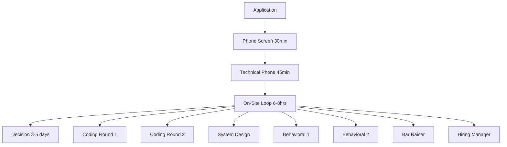

<!-- 
Interview Rounds Structure - Shared Component
Standard Amazon L6/L7 interview round structure and expectations.
Usage: 
-->

## 🔄 Amazon Interview Process Structure

### Complete Interview Timeline

### Standard Interview Rounds

#### 📞 Phone Screen (30 minutes)
**Interviewer:** Recruiter or hiring manager  
**Focus:** Cultural fit and basic competence  
**Structure:**
- 5 min: Role overview
- 15 min: 2-3 Leadership Principles questions
- 5 min: Technical background
- 5 min: Next steps

#### 💻 Technical Phone Screen (45 minutes)
**Interviewer:** Senior engineer (L5-L6)  
**Focus:** Coding ability and problem-solving  
**Structure:**
- 5 min: Technical background
- 30 min: LeetCode Medium problem
- 10 min: System design mini-question

#### 🏢 On-Site Loop Structure

| Round | Duration | Focus | Success Criteria |
|-------|----------|-------|------------------|
| **Coding 1** | 45 min | Data structures | Optimal solution, clean code |
| **Coding 2** | 45 min | Algorithms | Problem-solving approach |
| **System Design** | 60-90 min | Scalable systems | Production-ready design |
| **Behavioral 1** | 45 min | Team leadership | STAR stories with results |
| **Behavioral 2** | 45 min | Technical leadership | Cross-team influence |
| **Bar Raiser** | 60 min | Cultural fit | Raises the bar |
| **Hiring Manager** | 45 min | Role-specific fit | Team collaboration |

### L6 vs L7 Round Differences

#### L6 Interview Focus
- **Coding:** 2 rounds, medium complexity
- **System Design:** Team-scale systems (millions of users)
- **Behavioral:** Direct team impact and coordination
- **Total:** 6-7 hours over 1-2 days

#### L7 Interview Focus
- **Architecture:** 90 min, platform design
- **Technical Strategy:** 60 min, vision & roadmap
- **Organizational:** 60 min, transformation leadership
- **Executive:** 45 min, vision alignment
- **Total:** 7-8 hours over 2-3 days

### Round-Specific Preparation

#### Coding Rounds
**L6 Preparation:**
- 50+ LeetCode Medium problems
- Focus on clean, production code
- Practice explaining approach

**L7 Preparation:**
- Architectural implications of solutions
- Trade-off discussions
- Business impact connections

#### System Design Round
**L6 Scope:**
- Multi-team systems
- Millions of users
- Implementation focus

**L7 Scope:**
- Organization-wide platforms
- Billions of users
- Strategic innovation

#### Behavioral Rounds
**Key Leadership Principles by Round:**

**Round 1 - Team Leadership:**
- Hire and Develop the Best
- Earn Trust
- Deliver Results

**Round 2 - Technical Leadership:**
- Customer Obsession
- Ownership
- Think Big

**Bar Raiser - Cultural Fit:**
- All 16 Leadership Principles
- Values-based decisions
- Long-term potential

### Success Rates by Stage

| Stage | Pass Rate | Key Factors |
|-------|-----------|-------------|
| Phone Screen | 50-60% | Clear communication, LP demonstration |
| Technical Phone | 60-70% | Optimal solution, good explanation |
| On-Site Loop | 15-25% | Comprehensive excellence across all dimensions |
| Overall Process | 8-15% | Consistent performance and cultural fit |

### Red Flags That Kill Interviews

❌ **Technical Rounds:**
- Can't solve medium problems efficiently
- Poor communication during coding
- No consideration of scale/production concerns

❌ **Behavioral Rounds:**
- Generic stories without personal ownership
- No quantified business impact
- Blame others for failures

❌ **Bar Raiser Round:**
- Inauthentic or rehearsed responses
- Values misalignment with Amazon culture
- Arrogance or lack of humility