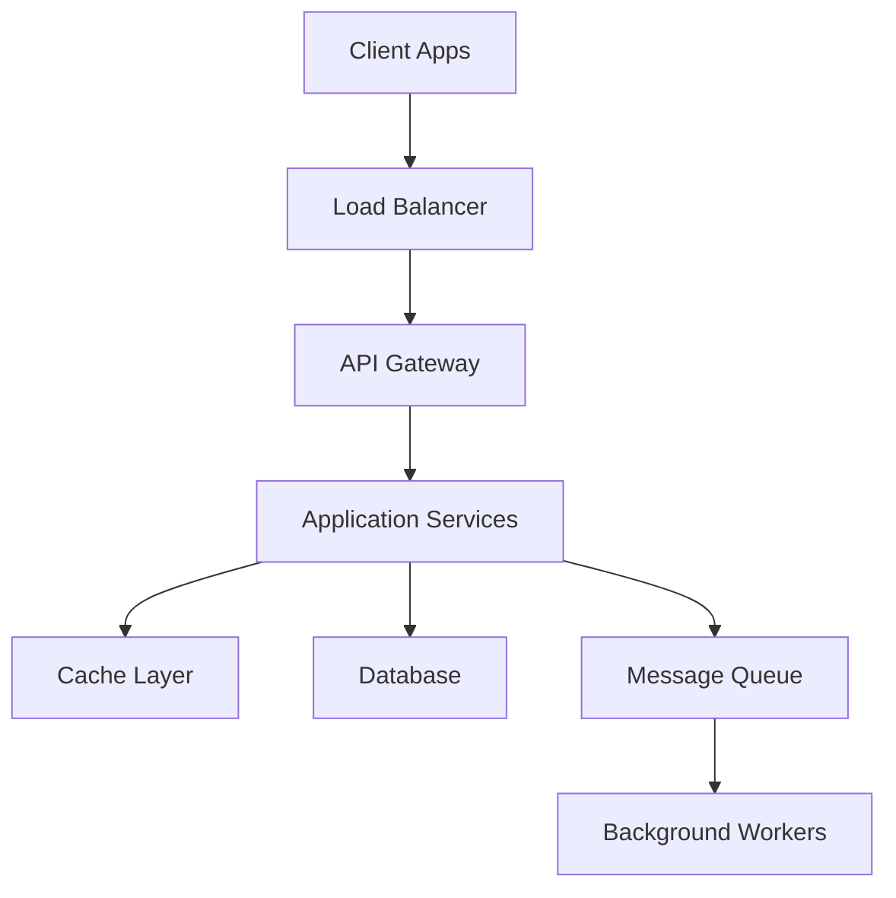

# L6 System Design Problem Template

## 🏗️ Problem: [System Name]

**Complexity:** L6 Component-Level  
**Time Allocation:** 45-60 minutes  
**User Scale:** 1-100M users  
**Data Scale:** TB to low PB scale  
**Team Size:** 10-25 engineers

---

## 📋 Problem Statement (5 minutes)

### Business Context
[Clear explanation of what business problem this system solves]

### Functional Requirements
- **Core Feature 1:** [Primary user-facing functionality]
- **Core Feature 2:** [Secondary important functionality]
- **Core Feature 3:** [Additional required functionality]

### Non-Functional Requirements
- **Users:** [Daily/Monthly active users]
- **Scale:** [Requests per second, data volume]
- **Performance:** [Latency requirements - typically <100ms]
- **Availability:** [Uptime requirements - typically 99.9%]
- **Consistency:** [Data consistency needs]

### Constraints
- **Technology:** [Any required technology stack]
- **Integration:** [Existing systems to integrate with]
- **Budget:** [Cost considerations if relevant]
- **Timeline:** [Launch deadlines]

---

## 🎯 Capacity Planning (5 minutes)

### Traffic Estimates
```
Daily Active Users: X million
Peak concurrent users: Y thousand
Requests per second (average): Z
Requests per second (peak): 3-5x average
Read/Write ratio: A:B
```

### Storage Estimates
```
User data per record: X KB
Growth rate: Y% per year
Total storage needed: Z TB
Backup and redundancy: 3x primary storage
```

### Bandwidth Estimates
```
Average request size: X KB
Average response size: Y KB
Peak bandwidth: Z Gbps
```

---

## 🏗️ High-Level Architecture (15 minutes)

### System Overview


### Component Breakdown
1. **Client Layer:** [Web app, mobile apps, APIs]
2. **Load Balancing:** [Distribution and failover]
3. **API Gateway:** [Authentication, rate limiting, routing]
4. **Application Logic:** [Core business logic services]
5. **Data Layer:** [Databases, caches, storage]
6. **Background Processing:** [Async work, notifications]

### Technology Choices
| Component | Technology | Justification |
|-----------|------------|---------------|
| **Load Balancer** | [AWS ALB/NLB] | [L7 features, health checks, SSL] |
| **Compute** | [ECS/EKS/Lambda] | [Container orchestration, scaling] |
| **Database** | [PostgreSQL/DynamoDB] | [ACID/NoSQL trade-offs] |
| **Cache** | [ElastiCache Redis] | [Performance, session storage] |
| **Queue** | [SQS/Kafka] | [Reliability vs throughput] |

---

## 🔧 Detailed Design (20 minutes)

### Database Design

#### Primary Database Schema
```sql
-- Core entities for the system
CREATE TABLE users (
    user_id UUID PRIMARY KEY,
    email VARCHAR(255) UNIQUE NOT NULL,
    created_at TIMESTAMP DEFAULT NOW(),
    last_active TIMESTAMP,
    status VARCHAR(20) DEFAULT 'active'
);

-- Additional tables as needed
-- Include indexes, constraints, and partitioning strategy
```

#### Caching Strategy
```yaml
Cache Layers:
  L1 (Application): "In-memory cache for hot data"
  L2 (Redis): "Distributed cache for session and frequent data"
  L3 (CDN): "Static content and API responses"
  
Cache Patterns:
  - "Cache-aside for user data"
  - "Write-through for configuration data"
  - "Cache invalidation strategy"
```

### API Design
```yaml
# RESTful API endpoints
GET /api/v1/users/{id}:
  description: "Get user profile"
  response_time: "<50ms p95"
  rate_limit: "1000 req/min per user"

POST /api/v1/users:
  description: "Create new user"
  validation: "Email uniqueness, format validation"
  rate_limit: "10 req/min per IP"

# Include authentication, validation, error handling
```

### Data Flow
```
1. User Request → Load Balancer → API Gateway
2. Authentication & Rate Limiting Check
3. Route to appropriate service
4. Check cache for data
5. Query database if cache miss
6. Process business logic
7. Update cache and respond
8. Async operations via message queue
```

---

## ⚡ Scaling Considerations (10 minutes)

### Horizontal Scaling
- **Application Tier:** Auto-scaling groups, containerization
- **Database Tier:** Read replicas, connection pooling
- **Cache Tier:** Redis clustering, consistent hashing

### Performance Optimization
- **Query Optimization:** Proper indexing, query analysis
- **Caching Strategy:** Multi-level caching, cache warming
- **CDN Integration:** Static content, API response caching
- **Database Optimization:** Connection pooling, query optimization

### Monitoring & Operations
```yaml
Key Metrics:
  - Response time percentiles (P50, P95, P99)
  - Error rates by endpoint
  - Database performance and slow queries
  - Cache hit/miss ratios
  - Infrastructure utilization

Alerting:
  - Error rate > 0.1% for 5 minutes
  - Response time P99 > 500ms for 5 minutes
  - Database connection pool > 80%
  - Cache hit ratio < 90%
```

---

## 🛡️ Reliability & Security (5 minutes)

### Fault Tolerance
- **Circuit Breaker:** Prevent cascade failures
- **Retry Logic:** Exponential backoff with jitter
- **Graceful Degradation:** Essential features continue
- **Health Checks:** Proactive failure detection

### Security Measures
- **Authentication:** JWT tokens, OAuth integration
- **Authorization:** Role-based access control (RBAC)
- **Data Protection:** Encryption at rest and in transit
- **Input Validation:** SQL injection, XSS prevention
- **Rate Limiting:** Prevent abuse and DoS attacks

---

## 🔍 Trade-offs & Follow-up Questions (5 minutes)

### Key Design Trade-offs
1. **Consistency vs Availability:** [Chosen approach and rationale]
2. **SQL vs NoSQL:** [Database choice justification]
3. **Synchronous vs Asynchronous:** [Processing approach]
4. **Microservices vs Monolith:** [Architecture decision]

### Potential Follow-up Questions
1. "How would you handle a 10x increase in traffic?"
2. "What if this needed to work globally with <100ms latency?"
3. "How would you implement real-time features?"
4. "What would change if this needed 99.99% uptime?"
5. "How would you handle data migrations with zero downtime?"

### Common L6 Improvements
- Add comprehensive monitoring and alerting
- Implement blue-green deployment strategy
- Add automated testing and quality gates
- Design for multi-region deployment
- Include cost optimization strategies

---

## ✅ L6 Success Criteria

### Technical Excellence
- [ ] Requirements clearly understood and confirmed
- [ ] Appropriate technology choices with justification
- [ ] Scalable architecture supporting 10-100M users
- [ ] Database design with proper indexing and relationships
- [ ] Caching strategy reducing database load by 80%+
- [ ] API design following RESTful principles
- [ ] Security and reliability considerations included

### L6 Leadership Demonstration
- [ ] Component-level architectural thinking
- [ ] Operational concerns addressed (monitoring, deployment)
- [ ] Team implementation considerations discussed
- [ ] Trade-offs explained with business context
- [ ] Questions handled with technical depth
- [ ] Production experience and lessons applied

### Interview Performance
- [ ] Structured approach with clear phases
- [ ] Appropriate time management across sections
- [ ] Technical depth without over-engineering
- [ ] Clear communication and diagrams
- [ ] Proactive about edge cases and failure modes

---

*Template Version: 1.0 | Optimized for L6 Amazon Engineering Manager interviews*