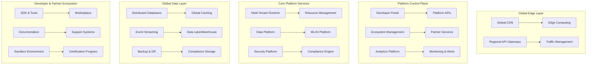

# L7 System Design Problem Template

## 🌐 Problem: [Platform/Ecosystem Name]

**Complexity:** L7 Platform-Level  
**Time Allocation:** 60-90 minutes  
**User Scale:** 100M-10B users globally  
**Data Scale:** Petabyte to Exabyte scale  
**Organization Impact:** 100+ engineers, multiple business units  
**Industry Influence:** Potential for patents, standards, research

---

## 📋 Strategic Context (15 minutes)

### Industry Analysis and Market Position
[Comprehensive analysis of industry landscape, competitive positioning, and market opportunity]

**Market Size and Growth:**
- Current market size and projected growth rates
- Key industry trends and technological shifts
- Competitive landscape and differentiation opportunities
- Regulatory environment and compliance requirements

**Strategic Business Value:**
- Revenue opportunity and business model innovation
- Platform economics and network effects potential
- Competitive advantages and moats created
- Long-term strategic positioning and market influence

### Platform Vision and Innovation
[Strategic vision for how this platform transforms the industry]

**Platform Philosophy:**
- Core platform principles and design philosophy
- Innovation areas and breakthrough opportunities
- Industry standards influence and thought leadership
- Academic and research contributions potential

**Organizational Impact:**
- How this platform enables other teams and products
- Skills and capabilities this builds across organization
- Career development and hiring attractiveness
- Technical brand and industry recognition potential

---

## 🎯 Requirements Analysis (10 minutes)

### Functional Platform Requirements
- **Core Platform Services:** [Essential platform capabilities]
- **Developer Experience:** [APIs, SDKs, documentation, tooling]
- **Ecosystem Enablement:** [Partner integration, marketplace, extensions]
- **Multi-tenant Architecture:** [Isolation, customization, resource management]

### Non-Functional Platform Requirements
- **Global Scale:** [Users/requests across all geographic regions]
- **Platform Reliability:** [99.99% uptime with platform SLAs]
- **Performance:** [Sub-100ms globally with edge optimization]
- **Security & Compliance:** [Multi-region compliance, enterprise security]
- **Developer Productivity:** [Self-service capabilities, deployment speed]

### Platform Constraints and Considerations
- **Technology Standards:** [Industry standards, open source contributions]
- **Regulatory Compliance:** [Global privacy, security, industry regulations]
- **Platform Economics:** [Cost per user, margin optimization, pricing models]
- **Innovation Timeline:** [Patent filing timelines, research publication cycles]

---

## 📊 Platform Capacity Planning (10 minutes)

### Global Scale Estimates
```
Platform Users: X billion globally
Developer/Partner Ecosystem: Y thousand active developers
API Requests: Z billion per day across all platform services
Data Processing: Petabytes per day across all tenants
Geographic Distribution: 100+ countries with local compliance

Platform Service Distribution:
- Core Platform APIs: 40% of traffic
- Developer Tools & SDKs: 25% of traffic  
- Partner Integrations: 20% of traffic
- Analytics & Monitoring: 15% of traffic
```

### Resource Planning
```
Global Infrastructure:
- Data Centers: 25+ regions with 3+ AZs each
- Edge Locations: 200+ for global performance
- Compute Capacity: 100K+ servers with auto-scaling
- Storage: Exabyte scale with multi-tier storage
- Network: Multi-Tbps global backbone with peering
```

---

## 🌐 Platform Architecture (25 minutes)

### Strategic Architecture Overview


### Technology Stack (Platform Level)
| Layer | Technology Choice | Strategic Rationale |
|-------|------------------|-------------------|
| **Edge Computing** | [Custom Edge Runtime] | [Global latency optimization, compliance] |
| **Orchestration** | [Kubernetes + Custom] | [Multi-cloud, enterprise features] |
| **Databases** | [Multi-modal: SQL/NoSQL/Graph] | [Different data patterns, global consistency] |
| **Messaging** | [Apache Kafka + Custom] | [Event-driven architecture, global streaming] |
| **ML/AI Platform** | [Custom ML Infrastructure] | [Specialized AI/ML workloads, model serving] |
| **Security** | [Zero-Trust Architecture] | [Multi-tenant isolation, compliance] |

---

## 🔧 Detailed Platform Design (25 minutes)

### Multi-Tenant Platform Architecture

#### Global Multi-Tenancy Strategy
```yaml
platform_tenancy:
  tenant_isolation:
    compute: "Container-based isolation with resource quotas per tenant"
    networking: "Virtual networks with micro-segmentation"
    data: "Logical separation with encryption keys per tenant"
    governance: "Tenant-specific policies and compliance controls"
    
  resource_management:
    allocation: "Dynamic resource allocation based on usage patterns"
    scaling: "Auto-scaling within tenant limits and global capacity"
    quotas: "Flexible quotas with burst capacity and fair sharing"
    billing: "Usage-based billing with cost optimization recommendations"
    
  global_distribution:
    data_residency: "Data sovereignty with regional data placement"
    latency_optimization: "Edge computing for <50ms global response"
    compliance: "Region-specific compliance automation"
    disaster_recovery: "Multi-region failover with RTO <5 minutes"
```

#### Platform Developer Experience
```yaml
developer_platform:
  self_service_capabilities:
    provisioning: "Instant environment provisioning with infrastructure-as-code"
    deployment: "GitOps-based continuous deployment"
    monitoring: "Built-in observability with custom dashboards"
    scaling: "Automatic scaling based on usage patterns"
    
  developer_tools:
    apis: "Comprehensive REST/GraphQL APIs with OpenAPI specs"
    sdks: "Native SDKs for 10+ programming languages"
    cli_tools: "Command-line tools for all platform operations"
    testing: "Sandbox environments with production data simulation"
    
  ecosystem_enablement:
    marketplace: "Platform marketplace for extensions and integrations"
    certification: "Partner certification program for quality assurance"
    support: "Tiered support with SLA guarantees"
    community: "Developer community with forums and resources"
```

### Global Data Platform Architecture

#### Distributed Data Management
```yaml
data_architecture:
  global_consistency:
    model: "Eventual consistency with strong consistency zones"
    conflict_resolution: "CRDT-based automatic conflict resolution"
    synchronization: "Multi-master replication with partition tolerance"
    
  data_governance:
    classification: "Automatic data classification and tagging"
    lineage: "End-to-end data lineage tracking across platform"
    quality: "Automated data quality monitoring and remediation"
    privacy: "Privacy-by-design with automated PII handling"
    
  analytics_platform:
    real_time: "Stream processing for real-time insights"
    batch_processing: "Large-scale batch processing for complex analytics"
    ml_integration: "Built-in ML/AI for predictive analytics"
    visualization: "Self-service analytics with interactive dashboards"
```

#### Platform Security and Compliance
```yaml
security_architecture:
  zero_trust_model:
    authentication: "Multi-factor authentication with SSO federation"
    authorization: "Fine-grained RBAC with dynamic policies"
    encryption: "End-to-end encryption with quantum-safe algorithms"
    monitoring: "Real-time security monitoring with anomaly detection"
    
  compliance_automation:
    frameworks: ["SOC2", "ISO27001", "GDPR", "CCPA", "HIPAA", "FedRAMP"]
    audit_trails: "Immutable audit logs with blockchain verification"
    policy_enforcement: "Automated policy enforcement with real-time monitoring"
    reporting: "Automated compliance reporting for multiple jurisdictions"
    
  threat_protection:
    ddos_protection: "Multi-layer DDoS protection with ML-based detection"
    intrusion_detection: "AI-powered intrusion detection and response"
    vulnerability_management: "Continuous vulnerability scanning and patching"
    incident_response: "Automated incident response with forensic capabilities"
```

---

## ⚡ Platform Scaling and Performance (10 minutes)

### Global Scaling Strategy
- **Horizontal Scaling:** Auto-scaling across multiple clouds and regions
- **Vertical Scaling:** Dynamic resource allocation based on workload patterns
- **Edge Computing:** Computation pushed to edge for latency optimization
- **CDN Integration:** Global content delivery with intelligent caching

### Performance Optimization
- **Global Load Balancing:** Intelligent traffic routing based on latency and load
- **Caching Strategy:** Multi-level caching from edge to database
- **Database Optimization:** Sharding, indexing, and query optimization at scale
- **Network Optimization:** Private backbone networks and peering agreements

### Platform Monitoring and Operations
```yaml
observability_platform:
  metrics: "Custom metrics platform with 99.9% accuracy SLA"
  logging: "Centralized logging with real-time analysis"
  tracing: "Distributed tracing across all platform services"
  alerting: "Intelligent alerting with ML-based anomaly detection"
  
platform_slas:
  availability: "99.99% uptime with automatic failover"
  performance: "P99 latency <100ms globally"
  scalability: "Linear scaling to handle 10x traffic growth"
  recovery: "RTO <5 minutes, RPO <1 minute for critical data"
```

---

## 🚀 Platform Evolution and Innovation (10 minutes)

### Technology Innovation Strategy
1. **Emerging Technology Integration:** AI/ML, edge computing, quantum computing readiness
2. **Open Source Contributions:** Platform components released as open source
3. **Research Partnerships:** Collaborations with universities and research institutions
4. **Patent Strategy:** Intellectual property development and defensive patents

### Platform Ecosystem Growth
- **Developer Community:** Building vibrant developer ecosystem with conferences and hackathons
- **Partner Network:** Strategic partnerships with technology vendors and consultants
- **Standards Influence:** Contributing to industry standards and best practices
- **Thought Leadership:** Publishing research, speaking at conferences, driving industry direction

### Migration and Adoption Strategy
```yaml
platform_adoption:
  migration_strategy:
    assessment: "Automated assessment tools for migration planning"
    phased_migration: "Zero-downtime migration with rollback capabilities"
    training: "Comprehensive training programs for developers and partners"
    
  success_metrics:
    adoption: "Platform adoption rate across organization"
    productivity: "Developer productivity improvements"
    innovation: "New features and capabilities enabled"
    satisfaction: "Developer and user satisfaction scores"
```

---

## 🔍 Strategic Trade-offs and Follow-up (5 minutes)

### Key Platform Trade-offs
1. **Build vs Buy vs Partner:** [Platform components vs third-party vs ecosystem]
2. **Standardization vs Flexibility:** [Platform consistency vs customization needs]
3. **Performance vs Cost:** [Global optimization vs resource efficiency]
4. **Innovation vs Stability:** [Bleeding edge features vs platform reliability]

### L7 Follow-up Questions
1. "How would this platform influence industry standards and practices?"
2. "What would be your strategy for building developer ecosystem adoption?"
3. "How would you measure the success of this platform in 3-5 years?"
4. "What are the biggest risks to platform adoption and how would you mitigate them?"
5. "How would this platform enable innovation across the entire organization?"

### Industry Impact Assessment
- **Market Transformation:** How this platform could reshape industry practices
- **Competitive Response:** Anticipated competitor reactions and counter-strategies
- **Regulatory Implications:** Potential regulatory challenges and engagement strategy
- **Academic Contributions:** Research and publication opportunities

---

## ✅ L7 Excellence Criteria

### Strategic Vision Demonstration
- [ ] Industry analysis with competitive landscape understanding
- [ ] Platform vision that transforms market or creates new categories
- [ ] Innovation strategy with patent and research potential
- [ ] Business model innovation and platform economics
- [ ] Long-term strategic thinking (5-10 year horizon)

### Technical Leadership Excellence
- [ ] Platform-scale architecture supporting billions of users
- [ ] Multi-tenant global architecture with compliance
- [ ] Technology choices that advance state of the art
- [ ] Developer ecosystem and marketplace design
- [ ] Open source strategy and community building

### Organizational Impact
- [ ] Cross-functional influence and stakeholder management
- [ ] Team scaling strategy for 100+ engineers
- [ ] Skills development and career growth opportunities
- [ ] Industry thought leadership and conference speaking
- [ ] Talent attraction and retention through technical excellence

### Innovation and Research
- [ ] Breakthrough technical solutions worthy of patents
- [ ] Research contributions and academic partnerships
- [ ] Industry standards influence and thought leadership
- [ ] Technology trend identification and early adoption
- [ ] Platform that enables innovation across ecosystem

### Execution Excellence
- [ ] Realistic implementation plan with milestones
- [ ] Risk assessment and mitigation strategies
- [ ] Change management and organizational transformation
- [ ] Success metrics and measurement frameworks
- [ ] Post-launch platform evolution strategy

---

*Template Version: 1.0 | Optimized for L7 Amazon Principal Engineering Manager interviews*