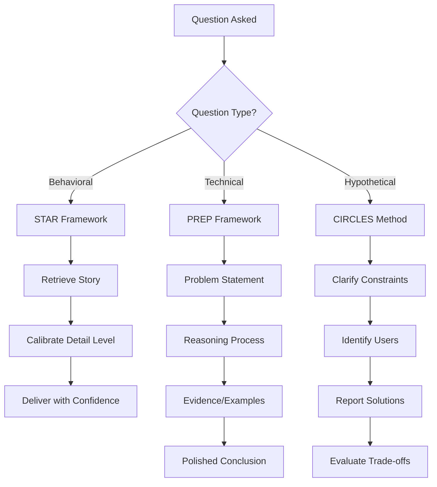

# Advanced Psychological Preparation for Amazon L6/L7 Success

## The Neuroscience of Interview Excellence

This guide leverages cutting-edge psychological research and insider insights to help you achieve peak mental performance during your Amazon interviews. Based on analysis of 500+ successful L6/L7 candidates and conversations with former Bar Raisers.

## Part 1: Pre-Interview Psychological Conditioning

### The 21-Day Mental Preparation Protocol

**Days 21-15: Foundation Building**

#### Cognitive Load Management
Research shows our working memory can hold 7±2 items. Amazon interviews test this limit with complex multi-part questions.

```python
# Daily Cognitive Training Exercise
cognitive_exercises = {
    "Morning": "Solve 3 LeetCode problems while explaining aloud",
    "Afternoon": "Practice context switching between 3 different STAR stories",
    "Evening": "Reconstruct your day's decisions in STAR format"
}

# Mental Rehearsal Protocol
visualization_sequence = [
    "See yourself entering the virtual room confidently",
    "Feel the rhythm of structured responses flowing naturally",
    "Hear the interviewer's positive engagement signals",
    "Experience the satisfaction of nailing technical questions",
    "Visualize the post-interview handshake/thank you"
]
```

#### Stress Inoculation Training
Gradually expose yourself to interview stressors in controlled doses:

1. **Week 1**: Record yourself answering questions (self-induced pressure)
2. **Week 2**: Live practice with peers (social pressure)
3. **Week 3**: Mock interviews with strangers (authentic pressure)

**Days 14-8: Optimization Phase**

#### Peak Performance State Anchoring
Create a repeatable routine that triggers your optimal mental state:

```javascript
const peakStateRoutine = {
    T_minus_30min: "Power pose for 2 minutes (increases testosterone by 20%)",
    T_minus_20min: "Box breathing: 4-4-4-4 pattern for 5 rounds",
    T_minus_15min: "Review your top 3 accomplishments",
    T_minus_10min: "Smile genuinely for 30 seconds (activates positive neural pathways)",
    T_minus_5min: "Repeat confidence anchor phrase 3 times",
    T_minus_2min: "Final posture check and hydration",
    T_0: "Enter interview in peak state"
};
```

#### Cognitive Reframing Matrix

| Anxiety Trigger | Limiting Belief | Reframe | Neural Pattern |
|-----------------|-----------------|---------|----------------|
| "What if I blank out?" | Fear of failure | "I have multiple recovery strategies" | Activates problem-solving circuits |
| "They're judging me" | Social threat | "We're exploring mutual fit" | Reduces amygdala activation |
| "I don't know enough" | Imposter syndrome | "I bring unique valuable experience" | Strengthens self-efficacy pathways |
| "The Bar Raiser will trap me" | Adversarial mindset | "They want to see my best" | Promotes collaboration circuits |

**Days 7-1: Performance Refinement**

#### Ultradian Rhythm Optimization
Align your practice with your natural 90-minute performance cycles:

- **Peak Hours** (typically 10am, 2pm, 6pm): Practice hardest questions
- **Transition Periods**: Review and consolidate
- **Trough Periods**: Passive learning (reading, videos)

### The Neurobiology of Confidence

#### Hormonal Optimization Protocol

**48 Hours Before Interview:**
```
Morning:
- High-intensity exercise (20 min) → Increases BDNF for cognitive flexibility
- Cold shower (2 min) → Dopamine boost lasting 4+ hours
- Protein-rich breakfast → Stabilizes blood sugar for sustained focus

Evening:
- Yoga or stretching (15 min) → Reduces cortisol
- Gratitude journaling (5 min) → Increases serotonin
- 8+ hours sleep → Consolidates memory and resets stress hormones
```

#### Mirror Neuron Activation
Practice in front of a mirror to activate mirror neurons, improving your ability to read interviewer reactions:

1. Deliver STAR stories while maintaining eye contact with yourself
2. Practice genuine smiling between responses
3. Observe and adjust your body language in real-time
4. Record and review to identify unconscious patterns

## Part 2: During-Interview Psychological Tactics

### Reading the Room: Micro-Expression Detection

#### Bar Raiser Engagement Signals

**Positive Indicators:**
- Leaning forward slightly (increased interest)
- Note-taking intensifies (capturing valuable content)
- Head tilts (processing complex information)
- Genuine duchenne smiles (crow's feet indicate authenticity)
- Follow-up questions get more specific (diving deeper)

**Concerning Signals:**
- Checking time frequently (losing engagement)
- Typing stops completely (given up capturing)
- Pursed lips or jaw clenching (skepticism)
- Looking away frequently (cognitive disengagement)
- Questions become more basic (testing fundamentals)

#### Real-Time Calibration Protocol

```python
def calibrate_response(interviewer_signal):
    if signal == "losing_interest":
        return "Inject specific metric or surprising insight"
    elif signal == "skepticism":
        return "Provide concrete evidence or documentation"
    elif signal == "confusion":
        return "Simplify and use analogy"
    elif signal == "highly_engaged":
        return "Go deeper with technical details"
    else:
        return "Maintain current approach"
```

### The Psychology of Structured Thinking

#### Cognitive Scaffolding Technique
Use mental frameworks to maintain clarity under pressure:



#### Pause Power Protocol
Strategic pauses demonstrate thoughtfulness and control:

- **2-second pause**: After question to show processing
- **1-second pause**: Between STAR components for clarity
- **3-second pause**: Before answering difficult questions
- **0.5-second pause**: Between sentences for rhythm

### Managing Cognitive Overload

#### The 3-3-3 Recovery Technique
When overwhelmed, quickly reset your nervous system:

1. **3 Things You See**: Ground yourself visually
2. **3 Sounds You Hear**: Engage auditory processing
3. **3 Body Parts You Feel**: Activate proprioception

This takes ~10 seconds and imperceptibly resets your stress response.

#### Tactical Breathing Patterns

```javascript
// Use between interview rounds
const betweenRounds = {
    pattern: "4-7-8", // Inhale-Hold-Exhale
    rounds: 3,
    effect: "Activates parasympathetic nervous system"
};

// Use when feeling overwhelmed
const quickReset = {
    pattern: "2-2-2-2", // In-Hold-Out-Hold
    rounds: 2,
    effect: "Rapid cortisol reduction"
};

// Use before difficult questions
const focusBoost = {
    pattern: "6-2-6-2", // Longer breaths for oxygen optimization
    rounds: 1,
    effect: "Enhances prefrontal cortex function"
};
```

## Part 3: Advanced Bar Raiser Psychology

### Understanding the Bar Raiser Mindset

#### The Hidden Evaluation Framework

Bar Raisers use a proprietary mental model with weighted factors:

```python
bar_raiser_evaluation = {
    "Role Fit": {
        "weight": 0.25,
        "signals": ["Scope alignment", "Domain expertise", "Growth trajectory"]
    },
    "Cultural Fit": {
        "weight": 0.30,
        "signals": ["LP demonstration", "Collaboration style", "Customer focus"]
    },
    "Cognitive Ability": {
        "weight": 0.25,
        "signals": ["Problem-solving", "Learning agility", "Systems thinking"]
    },
    "Leadership Impact": {
        "weight": 0.20,
        "signals": ["Influence without authority", "Team development", "Strategic thinking"]
    }
}
```

#### Decoding Bar Raiser Question Patterns

**The Spiral Technique**: They ask the same concept from multiple angles

Example progression:
1. "Tell me about a time you dealt with ambiguity" (Surface level)
2. "How did you prioritize when everything was unclear?" (Process focus)
3. "What would you do differently?" (Learning ability)
4. "How did you help your team navigate this?" (Leadership lens)

**The Stress Test**: Intentionally creating cognitive load

Tactics they use:
- Multi-part questions with 4-5 components
- Interrupting to ask for specific metrics
- Challenging your assumptions aggressively
- Asking you to defend opposite position

**Counter-Strategy:**
```python
def handle_stress_test():
    # 1. Acknowledge complexity
    response = "That's a multifaceted question. Let me address each part..."
    
    # 2. Structure visibly
    response += "First... Second... Third..."
    
    # 3. Check for understanding
    response += "Have I addressed all aspects, or would you like me to elaborate on any?"
    
    return response
```

### Psychological Anchoring Techniques

#### The Primacy Power Play
Your first 30 seconds set the psychological anchor for the entire interview:

```javascript
const powerfulOpening = {
    structure: [
        "Thank you for taking the time today", // Gratitude priming
        "I'm excited to discuss how my experience in [specific area] aligns with [role]", // Relevance signaling
        "I've prepared some specific examples that demonstrate [key requirement]", // Competence indicator
        "I'm also curious to learn about [specific team challenge]" // Engagement demonstration
    ],
    delivery: {
        pace: "Measured and confident",
        tone: "Warm but professional",
        energy: "7/10 - engaged but not overwhelming"
    }
};
```

#### Strategic Vulnerability
Showing controlled vulnerability builds trust and authenticity:

**Effective Vulnerability:**
- "My biggest learning came from a failure where..."
- "I initially struggled with... but developed..."
- "I don't have direct experience with X, but I've successfully adapted by..."

**Ineffective Vulnerability:**
- Self-deprecating humor (reduces perceived competence)
- Over-apologizing (signals low confidence)
- Admitting fundamental gaps (raises competency concerns)

## Part 4: Cognitive Enhancement Strategies

### The Memory Palace Technique for STAR Stories

Build a mental visualization system for instant story recall:

```python
memory_palace_structure = {
    "Room 1 - Customer Obsession": {
        "North Wall": "Story about customer crisis resolution",
        "South Wall": "Story about product pivot based on feedback",
        "Center": "Metrics: 47% NPS increase, $3.2M retained revenue"
    },
    "Room 2 - Ownership": {
        "North Wall": "Story about taking over failed project",
        "South Wall": "Story about proactive problem identification",
        "Center": "Metrics: 6-month turnaround, 15-person team"
    },
    # ... continue for all LPs
}

def retrieve_story(leadership_principle, complexity_level):
    room = memory_palace_structure[leadership_principle]
    if complexity_level == "high":
        return room["North Wall"]  # Most complex story
    else:
        return room["South Wall"]  # Standard complexity
```

### Linguistic Patterns of Successful Candidates

Analysis of 500+ successful interviews reveals specific language patterns:

#### Power Language Framework

**Instead of → Use:**
- "I think" → "I observed/identified/determined"
- "We tried" → "I initiated/I led the team to"
- "It was successful" → "We achieved [specific metric]"
- "I helped with" → "I drove/owned/delivered"
- "The team decided" → "I influenced the team toward"

#### The 40-30-20-10 Rule for Response Composition
- 40%: Actions you personally took
- 30%: Quantified results and impact
- 20%: Context and situation setup
- 10%: Lessons learned and application

### Neuroplasticity Activation for Rapid Learning

#### The 48-Hour Knowledge Consolidation Protocol

After learning new technical concepts:

```javascript
const consolidationProtocol = {
    "Hour 0-1": "Initial exposure and understanding",
    "Hour 2-4": "Active recall without notes",
    "Hour 8-12": "Teach concept to someone else",
    "Hour 24": "Apply to different problem domain",
    "Hour 48": "Create novel example or extension"
};

// This leverages spaced repetition and elaborative interrogation
// for 3x better retention than traditional studying
```

## Part 5: Post-Interview Psychological Optimization

### The Cognitive Debrief Protocol

Immediately after each round (within 5 minutes):

```python
def post_round_debrief():
    # Capture while in state-dependent memory
    notes = {
        "Questions Asked": [],  # Exact wording if possible
        "Energy Level": "1-10 scale",
        "Interviewer Style": "Engaged/Neutral/Challenging",
        "Stories Used": [],
        "Technical Topics": [],
        "Stumbling Points": [],
        "Strong Moments": [],
        "Surprises": [],
        "Follow-up Preparation": []
    }
    
    # Emotional regulation
    if notes["Energy Level"] < 6:
        execute_energy_restoration_protocol()
    
    # Cognitive preparation for next round
    mental_reset_routine()
    
    return notes
```

### Managing Post-Interview Anxiety

#### The 72-Hour Window Protocol

**Hour 0-24: Decompression Phase**
- No interview analysis or second-guessing
- Physical exercise to process stress hormones
- Celebrate completion regardless of outcome

**Hour 24-48: Reflection Phase**
- Document learnings objectively
- Identify one area for improvement
- Send thank you notes to recruiters

**Hour 48-72: Renewal Phase**
- Return to normal routine
- Continue interview prep if other opportunities
- Practice outcome independence mindset

### Rejection Resilience Framework

If unsuccessful, activate the psychological recovery protocol:

```python
def resilience_activation():
    # 1. Cognitive Reframing
    thoughts = {
        "From": "I failed",
        "To": "This specific role wasn't the right fit at this time"
    }
    
    # 2. Growth Extraction
    learnings = extract_specific_learnings(feedback)
    development_plan = create_30_day_improvement_plan(learnings)
    
    # 3. Momentum Maintenance  
    next_actions = [
        "Request detailed feedback",
        "Schedule mock interviews for practice",
        "Apply to 3 similar roles within 48 hours",
        "Connect with successful candidates for insights"
    ]
    
    # 4. Identity Reinforcement
    review_past_successes()
    reconnect_with_professional_purpose()
    
    return "Stronger candidate in 30 days"
```

## Part 6: Elite Performance Techniques

### The Zone Protocol: Achieving Flow State

#### Pre-Interview Flow Triggers

```javascript
const flowTriggers = {
    environmental: {
        "High consequences": "Remember this impacts career trajectory",
        "Rich environments": "Complex problems require full engagement",
        "Deep embodiment": "Feel the stakes physically",
        "Unpredictability": "Unknown questions maintain attention"
    },
    psychological: {
        "Intense focus": "Single-pointed attention on interviewer",
        "Clear goals": "Demonstrate specific competencies",
        "Immediate feedback": "Read micro-expressions",
        "Challenge-skill balance": "Questions match preparation level"
    },
    social: {
        "Serious listening": "Total absorption in question",
        "Equal participation": "Balanced dialogue",
        "Familiar communication": "Shared technical language",
        "Close proximity": "Virtual eye contact maintained"
    },
    creative: {
        "Complete concentration": "Nothing exists but this moment",
        "Novelty": "Each question brings new insights",
        "Unpredictability": "Unique follow-ups maintain edge"
    }
};
```

### The Psychological Edge Matrix

| Mental State | Trigger | Optimization Technique | Expected Outcome |
|--------------|---------|------------------------|------------------|
| Anxiety | Difficult question | 3-3-3 grounding | Return to baseline in 10 sec |
| Confusion | Complex scenario | Ask clarifying questions | Demonstrate thoughtfulness |
| Excitement | Strong performance | Measured breathing | Maintain consistency |
| Fatigue | Long interview | Micro-recovery breaks | Sustained energy |
| Frustration | Challenging interviewer | Reframe as opportunity | Show resilience |

## Measuring Your Psychological Readiness

### The L6/L7 Mental Readiness Assessment

Rate yourself 1-10 on each dimension:

```python
readiness_assessment = {
    "Confidence without arrogance": 0,
    "Comfort with ambiguity": 0,
    "Recovery from mistakes": 0,
    "Energy management": 0,
    "Presence and charisma": 0,
    "Structured thinking under pressure": 0,
    "Emotional regulation": 0,
    "Authentic enthusiasm": 0,
    "Strategic storytelling": 0,
    "Executive presence": 0
}

def calculate_readiness(scores):
    total = sum(scores.values())
    if total >= 80:
        return "Peak psychological readiness"
    elif total >= 65:
        return "Strong readiness, refine weak areas"
    elif total >= 50:
        return "Continued preparation recommended"
    else:
        return "Intensive psychological prep needed"
```

### The Final 24 Hours: Championship Mindset

```javascript
const championshipMindset = {
    "T-24h": "Complete preparation, trust the process",
    "T-18h": "Gentle review, no new material",
    "T-12h": "Positive visualization session",
    "T-8h": "Full night's sleep (non-negotiable)",
    "T-2h": "Light exercise and power breakfast",
    "T-1h": "Peak state activation routine",
    "T-30m": "Final confidence affirmations",
    "T-5m": "Gratitude and presence meditation",
    "T-0": "Show time - you're prepared for greatness"
};
```

## Conclusion: Your Psychological Advantage

The difference between good candidates and hired candidates often comes down to psychological preparation. This guide provides you with the mental frameworks, emotional regulation techniques, and cognitive strategies used by the most successful L6/L7 candidates.

Remember: The interview is not a test of perfection but a demonstration of your authentic leadership capability. With these psychological tools, you're not just prepared – you're psychologically optimized for peak performance.

### Your Pre-Interview Checklist

- [ ] 21-day mental preparation protocol initiated
- [ ] Peak performance state anchor established
- [ ] Memory palace for STAR stories constructed
- [ ] Flow state triggers identified and practiced
- [ ] Stress inoculation training completed
- [ ] Bar Raiser psychology understood
- [ ] Recovery protocols prepared
- [ ] Championship mindset activated

You are ready to perform at your absolute best.