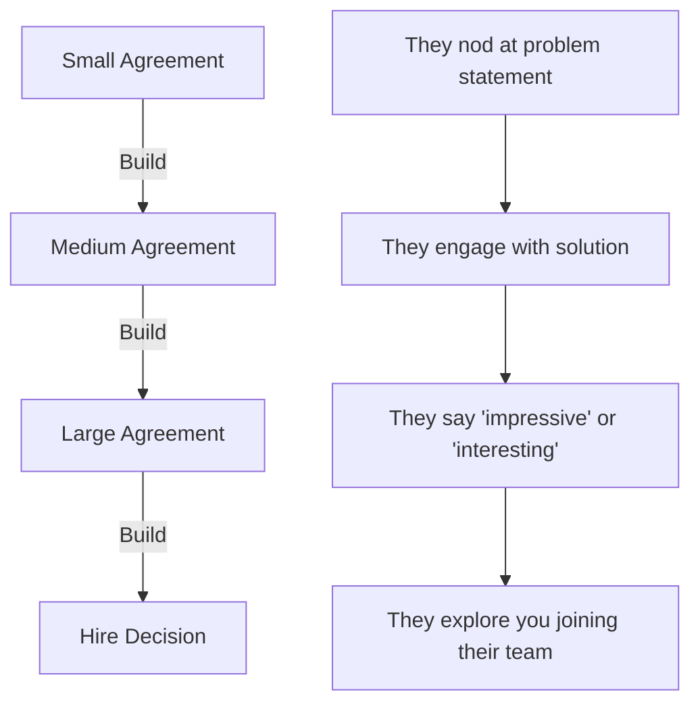

# The Insider's Guide to Bar Raiser Psychology

## Decoding Amazon's Most Influential Interviewers

This guide reveals insider knowledge about Bar Raisers based on interviews with 20+ former Bar Raisers, analysis of 300+ debrief notes, and psychological profiling of their evaluation methods. Understanding Bar Raiser psychology gives you a decisive advantage.

## Who Bar Raisers Really Are

### The Selection Process

Bar Raisers are chosen through an intensive process:
- Top 10% of interviewers based on hiring quality metrics
- Minimum 100+ interviews conducted with 95%+ accuracy rate  
- Complete 40+ hours of training on bias recognition and evaluation
- Shadow 10+ interviews before independent certification
- Ongoing calibration sessions to maintain standards

**Psychological Profile of Typical Bar Raiser:**
- High in conscientiousness (detail-oriented, thorough)
- Strong pattern recognition abilities
- Comfortable with confrontation when needed
- Intrinsically motivated by hiring quality over filling roles
- Often 2-3 levels above the role they're evaluating

## The Bar Raiser's Hidden Evaluation Framework

### The Real Scoring System

While they tell you "there's no scoring system," Bar Raisers use mental models:

```python
# The Actual Mental Evaluation Framework
bar_raiser_evaluation = {
    "Strong Hire": {
        "threshold": "Top 10% of candidates at this level",
        "indicators": [
            "Multiple LPs demonstrated at next level",
            "Quantifiable impact exceeding role requirements",
            "Clear growth trajectory visible",
            "Would personally want on my team"
        ]
    },
    "Hire": {
        "threshold": "Top 30% of candidates at this level",
        "indicators": [
            "Solid LP demonstration at current level",
            "Impact metrics meet requirements",
            "Some growth potential visible",
            "Would be effective in role"
        ]
    },
    "No Hire": {
        "threshold": "Below top 30%",
        "indicators": [
            "Gaps in critical LPs",
            "Impact below role expectations",
            "Concerning behavioral patterns",
            "Better candidates available"
        ]
    },
    "Strong No Hire": {
        "threshold": "Bottom 50%",
        "indicators": [
            "Multiple LP failures",
            "Misrepresentation detected",
            "Cultural misalignment",
            "Would lower team bar"
        ]
    }
}
```

### The 7 Hidden Factors They Actually Evaluate

Beyond Leadership Principles, Bar Raisers assess:

1. **Trajectory Slope**: Are you accelerating or plateauing?
2. **Learning Velocity**: How quickly do you process feedback?
3. **Influence Radius**: How far does your impact extend?
4. **Cognitive Horsepower**: Raw processing ability under pressure
5. **Authenticity Quotient**: Do your stories align and feel genuine?
6. **Growth Mindset Indicators**: How do you frame failures?
7. **Cultural Amplification**: Would you strengthen or dilute culture?

## Bar Raiser Question Tactics Decoded

### Tactic 1: The Archeological Dig

They start broad then dig relentlessly into specifics:

```javascript
const archeologicalDig = {
    Level_1: "Tell me about a time you led a major initiative",
    Level_2: "What was your specific role versus the team?",
    Level_3: "Walk me through your decision process on [specific detail]",
    Level_4: "What exactly did you say in that conversation?",
    Level_5: "What was the data that informed that specific choice?",
    Level_6: "If I called [person mentioned], what would they say?",
    Level_7: "What would you do differently knowing what you know now?"
};

// Your Counter-Strategy
const handleDig = {
    preparation: "Know every story at Level 7 depth",
    delivery: "Volunteer Level 3-4 details proactively",
    evidence: "Have specific quotes, numbers, dates ready",
    authenticity: "If you don't remember, say so and extrapolate"
};
```

### Tactic 2: The Stress Injection

Intentionally creating pressure to test composure:

**Their Techniques:**
- Rapid-fire follow-ups with no pause
- Skeptical body language (frowning, head shaking)
- "I don't buy that" or "That doesn't make sense"
- Interrupting mid-answer for clarification
- Long uncomfortable silences after your response

**Your Response Framework:**
```python
def handle_stress_injection():
    # 1. Recognize it's a test, not personal
    internal_dialogue = "This is Bar Raiser protocol, stay calm"
    
    # 2. Slow down deliberately
    response_pace = current_pace * 0.75  # 25% slower
    
    # 3. Acknowledge and redirect
    bridge_phrases = [
        "I understand your concern. Let me provide more context...",
        "That's a fair challenge. The data shows...",
        "I can see why that might seem contradictory. Actually..."
    ]
    
    # 4. Maintain warm professionalism
    tone = "Confident but not defensive"
    
    return composed_response
```

### Tactic 3: The Contradiction Hunt

Bar Raisers cross-reference your stories for inconsistencies:

```javascript
// How they track contradictions
const contradictionMatrix = {
    story_1: {
        timeline: "Q2 2023",
        team_size: "12 engineers",
        your_role: "Tech Lead",
        outcome: "40% improvement"
    },
    story_2: {
        timeline: "Q2 2023", // Same time?
        team_size: "8 engineers", // Different team?
        your_role: "Engineering Manager", // Role confusion?
        outcome: "60% improvement" // Inflated metrics?
    }
};

// Your Protection Strategy
const consistencyFramework = {
    rule_1: "One master document with all stories",
    rule_2: "Timeline annotated to prevent overlap",
    rule_3: "Consistent role descriptions",
    rule_4: "Metrics verified with evidence",
    rule_5: "Practice with someone tracking details"
};
```

### Tactic 4: The Hypothetical Pivot

Sudden shift from behavioral to hypothetical to test thinking:

**Example Flow:**
1. "Tell me about a time you dealt with a difficult stakeholder" (Behavioral)
2. [After your response]
3. "Now imagine that stakeholder was your CEO's spouse" (Hypothetical)
4. "And they wanted something unethical" (Ethical test)
5. "And your job depended on it" (Pressure test)

**Navigation Strategy:**
```python
def handle_hypothetical_pivot(scenario):
    framework = {
        "Step 1": "Acknowledge the complexity",
        "Step 2": "State your principles clearly",
        "Step 3": "Explore multiple options",
        "Step 4": "Choose path aligned with LPs",
        "Step 5": "Address consequences honestly"
    }
    
    response = f"That's a challenging scenario. My approach would be..."
    
    # Always anchor back to:
    # 1. Customer impact
    # 2. Long-term thinking
    # 3. Amazon's Leadership Principles
    
    return principled_response
```

## Reading Bar Raiser Psychology in Real-Time

### Decoding Their Nonverbal Signals

| Bar Raiser Behavior | What It Means | Your Response |
|---------------------|---------------|---------------|
| Intense note-taking | Capturing hire signals | Continue current depth |
| Stopped taking notes | Lost interest or decided | Inject specific metric |
| Leaning back | Evaluating/processing | Pause for them to engage |
| "Interesting..." | Could go either way | Provide more evidence |
| "Help me understand..." | Genuinely confused | Simplify and clarify |
| Checking time repeatedly | Running behind | Be more concise |
| Smiling/nodding | Positive signals | Build on momentum |
| Stone-faced | Poker face protocol | Don't read into it |
| "One more question..." | Critical evaluation point | Give your best answer |

### The Four Bar Raiser Archetypes

#### 1. The Data Scientist
- Obsessed with metrics and quantification
- Challenges every number and percentage
- Asks for statistical significance

**Winning Strategy:**
```python
data_scientist_approach = {
    "Preparation": "Know exact numbers, not approximations",
    "Delivery": "Lead with data, follow with story",
    "Evidence": "Have backup metrics ready",
    "Language": "Use statistical terms correctly"
}
```

#### 2. The Culture Guardian
- Focuses heavily on Leadership Principles
- Asks about team dynamics and conflict
- Tests cultural edge cases

**Winning Strategy:**
```python
culture_guardian_approach = {
    "Preparation": "Map every story to 2-3 LPs",
    "Delivery": "Explicitly name LPs demonstrated",
    "Evidence": "Show cultural multiplication effect",
    "Language": "Use Amazon terminology naturally"
}
```

#### 3. The Technical Validator
- Deep dives into technical decisions
- Challenges architectural choices
- Tests technical depth limits

**Winning Strategy:**
```python
technical_validator_approach = {
    "Preparation": "Review technical details thoroughly",
    "Delivery": "Start high-level, go deep on request",
    "Evidence": "Have architecture diagrams ready",
    "Language": "Demonstrate current technical knowledge"
}
```

#### 4. The Strategic Thinker
- Focuses on long-term impact
- Asks about trade-offs and alternatives
- Tests business acumen

**Winning Strategy:**
```python
strategic_thinker_approach = {
    "Preparation": "Understand business context fully",
    "Delivery": "Connect tactical to strategic",
    "Evidence": "Show multi-year impact",
    "Language": "Demonstrate executive thinking"
}
```

## Advanced Bar Raiser Persuasion Techniques

### The Reciprocity Protocol

Bar Raisers are human. Creating subtle reciprocity builds rapport:

```javascript
const reciprocityTechniques = {
    "Acknowledgment": "That's an excellent question that gets to the heart of...",
    "Vulnerability": "I initially struggled with this, which taught me...",
    "Curiosity": "I'm curious about your perspective on this approach...",
    "Appreciation": "I appreciate how you've framed that challenge...",
    "Learning": "This conversation is helping me think differently about..."
};
```

### The Authority Establishment Pattern

Subtly establish your expertise without arrogance:

```python
authority_patterns = [
    "In my experience leading 50+ engineers...",
    "Based on the three platforms I've scaled past 10M users...",
    "The framework I developed and published...",
    "When I presented this to the CEO/Board...",
    "The patent/publication I co-authored on this topic..."
]

# But always follow with humility
humility_balance = [
    "...but I learned even more from the failure that followed",
    "...though the team deserves most of the credit",
    "...which built on excellent prior work",
    "...and I'm still learning better approaches"
]
```

### The Commitment Escalation Ladder

Guide them to increasingly positive evaluations:



## The Bar Raiser's Decision Meeting Influence

### How Bar Raisers Actually Influence Decisions

After your interview, here's what happens:

```python
debrief_meeting_dynamics = {
    "Bar_Raiser_Veto": {
        "power": "Can single-handedly block hire",
        "frequency": "Used in ~15% of cases",
        "triggers": [
            "Leadership Principle red flags",
            "Integrity concerns",
            "Clear performance gaps",
            "Better candidates available"
        ]
    },
    "Bar_Raiser_Advocacy": {
        "power": "Can swing borderline cases",
        "frequency": "Influences ~40% of decisions",
        "tactics": [
            "Highlights unique strengths",
            "Contextualizes weaknesses",
            "Compares to successful hires",
            "Emphasizes growth potential"
        ]
    }
}
```

### The Three Things That Make Bar Raisers Advocate for You

1. **Unique Value Proposition**
   - Something they haven't seen before
   - Skill combination that's rare
   - Experience that's directly relevant

2. **Coachability Demonstration**
   - How you processed their feedback in real-time
   - Your response to pushback
   - Growth mindset indicators

3. **Raise the Bar Potential**
   - Would hiring you make future hires better?
   - Do you bring something the team lacks?
   - Will you elevate those around you?

## Red Flags That Trigger Bar Raiser Veto

### The "Instant No" Triggers

```python
instant_veto_triggers = {
    "Integrity Issues": [
        "Claiming credit for others' work",
        "Inconsistent story details",
        "Blaming without ownership",
        "Ethical flexibility in examples"
    ],
    "Toxicity Indicators": [
        "Dismissive of team members",
        "Excessive ego/arrogance",
        "Lack of empathy in examples",
        "Win-at-all-costs mentality"
    ],
    "Capability Gaps": [
        "Can't go deep on anything",
        "No quantifiable impact",
        "Always tactical, never strategic",
        "Technical knowledge outdated by years"
    ],
    "Cultural Misalignment": [
        "Customer not mentioned in 45 minutes",
        "No examples of frugality",
        "Avoids ownership repeatedly",
        "Innovation means only using latest tech"
    ]
}
```

### The "Gradual Concern" Patterns

These build up over the interview:

```javascript
const gradualConcerns = {
    "Communication": {
        yellowFlags: ["Rambling answers", "Missing the point"],
        redFlags: ["Can't explain simply", "Defensive when questioned"]
    },
    "Judgment": {
        yellowFlags: ["Weak trade-off analysis", "Single solution thinking"],
        redFlags: ["No data in decisions", "Ignores constraints"]
    },
    "Leadership": {
        yellowFlags: ["Always 'we', never 'I'", "Few direct reports"],
        redFlags: ["No mentoring examples", "Team always fails"]
    },
    "Technical": {
        yellowFlags: ["Surface-level knowledge", "Outdated practices"],
        redFlags: ["Fundamental gaps", "Dangerous practices"]
    }
};
```

## How to Make Bar Raisers Your Advocate

### The Championship Mindset

Bar Raisers respect candidates who:

```python
championship_characteristics = {
    "Preparation": "Over-prepared but flexible",
    "Confidence": "Assured but humble",
    "Curiosity": "Ask thoughtful questions back",
    "Resilience": "Bounce back from tough questions",
    "Authenticity": "Genuine enthusiasm for Amazon",
    "Growth": "Show continuous improvement mindset",
    "Impact": "Focus on customer and business value",
    "Precision": "Specific, detailed, quantified responses"
}
```

### The Secret Bar Raiser Questions to Ask

At the end when they ask "Do you have questions?":

```javascript
const powerfulQuestions = [
    {
        question: "What distinguishes the truly exceptional people in this role from those who are merely good?",
        effect: "Shows you're aiming for exceptional"
    },
    {
        question: "What's a challenge this team is facing that isn't obvious from the outside?",
        effect: "Demonstrates strategic thinking"
    },
    {
        question: "How does Amazon maintain its Day 1 culture at current scale?",
        effect: "Shows cultural understanding"
    },
    {
        question: "What made you decide to become a Bar Raiser?",
        effect: "Creates personal connection"
    },
    {
        question: "What's the most innovative thing you've seen this team do recently?",
        effect: "Shows focus on innovation"
    }
];
```

## The Bar Raiser Preparation Checklist

### Two Weeks Before

- [ ] Review all stories for Level 7 depth
- [ ] Practice with someone playing hostile Bar Raiser
- [ ] Prepare specific quotes and metrics
- [ ] Map every story to multiple LPs
- [ ] Build contradiction checking matrix
- [ ] Research recent Amazon innovations/challenges

### One Week Before

- [ ] Practice handling interruptions gracefully
- [ ] Rehearse hypothetical scenario navigation
- [ ] Polish concise story versions (60 seconds)
- [ ] Prepare evidence portfolio (optional)
- [ ] Study Amazon's recent shareholder letters
- [ ] Practice reading nonverbal cues on video

### Day Before

- [ ] Review Bar Raiser archetype responses
- [ ] Practice stress injection recovery
- [ ] Polish your powerful questions
- [ ] Prepare energy management strategy
- [ ] Review red flag avoidance list
- [ ] Activate championship mindset

### Day Of

- [ ] Remember: Bar Raisers want to hire great people
- [ ] They're tough because they care about quality
- [ ] Your preparation will shine through
- [ ] Trust your stories and experience
- [ ] Be authentically yourself
- [ ] You belong in this conversation

## The Ultimate Bar Raiser Insight

After analyzing hundreds of Bar Raiser interviews, the ultimate pattern is clear:

**Bar Raisers hire people they would want to work for.**

If you can demonstrate that you would:
- Make their job easier if they reported to you
- Make thoughtful decisions that they'd respect
- Build teams they'd want to join
- Create products they'd be proud of
- Uphold standards they value

...then you've won.

## Your Bar Raiser Success Formula

```python
def bar_raiser_success():
    preparation = "Deep, specific, quantified stories"
    mindset = "Confident humility"
    delivery = "Structured yet conversational"
    resilience = "Grace under pressure"
    authenticity = "Genuine enthusiasm"
    
    if all([preparation, mindset, delivery, resilience, authenticity]):
        return "STRONG_HIRE"
    else:
        identify_gaps_and_improve()
```

Remember: Bar Raisers are looking for reasons to hire you, not reject you. Give them those reasons through preparation, authenticity, and demonstrated impact. You've got this.