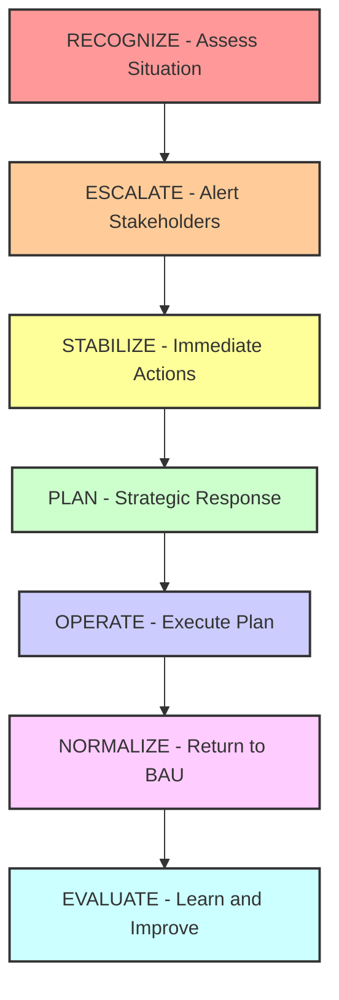

# Crisis Leadership Scenarios for Amazon L6/L7 Engineering Managers

!!! danger "Critical Leadership Scenarios - High-Frequency Interview Topics"
    Crisis leadership is heavily tested in L6/L7 interviews. These scenarios evaluate decision-making under pressure, stakeholder management, and organizational resilience. Master these patterns to demonstrate executive-level leadership capability.

## Why Crisis Leadership is Critical for L6/L7 Roles

### The Reality of Engineering Leadership at Scale

At Amazon's scale, crises are inevitable:

```markdown
**Typical Crisis Frequency for L6/L7 Leaders:**
- Production incidents: 2-3 major incidents per quarter
- Security breaches: 1-2 significant events per year  
- Personnel crises: Team conflicts, performance issues monthly
- Business disruptions: Market changes, competitor actions quarterly
- Technology failures: Infrastructure, third-party dependencies regularly
- Compliance violations: Regulatory, audit findings occasionally
- Public relations crises: Customer complaints, media attention rarely but high impact
```

**Amazon's Expectation for Crisis Leadership:**
- **Immediate Response**: Clear thinking and rapid decision-making under pressure
- **Stakeholder Management**: Coordinating multiple teams and managing up to executives
- **Communication**: Transparent, frequent updates to all affected parties
- **Long-term Thinking**: Balancing immediate fixes with sustainable solutions
- **Learning Culture**: Converting crises into organizational learning opportunities

## Core Crisis Leadership Framework

### The RESPONSE Model for Crisis Management



### Crisis Leadership Competencies by Level

| Competency | L6 Expectation | L7 Expectation |
|-----------|---------------|----------------|
| **Decision Speed** | Minutes to hours | Seconds to minutes |
| **Stakeholder Scope** | Team + adjacent teams | Division + executive level |
| **Impact Management** | $1M+ incidents | $10M+ incidents |
| **Communication** | Clear team updates | Executive briefings + external |
| **Recovery Leadership** | Process improvement | Organizational transformation |

## Production Crisis Scenarios

### Scenario 1: Major Service Outage During Peak Traffic

**Setup:**
> "It's Black Friday at 2 PM EST. Your e-commerce platform is serving 100,000+ requests/second when the recommendation service starts returning 500 errors for 60% of traffic. Customer complaints are flooding in, executives are asking for updates, and revenue is dropping $50,000 per minute. Walk me through your response."

#### Strong L6 Response:

**Immediate Response (0-5 minutes):**
```markdown
1. **Situation Assessment:**
   - Check monitoring dashboards: Error rates, latency, traffic patterns
   - Identify scope: Which services affected, what percentage of users
   - Quick triage: Is this a recommendation service issue or upstream dependency?

2. **Initial Escalation:**
   - Page on-call engineer and senior engineers immediately
   - Alert my manager and adjacent team managers about potential impact
   - Open incident channel (#incident-bf-2023-recs) and war room

3. **Immediate Stabilization:**
   - Decision: Failover to cached recommendations to maintain user experience  
   - Rationale: Revenue preservation over perfect personalization
   - Communicate ETA: "Working on fix, fallback active, investigating root cause"
```

**Strategic Response (5-30 minutes):**
```markdown
4. **Incident Command Structure:**
   - I become Incident Commander coordinating overall response
   - Senior Engineer owns technical investigation and resolution
   - Product Manager handles customer impact communication
   - Engineering Manager from dependent team joins for coordination

5. **Root Cause Investigation:**
   - Check recent deployments: Any changes in last 24 hours
   - Database performance: Connection pool exhaustion, query slowdowns  
   - Infrastructure: Auto-scaling, resource constraints, network issues
   - Traffic patterns: Unexpected load, attack patterns, cache invalidation

6. **Parallel Resolution Tracks:**
   - Track 1: Quick fix - Increase database connection limits, restart services
   - Track 2: Deep investigation - Performance profiling, database analysis
   - Track 3: Communication - Regular updates every 15 minutes to stakeholders
```

**Recovery and Learning (30+ minutes):**
```markdown
7. **Resolution Execution:**
   - Implement quick fix while monitoring impact carefully
   - Gradual traffic restoration: 25%, 50%, 75%, 100% with monitoring
   - Validate metrics: Error rates below 1%, latency within SLA, revenue recovery

8. **Stakeholder Communication:**
   - Executive summary: "Issue resolved, revenue impact $2.1M, root cause identified"
   - Customer communication: Work with customer service on user notifications
   - Team debrief: Initial lessons learned, process improvements identified

9. **Post-Incident Actions:**
   - Schedule blameless post-mortem within 48 hours
   - Action items: Infrastructure improvements, monitoring enhancements
   - Documentation: Runbook updates, escalation process improvements
```

#### Strong L7 Response (Additional Leadership Elements):

**Executive Leadership (L7 Addition):**
```markdown
**Strategic Decision Making:**
- Executive briefing: Called VP within 10 minutes with impact assessment
- Resource mobilization: Pulled engineers from 3 other teams to assist
- Business continuity: Coordinated with Marketing to adjust promotional strategy
- External relations: Worked with PR team on potential media statements

**Organizational Learning:**
- Cross-team analysis: Identified similar vulnerability patterns in 4 other services
- Investment recommendation: $2M infrastructure improvement to prevent recurrence
- Process transformation: Implemented organization-wide peak traffic preparedness
- Industry sharing: Presented lessons learned at internal engineering conference

**Long-term Resilience:**
- Architecture review: Led effort to redesign for better fault isolation
- Capability building: Established center of excellence for peak traffic management
- Vendor relationships: Negotiated better SLAs with cloud provider
- Succession planning: Developed incident response leaders across multiple teams
```

### Scenario 2: Data Breach and Customer Information Exposure

**Setup:**
> "Your team discovers that a misconfigured API endpoint has been publicly exposing customer PII for the past 3 weeks. Approximately 500,000 customer records including names, emails, and purchase history were accessible. You discover this at 9 PM on a Friday. How do you handle this crisis?"

#### Comprehensive Crisis Response:

**Immediate Response (0-30 minutes):**
```markdown
1. **Containment Actions:**
   - Immediately disable the vulnerable API endpoint
   - Verify no other similar vulnerabilities exist in related services
   - Preserve evidence: Log files, access patterns, affected data scope
   - Document timeline: When vulnerability introduced, discovery time

2. **Legal and Compliance Escalation:**
   - Call Legal team emergency contact immediately
   - Notify Chief Information Security Officer (CISO)
   - Alert Compliance team for regulatory notification requirements
   - Contact Public Relations for potential media response preparation

3. **Assessment and Scoping:**
   - Determine exact data exposed: Field-level analysis
   - Identify affected customers: Geographic distribution, account types
   - Analyze access logs: Who accessed data, frequency, patterns
   - Estimate business impact: Regulatory fines, customer churn risk
```

**Strategic Response (30 minutes - 4 hours):**
```markdown
4. **Cross-Functional Crisis Team Assembly:**
   - Security team: Forensic analysis, threat assessment
   - Engineering: Fix implementation, system hardening
   - Legal: Regulatory compliance, liability assessment
   - Customer Service: Communication strategy, support capacity
   - Executive team: Business impact, external communication

5. **Regulatory Compliance:**
   - GDPR notification: 72-hour requirement for EU customers
   - State breach notification laws: California, New York requirements
   - Credit monitoring services: Offer to affected customers
   - Regulatory body coordination: Work with data protection authorities

6. **Technical Remediation:**
   - Security audit: Complete review of all API endpoints
   - Access control review: Permission models, authentication mechanisms
   - Monitoring enhancement: Alerts for unusual data access patterns
   - Code review process: Additional security checks in CI/CD pipeline
```

**Communication and Recovery (4-48 hours):**
```markdown
7. **Customer Communication Strategy:**
   - Drafted customer notification email within 4 hours
   - Multi-channel communication: Email, app notification, website banner
   - Customer service preparation: FAQ, training, additional capacity
   - Transparency approach: Clear explanation, steps taken, prevention measures

8. **Stakeholder Management:**
   - Executive updates: Hourly briefings during first 12 hours
   - Board notification: Risk committee briefing within 24 hours
   - Investor relations: SEC disclosure evaluation, analyst communication
   - Employee communication: All-hands meeting on security practices

9. **Business Continuity:**
   - Customer retention strategy: Service credits, enhanced security features
   - Revenue impact assessment: Churn modeling, recovery timeline
   - Competitive response: Anticipate competitor reactions, differentiation strategy
   - Partner ecosystem: Notify integration partners of potential impact
```

**Long-term Transformation (1+ weeks):**
```markdown
10. **Organizational Learning:**
    - Root cause analysis: Development process gaps, review failures
    - Security culture transformation: Training, awareness, accountability
    - Tool and process improvements: Automated security scanning, pen testing
    - Industry best practice adoption: Zero-trust architecture, data classification

11. **Leadership Development:**
    - Crisis response training: Tabletop exercises, simulation training
    - Cross-team collaboration: Incident response team structure
    - External expertise: Security consultants, legal counsel relationships
    - Succession planning: Crisis leadership capability across organization
```

## People and Organizational Crises

### Scenario 3: Key Senior Engineer Leaving During Critical Project

**Setup:**  
> "Your most senior engineer, who designed the core architecture for your team's $50M revenue-generating platform, just gave 2 weeks notice. They're joining a competitor and taking another engineer with them. The platform launch is in 6 weeks, and you have no documentation of the core systems. How do you handle this crisis?"

#### Strategic People Crisis Response:

**Immediate Damage Control (Days 1-3):**
```markdown
1. **Knowledge Transfer Emergency:**
   - Schedule intensive documentation sessions: 4 hours daily with departing engineer
   - Record architecture walkthroughs: Video sessions for complex components
   - Identify critical knowledge gaps: Systems only they understand
   - Cross-train remaining team members: Pair programming intensive sessions

2. **Retention and Morale Management:**
   - One-on-one meetings with all team members: Assess risk of additional departures
   - Transparent communication: Address team concerns without disparaging departing members
   - Immediate retention actions: Spot bonuses, promotion discussions, workload adjustments
   - Escalate to HR: Counter-offer evaluation, retention package development

3. **Project Risk Assessment:**
   - Technical risk evaluation: Components most vulnerable to knowledge loss
   - Timeline risk analysis: Can launch proceed as planned or need adjustment?
   - Resource reallocation: Pull engineers from lower-priority projects
   - Stakeholder communication: Inform leadership of potential impact and mitigation plans
```

**Strategic Response (Weeks 1-2):**
```markdown
4. **Technical Continuity Plan:**
   - Architecture documentation sprint: Engage technical writers, diagramming tools
   - Code review and commenting: Force documentation of complex algorithms
   - External consultation: Bring in architects from other teams for knowledge gaps
   - Redundant expertise: Ensure at least 2 people understand each critical component

5. **Team Restructuring:**
   - Promote internal senior engineer to tech lead role
   - Redistribute responsibilities based on individual strengths
   - Bring in temporary contractors: Fill specific skill gaps quickly
   - Cross-team collaboration: Borrow expertise from adjacent teams

6. **Stakeholder Management:**
   - Executive communication: Risk assessment, mitigation plans, timeline impact
   - Product team coordination: Feature prioritization, scope adjustments
   - Customer communication: Transparent about potential delays without creating panic
   - Legal consultation: Non-compete enforcement, IP protection evaluation
```

**Long-term Resilience Building (Months 1-6):**
```markdown
7. **Process Improvement:**
   - Documentation standards: Mandatory architecture documentation for all projects
   - Knowledge sharing culture: Regular tech talks, architecture reviews
   - Cross-training programs: Rotate responsibilities, pair programming requirements
   - Succession planning: Identify and develop multiple experts for each critical area

8. **Talent Pipeline Development:**
   - Aggressive hiring: Fill open roles with senior talent quickly
   - Internal development: Mentorship programs, technical leadership tracks
   - University partnerships: Internship programs, new grad pipelines
   - External networks: Industry relationships, conference participation

9. **Organizational Learning:**
   - Bus factor analysis: Identify other single points of failure
   - Retention strategy review: Compensation, growth opportunities, work satisfaction
   - Competition analysis: Understanding market dynamics, talent flows
   - Culture enhancement: Build stronger team identity and engagement
```

### Scenario 4: Team Conflict Escalating to HR Investigation

**Setup:**
> "Two senior engineers on your team have been in conflict for months. It started as technical disagreements but has become personal, affecting team productivity. Today, one filed an HR complaint alleging the other created a hostile work environment. The investigation starts Monday, and both engineers are on critical path for a customer deadline. How do you manage this crisis?"

#### Comprehensive People Crisis Management:

**Immediate Response (Day 1):**
```markdown
1. **HR Partnership and Legal Compliance:**
   - Immediate meeting with HR business partner: Understand investigation scope
   - Legal consultation: Ensure compliance with employment law, documentation requirements
   - Temporary work arrangements: Separate reporting structures, minimize direct interaction
   - Evidence preservation: All communications, performance reviews, project documentation

2. **Team Stability and Productivity:**
   - Emergency team meeting: Address elephant in the room without taking sides
   - Work redistribution: Assign critical tasks to other team members temporarily
   - Timeline assessment: Can customer commitment be met with reduced capacity?
   - Stakeholder communication: Inform skip-level manager and product partners of potential impact

3. **Individual Support:**
   - Separate one-on-ones with both engineers: Listen, document, remain neutral
   - Employee assistance program: Offer counseling resources if appropriate
   - Clear expectations: Professional behavior standards during investigation
   - Performance management: Document any work impact objectively
```

**Investigation Management (Weeks 1-4):**
```markdown
4. **Leadership During Investigation:**
   - Full cooperation with HR: Provide objective information, historical context
   - Team communication: Regular updates on process without sharing confidential details
   - Performance monitoring: Maintain objective evaluation of both engineers' work
   - Relationship management: Work with other team leads if engineers have cross-team interactions

5. **Business Continuity:**
   - Resource planning: Bring in contractors or borrow from other teams
   - Customer relationship: Transparent communication about potential delays
   - Technical leadership: Step in personally to bridge any technical gaps
   - Team morale: Focus on positive team activities, celebrate other members' achievements

6. **Organizational Impact:**
   - Culture assessment: Are there systemic issues contributing to conflict?
   - Process evaluation: Code review processes, decision-making structures
   - Training needs: Conflict resolution, communication skills for technical teams
   - Policy review: Team collaboration standards, escalation procedures
```

**Resolution and Recovery (Post-Investigation):**
```markdown
7. **Outcome Management:**
   - HR outcome implementation: Whether discipline, separation, or mediation
   - Team reintegration: If both remain, managed collaboration process
   - Performance reset: Clear expectations, fresh start approach
   - Monitoring plan: Regular check-ins, early warning systems for future conflicts

8. **Cultural Transformation:**
   - Team norms establishment: Collaborative decision-making, respectful disagreement
   - Technical decision processes: Architecture reviews, democratic technical choices
   - Communication training: Difficult conversations, feedback delivery
   - Conflict resolution: Early intervention processes, peer mediation

9. **Prevention and Learning:**
   - Hiring process review: Cultural fit assessment, reference checking improvements
   - Onboarding enhancement: Team collaboration expectations, conflict resolution resources
   - Management training: People leadership skills, early conflict detection
   - Organizational systems: 360 reviews, team health surveys, regular team retrospectives
```

## Business and Strategic Crises

### Scenario 5: Major Customer Threatening to Leave Due to Quality Issues

**Setup:**
> "Your team's platform serves Amazon's largest enterprise customer, generating $100M+ annual revenue. Their CTO calls your VP directly, threatening to switch to a competitor within 30 days due to recent quality issues: 3 major outages in the last month, data inconsistency problems, and slow support responses. You're asked to lead the customer retention effort. How do you handle this?"

#### Enterprise Customer Crisis Management:

**Emergency Response (Days 1-3):**
```markdown
1. **Executive Stakeholder Alignment:**
   - Emergency meeting with VP: Understand full context, customer relationship history
   - Customer account team briefing: Sales, account management, support interaction history
   - Technical assessment: Deep dive on recent issues, root causes, prevention measures
   - Legal and contract review: Terms, penalties, competitive clause analysis

2. **Customer Relationship Stabilization:**
   - Direct outreach to customer CTO: Schedule immediate in-person meeting if possible
   - Technical leadership presentation: I personally present action plan and timeline
   - Escalation commitment: 24/7 dedicated support team, direct line to engineering leadership
   - Interim solutions: Temporary workarounds, additional monitoring, manual processes

3. **Internal Crisis Team Formation:**
   - Cross-functional team: Engineering, Product, Sales, Support, Legal, Executive sponsor
   - Daily standups: Progress updates, roadblock resolution, decision-making
   - Resource prioritization: Pull engineers from other projects to focus on customer issues
   - Communication protocol: Regular updates to executive team, clear escalation paths
```

**Strategic Recovery (Weeks 1-4):**
```markdown
4. **Technical Resolution Plan:**
   - Root cause elimination: Address architectural issues causing outages
   - Quality assurance overhaul: Enhanced testing, staging environment improvements  
   - Data integrity solutions: Automated validation, reconciliation processes
   - Performance optimization: Capacity planning, infrastructure upgrades

5. **Service Excellence Transformation:**
   - Dedicated customer success team: Technical account manager, solution architects
   - Custom SLA agreement: More stringent terms, penalty clauses for Amazon
   - Proactive monitoring: Customer-specific dashboards, predictive alerting
   - Regular business reviews: Monthly technical and strategic alignment meetings

6. **Relationship Rebuilding:**
   - Executive relationship program: Regular CTO-to-CTO meetings, strategic partnership discussions
   - Technical partnership deepening: Joint architecture reviews, roadmap alignment
   - Value demonstration: ROI analysis, benchmark comparisons, future capability previews
   - Trust rebuilding: Transparency in communications, acknowledgment of failures, commitment demonstration
```

**Long-term Partnership (Months 3-12):**
```markdown
7. **Strategic Account Management:**
   - Custom feature development: Invest in customer-specific capabilities
   - Technology roadmap alignment: Include customer requirements in product planning
   - Innovation partnership: Joint research projects, early access to new features
   - Executive advisory role: Customer executives on product advisory board

8. **Organizational Learning:**
   - Customer success process: Replicate successful retention approach for other major accounts
   - Quality culture transformation: Customer impact measurement, quality metrics in team OKRs
   - Proactive relationship management: Early warning systems, regular health checks
   - Cross-team coordination: Improved handoffs, shared accountability for customer success

9. **Competitive Advantage:**
   - Reference customer development: Turn crisis into success story for marketing
   - Case study creation: Document transformation process for sales enablement
   - Industry thought leadership: Share learnings at conferences, establish expertise
   - Partnership ecosystem: Leverage success to attract other enterprise customers
```

## Technology and Infrastructure Crises

### Scenario 6: Critical Third-Party Vendor Suddenly Discontinuing Service

**Setup:**
> "You receive an email at 6 AM that a critical third-party service your platform depends on will be discontinued in 45 days due to their company being acquired. This service processes 80% of your payment transactions worth $500M annually. There's no direct replacement available, and building an in-house solution typically takes 6+ months. How do you handle this crisis?"

#### Vendor Discontinuation Crisis Response:

**Immediate Assessment (Day 1):**
```markdown
1. **Impact Analysis:**
   - Transaction volume analysis: Exactly which transactions affected, revenue at risk
   - System dependency mapping: All services and components using the vendor solution
   - Business continuity assessment: What happens if service stops today vs planned transition
   - Legal review: Contract terms, vendor obligations, potential remedies

2. **Emergency Options Evaluation:**
   - Alternative vendor research: Competitive solutions, capabilities, integration timeline
   - Emergency procurement: Expedited vendor selection process, executive approval
   - Internal capability assessment: Can we build minimum viable replacement quickly?
   - Hybrid approach: Combination of alternatives to cover 80% use case immediately

3. **Crisis Communication:**
   - Executive briefing: Risk assessment, options analysis, resource requirements
   - Stakeholder notification: Dependent teams, business partners, compliance teams
   - Vendor relationship: Negotiate extension, transition support, documentation access
   - Legal escalation: Explore breach of contract, damages, competitive alternatives
```

**Strategic Response (Weeks 1-2):**
```markdown
4. **Multi-Track Solution Strategy:**
   - Track 1: Emergency vendor replacement (30 days) - Cover 60% of transactions
   - Track 2: Internal solution development (90 days) - Long-term strategic control
   - Track 3: Vendor negotiation (ongoing) - Extend timeline, transition support
   - Track 4: Business process adaptation - Reduce dependency, workaround solutions

5. **Resource Mobilization:**
   - Engineering team expansion: Pull from 3 other teams, hire contractors immediately
   - Executive sponsorship: VP-level daily oversight, decision-making authority
   - Vendor partnership: Emergency relationship with 2 alternative providers
   - External consultants: Domain experts, integration specialists, legal counsel

6. **Risk Mitigation:**
   - Rollback planning: Ability to revert changes if alternatives fail
   - Gradual migration: Phase transition to minimize business disruption
   - Monitoring and testing: Comprehensive validation before full cutover
   - Business impact limitation: Customer communication, alternative payment methods
```

**Execution and Learning (Weeks 3-12):**
```markdown
7. **Implementation Excellence:**
   - Daily war room meetings: Progress tracking, roadblock resolution
   - Customer communication: Transparent updates without causing panic
   - Quality assurance: Extensive testing, gradual rollout, rollback procedures
   - Performance monitoring: Transaction success rates, latency, error rates

8. **Strategic Transformation:**
   - Vendor risk assessment: Review all critical dependencies, diversification strategy
   - Build vs buy framework: Strategic decisions on core vs commodity capabilities
   - Partnership governance: Better contracts, SLAs, exit clauses with vendors
   - Internal capability building: Reduce external dependencies for business-critical functions

9. **Organizational Resilience:**
   - Crisis response playbook: Document process for future vendor discontinuation
   - Vendor relationship management: Regular health checks, alternative evaluation
   - Technology strategy: Balance innovation speed with dependency risk
   - Team capability: Cross-training, vendor management expertise, crisis leadership
```

## Crisis Leadership Interview Strategy

### Demonstrating Executive Presence in Crisis Scenarios

**For L6 Candidates:**
```markdown
**Focus Areas:**
- Tactical excellence: Clear, methodical problem-solving approach
- Team coordination: Effective leadership of engineering teams through crisis
- Stakeholder communication: Regular updates, transparent communication
- Learning orientation: Converting crisis into process and system improvements

**Demonstration Techniques:**
- Use specific examples from past experience with concrete outcomes
- Show decision-making framework: How you prioritize, evaluate options, make tough calls
- Emphasize team leadership: How you kept teams focused and motivated during crisis
- Quantify impact: Revenue protected, customer satisfaction maintained, timeline met
```

**For L7 Candidates:**
```markdown
**Additional Focus Areas:**
- Strategic thinking: Long-term implications, organizational transformation
- Executive influence: Managing up, cross-organizational coordination
- Business impact: Revenue, competitive advantage, market position
- Industry leadership: Setting standards, sharing learnings, external influence

**Advanced Demonstration:**
- Multi-stakeholder orchestration: Managing complex relationships during crisis
- Strategic decision trade-offs: Balancing short-term fixes with long-term architecture
- Organizational change: Using crisis as catalyst for cultural transformation
- External influence: Customer relationships, vendor negotiations, industry standards
```

### Common Crisis Leadership Interview Questions

**Behavioral Questions:**
1. "Tell me about a time when you had to make a critical decision with limited information during a crisis."
2. "Describe a situation where you had to coordinate multiple teams during a major incident."
3. "Give me an example of how you communicated with executives during a business-critical outage."
4. "Tell me about a time when a crisis revealed systemic issues in your organization."

**Situational Questions:**
1. "How would you handle a situation where two critical systems fail simultaneously during peak traffic?"
2. "What would you do if you discovered a security vulnerability that requires immediate action but would cause significant business disruption?"
3. "How would you manage a crisis where your team's actions caused a problem for another business unit?"
4. "Describe your approach when a crisis requires sacrificing a major project deadline to ensure system stability."

### Crisis Leadership Success Metrics

**Immediate Response Metrics:**
- Time to containment: How quickly did you stop the bleeding?
- Stakeholder communication: How effectively did you manage expectations?
- Team coordination: How well did you orchestrate response efforts?
- Decision quality: How good were your decisions under pressure?

**Recovery and Learning Metrics:**
- Business impact minimization: Revenue protected, customer satisfaction maintained
- Root cause elimination: How thoroughly did you address underlying issues?
- Process improvement: What systematic improvements resulted from the crisis?
- Organizational learning: How did the crisis strengthen the team/organization?

---

## Crisis Leadership Development Plan

### Building Crisis Leadership Capability

**Immediate Skills (Weeks 1-4):**
- [ ] Study incident response frameworks and best practices
- [ ] Practice stakeholder communication under pressure scenarios  
- [ ] Learn your organization's escalation procedures and contact information
- [ ] Develop personal decision-making framework for high-pressure situations

**Intermediate Skills (Months 1-6):**
- [ ] Participate in or lead incident response exercises and simulations
- [ ] Build relationships with cross-functional partners (Legal, PR, Security)
- [ ] Create and test crisis communication templates and procedures
- [ ] Study crisis case studies from other organizations and industries

**Advanced Skills (Months 6-12):**
- [ ] Lead organization-wide crisis preparedness initiatives
- [ ] Develop crisis leadership capabilities in other team members
- [ ] Create thought leadership content on crisis management best practices
- [ ] Build external network of crisis management experts and peers

---

!!! quote "Crisis Leadership Philosophy"
    "Great leaders are defined not by their ability to avoid crises, but by their ability to lead effectively when crises inevitably occur. The best crisis leaders combine rapid decision-making, clear communication, and long-term thinking to not just resolve the immediate problem, but to strengthen the organization for the future."

---

*Continue your crisis leadership preparation with [Advanced Stakeholder Management](../behavioral/stakeholder-management.md) and [Executive Communication](../behavioral/executive-communication.md)*