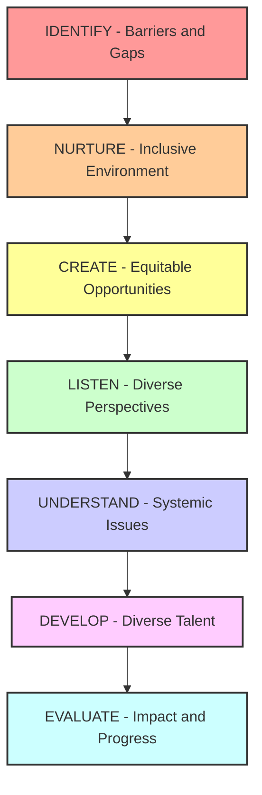

# DEI Leadership for Amazon L6/L7 Engineering Managers

!!! success "DEI Leadership - Critical Competency for 2024-2025"
    Diversity, Equity, and Inclusion leadership is now a core competency for L6/L7 engineering managers at Amazon. Success requires understanding systemic barriers, implementing inclusive practices, and creating environments where all team members can thrive and contribute their best work.

## Why DEI Leadership is Essential for L6/L7 Success

### The Business Case for DEI in Engineering

Amazon's data on DEI impact:

```markdown
**Quantifiable DEI Business Impact:**
- Diverse teams make better decisions: 87% better business outcomes (McKinsey)
- Innovation increase: 70% more likely to capture new markets
- Financial performance: 36% higher profitability with diverse executive teams
- Employee engagement: 67% higher engagement in inclusive environments
- Talent acquisition: 67% of job seekers consider diversity when evaluating companies
- Customer representation: Diverse teams better serve diverse customer bases

**Amazon-Specific DEI Priorities (2024-2025):**
- Technical workforce diversity: 50% underrepresented groups by 2030
- Leadership diversity: 40% diverse representation in L6+ roles
- Pay equity: 100% pay parity across all demographics
- Inclusive culture: 90% employee inclusion survey scores
- Customer impact: Products serving global diverse customer base
```

**L6/L7 DEI Leadership Expectations:**
- **Create Inclusive Teams**: Build psychological safety and belonging for all team members
- **Drive Systemic Change**: Identify and eliminate barriers to inclusion
- **Develop Diverse Talent**: Provide growth opportunities for underrepresented groups
- **Lead Cultural Transformation**: Model inclusive behaviors and hold others accountable
- **Deliver Business Impact**: Leverage diversity for better business outcomes

## DEI Leadership Framework for Engineering Managers

### The INCLUDE Model for DEI Leadership



### DEI Competencies by Level

| Competency | L6 Expectation | L7 Expectation |
|-----------|---------------|----------------|
| **Team Inclusion** | Create inclusive team culture | Transform organizational culture |
| **Bias Awareness** | Identify and address team bias | Eliminate systemic bias patterns |
| **Talent Development** | Develop diverse team members | Build diverse leadership pipeline |
| **Inclusive Hiring** | Hire diverse candidates | Design inclusive hiring systems |
| **Stakeholder Influence** | Influence peer managers | Drive executive-level change |

## Creating Inclusive Engineering Teams

### Building Psychological Safety and Belonging

**1. Inclusive Team Environment Framework:**

```python
inclusive_team_practices = {
    "psychological_safety": {
        "meeting_facilitation": [
            "Round-robin participation in technical discussions",
            "Anonymous feedback collection for architecture decisions", 
            "Dedicated time for all voices in planning meetings",
            "Safe-to-fail experimentation culture"
        ],
        "communication_norms": [
            "Respectful disagreement protocols",
            "Active listening techniques in code reviews",
            "Inclusive language guidelines and enforcement",
            "Multiple communication channels (verbal, written, visual)"
        ],
        "mistake_handling": [
            "Blameless post-mortems for all incidents",
            "Learning-focused approach to errors",
            "Public recognition of failure-to-learning cycles",
            "Support systems for struggling team members"
        ]
    },
    "belonging_initiatives": {
        "cultural_awareness": [
            "Celebrate diverse holidays and cultural events",
            "Share different cultural perspectives in team meetings",
            "Accommodate religious practices and dietary restrictions",
            "Create cultural mentorship partnerships"
        ],
        "professional_support": [
            "Employee resource group sponsorship",
            "Career development tailored to individual backgrounds",
            "Mentorship matching across demographic lines",
            "Speaking and conference opportunities for all team members"
        ]
    }
}
```

**2. Inclusive Decision-Making Processes:**

```markdown
**Technical Decision Inclusion:**

**Architecture Reviews:**
- Diverse review committees: Include different seniority levels and backgrounds
- Multiple perspective requirements: Junior and senior engineer input mandatory
- Cultural context consideration: How decisions impact global user base
- Accessibility-first design: Include accessibility experts in review process

**Code Review Culture:**
- Constructive feedback training: Focus on code, not person
- Mentorship in reviews: Teaching opportunities, not just critique
- Cultural communication differences: Understanding direct vs indirect feedback styles
- Recognition systems: Highlight inclusive review practices

**Project Leadership Rotation:**
- Stretch opportunities: Give leadership chances to underrepresented team members
- Mentorship support: Pair with experienced leaders during rotation
- Success metrics: Measure leadership development across all demographics
- Feedback systems: Regular check-ins on leadership experience quality

**Real-World Example: Inclusive Technical Decision Making**

Context: Choosing technology stack for new microservice

Traditional Approach:
- Senior engineers make decision in private meeting
- Decision announced to team
- Junior engineers implement without input

Inclusive Approach:
- Research phase: All team members research different options
- Presentation opportunity: Each team member presents findings
- Decision matrix: Collaborative evaluation of trade-offs
- Consensus building: Group discussion to alignment
- Implementation ownership: Diverse implementation team leadership
```

### Addressing Unconscious Bias in Engineering Teams

**1. Bias Identification and Mitigation:**

```markdown
**Common Engineering Bias Patterns:**

**Performance Evaluation Bias:**
- Attribution bias: Different explanations for same performance across demographics
- Halo effect: Overall impression influences specific skill assessment
- Recency bias: Overweight recent events vs consistent performance
- Cultural communication bias: Penalizing different communication styles

**Technical Contribution Bias:**
- Visibility bias: Overvaluing loud contributors vs thoughtful analyzers
- Credit attribution: Whose ideas get recognized and implemented
- Risk tolerance: Different comfort levels with giving stretch opportunities
- Meeting participation: Cultural differences in speaking up and interrupting

**Growth Opportunity Bias:**
- Potential assessment: Assumptions about career ambitions and capabilities
- Stretch assignment allocation: Who gets high-visibility projects
- Conference and speaking: Representation in external opportunities
- Leadership pipeline: Who gets mentored for management roles

**Bias Interruption Techniques:**

**Structured Decision Processes:**
- Blind resume reviews: Remove identifying information initially
- Standardized interview questions: Same questions for all candidates
- Multi-perspective evaluation: Require input from diverse evaluation team
- Data-driven assessment: Use objective metrics where possible

**Active Bias Interruption:**
- Meeting facilitation: "Let's hear from someone who hasn't spoken yet"
- Credit attribution: "I want to make sure we credit [person] for this idea"
- Opportunity allocation: "Have we considered [underrepresented person] for this project?"
- Performance discussion: "Let's separate what happened from why we think it happened"
```

**2. Creating Equitable Growth Opportunities:**

```python
equitable_development_framework = {
    "career_development": {
        "individual_development_plans": {
            "personalized_approach": "Understand individual career goals and cultural context",
            "skill_gap_analysis": "Objective assessment of technical and leadership skills",
            "stretch_opportunities": "Rotate high-visibility projects across all team members", 
            "mentorship_matching": "Cross-demographic mentorship relationships",
            "external_development": "Conference attendance, external training opportunities"
        },
        "promotion_readiness": {
            "transparent_criteria": "Clear, documented promotion requirements",
            "skill_demonstration": "Multiple ways to demonstrate competency",
            "advocacy_training": "Help individuals effectively communicate their impact",
            "sponsorship_programs": "Senior leaders actively sponsor diverse talent",
            "feedback_systems": "Regular feedback on promotion progression"
        }
    },
    "leadership_pipeline": {
        "early_identification": "Recognize leadership potential across all backgrounds",
        "leadership_training": "Inclusive leadership development programs",
        "rotation_programs": "Cross-team leadership experience opportunities",
        "succession_planning": "Intentionally diverse successor identification",
        "external_visibility": "Speaking, writing, industry leadership opportunities"
    }
}
```

## Inclusive Hiring and Talent Acquisition

### Building Diverse Engineering Teams

**1. Inclusive Hiring Process Design:**

```markdown
**Comprehensive Inclusive Hiring Framework:**

**Job Description and Sourcing:**
- Inclusive language: Remove gendered language and unnecessary requirements
- Diverse sourcing: Partner with HBCUs, women in tech organizations, international programs
- University relationships: Build partnerships with diverse computer science programs
- Referral program updates: Encourage referrals from underrepresented networks
- Apprenticeship programs: Create pathways for non-traditional backgrounds

**Interview Process Optimization:**
- Diverse interview panels: Include multiple perspectives in all interview loops
- Structured interviews: Standardized questions and evaluation criteria
- Bias training: Regular training for all interviewers on unconscious bias
- Alternative assessment: Portfolio reviews, pair programming, project-based evaluation
- Accessibility accommodations: Ensure process is accessible to all candidates

**Decision-Making and Offers:**
- Calibration sessions: Regularly align on evaluation standards across interviewers
- Holistic evaluation: Consider multiple dimensions beyond just technical skills
- Offer equity: Ensure consistent offer levels for similar backgrounds and experience
- Candidate experience: Gather feedback and continuously improve process
- Follow-up relationships: Maintain connections with strong candidates for future opportunities

**Real-World Example: Inclusive Hiring Transformation**

Before (Traditional Process):
- 85% referrals from existing network
- Single interview format for all candidates
- Unconscious bias in evaluation
- 15% underrepresented hires

After (Inclusive Process Changes):
- 40% sourcing from diverse channels
- Multiple interview format options
- Structured bias interruption training
- 35% underrepresented hires
- Higher retention and engagement scores
```

**2. Onboarding for Inclusion:**

```markdown
**Inclusive Onboarding Program:**

**First Week: Belonging Foundation**
- Cultural introduction: Learn about team's inclusive culture and norms
- Buddy system: Pair with someone from similar background for cultural support
- Accessibility setup: Ensure workspace and tools meet individual needs
- Communication preferences: Understand and accommodate different communication styles
- Early wins: Identify opportunities for immediate positive contribution

**First Month: Integration and Support**
- Mentorship assignment: Connect with senior engineer for technical guidance
- ERG introduction: Connect with relevant Employee Resource Groups
- Feedback systems: Regular check-ins on integration and belonging experience
- Project assignment: Meaningful work that leverages individual strengths
- Team integration: Facilitate natural relationship building with team members

**First Quarter: Growth Planning**
- Career goal alignment: Understand individual ambitions and cultural context
- Skill development plan: Identify growth areas and development opportunities
- Network building: Introductions to broader organizational connections
- Performance expectations: Clear goals and success metrics
- Feedback culture: Establish regular feedback cadence and psychological safety

**Measuring Onboarding Success:**
- Time to productivity: How quickly new hires make meaningful contributions
- Engagement scores: Sense of belonging and team integration
- Retention rates: 6-month, 1-year, and 2-year retention across demographics
- Career progression: Promotion and growth rates for diverse hires
- Cultural integration: Participation in team activities and decision-making
```

### Managing Diverse Global Teams

**1. Cultural Intelligence and Global Inclusion:**

```python
global_team_inclusion = {
    "cultural_competency": {
        "communication_styles": {
            "direct_vs_indirect": "Understand different feedback and critique approaches",
            "high_context_vs_low_context": "Adapt communication based on cultural context",
            "hierarchy_awareness": "Respect different approaches to authority and decision-making",
            "time_orientation": "Balance different approaches to time and scheduling"
        },
        "work_style_accommodation": {
            "individual_vs_collective": "Balance individual recognition with team success",
            "risk_tolerance": "Understand different approaches to uncertainty and change",
            "relationship_building": "Allow time for relationship building in team interactions",
            "conflict_resolution": "Adapt conflict resolution to cultural preferences"
        }
    },
    "inclusive_practices": {
        "meeting_management": {
            "time_zone_rotation": "Rotate meeting times to share inconvenience equally",
            "language_accommodation": "Slow down, use clear language, provide meeting notes",
            "participation_encouragement": "Create multiple ways to contribute and participate",
            "cultural_context": "Share context and background for decisions and discussions"
        },
        "collaboration_tools": {
            "asynchronous_communication": "Use tools that support different time zones and work styles",
            "visual_communication": "Leverage diagrams, screenshots, and visual documentation",
            "translation_support": "Provide translation tools and clear written communication",
            "cultural_calendar": "Acknowledge and plan around different holidays and observances"
        }
    }
}
```

**2. Remote and Hybrid Inclusion:**

```markdown
**Inclusive Remote Team Management:**

**Technology Equity:**
- Equipment access: Ensure all team members have quality technology setup
- Internet reliability: Support team members with connectivity challenges
- Software access: Provide equal access to collaboration and development tools
- Accessibility tools: Ensure remote tools work with assistive technologies

**Communication Inclusion:**
- Multiple communication channels: Synchronous and asynchronous options
- Language support: Translation tools, clear writing, patient communication
- Camera policies: Flexible camera use considering privacy and cultural concerns
- Recording practices: Record meetings for different time zones and learning styles

**Collaboration Equity:**
- Participation opportunities: Ensure remote team members can contribute equally
- Social interaction: Create intentional opportunities for informal relationship building
- Recognition systems: Ensure remote contributions are visible and acknowledged
- Career development: Equal access to growth opportunities regardless of location

**Performance and Evaluation:**
- Outcome-based evaluation: Focus on results rather than hours or visibility
- Regular check-ins: More frequent touch-points to maintain connection and support
- Goal clarity: Extra clear communication of expectations and success metrics
- Development support: Intentional career development conversations and opportunities
```

## DEI Measurement and Accountability

### Metrics and Assessment Framework

**1. Team-Level DEI Metrics:**

```markdown
**Quantitative DEI Measurements:**

**Representation Metrics:**
- Team composition: Demographic breakdown by role, level, and function
- Hiring pipeline: Diverse candidate flow through interview process
- Promotion rates: Advancement rates across different demographic groups
- Retention rates: Voluntary and involuntary turnover by demographic
- Leadership pipeline: Representation in stretch roles and succession planning

**Inclusion Experience Metrics:**
- Engagement survey scores: Sense of belonging and psychological safety
- Meeting participation: Speaking time and contribution patterns analysis
- Recognition patterns: Awards, promotions, and visibility opportunities distribution
- Development opportunities: Training, conference, and growth program participation
- Feedback quality: 360 review scores and peer feedback patterns

**Performance and Impact Metrics:**
- Performance ratings: Consistent evaluation across demographics
- Compensation equity: Pay parity analysis across roles and experience
- Project leadership: Ownership of high-impact initiatives across groups
- Technical contributions: Code commits, design reviews, innovation metrics
- External visibility: Speaking, writing, and industry recognition distribution

**Qualitative DEI Assessment:**

**Focus Group Insights:**
- Belonging experiences: Regular listening sessions with team members
- Barrier identification: Understanding obstacles to full participation
- Culture feedback: Input on team norms and inclusive practices
- Growth experiences: Career development and opportunity access feedback
- Microaggression reporting: Safe reporting and resolution of bias incidents

**Individual Check-ins:**
- Career aspiration discussions: Understanding individual goals and barriers
- Inclusion experience: Regular conversations about belonging and support needs
- Development feedback: Input on growth opportunities and skill development
- Team dynamics: Understanding of interpersonal relationships and collaboration
- Support system assessment: Evaluation of mentorship and sponsorship effectiveness
```

**2. Accountability Systems:**

```python
dei_accountability_framework = {
    "manager_accountability": {
        "performance_goals": {
            "inclusion_metrics": "DEI goals included in manager OKRs and performance reviews",
            "team_diversity": "Targets for team composition and hiring diversity",
            "development_outcomes": "Success in developing diverse talent pipeline",
            "culture_building": "Evidence of inclusive culture creation and maintenance"
        },
        "skill_development": {
            "inclusive_leadership_training": "Regular training on bias interruption and inclusive practices",
            "cultural_competency": "Development in working with diverse and global teams",
            "difficult_conversations": "Skills in addressing bias and inclusion issues",
            "systemic_thinking": "Understanding of organizational barriers and systemic solutions"
        }
    },
    "organizational_systems": {
        "policy_integration": {
            "hiring_practices": "DEI requirements built into recruiting and selection processes",
            "promotion_criteria": "Inclusive leadership competency in advancement requirements",
            "performance_management": "Bias training required for all people managers",
            "compensation_review": "Regular pay equity analysis and correction processes"
        },
        "support_structures": {
            "employee_resource_groups": "Active sponsorship and participation in ERGs",
            "mentorship_programs": "Cross-demographic mentorship and sponsorship initiatives",
            "bias_reporting": "Safe and effective systems for reporting and addressing bias",
            "inclusion_committees": "Cross-functional groups driving organizational change"
        }
    }
}
```

## DEI Crisis and Incident Response

### Handling DEI-Related Issues

**1. Bias Incident Response Framework:**

```markdown
**Immediate Response to Bias Incidents:**

**Initial Assessment (0-24 hours):**
- Incident documentation: Gather facts from all parties involved
- Stakeholder notification: Alert HR, legal, and senior leadership as appropriate
- Immediate support: Provide support resources to affected individuals
- Containment measures: Address any ongoing harm or hostile environment issues

**Investigation Process (1-7 days):**
- Objective fact-finding: Interview all relevant parties and witnesses
- Pattern analysis: Look for systemic issues or recurring problems
- Policy review: Determine if existing policies were violated
- Impact assessment: Understand harm to individuals and team dynamics

**Resolution and Learning (1-4 weeks):**
- Corrective actions: Implement appropriate consequences and remediation
- System improvements: Address any policy or process gaps revealed
- Team healing: Facilitate discussions and rebuild trust if needed
- Prevention measures: Implement changes to prevent similar incidents

**Example: Handling Microaggression in Code Review**

Incident: Senior engineer consistently uses dismissive language when reviewing code from junior women engineers, questioning basic competency in ways not applied to male peers.

Immediate Response:
- Private conversation with affected engineers to gather information
- Review historical code review comments for patterns
- Temporary adjustment of code review assignments while investigating
- Consultation with HR on appropriate response

Investigation Findings:
- Clear pattern of different treatment based on gender
- Impact on confidence and team participation of affected engineers
- Other team members noticed but were unsure how to address

Resolution Actions:
- Direct feedback to senior engineer with behavioral change requirements
- Code review training for entire team on constructive feedback
- Mentorship program pairing senior engineer with inclusive leadership coach
- Regular team discussions on collaborative code review practices

Long-term Prevention:
- Code review guidelines with examples of constructive vs harmful feedback
- Regular team retrospectives including discussion of team dynamics
- 360 feedback process including evaluation of inclusive behaviors
- Clear escalation process for bias concerns
```

**2. Team Conflict Resolution with DEI Lens:**

```markdown
**Inclusive Conflict Resolution Process:**

**Assessment Phase:**
- Cultural context analysis: Understanding different conflict styles and approaches
- Power dynamic evaluation: Consider hierarchical, demographic, and social dynamics
- Communication pattern analysis: Identify cultural differences in conflict expression
- Historical context: Review any patterns of exclusion or bias

**Mediation and Resolution:**
- Culturally competent facilitation: Use approaches that work for all parties
- Multiple perspective validation: Ensure all viewpoints are heard and valued
- Bias interruption: Address any stereotyping or prejudice in the conflict
- Solution co-creation: Develop resolutions that work for different cultural contexts

**Team Integration:**
- Norm establishment: Create explicit inclusive team collaboration agreements
- Cultural bridge building: Help team members understand different perspectives
- Ongoing monitoring: Regular check-ins on relationship and team dynamics
- Prevention systems: Establish early warning and intervention systems

**Real-World Example: Cultural Communication Conflict**

Situation: Direct communication style from Eastern European engineer perceived as rude by American team members; American indirect feedback style perceived as unclear by European engineer.

Traditional Approach: Focus on "professional communication" without cultural context
Inclusive Approach: 
- Education on cultural communication differences
- Explicit discussion of feedback preferences
- Team agreement on communication norms that work for everyone
- Regular check-ins on communication effectiveness

Resolution Outcome:
- Team developed multi-modal feedback approach
- Cultural differences became team strength in global customer interactions
- Improved team performance through better communication clarity
- Model adopted by other teams in organization
```

## DEI Interview Preparation for L6/L7

### Common DEI Leadership Interview Questions

**Behavioral Questions:**

1. **Team Building and Inclusion:**
   > "Tell me about a time when you built a diverse and inclusive team. What specific actions did you take and what were the outcomes?"

**Strong Response Framework:**
```markdown
Situation: Inherited homogeneous team, needed to build inclusive culture while scaling
Task: Increase diversity, create belonging, maintain team performance
Actions:
- Inclusive hiring process redesign with diverse sourcing and interview panels
- Psychological safety initiatives including anonymous feedback and speaking rotation
- Career development programs tailored to individual backgrounds and goals
- Cultural competency training and bias interruption practices
Result: 40% increase in underrepresented hiring, 25% improvement in engagement scores, 30% faster promotion rates for diverse team members
```

2. **Addressing Bias and Discrimination:**
   > "Describe a situation where you had to address bias or discriminatory behavior on your team. How did you handle it?"

**Strong Response Framework:**
```markdown
Situation: Team member making exclusionary comments during technical discussions
Task: Address behavior, support affected individuals, prevent recurrence
Actions:
- Immediate private conversation with individual about impact of behavior
- Support and validation for affected team members
- Team training on inclusive communication and bias interruption
- Regular check-ins and clear expectations for behavioral change
Result: Behavioral change achieved, team psychological safety improved, no similar incidents
```

3. **Creating Inclusive Systems:**
   > "Give me an example of how you identified and eliminated a systemic barrier to inclusion in your organization."

**Strong Response Framework:**
```markdown
Situation: Promotion process inadvertently favoring certain communication styles and backgrounds
Task: Create equitable advancement opportunities for all team members
Actions:
- Data analysis on promotion patterns across demographics
- Structured promotion criteria development with multiple demonstration methods
- Sponsorship program connecting high-potential individuals with senior leaders
- Regular calibration sessions to ensure consistent evaluation standards
Result: 50% increase in diverse promotions, improved retention rates, model adopted organization-wide
```

**Situational Questions:**

4. **Global Team Management:**
   > "How would you manage a team distributed across multiple countries and cultures to ensure everyone can contribute effectively?"

5. **Unconscious Bias Interruption:**
   > "You notice that in team meetings, certain individuals consistently dominate discussions while others rarely speak. How would you address this?"

6. **Inclusive Decision-Making:**
   > "Describe your approach to ensuring diverse perspectives are included in important technical and strategic decisions."

### Demonstrating DEI Leadership Impact

**For L6 Candidates:**
```markdown
**Focus Areas:**
- Team-level inclusion: Creating belonging and psychological safety
- Individual development: Growing diverse talent on your direct team
- Process improvement: Eliminating bias in hiring, evaluation, and development
- Cultural change: Building inclusive team norms and behaviors

**Demonstration Techniques:**
- Specific metrics: Hiring, retention, promotion, and engagement data
- Behavioral examples: Concrete actions taken to address bias and create inclusion
- System changes: Processes and policies implemented to ensure equity
- Development outcomes: Success stories of diverse team members' growth
```

**For L7 Candidates:**
```markdown
**Additional Focus Areas:**
- Organizational transformation: Driving systemic change across multiple teams
- Leadership pipeline: Developing diverse leaders throughout the organization
- Strategic influence: Incorporating DEI into business strategy and decision-making
- Industry leadership: External influence on DEI best practices and standards

**Advanced Demonstration:**
- Cross-organizational impact: Changes that influenced other departments/teams
- Executive partnership: Collaboration with senior leadership on DEI initiatives
- Innovation through diversity: Business outcomes improved through inclusive practices
- Thought leadership: Speaking, writing, or consulting on DEI in technology
```

### DEI Leadership Red Flags in Interviews

**Warning Signs:**
- Treating DEI as "nice to have" rather than business imperative
- Focusing only on hiring without addressing retention and advancement
- Colorblind approach that ignores systemic barriers and different experiences
- Defensive responses about past DEI challenges or feedback
- Inability to articulate specific DEI actions taken or their impact

**How to Avoid:**
- Prepare specific examples with measurable outcomes
- Demonstrate understanding of systemic versus individual solutions
- Show continuous learning and evolution in DEI approach
- Acknowledge challenges while focusing on solutions and growth
- Connect DEI to business outcomes and team performance

## Building Long-term DEI Leadership

### Developing DEI Leadership Skills

**Self-Development Framework:**
```markdown
**Personal DEI Growth Plan:**

**Awareness and Education (Months 1-3):**
- Implicit bias training and regular self-assessment
- Reading: "White Fragility," "The Culture Code," "Multipliers"
- Cultural competency development for global team management
- Active listening and inclusive communication skill building

**Skill Application (Months 4-9):**
- Practice bias interruption in real-time team situations
- Implement inclusive meeting facilitation techniques
- Develop mentorship and sponsorship relationships across demographics
- Create and measure inclusive team goals and practices

**Organizational Impact (Months 10-18):**
- Lead DEI initiative or employee resource group
- Mentor other managers on inclusive leadership practices  
- Contribute to organizational DEI policy and process improvement
- Develop and deliver DEI training or thought leadership content

**Industry Leadership (18+ months):**
- Speak at conferences on inclusive engineering leadership
- Publish articles or research on DEI best practices
- Consult with other organizations on inclusive team building
- Contribute to industry standards and best practices for DEI
```

### Creating Lasting Cultural Change

**Sustainable DEI Integration:**
```python
cultural_change_framework = {
    "systemic_integration": {
        "process_embedding": "Build DEI into all team processes, not separate initiatives",
        "metric_integration": "Include DEI measures in all team and individual performance metrics",
        "policy_alignment": "Ensure all team policies and practices support inclusive outcomes",
        "resource_allocation": "Dedicate time, budget, and people to DEI initiatives"
    },
    "culture_reinforcement": {
        "storytelling": "Share success stories and celebrate inclusive behaviors regularly",
        "recognition_systems": "Reward and recognize inclusive leadership and allyship",
        "norm_establishment": "Make inclusive behaviors the expected standard, not exception",
        "accountability_systems": "Clear consequences for non-inclusive behavior"
    },
    "continuous_improvement": {
        "regular_assessment": "Ongoing measurement and evaluation of DEI progress",
        "feedback_incorporation": "Actively seek and respond to feedback from team members",
        "external_learning": "Continuous education on evolving DEI best practices",
        "adaptation": "Flexible approach that evolves with team needs and industry standards"
    }
}
```

---

## DEI Leadership Success Checklist

### Building Inclusive Engineering Teams

**Immediate Actions (Weeks 1-4):**
- [ ] Assess current team diversity and inclusion baseline metrics
- [ ] Implement psychological safety practices in team meetings and interactions
- [ ] Review and update hiring process for inclusive practices
- [ ] Establish regular one-on-ones focused on career development and inclusion

**30-Day Foundation Building:**
- [ ] Create team charter including explicit inclusion commitments
- [ ] Launch mentorship or sponsorship program for underrepresented team members
- [ ] Implement bias interruption training for yourself and key team members
- [ ] Establish measurement systems for tracking DEI progress

**90-Day Cultural Integration:**
- [ ] Lead cross-functional DEI initiative or employee resource group participation
- [ ] Demonstrate measurable improvement in team diversity and inclusion metrics
- [ ] Develop thought leadership content or training on inclusive engineering practices
- [ ] Create sustainable systems and processes that maintain inclusive culture

---

!!! quote "DEI Leadership Philosophy"
    "The most effective DEI leaders understand that inclusion isn't about being nice or politically correct—it's about creating conditions where every team member can do their best work, contribute their unique perspectives, and drive better business outcomes. True inclusion is a competitive advantage that requires intentional leadership and systemic change."

---

*Continue your DEI leadership development with [Advanced Team Leadership](../behavioral/team-leadership.md) and [Organizational Influence](../behavioral/organizational-influence.md)*