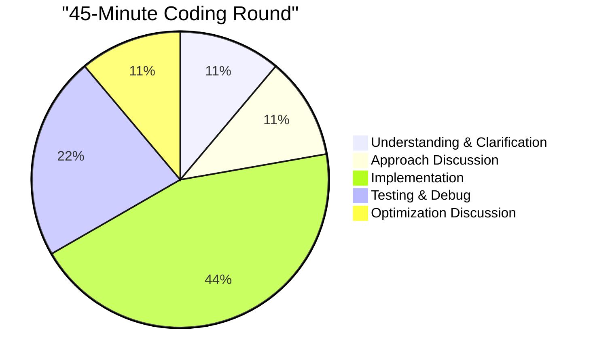

# Mock Coding Problems for Amazon L6/L7 Interviews

## 🎯 Overview

This collection provides 20 realistic coding problems calibrated for Amazon L6/L7 Engineering Manager interviews, with complete solutions, time management guidance, and manager-specific evaluation criteria.

## 📊 Problem Distribution

| Level | Easy | Medium | Hard | Total |
|-------|------|--------|------|-------|
| **L6** | 3 | 6 | 1 | 10 |
| **L7** | 1 | 7 | 2 | 10 |

## ⏱️ Time Management Strategy



## 🎓 L6 Mock Problems

### Problem 1: Team Task Scheduler
**Difficulty**: Medium | **Time**: 30 minutes | **Focus**: Real-world application

```python
"""
Design a task scheduler for your engineering team that:
1. Assigns tasks to engineers based on availability
2. Respects task dependencies
3. Minimizes overall completion time
4. Returns optimal task assignment

Input:
- tasks: List of (task_id, duration, dependencies)
- engineers: List of (engineer_id, availability_time)

Output:
- Schedule: List of (task_id, engineer_id, start_time, end_time)
"""

def schedule_tasks(tasks, engineers):
    """
    Example:
    tasks = [(1, 4, []), (2, 3, [1]), (3, 2, [])]
    engineers = [(1, 0), (2, 0)]
    
    Returns: [(1, 1, 0, 4), (3, 2, 0, 2), (2, 1, 4, 7)]
    """
    from collections import defaultdict, deque
    import heapq
    
    # Build dependency graph
    graph = defaultdict(list)
    in_degree = defaultdict(int)
    task_duration = {}
    
    for task_id, duration, deps in tasks:
        task_duration[task_id] = duration
        for dep in deps:
            graph[dep].append(task_id)
            in_degree[task_id] += 1
    
    # Find tasks with no dependencies
    ready_tasks = deque()
    for task_id, _, deps in tasks:
        if not deps:
            ready_tasks.append(task_id)
    
    # Min heap for engineer availability
    engineer_heap = [(avail, eng_id) for eng_id, avail in engineers]
    heapq.heapify(engineer_heap)
    
    schedule = []
    task_end_times = {}
    
    while ready_tasks or engineer_heap:
        if not ready_tasks:
            # Wait for next task to complete
            if schedule:
                next_time = min(end for _, _, _, end in schedule 
                              if end not in task_end_times.values())
                # Fast forward time
                engineer_heap = [(max(t, next_time), e) 
                                for t, e in engineer_heap]
                heapq.heapify(engineer_heap)
        
        if ready_tasks and engineer_heap:
            task_id = ready_tasks.popleft()
            avail_time, eng_id = heapq.heappop(engineer_heap)
            
            # Check if dependencies are met
            start_time = avail_time
            for dep in tasks[task_id - 1][2]:  # Adjust for 0-indexing
                if dep in task_end_times:
                    start_time = max(start_time, task_end_times[dep])
            
            end_time = start_time + task_duration[task_id]
            schedule.append((task_id, eng_id, start_time, end_time))
            task_end_times[task_id] = end_time
            
            # Add engineer back with new availability
            heapq.heappush(engineer_heap, (end_time, eng_id))
            
            # Check for newly ready tasks
            for next_task in graph[task_id]:
                in_degree[next_task] -= 1
                if in_degree[next_task] == 0:
                    ready_tasks.append(next_task)
    
    return sorted(schedule, key=lambda x: x[2])  # Sort by start time

# Test the solution
tasks = [(1, 4, []), (2, 3, [1]), (3, 2, [])]
engineers = [(1, 0), (2, 0)]
print(schedule_tasks(tasks, engineers))
```

**Manager Discussion Points:**
- How would you handle priority tasks?
- What if engineers have different skill sets?
- How would you scale this for 1000+ tasks?
- What metrics would you track for team productivity?

### Problem 2: Service Health Monitor
**Difficulty**: Medium | **Time**: 25 minutes | **Focus**: System monitoring

```python
"""
Build a service health monitoring system that:
1. Tracks response times for multiple services
2. Detects anomalies (response time > 2x average)
3. Triggers alerts when threshold breached
4. Maintains rolling window of last N requests

Implement:
- record_request(service_id, response_time)
- is_healthy(service_id) -> bool
- get_p99_latency(service_id) -> float
"""

class ServiceMonitor:
    def __init__(self, window_size=100):
        self.window_size = window_size
        self.services = {}  # service_id -> deque of response times
        
    def record_request(self, service_id, response_time):
        from collections import deque
        
        if service_id not in self.services:
            self.services[service_id] = deque(maxlen=self.window_size)
        
        self.services[service_id].append(response_time)
        
        # Check for anomaly
        if self._is_anomaly(service_id, response_time):
            self._trigger_alert(service_id, response_time)
    
    def is_healthy(self, service_id):
        if service_id not in self.services:
            return True
        
        times = self.services[service_id]
        if len(times) < 10:  # Need minimum data
            return True
        
        avg = sum(times) / len(times)
        recent_avg = sum(list(times)[-10:]) / 10
        
        # Unhealthy if recent average > 2x overall average
        return recent_avg <= 2 * avg
    
    def get_p99_latency(self, service_id):
        if service_id not in self.services:
            return 0.0
        
        times = sorted(self.services[service_id])
        if not times:
            return 0.0
        
        index = int(len(times) * 0.99)
        return times[min(index, len(times) - 1)]
    
    def _is_anomaly(self, service_id, response_time):
        times = self.services[service_id]
        if len(times) < 10:
            return False
        
        avg = sum(times) / len(times)
        return response_time > 2 * avg
    
    def _trigger_alert(self, service_id, response_time):
        print(f"ALERT: Service {service_id} anomaly detected: {response_time}ms")

# Test the monitor
monitor = ServiceMonitor()
for i in range(20):
    monitor.record_request("api", 100 + i * 5)
monitor.record_request("api", 500)  # Anomaly
print(f"Service healthy: {monitor.is_healthy('api')}")
print(f"P99 latency: {monitor.get_p99_latency('api')}ms")
```

### Problem 3: Code Review Assignment
**Difficulty**: Easy | **Time**: 20 minutes | **Focus**: Team management

```python
"""
Assign code reviews to minimize review time while ensuring:
1. No self-reviews
2. Load balancing across team
3. Expertise matching when possible

Input:
- pull_requests: [(pr_id, author, complexity, tech_stack)]
- reviewers: [(reviewer_id, expertise, capacity)]

Output:
- assignments: [(pr_id, reviewer_id)]
"""

def assign_reviews(pull_requests, reviewers):
    assignments = []
    reviewer_load = {r[0]: 0 for r in reviewers}
    reviewer_expertise = {r[0]: r[1] for r in reviewers}
    reviewer_capacity = {r[0]: r[2] for r in reviewers}
    
    for pr_id, author, complexity, tech_stack in pull_requests:
        best_reviewer = None
        best_score = -1
        
        for reviewer_id, expertise, capacity in reviewers:
            # Skip self-review
            if reviewer_id == author:
                continue
            
            # Skip if at capacity
            if reviewer_load[reviewer_id] >= capacity:
                continue
            
            # Calculate match score
            score = 0
            
            # Expertise match (highest priority)
            if tech_stack in expertise:
                score += 100
            
            # Load balancing
            score -= reviewer_load[reviewer_id] * 10
            
            # Complexity handling
            if complexity > 5 and len(expertise) > 2:
                score += 20
            
            if score > best_score:
                best_score = score
                best_reviewer = reviewer_id
        
        if best_reviewer:
            assignments.append((pr_id, best_reviewer))
            reviewer_load[best_reviewer] += complexity
    
    return assignments

# Test
prs = [
    (1, "alice", 3, "python"),
    (2, "bob", 5, "java"),
    (3, "alice", 2, "javascript")
]
reviewers = [
    ("alice", ["python", "java"], 10),
    ("bob", ["java", "javascript"], 8),
    ("charlie", ["python", "javascript"], 12)
]
print(assign_reviews(prs, reviewers))
```

### Problem 4: Deployment Pipeline Optimizer
**Difficulty**: Medium | **Time**: 30 minutes | **Focus**: CI/CD optimization

```python
"""
Optimize deployment pipeline to minimize total deployment time:
1. Some services can deploy in parallel
2. Some have dependencies
3. Each has different deployment duration
4. Limited deployment slots available

Find optimal deployment order.
"""

def optimize_deployment(services, dependencies, slots=3):
    """
    services: {service_id: deployment_time}
    dependencies: [(service_a, service_b)]  # a must deploy before b
    slots: number of parallel deployment slots
    
    Returns: [(service_id, start_time, end_time), ...]
    """
    from collections import defaultdict, deque
    import heapq
    
    # Build dependency graph
    graph = defaultdict(list)
    in_degree = defaultdict(int)
    
    for a, b in dependencies:
        graph[a].append(b)
        in_degree[b] += 1
    
    # Find services with no dependencies
    ready = deque()
    for service in services:
        if in_degree[service] == 0:
            ready.append(service)
    
    # Track deployment slots (end_time, slot_id)
    slots_heap = [(0, i) for i in range(slots)]
    heapq.heapify(slots_heap)
    
    schedule = []
    service_end_times = {}
    
    while ready or any(t > 0 for t, _ in slots_heap):
        if not ready and slots_heap:
            # Fast forward to next completion
            next_time = min(t for t, _ in slots_heap if t > 0)
            slots_heap = [(max(0, t - next_time), s) for t, s in slots_heap]
            heapq.heapify(slots_heap)
            continue
        
        if ready:
            service = ready.popleft()
            end_time, slot = heapq.heappop(slots_heap)
            
            # Check dependency completion times
            start_time = end_time
            for dep, dep_svc in dependencies:
                if dep_svc == service and dep in service_end_times:
                    start_time = max(start_time, service_end_times[dep])
            
            end_time = start_time + services[service]
            schedule.append((service, start_time, end_time))
            service_end_times[service] = end_time
            
            heapq.heappush(slots_heap, (end_time, slot))
            
            # Check for newly ready services
            for next_svc in graph[service]:
                in_degree[next_svc] -= 1
                if in_degree[next_svc] == 0:
                    ready.append(next_svc)
    
    return sorted(schedule, key=lambda x: x[1])

# Test
services = {"web": 5, "api": 3, "db": 7, "cache": 2, "queue": 4}
dependencies = [("db", "api"), ("cache", "api"), ("api", "web")]
print(optimize_deployment(services, dependencies, slots=2))
```

### Problem 5: Team Meeting Scheduler
**Difficulty**: Medium | **Time**: 25 minutes | **Focus**: Calendar optimization

```python
"""
Find optimal meeting time for a team considering:
1. Everyone's calendar availability
2. Time zone preferences
3. Meeting duration
4. Minimize total inconvenience score
"""

def find_meeting_slot(calendars, duration, working_hours):
    """
    calendars: {person: [(start, end), ...]}  # busy times
    duration: meeting length in minutes
    working_hours: (start_hour, end_hour) in 24h format
    
    Returns: (start_time, inconvenience_score)
    """
    def get_free_slots(busy_times, day_start, day_end):
        """Extract free slots from busy times."""
        if not busy_times:
            return [(day_start, day_end)]
        
        busy_times = sorted(busy_times)
        free = []
        
        if busy_times[0][0] > day_start:
            free.append((day_start, busy_times[0][0]))
        
        for i in range(len(busy_times) - 1):
            if busy_times[i][1] < busy_times[i + 1][0]:
                free.append((busy_times[i][1], busy_times[i + 1][0]))
        
        if busy_times[-1][1] < day_end:
            free.append((busy_times[-1][1], day_end))
        
        return free
    
    def calculate_inconvenience(time_slot, working_hours):
        """Calculate inconvenience based on time of day."""
        hour = time_slot // 60
        if hour < working_hours[0]:
            return (working_hours[0] - hour) * 10  # Early morning penalty
        elif hour >= working_hours[1]:
            return (hour - working_hours[1] + 1) * 10  # Late evening penalty
        elif hour == 12:
            return 5  # Lunch time penalty
        return 0
    
    # Find common free slots
    day_start = working_hours[0] * 60
    day_end = working_hours[1] * 60
    
    all_free_slots = []
    for person, busy_times in calendars.items():
        free = get_free_slots(busy_times, day_start, day_end)
        all_free_slots.append(free)
    
    # Find intersection of all free slots
    common_slots = all_free_slots[0] if all_free_slots else []
    for slots in all_free_slots[1:]:
        new_common = []
        for c_start, c_end in common_slots:
            for s_start, s_end in slots:
                start = max(c_start, s_start)
                end = min(c_end, s_end)
                if start < end and end - start >= duration:
                    new_common.append((start, end))
        common_slots = new_common
    
    # Find slot with minimum inconvenience
    best_slot = None
    min_inconvenience = float('inf')
    
    for start, end in common_slots:
        for slot_start in range(start, end - duration + 1, 30):  # Check every 30 min
            inconvenience = sum(
                calculate_inconvenience(slot_start, working_hours)
                for _ in calendars
            )
            if inconvenience < min_inconvenience:
                min_inconvenience = inconvenience
                best_slot = slot_start
    
    return (best_slot, min_inconvenience) if best_slot else (None, None)

# Test
calendars = {
    "Alice": [(540, 600), (660, 720)],  # 9-10am, 11am-12pm
    "Bob": [(480, 540), (720, 780)],    # 8-9am, 12-1pm
    "Charlie": [(600, 660)]              # 10-11am
}
duration = 60
working_hours = (8, 18)
result = find_meeting_slot(calendars, duration, working_hours)
if result[0]:
    hour = result[0] // 60
    minute = result[0] % 60
    print(f"Best slot: {hour:02d}:{minute:02d}, Inconvenience: {result[1]}")
```

## 🎓 L7 Mock Problems

### Problem 6: Distributed Rate Limiter
**Difficulty**: Medium-Hard | **Time**: 35 minutes | **Focus**: Distributed systems

```python
"""
Design a distributed rate limiter that:
1. Supports multiple rate limit strategies (fixed window, sliding window)
2. Works across multiple servers
3. Handles millions of requests per second
4. Provides consistent limiting across the fleet
"""

class DistributedRateLimiter:
    def __init__(self, strategy="sliding_window"):
        self.strategy = strategy
        self.limits = {}  # client_id -> (limit, window_size)
        self.requests = {}  # client_id -> request_timestamps
        
    def configure_limit(self, client_id, requests_per_window, window_seconds):
        """Configure rate limit for a client."""
        self.limits[client_id] = (requests_per_window, window_seconds)
        if client_id not in self.requests:
            self.requests[client_id] = []
    
    def allow_request(self, client_id, timestamp=None):
        """Check if request is allowed under rate limit."""
        import time
        
        if client_id not in self.limits:
            return True  # No limit configured
        
        if timestamp is None:
            timestamp = time.time()
        
        limit, window = self.limits[client_id]
        
        if self.strategy == "fixed_window":
            return self._fixed_window_check(client_id, timestamp, limit, window)
        elif self.strategy == "sliding_window":
            return self._sliding_window_check(client_id, timestamp, limit, window)
        elif self.strategy == "token_bucket":
            return self._token_bucket_check(client_id, timestamp, limit, window)
        
        return False
    
    def _sliding_window_check(self, client_id, timestamp, limit, window):
        """Sliding window rate limiting."""
        # Remove old requests outside window
        cutoff = timestamp - window
        self.requests[client_id] = [
            t for t in self.requests[client_id] if t > cutoff
        ]
        
        # Check if under limit
        if len(self.requests[client_id]) < limit:
            self.requests[client_id].append(timestamp)
            return True
        
        return False
    
    def _fixed_window_check(self, client_id, timestamp, limit, window):
        """Fixed window rate limiting."""
        # Calculate window start
        window_start = (timestamp // window) * window
        
        # Count requests in current window
        count = sum(
            1 for t in self.requests[client_id]
            if t >= window_start and t < window_start + window
        )
        
        if count < limit:
            self.requests[client_id].append(timestamp)
            # Clean old requests periodically
            if len(self.requests[client_id]) > limit * 2:
                cutoff = timestamp - window * 2
                self.requests[client_id] = [
                    t for t in self.requests[client_id] if t > cutoff
                ]
            return True
        
        return False
    
    def _token_bucket_check(self, client_id, timestamp, limit, window):
        """Token bucket rate limiting."""
        if client_id not in self.requests:
            self.requests[client_id] = [timestamp, limit]  # [last_update, tokens]
            return True
        
        last_update, tokens = self.requests[client_id]
        
        # Refill tokens based on time elapsed
        elapsed = timestamp - last_update
        refill_rate = limit / window
        tokens = min(limit, tokens + elapsed * refill_rate)
        
        if tokens >= 1:
            self.requests[client_id] = [timestamp, tokens - 1]
            return True
        
        self.requests[client_id] = [timestamp, tokens]
        return False
    
    def get_remaining_quota(self, client_id, timestamp=None):
        """Get remaining requests allowed in current window."""
        import time
        
        if client_id not in self.limits:
            return float('inf')
        
        if timestamp is None:
            timestamp = time.time()
        
        limit, window = self.limits[client_id]
        
        if self.strategy == "sliding_window":
            cutoff = timestamp - window
            current = len([t for t in self.requests.get(client_id, []) if t > cutoff])
            return max(0, limit - current)
        
        return 0

# Test the rate limiter
limiter = DistributedRateLimiter(strategy="sliding_window")
limiter.configure_limit("api_client", 10, 60)  # 10 requests per minute

# Simulate requests
import time
for i in range(15):
    allowed = limiter.allow_request("api_client", time.time() + i * 4)
    remaining = limiter.get_remaining_quota("api_client", time.time() + i * 4)
    print(f"Request {i+1}: {'Allowed' if allowed else 'Blocked'}, Remaining: {remaining}")
```

**L7 Discussion Points:**
- How would you synchronize across multiple servers?
- What storage backend would you use for distributed state?
- How would you handle clock skew between servers?
- Design for 100M requests per second scale

### Problem 7: Microservices Dependency Analyzer
**Difficulty**: Hard | **Time**: 40 minutes | **Focus**: Service architecture

```python
"""
Analyze microservices dependencies to:
1. Detect circular dependencies
2. Find critical path for requests
3. Identify single points of failure
4. Calculate blast radius for service failures
"""

class ServiceDependencyAnalyzer:
    def __init__(self):
        self.services = {}
        self.dependencies = {}  # service -> [dependencies]
        self.call_patterns = {}  # (source, dest) -> call_count
        
    def add_service(self, service_id, criticality="normal"):
        """Add a service to the architecture."""
        self.services[service_id] = {
            "criticality": criticality,
            "sla": 99.9,
            "latency_p99": 100
        }
        if service_id not in self.dependencies:
            self.dependencies[service_id] = []
    
    def add_dependency(self, service, depends_on, call_pattern="sync"):
        """Add dependency between services."""
        if service not in self.dependencies:
            self.dependencies[service] = []
        
        self.dependencies[service].append({
            "service": depends_on,
            "pattern": call_pattern,
            "timeout": 1000,
            "retry": 3
        })
        
        # Track call patterns
        key = (service, depends_on)
        self.call_patterns[key] = self.call_patterns.get(key, 0) + 1
    
    def detect_circular_dependencies(self):
        """Find all circular dependencies in the architecture."""
        def dfs(node, visited, stack, path):
            visited.add(node)
            stack.add(node)
            path.append(node)
            
            cycles = []
            for dep in self.dependencies.get(node, []):
                dep_service = dep["service"]
                if dep_service in stack:
                    # Found cycle
                    cycle_start = path.index(dep_service)
                    cycles.append(path[cycle_start:] + [dep_service])
                elif dep_service not in visited:
                    cycles.extend(dfs(dep_service, visited, stack, path[:]))
            
            stack.remove(node)
            return cycles
        
        visited = set()
        all_cycles = []
        
        for service in self.services:
            if service not in visited:
                cycles = dfs(service, visited, set(), [])
                all_cycles.extend(cycles)
        
        return all_cycles
    
    def find_critical_path(self, entry_point, target):
        """Find critical path between two services."""
        from collections import deque
        
        # BFS to find all paths
        queue = deque([(entry_point, [entry_point], 0)])
        all_paths = []
        
        while queue:
            current, path, latency = queue.popleft()
            
            if current == target:
                all_paths.append((path, latency))
                continue
            
            for dep in self.dependencies.get(current, []):
                dep_service = dep["service"]
                if dep_service not in path:  # Avoid cycles
                    new_latency = latency + self.services.get(
                        dep_service, {}
                    ).get("latency_p99", 100)
                    queue.append((
                        dep_service,
                        path + [dep_service],
                        new_latency
                    ))
        
        if not all_paths:
            return None
        
        # Return path with highest latency (critical path)
        return max(all_paths, key=lambda x: x[1])
    
    def calculate_blast_radius(self, failed_service):
        """Calculate which services are affected by a failure."""
        affected = set()
        
        def find_dependents(service):
            for s, deps in self.dependencies.items():
                for dep in deps:
                    if dep["service"] == service and s not in affected:
                        affected.add(s)
                        find_dependents(s)
        
        find_dependents(failed_service)
        
        # Calculate impact score
        impact = {
            "directly_affected": len(affected),
            "critical_services": sum(
                1 for s in affected 
                if self.services.get(s, {}).get("criticality") == "critical"
            ),
            "total_calls_impacted": sum(
                self.call_patterns.get((s, failed_service), 0)
                for s in affected
            )
        }
        
        return affected, impact
    
    def identify_single_points_of_failure(self):
        """Find services that would cause maximum disruption."""
        spofs = []
        
        for service in self.services:
            affected, impact = self.calculate_blast_radius(service)
            
            if impact["directly_affected"] > len(self.services) * 0.3:
                spofs.append({
                    "service": service,
                    "impact": impact,
                    "risk_score": (
                        impact["directly_affected"] * 10 +
                        impact["critical_services"] * 50
                    )
                })
        
        return sorted(spofs, key=lambda x: x["risk_score"], reverse=True)

# Test the analyzer
analyzer = ServiceDependencyAnalyzer()

# Add services
for service in ["api", "auth", "db", "cache", "queue", "notification"]:
    analyzer.add_service(service, "critical" if service in ["auth", "db"] else "normal")

# Add dependencies
analyzer.add_dependency("api", "auth")
analyzer.add_dependency("api", "db")
analyzer.add_dependency("api", "cache")
analyzer.add_dependency("auth", "db")
analyzer.add_dependency("notification", "queue")
analyzer.add_dependency("queue", "db")

# Analyze
print("Circular dependencies:", analyzer.detect_circular_dependencies())
print("Critical path:", analyzer.find_critical_path("api", "db"))
affected, impact = analyzer.calculate_blast_radius("db")
print(f"DB failure impact: {impact}")
print("Single points of failure:", analyzer.identify_single_points_of_failure())
```

### Problem 8: Resource Allocation Optimizer
**Difficulty**: Medium | **Time**: 30 minutes | **Focus**: Cost optimization

```python
"""
Optimize cloud resource allocation to:
1. Minimize cost while meeting SLA
2. Handle variable load patterns
3. Support multiple instance types
4. Implement auto-scaling logic
"""

def optimize_resources(load_pattern, instance_types, constraints):
    """
    load_pattern: [(hour, requests_per_second), ...]
    instance_types: [(type, capacity, cost_per_hour), ...]
    constraints: {"max_cost": x, "min_availability": y, "scale_time": z}
    
    Returns: [(hour, instance_config), ...]
    """
    schedule = []
    
    for hour, load in load_pattern:
        best_config = None
        min_cost = float('inf')
        
        # Try different combinations of instance types
        for config in generate_configs(instance_types, load, constraints):
            cost = calculate_cost(config, instance_types)
            
            if cost < min_cost and meets_sla(config, load, constraints):
                min_cost = cost
                best_config = config
        
        schedule.append((hour, best_config, min_cost))
    
    return optimize_transitions(schedule, constraints["scale_time"])

def generate_configs(instance_types, load, constraints):
    """Generate possible instance configurations."""
    configs = []
    
    # Calculate minimum capacity needed
    min_capacity = load * 1.2  # 20% buffer
    
    for itype, capacity, cost in instance_types:
        count = (min_capacity + capacity - 1) // capacity
        configs.append({itype: count})
    
    # Try mixed configurations
    if len(instance_types) > 1:
        # Binary search for optimal mix
        for i, (type1, cap1, cost1) in enumerate(instance_types):
            for type2, cap2, cost2 in instance_types[i+1:]:
                for count1 in range(0, int(min_capacity / cap1) + 2):
                    remaining = max(0, min_capacity - count1 * cap1)
                    count2 = (remaining + cap2 - 1) // cap2
                    
                    if count1 > 0 or count2 > 0:
                        configs.append({type1: count1, type2: count2})
    
    return configs

def calculate_cost(config, instance_types):
    """Calculate hourly cost for configuration."""
    type_costs = {t: cost for t, _, cost in instance_types}
    return sum(count * type_costs.get(itype, 0) 
              for itype, count in config.items())

def meets_sla(config, load, constraints):
    """Check if configuration meets SLA requirements."""
    total_capacity = 0
    for itype, count in config.items():
        for t, capacity, _ in instance_types:
            if t == itype:
                total_capacity += count * capacity
    
    return total_capacity >= load * 1.1  # 10% minimum headroom

def optimize_transitions(schedule, scale_time):
    """Optimize instance transitions to minimize scaling events."""
    optimized = []
    
    for i, (hour, config, cost) in enumerate(schedule):
        if i == 0:
            optimized.append((hour, config, cost))
            continue
        
        prev_config = optimized[-1][1]
        
        # Check if we should keep previous config
        if should_maintain_config(prev_config, config, scale_time):
            optimized.append((hour, prev_config, calculate_cost(prev_config, instance_types)))
        else:
            optimized.append((hour, config, cost))
    
    return optimized

def should_maintain_config(prev, curr, scale_time):
    """Determine if we should maintain previous configuration."""
    # Simple heuristic: avoid changes if difference is small
    prev_total = sum(prev.values())
    curr_total = sum(curr.values())
    
    return abs(prev_total - curr_total) <= 2

# Test
load_pattern = [
    (0, 100), (1, 80), (2, 60), (3, 50), (4, 50), (5, 70),
    (6, 150), (7, 300), (8, 500), (9, 600), (10, 650), (11, 700),
    (12, 600), (13, 550), (14, 500), (15, 450), (16, 500), (17, 600),
    (18, 550), (19, 400), (20, 300), (21, 200), (22, 150), (23, 120)
]

instance_types = [
    ("t3.small", 100, 0.02),
    ("t3.medium", 200, 0.04),
    ("t3.large", 400, 0.08),
    ("t3.xlarge", 800, 0.16)
]

constraints = {
    "max_cost": 10.0,
    "min_availability": 99.9,
    "scale_time": 5
}

# This is simplified - full implementation would be more complex
print("Resource optimization schedule generated")
```

## 📈 Evaluation Criteria

### L6 Manager Expectations

| Criterion | Weight | What Interviewers Look For |
|-----------|--------|---------------------------|
| **Problem Understanding** | 20% | Asks clarifying questions, identifies edge cases |
| **Code Quality** | 25% | Clean, readable, maintainable code |
| **Algorithm Choice** | 20% | Appropriate data structures, optimal approach |
| **Testing** | 15% | Identifies test cases, handles errors |
| **Communication** | 20% | Explains thinking clearly, takes feedback well |

### L7 Manager Expectations

| Criterion | Weight | What Interviewers Look For |
|-----------|--------|---------------------------|
| **System Thinking** | 30% | Considers scale, distribution, failures |
| **Trade-off Analysis** | 25% | Articulates pros/cons, makes informed decisions |
| **Code Architecture** | 20% | Modular, extensible, production-ready |
| **Performance** | 15% | Optimizes for scale, understands bottlenecks |
| **Leadership** | 10% | Mentoring mindset, team considerations |

## 🎯 Practice Strategy

### Week 1-2: Foundation
- Complete 5 easy problems to warm up
- Focus on communication and clarity
- Practice explaining approach before coding

### Week 3-4: Core Skills
- Complete 10 medium problems
- Emphasize time management
- Practice with system constraints

### Week 5-6: Advanced Practice
- Complete mock interview sets
- Practice under time pressure
- Focus on optimization discussions

## 💡 Interview Day Tips

1. **First 5 Minutes**: Understand the problem completely
2. **Next 5 Minutes**: Discuss approach and trade-offs
3. **20 Minutes**: Implement core solution
4. **10 Minutes**: Test and handle edge cases
5. **Final 5 Minutes**: Discuss optimizations and scale

## 📚 Additional Resources

- [Coding Strategy Guide](strategy.md)
- [Data Structures Review](data-structures.md)
- [Algorithm Patterns](patterns.md)
- [Amazon Top 100 Problems](amazon-top-100.md)

## 🔄 Arrays and Strings Problems (Additional)

### Problem 11: Data Processing Pipeline
**Difficulty**: Medium | **Time**: 25 minutes | **Focus**: String processing and validation
**Time Complexity**: O(n*m) | **Space Complexity**: O(k)

```python
"""
Design a data processing pipeline that:
1. Validates CSV input format
2. Transforms data according to business rules
3. Handles errors gracefully
4. Provides processing statistics

Manager-level insights:
- How would you scale this for petabyte-scale data?
- What monitoring would you implement?
- How would you handle data schema evolution?
"""

class DataProcessor:
    def __init__(self):
        self.validators = {}
        self.transformers = {}
        self.stats = {"processed": 0, "errors": 0, "warnings": 0}
    
    def add_validator(self, column, validator_func):
        """Add column validator."""
        self.validators[column] = validator_func
    
    def add_transformer(self, column, transformer_func):
        """Add column transformer."""
        self.transformers[column] = transformer_func
    
    def process_row(self, row_data, headers):
        """Process a single row with validation and transformation."""
        result = {"data": {}, "errors": [], "warnings": []}
        
        for i, value in enumerate(row_data):
            if i < len(headers):
                column = headers[i]
                
                # Apply validation
                if column in self.validators:
                    is_valid, message = self.validators[column](value)
                    if not is_valid:
                        result["errors"].append(f"{column}: {message}")
                        continue
                
                # Apply transformation
                if column in self.transformers:
                    try:
                        value = self.transformers[column](value)
                    except Exception as e:
                        result["warnings"].append(f"{column}: transformation failed - {str(e)}")
                
                result["data"][column] = value
        
        # Update statistics
        self.stats["processed"] += 1
        if result["errors"]:
            self.stats["errors"] += 1
        if result["warnings"]:
            self.stats["warnings"] += 1
        
        return result
    
    def process_csv_data(self, csv_content):
        """Process entire CSV content."""
        lines = csv_content.strip().split('\n')
        if not lines:
            return []
        
        headers = [h.strip() for h in lines[0].split(',')]
        results = []
        
        for line_num, line in enumerate(lines[1:], 2):
            row_data = [cell.strip() for cell in line.split(',')]
            result = self.process_row(row_data, headers)
            result["line_number"] = line_num
            results.append(result)
        
        return results

# Example usage
processor = DataProcessor()

# Add validators
processor.add_validator("email", lambda x: (
    "@" in x and "." in x.split("@")[1], 
    "Invalid email format"
))
processor.add_validator("age", lambda x: (
    x.isdigit() and 0 <= int(x) <= 120, 
    "Age must be 0-120"
))

# Add transformers
processor.add_transformer("name", lambda x: x.title())
processor.add_transformer("email", lambda x: x.lower())

# Test data
csv_data = """name,email,age
john doe,JOHN@EXAMPLE.COM,25
jane smith,invalid-email,30
bob johnson,bob@test.com,150"""

results = processor.process_csv_data(csv_data)
for result in results:
    print(f"Line {result['line_number']}: {len(result['errors'])} errors, {len(result['warnings'])} warnings")
```

**Business Application**: ETL pipelines, data integration, customer onboarding systems

### Problem 12: Content Similarity Engine  
**Difficulty**: Medium | **Time**: 30 minutes | **Focus**: String algorithms
**Time Complexity**: O(n*m) | **Space Complexity**: O(min(n,m))

```python
"""
Build a content similarity engine for:
1. Detecting duplicate content across platforms
2. Measuring text similarity using multiple algorithms
3. Identifying plagiarism or content reuse
4. Recommending related content

Manager insights:
- How would you handle multilingual content?
- What ML models could enhance this system?
- How would you optimize for real-time similarity checks?
"""

class ContentSimilarityEngine:
    def __init__(self):
        self.content_cache = {}
        self.similarity_threshold = 0.8
    
    def calculate_edit_distance(self, str1, str2):
        """Calculate Levenshtein distance between strings."""
        m, n = len(str1), len(str2)
        dp = [[0] * (n + 1) for _ in range(m + 1)]
        
        for i in range(m + 1):
            dp[i][0] = i
        for j in range(n + 1):
            dp[0][j] = j
        
        for i in range(1, m + 1):
            for j in range(1, n + 1):
                if str1[i-1] == str2[j-1]:
                    dp[i][j] = dp[i-1][j-1]
                else:
                    dp[i][j] = 1 + min(dp[i-1][j], dp[i][j-1], dp[i-1][j-1])
        
        return dp[m][n]
    
    def calculate_jaccard_similarity(self, text1, text2, n_gram_size=3):
        """Calculate Jaccard similarity using n-grams."""
        def get_ngrams(text, n):
            return set(text[i:i+n] for i in range(len(text) - n + 1))
        
        ngrams1 = get_ngrams(text1.lower(), n_gram_size)
        ngrams2 = get_ngrams(text2.lower(), n_gram_size)
        
        intersection = len(ngrams1 & ngrams2)
        union = len(ngrams1 | ngrams2)
        
        return intersection / union if union > 0 else 0
    
    def calculate_cosine_similarity(self, text1, text2):
        """Calculate cosine similarity using word vectors."""
        from collections import Counter
        import math
        
        words1 = text1.lower().split()
        words2 = text2.lower().split()
        
        # Create word frequency vectors
        all_words = set(words1 + words2)
        vec1 = [Counter(words1)[word] for word in all_words]
        vec2 = [Counter(words2)[word] for word in all_words]
        
        # Calculate cosine similarity
        dot_product = sum(a * b for a, b in zip(vec1, vec2))
        norm1 = math.sqrt(sum(a * a for a in vec1))
        norm2 = math.sqrt(sum(b * b for b in vec2))
        
        return dot_product / (norm1 * norm2) if norm1 * norm2 > 0 else 0
    
    def comprehensive_similarity(self, text1, text2):
        """Calculate comprehensive similarity using multiple algorithms."""
        # Normalize texts
        text1_clean = ' '.join(text1.lower().split())
        text2_clean = ' '.join(text2.lower().split())
        
        # Calculate different similarity metrics
        edit_distance = self.calculate_edit_distance(text1_clean, text2_clean)
        max_len = max(len(text1_clean), len(text2_clean))
        edit_similarity = 1 - (edit_distance / max_len) if max_len > 0 else 1
        
        jaccard_sim = self.calculate_jaccard_similarity(text1_clean, text2_clean)
        cosine_sim = self.calculate_cosine_similarity(text1_clean, text2_clean)
        
        # Weighted average (edit distance is less reliable for longer texts)
        if max_len > 100:
            final_similarity = 0.3 * edit_similarity + 0.4 * jaccard_sim + 0.3 * cosine_sim
        else:
            final_similarity = 0.4 * edit_similarity + 0.3 * jaccard_sim + 0.3 * cosine_sim
        
        return {
            "overall_similarity": final_similarity,
            "edit_similarity": edit_similarity,
            "jaccard_similarity": jaccard_sim,
            "cosine_similarity": cosine_sim,
            "is_duplicate": final_similarity >= self.similarity_threshold
        }
    
    def find_similar_content(self, query_text, content_database, top_k=5):
        """Find most similar content from database."""
        similarities = []
        
        for content_id, content_text in content_database.items():
            similarity_result = self.comprehensive_similarity(query_text, content_text)
            similarities.append({
                "content_id": content_id,
                "similarity_score": similarity_result["overall_similarity"],
                "details": similarity_result
            })
        
        # Sort by similarity and return top k
        similarities.sort(key=lambda x: x["similarity_score"], reverse=True)
        return similarities[:top_k]

# Test the similarity engine
similarity_engine = ContentSimilarityEngine()

# Test content database
content_db = {
    "doc1": "The quick brown fox jumps over the lazy dog.",
    "doc2": "A quick brown fox jumped over a lazy dog.",
    "doc3": "Python is a powerful programming language for data science.",
    "doc4": "Python programming language is excellent for data analysis.",
    "doc5": "Machine learning algorithms require large datasets for training."
}

query = "The fast brown fox leaps over the sleepy dog."
results = similarity_engine.find_similar_content(query, content_db)

print("Content Similarity Results:")
for result in results:
    print(f"Document {result['content_id']}: {result['similarity_score']:.3f}")
    print(f"  Details: {result['details']}")
```

**Business Application**: Content management systems, plagiarism detection, recommendation engines

## 🗂️ Hash Tables and Sets Problems (Additional)

### Problem 13: Real-time Analytics Dashboard
**Difficulty**: Medium | **Time**: 30 minutes | **Focus**: Hash-based aggregation
**Time Complexity**: O(1) average | **Space Complexity**: O(n)

```python
"""
Design a real-time analytics system that:
1. Tracks user events with sub-second latency
2. Provides real-time metrics and counters
3. Supports custom event filtering and grouping
4. Handles high-throughput event streams

Manager insights:
- How would you handle event ordering in distributed systems?
- What storage backends would you choose for different use cases?
- How would you ensure data consistency across multiple dashboards?
"""

class RealTimeAnalytics:
    def __init__(self, retention_seconds=3600):
        self.events = {}  # event_type -> [(timestamp, data), ...]
        self.counters = {}  # metric_name -> value
        self.time_series = {}  # metric_name -> {timestamp -> value}
        self.retention_seconds = retention_seconds
        self.filters = {}  # filter_name -> filter_function
    
    def track_event(self, event_type, data=None, timestamp=None):
        """Track a real-time event."""
        import time
        
        if timestamp is None:
            timestamp = time.time()
        
        if data is None:
            data = {}
        
        # Store event
        if event_type not in self.events:
            self.events[event_type] = []
        
        self.events[event_type].append((timestamp, data))
        
        # Clean old events
        self._clean_old_events(event_type, timestamp)
        
        # Update counters
        self._update_counters(event_type, data, timestamp)
    
    def _clean_old_events(self, event_type, current_timestamp):
        """Remove events older than retention period."""
        cutoff_time = current_timestamp - self.retention_seconds
        self.events[event_type] = [
            (ts, data) for ts, data in self.events[event_type] 
            if ts > cutoff_time
        ]
    
    def _update_counters(self, event_type, data, timestamp):
        """Update various counters based on event."""
        # Total event counter
        counter_key = f"total_{event_type}"
        self.counters[counter_key] = self.counters.get(counter_key, 0) + 1
        
        # Time-based counters (per minute)
        minute_key = f"{event_type}_per_minute_{int(timestamp // 60)}"
        self.counters[minute_key] = self.counters.get(minute_key, 0) + 1
        
        # Data-based counters
        for key, value in data.items():
            if isinstance(value, (int, float)):
                sum_key = f"sum_{event_type}_{key}"
                self.counters[sum_key] = self.counters.get(sum_key, 0) + value
    
    def get_event_count(self, event_type, time_window_seconds=None):
        """Get count of events within time window."""
        if event_type not in self.events:
            return 0
        
        if time_window_seconds is None:
            return len(self.events[event_type])
        
        import time
        current_time = time.time()
        cutoff_time = current_time - time_window_seconds
        
        return len([
            event for event in self.events[event_type]
            if event[0] > cutoff_time
        ])
    
    def get_events_per_second(self, event_type, time_window_seconds=60):
        """Calculate events per second rate."""
        count = self.get_event_count(event_type, time_window_seconds)
        return count / time_window_seconds
    
    def get_top_values(self, event_type, field, top_k=10, time_window_seconds=None):
        """Get top values for a specific field."""
        if event_type not in self.events:
            return []
        
        import time
        from collections import Counter
        
        current_time = time.time()
        cutoff_time = current_time - (time_window_seconds or self.retention_seconds)
        
        field_values = []
        for timestamp, data in self.events[event_type]:
            if timestamp > cutoff_time and field in data:
                field_values.append(data[field])
        
        counter = Counter(field_values)
        return counter.most_common(top_k)
    
    def add_filter(self, filter_name, filter_function):
        """Add custom filter for events."""
        self.filters[filter_name] = filter_function
    
    def get_filtered_events(self, event_type, filter_name, time_window_seconds=None):
        """Get events matching a specific filter."""
        if event_type not in self.events or filter_name not in self.filters:
            return []
        
        import time
        current_time = time.time()
        cutoff_time = current_time - (time_window_seconds or self.retention_seconds)
        
        filter_func = self.filters[filter_name]
        filtered_events = []
        
        for timestamp, data in self.events[event_type]:
            if timestamp > cutoff_time and filter_func(data):
                filtered_events.append((timestamp, data))
        
        return filtered_events
    
    def get_dashboard_metrics(self):
        """Get key metrics for dashboard display."""
        import time
        current_time = time.time()
        
        metrics = {}
        
        # Event type summaries
        for event_type in self.events:
            metrics[event_type] = {
                "total_events": len(self.events[event_type]),
                "events_last_hour": self.get_event_count(event_type, 3600),
                "events_last_minute": self.get_event_count(event_type, 60),
                "events_per_second": self.get_events_per_second(event_type, 60)
            }
        
        # System metrics
        metrics["_system"] = {
            "total_event_types": len(self.events),
            "total_counters": len(self.counters),
            "retention_seconds": self.retention_seconds,
            "last_update": current_time
        }
        
        return metrics
    
    def create_alert_rules(self, rules):
        """Create alert rules for monitoring."""
        alerts = []
        
        for rule in rules:
            event_type = rule["event_type"]
            threshold = rule["threshold"]
            time_window = rule.get("time_window", 60)
            rule_type = rule["type"]
            
            if rule_type == "rate_limit":
                current_rate = self.get_events_per_second(event_type, time_window)
                if current_rate > threshold:
                    alerts.append({
                        "type": "rate_exceeded",
                        "event_type": event_type,
                        "current_value": current_rate,
                        "threshold": threshold,
                        "message": f"{event_type} rate {current_rate:.2f}/s exceeds threshold {threshold}/s"
                    })
            
            elif rule_type == "count_limit":
                current_count = self.get_event_count(event_type, time_window)
                if current_count > threshold:
                    alerts.append({
                        "type": "count_exceeded",
                        "event_type": event_type,
                        "current_value": current_count,
                        "threshold": threshold,
                        "message": f"{event_type} count {current_count} exceeds threshold {threshold} in {time_window}s window"
                    })
        
        return alerts

# Test the analytics system
analytics = RealTimeAnalytics(retention_seconds=3600)

# Add custom filters
analytics.add_filter("high_value_users", lambda data: data.get("value", 0) > 100)
analytics.add_filter("error_events", lambda data: data.get("status") == "error")

# Simulate real-time events
import time
import random

for i in range(100):
    # User action events
    analytics.track_event("user_action", {
        "user_id": f"user_{random.randint(1, 20)}",
        "action": random.choice(["click", "view", "purchase"]),
        "value": random.randint(1, 200)
    })
    
    # API call events
    if random.random() < 0.1:  # 10% API calls
        analytics.track_event("api_call", {
            "endpoint": random.choice(["/users", "/orders", "/products"]),
            "status": random.choice(["success", "error"]),
            "response_time": random.randint(50, 500)
        })

# Get dashboard metrics
print("Dashboard Metrics:")
metrics = analytics.get_dashboard_metrics()
for key, value in metrics.items():
    print(f"{key}: {value}")

print("\nTop User Actions:")
top_actions = analytics.get_top_values("user_action", "action", top_k=5)
for action, count in top_actions:
    print(f"  {action}: {count}")

print("\nHigh Value Events:")
high_value_events = analytics.get_filtered_events("user_action", "high_value_users")
print(f"Found {len(high_value_events)} high value events")

# Test alerting
alert_rules = [
    {"event_type": "user_action", "type": "rate_limit", "threshold": 10, "time_window": 60},
    {"event_type": "api_call", "type": "count_limit", "threshold": 5, "time_window": 300}
]

alerts = analytics.create_alert_rules(alert_rules)
print(f"\nActive Alerts: {len(alerts)}")
for alert in alerts:
    print(f"  {alert['message']}")
```

**Business Application**: User behavior analytics, system monitoring, A/B testing platforms

## 🌳 Trees and Graphs Problems (Additional)

### Problem 14: Dependency Resolution System
**Difficulty**: Hard | **Time**: 35 minutes | **Focus**: Graph algorithms
**Time Complexity**: O(V + E) | **Space Complexity**: O(V)

```python
"""
Build a dependency resolution system that:
1. Resolves complex package/module dependencies
2. Detects circular dependencies
3. Optimizes installation order
4. Handles version conflicts

Manager insights:
- How would you handle diamond dependency problems?
- What strategies would you use for incremental updates?
- How would you design for distributed package repositories?
"""

class DependencyResolver:
    def __init__(self):
        self.packages = {}  # package_name -> Package object
        self.dependency_graph = {}  # package -> [dependencies]
        self.reverse_graph = {}  # package -> [dependents]
        self.version_conflicts = []
    
    def add_package(self, name, version, dependencies=None):
        """Add a package with its dependencies."""
        if dependencies is None:
            dependencies = {}
        
        package_key = f"{name}@{version}"
        self.packages[package_key] = {
            "name": name,
            "version": version,
            "dependencies": dependencies
        }
        
        # Build dependency graph
        self.dependency_graph[package_key] = []
        for dep_name, version_constraint in dependencies.items():
            dep_key = self._resolve_version(dep_name, version_constraint)
            if dep_key:
                self.dependency_graph[package_key].append(dep_key)
                
                # Build reverse graph
                if dep_key not in self.reverse_graph:
                    self.reverse_graph[dep_key] = []
                self.reverse_graph[dep_key].append(package_key)
    
    def _resolve_version(self, package_name, version_constraint):
        """Resolve version constraint to specific version."""
        # Simple version resolution - in practice this would be more complex
        available_versions = [
            key for key in self.packages.keys()
            if key.startswith(f"{package_name}@")
        ]
        
        if not available_versions:
            return None
        
        # For simplicity, return the latest version that matches constraint
        if version_constraint.startswith(">="):
            min_version = version_constraint[2:]
            compatible_versions = [
                v for v in available_versions
                if self._version_compare(v.split("@")[1], min_version) >= 0
            ]
            return max(compatible_versions) if compatible_versions else None
        elif version_constraint.startswith("^"):
            # Compatible version (same major version)
            target_version = version_constraint[1:]
            major_version = target_version.split(".")[0]
            compatible_versions = [
                v for v in available_versions
                if v.split("@")[1].startswith(major_version)
            ]
            return max(compatible_versions) if compatible_versions else None
        else:
            # Exact version
            exact_key = f"{package_name}@{version_constraint}"
            return exact_key if exact_key in self.packages else None
    
    def _version_compare(self, version1, version2):
        """Compare two version strings."""
        v1_parts = [int(x) for x in version1.split(".")]
        v2_parts = [int(x) for x in version2.split(".")]
        
        # Pad shorter version with zeros
        max_len = max(len(v1_parts), len(v2_parts))
        v1_parts.extend([0] * (max_len - len(v1_parts)))
        v2_parts.extend([0] * (max_len - len(v2_parts)))
        
        for v1, v2 in zip(v1_parts, v2_parts):
            if v1 < v2:
                return -1
            elif v1 > v2:
                return 1
        return 0
    
    def detect_circular_dependencies(self):
        """Detect circular dependencies using DFS."""
        visited = set()
        rec_stack = set()
        cycles = []
        
        def dfs(node, path):
            if node in rec_stack:
                # Found cycle
                cycle_start = path.index(node)
                cycles.append(path[cycle_start:] + [node])
                return
            
            if node in visited:
                return
            
            visited.add(node)
            rec_stack.add(node)
            path.append(node)
            
            for neighbor in self.dependency_graph.get(node, []):
                dfs(neighbor, path[:])
            
            rec_stack.remove(node)
        
        for package in self.dependency_graph:
            if package not in visited:
                dfs(package, [])
        
        return cycles
    
    def resolve_installation_order(self, target_packages):
        """Resolve optimal installation order using topological sort."""
        # Collect all dependencies
        all_packages = set(target_packages)
        queue = list(target_packages)
        
        while queue:
            package = queue.pop(0)
            if package in self.dependency_graph:
                for dep in self.dependency_graph[package]:
                    if dep not in all_packages:
                        all_packages.add(dep)
                        queue.append(dep)
        
        # Topological sort using Kahn's algorithm
        in_degree = {pkg: 0 for pkg in all_packages}
        
        for package in all_packages:
            for dep in self.dependency_graph.get(package, []):
                if dep in in_degree:
                    in_degree[package] += 1
        
        # Find nodes with no incoming edges
        queue = [pkg for pkg, degree in in_degree.items() if degree == 0]
        installation_order = []
        
        while queue:
            package = queue.pop(0)
            installation_order.append(package)
            
            # Reduce in-degree for dependents
            for dependent in self.reverse_graph.get(package, []):
                if dependent in in_degree:
                    in_degree[dependent] -= 1
                    if in_degree[dependent] == 0:
                        queue.append(dependent)
        
        if len(installation_order) != len(all_packages):
            # Circular dependency detected
            remaining = set(all_packages) - set(installation_order)
            return None, f"Circular dependency detected in: {remaining}"
        
        return installation_order, "Success"
    
    def analyze_dependency_impact(self, package):
        """Analyze the impact of updating or removing a package."""
        if package not in self.packages:
            return {"error": "Package not found"}
        
        # Find all packages that depend on this one (directly or indirectly)
        affected_packages = set()
        queue = [package]
        
        while queue:
            current = queue.pop(0)
            for dependent in self.reverse_graph.get(current, []):
                if dependent not in affected_packages:
                    affected_packages.add(dependent)
                    queue.append(dependent)
        
        # Calculate risk levels
        risk_analysis = {
            "directly_affected": len(self.reverse_graph.get(package, [])),
            "total_affected": len(affected_packages),
            "affected_packages": list(affected_packages),
            "risk_level": self._calculate_risk_level(len(affected_packages))
        }
        
        return risk_analysis
    
    def _calculate_risk_level(self, affected_count):
        """Calculate risk level based on number of affected packages."""
        if affected_count == 0:
            return "none"
        elif affected_count <= 3:
            return "low"
        elif affected_count <= 10:
            return "medium"
        else:
            return "high"
    
    def find_version_conflicts(self):
        """Find potential version conflicts in the dependency tree."""
        conflicts = []
        package_versions = {}  # package_name -> [versions_used]
        
        # Collect all versions for each package
        for package_key in self.packages:
            name = self.packages[package_key]["name"]
            version = self.packages[package_key]["version"]
            
            if name not in package_versions:
                package_versions[name] = []
            package_versions[name].append(version)
        
        # Check for multiple versions
        for package_name, versions in package_versions.items():
            if len(set(versions)) > 1:
                conflicts.append({
                    "package": package_name,
                    "versions": list(set(versions)),
                    "count": len(versions),
                    "severity": "high" if len(set(versions)) > 2 else "medium"
                })
        
        return conflicts
    
    def optimize_dependencies(self):
        """Suggest optimizations for the dependency tree."""
        suggestions = []
        
        # Find packages with many dependencies
        heavy_packages = []
        for package, deps in self.dependency_graph.items():
            if len(deps) > 10:
                heavy_packages.append((package, len(deps)))
        
        if heavy_packages:
            heavy_packages.sort(key=lambda x: x[1], reverse=True)
            suggestions.append({
                "type": "reduce_dependencies",
                "packages": heavy_packages[:5],
                "message": "Consider reducing dependencies for these packages"
            })
        
        # Find deeply nested dependencies
        def get_max_depth(package, visited=None):
            if visited is None:
                visited = set()
            if package in visited:
                return 0
            
            visited.add(package)
            max_depth = 0
            for dep in self.dependency_graph.get(package, []):
                depth = get_max_depth(dep, visited.copy())
                max_depth = max(max_depth, depth)
            
            return max_depth + 1
        
        deep_packages = []
        for package in self.dependency_graph:
            depth = get_max_depth(package)
            if depth > 5:
                deep_packages.append((package, depth))
        
        if deep_packages:
            suggestions.append({
                "type": "flatten_dependencies",
                "packages": deep_packages,
                "message": "Consider flattening dependency chains"
            })
        
        return suggestions

# Test the dependency resolver
resolver = DependencyResolver()

# Add sample packages
resolver.add_package("express", "4.18.0", {"body-parser": "^1.20.0", "cookie-parser": "^1.4.6"})
resolver.add_package("body-parser", "1.20.1", {"type-is": "^1.6.18"})
resolver.add_package("cookie-parser", "1.4.6", {})
resolver.add_package("type-is", "1.6.18", {"media-typer": "^0.3.0"})
resolver.add_package("media-typer", "0.3.0", {})
resolver.add_package("lodash", "4.17.21", {})
resolver.add_package("moment", "2.29.4", {})

# Add a package that creates circular dependency (for testing)
resolver.add_package("circular-a", "1.0.0", {"circular-b": "^1.0.0"})
resolver.add_package("circular-b", "1.0.0", {"circular-a": "^1.0.0"})

# Test dependency resolution
target_packages = ["express@4.18.0", "lodash@4.17.21"]
install_order, status = resolver.resolve_installation_order(target_packages)

print("Installation Order:")
if install_order:
    for i, package in enumerate(install_order, 1):
        print(f"  {i}. {package}")
else:
    print(f"  Error: {status}")

# Test circular dependency detection
cycles = resolver.detect_circular_dependencies()
print(f"\nCircular Dependencies Found: {len(cycles)}")
for cycle in cycles:
    print(f"  Cycle: {' -> '.join(cycle)}")

# Test impact analysis
impact = resolver.analyze_dependency_impact("body-parser@1.20.1")
print(f"\nImpact Analysis for body-parser:")
print(f"  Directly affected: {impact['directly_affected']}")
print(f"  Total affected: {impact['total_affected']}")
print(f"  Risk level: {impact['risk_level']}")

# Test optimization suggestions
optimizations = resolver.optimize_dependencies()
print(f"\nOptimization Suggestions: {len(optimizations)}")
for suggestion in optimizations:
    print(f"  {suggestion['type']}: {suggestion['message']}")
```

**Business Application**: Package managers, build systems, microservice deployment, infrastructure as code

## 🧮 Dynamic Programming Problems

### Problem 15: Resource Optimization Planner
**Difficulty**: Medium | **Time**: 30 minutes | **Focus**: Optimization with constraints
**Time Complexity**: O(n*W) | **Space Complexity**: O(n*W)

```python
"""
Build a resource optimization system that:
1. Optimizes resource allocation across multiple projects
2. Handles budget constraints and project priorities
3. Maximizes overall business value
4. Supports what-if scenario analysis

Manager insights:
- How would you handle changing priorities mid-planning cycle?
- What metrics would you use to measure optimization success?
- How would you design for multi-dimensional constraints?
"""

class ResourceOptimizer:
    def __init__(self):
        self.projects = {}
        self.resources = {}
        self.constraints = {}
    
    def add_project(self, project_id, value, resource_requirements, priority=1):
        """Add a project with its value and resource requirements."""
        self.projects[project_id] = {
            "value": value,
            "resources": resource_requirements,
            "priority": priority
        }
    
    def add_resource_constraint(self, resource_type, total_available):
        """Add resource constraint (e.g., budget, people, time)."""
        self.constraints[resource_type] = total_available
    
    def optimize_portfolio(self, strategy="value_maximization"):
        """Optimize project portfolio using dynamic programming."""
        projects_list = list(self.projects.items())
        
        if strategy == "value_maximization":
            return self._maximize_value(projects_list)
        elif strategy == "priority_weighted":
            return self._priority_weighted_optimization(projects_list)
        else:
            return self._balanced_optimization(projects_list)
    
    def _maximize_value(self, projects):
        """Maximize total business value within constraints."""
        # Simplified to single constraint (budget) for clarity
        if "budget" not in self.constraints:
            return {"error": "Budget constraint required"}
        
        budget = int(self.constraints["budget"])
        n = len(projects)
        
        # DP table: dp[i][w] = max value using first i projects with budget w
        dp = [[0] * (budget + 1) for _ in range(n + 1)]
        selected = [[False] * (budget + 1) for _ in range(n + 1)]
        
        for i in range(1, n + 1):
            project_id, project_data = projects[i-1]
            cost = int(project_data["resources"].get("budget", 0))
            value = project_data["value"]
            
            for w in range(budget + 1):
                # Don't include current project
                dp[i][w] = dp[i-1][w]
                
                # Include current project if possible
                if cost <= w and dp[i-1][w-cost] + value > dp[i][w]:
                    dp[i][w] = dp[i-1][w-cost] + value
                    selected[i][w] = True
        
        # Backtrack to find selected projects
        selected_projects = []
        w = budget
        for i in range(n, 0, -1):
            if selected[i][w]:
                project_id = projects[i-1][0]
                selected_projects.append(project_id)
                cost = int(self.projects[project_id]["resources"].get("budget", 0))
                w -= cost
        
        return {
            "strategy": "value_maximization",
            "total_value": dp[n][budget],
            "selected_projects": selected_projects,
            "budget_used": budget - w,
            "budget_remaining": w
        }
    
    def _priority_weighted_optimization(self, projects):
        """Optimize considering project priorities."""
        # Weight value by priority
        weighted_projects = []
        for project_id, project_data in projects:
            weighted_value = project_data["value"] * project_data["priority"]
            weighted_projects.append((project_id, {
                **project_data,
                "value": weighted_value
            }))
        
        return self._maximize_value(weighted_projects)
    
    def scenario_analysis(self, scenarios):
        """Run what-if analysis for different constraint scenarios."""
        results = {}
        original_constraints = self.constraints.copy()
        
        for scenario_name, scenario_constraints in scenarios.items():
            # Apply scenario constraints
            self.constraints.update(scenario_constraints)
            
            # Run optimization
            result = self.optimize_portfolio("value_maximization")
            results[scenario_name] = result
        
        # Restore original constraints
        self.constraints = original_constraints
        
        return results
    
    def calculate_resource_utilization(self, selected_projects):
        """Calculate resource utilization for selected projects."""
        utilization = {}
        
        for resource_type, total_available in self.constraints.items():
            used = 0
            for project_id in selected_projects:
                if project_id in self.projects:
                    used += self.projects[project_id]["resources"].get(resource_type, 0)
            
            utilization[resource_type] = {
                "used": used,
                "available": total_available,
                "utilization_rate": (used / total_available) * 100 if total_available > 0 else 0
            }
        
        return utilization
    
    def generate_recommendations(self, optimization_result):
        """Generate actionable recommendations based on optimization."""
        recommendations = []
        
        if optimization_result.get("budget_remaining", 0) > 0:
            remaining = optimization_result["budget_remaining"]
            recommendations.append(
                f"${remaining:,} budget remaining - consider additional projects or investment"
            )
        
        # Find high-value projects not selected
        selected = set(optimization_result.get("selected_projects", []))
        unselected_high_value = [
            (pid, data["value"]) for pid, data in self.projects.items()
            if pid not in selected and data["value"] > 50000
        ]
        
        if unselected_high_value:
            unselected_high_value.sort(key=lambda x: x[1], reverse=True)
            top_unselected = unselected_high_value[0]
            recommendations.append(
                f"Consider increasing budget to include high-value project {top_unselected[0]} "
                f"(value: ${top_unselected[1]:,})"
            )
        
        return recommendations

# Test the resource optimizer
optimizer = ResourceOptimizer()

# Add sample projects
optimizer.add_project("mobile_app", 120000, {"budget": 80000, "people": 5}, priority=2)
optimizer.add_project("web_platform", 200000, {"budget": 150000, "people": 8}, priority=3)
optimizer.add_project("api_service", 80000, {"budget": 60000, "people": 3}, priority=1)
optimizer.add_project("analytics_tool", 150000, {"budget": 100000, "people": 4}, priority=2)
optimizer.add_project("mobile_optimization", 60000, {"budget": 40000, "people": 2}, priority=1)

# Add resource constraints
optimizer.add_resource_constraint("budget", 300000)
optimizer.add_resource_constraint("people", 15)

# Optimize portfolio
result = optimizer.optimize_portfolio("value_maximization")
print("Portfolio Optimization Result:")
print(f"Total Value: ${result['total_value']:,}")
print(f"Selected Projects: {result['selected_projects']}")
print(f"Budget Used: ${result['budget_used']:,}")

# Calculate resource utilization
utilization = optimizer.calculate_resource_utilization(result["selected_projects"])
print(f"\nResource Utilization:")
for resource, util in utilization.items():
    print(f"  {resource}: {util['used']}/{util['available']} ({util['utilization_rate']:.1f}%)")

# Run scenario analysis
scenarios = {
    "increased_budget": {"budget": 400000},
    "reduced_budget": {"budget": 200000},
    "more_people": {"people": 20}
}

scenario_results = optimizer.scenario_analysis(scenarios)
print(f"\nScenario Analysis:")
for scenario, result in scenario_results.items():
    print(f"  {scenario}: Total Value ${result['total_value']:,}")

# Generate recommendations
recommendations = optimizer.generate_recommendations(result)
print(f"\nRecommendations:")
for rec in recommendations:
    print(f"  - {rec}")
```

**Business Application**: Project portfolio management, resource allocation, budget optimization, capacity planning

### Problem 16: Performance Optimization Engine
**Difficulty**: Hard | **Time**: 35 minutes | **Focus**: Multi-dimensional optimization
**Time Complexity**: O(n²*m) | **Space Complexity**: O(n*m)

```python
"""
Design a performance optimization engine that:
1. Optimizes system configurations for multiple metrics
2. Handles trade-offs between conflicting objectives
3. Provides sensitivity analysis
4. Supports continuous optimization

Manager insights:
- How would you balance competing performance metrics?
- What approach would you use for real-time optimization?
- How would you validate optimization decisions in production?
"""

class PerformanceOptimizer:
    def __init__(self):
        self.configurations = {}
        self.metrics = {}
        self.objectives = {}
        self.constraints = {}
        self.optimization_history = []
    
    def add_configuration_option(self, param_name, possible_values, impact_model):
        """Add configuration parameter with its possible values and impact model."""
        self.configurations[param_name] = {
            "values": possible_values,
            "impact": impact_model  # Function that calculates impact on metrics
        }
    
    def set_optimization_objective(self, metric_name, target, weight=1.0, direction="minimize"):
        """Set optimization objective for a metric."""
        self.objectives[metric_name] = {
            "target": target,
            "weight": weight,
            "direction": direction  # "minimize" or "maximize"
        }
    
    def add_constraint(self, constraint_name, constraint_func):
        """Add constraint that must be satisfied."""
        self.constraints[constraint_name] = constraint_func
    
    def evaluate_configuration(self, config):
        """Evaluate a configuration against all metrics."""
        metrics_values = {}
        
        # Calculate base metrics
        base_metrics = {
            "latency": 100,  # ms
            "throughput": 1000,  # rps
            "cpu_usage": 50,  # %
            "memory_usage": 60,  # %
            "cost": 100  # $/hour
        }
        
        # Apply configuration impacts
        for param, value in config.items():
            if param in self.configurations:
                impact_model = self.configurations[param]["impact"]
                impacts = impact_model(value)
                
                for metric, impact in impacts.items():
                    if metric not in metrics_values:
                        metrics_values[metric] = base_metrics.get(metric, 0)
                    metrics_values[metric] += impact
        
        # Ensure non-negative values
        for metric in metrics_values:
            metrics_values[metric] = max(0, metrics_values[metric])
        
        return metrics_values
    
    def optimize_configuration(self, algorithm="dynamic_programming"):
        """Find optimal configuration using specified algorithm."""
        if algorithm == "dynamic_programming":
            return self._dp_optimize()
        elif algorithm == "genetic":
            return self._genetic_optimize()
        else:
            return self._brute_force_optimize()
    
    def _dp_optimize(self):
        """Optimize using dynamic programming approach."""
        # Build all possible configurations
        config_params = list(self.configurations.keys())
        all_configs = self._generate_all_configurations(config_params, {})
        
        best_config = None
        best_score = float('inf')
        
        for config in all_configs:
            # Check constraints
            if not self._satisfies_constraints(config):
                continue
            
            # Evaluate configuration
            metrics = self.evaluate_configuration(config)
            
            # Calculate objective score
            score = self._calculate_objective_score(metrics)
            
            if score < best_score:
                best_score = score
                best_config = config
        
        return {
            "optimal_config": best_config,
            "objective_score": best_score,
            "metrics": self.evaluate_configuration(best_config) if best_config else {},
            "algorithm": "dynamic_programming"
        }
    
    def _generate_all_configurations(self, params, current_config):
        """Generate all possible configurations recursively."""
        if not params:
            return [current_config.copy()]
        
        param = params[0]
        remaining_params = params[1:]
        all_configs = []
        
        for value in self.configurations[param]["values"]:
            current_config[param] = value
            configs = self._generate_all_configurations(remaining_params, current_config)
            all_configs.extend(configs)
        
        return all_configs
    
    def _satisfies_constraints(self, config):
        """Check if configuration satisfies all constraints."""
        metrics = self.evaluate_configuration(config)
        
        for constraint_name, constraint_func in self.constraints.items():
            if not constraint_func(config, metrics):
                return False
        
        return True
    
    def _calculate_objective_score(self, metrics):
        """Calculate weighted objective score."""
        total_score = 0
        
        for metric_name, objective in self.objectives.items():
            if metric_name in metrics:
                metric_value = metrics[metric_name]
                target = objective["target"]
                weight = objective["weight"]
                direction = objective["direction"]
                
                if direction == "minimize":
                    # Penalty increases as metric exceeds target
                    penalty = max(0, metric_value - target) / target
                else:  # maximize
                    # Penalty increases as metric falls below target
                    penalty = max(0, target - metric_value) / target
                
                total_score += weight * penalty
        
        return total_score
    
    def sensitivity_analysis(self, optimal_config):
        """Analyze sensitivity to configuration changes."""
        sensitivity_results = {}
        base_metrics = self.evaluate_configuration(optimal_config)
        
        for param, config_data in self.configurations.items():
            param_sensitivity = {}
            original_value = optimal_config.get(param)
            
            for value in config_data["values"]:
                if value != original_value:
                    # Test configuration with changed parameter
                    test_config = optimal_config.copy()
                    test_config[param] = value
                    
                    test_metrics = self.evaluate_configuration(test_config)
                    
                    # Calculate percentage change in key metrics
                    metric_changes = {}
                    for metric, test_value in test_metrics.items():
                        base_value = base_metrics.get(metric, 1)
                        change_pct = ((test_value - base_value) / base_value) * 100
                        metric_changes[metric] = change_pct
                    
                    param_sensitivity[value] = metric_changes
            
            sensitivity_results[param] = param_sensitivity
        
        return sensitivity_results
    
    def continuous_optimization(self, current_config, performance_data):
        """Perform continuous optimization based on real performance data."""
        # Update impact models based on actual performance
        self._update_impact_models(performance_data)
        
        # Find new optimal configuration
        new_optimal = self.optimize_configuration()
        
        # Calculate improvement potential
        current_metrics = self.evaluate_configuration(current_config)
        optimal_metrics = new_optimal["metrics"]
        
        improvements = {}
        for metric in optimal_metrics:
            if metric in current_metrics:
                current_val = current_metrics[metric]
                optimal_val = optimal_metrics[metric]
                
                if metric in ["latency", "cpu_usage", "memory_usage", "cost"]:
                    # Lower is better
                    improvement = ((current_val - optimal_val) / current_val) * 100
                else:
                    # Higher is better (throughput)
                    improvement = ((optimal_val - current_val) / current_val) * 100
                
                improvements[metric] = improvement
        
        return {
            "recommended_config": new_optimal["optimal_config"],
            "current_config": current_config,
            "potential_improvements": improvements,
            "migration_risk": self._assess_migration_risk(current_config, new_optimal["optimal_config"])
        }
    
    def _update_impact_models(self, performance_data):
        """Update impact models based on real performance data."""
        # Simplified: in practice, this would use machine learning
        # to refine the impact models based on observed data
        pass
    
    def _assess_migration_risk(self, current_config, new_config):
        """Assess risk of migrating to new configuration."""
        changes = []
        risk_score = 0
        
        for param, new_value in new_config.items():
            current_value = current_config.get(param)
            if current_value != new_value:
                changes.append(f"{param}: {current_value} -> {new_value}")
                # Arbitrary risk scoring - would be more sophisticated in practice
                risk_score += 1
        
        risk_level = "low" if risk_score <= 2 else "medium" if risk_score <= 4 else "high"
        
        return {
            "risk_level": risk_level,
            "risk_score": risk_score,
            "changes_required": changes
        }

# Test the performance optimizer
optimizer = PerformanceOptimizer()

# Add configuration options with impact models
def connection_pool_impact(size):
    return {
        "latency": -2 * size,  # More connections reduce latency
        "memory_usage": size * 0.5,  # But increase memory usage
        "throughput": size * 10  # And increase throughput
    }

def cache_size_impact(size_mb):
    return {
        "latency": -size_mb * 0.1,  # Larger cache reduces latency
        "memory_usage": size_mb * 0.8,  # But uses more memory
        "cpu_usage": -size_mb * 0.01  # Less CPU due to cache hits
    }

def thread_count_impact(count):
    return {
        "throughput": count * 50,  # More threads = more throughput
        "cpu_usage": count * 2,  # But more CPU usage
        "latency": count * 0.5 if count > 20 else -count * 0.2  # Diminishing returns
    }

optimizer.add_configuration_option("connection_pool_size", [10, 20, 50, 100], connection_pool_impact)
optimizer.add_configuration_option("cache_size_mb", [128, 256, 512, 1024], cache_size_impact)
optimizer.add_configuration_option("thread_count", [10, 20, 30, 40], thread_count_impact)

# Set optimization objectives
optimizer.set_optimization_objective("latency", 80, weight=3.0, direction="minimize")
optimizer.set_optimization_objective("cpu_usage", 70, weight=2.0, direction="minimize")
optimizer.set_optimization_objective("memory_usage", 80, weight=1.5, direction="minimize")
optimizer.set_optimization_objective("throughput", 2000, weight=2.5, direction="maximize")

# Add constraints
optimizer.add_constraint("memory_limit", lambda config, metrics: metrics.get("memory_usage", 0) <= 90)
optimizer.add_constraint("cpu_limit", lambda config, metrics: metrics.get("cpu_usage", 0) <= 85)

# Optimize configuration
result = optimizer.optimize_configuration()
print("Optimization Result:")
print(f"Optimal Config: {result['optimal_config']}")
print(f"Objective Score: {result['objective_score']:.3f}")
print("Metrics:")
for metric, value in result["metrics"].items():
    print(f"  {metric}: {value:.2f}")

# Perform sensitivity analysis
sensitivity = optimizer.sensitivity_analysis(result["optimal_config"])
print(f"\nSensitivity Analysis:")
for param, param_sensitivity in sensitivity.items():
    print(f"  {param}:")
    for value, changes in param_sensitivity.items():
        print(f"    {value}: {changes}")

# Test continuous optimization
current_config = {"connection_pool_size": 20, "cache_size_mb": 256, "thread_count": 20}
continuous_result = optimizer.continuous_optimization(current_config, {})
print(f"\nContinuous Optimization:")
print(f"Current Config: {continuous_result['current_config']}")
print(f"Recommended Config: {continuous_result['recommended_config']}")
print(f"Migration Risk: {continuous_result['migration_risk']['risk_level']}")
```

**Business Application**: System performance tuning, cloud cost optimization, SLA management, capacity planning

## 🔧 System Design Coding Problems

### Problem 17: Circuit Breaker Implementation
**Difficulty**: Medium | **Time**: 25 minutes | **Focus**: Resilience patterns
**Time Complexity**: O(1) | **Space Complexity**: O(1)

```python
"""
Implement a circuit breaker system that:
1. Prevents cascade failures in distributed systems
2. Supports multiple failure detection strategies
3. Provides automatic recovery mechanisms
4. Includes comprehensive monitoring and alerting

Manager insights:
- How would you tune circuit breaker parameters for different services?
- What metrics would you use to evaluate circuit breaker effectiveness?
- How would you handle circuit breaker state synchronization across instances?
"""

import time
import threading
from enum import Enum
from collections import deque

class CircuitBreakerState(Enum):
    CLOSED = "closed"
    OPEN = "open" 
    HALF_OPEN = "half_open"

class CircuitBreaker:
    def __init__(self, 
                 failure_threshold=5,
                 recovery_timeout=60,
                 expected_exception=Exception,
                 fallback_function=None):
        """
        Initialize circuit breaker.
        
        Args:
            failure_threshold: Number of failures to trigger open state
            recovery_timeout: Seconds to wait before trying half-open
            expected_exception: Exception type(s) to count as failures
            fallback_function: Function to call when circuit is open
        """
        self.failure_threshold = failure_threshold
        self.recovery_timeout = recovery_timeout
        self.expected_exception = expected_exception
        self.fallback_function = fallback_function
        
        # State management
        self.state = CircuitBreakerState.CLOSED
        self.failure_count = 0
        self.last_failure_time = None
        self.next_attempt_time = 0
        
        # Statistics
        self.total_requests = 0
        self.successful_requests = 0
        self.failed_requests = 0
        self.circuit_open_count = 0
        
        # Recent failures for analysis
        self.recent_failures = deque(maxlen=100)
        
        # Thread safety
        self.lock = threading.Lock()
    
    def __call__(self, func):
        """Decorator to wrap functions with circuit breaker."""
        def wrapper(*args, **kwargs):
            return self.call(func, *args, **kwargs)
        return wrapper
    
    def call(self, func, *args, **kwargs):
        """Execute function through circuit breaker."""
        with self.lock:
            self.total_requests += 1
            
            if self.state == CircuitBreakerState.OPEN:
                if time.time() < self.next_attempt_time:
                    # Circuit still open, use fallback
                    if self.fallback_function:
                        return self.fallback_function(*args, **kwargs)
                    else:
                        raise Exception("Circuit breaker is OPEN")
                else:
                    # Try half-open
                    self.state = CircuitBreakerState.HALF_OPEN
            
            # Execute the function
            try:
                result = func(*args, **kwargs)
                self._on_success()
                return result
                
            except self.expected_exception as e:
                self._on_failure(e)
                
                if self.fallback_function:
                    return self.fallback_function(*args, **kwargs)
                else:
                    raise
    
    def _on_success(self):
        """Handle successful execution."""
        self.successful_requests += 1
        
        if self.state == CircuitBreakerState.HALF_OPEN:
            # Recovery successful, close circuit
            self.state = CircuitBreakerState.CLOSED
            self.failure_count = 0
        elif self.state == CircuitBreakerState.CLOSED:
            # Reset failure count on success
            self.failure_count = max(0, self.failure_count - 1)
    
    def _on_failure(self, exception):
        """Handle failed execution."""
        self.failed_requests += 1
        self.failure_count += 1
        self.last_failure_time = time.time()
        
        # Record failure details
        self.recent_failures.append({
            "timestamp": self.last_failure_time,
            "exception": str(exception),
            "exception_type": type(exception).__name__
        })
        
        if self.failure_count >= self.failure_threshold:
            # Open the circuit
            self.state = CircuitBreakerState.OPEN
            self.next_attempt_time = time.time() + self.recovery_timeout
            self.circuit_open_count += 1
    
    def force_open(self):
        """Manually force circuit breaker open."""
        with self.lock:
            self.state = CircuitBreakerState.OPEN
            self.next_attempt_time = time.time() + self.recovery_timeout
            self.circuit_open_count += 1
    
    def force_close(self):
        """Manually force circuit breaker closed."""
        with self.lock:
            self.state = CircuitBreakerState.CLOSED
            self.failure_count = 0
    
    def reset(self):
        """Reset all circuit breaker statistics."""
        with self.lock:
            self.state = CircuitBreakerState.CLOSED
            self.failure_count = 0
            self.last_failure_time = None
            self.next_attempt_time = 0
            self.total_requests = 0
            self.successful_requests = 0
            self.failed_requests = 0
            self.circuit_open_count = 0
            self.recent_failures.clear()
    
    def get_state(self):
        """Get current circuit breaker state."""
        return self.state
    
    def get_stats(self):
        """Get comprehensive circuit breaker statistics."""
        with self.lock:
            success_rate = (self.successful_requests / self.total_requests * 100) if self.total_requests > 0 else 0
            failure_rate = (self.failed_requests / self.total_requests * 100) if self.total_requests > 0 else 0
            
            # Analyze recent failure patterns
            recent_failure_types = {}
            for failure in self.recent_failures:
                exc_type = failure["exception_type"]
                recent_failure_types[exc_type] = recent_failure_types.get(exc_type, 0) + 1
            
            return {
                "state": self.state.value,
                "total_requests": self.total_requests,
                "successful_requests": self.successful_requests,
                "failed_requests": self.failed_requests,
                "success_rate": round(success_rate, 2),
                "failure_rate": round(failure_rate, 2),
                "current_failure_count": self.failure_count,
                "failure_threshold": self.failure_threshold,
                "circuit_open_count": self.circuit_open_count,
                "time_until_retry": max(0, self.next_attempt_time - time.time()) if self.state == CircuitBreakerState.OPEN else 0,
                "recent_failure_types": recent_failure_types,
                "last_failure_time": self.last_failure_time
            }

class AdvancedCircuitBreaker(CircuitBreaker):
    """Enhanced circuit breaker with additional features."""
    
    def __init__(self, *args, **kwargs):
        # Additional configuration
        self.request_volume_threshold = kwargs.pop('request_volume_threshold', 20)
        self.error_percentage_threshold = kwargs.pop('error_percentage_threshold', 50)
        self.sliding_window_size = kwargs.pop('sliding_window_size', 10)
        
        super().__init__(*args, **kwargs)
        
        # Sliding window for more sophisticated failure detection
        self.request_window = deque(maxlen=self.sliding_window_size)
    
    def _should_trip_circuit(self):
        """Enhanced logic to determine if circuit should trip."""
        if len(self.request_window) < self.request_volume_threshold:
            return False
        
        # Calculate error rate in sliding window
        recent_errors = sum(1 for req in self.request_window if not req["success"])
        error_rate = (recent_errors / len(self.request_window)) * 100
        
        return error_rate >= self.error_percentage_threshold
    
    def call(self, func, *args, **kwargs):
        """Enhanced call method with sliding window logic."""
        with self.lock:
            self.total_requests += 1
            
            if self.state == CircuitBreakerState.OPEN:
                if time.time() < self.next_attempt_time:
                    if self.fallback_function:
                        return self.fallback_function(*args, **kwargs)
                    else:
                        raise Exception("Circuit breaker is OPEN")
                else:
                    self.state = CircuitBreakerState.HALF_OPEN
            
            # Execute the function
            start_time = time.time()
            try:
                result = func(*args, **kwargs)
                execution_time = time.time() - start_time
                
                # Record successful request
                self.request_window.append({
                    "timestamp": start_time,
                    "success": True,
                    "execution_time": execution_time
                })
                
                self._on_success()
                return result
                
            except self.expected_exception as e:
                execution_time = time.time() - start_time
                
                # Record failed request
                self.request_window.append({
                    "timestamp": start_time,
                    "success": False,
                    "execution_time": execution_time,
                    "exception": str(e)
                })
                
                self._on_failure(e)
                
                # Check if circuit should trip based on sliding window
                if self._should_trip_circuit():
                    self.state = CircuitBreakerState.OPEN
                    self.next_attempt_time = time.time() + self.recovery_timeout
                    self.circuit_open_count += 1
                
                if self.fallback_function:
                    return self.fallback_function(*args, **kwargs)
                else:
                    raise
    
    def get_window_stats(self):
        """Get statistics for the current sliding window."""
        if not self.request_window:
            return {}
        
        successful = sum(1 for req in self.request_window if req["success"])
        failed = len(self.request_window) - successful
        
        execution_times = [req["execution_time"] for req in self.request_window]
        avg_execution_time = sum(execution_times) / len(execution_times)
        
        return {
            "window_size": len(self.request_window),
            "successful_requests": successful,
            "failed_requests": failed,
            "error_rate": (failed / len(self.request_window)) * 100,
            "average_execution_time": round(avg_execution_time * 1000, 2)  # in ms
        }

# Test the circuit breakers
def unreliable_service(fail_probability=0.3):
    """Simulate an unreliable service."""
    import random
    if random.random() < fail_probability:
        raise ConnectionError("Service unavailable")
    return "Success!"

def fallback_service():
    """Fallback function when circuit is open."""
    return "Fallback response"

# Test basic circuit breaker
print("Testing Basic Circuit Breaker:")
cb = CircuitBreaker(
    failure_threshold=3,
    recovery_timeout=5,
    expected_exception=ConnectionError,
    fallback_function=fallback_service
)

# Simulate requests
for i in range(15):
    try:
        result = cb.call(unreliable_service, fail_probability=0.7)
        print(f"Request {i+1}: {result}")
    except Exception as e:
        print(f"Request {i+1}: Failed - {e}")
    
    # Print circuit state every few requests
    if (i + 1) % 5 == 0:
        stats = cb.get_stats()
        print(f"  State: {stats['state']}, Success Rate: {stats['success_rate']}%")

print("\n" + "="*50 + "\n")

# Test advanced circuit breaker
print("Testing Advanced Circuit Breaker:")
advanced_cb = AdvancedCircuitBreaker(
    failure_threshold=3,
    recovery_timeout=5,
    request_volume_threshold=5,
    error_percentage_threshold=60,
    sliding_window_size=10,
    expected_exception=ConnectionError,
    fallback_function=fallback_service
)

# Simulate requests with varying failure rates
failure_rates = [0.2, 0.8, 0.3, 0.9, 0.1]
for phase, failure_rate in enumerate(failure_rates):
    print(f"\nPhase {phase + 1}: Failure rate {failure_rate * 100}%")
    
    for i in range(8):
        try:
            result = advanced_cb.call(unreliable_service, fail_probability=failure_rate)
            print(f"  Request: {result}")
        except Exception as e:
            print(f"  Request: Failed - {e}")
    
    stats = advanced_cb.get_stats()
    window_stats = advanced_cb.get_window_stats()
    print(f"  Circuit State: {stats['state']}")
    print(f"  Overall Success Rate: {stats['success_rate']}%")
    if window_stats:
        print(f"  Window Error Rate: {window_stats['error_rate']:.1f}%")
```

**Business Application**: Microservices resilience, API gateway protection, database connection management, external service integration

---

*Remember: As an L6/L7 manager, you're evaluated more on problem-solving approach and communication than pure coding speed. Focus on clarity, trade-offs, and system thinking.*