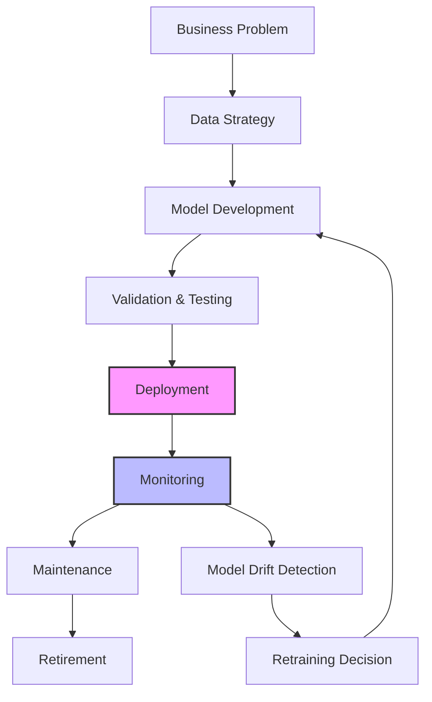

# AI/ML Leadership for Amazon L6/L7 Engineering Managers

!!! success "Essential AI/ML Management Skills for 2024-2025"
    AI/ML is now critical infrastructure at Amazon. L6/L7 engineering managers must understand model lifecycle, cost optimization, governance, and responsible AI practices to lead effectively in the modern engineering landscape.

## Why AI/ML Leadership Skills Are Critical in 2024-2025

### The AI/ML Revolution at Amazon Scale

Amazon's AI/ML initiatives have evolved from experimental to business-critical:

```markdown
**Amazon's AI/ML Investment Areas (2024-2025):**
- Amazon Bedrock: $10B+ investment in foundation models
- AWS SageMaker: Platform serving millions of model endpoints
- Alexa: Processing 10+ billion interactions monthly
- Amazon Go: Computer vision at retail scale
- Supply Chain: ML optimizing $500B+ in logistics
- Advertising: $40B+ revenue driven by ML personalization
- AWS AI Services: Powering thousands of enterprise customers
```

**For L6/L7 Managers, This Means:**
- 60%+ of engineering teams now integrate ML components
- AI/ML projects represent $100B+ in Amazon's future revenue
- Cost optimization for ML workloads is a $1B+ opportunity
- Regulatory compliance (EU AI Act, etc.) requires governance expertise
- Competition for AI/ML talent is the highest in tech history

## Core AI/ML Leadership Competencies for L6/L7

### 1. AI/ML Technical Strategy and Vision

#### Understanding the Modern ML Stack
```python
ml_stack_components = {
    "data_infrastructure": {
        "batch_processing": ["EMR", "Glue", "Data Pipeline"],
        "streaming": ["Kinesis", "MSK", "Real-time processing"],
        "storage": ["S3", "Data Lake", "Feature Store"],
        "quality": ["Data validation", "Schema evolution", "Lineage"]
    },
    "model_development": {
        "experimentation": ["SageMaker Studio", "MLflow", "Weights & Biases"],
        "training": ["SageMaker Training", "EC2 GPU clusters", "Spot instances"],
        "feature_engineering": ["SageMaker Feature Store", "EMR", "Glue"],
        "model_registry": ["Model versioning", "A/B testing", "Champion/challenger"]
    },
    "deployment": {
        "inference": ["SageMaker Endpoints", "Lambda", "EKS"],
        "monitoring": ["Model drift", "Performance degradation", "Data quality"],
        "scaling": ["Auto-scaling", "Multi-model endpoints", "Edge deployment"],
        "governance": ["Model approval", "Compliance", "Audit trails"]
    }
}
```

#### Strategic Decision Framework for AI/ML Initiatives

**Build vs Buy vs Partner Decision Matrix:**

| Capability | Build Internal | Buy/License | Partner |
|-----------|---------------|-------------|---------|
| **Core Business Logic** | ✅ Competitive advantage | ❌ Commoditizes IP | ⚠️ Shared value |
| **Foundation Models** | ⚠️ $100M+ investment | ✅ Focus on application | ✅ Anthropic, OpenAI |
| **Specialized Models** | ✅ Unique data advantage | ⚠️ Generic solutions | ✅ Domain expertise |
| **ML Infrastructure** | ⚠️ High maintenance | ✅ AWS/GCP services | ❌ Lock-in risk |

**Example Strategic Decisions for L6/L7 Leaders:**

```markdown
**L6 Decision Example: Recommendation Engine**
- Context: E-commerce platform needs product recommendations
- Decision: Use SageMaker built-in algorithms for MVP, build custom deep learning models as business scales
- Rationale: Balance speed-to-market with long-term differentiation
- Success Metrics: CTR improvement >15%, development time <3 months

**L7 Decision Example: Conversational AI Platform**
- Context: Multiple teams need chatbot capabilities
- Decision: Partner with Anthropic for foundation model, build Amazon-specific training pipeline
- Rationale: Platform play serving 20+ internal teams, requires governance at scale
- Success Metrics: Platform adoption >90%, cost per interaction reduction >40%
```

### 2. AI/ML Cost Management and Optimization

#### Understanding ML Cost Drivers

**Primary Cost Components:**
```markdown
**Training Costs (40-60% of ML budget):**
- GPU instances: p4d.24xlarge ($32/hour), p3dn.24xlarge ($31/hour)
- Storage: Training data, intermediate results, model artifacts
- Network: Data transfer between regions, cross-AZ traffic
- Experimentation overhead: Failed runs, hyperparameter tuning

**Inference Costs (30-50% of ML budget):**
- Real-time endpoints: Always-on GPU instances
- Batch transform: Scheduled processing jobs
- Edge deployment: IoT devices, mobile inference
- Model serving overhead: Load balancing, monitoring

**Data Costs (10-20% of ML budget):**
- Data storage: Raw data, processed features, model artifacts
- Data processing: ETL jobs, feature engineering pipelines
- Data quality: Validation, cleaning, monitoring
- Compliance: Data governance, retention policies
```

#### Advanced Cost Optimization Strategies

**1. Intelligent Resource Management:**

```python
cost_optimization_strategies = {
    "training_optimization": {
        "spot_instances": {
            "savings": "60-80% cost reduction",
            "implementation": "Fault-tolerant training with checkpointing",
            "best_practices": ["Save checkpoints every 15 minutes", "Use Spot Fleet", "Multi-AZ deployment"]
        },
        "mixed_precision": {
            "savings": "30-50% compute time reduction",
            "implementation": "FP16 training with automatic loss scaling",
            "considerations": ["Model accuracy validation", "Gradient scaling", "Memory optimization"]
        },
        "distributed_training": {
            "savings": "Linear scaling with proper implementation",
            "strategies": ["Data parallelism", "Model parallelism", "Pipeline parallelism"],
            "tools": ["SageMaker Distributed Training", "Horovod", "DeepSpeed"]
        }
    },
    "inference_optimization": {
        "model_compression": {
            "techniques": ["Quantization", "Pruning", "Knowledge distillation"],
            "performance_impact": "2-10x latency improvement",
            "accuracy_tradeoff": "Usually <2% accuracy loss"
        },
        "edge_deployment": {
            "cost_reduction": "80-90% for appropriate workloads",
            "implementation": ["AWS IoT Greengrass", "SageMaker Edge Manager"],
            "use_cases": ["Real-time inference", "Offline scenarios", "Privacy requirements"]
        },
        "serverless_inference": {
            "cost_model": "Pay-per-request vs always-on endpoints",
            "break_even": "Typically <100 requests/hour",
            "latency_tradeoff": "Cold start: 1-10 seconds"
        }
    }
}
```

**2. ML Cost Governance Framework:**

```markdown
**Cost Monitoring and Alerting:**
- Real-time cost tracking per model, team, and project
- Budget alerts at 50%, 80%, and 100% thresholds
- Cost anomaly detection using ML on spend patterns
- Showback/chargeback to individual teams and products

**Resource Utilization Optimization:**
- GPU utilization monitoring (target: >70% for training)
- Instance rightsizing recommendations
- Idle resource identification and automatic shutdown
- Multi-tenancy for batch workloads

**ROI Measurement Framework:**
- Business impact per dollar spent on ML
- Cost per prediction/classification
- Model accuracy vs compute cost trade-offs
- Customer lifetime value impact from ML improvements
```

**3. Real-World Cost Optimization Case Study:**

```markdown
**Problem:** Amazon Advertising ML team spending $2M/month on training, 40% waste identified

**Root Causes Analysis:**
- Hyperparameter tuning jobs running 2x longer than needed
- Development clusters left running overnight/weekends
- Inefficient data loading causing GPU idle time
- Over-provisioned inference endpoints for low-traffic models

**Solution Implementation (L6/L7 Leadership Approach):**

Week 1-2: Assessment and Planning
- Audit all ML workloads and spending patterns
- Implement cost tracking and monitoring dashboards
- Set team-specific cost optimization targets

Week 3-4: Quick Wins
- Implement automatic shutdown for idle development instances
- Enable Spot instances for hyperparameter tuning (60% cost reduction)
- Optimize data loading pipelines (35% GPU utilization improvement)

Week 5-8: Systematic Optimization
- Deploy multi-model endpoints for low-traffic models
- Implement intelligent auto-scaling based on traffic patterns
- Migrate appropriate workloads to Serverless inference

**Results After 3 Months:**
- 45% total cost reduction ($900K/month savings)
- 25% faster model training due to optimized resource utilization
- 40% improvement in developer productivity
- Zero impact on model accuracy or business metrics

**L6/L7 Leadership Lessons:**
- Started with measurement and visibility before optimization
- Balanced automation with team education and culture change
- Maintained focus on business impact, not just cost reduction
- Created sustainable processes, not just one-time fixes
```

### 3. AI/ML Model Lifecycle Management

#### Production ML Lifecycle Framework



#### Advanced Model Operations (MLOps) at Scale

**1. Automated ML Pipeline Architecture:**

```yaml
ml_pipeline_components:
  data_validation:
    - schema_validation: "TensorFlow Data Validation (TFDV)"
    - data_quality_checks: "Great Expectations, Deequ"
    - drift_detection: "Statistical tests, KL divergence"
    - anomaly_detection: "Isolation Forest, One-class SVM"
    
  model_training:
    - experiment_tracking: "MLflow, Weights & Biases"
    - hyperparameter_optimization: "Optuna, Hyperopt, SageMaker HPO"
    - distributed_training: "Horovod, SageMaker Distributed"
    - model_versioning: "DVC, MLflow Model Registry"
    
  model_validation:
    - performance_testing: "A/B testing framework"
    - bias_detection: "Fairness metrics, demographic parity"
    - explainability: "SHAP, LIME, Amazon SageMaker Clarify"
    - security_scanning: "Model adversarial testing"
    
  deployment:
    - canary_deployment: "Gradual traffic shifting"
    - blue_green_deployment: "Zero-downtime updates"
    - shadow_deployment: "Production testing without impact"
    - rollback_capability: "Automatic rollback on performance degradation"
    
  monitoring:
    - model_performance: "Accuracy, latency, throughput"
    - data_drift: "Feature distribution changes"
    - concept_drift: "Target variable distribution changes"
    - business_metrics: "Revenue impact, user engagement"
```

**2. Model Governance and Compliance:**

```markdown
**Enterprise Model Governance Framework:**

**Model Risk Management:**
- Risk assessment matrix: High/Medium/Low risk categorization
- Model approval process: Automated for low risk, committee for high risk
- Documentation requirements: Model cards, technical specifications
- Compliance tracking: Regulatory requirements (GDPR, CCPA, AI Act)

**Model Lifecycle Policies:**
- Development standards: Code review, testing requirements
- Deployment approvals: Performance thresholds, bias checks
- Monitoring requirements: SLA definitions, alerting policies
- Retirement processes: Deprecation timelines, data retention

**Audit and Documentation:**
- Model lineage tracking: Data sources to business decisions
- Experiment reproducibility: Code, data, and environment versioning
- Performance history: Model accuracy over time
- Decision audit trails: Why models were trained, deployed, or retired

**Real-World Governance Example:**
Context: Amazon Prime Video recommendation engine serving 100M+ users

Governance Requirements:
- Content diversity requirements (avoid filter bubbles)
- Regional compliance (local content regulations)
- Performance SLAs (99.9% uptime, <100ms latency)
- Fairness constraints (demographic representation)

Implementation:
- Automated bias testing in CI/CD pipeline
- Multi-armed bandit for safe exploration of new models
- Regional model variants for compliance
- Real-time monitoring of diversity metrics
- Quarterly model audits with external reviewers
```

**3. Advanced Model Monitoring and Alerting:**

```python
model_monitoring_framework = {
    "performance_monitoring": {
        "accuracy_tracking": {
            "metrics": ["Precision", "Recall", "F1", "AUC-ROC"],
            "thresholds": "Alert if accuracy drops >2% over 7 days",
            "comparison": "Current vs training performance, seasonal baselines"
        },
        "latency_monitoring": {
            "sla_targets": "P95 <100ms, P99 <200ms",
            "alerting": "Real-time alerts if SLA violated",
            "root_cause_analysis": "Automated investigation of latency spikes"
        }
    },
    "data_quality_monitoring": {
        "drift_detection": {
            "statistical_tests": ["KS test", "Chi-square test", "Population stability index"],
            "threshold": "Alert if drift score >0.2",
            "remediation": "Automatic retraining trigger"
        },
        "anomaly_detection": {
            "techniques": ["Isolation Forest", "Local Outlier Factor"],
            "sensitivity": "Configurable based on business impact",
            "response": "Flag for human review vs automatic handling"
        }
    },
    "business_impact_monitoring": {
        "kpi_tracking": {
            "metrics": "Revenue impact, conversion rates, user engagement",
            "correlation": "Model performance vs business outcomes",
            "attribution": "Isolate ML contribution to business metrics"
        },
        "experiment_analysis": {
            "a_b_testing": "Continuous A/B tests for model improvements",
            "statistical_significance": "Proper statistical rigor",
            "business_significance": "Minimum detectable effect sizes"
        }
    }
}
```

### 4. AI/ML Team Leadership and Culture

#### Building High-Performance ML Teams

**1. Role Definition and Team Structure:**

```markdown
**Core ML Team Roles (L6/L7 Responsibility to Define):**

**ML Engineers:**
- Model development, training, and deployment
- MLOps pipeline creation and maintenance  
- Production system optimization
- Skills: Python, PyTorch/TensorFlow, AWS ML services

**Data Engineers:**
- Data pipeline architecture and implementation
- Feature engineering and data quality
- Real-time and batch processing systems
- Skills: Spark, Kafka, SQL, data modeling

**Research Scientists (L7 teams):**
- Novel algorithm development
- Research paper publications
- Industry conference presentations
- Skills: Advanced mathematics, experimental design

**ML Platform Engineers:**
- Infrastructure for ML workloads
- Tool and framework development
- Cost optimization and scaling
- Skills: Kubernetes, Docker, cloud platforms

**Applied Scientists:**
- Bridge between research and production
- Business problem translation to ML problems
- Model interpretability and explanation
- Skills: Statistics, domain expertise, communication

**Team Composition by Level:**
L6 Team (10-25 engineers):
- 40% ML Engineers
- 30% Data Engineers  
- 20% Software Engineers
- 10% Applied Scientists

L7 Team (50+ engineers):
- 35% ML Engineers
- 25% Data Engineers
- 20% Software Engineers
- 15% Applied Scientists
- 5% Research Scientists
```

**2. ML Engineering Culture and Best Practices:**

```markdown
**Establishing ML Engineering Excellence:**

**Code Quality Standards:**
- All ML code in version control with proper branching
- Code reviews required for all ML model changes
- Automated testing for data pipelines and model code
- Documentation requirements for experiments and models

**Experimentation Culture:**
- Hypothesis-driven development vs random experimentation
- Proper statistical methodology for A/B testing
- Failure tolerance: 70% of experiments expected to fail
- Learning capture: Document insights from failed experiments

**Reproducibility Requirements:**
- Deterministic training processes with fixed random seeds
- Environment versioning (Docker containers, dependency pinning)
- Data versioning and lineage tracking
- Experiment tracking with complete parameter logging

**Collaboration Patterns:**
- Regular model review meetings with business stakeholders
- Cross-team model sharing and reuse
- Internal tech talks on ML innovations
- External conference participation and thought leadership

**Career Development for ML Engineers:**
- Technical ladder: Engineer → Senior → Staff → Principal
- Research ladder: Applied Scientist → Senior → Principal Research Scientist
- Management ladder: Team Lead → Manager → Senior Manager
- Cross-functional exposure: Rotation between teams and domains
```

**3. Managing ML Project Complexity and Risk:**

```python
ml_project_risk_framework = {
    "technical_risks": {
        "data_quality": {
            "risk": "Poor data quality leads to unreliable models",
            "mitigation": "Automated data validation, quality monitoring",
            "probability": "High",
            "impact": "High"
        },
        "model_complexity": {
            "risk": "Overly complex models are hard to debug and maintain",
            "mitigation": "Start simple, add complexity incrementally",
            "probability": "Medium",
            "impact": "Medium"
        },
        "infrastructure_scaling": {
            "risk": "Models fail under production load",
            "mitigation": "Load testing, gradual rollout, monitoring",
            "probability": "Medium",
            "impact": "High"
        }
    },
    "business_risks": {
        "unclear_requirements": {
            "risk": "Building solution for wrong problem",
            "mitigation": "Close collaboration with stakeholders, MVP approach",
            "probability": "High",
            "impact": "High"
        },
        "roi_uncertainty": {
            "risk": "ML investment doesn't deliver expected business value",
            "mitigation": "Clear success metrics, frequent measurement",
            "probability": "Medium",
            "impact": "High"
        },
        "ethical_concerns": {
            "risk": "Model exhibits unfair bias or discrimination",
            "mitigation": "Bias testing, diverse team, ethical guidelines",
            "probability": "Medium",
            "impact": "High"
        }
    },
    "organizational_risks": {
        "talent_shortage": {
            "risk": "Difficulty hiring and retaining ML talent",
            "mitigation": "Competitive compensation, growth opportunities",
            "probability": "High",
            "impact": "Medium"
        },
        "technology_debt": {
            "risk": "Accumulated shortcuts make system unmaintainable",
            "mitigation": "Regular refactoring, technical debt tracking",
            "probability": "Medium",
            "impact": "Medium"
        }
    }
}
```

### 5. Responsible AI and Ethics Leadership

#### Ethical AI Framework for Engineering Leaders

**1. Bias Detection and Mitigation:**

```markdown
**Comprehensive Bias Audit Framework:**

**Data Bias Identification:**
- Historical bias: Training data reflects past discrimination
- Representation bias: Underrepresentation of certain groups
- Measurement bias: Different quality data for different populations
- Evaluation bias: Using inappropriate metrics for different groups

**Algorithmic Bias Types:**
- Allocational harm: Unequal distribution of resources/opportunities
- Representational harm: Reinforcement of stereotypes
- Quality of service: Different performance levels across groups
- Individual fairness: Similar individuals treated differently

**Bias Mitigation Strategies:**

Pre-processing:
- Data augmentation for underrepresented groups
- Re-sampling techniques to balance datasets
- Synthetic data generation for minority classes
- Feature selection to remove protected characteristics

In-processing:
- Fairness constraints in model optimization
- Adversarial training to remove protected information
- Multi-task learning with fairness objectives
- Regularization penalties for biased predictions

Post-processing:
- Threshold adjustment for different groups
- Calibration across protected classes
- Output modification to achieve fairness metrics
- Human-in-the-loop review for high-stakes decisions

**Real-World Example: Amazon Hiring Algorithm Bias (2018)**
Problem: Resume screening algorithm showed bias against women
Root Cause: Training data reflected historical hiring patterns
Solution Approach:
- Immediate: Discontinued biased algorithm
- Short-term: Implemented bias testing in all hiring tools
- Long-term: Created diverse training datasets, fairness metrics
- Governance: Regular bias audits, diverse review committees
```

**2. AI Transparency and Explainability:**

```python
explainability_framework = {
    "model_interpretability": {
        "global_explanations": {
            "techniques": ["Feature importance", "Partial dependence plots", "SHAP summary plots"],
            "use_cases": ["Model debugging", "Stakeholder communication", "Regulatory compliance"],
            "tools": ["SHAP", "LIME", "InterpretML", "Amazon SageMaker Clarify"]
        },
        "local_explanations": {
            "techniques": ["LIME", "SHAP values", "Counterfactual explanations"],
            "use_cases": ["Individual decision explanation", "Appeals process", "Debugging edge cases"],
            "implementation": "Real-time explanation API alongside predictions"
        },
        "example_based_explanations": {
            "techniques": ["Prototype selection", "Influential instances", "Nearest neighbors"],
            "use_cases": ["Human intuition", "Training data validation", "Model behavior understanding"],
            "complexity": "High computational cost, suitable for offline analysis"
        }
    },
    "documentation_requirements": {
        "model_cards": {
            "contents": ["Model purpose", "Training data", "Performance metrics", "Limitations"],
            "audience": ["Technical teams", "Business stakeholders", "Auditors"],
            "maintenance": "Updated with each model version"
        },
        "data_sheets": {
            "contents": ["Data collection process", "Preprocessing steps", "Known biases"],
            "purpose": "Transparency in data usage and limitations",
            "format": "Standardized template across organization"
        }
    }
}
```

**3. AI Governance and Risk Management:**

```markdown
**Enterprise AI Governance Structure:**

**AI Ethics Committee (L7 Influence Level):**
- Cross-functional membership: Legal, Engineering, Product, Ethics
- Risk assessment for high-impact AI systems
- Policy development and updates
- Incident response and escalation
- External stakeholder engagement

**AI Review Processes:**
- Risk-based approval workflows
- Ethical impact assessments
- Stakeholder consultation requirements
- Regular audit and compliance checks
- Continuous monitoring and evaluation

**Policy Framework:**
1. **AI Use Case Classification:**
   - Low Risk: Internal tools, non-customer facing
   - Medium Risk: Customer-facing but low impact
   - High Risk: High-stakes decisions (hiring, lending, healthcare)
   - Prohibited: Uses that conflict with company values

2. **Development Standards:**
   - Mandatory bias testing for Medium+ risk systems
   - Explainability requirements based on risk level
   - Human oversight requirements for High risk systems
   - Regular model audits and performance reviews

3. **Incident Response:**
   - Clear escalation paths for AI-related issues
   - Rapid response teams for critical incidents
   - Communication protocols for public incidents
   - Post-incident review and learning processes

**L6/L7 Leadership Responsibilities:**
- Champion ethical AI practices within teams
- Ensure compliance with company AI policies
- Escalate ethical concerns to appropriate committees
- Balance innovation with responsible development
- Communicate AI risks and benefits to stakeholders
```

### 6. Generative AI and LLM Integration Leadership

#### Strategic LLM Integration for Enterprise Applications

**1. LLM Use Case Evaluation Framework:**

```markdown
**LLM Application Categories and Business Impact:**

**High-Value, Low-Risk Applications:**
- Content generation: Marketing copy, documentation, code comments
- Summarization: Meeting notes, research papers, customer feedback
- Translation: Multi-language content localization
- Code assistance: Auto-completion, bug detection, refactoring suggestions

**High-Value, Medium-Risk Applications:**
- Customer service chatbots: Automated support with human escalation
- Code generation: Boilerplate code, test case generation
- Data analysis: Automated insight generation from structured data
- Creative assistance: Design ideation, brainstorming facilitation

**High-Value, High-Risk Applications:**
- Decision support systems: Financial analysis, medical diagnosis assistance
- Automated content moderation: Safety and compliance enforcement
- Legal document analysis: Contract review, regulatory compliance
- Personalized recommendations: High-stakes user engagement optimization

**LLM Selection Matrix:**

| Use Case | Internal Model | API-based (GPT-4, Claude) | Hybrid Approach |
|----------|---------------|---------------------------|-----------------|
| **Code Generation** | ✅ Code-specific training | ⚠️ General capability | ✅ Best of both |
| **Customer Service** | ⚠️ High maintenance | ✅ Rapid deployment | ✅ Gradual transition |
| **Content Creation** | ❌ Generic quality | ✅ High quality output | ⚠️ Complexity overhead |
| **Domain-Specific Tasks** | ✅ Specialized knowledge | ❌ Generic responses | ✅ Fine-tuned hybrid |
```

**2. LLM Cost Management and Optimization:**

```python
llm_cost_optimization = {
    "api_cost_management": {
        "token_optimization": {
            "input_compression": "Remove redundant context, use efficient prompting",
            "output_limitation": "Set max_tokens appropriately, use stop sequences",
            "caching_strategy": "Cache responses for common queries",
            "batch_processing": "Combine multiple requests where possible"
        },
        "model_selection": {
            "cost_performance_tradeoff": "GPT-3.5 vs GPT-4 based on task complexity",
            "specialized_models": "Use task-specific models when available",
            "competitive_pricing": "Monitor pricing across providers (OpenAI, Anthropic, AWS)"
        }
    },
    "infrastructure_optimization": {
        "self_hosted_models": {
            "break_even_analysis": "Cost comparison vs API calls at different scales",
            "infrastructure_requirements": "GPU clusters, storage, bandwidth",
            "operational_overhead": "Model updates, fine-tuning, monitoring"
        },
        "hybrid_architectures": {
            "routing_logic": "Route simple queries to cheaper models",
            "fallback_mechanisms": "Graceful degradation when models unavailable",
            "load_balancing": "Distribute load across multiple providers/models"
        }
    },
    "roi_measurement": {
        "productivity_metrics": {
            "developer_efficiency": "Code generation impact on development velocity",
            "content_creation_speed": "Marketing/documentation production rates",
            "customer_satisfaction": "Support quality improvements"
        },
        "cost_avoidance": {
            "reduced_headcount_needs": "Automation of routine tasks",
            "faster_time_to_market": "Accelerated product development",
            "improved_accuracy": "Reduced errors and rework"
        }
    }
}
```

**3. LLM Security and Risk Management:**

```markdown
**LLM-Specific Security Concerns:**

**Prompt Injection Attacks:**
- Risk: Malicious inputs that manipulate model behavior
- Mitigation: Input sanitization, prompt template validation, output filtering
- Detection: Monitor for unusual prompt patterns, output anomalies

**Data Leakage:**
- Risk: Model inadvertently reveals training data or sensitive information
- Mitigation: Data anonymization, output filtering, access controls
- Monitoring: Automated scanning for sensitive data in outputs

**Model Jailbreaking:**
- Risk: Circumventing safety guardrails to generate harmful content
- Mitigation: Robust safety filtering, multi-layer validation
- Response: Rapid patching, incident response procedures

**Adversarial Attacks:**
- Risk: Carefully crafted inputs that cause model failures
- Mitigation: Adversarial training, input validation, anomaly detection
- Recovery: Fallback mechanisms, human escalation procedures

**LLM Governance Framework:**

**Development Phase:**
- Code review for prompt engineering and model integration
- Security testing including prompt injection and jailbreaking attempts
- Privacy impact assessment for data usage
- Performance and accuracy benchmarking

**Deployment Phase:**
- Staged rollout with monitoring and rollback capabilities
- Real-time monitoring for security incidents and quality degradation
- User access controls and audit logging
- Regular security assessments and penetration testing

**Operations Phase:**
- Continuous monitoring for model drift and performance degradation
- Regular updates to safety filters and guardrails
- Incident response procedures for security and safety issues
- Compliance monitoring for regulatory requirements

**L6/L7 Specific LLM Leadership Challenges:**

**Technical Leadership:**
- Evaluating LLM capabilities against business requirements
- Architecting scalable and secure LLM integration patterns
- Managing technical debt from rapid LLM technology evolution
- Balancing innovation speed with security and compliance requirements

**Team Management:**
- Upskilling teams on prompt engineering and LLM integration
- Managing expectations around LLM capabilities and limitations
- Recruiting talent with emerging LLM expertise
- Creating career development paths for LLM specialists

**Stakeholder Communication:**
- Translating LLM technical concepts for business stakeholders
- Managing expectations around LLM implementation timelines
- Communicating risks and limitations of LLM-based solutions
- Building confidence in LLM security and reliability measures
```

## AI/ML Interview Preparation for L6/L7

### Common AI/ML Interview Scenarios

#### L6 AI/ML Engineering Manager Scenarios

**Scenario 1: ML Cost Optimization**
> "Your ML team is spending $500K/month on training and inference, but business metrics show declining ROI. Walk me through how you'd investigate and optimize costs while maintaining model performance."

**Strong Response Framework:**
```markdown
1. **Immediate Analysis (Week 1)**
   - Audit current spending: Training vs inference, team vs project breakdown
   - Analyze utilization: GPU idle time, over-provisioned endpoints
   - Review business impact: Cost per prediction, revenue attribution

2. **Quick Wins (Weeks 2-3)**
   - Implement Spot instances for training (60% cost reduction)
   - Right-size inference endpoints based on traffic patterns
   - Enable automatic shutdown for idle development resources

3. **Systematic Optimization (Weeks 4-8)**
   - Model compression: Quantization and pruning for inference
   - Batch prediction optimization for non-real-time use cases
   - Multi-model endpoints for low-traffic models

4. **Long-term Strategy (3+ months)**
   - Edge deployment for latency-sensitive applications
   - Custom model architecture optimization
   - Cross-team platform for shared ML infrastructure

5. **Measurement and Governance**
   - Establish cost per business outcome metrics
   - Implement cost monitoring and alerting
   - Create team-level cost accountability
```

**Scenario 2: Model Performance Degradation**
> "A recommendation model serving 10M+ users daily has shown declining click-through rates over the past month. How do you investigate and resolve this issue?"

**Strong Response Framework:**
```markdown
1. **Immediate Triage (Hours 1-4)**
   - Check system health: Latency, error rates, infrastructure issues
   - Review recent deployments: Model updates, infrastructure changes
   - Analyze traffic patterns: User behavior changes, seasonal effects

2. **Data Quality Investigation (Day 1)**
   - Feature drift analysis: Compare current vs training data distributions
   - Data pipeline validation: Check for upstream data source changes
   - Label quality assessment: Verify ground truth data accuracy

3. **Model Analysis (Days 2-3)**
   - Performance segmentation: Identify affected user segments
   - Feature importance analysis: Check for feature degradation
   - A/B test setup: Current model vs previous version

4. **Root Cause Identification**
   - Concept drift: User preferences may have shifted
   - Data quality issues: Corrupted features or missing data
   - Model decay: Natural performance degradation over time
   - External factors: Market changes, competitor actions

5. **Resolution Strategy**
   - Immediate: Rollback to previous model version if significant degradation
   - Short-term: Retrain model with recent data
   - Long-term: Implement automated drift detection and retraining
```

#### L7 AI/ML Leadership Scenarios

**Scenario 1: AI/ML Platform Strategy**
> "You're tasked with building an AI/ML platform to serve 50+ engineering teams across the organization. How do you approach platform design and rollout?"

**Strong Response Framework:**
```markdown
1. **Platform Vision and Strategy**
   - User research: Interview teams to understand current pain points
   - Capability assessment: Catalog existing ML tools and workflows
   - Success metrics: Platform adoption, time-to-production, cost efficiency

2. **Platform Architecture Design**
   - Core services: Data ingestion, model training, deployment, monitoring
   - Self-service capabilities: Model experimentation, automated testing
   - Integration patterns: Existing CI/CD, data infrastructure, security

3. **Technology Selection**
   - Build vs buy analysis: AWS SageMaker vs custom platform
   - Open source integration: MLflow, Kubeflow, Apache Airflow
   - Vendor management: Multi-cloud strategy, avoid lock-in

4. **Rollout Strategy**
   - Pilot phase: 2-3 friendly teams, gather feedback
   - Early adopters: 10-15 teams, refine platform based on usage
   - Organization-wide: Sunset legacy solutions, mandate migration

5. **Organizational Change Management**
   - Training programs: Upskill teams on new platform capabilities
   - Support structure: DevRel team, documentation, office hours
   - Incentive alignment: Team OKRs include platform adoption metrics

6. **Success Measurement**
   - Technical metrics: Platform uptime, model deployment frequency
   - Business metrics: Time-to-market reduction, cost optimization
   - Organizational metrics: Team satisfaction, knowledge sharing
```

**Scenario 2: Responsible AI Implementation**
> "The company is facing scrutiny over AI bias in a customer-facing product. How do you implement responsible AI practices across your organization?"

**Strong Response Framework:**
```markdown
1. **Immediate Response (Week 1)**
   - Form cross-functional incident response team
   - Conduct immediate bias audit of affected system
   - Implement temporary mitigation measures
   - Communicate transparently with stakeholders

2. **Root Cause Analysis (Weeks 2-3)**
   - Historical data analysis: Identify sources of bias
   - Process review: Gaps in development and review processes
   - Training assessment: Team knowledge of bias detection/mitigation
   - Tool evaluation: Current capabilities for bias testing

3. **Systematic Solution Implementation (Months 1-3)**
   - Bias testing integration: Automated testing in CI/CD pipelines
   - Diverse datasets: Improve training data representation
   - Fairness metrics: Define and monitor appropriate metrics
   - Review processes: Multi-disciplinary review for high-risk systems

4. **Organizational Transformation (Months 3-6)**
   - AI ethics training: Mandatory training for all ML practitioners
   - Diverse hiring: Increase team diversity for different perspectives
   - External partnerships: Collaborate with fairness research organizations
   - Governance structure: AI ethics committee with escalation processes

5. **Long-term Cultural Change (6+ months)**
   - Performance metrics: Include fairness in team and individual OKRs
   - Recognition programs: Reward responsible AI practices
   - Industry leadership: Publish research, speak at conferences
   - Continuous improvement: Regular audits and process updates

6. **Measurement and Accountability**
   - Bias metrics dashboard: Real-time monitoring across all models
   - Stakeholder reporting: Regular updates to executive team
   - External audits: Third-party validation of responsible AI practices
   - Customer feedback: Channels for reporting bias concerns
```

### Key AI/ML Technical Interview Topics

#### Essential Technical Knowledge for L6/L7

**1. Model Architecture and Selection:**
```markdown
**Deep Learning Architectures:**
- Transformers: Attention mechanism, positional encoding, scaling laws
- CNNs: ResNet, EfficientNet, vision transformers
- RNNs: LSTM, GRU, sequence-to-sequence models
- Graph Neural Networks: GCN, GraphSAGE, graph transformers

**Model Selection Framework:**
- Problem type: Classification, regression, generation, recommendation
- Data characteristics: Size, quality, dimensionality, structure
- Performance requirements: Latency, throughput, accuracy
- Resource constraints: Compute, memory, storage, cost

**Trade-off Analysis:**
- Accuracy vs interpretability: Linear models vs deep learning
- Speed vs accuracy: Model compression vs ensemble methods
- Cost vs performance: Cloud APIs vs self-hosted models
- Robustness vs optimization: General models vs specialized systems
```

**2. Production ML System Design:**
```markdown
**System Architecture Components:**
- Data ingestion: Batch vs streaming, data quality validation
- Feature engineering: Online vs offline feature computation
- Model serving: Batch prediction vs real-time inference
- Monitoring: Model performance, data drift, system health

**Scalability Considerations:**
- Load balancing: Model endpoint distribution, traffic routing
- Caching: Feature caching, prediction caching, model caching
- Auto-scaling: Traffic-based scaling, cost optimization
- Geographic distribution: Edge deployment, data residency

**Reliability Patterns:**
- Circuit breakers: Fault isolation, graceful degradation
- Retry mechanisms: Exponential backoff, jitter
- Fallback strategies: Cached predictions, simpler models
- Disaster recovery: Model backup, cross-region deployment
```

**3. Advanced ML Operations:**
```python
production_ml_system_design = {
    "data_pipeline": {
        "ingestion": ["Kafka", "Kinesis", "Pub/Sub", "batch processing"],
        "validation": ["Schema validation", "data quality checks", "drift detection"],
        "storage": ["Data lake", "feature store", "versioning"],
        "processing": ["Spark", "Beam", "Flink", "distributed computing"]
    },
    "model_lifecycle": {
        "experimentation": ["Jupyter", "MLflow", "Weights & Biases"],
        "training": ["Distributed training", "hyperparameter optimization"],
        "validation": ["Cross-validation", "holdout testing", "A/B testing"],
        "deployment": ["Canary deployment", "blue-green", "shadow mode"]
    },
    "serving_infrastructure": {
        "real_time": ["REST APIs", "gRPC", "WebSockets", "edge computing"],
        "batch": ["Spark jobs", "scheduled processing", "data pipelines"],
        "streaming": ["Kafka Streams", "Flink", "real-time processing"],
        "hybrid": ["Lambda architecture", "Kappa architecture"]
    },
    "monitoring_observability": {
        "model_performance": ["Accuracy tracking", "drift detection", "A/B test results"],
        "system_performance": ["Latency", "throughput", "error rates"],
        "business_metrics": ["ROI tracking", "user engagement", "revenue impact"],
        "operational_metrics": ["Resource utilization", "cost tracking", "SLA compliance"]
    }
}
```

## Building AI/ML Leadership Credibility

### Demonstrating AI/ML Thought Leadership

**1. Internal Influence:**
```markdown
**Technical Leadership Activities:**
- Lead architecture reviews for ML system designs
- Establish ML engineering standards and best practices
- Mentor senior engineers on ML system design and implementation
- Drive technical decisions on ML technology stack and tooling

**Cross-Functional Collaboration:**
- Partner with Product to define ML success metrics
- Work with Data Science to translate research into production systems
- Collaborate with Legal on AI compliance and risk management
- Engage with Security on AI/ML security best practices

**Organizational Impact:**
- Reduce ML infrastructure costs by 30-50% through optimization
- Improve model deployment frequency from monthly to weekly
- Establish ML platform serving multiple teams and reducing duplication
- Create ML career development paths and training programs
```

**2. External Thought Leadership:**
```markdown
**Industry Engagement:**
- Publish technical blogs on ML engineering best practices
- Speak at conferences on AI/ML at scale (MLConf, Strata, RE:Invent)
- Contribute to open source ML tools and frameworks
- Participate in AI/ML standards committees and working groups

**Professional Network:**
- Build relationships with other AI/ML leaders at major tech companies
- Engage with academic researchers on practical ML problems
- Mentor junior professionals through industry programs
- Serve as technical advisor to AI/ML startups

**Content Creation:**
- Write detailed case studies on ML system design and optimization
- Create technical tutorials on advanced ML engineering topics
- Develop frameworks and methodologies adopted by other teams
- Share lessons learned from large-scale ML deployments
```

### Measuring AI/ML Leadership Success

**L6 Success Metrics:**
- **Team Performance**: Model deployment velocity, system reliability, cost efficiency
- **Technical Quality**: Code quality, system design, operational excellence
- **Team Development**: Engineer growth, knowledge sharing, retention rates
- **Business Impact**: ML system ROI, customer satisfaction, revenue attribution

**L7 Success Metrics:**
- **Organizational Impact**: Platform adoption, cost optimization across teams
- **Strategic Influence**: Technology roadmap input, architecture decisions
- **Industry Recognition**: Conference talks, publications, external partnerships
- **Talent Pipeline**: Leadership development, knowledge multiplication

---

## Quick Start AI/ML Leadership Checklist

### Immediate Actions (Week 1)
- [ ] Audit current ML spending and utilization across all teams
- [ ] Review existing ML systems for security and bias vulnerabilities  
- [ ] Assess team AI/ML skills and identify training needs
- [ ] Set up monitoring for ML model performance and business impact

### 30-Day Foundation Building
- [ ] Establish ML cost optimization targets and measurement framework
- [ ] Implement basic ML governance processes and documentation
- [ ] Begin regular ML system architecture reviews
- [ ] Start AI/ML leadership skill development program

### 90-Day Strategic Implementation  
- [ ] Deploy comprehensive ML monitoring and alerting systems
- [ ] Launch ML platform initiative or optimization program
- [ ] Establish external AI/ML thought leadership presence
- [ ] Create long-term AI/ML technology strategy and roadmap

---

!!! quote "AI/ML Leadership Philosophy"
    "The best AI/ML leaders understand that technology is just the beginning. Success requires mastering the intersection of technical excellence, business value creation, responsible AI practices, and organizational transformation at scale."

---

*Continue your AI/ML leadership journey with [Crisis Leadership Scenarios](../behavioral/crisis-leadership.md) and [Advanced Compensation Strategies](../compensation/ai-ml-compensation.md)*