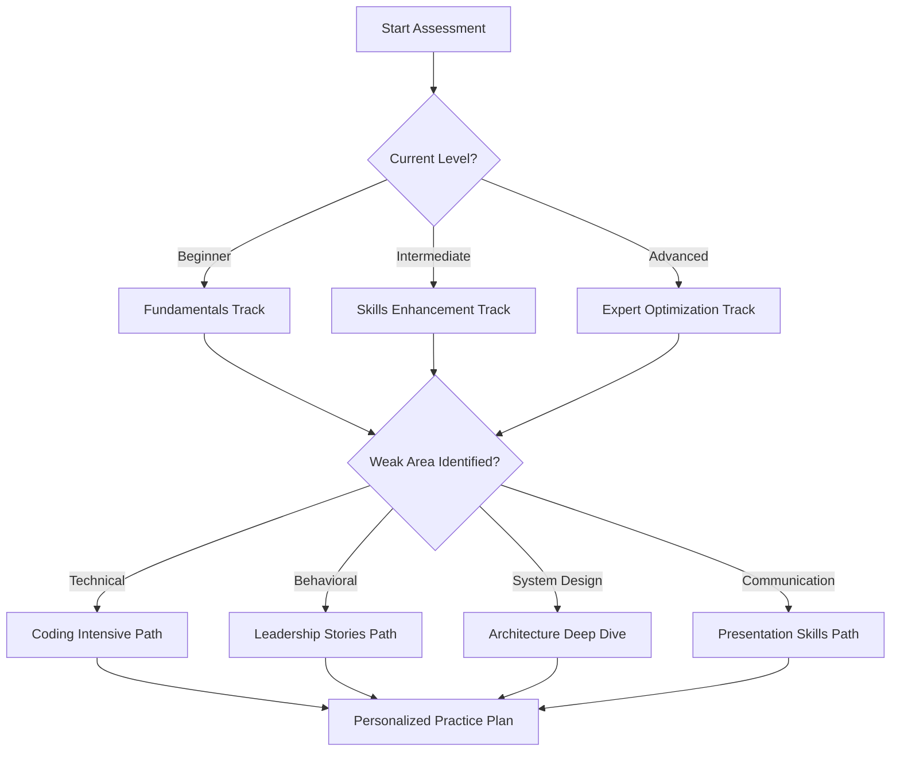

# Interactive Features Guide

## Overview

SystemCraft's Interactive Features transform traditional interview preparation into an engaging, adaptive, and highly effective learning experience. Our platform combines cutting-edge technology with proven pedagogical methods to create the most comprehensive interview preparation system available.

## Core Interactive Systems

### 🎯 Decision Trees & Adaptive Pathways

**Smart Learning Paths**
Interactive decision trees guide your preparation journey based on your responses, performance, and goals.



**Dynamic Content Adaptation**
```javascript
const adaptivePathEngine = {
    assessUserPerformance: (sessionData) => {
        const metrics = {
            technicalAccuracy: calculateTechnicalScore(sessionData),
            responseClarity: analyzeCommunication(sessionData),
            completenessScore: evaluateSTARMethod(sessionData),
            confidenceLevel: detectConfidenceMarkers(sessionData)
        };
        
        return generateNextSteps(metrics);
    },
    
    generateNextSteps: (performance) => {
        if (performance.technicalAccuracy < 0.7) {
            return {
                priority: 'technical_skills',
                recommendations: [
                    'Focus on data structures fundamentals',
                    'Practice algorithm pattern recognition',
                    'Strengthen problem-solving methodology'
                ],
                estimatedTime: '2-3 weeks intensive practice'
            };
        }
        // Additional logic for other performance areas...
    }
};
```

### 🎮 Gamification System

**Achievement System**
Unlock badges, maintain streaks, and climb leaderboards to stay motivated throughout your preparation journey.

**Available Achievements**
- **🔥 Hot Streak**: Practice 7 days in a row
- **💯 Perfect Score**: Ace a behavioral interview simulation  
- **🧠 Algorithm Master**: Solve 50 coding problems correctly
- **🗣️ Communication Pro**: Receive 9+ communication scores in 5 sessions
- **🏗️ System Architect**: Design 10 scalable systems
- **📚 Knowledge Seeker**: Complete all learning modules
- **🤝 Team Player**: Help 5 peers through collaborative sessions
- **⚡ Speed Demon**: Solve easy problems in under 15 minutes
- **🎯 Consistency King**: Maintain 80%+ success rate over 20 sessions
- **📈 Growth Mindset**: Improve scores by 20+ points over a month

**Leaderboard System**
```javascript
const leaderboardCategories = {
    overall: calculateOverallScore(user.allMetrics),
    technical: user.codingPerformance.averageScore,
    behavioral: user.behavioralPerformance.averageScore,
    consistency: user.practiceMetrics.consistencyScore,
    improvement: calculateGrowthRate(user.historicalScores),
    collaboration: user.peerInteractions.helpfulnessRating
};

const weeklyLeaderboard = generateLeaderboard({
    timeframe: 'weekly',
    category: 'overall',
    minSessions: 3
});
```

**Progress Milestones**
- **Beginner (0-25 points)**: Foundation building
- **Developing (26-50 points)**: Skill enhancement
- **Proficient (51-75 points)**: Competency demonstration
- **Advanced (76-90 points)**: Expertise development
- **Expert (91-100 points)**: Interview mastery

### 📈 Real-Time Analytics & Feedback

**Live Performance Monitoring**
Get instant feedback during practice sessions with real-time analytics overlays.

**Real-Time Metrics Dashboard**
```javascript
const realTimeMetrics = {
    speaking: {
        pace: 'optimal', // words per minute: 150-180
        volume: 'good',  // consistent audible level
        clarity: 85,     // speech recognition accuracy
        fillerWords: 3   // "um", "uh", "like" count
    },
    
    visual: {
        eyeContact: 78,      // percentage of time looking at camera
        posture: 'confident', // upright, open positioning
        gestures: 'natural',  // appropriate hand movements
        energy: 8.2          // enthusiasm and engagement level
    },
    
    content: {
        starStructure: 'partial',  // STAR method adherence
        principleAlignment: ['Ownership', 'Customer Obsession'],
        specificity: 7.5,          // detail and concreteness
        relevance: 9.1             // answer relevance to question
    }
};
```

**Instant Feedback Delivery**
- **Visual Indicators**: Color-coded performance meters
- **Audio Cues**: Gentle notifications for pacing issues
- **Text Overlays**: Helpful tips without disrupting flow
- **Progress Bars**: Real-time goal achievement tracking

### 🤖 AI-Powered Personalization

**Intelligent Content Curation**
Our AI system learns from your performance patterns to deliver perfectly tailored practice content.

**Personalization Algorithm**
```javascript
const personalizationEngine = {
    analyzeUserPatterns: (historicalData) => {
        return {
            learningStyle: detectLearningStyle(historicalData),
            weaknessPatterns: identifyRecurringIssues(historicalData), 
            strengthAreas: findConsistentSuccesses(historicalData),
            optimalSessionLength: calculateIdealDuration(historicalData),
            bestPracticeTime: findPeakPerformanceTimes(historicalData)
        };
    },
    
    generatePersonalizedContent: (userProfile, sessionGoals) => {
        const content = {
            questions: selectOptimalQuestions(userProfile.weaknessPatterns),
            difficulty: adjustDifficultyLevel(userProfile.skillProgression),
            format: chooseInteractionStyle(userProfile.learningStyle),
            timing: schedulePracticeReminders(userProfile.bestPracticeTime)
        };
        
        return content;
    }
};
```

**Adaptive Question Selection**
- **Weakness-Focused**: Target your specific improvement areas
- **Progressive Difficulty**: Gradually increase challenge level
- **Context-Aware**: Consider your background and target role
- **Variety Optimization**: Ensure diverse practice experiences

### 💡 Interactive Learning Modules

**Skill-Building Workshops**
Interactive modules that combine theory, practice, and immediate application.

**Module Structure Example: "Mastering the STAR Method"**

**Phase 1: Interactive Tutorial**
```html
<div class="interactive-tutorial">
    <div class="tutorial-step" data-step="1">
        <h3>Situation - Setting the Stage</h3>
        <p>Click on the elements that make a strong situation description:</p>
        <div class="clickable-elements">
            <span class="element correct" data-feedback="✅ Context is crucial">
                "During my role as Tech Lead at StartupCo..."
            </span>
            <span class="element incorrect" data-feedback="❌ Too vague">
                "One time at work..."
            </span>
            <span class="element correct" data-feedback="✅ Specific timeframe helps">
                "...we had a critical deadline of 3 weeks..."
            </span>
        </div>
    </div>
</div>
```

**Phase 2: Practice Application**
- Record your own STAR response
- Get AI-powered analysis
- Compare with example responses
- Iterate and improve

**Phase 3: Live Application**
- Use in mock interview setting
- Receive peer feedback
- Track improvement over time

### 🔄 Spaced Repetition System

**Scientific Learning Optimization**
Our spaced repetition algorithm ensures optimal retention of interview concepts and techniques.

**Repetition Schedule**
```javascript
const spacedRepetitionAlgorithm = {
    calculateNextReview: (itemDifficulty, previousPerformance, timeSinceLastReview) => {
        const baseInterval = getBaseInterval(itemDifficulty);
        const performanceMultiplier = calculateMultiplier(previousPerformance);
        const decayFactor = calculateDecay(timeSinceLastReview);
        
        return baseInterval * performanceMultiplier * decayFactor;
    },
    
    scheduleReviews: {
        'new_concept': [1, 3, 7, 14, 30], // days
        'struggling_area': [1, 2, 4, 8, 16], // more frequent
        'mastered_skill': [7, 21, 60, 120], // less frequent
        'critical_weakness': [1, 1, 2, 3, 5] // fibonacci sequence
    }
};
```

**Content Types for Spaced Repetition**
- **Behavioral Questions**: Regular practice of challenging scenarios
- **Technical Concepts**: Reinforcement of algorithm patterns
- **System Design Patterns**: Architectural component review  
- **Leadership Principles**: Deep understanding maintenance
- **Communication Techniques**: Skill reinforcement

### 📱 Mobile-Responsive Design

**Cross-Platform Compatibility**
Practice anywhere, anytime with our fully responsive design that adapts to any device.

**Mobile-Optimized Features**
- **Touch-Friendly Interface**: Large buttons and intuitive gestures
- **Voice Input**: Hands-free practice for commuting
- **Offline Mode**: Download content for practice without internet
- **Quick Sessions**: 5-15 minute micro-practices for busy schedules
- **Progress Sync**: Seamless synchronization across devices

**Responsive Breakpoints**
```css
/* Mobile-first responsive design */
@media (max-width: 768px) {
    .interview-interface {
        flex-direction: column;
        padding: 1rem;
    }
    
    .question-panel {
        height: auto;
        margin-bottom: 1rem;
    }
    
    .response-area {
        min-height: 200px;
    }
    
    .controls {
        position: fixed;
        bottom: 0;
        width: 100%;
        background: white;
        box-shadow: 0 -2px 10px rgba(0,0,0,0.1);
    }
}
```

### 🎥 Interactive Video Learning

**Immersive Learning Experience**
Watch, pause, interact, and practice with our comprehensive video learning system.

**Interactive Video Features**
- **Clickable Hotspots**: Additional information on demand
- **Practice Prompts**: Pause and practice what you've learned
- **Progress Tracking**: Visual completion and comprehension metrics
- **Note Taking**: Built-in annotation system
- **Speed Control**: Adjust playback speed for optimal learning
- **Transcript Search**: Find specific topics quickly

**Video Learning Paths**
1. **Interview Foundations** (2 hours)
   - Understanding the Amazon interview process
   - Leadership Principles deep dive
   - STAR method mastery
   - Common mistakes and how to avoid them

2. **Technical Excellence** (4 hours)
   - Algorithm problem-solving strategies
   - System design fundamentals
   - Code optimization techniques
   - Live coding best practices

3. **Behavioral Mastery** (3 hours)
   - Storytelling for impact
   - Handling difficult questions
   - Demonstrating leadership without authority
   - Cultural fit and values alignment

### 🔧 Customization & Settings

**Personalized Experience Configuration**
Tailor every aspect of your practice environment to match your preferences and needs.

**Available Customizations**
```javascript
const userPreferences = {
    interface: {
        theme: 'dark', // light, dark, auto
        fontSize: 'medium', // small, medium, large
        animations: true,
        soundEffects: false
    },
    
    practice: {
        sessionLength: 45, // minutes
        difficulty: 'adaptive', // easy, medium, hard, adaptive
        focusAreas: ['behavioral', 'system_design'],
        reminderFrequency: 'daily',
        feedbackStyle: 'detailed' // brief, detailed, comprehensive
    },
    
    privacy: {
        recordSessions: true,
        shareProgress: false,
        allowPeerMatching: true,
        publicLeaderboard: true
    },
    
    accessibility: {
        highContrast: false,
        largeText: false,
        keyboardNavigation: true,
        screenReader: false
    }
};
```

**Smart Defaults**
- **Beginner-Friendly**: Simplified interface for newcomers
- **Advanced Mode**: Full feature access for experienced users
- **Company-Specific**: Optimized settings for target companies
- **Role-Adapted**: Customized content based on target role level

### 📊 Progress Visualization

**Comprehensive Progress Tracking**
Multiple visualization formats to understand your improvement journey from every angle.

**Progress Chart Types**
- **Performance Trend Lines**: Score improvements over time
- **Skill Radar Charts**: Multi-dimensional skill assessment
- **Heat Maps**: Time/topic performance correlation
- **Gantt Charts**: Learning milestone timeline
- **Pie Charts**: Time distribution across practice areas
- **Bar Charts**: Category-wise performance comparison

**Interactive Dashboard Features**
```javascript
const dashboardWidgets = [
    {
        type: 'performance_overview',
        timeframe: 'last_30_days',
        metrics: ['overall_score', 'consistency', 'improvement_rate'],
        interactive: true,
        exportable: true
    },
    {
        type: 'skill_breakdown',
        categories: ['technical', 'behavioral', 'communication', 'system_design'],
        visualization: 'radar_chart',
        comparison: 'target_vs_current'
    },
    {
        type: 'practice_calendar',
        view: 'monthly',
        annotations: ['session_types', 'scores', 'milestones'],
        clickable: true
    },
    {
        type: 'goal_progress',
        goals: ['interview_readiness', 'skill_targets', 'practice_consistency'],
        format: 'progress_bars',
        predictions: true
    }
];
```

### 🤝 Social Learning Features

**Community-Driven Learning**
Learn faster through collaboration, peer feedback, and shared experiences.

**Social Features**
- **Study Groups**: Join topic-focused learning communities
- **Peer Review**: Exchange feedback on practice sessions
- **Success Stories**: Learn from others' interview experiences
- **Q&A Forums**: Get help from community experts
- **Practice Partners**: Find long-term accountability partners
- **Mentorship Program**: Connect with successful professionals

**Community Challenges**
- **Weekly Coding Challenges**: Solve problems together
- **Behavioral Story Contests**: Share and vote on best responses
- **System Design Competitions**: Collaborative architecture building
- **Knowledge Sharing**: Create and share learning resources
- **Group Mock Interviews**: Panel interview simulations

### 🔮 Predictive Analytics

**AI-Powered Success Prediction**
Advanced algorithms predict your interview readiness and success probability.

**Prediction Models**
```javascript
const predictionEngine = {
    calculateReadiness: (userMetrics) => {
        const factors = {
            skillLevels: weightedAverage(userMetrics.skillScores, skillWeights),
            practiceConsistency: userMetrics.sessionsPerWeek / targetSessions,
            improvementRate: calculateTrendline(userMetrics.historicalScores),
            weaknessAddressed: assessWeaknessImprovement(userMetrics),
            timeToInterview: userMetrics.daysUntilInterview
        };
        
        return {
            readinessScore: calculateWeightedScore(factors),
            confidence: calculatePredictionConfidence(factors),
            recommendations: generateActionPlan(factors),
            timeline: estimateReadinessDate(factors)
        };
    }
};
```

**Prediction Outputs**
- **Readiness Score**: 0-100% interview readiness assessment
- **Success Probability**: Likelihood of passing target interview
- **Skill Gap Analysis**: Specific areas needing improvement
- **Timeline Estimation**: When you'll be ready for interviews
- **Confidence Intervals**: Statistical reliability of predictions

### 🎨 Accessibility Features

**Inclusive Design for All Users**
Comprehensive accessibility features ensure everyone can benefit from our platform.

**Accessibility Features**
- **Screen Reader Support**: Full ARIA labeling and semantic HTML
- **Keyboard Navigation**: Complete functionality without mouse
- **High Contrast Mode**: Enhanced visibility for visual impairments
- **Text Size Control**: Adjustable font sizes for better readability
- **Voice Control**: Speech-to-text and text-to-speech integration
- **Closed Captions**: All video content includes accurate captions
- **Color-Blind Friendly**: Alternative indicators beyond color
- **Reduced Motion**: Respect for vestibular disorders

**WCAG 2.1 Compliance**
```javascript
const accessibilityFeatures = {
    level: 'AAA', // Highest standard
    features: [
        'alt_text_for_images',
        'keyboard_navigation',
        'focus_indicators',
        'color_contrast_ratio_7_1',
        'text_resize_200_percent',
        'audio_descriptions',
        'sign_language_interpretation'
    ],
    testing: {
        automated: 'axe-core',
        manual: 'screen_reader_testing',
        user_testing: 'accessibility_focus_groups'
    }
};
```

## Implementation Architecture

### 🏗️ Technical Foundation

**Modern Web Technologies**
- **Frontend**: Progressive Web App (PWA) with offline capabilities
- **Real-Time**: WebRTC for video/audio, WebSockets for collaboration
- **Performance**: Service workers, lazy loading, code splitting
- **Analytics**: Real-time event tracking and user behavior analysis
- **Security**: End-to-end encryption, secure authentication

**Scalable Infrastructure**
```javascript
const architectureOverview = {
    frontend: {
        framework: 'React/Vue.js',
        stateManagement: 'Redux/Vuex',
        ui: 'Material Design Components',
        pwa: 'Workbox Service Worker',
        performance: 'Webpack optimization'
    },
    
    backend: {
        api: 'Node.js/Express GraphQL',
        database: 'MongoDB/PostgreSQL',
        cache: 'Redis',
        search: 'Elasticsearch',
        ai: 'TensorFlow.js/Python ML models'
    },
    
    infrastructure: {
        hosting: 'AWS/Google Cloud',
        cdn: 'CloudFlare',
        monitoring: 'DataDog/New Relic',
        analytics: 'Custom + Google Analytics',
        cicd: 'GitHub Actions'
    }
};
```

### 📈 Performance Optimization

**Speed & Efficiency**
- **Sub-second loading**: Optimized bundle sizes and caching
- **Real-time interactions**: <100ms response times for UI updates
- **Offline functionality**: Critical features work without internet
- **Battery optimization**: Efficient algorithms for mobile devices
- **Bandwidth awareness**: Adaptive quality based on connection speed

**Monitoring & Optimization**
```javascript
const performanceMetrics = {
    core_web_vitals: {
        lcp: '<2.5s', // Largest Contentful Paint
        fid: '<100ms', // First Input Delay  
        cls: '<0.1'    // Cumulative Layout Shift
    },
    
    custom_metrics: {
        video_startup_time: '<3s',
        ai_response_time: '<2s',
        collaboration_latency: '<200ms',
        offline_sync_time: '<1s'
    }
};
```

---

## Getting Started with Interactive Features

### Quick Start Guide

1. **Complete the Interactive Onboarding**
   - Take the skill assessment quiz
   - Set your learning preferences  
   - Choose your practice schedule
   - Connect with the community

2. **Explore Core Features**
   - Try an AI-powered mock interview
   - Record and analyze a practice session
   - Join a peer collaboration session
   - Complete your first learning module

3. **Customize Your Experience**
   - Adjust interface preferences
   - Set up practice reminders
   - Configure privacy settings
   - Enable accessibility features as needed

4. **Track Your Progress**
   - Review your analytics dashboard
   - Set achievement goals
   - Join community challenges
   - Share your success stories

### Support Resources

**Learning Resources**
- [Interactive Tutorial Series](/tutorials/interactive-features)
- [Best Practices Guide](/guides/maximizing-features)
- [Video Walkthroughs](/videos/feature-demos)
- [Community Examples](/community/success-stories)

**Technical Support**
- Live chat support during business hours
- Community forum for peer help
- Video troubleshooting guides
- Regular feature update webinars

---

Ready to experience the future of interview preparation? [Start Your Interactive Journey →](/practice/interactive-start)

*Join thousands of successful candidates who've mastered interviews through SystemCraft's interactive features.*