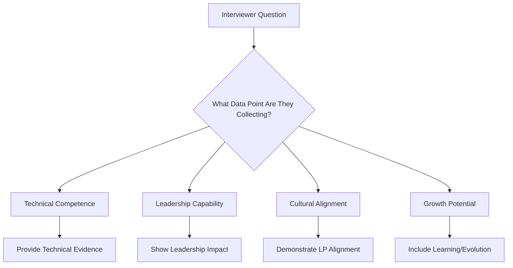

# Module 0: The Foundational Mindset & Meta-Framework

## 🧠 The Core Premise: You Are Presenting Evidence

The Amazon L6/L7 interview is fundamentally different from traditional technical interviews. It's not an interrogation—it's a structured data-gathering exercise where you present evidence of your capabilities.

!!! danger "Critical Mindset Shift"
    **Your Role**: Primary evidence provider demonstrating alignment with the Amazonian archetype
    
    **Interviewer's Role**: Trained data collectors probing against the Leadership Principles rubric
    
    **2025 Reality Check**: Per May 2025 candidate - "Amazon prioritized leadership questions over coding" - LPs are now given even MORE weight

### The Evidence Presentation Framework

Every answer you provide should be viewed through this lens:

```markdown
EVIDENCE Components:
- E: Empirical data (metrics, numbers, quantified impact)
- V: Verifiable outcomes (results that can be validated)
- I: Individual contribution (your specific role and actions)
- D: Demonstrable skills (competencies shown through actions)
- E: Enduring impact (lasting organizational changes)
- N: Narratable experience (clear, compelling story structure)
- C: Cultural alignment (Amazon Leadership Principles)
- E: Evolution shown (learning and growth demonstrated)
```

## 🎯 The Amazonian Archetype: Think Like a GM

### Core Identity: General Manager of a Small Business Unit

You must embody the mindset of a business owner, not just a technical leader.

#### L6 Archetype: GM of $10M+ Business Unit
- **Extreme Ownership**: Obsessive accountability for all outcomes within your scope
- **Pragmatic Innovation**: Relentless invention with simple, scalable solutions
- **Data-Driven Skepticism**: Default to metrics while questioning anecdotes
- **Customer Impact**: Every decision traced back to customer value

#### L7 Archetype: GM of $100M+ Business Unit  
- **Platform Thinking**: Solutions that scale across organizations
- **Strategic Influence**: Shaping company direction through technical vision
- **Industry Leadership**: Setting standards beyond just your company
- **Ecosystem Building**: Creating capabilities others build upon

### Real-World Application

**2024 Applied Scientist Interview Reality**: 
> "HM rounds are 50% technical, 50% management - you must embody both builder and leader"

This means demonstrating:
- Technical depth that earns respect from senior engineers
- Business acumen that aligns with product strategy
- Leadership capability that develops and scales teams
- Strategic thinking that sees beyond immediate problems

## 📊 Meta-Skill: Structured Communication

### Why This is the #1 Failure Reason

**Critical Insight**: Primary failure reason across all levels is inability to communicate in structured, evidence-based ways.

Common manifestations:
- Rambling STAR stories without clear outcomes
- Technical explanations that lose the business context
- System design narration that lacks logical flow
- Inability to handle rapid-fire behavioral questions

### The Amazon Communication Stack

```python
class AmazonCommunicationFramework:
    def __init__(self):
        self.layers = {
            "strategic": "Executive-level vision and impact",
            "tactical": "Implementation approach and decisions",
            "operational": "Execution details and metrics",
            "cultural": "Leadership Principles alignment"
        }
    
    def structure_response(self, question_type):
        if question_type == "behavioral":
            return self.star_plus_framework()
        elif question_type == "technical":
            return self.problem_solution_impact()
        elif question_type == "hypothetical":
            return self.framework_approach_tradeoffs()
    
    def star_plus_framework(self):
        return {
            "situation": "Context with stakes",
            "task": "Your specific ownership",
            "action": "Detailed implementation (60-70%)",
            "result": "Quantified outcomes",
            "reflection": "Learning and growth"
        }
```

### Rapid-Fire Response Framework

**2025 Trend Alert**: Candidates failing due to inability to handle rapid questions

```markdown
30-Second Response Structure:
1. Direct answer (5 seconds)
2. Key supporting point (10 seconds)
3. Specific example or metric (10 seconds)
4. Impact or outcome (5 seconds)

Example:
Q: "How do you handle technical debt?"
A: "I treat it as a business risk that requires systematic management. 
    In my current role, I allocate 20% of sprint capacity to debt reduction.
    Last quarter, this approach reduced our incident rate by 40%.
    The improved stability allowed us to accelerate feature delivery by 25%."
```

## 🔄 The Mental Models for Success

### Model 1: The Data Gathering Lens

View every question through this framework:



### Model 2: The Three-Level Answer

Every response should operate at three levels:

1. **Surface Level**: Direct answer to the question
2. **Deep Level**: Underlying principles and thinking
3. **Meta Level**: Connection to broader impact and learning

Example:
```markdown
Q: "Tell me about a difficult technical decision"

Surface: "I chose PostgreSQL over DynamoDB for our analytics platform"
Deep: "The decision balanced cost, query flexibility, and team expertise"
Meta: "This taught me that technical decisions must consider organizational capability, 
      not just technical merit. I now always assess team readiness alongside technical fit."
```

### Model 3: The Ownership Escalator

Show increasing ownership across your stories:

```markdown
Level 1 (Early Career): "I owned the implementation..."
Level 2 (Senior): "I owned the technical decision and outcome..."
Level 3 (Lead): "I owned the team's delivery and growth..."
Level 4 (L6): "I owned the cross-functional success..."
Level 5 (L7): "I owned the organizational transformation..."
```

## 💡 Critical Success Factors from 2024-2025

### What Winners Do Differently

Based on successful L6/L7 candidates from 2024-2025:

1. **They Present Evidence, Not Stories**
   - Every anecdote includes metrics
   - Outcomes are quantified and verified
   - Impact is traced to business value

2. **They Think in Systems**
   - Technical decisions consider organizational impact
   - Solutions address root causes, not symptoms
   - Implementations include operational excellence

3. **They Demonstrate Growth**
   - Each story shows evolution from previous ones
   - Failures are reframed as learning accelerators
   - Current approach shows incorporation of past lessons

### Fatal Interview Patterns to Avoid

**The "We" Trap**: Using "we" without clarifying your specific contribution
- ❌ "We redesigned the architecture"
- ✅ "I led the architecture redesign, specifically owning the data layer design while coordinating with two other architects on the service layer"

**The Technical Rabbit Hole**: Getting lost in implementation details
- ❌ 10 minutes on database indexing strategies
- ✅ 2 minutes on technical approach, 3 minutes on business impact

**The Perfect Story Syndrome**: Stories without struggle or learning
- ❌ Everything went smoothly and succeeded
- ✅ Include obstacles, trade-offs, and growth

## 🎓 Developing the Meta-Framework Mindset

### Daily Practice Exercises

1. **Evidence Collection Habit**
   - End each day documenting one quantified achievement
   - Format: Action → Metric → Impact → Learning

2. **Structured Communication Practice**
   - Explain a complex technical concept in 3 different timeframes:
     - 30 seconds (executive summary)
     - 2 minutes (manager level)
     - 5 minutes (technical deep dive)

3. **Leadership Principle Integration**
   - Take one daily decision and map it to 3 LPs
   - Explain how the decision demonstrates each principle

### The Pre-Interview Mindset Routine

```markdown
1 Week Before:
- Review all stories through evidence lens
- Practice rapid-fire responses daily
- Map experiences to multiple LPs

1 Day Before:
- Review your evidence portfolio
- Practice structured responses
- Prepare questions that show strategic thinking

1 Hour Before:
- Review your core framework
- Remind yourself: "I'm presenting evidence"
- Focus on being authentic within structure
```

## 📈 Measuring Your Readiness

### The Meta-Framework Self-Assessment

Rate yourself 1-5 on each dimension:

| Dimension | L6 Indicators | L7 Indicators | Your Score |
|-----------|---------------|---------------|------------|
| **Evidence Quality** | Team-level metrics | Org-level transformation | ___ |
| **Communication Structure** | Clear STAR stories | Multi-layered narratives | ___ |
| **Amazonian Thinking** | Customer-obsessed decisions | Platform-level vision | ___ |
| **Growth Demonstration** | Learning from failures | Systematic evolution | ___ |
| **Strategic Altitude** | Quarterly planning | Multi-year vision | ___ |

### Readiness Indicators

**Ready for L6** when you can:
- Tell 10+ stories with quantified business impact
- Explain technical decisions through business lens
- Demonstrate team leadership and development
- Show cross-functional influence

**Ready for L7** when you can:
- Present organizational transformation examples
- Articulate platform-level technical strategy
- Show influence on company direction
- Demonstrate industry-level thinking

## 🚀 Putting It All Together

### The Integration Challenge

For the next week, practice viewing everything through the meta-framework:

1. **Morning Planning**: Frame daily goals as evidence collection
2. **Decision Making**: Document rationale using LP framework
3. **Communication**: Practice structured responses in all meetings
4. **Evening Reflection**: Extract learnings and growth patterns

### Your Success Formula

```
Success = (Evidence Quality × Communication Structure × Cultural Alignment) ^ Authenticity
```

Where:
- Evidence Quality = Quantified, verifiable impact
- Communication Structure = Clear, logical narrative flow  
- Cultural Alignment = Natural LP demonstration
- Authenticity = Genuine experiences and learning

---

!!! success "Remember"
    The interview is your opportunity to present evidence of your readiness for the role. Every question is a chance to demonstrate that you'll raise the bar at Amazon. Focus on being the best authentic version of yourself within this framework.

---

*Next: [Story Engineering Workshop](../story-engineering/) →*