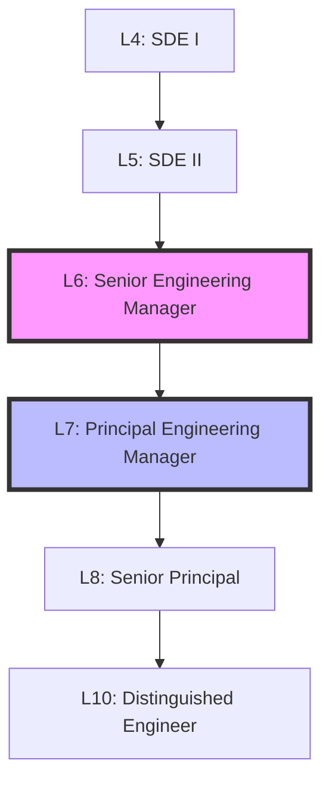
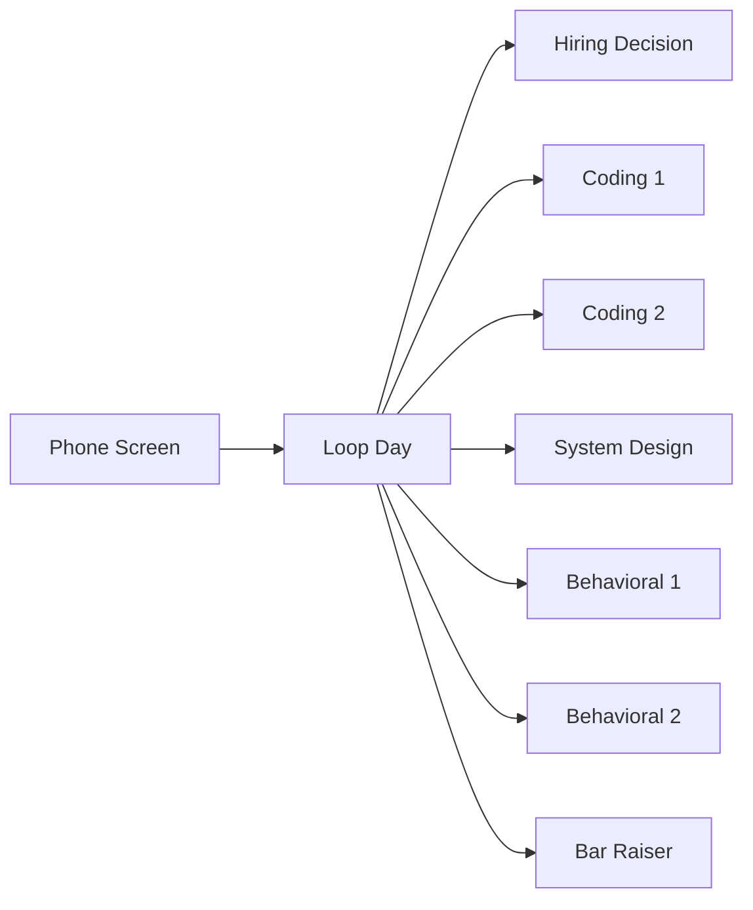
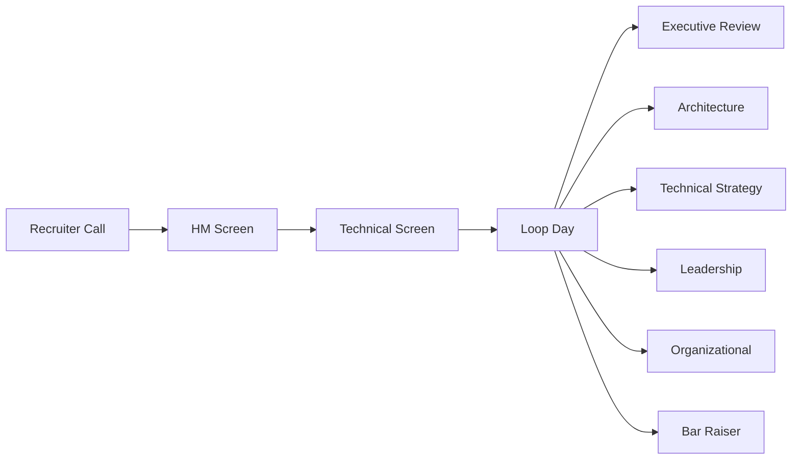

# Fundamentals of Amazon L6/L7 Engineering Manager Interviews

## 📚 Understanding the Foundation

Before diving into technical preparation, it's crucial to understand the fundamental differences between L6 and L7 roles at Amazon, the competencies required, and how the interview process evaluates these skills.

## 🎯 What This Section Covers

This section provides the foundational knowledge you need to understand:

- **Role Expectations**: Clear distinctions between L6 and L7 responsibilities
- **Technical Bar**: The depth and breadth of technical knowledge required
- **Leadership Integration**: How technical and leadership skills combine
- **Interview Structure**: The specific format and evaluation criteria
- **Success Factors**: What separates successful candidates

## 📊 The Amazon Engineering Manager Ladder



### Impact Scope by Level

| Level | Scope | Team Size | Business Impact | Technical Depth |
|-------|-------|-----------|-----------------|-----------------|
| **L6** | Multiple teams | 10-25 engineers | $10M+ initiatives | Component expert |
| **L7** | Organization | 100+ engineers | $100M+ initiatives | Domain expert |

## 🔍 Key Differentiators

### L6: Senior Engineering Manager

**Primary Focus**: Executing complex technical initiatives with excellence

- **Technical Leadership**: Deep expertise in specific technical domains
- **Team Building**: Growing and developing senior engineers
- **Delivery Excellence**: Consistent delivery of complex projects
- **Cross-team Collaboration**: Influencing 3-4 adjacent teams
- **Operational Excellence**: Maintaining high-performance systems

### L7: Principal Engineering Manager

**Primary Focus**: Setting technical vision and organizational transformation

- **Strategic Vision**: Defining multi-year technical strategies
- **Organizational Impact**: Influencing entire divisions
- **Innovation**: Creating industry-leading solutions
- **Executive Influence**: Regular interaction with VPs/SVPs
- **Talent Multiplication**: Developing other senior leaders

## 📋 Core Competencies Framework

### Technical Competencies

#### L6 Requirements
```python
technical_skills_L6 = {
    "programming": ["Expert in 1 language", "Proficient in 2+"],
    "system_design": ["Distributed systems", "Microservices", "APIs"],
    "cloud": ["AWS services", "Cost optimization", "Security"],
    "data": ["SQL/NoSQL", "Analytics", "ML basics"],
    "operations": ["CI/CD", "Monitoring", "Incident response"]
}
```

#### L7 Requirements
```python
technical_skills_L7 = {
    "architecture": ["Enterprise patterns", "Platform design", "Tech strategy"],
    "innovation": ["Patents", "New methodologies", "Industry influence"],
    "breadth": ["Multiple domains", "Cross-functional", "Emerging tech"],
    "depth": ["Recognized expert", "Published work", "Speaking engagements"],
    "vision": ["3-5 year roadmaps", "Technology trends", "Strategic bets"]
}
```

### Leadership Competencies

| Competency | L6 Expectation | L7 Expectation |
|------------|---------------|----------------|
| **People Leadership** | Manage managers, career development | Develop senior leaders, succession planning |
| **Technical Mentorship** | Guide senior engineers | Influence principal engineers |
| **Stakeholder Management** | Work with directors | Partner with VPs/SVPs |
| **Decision Making** | Component decisions | Organizational decisions |
| **Communication** | Clear team communication | Executive presentations |

## 🎬 Interview Process Overview

### L6 Interview Loop Structure



**Typical L6 Loop** (5-6 hours):
1. **Coding Rounds** (2): 45 minutes each
2. **System Design** (1): 60 minutes
3. **Behavioral** (2): 45 minutes each
4. **Bar Raiser** (1): 45-60 minutes

### L7 Interview Loop Structure



**Typical L7 Loop** (6-8 hours):
1. **Architecture Review** (1): 90 minutes
2. **Technical Strategy** (1): 60 minutes
3. **Leadership Case Studies** (2): 60 minutes each
4. **Organizational Impact** (1): 60 minutes
5. **Bar Raiser** (1): 60 minutes
6. **Executive Discussion** (optional): 30-45 minutes

## 🎯 Evaluation Criteria

### Technical Assessment Matrix

| Dimension | L6 Evaluation | L7 Evaluation |
|-----------|---------------|---------------|
| **Depth** | Component expert | Domain authority |
| **Breadth** | Multiple technologies | Cross-domain fluency |
| **Scale** | Millions of users | Billions of users |
| **Innovation** | Optimize existing | Create new paradigms |
| **Complexity** | Complicated systems | Complex ecosystems |

### Leadership Principles Mapping

**Most Critical for L6**:
1. **Deliver Results** - Consistent execution
2. **Ownership** - End-to-end responsibility
3. **Dive Deep** - Technical credibility
4. **Earn Trust** - Team leadership
5. **Hire and Develop** - Building teams

**Most Critical for L7**:
1. **Think Big** - Organizational vision
2. **Invent and Simplify** - Innovation at scale
3. **Are Right, A Lot** - Strategic decisions
4. **Have Backbone** - Influence up
5. **Success and Scale** - Organizational growth

## 📈 Success Metrics

### What Gets You Hired at L6

✅ **Technical Excellence**
- Solved all coding problems optimally
- Designed scalable, production-ready systems
- Demonstrated deep knowledge in 2-3 areas

✅ **Leadership Evidence**
- Clear examples of team leadership
- Mentorship of senior engineers
- Cross-team collaboration success

✅ **Delivery Track Record**
- Consistent delivery of complex projects
- Handled critical production issues
- Improved team productivity

### What Gets You Hired at L7

✅ **Visionary Leadership**
- Set technical direction for organizations
- Influenced industry standards
- Created new business capabilities

✅ **Organizational Impact**
- Transformed engineering culture
- Built platforms used by many teams
- Achieved step-function improvements

✅ **Executive Presence**
- Influenced C-level decisions
- Represented engineering externally
- Drove $100M+ initiatives

## 🚫 Common Failure Points

### L6 Interview Failures

❌ **Technical Gaps**
- Couldn't code efficiently under pressure
- System designs lacked production considerations
- Shallow understanding of distributed systems

❌ **Leadership Concerns**
- Examples showed IC work, not management
- Couldn't articulate team building approach
- Limited cross-team influence

### L7 Interview Failures

❌ **Scope Limitations**
- Thinking at team level, not organization
- Tactical focus vs strategic vision
- Limited influence beyond direct reports

❌ **Technical Depth**
- Couldn't go deep when challenged
- Outdated technical knowledge
- No innovation or thought leadership

## 📚 Preparation Resources

### Essential Reading
- [ ] "Staff Engineer" by Will Larson
- [ ] "An Elegant Puzzle" by Will Larson
- [ ] "The Manager's Path" by Camille Fournier
- [ ] Amazon's Leadership Principles deep dive
- [ ] AWS Well-Architected Framework

### Key Skills to Develop

**Technical Skills**:
- Advanced distributed systems
- Cloud architecture patterns
- Performance optimization
- Security best practices
- Cost optimization strategies

**Leadership Skills**:
- Executive communication
- Strategic thinking
- Organizational design
- Change management
- Talent development

## 🎬 Next Steps

1. **Assess Your Level**: Use our [L6 vs L7 comparison](l6-vs-l7.md) to determine your target level
2. **Understand Competencies**: Deep dive into [Technical Competencies](technical-competencies.md)
3. **Learn the Principles**: Master [Leadership Principles](leadership-principles.md)
4. **Know the Process**: Study the [Interview Process](interview-process.md) in detail

---

!!! tip "Pro Tip"
    The biggest mistake candidates make is not understanding the level expectations. L6 candidates who try to demonstrate L7 scope often fail because they can't back it up with depth. L7 candidates who focus on L6-level problems appear to lack strategic thinking. Know your level and prepare accordingly.

---

*Continue to: [L6 vs L7 Differences](l6-vs-l7.md) →*