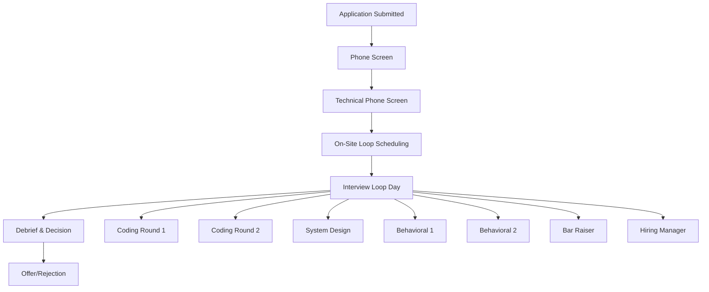

# Amazon L6/L7 Interview Process: Complete Guide

## Understanding Amazon's Engineering Manager Interview Philosophy

Amazon's interview process for L6/L7 Engineering Manager positions is designed to assess not just technical competence, but cultural fit, leadership potential, and the ability to "raise the bar" for the organization. Unlike traditional technical interviews, Amazon's process heavily emphasizes behavioral assessment through their 16 Leadership Principles, combined with technical depth evaluation.

!!! quote "2024-2025 Process Insights"
    **L7 Candidate (September 2024):** "The process was the most thorough I've experienced. Five rounds over three weeks, with each interviewer having a specific focus. The Bar Raiser round alone was 90 minutes of deep behavioral questions."
    
    **L6 Success (November 2024):** "What surprised me was how much they cared about the 'why' behind technical decisions. Every system design choice had to connect back to customer impact and business value."

## Complete Interview Process Overview

### Process Timeline and Structure



### Process Timing and Expectations

| Stage | Duration | Success Rate | Key Focus |
|-------|----------|--------------|-----------|
| **Phone Screen** | 30 minutes | 40-60% pass | Cultural fit and basic competence |
| **Technical Phone** | 45 minutes | 50-70% pass | Coding ability and problem-solving |
| **On-Site Loop** | 6-8 hours | 15-25% pass | Complete assessment across all dimensions |
| **Total Process** | 3-5 weeks | 8-15% overall | Comprehensive evaluation |

## Stage-by-Stage Deep Dive

### Stage 1: Initial Phone Screen (30 minutes)

```markdown
**Interviewer Profile:**
- Recruiter or hiring manager
- Trained in Leadership Principles assessment
- No veto power over hire decision

**Typical Structure:**
- 5 minutes: Role and process overview
- 15 minutes: Behavioral questions (2-3 Leadership Principles)
- 5 minutes: Technical background discussion
- 5 minutes: Logistics and next steps

**Common Questions:**
- "Tell me about your current role and biggest technical challenges"
- "Why Amazon and why this specific team?"
- "Give me an example of a time you had to make a difficult decision"
- "Describe your management philosophy"

**Success Criteria:**
- Clear communication and storytelling ability
- Genuine interest in Amazon and the role
- Evidence of leadership and technical background
- Cultural alignment with Amazon values
```

#### Phone Screen Preparation Strategy

```python
# Phone screen success framework
phone_screen_prep = {
    "opening_introduction": {
        "duration": "2_minutes",
        "content": [
            "Current role and team size",
            "Key technical responsibilities", 
            "Recent major accomplishment",
            "Why exploring Amazon opportunity"
        ]
    },
    
    "leadership_stories": {
        "quantity": "3_prepared_stories",
        "focus": ["Ownership", "Customer_Obsession", "Deliver_Results"],
        "length": "3_4_minutes_each",
        "structure": "STAR_format"
    },
    
    "questions_to_ask": [
        "What are the biggest technical challenges facing the team?",
        "How does this role contribute to Amazon's customer obsession?",
        "What does success look like in the first 90 days?",
        "What growth opportunities exist for engineering leaders?"
    ]
}
```

### Stage 2: Technical Phone Screen (45 minutes)

```markdown
**Interviewer Profile:**
- Senior engineer (L5-L6) from the hiring team
- Technical assessment focused
- Evaluates coding ability and system thinking

**Typical Structure:**
- 5 minutes: Technical background and warm-up
- 30 minutes: Coding problem (usually LeetCode Medium)
- 10 minutes: System design mini-question or technical discussion

**Technical Expectations:**
- Clean, working code in your preferred language
- Optimal time and space complexity
- Edge case handling and testing discussion
- Clear communication of approach and trade-offs

**L6 vs L7 Differentiation:**
- L6: Focus on implementation quality and optimization
- L7: Emphasis on architectural thinking and scalability considerations
```

#### Technical Phone Screen Success Framework

```markdown
**Coding Problem Approach:**
1. **Clarify Requirements (5 minutes)**
   - Ask about input constraints and edge cases
   - Confirm expected output format
   - Understand performance requirements
   - Clarify if follow-up variations expected

2. **Design Solution (10 minutes)**
   - Explain your high-level approach
   - Discuss time/space complexity
   - Consider multiple approaches and trade-offs
   - Get interviewer buy-in before coding

3. **Implement Solution (15 minutes)**
   - Write clean, readable code
   - Handle edge cases appropriately
   - Test with example inputs
   - Optimize if time permits

4. **Discuss Extensions (5 minutes)**
   - How would you scale this solution?
   - What if input size increased 1000x?
   - How would you monitor this in production?
   - What additional features might be needed?
```

### Stage 3: On-Site Interview Loop (6-8 hours)

The on-site loop is the core of Amazon's assessment process, typically consisting of 6-7 rounds conducted in a single day or across two days for remote interviews.

#### Round 1 & 2: Coding Interviews (45 minutes each)

```markdown
**Interview Focus:**
- Data structures and algorithms proficiency
- Code quality and engineering practices
- Problem-solving methodology
- Communication and collaboration skills

**L6 Coding Expectations:**
- Solve medium complexity problems efficiently
- Write production-quality code
- Demonstrate debugging and testing approach
- Show familiarity with multiple programming languages

**L7 Coding Expectations:**
- Solve problems with architectural implications
- Discuss scalability and maintenance considerations
- Demonstrate deep computer science fundamentals
- Connect coding decisions to business impact

**Common Problem Categories:**
- Array/String manipulation with optimization
- Tree/Graph traversal and modification
- Dynamic programming for efficiency
- System design coding (smaller scale)
```

##### Coding Interview Success Strategies

```python
# L6/L7 coding interview framework
coding_success_framework = {
    "problem_solving_approach": {
        "step_1": "Understand and clarify the problem",
        "step_2": "Design algorithm with examples", 
        "step_3": "Analyze time and space complexity",
        "step_4": "Implement clean, tested solution",
        "step_5": "Optimize and discuss alternatives"
    },
    
    "technical_communication": {
        "think_aloud": "Verbalize your thought process",
        "trade_offs": "Discuss multiple approaches",
        "edge_cases": "Consider boundary conditions",
        "testing": "Walk through examples and edge cases",
        "optimization": "Explain improvement opportunities"
    },
    
    "l7_differentiators": {
        "architectural_thinking": "How would this scale?",
        "business_impact": "Why does performance matter here?",
        "team_context": "How would you teach this approach?",
        "production_concerns": "How would you monitor this?"
    }
}
```

#### Round 3: System Design Interview (60-90 minutes)

```markdown
**Interview Structure:**
- 10 minutes: Requirements clarification
- 20 minutes: High-level architecture design
- 20 minutes: Deep dive into key components
- 10 minutes: Scaling and operational concerns
- 10 minutes: Follow-up questions and discussion

**L6 System Design Focus:**
- Design scalable systems for millions of users
- Demonstrate understanding of distributed systems
- Show practical knowledge of common patterns
- Focus on implementation feasibility

**L7 System Design Focus:**
- Design platform-level systems for billions of users
- Show innovation and creative problem-solving
- Demonstrate deep understanding of trade-offs
- Focus on organizational and operational implications

**Common Problem Types:**
- Design a social media feed system
- Build a real-time messaging platform  
- Create a distributed caching solution
- Design a global content delivery network
```

##### System Design Excellence Framework

```yaml
# System design interview success pattern
system_design_approach:
  requirements_gathering:
    functional_requirements:
      - Core user journeys and use cases
      - Key features and functionality
      - Success metrics and constraints
    
    non_functional_requirements:
      - Scale: users, requests, data volume
      - Performance: latency, throughput
      - Availability: uptime requirements
      - Consistency: data consistency needs
  
  high_level_design:
    components:
      - Client applications (web, mobile)
      - Load balancers and API gateways
      - Application services
      - Data storage layers
      - External integrations
    
    data_flow:
      - Request/response patterns
      - Asynchronous processing
      - Event-driven communication
      - Batch processing workflows
  
  deep_dive_areas:
    database_design:
      - Schema design and relationships
      - Indexing and query optimization
      - Sharding and replication strategies
      - Consistency and transaction management
    
    caching_strategy:
      - Cache layers and hierarchies
      - Cache invalidation strategies
      - Performance optimization
      - Cache warming and monitoring
    
    scaling_approach:
      - Horizontal vs vertical scaling
      - Microservices decomposition
      - Load balancing strategies
      - Auto-scaling and capacity planning
```

#### Round 4 & 5: Behavioral Interviews (45-60 minutes each)

```markdown
**Interview Focus Areas:**

**Behavioral Round 1: Leadership & People Management**
- Team building and development
- Conflict resolution and difficult conversations
- Performance management and coaching
- Cultural change and organizational improvement

**Behavioral Round 2: Cross-Functional Leadership**
- Influencing without authority
- Technical decision-making and trade-offs
- Customer-focused leadership
- Innovation and process improvement

**Interview Structure:**
- 5-10 minutes: Role context and background
- 35-45 minutes: 3-4 deep behavioral questions
- 5-10 minutes: Questions and follow-up

**Leadership Principles Coverage:**
Each behavioral round typically covers 4-6 Leadership Principles with deep follow-up questions and scenario exploration.
```

##### Behavioral Interview Success Framework

```markdown
**Preparation Strategy:**

**Story Portfolio Development:**
- 12-15 prepared STAR stories covering all major LPs
- Stories spanning different roles, teams, and time periods
- Mix of technical leadership and people management examples
- Include both success and failure/learning stories

**LP Deep Dive Examples:**

**Customer Obsession (L6 level):**
"As engineering manager for our mobile team, I noticed our app crash rate was 3x higher than industry standard. Even though leadership prioritized new features, I allocated 40% of sprint capacity to stability improvements. I personally reviewed every crash report and created a customer impact dashboard. Result: Crash rate dropped 85%, app store rating improved from 3.2 to 4.7, and user retention increased 25%."

**Customer Obsession (L7 level):**
"Leading platform engineering across 5 product teams, I identified that our microservices approach was causing customer-facing latency issues. I spearheaded a complete architectural review involving 50+ engineers, resulting in a new service mesh pattern that reduced P95 latency by 60% across all products. This became the company standard and enabled 2 new product lines that were previously impossible due to performance constraints."

**Ownership (L6 level):**
"When our quarterly delivery was at risk due to technical debt, I didn't wait for executive direction. I created a comprehensive technical debt assessment, presented a plan to leadership that balanced immediate delivery with long-term sustainability, and personally led the implementation across 3 teams. We delivered our quarter and improved velocity by 30% ongoing."

**Ownership (L7 level):**
"Recognizing that our entire engineering organization lacked consistent incident response practices, I took initiative to drive standardization across 15 teams without formal authority. I created a working group, facilitated consensus-building, and implemented a phased rollout. Result: 60% reduction in incident resolution time and a culture of shared responsibility that extended beyond incidents to general operational excellence."
```

#### Round 6: Bar Raiser Interview (60-90 minutes)

```markdown
**Bar Raiser Profile:**
- Senior Amazon employee (L6+) from different organization
- Specially trained in Amazon's cultural assessment
- Has veto power over the hiring decision
- Focused on cultural fit and long-term potential

**Interview Focus:**
- Deep cultural assessment through Leadership Principles
- Values-based decision making scenarios
- Long-term potential and growth trajectory
- Authentic leadership demonstration

**Interview Style:**
- Conversational but intensive questioning
- "Tell me more about..." follow-ups
- Hypothetical scenario questions
- Value-based ethical dilemmas

**Success Indicators:**
- Authentic stories with genuine learning
- Consistent values demonstration across examples
- Growth mindset and self-reflection
- Cultural addition rather than just cultural fit
```

For detailed Bar Raiser preparation, see our [Bar Raiser Deep Dive Guide](../behavioral/bar-raiser.md).

#### Round 7: Hiring Manager Interview (45-60 minutes)

```markdown
**Interview Focus:**
- Role-specific technical and leadership fit
- Team culture and collaboration style
- Vision alignment and strategic thinking
- Practical "day 1" readiness assessment

**Typical Structure:**
- 15 minutes: Deep dive into relevant experience
- 20 minutes: Technical and strategic scenarios
- 15 minutes: Team fit and collaboration discussion
- 10 minutes: Questions and role logistics

**Success Factors:**
- Demonstrated expertise relevant to team's challenges
- Clear understanding of team's mission and goals
- Collaborative and adaptive leadership style
- Realistic expectations and genuine interest
```

## Interview Process Timeline and Logistics

### Typical Process Timeline

```markdown
**Week 1: Application and Initial Contact**
- Day 1: Application submitted
- Day 3-5: Recruiter initial outreach
- Day 7: Phone screen scheduled

**Week 2: Phone Screens**
- Day 1: Phone screen completed
- Day 3-5: Technical phone screen
- Day 7: On-site loop scheduling begins

**Week 3-4: On-Site Preparation**
- Week 3: Interview loop finalization
- Week 4: On-site interviews conducted

**Week 5: Decision and Offer**
- Day 1-2: Interview debrief and decision
- Day 3-5: Reference checks (if positive decision)
- Day 7: Offer or rejection communication
```

### Remote Interview Adaptations (2024-2025)

```yaml
remote_interview_process:
  format_changes:
    duration: "Spread across 2-3 days instead of single day"
    technology: "Amazon Chime with screen sharing"
    coding_platform: "CoderPad or similar collaborative environment"
    whiteboarding: "Digital whiteboard (Miro, Draw.io)"
  
  preparation_adjustments:
    technical_setup:
      - Stable internet connection with backup
      - Quiet environment with good lighting
      - Dual monitor setup recommended
      - Whiteboard or large paper for sketching
    
    communication_adaptations:
      - More explicit verbal communication
      - Frequent check-ins with interviewer
      - Screen sharing comfort for coding/design
      - Clear articulation of thought process
  
  success_factors:
    engagement: "Maintain eye contact with camera"
    clarity: "Speak clearly and manage audio/video"
    interaction: "Ask for clarification when needed"
    technology: "Test all tools beforehand"
```

## L6 vs L7 Process Differences

### Interview Scope and Expectations

| Dimension | L6 Expectations | L7 Expectations |
|-----------|-----------------|-----------------|
| **Coding Rounds** | 2 rounds, medium problems | 1-2 rounds, architectural focus |
| **System Design** | 60 minutes, team-scale systems | 90 minutes, platform-scale systems |
| **Behavioral Depth** | Team leadership examples | Organizational transformation examples |
| **Technical Scope** | Multi-team coordination | Cross-org platform development |
| **Strategic Thinking** | Quarterly/annual planning | Multi-year vision and strategy |
| **Interview Duration** | 6-7 hours total | 7-8 hours total |

### Success Criteria Differentiation

```markdown
**L6 Success Profile:**
- Excellent execution and delivery track record
- Strong team leadership and development capabilities
- Technical depth in 2-3 core areas
- Cross-functional collaboration skills
- Customer-focused decision making

**L7 Success Profile:**
- Organizational transformation leadership
- Strategic technical vision and platform thinking
- Executive stakeholder management
- Industry influence or recognition
- Innovation and thought leadership

**Common Failure Patterns:**

**L6 Candidates:**
- Focusing too much on individual technical contributions
- Insufficient team leadership and people development examples
- Lack of cross-functional influence and collaboration
- Not demonstrating customer impact effectively

**L7 Candidates:**
- Not showing sufficient depth in organizational change
- Lack of platform-level thinking and system architecture
- Insufficient evidence of industry influence or innovation
- Not demonstrating strategic long-term thinking
```

## Common Failure Points and Recovery Strategies

### Technical Interview Failures

```markdown
**Common Coding Failures:**
1. **Panic and Mental Blocks**
   - Recovery: Take a breath, ask for clarification, start with simpler approach
   - Prevention: Practice under time pressure, have backup approaches ready

2. **Over-Engineering Solutions**
   - Recovery: Step back and solve the core problem first, then optimize
   - Prevention: Always start with working solution, then enhance

3. **Poor Communication**
   - Recovery: Pause and explain your current thinking, ask if approach makes sense
   - Prevention: Practice thinking aloud, get feedback on communication style

**System Design Failures:**
1. **Jumping to Implementation Too Quickly**
   - Recovery: Return to requirements, rebuild high-level architecture
   - Prevention: Always clarify requirements thoroughly before designing

2. **Ignoring Scale and Non-Functional Requirements**
   - Recovery: Ask about scale, explicitly address performance and reliability
   - Prevention: Create template checklist for system design considerations

3. **Not Considering Operational Aspects**
   - Recovery: Discuss monitoring, deployment, and maintenance explicitly
   - Prevention: Always include operational concerns in design discussions
```

### Behavioral Interview Failures

```markdown
**Common Behavioral Failures:**
1. **Vague or Generic Stories**
   - Recovery: Ask for permission to provide more specific details
   - Prevention: Practice stories with specific metrics and outcomes

2. **Lack of Personal Ownership**
   - Recovery: Clarify your specific role and contributions to team results
   - Prevention: Use "I" statements and quantify personal impact

3. **Insufficient Learning or Growth**
   - Recovery: Connect story to specific behavior changes or skills developed
   - Prevention: Include genuine reflection and growth in every story

4. **Missing Leadership Principle Connection**
   - Recovery: Explicitly connect your actions to Amazon's values
   - Prevention: Map each story to 2-3 specific Leadership Principles
```

### Bar Raiser Interview Failures

```markdown
**Critical Bar Raiser Failure Modes:**
1. **Inauthentic or Rehearsed Responses**
   - Signs: Stories sound too perfect, lack emotional content
   - Recovery: Be more vulnerable, share genuine struggles and learning
   - Prevention: Use real experiences with genuine stakes and emotions

2. **Values Misalignment**
   - Signs: Prioritizing individual achievement over team/customer success
   - Recovery: Refocus on team development and customer impact
   - Prevention: Deeply understand Amazon's cultural values and priorities

3. **Lack of Cultural Growth**
   - Signs: No examples of changing approach based on feedback or failure
   - Recovery: Share authentic learning experiences and behavior changes
   - Prevention: Prepare stories that show genuine personal and professional evolution

4. **Arrogance or Lack of Humility**
   - Signs: Not acknowledging mistakes, blaming others for failures
   - Recovery: Take ownership, show vulnerability and learning
   - Prevention: Practice acknowledging contributions of others and personal growth areas
```

## Post-Interview Process and Decision Making

### Amazon's Decision Framework

```markdown
**Debrief Process:**
1. **Individual Assessments** (Day 1)
   - Each interviewer submits detailed written feedback
   - Specific examples and evidence for each evaluation area
   - Clear hire/no-hire recommendation with reasoning

2. **Debrief Meeting** (Day 1-2)
   - All interviewers discuss candidate performance
   - Bar Raiser facilitates and can override consensus
   - Hiring manager makes final decision with Bar Raiser agreement

3. **Reference Checks** (Day 2-3, if positive decision)
   - Professional references contacted
   - Focus on leadership style and cultural fit
   - Confirmation of achievements and impact claims

4. **Final Decision** (Day 3-5)
   - Offer or rejection communication
   - Detailed feedback provided (for rejections)
   - Negotiation process begins (for offers)

**Decision Criteria:**
- All technical rounds must be "hire" or "lean hire"
- All behavioral rounds must be "hire" or "lean hire"  
- Bar Raiser must be "hire" (has veto power)
- Hiring manager must be "hire"
- Overall consensus on cultural fit and raising the bar
```

### What to Expect After Interviews

```markdown
**Timeline Expectations:**
- **Immediate**: Thank you email to recruiter within 24 hours
- **Day 1-2**: Internal debrief and initial decision
- **Day 3-5**: Reference checks and final decision
- **Day 5-7**: Official communication of outcome

**Positive Indicators During Process:**
- Interviews run over allocated time (engagement)
- Interviewers share details about team and challenges
- Multiple follow-up questions and deep dives
- Conversational tone rather than interrogational
- Discussion of onboarding and early priorities

**Concerning Indicators:**
- Interviews end early or feel rushed
- Limited follow-up questions or engagement
- Repetitive questions across multiple rounds
- Interviewers seem distracted or disengaged
- No discussion of role specifics or team dynamics

**If Rejected:**
- Amazon provides detailed feedback on failure areas
- Opportunity to reapply after 6-12 months
- Specific guidance on skills/experience to develop
- Potential fit for different roles or teams
```

##  Complete Interview Preparation Checklist

### 8 Weeks Before Interview

```markdown
**Foundation Building:**
- [ ] Study Amazon Leadership Principles deeply
- [ ] Map current experience to LP examples
- [ ] Begin technical skills assessment and practice
- [ ] Research target team and recent Amazon initiatives

**Technical Preparation:**
- [ ] Complete 50+ LeetCode problems (Medium level)
- [ ] Practice 10+ system design problems
- [ ] Review computer science fundamentals
- [ ] Practice coding in collaborative environments

**Behavioral Preparation:**
- [ ] Develop 12-15 STAR stories covering all LPs
- [ ] Practice telling stories in 4-6 minute format
- [ ] Get feedback on story clarity and impact
- [ ] Map stories to specific LP combinations
```

### 4 Weeks Before Interview

```markdown
**Intensive Practice:**
- [ ] Conduct 3+ mock interviews with experienced practitioners
- [ ] Practice system design with whiteboarding
- [ ] Refine behavioral stories based on feedback
- [ ] Research specific team challenges and opportunities

**Process Preparation:**
- [ ] Understand interview schedule and logistics
- [ ] Prepare thoughtful questions for each interviewer
- [ ] Plan arrival and setup for interview day
- [ ] Prepare materials and references
```

### 1 Week Before Interview

```markdown
**Final Preparation:**
- [ ] Review all prepared materials one final time
- [ ] Practice coding problems for speed and accuracy
- [ ] Rehearse key behavioral stories for natural delivery
- [ ] Prepare questions specific to each interview round
- [ ] Plan interview day logistics and contingencies
- [ ] Get adequate rest and manage stress levels
```

### Interview Day

```markdown
**Day-Of Success Factors:**
- [ ] Arrive early and composed
- [ ] Bring energy and enthusiasm to each round
- [ ] Take breaks to reset between interviews
- [ ] Stay hydrated and maintain energy levels
- [ ] Ask thoughtful questions in each round
- [ ] Thank each interviewer and express genuine interest
```

## Key Takeaways and Success Principles

!!! success "Critical Success Factors"
    1. **Technical Excellence**: Demonstrate strong coding and system design capabilities appropriate for your level
    2. **Leadership Impact**: Show concrete examples of leading teams and driving results through others
    3. **Cultural Alignment**: Authentically demonstrate Amazon's Leadership Principles through real experiences
    4. **Customer Focus**: Connect all technical and leadership decisions to customer value and impact
    5. **Continuous Growth**: Show learning mindset and ability to raise the bar for yourself and others

### Final Interview Strategy

```markdown
**The Amazon Interview Success Formula:**

**Technical Competence** + **Leadership Impact** + **Cultural Fit** = **Hire Decision**

**Where:**
- Technical Competence = Coding proficiency + System design capability + Engineering judgment
- Leadership Impact = People development + Cross-functional influence + Results delivery
- Cultural Fit = Leadership Principles demonstration + Customer obsession + Growth mindset

**Remember:**
- Be authentic and vulnerable in your storytelling
- Focus on customer and business impact, not just technical achievements  
- Show how you develop others and build organizational capability
- Demonstrate learning from failures and continuous improvement
- Express genuine enthusiasm for Amazon's mission and culture
```

---

**Related Resources:**
- [L6 vs L7 Comparison](l6-vs-l7.md) - Detailed level expectations and differences
- [Leadership Principles Guide](leadership-principles.md) - Complete LP preparation
- [STAR Framework Mastery](../behavioral/star-framework.md) - Behavioral interview excellence
- [System Design Fundamentals](../system-design/fundamentals.md) - Technical interview preparation

*Continue to: [Technical Competencies](technical-competencies.md) *