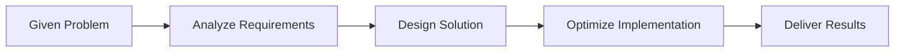
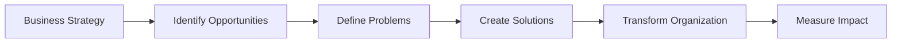

# L6 vs L7: Understanding the Critical Differences

## 🎯 The Fundamental Distinction

The gap between L6 and L7 at Amazon represents one of the most significant career transitions in engineering management. **L6 is about excellence in execution**, while **L7 is about transformation and vision**. This distinction affects every aspect of the role and interview process.

!!! quote "Real Insights from 2024-2025 Candidates"
    **L7 Wisdom (June 2024):** "Soft skills are everything in people management. Empathy. Empathy. Empathy."
    
    **March 2025 L6 to L7 Promotion:** "The leap from L6 to L7 isn't about managing more people—it's about thinking in systems and influencing across organizational boundaries."

## 📚 Real Examples & Case Studies

- **[Success Story Templates](../experiences/success-templates.md)** - Quantified examples at L6 vs L7 scope
- **[Failure Case Studies](../experiences/failure-case-studies.md)** - L7 rejection due to weak strategic thinking
- **[Technical Examples](../experiences/technical-examples.md)** - Same problems, different approaches by level

## 📊 Comprehensive Comparison Matrix

### Role Scope & Impact

| Dimension | L6: Senior Engineering Manager | L7: Principal Engineering Manager |
|-----------|--------------------------------|-----------------------------------|
| **Team Size** | 10-25 engineers | 100+ engineers |
| **Org Influence** | 2-4 teams | Entire division/multiple orgs |
| **Budget Responsibility** | $1-10M | $10-100M+ |
| **Planning Horizon** | 6-12 months | 2-5 years |
| **Decision Impact** | Component/Service | Platform/Business Line |
| **Reporting Level** | Director | VP/SVP |
| **External Visibility** | Team/Department | Company/Industry |

### Technical Requirements

#### L6 Technical Bar
```python
{
    "coding": {
        "expectation": "Solve medium problems efficiently",
        "interview_rounds": 2,
        "time_per_problem": "30-40 minutes",
        "focus": "Clean, production-ready code"
    },
    "system_design": {
        "scope": "Multi-team systems",
        "scale": "Millions of users",
        "depth": "Component expert",
        "examples": [
            "Design a booking system",
            "Build a recommendation engine",
            "Create a payment platform"
        ]
    },
    "expertise_areas": 2-3,
    "patents/papers": "Nice to have",
    "speaking": "Internal tech talks"
}
```

#### L7 Technical Bar
```python
{
    "coding": {
        "expectation": "Architectural implications matter more than syntax",
        "interview_rounds": "0-1",
        "time_per_problem": "20-30 minutes",
        "focus": "Design patterns and trade-offs"
    },
    "system_design": {
        "scope": "Organization-wide platforms",
        "scale": "Billions of users",
        "depth": "Domain authority",
        "examples": [
            "Design AWS service from scratch",
            "Architect ML platform for company",
            "Create global logistics network"
        ]
    },
    "expertise_areas": "4-5",
    "patents/papers": "Expected",
    "speaking": "Industry conferences"
}
```

## 🔍 Deep Dive: Key Differentiators

### 1. Technical Depth vs. Breadth

**L6: Deep Expertise in Focused Areas**
- Master of 2-3 technical domains
- Go-to person for specific technologies
- Can debug any issue in their domain
- Writes technical documentation and RFCs

**L7: Broad Expertise with Strategic Depth**
- Fluent across 4-5 technical domains
- Sets technical standards for organization
- Identifies industry trends and paradigm shifts
- Influences technical strategy at company level

### 2. Problem-Solving Approach

**L6: Solving Known Problems Better**


**L7: Identifying Which Problems to Solve**


### 3. Leadership Scope

**L6 Leadership Characteristics:**
- Manages 2-3 team leads
- Mentors senior engineers (L5)
- Influences peer teams
- Drives execution excellence
- Resolves conflicts within teams

**L7 Leadership Characteristics:**
- Manages senior managers (L6)
- Develops future leaders
- Influences across organizations
- Drives cultural transformation
- Navigates political dynamics

## 💼 Interview Process Differences

### L6 Interview Focus Areas

| Round | Duration | Focus | Success Criteria |
|-------|----------|-------|------------------|
| **Coding 1** | 45 min | Data structures | Optimal solution, clean code |
| **Coding 2** | 45 min | Algorithms | Problem-solving approach |
| **System Design** | 60 min | Scalable systems | Production-ready design |
| **Behavioral 1** | 45 min | Team leadership | STAR stories, results |
| **Behavioral 2** | 45 min | Technical leadership | Cross-team influence |
| **Bar Raiser** | 60 min | Cultural fit | Raises the bar |

### L7 Interview Focus Areas

| Round | Duration | Focus | Success Criteria |
|-------|----------|-------|------------------|
| **Architecture** | 90 min | Platform design | Innovation, scale |
| **Technical Strategy** | 60 min | Vision & roadmap | Industry impact |
| **Organizational** | 60 min | Transformation | Culture change |
| **Leadership Case** | 60 min | Executive scenarios | Strategic thinking |
| **Bar Raiser** | 60 min | Organizational fit | Transformational leader |
| **Executive** | 45 min | Vision alignment | Executive presence |

## 📈 Promotion Path: L6 to L7

### What It Takes to Move Up

The promotion from L6 to L7 is notoriously difficult. You must:

1. **Perform at L7 for 12-18 months** before promotion
2. **Demonstrate impact beyond your organization**
3. **Show consistent innovation** and thought leadership
4. **Build reputation** across the company
5. **Have executive sponsorship** (VP level or above)

### The Numbers Game

```
L6 Pool: 100 managers
├── Top 10%: Promoted to L7 (eventually)
├── Next 20%: Strong performers, may promote in 3-5 years
├── Middle 50%: Solid L6s, likely career level
└── Bottom 20%: Performance concerns or wrong level
```

!!! warning "Reality Check"
    Only about **10% of L6s ever make it to L7**. The average time at L6 before promotion is **3-5 years**, with many never advancing despite strong performance.

## 🎭 Behavioral Expectations

### L6 Behavioral Themes

**Typical Questions:**
- "Tell me about a time you turned around an underperforming team"
- "Describe a technical decision you made that was unpopular"
- "How did you handle a conflict between team members?"

**Expected Responses Show:**
- Direct team impact
- Technical hands-on involvement
- Tactical problem-solving
- Quarterly/annual results

### L7 Behavioral Themes

**Typical Questions:**
- "How did you transform engineering culture in your organization?"
- "Describe a technical strategy that changed your company's direction"
- "Tell me about influencing a decision you disagreed with at VP level"

**Expected Responses Show:**
- Organizational transformation
- Strategic thinking
- Long-term vision
- Multi-year impact

## 💰 Compensation Differences

### Typical L6 Package (2024)
```
Base Salary: $180K - $220K
RSUs: $300K - $500K (4 years)
Signing Bonus: $100K - $150K (2 years)
Total Comp Year 1: $350K - $450K
```

### Typical L7 Package (2024)
```
Base Salary: $220K - $280K
RSUs: $600K - $1.2M (4 years)
Signing Bonus: $200K - $300K (2 years)
Total Comp Year 1: $500K - $700K
```

## 🎯 Decision Framework: Should You Target L6 or L7?

### Target L6 If You Have:

✅ 8-12 years of experience
✅ Managed teams of 10-20 people
✅ Led multi-quarter projects
✅ Deep expertise in 2-3 areas
✅ Delivered significant features/products
✅ Strong coding skills

### Target L7 If You Have:

✅ 12+ years of experience
✅ Managed organizations of 50+ people
✅ Led multi-year transformations
✅ Recognized expertise (patents, talks)
✅ Influenced at VP/C-level
✅ Built platforms/frameworks widely adopted

## 📚 Specific Preparation Differences

### L6 Preparation Priority
1. **Coding practice** (30% of time)
2. **System design** (35% of time)
3. **Behavioral stories** (25% of time)
4. **Leadership principles** (10% of time)

### L7 Preparation Priority
1. **System architecture** (40% of time)
2. **Strategic thinking** (25% of time)
3. **Organizational leadership** (25% of time)
4. **Technical vision** (10% of time)

## 🚀 Example Scenarios

### L6 Scenario: "Design a Ride-Sharing Service"

**Expected Approach:**
- Focus on core functionality
- Design for millions of users
- Consider operational aspects
- Discuss team structure to build it
- Address immediate scaling challenges

### L7 Scenario: "Design a Global Ride-Sharing Platform"

**Expected Approach:**
- Consider multiple business models
- Design for billions of users globally
- Address regulatory compliance across countries
- Discuss organizational structure for 500+ engineers
- Plan for 5-year technology evolution

## ✅ Quick Assessment: Are You Ready?

### L6 Readiness Checklist
- [ ] Can solve LeetCode mediums in 30 minutes
- [ ] Have designed systems serving millions
- [ ] Led teams through major deliverables
- [ ] Have 10+ strong STAR stories
- [ ] Comfortable with 3+ programming languages

### L7 Readiness Checklist
- [ ] Have transformed organizations
- [ ] Created widely-adopted platforms
- [ ] Influenced executive decisions
- [ ] Published papers or patents
- [ ] Recognized as domain expert

## 🎬 Key Takeaways

!!! success "Critical Points"
    1. **L6 excels at execution, L7 excels at vision**
    2. **L6 optimizes systems, L7 reinvents them**
    3. **L6 leads teams, L7 leads leaders**
    4. **L6 influences locally, L7 influences globally**
    5. **L6 solves problems, L7 identifies opportunities**

---

!!! tip "Interview Strategy"
    **Never try to fake a higher level**. If you're L6, excel at L6 expectations. Trying to appear L7 without the depth will backfire. Conversely, L7 candidates who focus on L6-level details appear to lack strategic thinking.

---

*Next: [Technical Competencies Required](technical-competencies.md) →*