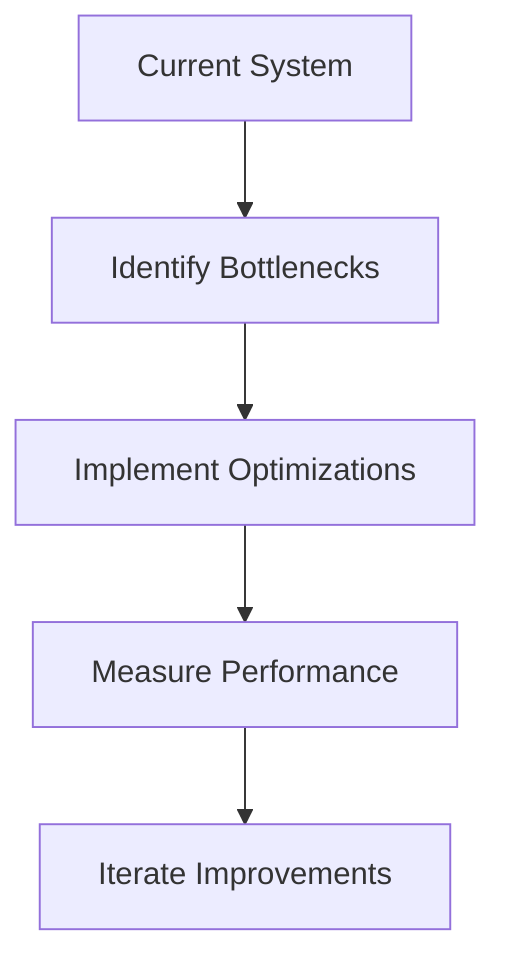
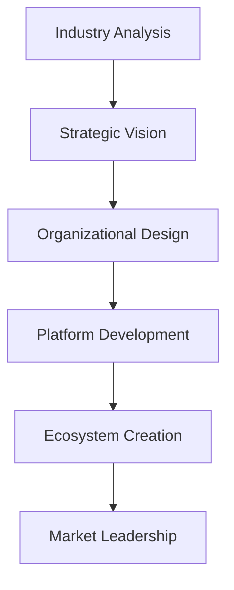
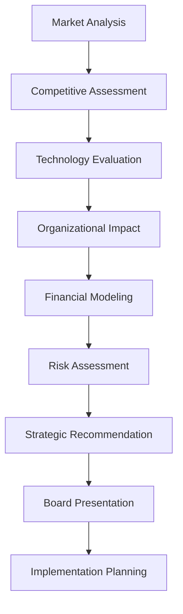
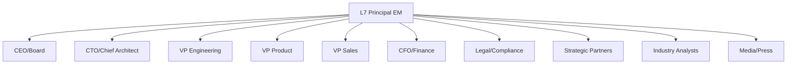

# L6 vs L7: Understanding the Critical Differences

## The Fundamental Distinction

The gap between L6 and L7 at Amazon represents one of the most significant career transitions in engineering management. **L6 is about excellence in execution**, while **L7 is about transformation and vision**. This distinction affects every aspect of the role and interview process.

!!! quote "Real Insights from 2024-2025 Candidates"
    **L7 Wisdom (June 2024):** "Soft skills are everything in people management. Empathy. Empathy. Empathy."
    
    **March 2025 L6 to L7 Promotion:** "The leap from L6 to L7 isn't about managing more people—it's about thinking in systems and influencing across organizational boundaries."

## Real Examples & Case Studies

- **[Success Story Templates](../experiences/success-templates.md)** - Quantified examples at L6 vs L7 scope
- **[Failure Case Studies](../experiences/failure-case-studies.md)** - L7 rejection due to weak strategic thinking
- **[Technical Examples](../experiences/technical-examples.md)** - Same problems, different approaches by level

## Comprehensive Comparison Matrix

### Role Scope & Impact

| Dimension | L6: Senior Engineering Manager | L7: Principal Engineering Manager |
|-----------|--------------------------------|-----------------------------------|
| **Team Size** | 10-25 engineers | 100+ engineers |
| **Org Influence** | 2-4 teams | Entire division/multiple orgs |
| **Budget Responsibility** | $1-10M | $10-100M+ |
| **Planning Horizon** | 6-12 months | 2-5 years |
| **Decision Impact** | Component/Service | Platform/Business Line |
| **Reporting Level** | Director | VP/SVP |
| **External Visibility** | Team/Department | Company/Industry |

### Technical Requirements

#### L6 Technical Bar
```python
{
    "coding": {
        "expectation": "Solve medium problems efficiently",
        "interview_rounds": 2,
        "time_per_problem": "30-40 minutes",
        "focus": "Clean, production-ready code"
    },
    "system_design": {
        "scope": "Multi-team systems",
        "scale": "Millions of users",
        "depth": "Component expert",
        "examples": [
            "Design a booking system",
            "Build a recommendation engine",
            "Create a payment platform"
        ]
    },
    "expertise_areas": 2-3,
    "patents/papers": "Nice to have",
    "speaking": "Internal tech talks"
}
```

#### L7 Technical Bar
```python
{
    "coding": {
        "expectation": "Architectural implications matter more than syntax",
        "interview_rounds": "0-1",
        "time_per_problem": "20-30 minutes",
        "focus": "Design patterns and trade-offs"
    },
    "system_design": {
        "scope": "Organization-wide platforms",
        "scale": "Billions of users",
        "depth": "Domain authority",
        "examples": [
            "Design AWS service from scratch",
            "Architect ML platform for company",
            "Create global logistics network"
        ]
    },
    "expertise_areas": "4-5",
    "patents/papers": "Expected",
    "speaking": "Industry conferences"
}
```

## Deep Dive: Key Differentiators

### 1. Technical Depth vs. Breadth

**L6: Deep Expertise in Focused Areas**
- Master of 2-3 technical domains
- Go-to person for specific technologies
- Can debug any issue in their domain
- Writes technical documentation and RFCs

**L7: Broad Expertise with Strategic Depth**
- Fluent across 4-5 technical domains
- Sets technical standards for organization
- Identifies industry trends and paradigm shifts
- Influences technical strategy at company level

### 2. Strategic Transformation Approach

**L6: Optimizing Existing Systems**


**L7: Transforming Organizational Capabilities**


### 3. Executive Stakeholder Management

**L6 Stakeholder Engagement:**
- Reports to Director/VP level
- Influences peer engineering managers
- Communicates with product managers
- Focuses on delivery commitments
- Tactical problem solving discussions

**L7 Stakeholder Engagement:**
- Regular interaction with VP/SVP/CTO
- Board presentation responsibilities
- Cross-business unit influence
- Industry partnership negotiations
- Strategic vision and roadmap discussions

### 4. Business Impact and Scope

**L6 Business Metrics:**
- Team productivity improvements (20-30%)
- Feature delivery acceleration
- Cost optimization ($1-10M range)
- Service reliability improvements
- Customer satisfaction for specific products

**L7 Business Metrics:**
- Organizational transformation (100+ engineers)
- Platform adoption across multiple BUs
- Revenue impact ($100M+ range)
- Market share capture and competitive advantage
- Industry-wide influence and standard setting

### 5. Cross-Business Unit Influence

**L6: Component Team Influence**
- Coordinates with 2-3 related teams
- Influences through technical expertise
- Focuses on feature delivery coordination
- Limited to specific product domains
- Tactical integration challenges

**L7: Enterprise-Wide Transformation**
- Influences across 5+ business units
- Creates technical standards and governance
- Drives platform strategy adoption
- Shapes company-wide technical direction
- Strategic business model implications

### 6. Industry Thought Leadership

**L6 External Recognition:**
- Internal tech talks and documentation
- Team/department blog posts
- Local meetup presentations
- Peer recognition within company
- Technical expertise reputation

**L7 Industry Leadership:**
- Major conference keynote presentations
- Industry standard committee participation
- Patent development and IP creation
- Published research and thought leadership
- External advisory board positions

### 7. Platform Thinking and Ecosystem Development

**L6 Platform Approach:**
```
Component Focus:
├── Build for specific use case
├── Optimize for team requirements
├── Document APIs for other teams
└── Support known integration patterns
```

**L7 Platform Approach:**
```
Ecosystem Focus:
├── Design for unknown future use cases
├── Enable third-party innovation
├── Create developer community
├── Build market-leading capabilities
└── Establish industry standards
```

### 8. Leadership Scope and Cultural Transformation

**L6 Leadership Characteristics:**
- Manages 2-3 team leads
- Mentors senior engineers (L5)
- Influences peer teams
- Drives execution excellence
- Resolves conflicts within teams

**L7 Leadership Characteristics:**
- Manages senior managers (L6)
- Develops future leaders (L8+ pipeline)
- Influences across organizations
- Drives cultural transformation
- Navigates complex political dynamics

### 9. Board and C-Suite Communication

**L6 Communication Style:**
- Technical deep dives with engineering teams
- Status updates to directors and VPs
- Focus on implementation details and timelines
- Bottom-up problem reporting
- Tactical decision communication

**L7 Communication Style:**
- Strategic briefings to C-level executives
- Board presentation capabilities
- Business impact and competitive positioning
- Top-down vision communication
- Strategic investment recommendations

## Interview Process Differences

### L6 Interview Focus Areas

| Round | Duration | Focus | Success Criteria |
|-------|----------|-------|------------------|
| **Coding 1** | 45 min | Data structures | Optimal solution, clean code |
| **Coding 2** | 45 min | Algorithms | Problem-solving approach |
| **System Design** | 60 min | Scalable systems | Production-ready design |
| **Behavioral 1** | 45 min | Team leadership | STAR stories, results |
| **Behavioral 2** | 45 min | Technical leadership | Cross-team influence |
| **Bar Raiser** | 60 min | Cultural fit | Raises the bar |

### L7 Interview Focus Areas

| Round | Duration | Focus | Success Criteria |
|-------|----------|-------|------------------|
| **Architecture** | 90 min | Platform design | Innovation, scale |
| **Technical Strategy** | 60 min | Vision & roadmap | Industry impact |
| **Organizational** | 60 min | Transformation | Culture change |
| **Leadership Case** | 60 min | Executive scenarios | Strategic thinking |
| **Bar Raiser** | 60 min | Organizational fit | Transformational leader |
| **Executive** | 45 min | Vision alignment | Executive presence |

## Promotion Path: L6 to L7

### What It Takes to Move Up

The promotion from L6 to L7 is notoriously difficult. You must:

1. **Perform at L7 for 12-18 months** before promotion
2. **Demonstrate impact beyond your organization**
3. **Show consistent innovation** and thought leadership
4. **Build reputation** across the company
5. **Have executive sponsorship** (VP level or above)

### The Numbers Game

```
L6 Pool: 100 managers
├── Top 10%: Promoted to L7 (eventually)
├── Next 20%: Strong performers, may promote in 3-5 years
├── Middle 50%: Solid L6s, likely career level
└── Bottom 20%: Performance concerns or wrong level
```

!!! warning "Reality Check"
    Only about **10% of L6s ever make it to L7**. The average time at L6 before promotion is **3-5 years**, with many never advancing despite strong performance.

## Behavioral Expectations

### L6 Behavioral Themes

**Typical Questions:**
- "Tell me about a time you turned around an underperforming team"
- "Describe a technical decision you made that was unpopular"
- "How did you handle a conflict between team members?"

**Expected Responses Show:**
- Direct team impact
- Technical hands-on involvement
- Tactical problem-solving
- Quarterly/annual results

### L7 Behavioral Themes

**Typical Questions:**
- "How did you transform engineering culture in your organization?"
- "Describe a technical strategy that changed your company's direction"
- "Tell me about influencing a decision you disagreed with at VP level"

**Expected Responses Show:**
- Organizational transformation
- Strategic thinking
- Long-term vision
- Multi-year impact

## Compensation Differences

!!! warning "Compensation Estimates Disclaimer"
    The ranges below are market estimates based on public data sources and may vary significantly by individual circumstances, location, team needs, market conditions, stock performance, and negotiation. Use for directional guidance only.

### Typical L6 Package Estimates
```
Base Salary: $180K - $220K
RSUs: $300K - $500K (4 years)
Signing Bonus: $100K - $150K (2 years)
Total Comp Year 1: $350K - $450K*
```

### Typical L7 Package Estimates
```
Base Salary: $220K - $280K
RSUs: $600K - $1.2M (4 years)
Signing Bonus: $200K - $300K (2 years)
Total Comp Year 1: $500K - $700K*
```
*Actual compensation varies widely based on location, experience, and market conditions.

## Decision Framework: Should You Target L6 or L7?

### Target L6 If You Have:

- 8-12 years of experience
- Managed teams of 10-20 people
- Led multi-quarter projects
- Deep expertise in 2-3 areas
- Delivered significant features/products
- Strong coding skills

### Target L7 If You Have:

- 12+ years of experience
- Managed organizations of 50+ people
- Led multi-year transformations
- Recognized expertise (patents, talks)
- Influenced at VP/C-level
- Built platforms/frameworks widely adopted

## Specific Preparation Differences

### L6 Preparation Priority
1. **Coding practice** (30% of time)
2. **System design** (35% of time)
3. **Behavioral stories** (25% of time)
4. **Leadership principles** (10% of time)

### L7 Preparation Priority
1. **System architecture** (40% of time)
2. **Strategic thinking** (25% of time)
3. **Organizational leadership** (25% of time)
4. **Technical vision** (10% of time)

## Advanced L7 Strategic Capabilities

### Executive Decision-Making Framework

**L7 Strategic Decision Process:**


### Organizational Transformation Patterns

**L7 Transformation Strategies:**

1. **Cultural Transformation**
   - Change engineering practices across 100+ person organizations
   - Implement new development methodologies and standards
   - Create learning and development programs for technical leaders
   - Establish Communities of Practice for knowledge sharing

2. **Platform Strategy Implementation**
   - Design platforms serving dozens of internal teams
   - Create developer ecosystems with external adoption
   - Establish technical governance and standards
   - Build marketplace and partnership strategies

3. **Business Model Innovation**
   - Technical architecture enabling new revenue streams
   - Platform strategies that create network effects
   - Ecosystem development that captures value from third parties
   - Technology decisions that reshape competitive landscape

### Strategic Partnership and M&A Leadership

**L7 Partnership Capabilities:**
- Technical due diligence for $100M+ acquisitions
- Strategic alliance formation with industry leaders
- Cross-industry partnership development
- Joint venture technical strategy and governance
- Competitive collaboration frameworks

**L7 M&A Technical Leadership:**
- Technology evaluation for strategic acquisitions
- Integration planning for complex technical systems
- Cultural integration of engineering organizations
- IP assessment and protection strategies
- Post-acquisition value creation and synergy capture

### Industry Influence and Standard Setting

**L7 Industry Leadership Patterns:**

1. **Technical Standards Development**
   - Lead industry consortium technical working groups
   - Contribute to open source projects with strategic impact
   - Influence regulatory frameworks and compliance standards
   - Establish best practices adopted by competitor companies

2. **Thought Leadership and IP Creation**
   - Develop patent portfolios that create competitive advantages
   - Publish research that influences industry direction
   - Keynote major industry conferences and advisory board participation
   - Create technical frameworks adopted as industry standards

3. **Ecosystem Development and Market Creation**
   - Build developer ecosystems around proprietary platforms
   - Create market categories through technical innovation
   - Establish partnership networks that create competitive moats
   - Influence customer behavior through platform strategy

## $100M+ Business Impact Examples

### L7-Level Business Transformation

**Platform Revenue Creation:**
- AWS service development generating $500M+ annual revenue
- Internal platform adoption reducing organizational costs by $200M+
- Technology licensing creating new $100M+ revenue streams
- Ecosystem development enabling billion-dollar market creation

**Operational Excellence at Scale:**
- Supply chain optimization saving $300M+ annually
- Infrastructure efficiency improvements reducing costs by $150M+
- Process automation eliminating $100M+ in operational expenses
- Quality improvements preventing $200M+ in customer churn

**Strategic Competitive Advantage:**
- Technical innovations creating sustainable competitive moats
- Platform strategies that establish market leadership
- IP development that generates licensing revenue and blocks competitors
- Partnership strategies that create exclusive market advantages

## Example Scenarios

### L6 Scenario: "Design a Ride-Sharing Service"

**Expected Approach:**
- Focus on core functionality
- Design for millions of users
- Consider operational aspects
- Discuss team structure to build it
- Address immediate scaling challenges

### L7 Scenario: "Design a Global Ride-Sharing Platform"

**Expected Approach:**
- Consider multiple business models
- Design for billions of users globally
- Address regulatory compliance across countries
- Discuss organizational structure for 500+ engineers
- Plan for 5-year technology evolution

## Quick Assessment: Are You Ready?

### L6 Readiness Checklist
- Can solve LeetCode mediums in 30 minutes
- Have designed systems serving millions
- Led teams through major deliverables
- Have 10+ strong STAR stories
- Comfortable with 3+ programming languages

### L7 Readiness Checklist
- Have transformed organizations (100+ engineers)
- Created widely-adopted platforms (external adoption)
- Influenced executive decisions (VP/C-level impact)
- Published papers, patents, or industry contributions
- Recognized as domain expert with external validation
- Board-level presentation experience or equivalent
- Cross-industry partnership or M&A involvement
- Strategic investment decision influence ($50M+ range)
- Industry conference speaking or advisory board participation
- Technical standards development or regulatory influence

## Key Takeaways

!!! success "Critical Points"
    1. **L6 excels at execution, L7 excels at vision**
    2. **L6 optimizes systems, L7 reinvents them**
    3. **L6 leads teams, L7 leads leaders**
    4. **L6 influences locally, L7 influences globally**
    5. **L6 solves problems, L7 identifies opportunities**

---

## L7 Executive Leadership Deep Dive

### Executive Stakeholder Management at Scale

**L7 Executive Influence Patterns:**

#### Board-Level Presentation and Decision Support
```
Board Presentation Framework:
┌───────────────────────────────┐
│ Executive Summary (30 seconds)     │
├───────────────────────────────┤
│ Business Context & Impact (1 min)  │
├───────────────────────────────┤
│ Strategic Options (2 min)         │
├───────────────────────────────┤
│ Recommendation & ROI (1 min)       │
├───────────────────────────────┤
│ Risk Assessment (1 min)            │
└───────────────────────────────┘
```

#### C-Suite Communication Excellence
**L7 Executive Communication Skills:**

1. **Strategic Context Framing**
   - Position technical decisions within business strategy
   - Connect technology investments to shareholder value
   - Articulate competitive implications of technical choices
   - Demonstrate understanding of market dynamics and customer impact

2. **Financial Impact Translation**
   - Convert technical metrics to business outcomes
   - Quantify ROI and payback periods for technology investments
   - Analyze total cost of ownership for platform decisions
   - Model revenue implications of technical architecture choices

3. **Risk Communication and Mitigation**
   - Assess and communicate technical risk in business terms
   - Provide multiple scenario planning with probability estimates
   - Develop contingency plans for technical and business risks
   - Balance innovation risk with operational stability

#### Multi-Stakeholder Orchestration
**L7 Stakeholder Management Complexity:**



**Stakeholder-Specific Communication Strategies:**

- **CEO/Board**: Strategic vision, competitive advantage, shareholder value
- **CTO**: Technical architecture, innovation roadmap, talent strategy
- **VP Engineering**: Platform adoption, team productivity, technical excellence
- **VP Product**: Market requirements, customer impact, feature strategy
- **CFO**: Investment ROI, operational efficiency, cost optimization
- **Legal**: Compliance requirements, IP strategy, regulatory implications
- **Partners**: Technical integration, ecosystem development, joint value creation

### Organizational Transformation Leadership

**L7 Transformation Methodologies:**

#### Culture Change at 100+ Engineer Scale
```
Cultural Transformation Framework:

1. Assessment Phase (Months 1-2)
   ├── Current state analysis across all teams
   ├── Cultural gaps identification
   ├── Change readiness assessment
   └── Stakeholder influence mapping

2. Vision Creation (Months 2-3)
   ├── Future state definition with measurable outcomes
   ├── Change narrative development
   ├── Success metrics establishment
   └── Communication strategy design

3. Coalition Building (Months 3-6)
   ├── Change champion network creation
   ├── Leadership alignment and commitment
   ├── Cross-functional working groups
   └── Early adopter program launch

4. Implementation (Months 6-18)
   ├── Pilot program execution and learning
   ├── Scaling successful practices
   ├── Resistance management and course correction
   └── Continuous feedback integration

5. Institutionalization (Months 18+)
   ├── Process and system integration
   ├── Performance metric alignment
   ├── Leadership development pipeline
   └── Sustainability mechanism establishment
```

#### Platform Strategy and Ecosystem Development
**L7 Platform Thinking Framework:**

1. **Platform Vision and Strategy**
   - Define platform value proposition for multiple constituencies
   - Identify network effects and value creation opportunities
   - Establish platform governance and evolution strategy
   - Plan for external developer ecosystem growth

2. **Multi-Sided Market Development**
   - Balance needs of platform providers, consumers, and third-party developers
   - Create pricing and revenue sharing models
   - Establish quality standards and compliance requirements
   - Build marketplace and discovery mechanisms

3. **Technical Architecture for Scale**
   - Design for unknown future use cases and scaling requirements
   - Implement versioning and backward compatibility strategies
   - Create robust APIs and developer tools
   - Build monitoring and analytics for ecosystem health

### Cross-Business Unit Influence and Coordination

**L7 Cross-BU Leadership Patterns:**

#### Matrix Organization Navigation
```
Cross-BU Influence Strategy:

┌────────────────┐  ┌────────────────┐  ┌────────────────┐
│ BU A: Retail     │  │ BU B: Cloud      │  │ BU C: Devices    │
│ (200 engineers)  │  │ (300 engineers)  │  │ (150 engineers)  │
└────────┬────────┘  └────────┬────────┘  └────────┬────────┘
        │                    │                    │
        └──────────┬──────────┬──────────┘
                    │
           ┌──────────────────────────┐
           │ L7: Cross-BU Platform  │
           │ Technical Strategy     │
           └──────────────────────────┘
```

#### Strategic Technical Governance
**L7 Technical Standards Leadership:**

1. **Multi-BU Technical Standards Development**
   - Establish common architecture patterns and frameworks
   - Create shared libraries and platform services
   - Implement consistent security and compliance standards
   - Develop unified data governance and API strategies

2. **Resource Allocation and Priority Coordination**
   - Balance shared platform investment with BU-specific needs
   - Coordinate engineering resource allocation across business units
   - Manage competing priorities and technical debt across organization
   - Establish technical investment strategy aligned with business strategy

3. **Innovation Coordination and Knowledge Sharing**
   - Create Centers of Excellence for specialized technical domains
   - Establish technical rotation programs for knowledge transfer
   - Coordinate research and development efforts across business units
   - Facilitate cross-BU innovation partnerships and collaboration

### Industry Thought Leadership and External Influence

**L7 Industry Leadership Strategy:**

#### Patent Development and IP Strategy
```
Intellectual Property Portfolio Development:

1. Innovation Identification
   ├── Technical breakthrough assessment
   ├── Competitive landscape analysis
   ├── Patentability evaluation
   └── Strategic value assessment

2. Patent Portfolio Strategy
   ├── Core technology protection
   ├── Competitive blocking patents
   ├── Licensing revenue opportunities
   └── Standards essential patents

3. Industry Influence through IP
   ├── Standard-setting organization participation
   ├── Cross-licensing agreement negotiation
   ├── Open source contribution strategy
   └── Academic research collaboration
```

#### Conference Speaking and Public Presence
**L7 External Visibility Framework:**

1. **Technical Conference Leadership**
   - Keynote presentations at major industry conferences (AWS re:Invent, Google I/O, Microsoft Build)
   - Technical track presentations on breakthrough innovations
   - Panel participation on industry trends and future direction
   - Workshop leadership on advanced technical topics

2. **Standards Development and Industry Bodies**
   - Technical committee leadership in industry organizations (W3C, IETF, CNCF)
   - Contribution to open source projects with strategic importance
   - Regulatory working group participation for emerging technologies
   - Academic advisory board positions at leading universities

3. **Media and Analyst Relations**
   - Technical briefings for industry analysts (Gartner, Forrester, IDC)
   - Media interviews on company technical strategy and industry trends
   - Thought leadership articles in technical and business publications
   - Podcast appearances discussing technical innovation and industry direction

### Board and C-Suite Communication Excellence

**L7 Executive Presentation Mastery:**

#### Board Presentation Framework
```
Board Technical Presentation Structure (15-20 minutes):

1. Executive Summary (2 minutes)
   ├── Key decision required and recommendation
   ├── Business impact and financial implications
   └── Competitive positioning and market opportunity

2. Strategic Context (3 minutes)
   ├── Industry trends and competitive landscape
   ├── Technology evolution and market timing
   └── Customer requirements and business drivers

3. Technical Analysis (5 minutes)
   ├── Solution approach and architecture (high-level)
   ├── Technical feasibility and implementation timeline
   └── Resource requirements and capability gaps

4. Business Case (3 minutes)
   ├── Financial projections and ROI analysis
   ├── Risk assessment and mitigation strategies
   └── Success metrics and milestone tracking

5. Recommendation and Next Steps (2 minutes)
   ├── Clear recommendation with rationale
   ├── Implementation timeline and resource requirements
   └── Board decision required and follow-up actions
```

#### C-Suite Technical Advisory
**L7 Executive Advisory Excellence:**

1. **Technology Strategy Development**
   - Long-term technical roadmap aligned with business strategy
   - Emerging technology evaluation and adoption recommendations
   - Technical architecture decisions supporting business model evolution
   - Innovation investment strategy and portfolio management

2. **M&A and Partnership Technical Due Diligence**
   - Technical evaluation of acquisition targets and strategic value
   - Technology integration planning and synergy identification
   - IP assessment and competitive positioning analysis
   - Cultural and organizational integration strategy for technical teams

3. **Board Risk Management and Governance**
   - Technical risk assessment and mitigation strategy development
   - Cybersecurity and compliance strategy for board oversight
   - Regulatory impact analysis and strategic response planning
   - Crisis management and business continuity planning

!!! tip "Interview Strategy"
    **Never try to fake a higher level**. If you're L6, excel at L6 expectations. Trying to appear L7 without the depth will backfire. Conversely, L7 candidates who focus on L6-level details appear to lack strategic thinking.

---

*Next: [Technical Competencies Required](technical-competencies.md) →*