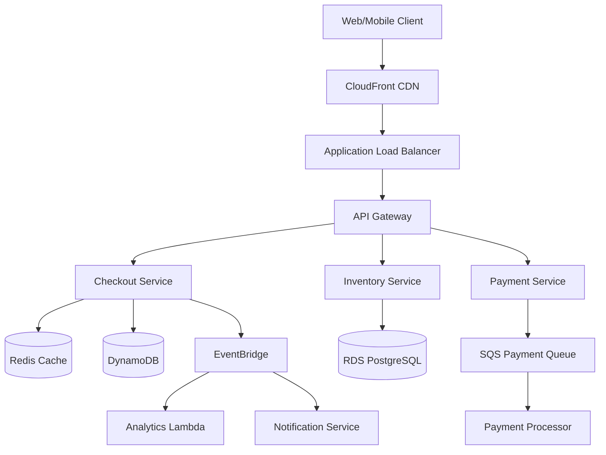

# Technical Competencies for Amazon L6/L7 Engineering Managers

## 🎯 The Technical Bar: What Amazon Really Expects

Based on 2024-2025 interview experiences, Amazon's technical bar for engineering managers has evolved to emphasize practical leadership over pure coding prowess, while still requiring deep technical credibility.

!!! warning "2025 Reality Check"
    **May 2025 Candidate**: "Amazon prioritized leadership questions over coding. They don't ask to code unless super optimal solution approach given."
    
    **L7 Principal (2024)**: "Soft skills are everything... Empathy. Empathy. Empathy."

## 📊 Technical Competency Matrix

### Core Technical Skills by Level

| Competency | L6 Requirement | L7 Requirement | Interview Weight |
|------------|---------------|----------------|------------------|
| **Coding** | LeetCode Medium in 30-40 min | Architectural implications over syntax | L6: 20-30%, L7: 0-10% |
| **System Design** | Multi-team systems, millions of users | Org-wide platforms, billions of users | L6: 35%, L7: 40% |
| **AWS Knowledge** | 10+ services proficiency | Expert in 15+ services, cost optimization | L6: 20%, L7: 25% |
| **Distributed Systems** | CAP theorem, consistency models | Consensus algorithms, failure modes | L6: 15%, L7: 20% |
| **AI/ML Integration** | Basic understanding | Platform design with SageMaker/Bedrock | L6: 10%, L7: 15% |

## 🔍 Deep Dive: Technical Competencies

### 1. Programming & DSA (Decreasing but Critical)

#### L6 Expectations
```python
# Expected to solve problems like this efficiently
def longest_substring_without_repeating(s: str) -> int:
    """
    Real L6 interview question (2024)
    Time: O(n), Space: O(min(n, m)) where m is charset size
    """
    char_index = {}
    max_length = 0
    start = 0
    
    for end, char in enumerate(s):
        if char in char_index and char_index[char] >= start:
            start = char_index[char] + 1
        char_index[char] = end
        max_length = max(max_length, end - start + 1)
    
    return max_length

# Also expected: Explain trade-offs, handle edge cases
```

#### L7 Expectations
```python
# Focus on design patterns and architectural implications
class RateLimiter:
    """
    L7 discussion: How would this scale to millions of users?
    What are the distributed systems implications?
    """
    def __init__(self, capacity: int, refill_rate: int):
        self.capacity = capacity
        self.tokens = capacity
        self.refill_rate = refill_rate
        self.last_refill = time.time()
    
    def allow_request(self) -> bool:
        # L7: Discuss distributed rate limiting, Redis implementation,
        # consistency trade-offs, handling clock skew
        pass
```

!!! info "2024 Interview Insight"
    **January 2024 L6 Hire**: "Master system design and behavioral over coding. I got multiple offers focusing on architecture rather than grinding LeetCode."

### 2. System Design Mastery

#### L6 System Design Competencies

**Required Knowledge Areas:**
- Microservices vs Monoliths (with real trade-offs)
- Database selection (SQL vs NoSQL, when and why)
- Caching strategies (Redis, Memcached, CDN)
- Message queues (SQS, Kafka, Kinesis)
- API design (REST, GraphQL, gRPC)

**Example L6 Design Question (2024)**:
"Design a scalable checkout flow for Amazon"



**Key Discussion Points:**
- Idempotency for payment processing
- Distributed transaction handling
- Inventory reservation patterns
- Failure recovery mechanisms

#### L7 System Design Competencies

**Required Knowledge Areas:**
- Platform architecture (multi-tenant, cell-based)
- Global distribution strategies
- Cost optimization at scale ($100M+ infrastructure)
- ML platform integration
- Organizational impact considerations

**Example L7 Design Question (2025)**:
"Design an ML platform for Amazon that multiple business units can use"

Key aspects to cover:
- Multi-tenant isolation strategies
- Feature store design for ML pipelines
- Model versioning and A/B testing infrastructure
- Cost allocation across business units
- Compliance and governance frameworks

### 3. AWS Services Deep Knowledge

#### Must-Know Services (2024-2025 Verified)

| Service | L6 Knowledge Required | L7 Knowledge Required |
|---------|----------------------|----------------------|
| **EC2** | Auto-scaling, instance families | Spot fleet optimization, placement groups |
| **DynamoDB** | Partitioning, GSI/LSI | Adaptive capacity, global tables |
| **S3** | Storage classes, consistency | Cell architecture, multipart uploads |
| **Lambda** | Cold starts, limits | Custom runtimes, Firecracker |
| **Kinesis** | Basic streaming | Sharding strategies, KCL |
| **SageMaker** | Basic ML concepts | End-to-end ML platform design |
| **EKS/ECS** | Container basics | Service mesh, multi-cluster |

#### Real Interview Scenarios (2024-2025)

**Scenario 1 (L6, December 2024)**:
"Your team's DynamoDB table is experiencing hot partitions during Black Friday. How do you handle this?"

Expected Answer:
- Immediate: Enable adaptive capacity
- Short-term: Implement write sharding with random suffix
- Long-term: Redesign partition key strategy
- Monitoring: CloudWatch metrics for consumed capacity

**Scenario 2 (L7, January 2025)**:
"Design a multi-region active-active architecture for a critical service"

Must address:
- Data consistency strategies (eventual vs strong)
- Conflict resolution mechanisms
- Regional failover without data loss
- Cost implications of cross-region replication

### 4. Distributed Systems Expertise

#### L6 Required Concepts

```python
# Understand and implement patterns like:

# Circuit Breaker Pattern
class CircuitBreaker:
    def __init__(self, failure_threshold=5, timeout=60):
        self.failure_threshold = failure_threshold
        self.timeout = timeout
        self.failure_count = 0
        self.last_failure_time = None
        self.state = "CLOSED"  # CLOSED, OPEN, HALF_OPEN
    
    def call(self, func, *args, **kwargs):
        if self.state == "OPEN":
            if time.time() - self.last_failure_time > self.timeout:
                self.state = "HALF_OPEN"
            else:
                raise Exception("Circuit breaker is OPEN")
        
        try:
            result = func(*args, **kwargs)
            if self.state == "HALF_OPEN":
                self.state = "CLOSED"
                self.failure_count = 0
            return result
        except Exception as e:
            self.failure_count += 1
            self.last_failure_time = time.time()
            if self.failure_count >= self.failure_threshold:
                self.state = "OPEN"
            raise e
```

#### L7 Required Concepts

- **Consensus Algorithms**: Raft, Paxos implementation details
- **Byzantine Fault Tolerance**: Handling malicious nodes
- **Vector Clocks**: Causality tracking in distributed systems
- **CRDTs**: Conflict-free replicated data types
- **Gossip Protocols**: Membership and failure detection

### 5. Emerging Technologies (2025 Focus)

#### AI/ML Integration

**Key Areas for 2025:**
- LLM integration patterns (RAG, fine-tuning)
- Bedrock vs SageMaker trade-offs
- Prompt engineering for system automation
- ML observability and monitoring

**Interview Question (August 2025)**:
"How would you integrate generative AI into our code review process?"

Expected discussion:
- Security considerations (code exposure)
- Cost optimization (token usage)
- Quality gates and human oversight
- Integration with existing CI/CD

#### Security & Compliance

**L6 Requirements:**
- IAM role design
- VPC and network security
- Secrets management (Secrets Manager, Parameter Store)
- Basic threat modeling

**L7 Requirements:**
- Zero-trust architecture design
- Compliance frameworks (SOC2, HIPAA, GDPR)
- Supply chain security
- Multi-account AWS organization strategy

## 📈 Technical Competency Development Plan

### Month 1-2: Foundation Building

| Week | Focus Area | Specific Goals | Resources |
|------|------------|---------------|-----------|
| 1-2 | AWS Fundamentals | Master 5 core services | AWS Well-Architected Framework |
| 3-4 | Distributed Systems Basics | CAP theorem, consistency models | DDIA book chapters 1-5 |
| 5-6 | Coding Patterns | 50 LeetCode mediums | Amazon top 100 list |
| 7-8 | System Design Basics | 4 practice designs | System Design Interview Vol 1 |

### Month 3-4: Advanced Concepts

| Week | Focus Area | Specific Goals | Resources |
|------|------------|---------------|-----------|
| 9-10 | Advanced AWS | 10 additional services | re:Invent videos |
| 11-12 | Distributed Algorithms | Consensus, gossip protocols | Academic papers |
| 13-14 | ML/AI Integration | SageMaker, Bedrock basics | AWS AI/ML path |
| 15-16 | Architecture Patterns | Cell-based, event-driven | AWS architecture blog |

### Month 5-6: Integration & Practice

| Week | Focus Area | Specific Goals | Resources |
|------|------------|---------------|-----------|
| 17-18 | Mock System Designs | 2 per day | Pramp, Interviewing.io |
| 19-20 | Technical Deep Dives | Failure scenarios | Post-mortem analyses |
| 21-22 | Leadership Integration | LP + Technical stories | Personal experience |
| 23-24 | Final Polish | Weak area focus | Mock interviews |

## 🎯 Technical Competency Assessment Checklist

### L6 Readiness
- [ ] Can solve LeetCode medium in 30 minutes with optimal solution
- [ ] Can design systems for millions of users with proper trade-offs
- [ ] Know 10+ AWS services in production depth
- [ ] Understand distributed systems fundamentals
- [ ] Can explain technical decisions in business terms
- [ ] Have 5+ production war stories demonstrating technical depth

### L7 Readiness
- [ ] Can architect platforms used by multiple teams
- [ ] Deep knowledge of 15+ AWS services
- [ ] Can design for billions of users globally
- [ ] Understand advanced distributed systems concepts
- [ ] Have influenced technical strategy at org level
- [ ] Can discuss ML/AI integration strategies
- [ ] Have patents, publications, or conference talks

## 💡 Key Insights from 2024-2025 Interviews

!!! quote "Real Candidate Experiences"
    **L6 Hire (January 2024)**: "Focus on system design mastery. I barely coded in my final round but discussed architecture for 90 minutes."
    
    **L7 Reject (December 2024)**: "Failed due to weak product strategy. Technical skills weren't enough without business vision."
    
    **L6 Success (May 2025)**: "Tied every technical answer to Leadership Principles. That made the difference."

## 🚀 Action Items

1. **Assess Current Level**: Use the competency matrix to identify gaps
2. **Create Learning Plan**: Allocate time based on your weaknesses
3. **Practice Daily**: Minimum 1 technical problem/concept daily
4. **Build Portfolio**: Document your technical decisions and learnings
5. **Get Feedback**: Regular mock interviews focusing on technical depth

---

!!! tip "Pro Tip"
    Technical competency for Amazon EMs isn't about being the best coder—it's about demonstrating good technical judgment, understanding trade-offs, and being able to guide teams through complex technical decisions. Focus on breadth with strategic depth rather than trying to be an expert in everything.

---

*Next: [Leadership Principles Deep Dive](leadership-principles.md) →*