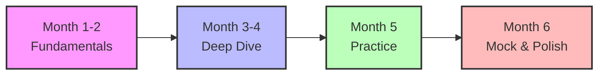

# Amazon L6/L7 Engineering Manager Interview Prep Guide

<div align="center">

## Complete 6-Month Preparation Roadmap

**Master the technical bar for Amazon's most challenging engineering leadership roles**

[](/)
[](/)
[](/)

</div>

---

## 🎯 What You'll Master

This comprehensive guide prepares you for Amazon's L6 (Senior Engineering Manager) and L7 (Principal Engineering Manager) technical interviews through:

- **System Design at Scale**: Architect solutions for billions of users
- **Coding Excellence**: Master Amazon's top 100 interview problems
- **Technical Deep Dives**: Navigate distributed systems complexity
- **Leadership Integration**: Weave Amazon's LPs into technical discussions
- **Bar Raiser Preparation**: Excel in the most critical interview round

!!! success "Real Candidate Insights (2024-2025)"
    📚 **[View Real Interview Experiences](experiences/)** - Authentic stories, metrics, and lessons from successful L6/L7 candidates

    > **May 2024:** "Amazon prioritized leadership questions over coding. Focus on getting good enough to pass coding, but master system design and behavioral."

## 📊 L6 vs L7: Understanding the Technical Bar

| Aspect | L6 (Senior Engineering Manager) | L7 (Principal Engineering Manager) |
|--------|----------------------------------|-------------------------------------|
| **Technical Scope** | Component-level architecture | Organization-wide technical vision |
| **Team Impact** | 10-25 engineers, 2-4 teams | 100+ engineers, multiple business units |
| **System Scale** | Millions of users | Billions of users |
| **Coding Rounds** | 1-2 rounds, LeetCode Medium | 0-1 rounds, architecture focus |
| **Innovation** | Optimize existing systems | Create industry-leading solutions |
| **Decision Authority** | Type 2 (reversible) decisions | Type 1 (irreversible) org decisions |

!!! info "Promotion Difficulty"
    Moving from L6 to L7 requires outperforming **90% of all L6s company-wide** and demonstrating exceptional technical leadership beyond component scope.

## 🚀 Quick Start Guide

### Week 1: Foundation Assessment

Start with our [Self Assessment](practice/self-assessment.md) to identify your current level and gaps:

=== "L6 Readiness"
    ```yaml
    # Core Requirements for L6 Engineering Manager
    experience: "8+ years engineering experience"
    languages: "1 primary language mastery (Java/Python/C++)"
    systems: "Distributed systems knowledge"
    leadership: "Led 10+ engineer teams"
    architecture: "Component architecture expertise"
    ```

=== "L7 Readiness"
    ```yaml
    # Advanced Requirements for L7 Principal Engineering Manager
    experience: "12+ years engineering experience"
    expertise: "Multi-domain technical expertise"
    influence: "Organization-level influence"
    recognition: "Patent/publication track record"
    discussions: "VP-level technical discussions"
    ```

### Your 6-Month Journey



## 📚 Core Preparation Areas

### 1. System Design Excellence

Master architecting at Amazon scale with our [System Design Guide](system-design/index.md):

- **Scale Fundamentals**: Handle petabytes of data, billions of requests → [Deep Dive: Performance at Scale](deep-dives/performance-scale.md)
- **AWS Patterns**: DynamoDB partitioning, S3 cell architecture → [AWS Services Deep Dive](system-design/aws-services.md)
- **Well-Architected Framework**: Six pillars for production systems → [Well-Architected Guide](system-design/well-architected.md)
- **L6 Practice**: Component-level architecture → [L6 Design Problems](system-design/l6-problems.md)
- **L7 Practice**: Platform-level systems → [L7 Design Problems](system-design/l7-problems.md)
- **Real Examples**: Learn from case studies → [Architecture Case Studies](system-design/case-studies.md)

### 2. Coding Proficiency

Stay technically credible with our [Coding Preparation](coding/index.md):

- **Problem Categories**: Graphs, trees, arrays → [Data Structures Guide](coding/data-structures.md) | [Algorithm Patterns](coding/algorithms.md)
- **Time Management**: Efficient problem-solving → [Coding Strategy for Managers](coding/strategy.md)
- **Amazon Top 100**: Curated problems from interviews → [Complete Problem Set](coding/amazon-top-100.md)
- **Production Quality**: Clean code, testing → [Problem Patterns](coding/patterns.md)
- **Mock Practice**: Realistic coding rounds → [Mock Interview Framework](practice/mock-interviews.md)

### 3. Technical Deep Dives

Navigate complex scenarios with our [Deep Dive Training](deep-dives/index.md):

- **Distributed Systems**: CAP theorem, consensus → [Distributed Systems Guide](deep-dives/distributed-systems.md)
- **Performance at Scale**: Traffic spikes, hot partitions → [Performance & Scale](deep-dives/performance-scale.md) 
- **Incident Response**: Production scenarios → [Incident Response](deep-dives/incident-response.md)
- **Security Architecture**: Zero-trust, encryption → [Security Deep Dive](deep-dives/security.md)
- **Consistency Models**: ACID in distributed systems → [Consistency Models](deep-dives/consistency-models.md)

### 4. Leadership Integration

Demonstrate technical leadership through [Behavioral Preparation](behavioral/index.md):

- **STAR Framework**: Structure responses for impact → [STAR Framework Mastery](behavioral/star-framework.md)
- **LP Integration**: Technical decisions through principles → [Leadership Principles](fundamentals/leadership-principles.md)
- **L6 Scenarios**: Component-level leadership → [L6 Behavioral Scenarios](behavioral/l6-scenarios.md)
- **L7 Scenarios**: Organizational impact → [L7 Behavioral Scenarios](behavioral/l7-scenarios.md)
- **Bar Raiser Focus**: Cultural fit and excellence → [Bar Raiser Preparation](behavioral/bar-raiser.md)
- **Decision Making**: Frameworks and processes → [Decision Making Guide](behavioral/decision-making.md)

## 🎓 Study Resources

### Essential Reading

!!! tip "Must-Read Papers"
    - [Amazon DynamoDB Paper](https://www.allthingsdistributed.com/files/amazon-dynamo-sosp2007.pdf)
    - [S3 Availability Design](https://aws.amazon.com/s3/sla/)
    - [Prime Video Architecture Evolution](https://www.primevideotech.com/video-streaming/scaling-up-the-prime-video-audio-video-monitoring-service-and-reducing-costs-by-90)

### Practice Platforms

- **LeetCode**: Focus on Amazon-tagged problems
- **System Design Interview**: Alex Xu's courses
- **Pramp/Interviewing.io**: Mock interviews with feedback
- **Internal Resources**: Amazon's interview prep guide

### Time Investment

| Activity | L6 Prep Hours | L7 Prep Hours |
|----------|:-------------:|:-------------:|
| System Design | 100 | 150 |
| Coding Practice | 80 | 40 |
| Behavioral Stories | 60 | 80 |
| Mock Interviews | 40 | 60 |
| **Total** | **280 hours** | **330 hours** |

## 🔥 Critical Success Factors

!!! success "What Separates Success from Failure"
    1. **Consistent Daily Practice**: 2-3 hours daily beats weekend cramming
    2. **Real Project Examples**: Use actual work experiences, not theoretical scenarios
    3. **Quantified Impact**: Every story needs metrics (latency, cost, scale)
    4. **Technical Depth**: Know the "why" behind architectural decisions
    5. **Leadership Authenticity**: Don't just name-drop LPs, embody them

## 📈 Progress Tracking

Use our [Weekly Plan](practice/weekly-plan.md) to track your preparation:

- [ ] Complete fundamentals assessment
- [ ] Master 5 system design problems weekly
- [ ] Solve 10 coding problems weekly
- [ ] Document 3 STAR stories weekly
- [ ] Conduct 2 mock interviews monthly

## 🚨 Common Pitfalls to Avoid

!!! warning "Interview Killers"
    - **Over-engineering**: L6 candidates proposing L7 solutions
    - **Under-preparing coding**: Yes, managers still code at Amazon
    - **Generic examples**: Use Amazon-specific scale and services
    - **LP superficiality**: Memorizing principles without demonstrating them
    - **Ignoring Bar Raiser**: They have veto power - prepare specifically

## 🎯 Next Steps

1. **Start with Fundamentals**: Review [L6 vs L7 Differences](fundamentals/l6-vs-l7.md) → [Technical Competencies](fundamentals/technical-competencies.md)
2. **Assess Your Level**: Complete our [Self Assessment](practice/self-assessment.md) → [Practice Framework](practice/index.md)
3. **Create Your Plan**: Use our [6-Month Timeline](study-plan.md) → [Weekly Planning](practice/weekly-plan.md)  
4. **Begin Daily Practice**: Start with [Getting Started](getting-started.md) → [Mock Interviews](practice/mock-interviews.md)

---

<div align="center">

**Ready to raise the bar at Amazon?**

[Start Your Journey →](getting-started.md){ .md-button .md-button--primary }

</div>

## 📊 Complete Learning Path Cross-Reference

### By Interview Round Type

**System Design Rounds** 🏗️
- **L6 Focus**: [Component Architecture Problems](system-design/l6-problems.md) | [Design Fundamentals](system-design/fundamentals.md)
- **L7 Focus**: [Platform Architecture Problems](system-design/l7-problems.md) | [Scale Architecture](system-design/scale-architecture.md)  
- **Deep Knowledge**: [AWS Services](system-design/aws-services.md) | [Well-Architected Framework](system-design/well-architected.md)
- **Practice**: [Case Studies](system-design/case-studies.md) | [Time Management](system-design/time-management-template.md)

**Coding Rounds** 💻
- **Problem Sets**: [Amazon Top 100](coding/amazon-top-100.md) | [Mock Problems](coding/mock-problems.md)
- **Fundamentals**: [Data Structures](coding/data-structures.md) | [Algorithms](coding/algorithms.md)  
- **Strategy**: [Coding Strategy](coding/strategy.md) | [Problem Patterns](coding/patterns.md)

**Behavioral Rounds** 🗣️
- **Framework**: [STAR Method](behavioral/star-framework.md) | [Story Bank Matrix](behavioral/story-bank-matrix.md)
- **Level-Specific**: [L6 Scenarios](behavioral/l6-scenarios.md) | [L7 Scenarios](behavioral/l7-scenarios.md)
- **Specialization**: [Bar Raiser Prep](behavioral/bar-raiser.md) | [Decision Making](behavioral/decision-making.md)

**Technical Deep Dives** 🔬  
- **Core Topics**: [Distributed Systems](deep-dives/distributed-systems.md) | [Performance](deep-dives/performance-scale.md)
- **Operations**: [Incident Response](deep-dives/incident-response.md) | [Security](deep-dives/security.md)
- **Advanced**: [Consistency Models](deep-dives/consistency-models.md)

### By Skill Level

**Foundation (Months 1-2)** 🌱
- [L6 vs L7 Differences](fundamentals/l6-vs-l7.md) → [Technical Competencies](fundamentals/technical-competencies.md)
- [Leadership Principles](fundamentals/leadership-principles.md) → [Interview Process](fundamentals/interview-process.md)
- [Self Assessment](practice/self-assessment.md) → [Weekly Plan](practice/weekly-plan.md)

**Advanced (Months 3-4)** 🚀
- [System Design Index](system-design/index.md) → [Technical Deep Dives](deep-dives/index.md)
- [Amazon Top 100](coding/amazon-top-100.md) → [Advanced Patterns](coding/patterns.md) 
- [L6 Scenarios](behavioral/l6-scenarios.md) → [L7 Scenarios](behavioral/l7-scenarios.md)

**Mastery (Months 5-6)** ⭐
- [Mock Interviews](practice/mock-interviews.md) → [Portfolio Development](portfolio/index.md)
- [Bar Raiser Prep](behavioral/bar-raiser.md) → [Negotiation Guide](compensation/negotiation-guide.md)
- [Real Experiences](experiences/index.md) → [Success Templates](experiences/success-templates.md)

### Specialized Tracks

**Portfolio & Artifacts** 📁
- [Technical Portfolio](portfolio/technical-portfolio.md) | [Architecture Diagrams](portfolio/architecture-diagrams.md)
- [Case Study Templates](portfolio/case-study-templates.md) | [Decision Records](portfolio/decision-records.md)

**Industry Insights** 📈
- [Real Experiences](experiences/index.md) | [Candidate Quotes](experiences/candidate-quotes.md)
- [Question Database](experiences/question-database.md) | [Timeline Examples](experiences/timeline-examples.md)

**Resources & Support** 🛠️
- [Practice Resources](practice/resources.md) | [Video Learning](resources/video-learning.md)
- [FAQ](faq/index.md) | [Downloads](downloads/index.md)

---

!!! quote "Remember"
    "The best way to prepare for these interviews is to think of them not as tests to pass, but as opportunities to demonstrate how you'll contribute to Amazon's technical excellence and customer obsession at scale."

---

*Last updated: January 2025 | Based on recent interview experiences and official Amazon guidance*