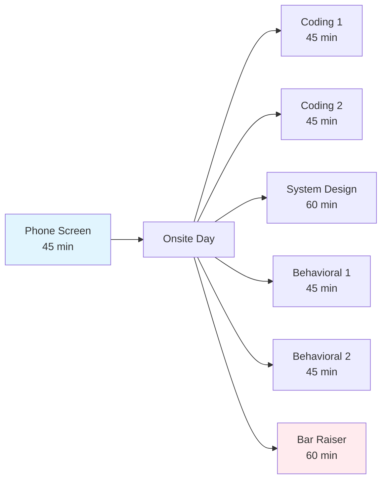
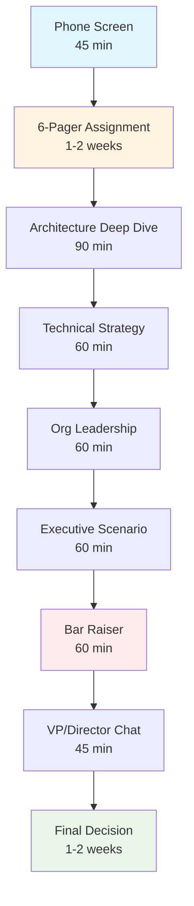

# Interview Mechanics Masterclass

## Mastering the Amazon Interview Machine

Amazon's interview process is a **precision-engineered system** designed to evaluate leadership potential at scale. Understanding its mechanics - from loop variations to timing strategies - gives you a decisive advantage.

!!! quote "From an Amazon Bar Raiser"
    "Most candidates focus on what to say. The ones who succeed also master when to say it, how to pace themselves, and how to read the room. The process has subtle rhythms and signals that, once understood, dramatically improve your success rate."

## 🎭 Loop Structure Variations

### Standard L6 Loop (4-6 Rounds)



**Timeline**: 2-3 weeks from phone screen to decision
**Decision Threshold**: Must pass 4/6 rounds + Bar Raiser approval
**Common Variations**: Sometimes includes "hiring manager chat" (informal, 30 min)

### Extended L7 Loop (6-8 Rounds + Assignments)



**Timeline**: 6-8 weeks from initial contact to decision
**Decision Threshold**: Must excel in all rounds (no "weak" performances)
**Key Difference**: Assignment work is evaluated alongside interview performance

### 2024-2025 Process Updates

**Virtual-First Changes**:
- 90% of loops now fully virtual
- New tools: Amazon Connect, Chime SDK for whiteboarding
- Coding platforms: LiveCode (internal) or HackerRank
- Break schedules: 15 minutes between each round

**Covid-Era Adaptations That Remain**:
- Focus on remote leadership scenarios
- Digital collaboration examples emphasized
- Async communication skills evaluation
- Virtual team building demonstrations

## 📝 The 6-Pager Assignment Deep-Dive

### What It Actually Tests

The 6-Pager isn't just a writing exercise - it's a **simulation of L7 decision-making**:

```yaml
evaluation_criteria:
  strategic_thinking:
    - Industry analysis depth
    - Competitive landscape understanding
    - Technology trend identification
    - 3-5 year vision articulation
  
  technical_architecture:
    - System complexity management
    - Scalability considerations
    - AWS service integration
    - Operational excellence planning
    
  business_judgment:
    - ROI calculation sophistication
    - Risk assessment completeness
    - Resource requirement accuracy
    - Success metrics definition
    
  communication_clarity:
    - Executive-level conciseness
    - Data-driven argumentation
    - Logical flow and structure
    - Actionable recommendations
```

### Template: Amazon 6-Pager Format

```markdown
# [PROPOSAL TITLE]: [Clear, Action-Oriented]

## Executive Summary (0.5 pages)
- **Opportunity**: [2-3 sentences on the business opportunity]
- **Solution**: [High-level approach in 2-3 sentences]
- **Investment**: [Resources required: people, time, cost]
- **Returns**: [Expected business impact with timeline]
- **Recommendation**: [Clear go/no-go with rationale]

## Background & Context (1 page)
### Current State
- [Market/technical/competitive situation]
### Customer Need
- [Specific customer pain points with data]
### Strategic Alignment
- [How this fits Amazon's broader strategy]

## Proposal Details (2.5 pages)
### Technical Approach
- [Architecture overview with diagrams]
- [Key technical decisions and trade-offs]
- [Integration points and dependencies]

### Implementation Plan
- [Phased delivery approach]
- [Resource requirements by phase]
- [Critical path and dependencies]

### Success Metrics & KPIs
- [Leading and lagging indicators]
- [Measurement methodology]
- [Success criteria definitions]

## Risk Assessment & Mitigation (1 page)
### Technical Risks
- [Risk 1]: [Impact] - [Mitigation strategy]
### Business Risks  
- [Risk 2]: [Impact] - [Mitigation strategy]
### Organizational Risks
- [Risk 3]: [Impact] - [Mitigation strategy]

## Resource Requirements (0.5 pages)
### Team Structure
- [Engineering: roles and seniority levels]
- [Product/PM: allocation and responsibilities] 
- [Other functions: design, data science, etc.]

### Timeline & Milestones
- [Phase 1]: [Duration] - [Deliverables]
- [Phase 2]: [Duration] - [Deliverables]
- [Phase 3]: [Duration] - [Deliverables]

## Appendix (Optional)
- [Supporting data, detailed calculations, alternative approaches]
```

### Actual L7 6-Pager Topics (2024-2025)

**Recent Examples**:
- "Design a global content delivery platform for 1B+ users"
- "Propose a machine learning infrastructure strategy for retail recommendations"
- "Architect a real-time fraud detection system handling 100M+ transactions/day"
- "Design the next-generation logistics optimization platform"

**Evaluation Timeline**:
- **Week 1**: Assignment given, clarifying questions allowed
- **Week 2**: Document due (exactly 6 pages, specific format)
- **Week 3**: Presentation and Q&A during architecture interview

## 🎯 Bar Raiser Preparation: The "5 Whys" Framework

### Understanding the Bar Raiser Role

Bar Raisers aren't just senior interviewers - they're **cultural guardians** with specific training and veto power:

```python
class BarRaiser:
    def __init__(self):
        self.certification = "6+ months training program"
        self.experience = "50+ interviews conducted"
        self.authority = "Can veto any hire regardless of other feedback"
        self.mandate = "Ensure every hire raises the bar"
    
    def evaluation_criteria(self):
        return {
            "leadership_potential": "Will they develop others?",
            "cultural_fit": "Do they embody Amazon principles authentically?", 
            "technical_depth": "Can they solve problems at the required level?",
            "growth_trajectory": "Will they be successful long-term?",
            "organizational_impact": "Will they make teams better?"
        }
```

### The "5 Whys" Preparation Method

For each major story, ask yourself these layered questions:

#### Why #1: Surface Level
- **Question**: "Why did you choose this approach?"
- **Preparation**: Have clear rationale for every major decision

#### Why #2: Technical Depth  
- **Question**: "Why was this technically challenging?"
- **Preparation**: Understand the deep technical constraints and trade-offs

#### Why #3: Leadership Impact
- **Question**: "Why did this require leadership from you specifically?"
- **Preparation**: Articulate what unique value you brought beyond individual contribution

#### Why #4: Organizational Context
- **Question**: "Why was this important to the broader organization?"
- **Preparation**: Connect your work to business outcomes and strategic priorities

#### Why #5: Growth and Learning
- **Question**: "Why did this experience change how you approach problems?"
- **Preparation**: Demonstrate evolution in thinking and application to future scenarios

### Bar Raiser Question Patterns

**Hypothetical Leadership Scenarios**:
> "Imagine you're leading a team that's consistently missing deadlines. Walk me through your approach to diagnosing and solving this problem."

**Values-Based Probing**:
> "Tell me about a time you had to choose between delivering on time and doing the right thing for customers. How did you navigate that?"

**Technical-Leadership Integration**:
> "Describe a situation where your technical expertise helped you make a better leadership decision than someone without your background could have."

**Growth and Self-Awareness**:
> "What's an area where you've fundamentally changed your approach based on feedback or failure?"

## ⏱️ Time Management Strategies by Interview Type

### Coding Interview Timing (45 minutes)

```
┌─────────────────────────────────────────────────┐
│ Phase 1: Problem Understanding (5-7 minutes)    │
├─────────────────────────────────────────────────┤
│ • Clarify requirements and constraints          │
│ • Identify input/output formats                 │
│ • Discuss edge cases and scale                  │
│ • Confirm understanding before coding           │
├─────────────────────────────────────────────────┤
│ Phase 2: Solution Design (3-5 minutes)         │
├─────────────────────────────────────────────────┤
│ • High-level approach explanation              │
│ • Time/space complexity analysis               │
│ • Alternative approaches consideration          │
├─────────────────────────────────────────────────┤
│ Phase 3: Implementation (25-30 minutes)        │
├─────────────────────────────────────────────────┤
│ • Clean, readable code                         │
│ • Think out loud during coding                 │
│ • Test with examples as you go                 │
├─────────────────────────────────────────────────┤
│ Phase 4: Testing & Optimization (5-7 minutes)  │
├─────────────────────────────────────────────────┤
│ • Walk through test cases                      │
│ • Identify potential improvements              │
│ • Discuss production considerations            │
└─────────────────────────────────────────────────┘
```

### System Design Interview Timing (60 minutes)

```
┌─────────────────────────────────────────────────┐
│ Phase 1: Requirements Gathering (8-10 minutes)  │
├─────────────────────────────────────────────────┤
│ • Functional requirements clarification        │
│ • Non-functional requirements (scale, perf)    │
│ • Constraints and assumptions                  │
├─────────────────────────────────────────────────┤
│ Phase 2: High-Level Design (10-12 minutes)     │
├─────────────────────────────────────────────────┤
│ • Core components and their interactions       │
│ • API design and data flow                     │
│ • Technology choices justification             │
├─────────────────────────────────────────────────┤
│ Phase 3: Detailed Design (15-20 minutes)       │
├─────────────────────────────────────────────────┤
│ • Database schema and access patterns          │
│ • Caching strategies and layers                │
│ • Service boundaries and communication         │
├─────────────────────────────────────────────────┤
│ Phase 4: Scale & Operations (12-15 minutes)    │
├─────────────────────────────────────────────────┤
│ • Bottleneck identification and solutions      │
│ • Monitoring and alerting strategies           │
│ • Disaster recovery and failover               │
├─────────────────────────────────────────────────┤
│ Phase 5: Trade-offs & Evolution (5-8 minutes)  │
├─────────────────────────────────────────────────┤
│ • Alternative approaches discussion            │
│ • Future evolution and extensibility           │
│ • Cost considerations and optimizations        │
└─────────────────────────────────────────────────┘
```

### Behavioral Interview Timing (45 minutes)

**3-Question Format**:
- Question 1: 12-14 minutes (including follow-ups)
- Question 2: 12-14 minutes  
- Question 3: 10-12 minutes
- Wrap-up/Candidate questions: 5-7 minutes

**Individual Story Timing**:
- **Initial response**: 2-3 minutes (STAR++ framework)
- **Follow-up #1**: 1-2 minutes (technical depth or LP connection)
- **Follow-up #2**: 1-2 minutes (leadership impact or lessons learned)
- **Clarification/transition**: 30 seconds

## 🎪 Strategic Question Banks by Level

### L6 Strategic Questions

**Technical Leadership**:
- "How do you balance technical debt with feature delivery?"
- "Describe your approach to mentoring senior engineers"
- "Tell me about a time you had to make a technical decision with incomplete information"

**Cross-Team Influence**:
- "How do you get alignment across teams with different priorities?"
- "Describe a time you had to influence a peer team to change their approach"
- "Tell me about navigating a technical disagreement with another team"

**Operational Excellence**:
- "How do you ensure your systems are reliable at scale?"
- "Describe your approach to incident response and post-mortems"
- "Tell me about a time you improved a system you inherited"

### L7 Strategic Questions  

**Organizational Transformation**:
- "How do you drive technical standards across a large organization?"
- "Describe a time you changed how engineering teams work together"
- "Tell me about transforming engineering culture or practices"

**Technical Vision**:
- "How do you identify which technologies your organization should invest in?"
- "Describe your approach to technical strategy and roadmapping"
- "Tell me about a technical bet that paid off long-term"

**Executive Influence**:
- "How do you communicate technical risks to non-technical leadership?"
- "Describe a time you influenced company-level technical decisions"
- "Tell me about aligning technical strategy with business strategy"

## 🎬 Real Timeline Examples (2024-2025)

### Successful L6 Candidate Timeline

```
Week 1: Initial recruiter contact + phone screen
Week 2: Scheduling virtual onsite loop
Week 3: Interview day (6 rounds over 2 days due to scheduling)
Week 4: Reference checks + team placement discussions  
Week 5: Offer extended
```

**Key Success Factors**:
- Prepared 12 STAR stories covering all LPs
- Practiced system design 3x/week for 6 weeks
- Solved 150+ LeetCode problems (focus on Amazon-tagged)
- Did 8 mock interviews with Amazon employees

### Successful L7 Candidate Timeline

```
Week 1-2: Multiple recruiter conversations + initial screening
Week 3: 6-Pager assignment given
Week 4: Work on assignment (allocated 15 hours over the week)
Week 5: Assignment submission + loop scheduling
Week 6-7: Extended interview loop (8 rounds over 3 weeks)
Week 8: VP-level discussions and reference checks
Week 9-10: Team placement and compensation negotiations
Week 11: Final offer and start date agreement
```

**Key Success Factors**:
- Had published 2 technical papers in previous 3 years
- Led organization-wide technical initiatives (300+ engineers)
- Executive-level communication skills demonstrated through assignment
- Strong references from VP+ level leaders

---

!!! success "Mechanics Mastered"
    Understanding the interview machine gives you a significant edge. You now know the timing rhythms, evaluation criteria, and strategic question patterns. Use this knowledge to optimize your preparation and performance.

*Next: [2025 Special Considerations](../2025-considerations/index.md) →*