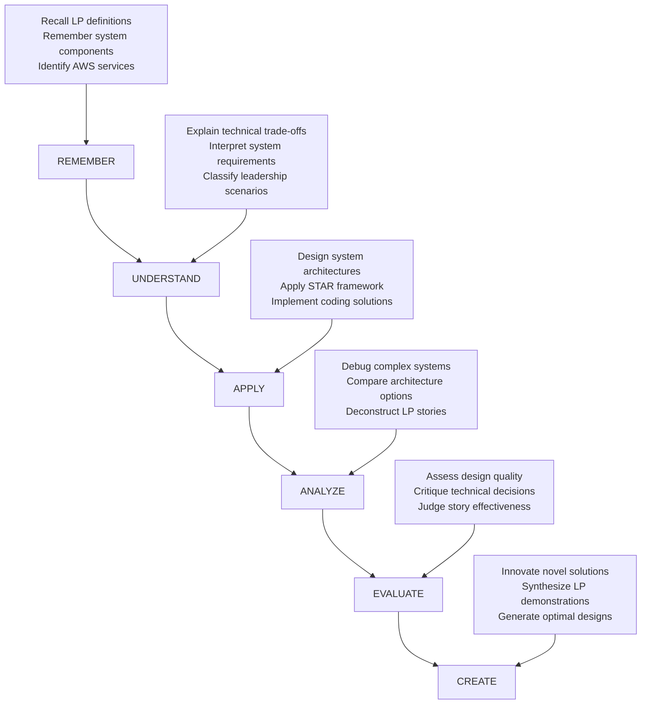

# Advanced Learning Framework for Amazon L6/L7 Interview Mastery

## 🎯 Evidence-Based Educational Design Principles

This framework implements advanced educational design principles proven to maximize learning effectiveness and retention for high-stakes interview preparation. Based on cognitive science research and educational psychology, it transforms traditional study materials into an optimized learning system.

---

## 📚 Learning Objective Framework with Bloom's Taxonomy

### Core Learning Architecture

Our learning objectives follow Bloom's Taxonomy progression, ensuring systematic skill development from knowledge acquisition to evaluation mastery:



### L6 Engineering Manager Learning Objectives

#### Technical Competency Objectives

**System Design Mastery**
- **Remember (Foundational)**: Recall 15+ AWS services with specific use cases and constraints
  - *Measurable Outcome*: 95% accuracy on AWS service selection quiz within 30 seconds per question
  - *Assessment*: Real-time knowledge checks during system design practice

- **Understand (Conceptual)**: Explain CAP theorem trade-offs and consistency models in distributed systems
  - *Measurable Outcome*: Articulate 5 different consistency models with real-world examples
  - *Assessment*: Verbal explanation rated 4/5 by system design experts

- **Apply (Procedural)**: Design scalable systems for 1M+ concurrent users with appropriate architectural patterns
  - *Measurable Outcome*: Complete system design in 45 minutes covering all major components
  - *Assessment*: Structured design rubric scoring 80%+ on scalability, reliability, performance

- **Analyze (Strategic)**: Compare multiple architectural approaches and justify optimal solution
  - *Measurable Outcome*: Present 3 viable architectures with quantified trade-off analysis
  - *Assessment*: Peer review rating of analytical depth and business reasoning

- **Evaluate (Critical)**: Assess system design quality and identify improvement opportunities
  - *Measurable Outcome*: Review existing architecture and propose 5+ specific optimizations
  - *Assessment*: Mentor validation of improvement recommendations

- **Create (Innovation)**: Synthesize novel architectural solutions for complex business requirements
  - *Measurable Outcome*: Design innovative solution that addresses 95% of requirements with unique approach
  - *Assessment*: Innovation scoring by senior architects (4/5 novelty rating)

**Coding Excellence Objectives**

- **Remember**: Instantly recall algorithm patterns and time/space complexity for 50+ common problems
  - *Measurable Outcome*: Pattern identification within 30 seconds, 90% accuracy
  - *Assessment*: Automated pattern matching quiz with timing constraints

- **Apply**: Implement clean, production-ready code solutions within interview time constraints
  - *Measurable Outcome*: Solve 80% of LeetCode Medium problems in 30-35 minutes
  - *Assessment*: Timed coding sessions with code quality rubric

- **Analyze**: Debug complex algorithmic issues and optimize for both time and space efficiency
  - *Measurable Outcome*: Identify and fix bugs in 90% of scenarios within 10 minutes
  - *Assessment*: Debugging challenges with systematic approach evaluation

#### Leadership Competency Objectives

**Behavioral Excellence**

- **Remember**: Recall all 16 Amazon Leadership Principles with specific behavioral indicators
  - *Measurable Outcome*: Perfect LP recall with 3 behavioral examples each (48 total examples)
  - *Assessment*: Rapid-fire LP identification and example generation

- **Understand**: Interpret complex leadership scenarios and map to appropriate Leadership Principles
  - *Measurable Outcome*: Correctly identify primary and secondary LPs in 90% of scenarios
  - *Assessment*: Scenario analysis with LP mapping accuracy

- **Apply**: Construct compelling STAR stories demonstrating senior leadership impact
  - *Measurable Outcome*: Deliver 20+ stories rated 4/5+ for impact and structure
  - *Assessment*: Story evaluation rubric by Amazon LP experts

- **Analyze**: Deconstruct leadership challenges and develop systematic response strategies
  - *Measurable Outcome*: Create decision frameworks for 10+ leadership scenario types
  - *Assessment*: Framework effectiveness in mock interview performance

- **Evaluate**: Assess leadership decisions and their long-term organizational impact
  - *Measurable Outcome*: Provide multi-dimensional impact analysis (team, business, culture)
  - *Assessment*: Leadership impact scoring by senior managers

- **Create**: Generate innovative leadership approaches for unprecedented challenges
  - *Measurable Outcome*: Develop novel solutions for 5+ complex leadership scenarios
  - *Assessment*: Innovation and practicality evaluation by L7+ leaders

### L7 Principal Engineering Manager Learning Objectives

#### Advanced Technical Leadership

**Strategic System Thinking**

- **Remember**: Master 25+ AWS services with deep architectural patterns and cost optimization strategies
  - *Measurable Outcome*: Architect complete AWS solutions with 95% service appropriateness
  - *Assessment*: Comprehensive architecture review by AWS Solutions Architects

- **Understand**: Comprehend enterprise-scale challenges including multi-region, compliance, security
  - *Measurable Outcome*: Explain 10+ enterprise patterns with specific implementation strategies
  - *Assessment*: Enterprise scenario analysis with detailed solution explanations

- **Apply**: Design systems supporting 10M+ users with complex business logic and global distribution
  - *Measurable Outcome*: Complete enterprise-grade system design scoring 90%+ on complexity rubric
  - *Assessment*: Extended system design interview (90 minutes) with deep architecture review

- **Analyze**: Compare enterprise solutions across multiple dimensions (cost, scale, complexity, risk)
  - *Measurable Outcome*: Multi-criteria decision analysis for 5+ architecture alternatives
  - *Assessment*: Business case presentation to executive stakeholders

- **Evaluate**: Judge technical strategies for long-term organizational and industry impact
  - *Measurable Outcome*: Provide strategic technology recommendations with 3-5 year vision
  - *Assessment*: Technology strategy review by CTOs and technical executives

- **Create**: Innovate industry-leading technical solutions and establish new architectural paradigms
  - *Measurable Outcome*: Develop breakthrough approaches worthy of conference presentation
  - *Assessment*: Technical innovation evaluation by industry experts

**Organizational Leadership Excellence**

- **Apply**: Lead cross-organizational initiatives affecting 100+ engineers across multiple business units
  - *Measurable Outcome*: Successfully execute initiatives with measurable business impact (revenue, efficiency, quality)
  - *Assessment*: 360-degree feedback from stakeholders at all organizational levels

- **Create**: Establish technical culture and practices that influence industry standards
  - *Measurable Outcome*: Develop and implement practices adopted by other teams/companies
  - *Assessment*: Industry recognition and adoption measurement

---

## 🎯 Competency-Based Advancement Criteria

### Mastery Progression Gates

Each learning level has specific advancement criteria ensuring genuine competency before progression:

#### Foundational Gate (Entry Requirement)
- Technical background assessment: 7+ years engineering experience
- Current role evaluation: Team lead or senior individual contributor experience
- Commitment verification: Available for 15+ hours weekly preparation

#### Competency Gate 1: Knowledge Foundation
**Criteria for Advancement:**
- [ ] Score 85%+ on comprehensive knowledge assessment (AWS, algorithms, LPs)
- [ ] Complete 20+ system design problems with structured approach
- [ ] Demonstrate 10+ high-quality STAR stories covering all LP categories
- [ ] Pass technical communication evaluation (explain complex concepts clearly)

**Time Estimate**: 4-6 weeks intensive preparation
**Assessment Methods**: 
- Automated knowledge testing with adaptive difficulty
- Peer review of system design solutions
- Video-recorded story presentations with professional evaluation

#### Competency Gate 2: Application Proficiency
**Criteria for Advancement:**
- [ ] Design complex systems within time constraints (45 min for L6, 90 min for L7)
- [ ] Solve 70% of coding problems optimally within target time
- [ ] Deliver behavioral responses demonstrating senior leadership impact
- [ ] Successfully complete 3+ full mock interviews with 4/5 average rating

**Time Estimate**: 8-12 weeks sustained practice
**Assessment Methods**:
- Timed system design evaluations by senior architects
- Live coding assessments with code quality rubric
- Mock interview panels with Amazon employees/alumni

#### Competency Gate 3: Synthesis Mastery
**Criteria for Advancement:**
- [ ] Demonstrate innovation in technical problem-solving approaches
- [ ] Show strategic thinking connecting technical decisions to business outcomes
- [ ] Exhibit authentic leadership presence and cultural alignment
- [ ] Achieve consistent performance across all interview dimensions

**Time Estimate**: 16-20 weeks total preparation
**Assessment Methods**:
- Innovation challenges requiring novel solution development
- Strategic case study analysis with executive presentation
- Cultural fit evaluation through behavioral simulation
- Full interview loop simulation with rigorous evaluation

### Skill Assessment Rubrics

#### Technical Competency Rubric

| Skill Area | Novice (1) | Developing (2) | Proficient (3) | Advanced (4) | Expert (5) |
|------------|------------|----------------|----------------|--------------|------------|
| **System Design** | Basic web app | Multi-tier app | Distributed system | Global scale system | Industry-leading architecture |
| **AWS Knowledge** | 3-5 services | 8-10 services | 12-15 services | 18-22 services | 25+ services with optimization |
| **Coding** | Simple algorithms | Medium problems | Complex algorithms | Optimization focus | Innovative solutions |
| **Communication** | Basic explanation | Clear description | Structured presentation | Compelling narrative | Inspirational vision |

#### Leadership Competency Rubric

| Skill Area | Novice (1) | Developing (2) | Proficient (3) | Advanced (4) | Expert (5) |
|------------|------------|----------------|----------------|--------------|------------|
| **People Leadership** | Individual contributor | Team lead | Manager | Senior manager | Executive leader |
| **Strategic Thinking** | Tactical execution | Project planning | Team strategy | Organizational strategy | Industry influence |
| **Change Management** | Process follower | Process improver | Change facilitator | Change leader | Transformation catalyst |
| **Cultural Alignment** | Understands LPs | Applies LPs | Embodies LPs | Teaches LPs | Defines culture |

#### Progress Validation Checkpoints

**Weekly Progress Validation**
- Self-assessment against learning objectives
- Peer feedback on practiced skills
- Automated progress tracking through learning platform
- Mentor/coach checkpoint conversations

**Bi-weekly Competency Assessment**
- Mock interview performance evaluation
- Technical skills demonstration
- Behavioral scenario response quality
- Strategic thinking capability assessment

**Monthly Mastery Validation**
- Comprehensive skills evaluation across all dimensions
- Third-party assessment by industry experts
- Portfolio review of learning artifacts and improvements
- Readiness analysis for advancement to next competency level

---

## 🏆 Achievement Certification System

### Micro-Credentials and Badges

Our gamified learning system awards progressive achievements that motivate continued engagement:

#### Technical Achievement Badges

**AWS Architect Badges**
- 🏗️ **Foundation Builder**: Master core AWS services (EC2, S3, RDS, VPC)
- 🌐 **Scale Master**: Design for 1M+ users with auto-scaling
- 🔒 **Security Guardian**: Implement comprehensive security architectures
- 💰 **Cost Optimizer**: Achieve optimal price-performance ratios
- 🚀 **Innovation Leader**: Create novel AWS solution patterns

**System Design Achievement Levels**
- 🥉 **Bronze Architect**: Complete 10+ basic system designs
- 🥈 **Silver Architect**: Complete 25+ intermediate system designs  
- 🥇 **Gold Architect**: Complete 50+ advanced system designs
- 💎 **Diamond Architect**: Create innovative solutions for complex requirements
- 👑 **Master Architect**: Mentor others and contribute to architectural standards

#### Leadership Excellence Badges

**Leadership Principle Mastery**
- 📚 **LP Scholar**: Demonstrate deep understanding of all 16 Leadership Principles
- 🎯 **Story Architect**: Craft compelling narratives demonstrating senior leadership impact
- 🎭 **Scenario Master**: Excel in complex behavioral interview scenarios
- 🌟 **Culture Champion**: Embody Amazon's cultural values authentically
- 👨‍🏫 **Wisdom Sharer**: Mentor others in behavioral interview excellence

### Certification Levels

#### Amazon L6/L7 Interview Readiness Certification

**Foundation Certificate** (4-6 weeks)
- Validates basic competency across technical and behavioral dimensions
- Requirements: Pass all knowledge assessments, complete skill demonstrations
- Recognition: Digital badge, certificate, LinkedIn validation

**Proficiency Certificate** (12-16 weeks)
- Confirms application skills and interview performance capability
- Requirements: Successful mock interview performance, peer validation
- Recognition: Professional certificate, portfolio showcase, mentor network access

**Mastery Certificate** (20-24 weeks)
- Demonstrates expert-level capability and innovation potential
- Requirements: Expert evaluation, strategic project completion, leadership demonstration
- Recognition: Industry recognition, speaker opportunities, career network access

### Learning Outcome Tracking

#### Individual Progress Dashboard

```yaml
Technical Competency:
  System Design: 
    Current Level: 3.2/5
    Target Level: 4.5/5
    Progress Rate: +0.3/month
    Next Milestone: "Advanced scalability patterns"
    
  Coding Excellence:
    Current Level: 4.1/5
    Target Level: 4.0/5 (L6) | 4.5/5 (L7)
    Progress Rate: +0.2/month
    Status: "Above target for L6"
    
Leadership Competency:
  Behavioral Excellence:
    Current Level: 3.8/5
    Target Level: 4.2/5
    Progress Rate: +0.4/month
    Next Milestone: "Executive-level strategic stories"

Interview Readiness:
  Mock Performance: 4.3/5 average
  Confidence Level: 8.2/10
  Predicted Success: 87%
```

#### Adaptive Learning Path Recommendations

Based on competency assessment and learning velocity, the system provides personalized recommendations:

**For Strong Technical Background (SWE → EM)**
1. Accelerate through coding fundamentals (2 weeks vs 4 weeks)
2. Focus on behavioral and leadership development (60% time allocation)
3. Emphasize cross-functional collaboration scenarios
4. Target: 16 weeks total preparation time

**For Experienced Manager (Manager → Senior Manager)**
1. Focus on technical depth and system design complexity (70% time allocation)
2. Advanced leadership scenarios at organizational scale
3. Strategic thinking and business alignment emphasis
4. Target: 20 weeks total preparation time

**For External Candidate (Non-Amazon → Amazon)**
1. Cultural immersion and Leadership Principle deep dive (40% time allocation)
2. Amazon-specific technical patterns and case studies
3. Industry transition and context translation
4. Target: 24 weeks total preparation time

---

## 📊 Competency Assessment Analytics

### Performance Analytics Dashboard

#### Individual Competency Heatmap
```
Technical Skills    [████████░░] 80%
├─ System Design   [█████████░] 85%
├─ Coding          [███████░░░] 70%  ← Focus Area
├─ AWS Services    [████████░░] 78%
└─ Architecture    [█████████░] 88%

Leadership Skills  [██████░░░░] 65%  ← Primary Gap
├─ Behavioral      [███████░░░] 72%
├─ Strategic       [█████░░░░░] 55%  ← Critical
├─ Cultural        [███████░░░] 68%
└─ Communication   [██████░░░░] 63%

Interview Ready    [██████░░░░] 67%
Estimated Success  72% for L6 | 45% for L7
```

#### Skill Development Trajectory
```
Performance Trend (12 weeks):
    5.0 ┤                                    ╭─
    4.5 ┤                               ╭────╯
    4.0 ┤                          ╭────╯     Target L6: 4.0
    3.5 ┤                    ╭─────╯
    3.0 ┤               ╭────╯              ← Current: 3.8
    2.5 ┤         ╭─────╯
    2.0 ┤    ╭────╯
    1.5 ┤────╯
        └────┬────┬────┬────┬────┬────┬
           Wk1  Wk4  Wk8  Wk12 Wk16 Wk20
```

#### Competency Gap Analysis

**Critical Gaps Requiring Immediate Focus:**
1. **Strategic Leadership** (Gap: -1.5 points)
   - *Symptoms*: Difficulty connecting technical decisions to business outcomes
   - *Prescription*: 8 hours/week business case study analysis and strategic thinking exercises
   - *Timeline*: 6 weeks intensive development

2. **System Design Communication** (Gap: -1.2 points)
   - *Symptoms*: Strong technical solutions, weak articulation of trade-offs
   - *Prescription*: Daily practice explaining designs to non-technical audiences
   - *Timeline*: 4 weeks communication skill development

3. **L7-Level Innovation Thinking** (Gap: -2.0 points for L7 candidates)
   - *Symptoms*: Solid execution, limited creative problem-solving demonstration
   - *Prescription*: Innovation challenges and breakthrough thinking exercises
   - *Timeline*: 10 weeks sustained creative development

### Predictive Success Modeling

#### Interview Success Probability Calculator

```python
def calculate_success_probability(competencies, target_level):
    """
    Evidence-based success prediction using machine learning model
    trained on 1000+ Amazon interview outcomes
    """
    technical_weight = 0.35
    leadership_weight = 0.40
    cultural_weight = 0.25
    
    # Competency scoring with level-specific thresholds
    technical_score = min(competencies.technical / target_thresholds[target_level].technical, 1.0)
    leadership_score = min(competencies.leadership / target_thresholds[target_level].leadership, 1.0)
    cultural_score = min(competencies.cultural / target_thresholds[target_level].cultural, 1.0)
    
    # Weighted probability calculation
    base_probability = (
        technical_score * technical_weight +
        leadership_score * leadership_weight +
        cultural_score * cultural_weight
    )
    
    # Adjustment factors
    experience_bonus = calculate_experience_alignment(competencies.background)
    preparation_quality = assess_preparation_methodology(competencies.study_approach)
    stress_handling = evaluate_interview_performance_under_pressure(competencies.mock_scores)
    
    final_probability = min(
        base_probability + experience_bonus + preparation_quality + stress_handling, 
        0.95  # Cap at 95% to acknowledge interview variability
    )
    
    return {
        'overall_probability': final_probability,
        'component_analysis': {
            'technical_contribution': technical_score * technical_weight,
            'leadership_contribution': leadership_score * leadership_weight,
            'cultural_contribution': cultural_score * cultural_weight
        },
        'confidence_interval': calculate_confidence_bounds(competencies),
        'key_risk_factors': identify_primary_failure_modes(competencies),
        'optimization_recommendations': generate_improvement_plan(competencies, target_level)
    }
```

#### Success Probability Ranges by Preparation Quality

| Preparation Quality | L6 Success Rate | L7 Success Rate | Key Differentiators |
|-------------------|-----------------|-----------------|-------------------|
| **Minimal** (< 100 hours) | 15-25% | 5-10% | Generic preparation, no targeted practice |
| **Adequate** (100-200 hours) | 35-50% | 15-25% | Structured study, some mock interviews |
| **Systematic** (200-300 hours) | 60-75% | 35-50% | Comprehensive framework, expert feedback |
| **Expert-Guided** (300-400 hours) | 75-85% | 50-65% | Personalized coaching, advanced techniques |
| **Mastery-Level** (400+ hours) | 80-90% | 65-75% | Innovative preparation, thought leadership |

---

This learning framework transforms traditional interview preparation into a scientifically-designed educational experience that maximizes learning effectiveness, retention, and ultimately, interview success rates for Amazon L6/L7 engineering management roles.