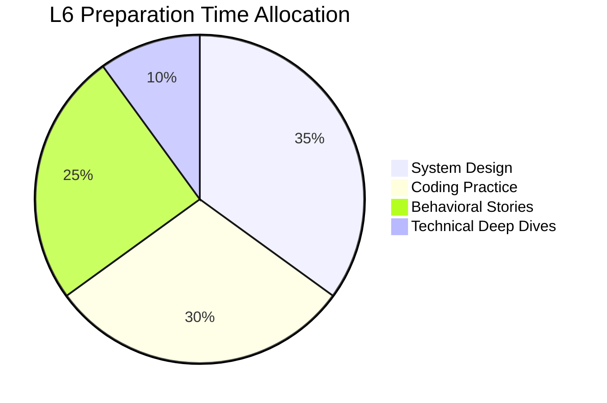
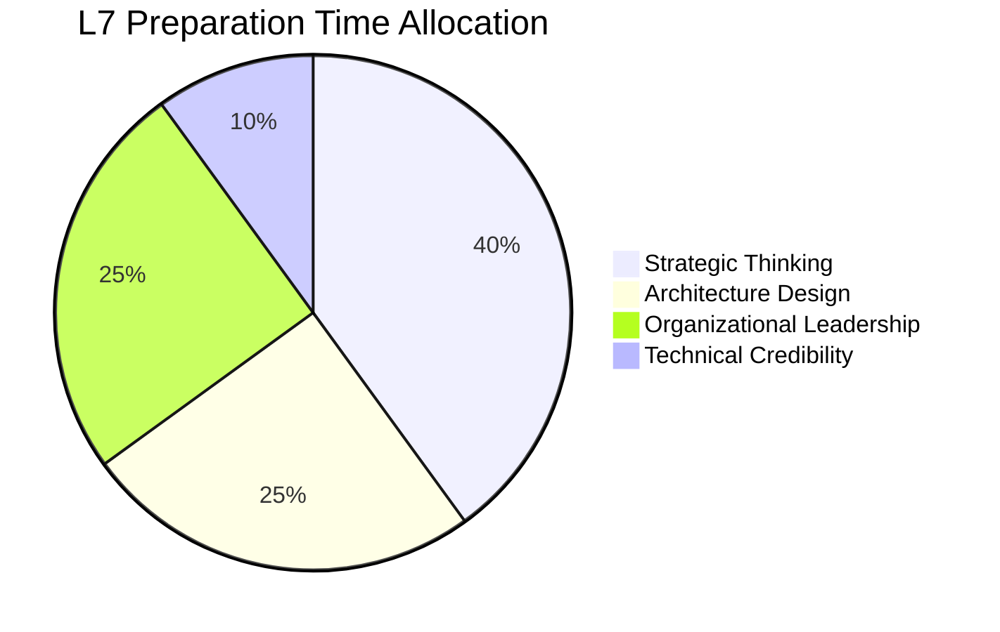

# Level-Specific Playbooks

## The Science of L6 vs L7 Success

Each level at Amazon requires a **fundamentally different approach** to interview preparation and execution. These playbooks provide the precise formulas, competency frameworks, and success patterns that separate passing candidates from those who excel.

!!! quote "From Amazon's Internal Interview Guide"
    "L6 candidates should demonstrate excellence in execution within their domain. L7 candidates must show transformational impact beyond their immediate scope. The evaluation criteria are distinct and should not be conflated."

## 🎯 L6 Success Formula

### The 40-30-20-10 Framework

**40% Leadership Excellence**
- Direct team leadership and development
- Cross-team collaboration and influence
- Process improvement and optimization
- Customer-focused decision making

**30% System Design Mastery**
- Component-level architecture expertise
- Scalability within business unit scope
- AWS services deep knowledge
- Production system reliability

**20% People Development**
- Mentoring senior engineers (L5)
- Growing technical talent pipeline
- Effective hiring and interviewing
- Team culture and engagement

**10% Coding Competency**
- Clean, maintainable code
- Efficient algorithm implementation
- Production-ready thinking
- Code review and standards

### L6 Core Competency Checklist

#### Technical Leadership ✅
```yaml
depth_requirements:
  domain_expertise:
    - [ ] Expert in 2-3 technical areas (e.g., distributed systems, ML, mobile)
    - [ ] Can debug complex issues across the stack
    - [ ] Understands operational implications of design decisions
    - [ ] Stays current with industry trends and best practices
  
  architecture_skills:
    - [ ] Designs systems for millions of users
    - [ ] Considers non-functional requirements (security, performance, cost)
    - [ ] Makes appropriate technology choices with clear rationale
    - [ ] Plans for evolution and extensibility
  
  delivery_excellence:
    - [ ] Leads multi-quarter projects successfully
    - [ ] Balances technical debt with feature delivery
    - [ ] Implements monitoring and operational excellence
    - [ ] Drives adoption of engineering best practices
```

#### People Leadership ✅
```yaml
team_management:
  direct_reports:
    - [ ] Manages 8-15 engineers effectively
    - [ ] Provides clear career development guidance
    - [ ] Conducts meaningful performance reviews
    - [ ] Builds high-performing teams
  
  influence_and_collaboration:
    - [ ] Coordinates across 2-4 teams
    - [ ] Resolves conflicts and builds consensus
    - [ ] Communicates technical concepts to non-technical stakeholders
    - [ ] Drives alignment on technical decisions
  
  talent_development:
    - [ ] Mentors senior engineers (L5) to next level
    - [ ] Identifies and develops high-potential talent
    - [ ] Creates growth opportunities for team members
    - [ ] Contributes to hiring and interview processes
```

#### Business Impact ✅
```yaml
scope_and_scale:
  project_complexity:
    - [ ] Leads projects affecting multiple business units
    - [ ] Manages projects with $1M+ impact
    - [ ] Coordinates dependencies across engineering teams
    - [ ] Delivers on quarterly OKRs consistently
  
  customer_focus:
    - [ ] Makes decisions based on customer data and feedback
    - [ ] Understands business metrics and KPIs
    - [ ] Balances technical excellence with business needs
    - [ ] Communicates customer impact of technical work
```

### L6 Interview Preparation Priority



**Detailed Breakdown**:

**System Design (35% - ~100 hours)**:
- Practice 15+ design problems at L6 scope
- Master AWS service patterns and trade-offs
- Focus on operational excellence and monitoring
- Understand cost optimization strategies

**Coding Practice (30% - ~85 hours)**:
- Solve 200+ LeetCode problems (focus on medium)
- Master 2-3 programming languages
- Practice on Amazon's coding platforms
- Emphasize clean, production-ready code

**Behavioral Stories (25% - ~70 hours)**:
- Develop 10-12 STAR++ stories
- Map stories to all 16 Leadership Principles
- Practice story delivery in multiple time formats
- Focus on team leadership and cross-functional impact

**Technical Deep Dives (10% - ~30 hours)**:
- Prepare for domain-specific questions
- Study Amazon's technical papers and architectures
- Understand distributed systems fundamentals
- Review AWS Well-Architected Framework

### L6 Real Success Case Studies

#### Case Study 1: E-commerce Platform Optimization

**Background**: L6 Engineering Manager at mid-size e-commerce company
**Challenge**: 850ms checkout latency affecting conversion rates
**Scope**: 12-person team, $50M annual revenue impact

**Interview Story Structure**:
> "**Situation**: Leading the platform team during Q4 2023, our checkout service was showing concerning performance degradation - P99 latency had increased to 850ms, directly correlating with a 3.2% drop in conversion rates during our highest traffic period.
>
> **Task**: With Black Friday approaching and $50M quarterly revenue at stake, I needed to rapidly improve performance while maintaining the 99.99% availability our business depended on.
>
> **Action**: I implemented a three-phase approach: immediate fixes using database query optimization and caching layers, medium-term architectural improvements through microservices migration, and long-term monitoring with automated alerting. I also established cross-team collaboration with the DevOps and QA teams.
>
> **Result**: Reduced P99 latency to 285ms within 6 weeks, restored conversion rates, and our Black Friday processed $12M with zero downtime. The monitoring system prevented two potential outages in subsequent months."

**Why This Succeeds**:
- Clear business impact with quantified metrics
- Appropriate scope for L6 (team-level, component focus)
- Demonstrates technical depth and leadership
- Shows operational excellence thinking

## 🚀 L7 Success Formula

### The 50-25-20-5 Framework

**50% Leadership & Strategic Impact**
- Organizational transformation and culture change
- Technical vision and multi-year roadmapping  
- Executive influence and strategic planning
- Industry thought leadership

**25% Organizational Design**
- Structure for engineering organizations (100+ people)
- Cross-functional collaboration at scale
- Process and methodology innovation
- Talent strategy and leadership development

**20% Technical Architecture**
- Platform and infrastructure strategy
- Company-wide technical standards
- Technology trend identification and adoption
- Enterprise-level system design

**5% Technical Credibility**
- Sufficient coding ability to maintain respect
- Deep understanding of technical trade-offs
- Ability to dive deep when needed
- Technical communication to all levels

### L7 Core Competency Checklist

#### Strategic Leadership ✅
```yaml
organizational_impact:
  transformation_leadership:
    - [ ] Led organizational changes affecting 100+ engineers
    - [ ] Drove adoption of new methodologies or technologies company-wide
    - [ ] Influenced technical culture and practices at scale
    - [ ] Navigated complex political and strategic challenges
  
  technical_vision:
    - [ ] Created multi-year technical roadmaps
    - [ ] Identified and championed emerging technologies
    - [ ] Made bet-the-company technical decisions
    - [ ] Influenced industry standards or practices
  
  executive_influence:
    - [ ] Regularly presents to VP/C-level executives
    - [ ] Shapes company technical strategy
    - [ ] Manages complex stakeholder relationships
    - [ ] Communicates technical topics to board-level audiences
```

#### Platform and Architecture ✅
```yaml
enterprise_systems:
  platform_development:
    - [ ] Built platforms used by 50+ engineering teams
    - [ ] Designed systems for billions of users/requests
    - [ ] Created reusable infrastructure and frameworks
    - [ ] Established technical standards across organization
  
  architecture_at_scale:
    - [ ] Designed distributed systems with global reach
    - [ ] Planned for 100x scale growth scenarios
    - [ ] Balanced innovation with operational excellence
    - [ ] Created disaster recovery and business continuity plans
```

#### Talent and Organization ✅
```yaml
leadership_development:
  people_strategy:
    - [ ] Developed other engineering managers (L6+)
    - [ ] Created career development frameworks
    - [ ] Built hiring and interview processes
    - [ ] Established engineering excellence standards
  
  organizational_design:
    - [ ] Structured engineering organizations for optimal delivery
    - [ ] Designed communication and collaboration patterns
    - [ ] Created measurement and incentive systems
    - [ ] Balanced centralized vs. decentralized approaches
```

### L7 Interview Preparation Priority



**Detailed Breakdown**:

**Strategic Thinking (40% - ~130 hours)**:
- Study Amazon's strategic frameworks (PR/FAQ, 6-pager)
- Practice business case development and ROI analysis
- Understand technology trend analysis and adoption
- Master executive communication and presentation

**Architecture Design (25% - ~80 hours)**:
- Design enterprise-scale systems (billions of users)
- Study AWS service architectures and design patterns
- Practice platform and infrastructure design
- Focus on operational excellence at scale

**Organizational Leadership (25% - ~80 hours)**:
- Develop stories of organizational transformation
- Study change management and cultural evolution
- Practice complex stakeholder management scenarios
- Master leadership development and succession planning

**Technical Credibility (10% - ~30 hours)**:
- Maintain sufficient coding skills for credibility
- Deep dive into distributed systems and architecture
- Study Amazon's technical papers and innovations
- Understand emerging technology trends (AI/ML, cloud-native)

### L7 Real Success Case Studies

#### Case Study 1: ML Platform Transformation

**Background**: L7 Principal Engineering Manager at Fortune 500 company
**Challenge**: Fragmented ML infrastructure across 200+ data scientists
**Scope**: 5 engineering teams, $10M budget, 18-month timeline

**Interview Story Structure**:
> "**Situation**: Our company had 200+ data scientists across 15 business units, each building ML models using different tools, frameworks, and infrastructure. This fragmentation was costing us $2M annually in duplicated effort and preventing us from leveraging our ML investments effectively.
>
> **Task**: The CEO asked me to create a unified ML platform strategy that would accelerate time-to-market for ML products while reducing costs and improving model quality across the organization.
>
> **Action**: I led a 6-month discovery process involving 50+ stakeholder interviews, then designed a centralized ML platform using AWS SageMaker, MLflow, and Kubeflow. I restructured our engineering organization to create a dedicated ML Platform team while establishing ML Engineering roles within business units. I also created an ML governance framework and established company-wide standards for model development and deployment.
>
> **Result**: Reduced average model development time from 8 months to 6 weeks, decreased infrastructure costs by 60%, and increased model accuracy by an average of 15% through standardized best practices. Three business units launched ML-powered products that generated $25M in new revenue within the first year. This became the template for our data platform strategy company-wide."

**Why This Succeeds**:
- Organizational scope appropriate for L7 (200+ people impacted)
- Strategic thinking with business transformation
- Technical depth in emerging technology area
- Quantified impact at company level
- Shows influence across entire organization

## 📊 Scope and Impact Expectations

### L6 vs L7 Impact Comparison

| Dimension | L6 Expectations | L7 Expectations |
|-----------|-----------------|-----------------|
| **Team Scope** | 10-25 engineers, 2-4 teams | 100+ engineers, multiple organizations |
| **Project Duration** | 3-12 months | 12-36 months |
| **Budget Authority** | $100K - $2M | $2M - $20M |
| **Technology Decisions** | Component/service level | Platform/architecture level |
| **Stakeholder Level** | Director, peer managers | VP/SVP, C-level executives |
| **Industry Influence** | Team/company practices | Industry standards, conferences |
| **Innovation Type** | Process optimization | Platform creation, new paradigms |

### Success Metrics Framework

#### L6 Success Indicators
```yaml
technical_excellence:
  - System availability > 99.9%
  - Performance improvements > 20%
  - Cost optimizations > 15%
  - Security incidents = 0

team_performance:
  - Team velocity increase > 25%
  - Employee satisfaction > 4.0/5.0
  - Retention rate > 90%
  - Promotion rate of direct reports > 20%

business_impact:
  - Feature adoption > 70%
  - Customer satisfaction improvement
  - Revenue/cost impact > $500K
  - Cross-team adoption of practices
```

#### L7 Success Indicators
```yaml
organizational_transformation:
  - Engineering productivity increase > 30%
  - Platform adoption across 80%+ of teams
  - Cultural/process transformation evidence
  - Industry recognition or thought leadership

strategic_impact:
  - Technology decisions affecting company direction
  - New revenue streams or business model enablement
  - Competitive advantage creation
  - Partnership or acquisition influence

talent_development:
  - Development of 5+ senior leaders (L6+)
  - Hiring rate improvements > 40%
  - Engineering brand strengthening
  - Knowledge sharing and best practice dissemination
```

## 🎪 Level-Appropriate Question Handling

### Question Adaptation Strategies

#### L6 Candidate Responding to L7-Level Question

**Question**: "How would you transform engineering culture across a 500-person organization?"

**Wrong Approach** (trying to fake L7 scope):
> "I would create a comprehensive change management program affecting all 500 engineers, establish new processes company-wide, and work directly with the C-suite to drive transformation..."

**Right Approach** (authentic L6 with growth potential):
> "While I haven't operated at that scale, I can share how I've successfully transformed culture within my 15-person team and influenced practices across our 3 partner teams. Based on that experience, I'd approach the larger challenge by first understanding the current state through listening tours, then implementing changes in pilot groups before scaling. I'm excited about the opportunity to learn how to operate at that larger scale."

#### L7 Candidate Responding to L6-Level Question

**Question**: "Tell me about debugging a performance issue in your system."

**Wrong Approach** (dismissing tactical work):
> "I don't typically get involved in debugging specific performance issues - my team handles that while I focus on strategic initiatives..."

**Right Approach** (demonstrating technical credibility with appropriate scope):
> "Last quarter, our recommendation platform was experiencing intermittent latency spikes affecting multiple business units. While my team was investigating, I dove in to help diagnose the issue because of the cross-organizational impact. I identified that our Redis cache invalidation strategy was causing cascading failures during peak traffic. I worked with the team to implement a circuit breaker pattern and redesigned our caching architecture. This not only solved the immediate issue but became a standard pattern we rolled out across all our platform services."

---

!!! success "Level Mastery Achieved"
    Understanding your target level's expectations and preparing accordingly is crucial for interview success. Don't try to fake a higher level - instead, excel at your appropriate level while showing growth potential.

*Next: [Red Flags & Success Patterns](../red-flags-success/index.md) →*