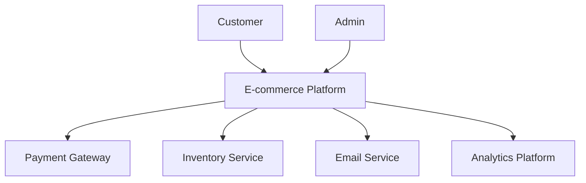
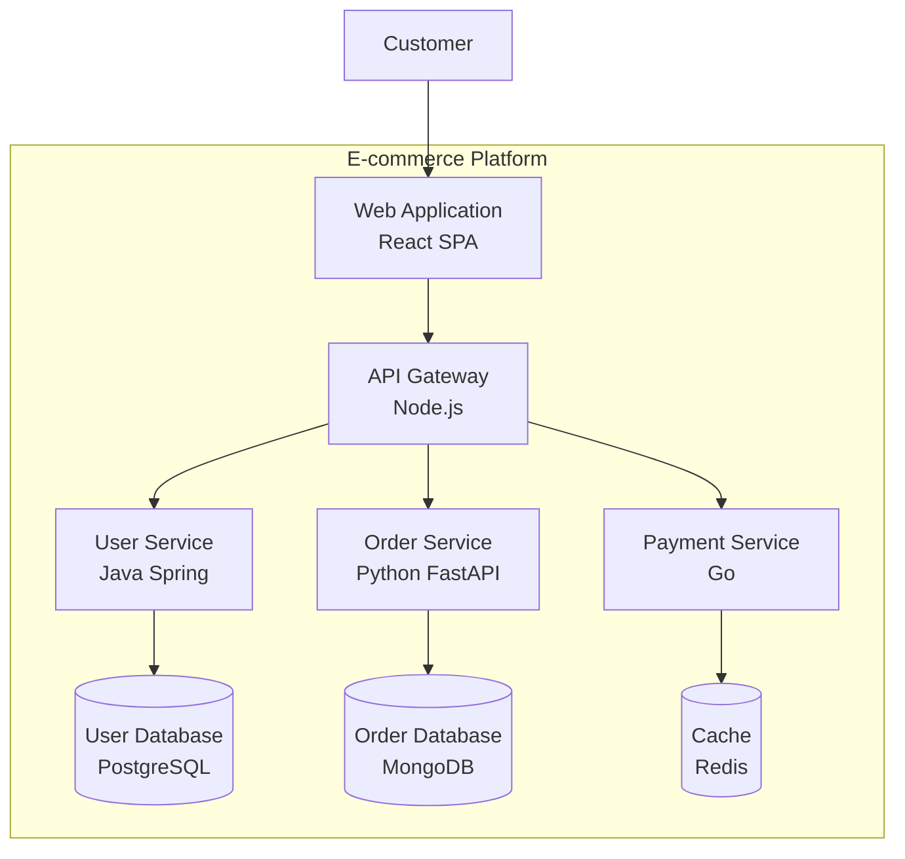
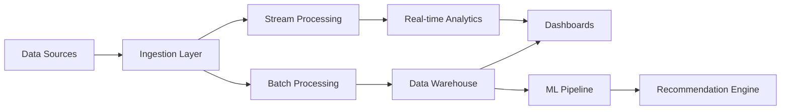
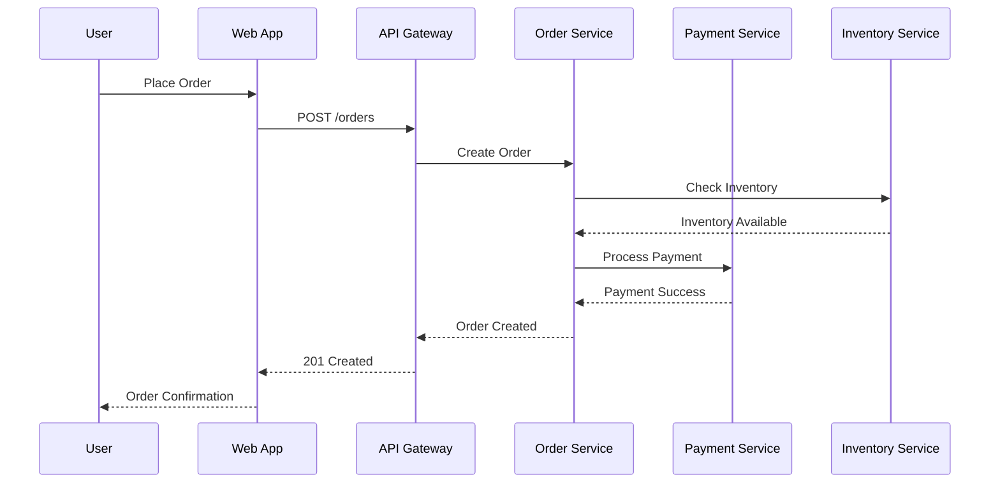
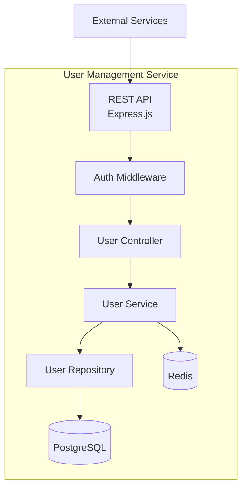
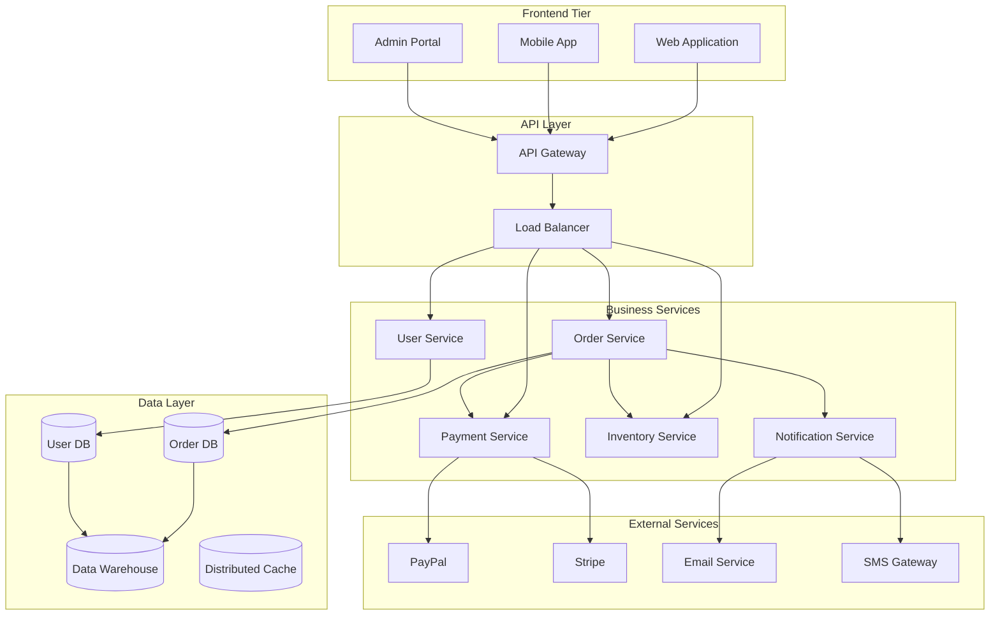
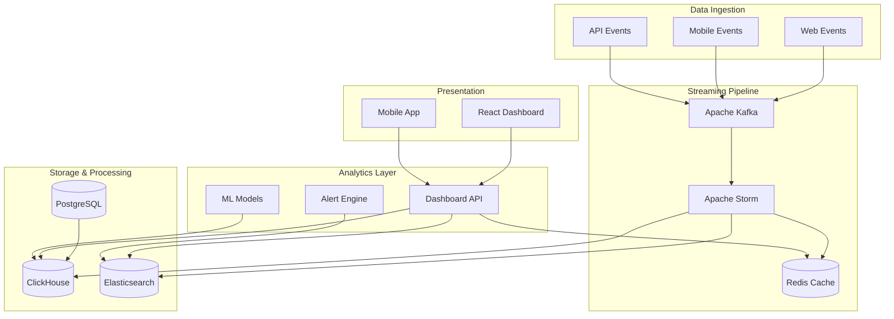
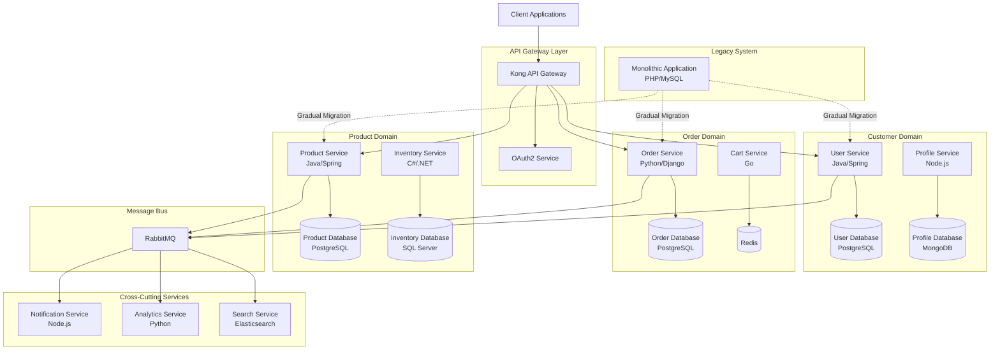
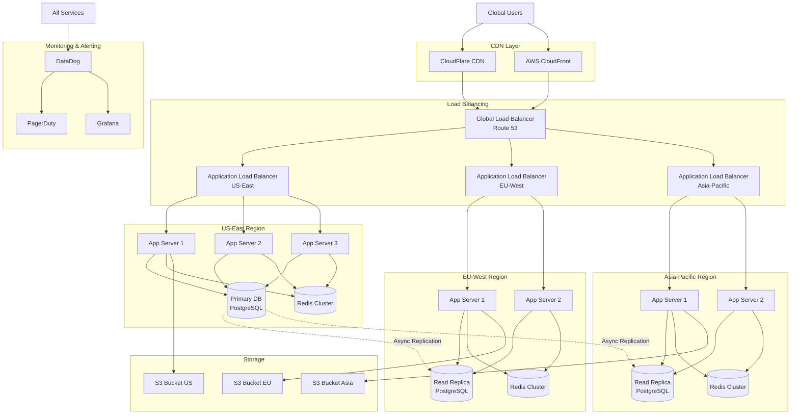

# Architecture Diagrams for Technical Portfolios

!!! info "Professional System Design Visualization"
    Master the art of creating compelling architecture diagrams that showcase your system design thinking and technical communication skills for Amazon L6/L7 interviews.

## Overview

Architecture diagrams are critical for demonstrating your ability to think systematically, communicate complex technical concepts, and design scalable solutions. This guide provides practical templates and examples for creating interview-ready diagrams.

## Diagram Types for Technical Interviews

### 1. C4 Model Diagrams

The C4 model provides a hierarchical approach to documenting software architecture at different levels of abstraction.

#### Level 1: System Context Diagram
**Purpose**: Show how your system fits into the overall landscape  
**Audience**: Non-technical stakeholders, executives  
**Focus**: External dependencies and user interactions



#### Level 2: Container Diagram
**Purpose**: Show high-level technology choices and responsibilities  
**Audience**: Technical team leads, architects  
**Focus**: Applications, databases, services



#### Level 3: Component Diagram
**Purpose**: Show internal structure of a container  
**Audience**: Developers, technical architects  
**Focus**: Classes, interfaces, modules

### 2. Data Flow Diagrams

**Purpose**: Show how data moves through your system  
**Use Cases**: ETL pipelines, real-time processing, batch jobs



### 3. Sequence Diagrams

**Purpose**: Show interactions over time  
**Use Cases**: API workflows, user journeys, error handling



## Tools and Formats

### Recommended Tools

#### 1. Mermaid (Recommended for portfolios)
**Pros**: 
- Version controlled (text-based)
- Integrates with GitHub, GitLab
- Professional output
- Free and open source

**Cons**: 
- Learning curve for syntax
- Limited customization

**Best For**: Technical portfolios, documentation

#### 2. Draw.io (diagrams.net)
**Pros**: 
- Intuitive drag-and-drop interface
- Extensive shape libraries
- Free and web-based
- Good AWS/GCP icon sets

**Cons**: 
- Not version controllable
- Can become messy with complex diagrams

**Best For**: Quick prototyping, presentation diagrams

#### 3. Lucidchart
**Pros**: 
- Professional templates
- Real-time collaboration
- Advanced features
- Excellent for complex diagrams

**Cons**: 
- Paid tool
- Overkill for simple diagrams

**Best For**: Enterprise-level documentation

#### 4. PlantUML
**Pros**: 
- Text-based (version controllable)
- Excellent for sequence diagrams
- Integrates with many IDEs

**Cons**: 
- Steep learning curve
- Limited styling options

**Best For**: Developer-focused documentation

### Tool Selection by Diagram Type

| Diagram Type | Primary Tool | Alternative |
|-------------|-------------|-------------|
| System Context | Mermaid | Draw.io |
| Container | Mermaid | Lucidchart |
| Component | PlantUML | Mermaid |
| Data Flow | Mermaid | Draw.io |
| Sequence | Mermaid | PlantUML |
| Network | Draw.io | Lucidchart |

## L6 vs L7 Diagram Complexity

### L6 Level Expectations

**Scope**: Single service or small system  
**Focus**: Technical implementation details  
**Complexity**: 3-7 components

**Typical L6 Diagrams**:
- Microservice internal architecture
- Database schema designs
- API interaction flows
- CI/CD pipeline designs

**Example L6 Scope**:


### L7 Level Expectations

**Scope**: Multiple services, platforms, or organizations  
**Focus**: Strategic architecture decisions  
**Complexity**: 10+ components, cross-team coordination

**Typical L7 Diagrams**:
- Multi-service platform architecture
- Cross-team system integration
- Scalability and reliability patterns
- Organizational system boundaries

**Example L7 Scope**:


## Complete Example Diagrams

### Example 1: Real-time Analytics Platform (L6)

**Context**: Building a real-time analytics dashboard for e-commerce metrics



**Technical Decisions Highlighted**:
- Kafka for reliable event streaming
- Storm for real-time processing
- ClickHouse for analytical queries
- Redis for sub-second dashboard queries

### Example 2: Microservices Migration (L7)

**Context**: Breaking down a monolith into microservices across multiple teams



**Strategic Decisions Highlighted**:
- Domain-driven decomposition
- Technology diversity by team expertise
- Event-driven communication via message bus
- Gradual migration strategy

### Example 3: High-Availability Content Delivery (L7)

**Context**: Global content delivery platform with 99.99% uptime requirement



**High-Availability Decisions Highlighted**:
- Multi-region deployment with failover
- CDN layering for global performance
- Database replication strategy
- Comprehensive monitoring and alerting

## Common Mistakes to Avoid

### 1. Overcomplicated Diagrams
**Problem**: Too many details, cluttered layout  
**Solution**: Use hierarchical approach (C4 model)

**Bad Example**:
- Single diagram with 20+ components
- All implementation details shown at once
- No clear information hierarchy

**Good Example**:
- Context diagram for high-level view
- Container diagram for technology choices
- Component diagram for detailed implementation

### 2. Inconsistent Notation
**Problem**: Mixed styles, unclear symbols  
**Solution**: Establish and follow consistent conventions

**Conventions to Follow**:
- Consistent shapes for similar components
- Clear labeling of all components
- Standardized colors and fonts
- Legend when using custom symbols

### 3. Missing Key Information
**Problem**: Unclear relationships, missing context  
**Solution**: Include essential metadata

**Always Include**:
- Data flow directions
- Technology choices
- Scalability indicators
- Security boundaries
- Performance characteristics

### 4. No Focus on Trade-offs
**Problem**: Showing only the final solution  
**Solution**: Highlight key decisions and alternatives

**Include in Annotations**:
- Why specific technologies were chosen
- What alternatives were considered
- Performance/cost/complexity trade-offs
- Future scalability considerations

### 5. Static Documentation
**Problem**: Diagrams become outdated quickly  
**Solution**: Make diagrams part of development process

**Best Practices**:
- Version control diagram source files
- Update diagrams with code changes
- Include diagrams in code reviews
- Automate generation where possible

## Diagram Creation Workflow

### 1. Planning Phase
1. **Define Purpose**: What story does this diagram tell?
2. **Identify Audience**: Who will review this in interviews?
3. **Choose Abstraction Level**: Context, Container, or Component?
4. **Select Tool**: Based on complexity and maintenance needs

### 2. Creation Phase
1. **Start Simple**: Begin with high-level components
2. **Add Details Gradually**: Layer in complexity
3. **Focus on Flow**: Show how data/requests move
4. **Highlight Decisions**: Annotate key architectural choices

### 3. Review Phase
1. **Check Completeness**: All major components included?
2. **Verify Accuracy**: Does it match actual implementation?
3. **Test Clarity**: Can someone else understand it?
4. **Update Documentation**: Keep supporting docs in sync

### 4. Interview Preparation
1. **Practice Explanation**: Walk through diagram verbally
2. **Prepare for Questions**: Anticipate deep dives on decisions
3. **Know Alternatives**: Be ready to discuss trade-offs
4. **Update Examples**: Keep portfolio current with recent work

## Portfolio Integration

### GitHub Repository Structure
```
portfolio/
├── diagrams/
│   ├── context/
│   │   ├── ecommerce-platform.mmd
│   │   └── analytics-system.mmd
│   ├── containers/
│   │   ├── user-service.mmd
│   │   └── order-service.mmd
│   └── components/
│       ├── auth-module.mmd
│       └── payment-processor.mmd
├── images/
│   ├── ecommerce-context.png
│   └── analytics-containers.png
└── README.md
```

### Documentation Standards
Each diagram should include:
- **Purpose**: What problem does this solve?
- **Context**: When was this created and why?
- **Decisions**: Key architectural choices made
- **Metrics**: Performance/scale achieved
- **Lessons**: What would you do differently?

### Interview Presentation
1. **Start with Context**: Business problem being solved
2. **Walk Through Layers**: Top-down explanation
3. **Highlight Decisions**: Why specific choices were made
4. **Discuss Trade-offs**: Alternative approaches considered
5. **Share Results**: Impact and lessons learned

Remember: Your diagrams should tell a story about your problem-solving process, not just document the final solution. Focus on demonstrating your architectural thinking, decision-making process, and ability to communicate complex technical concepts clearly.