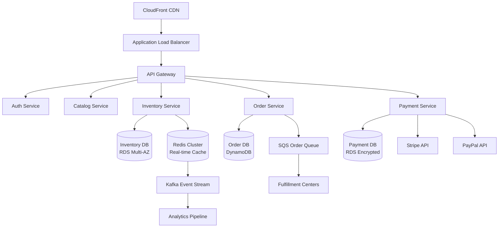
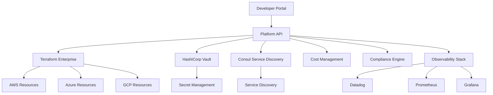
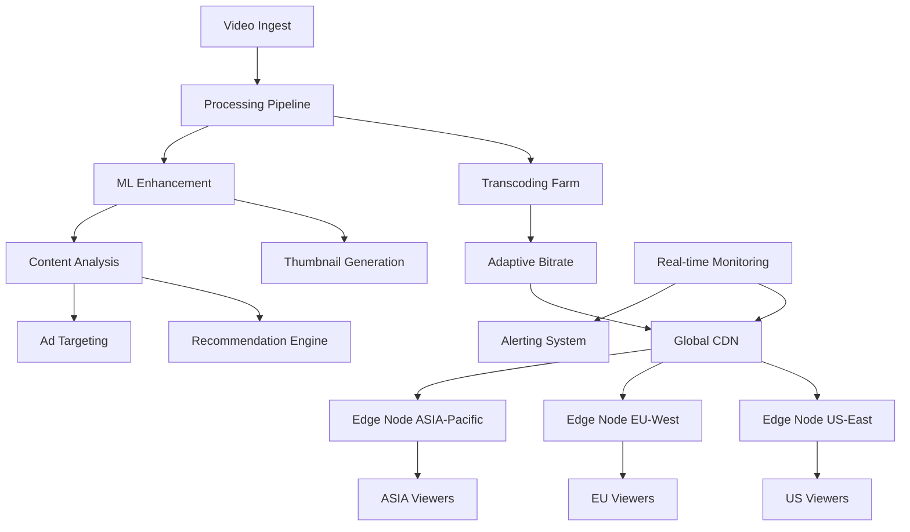
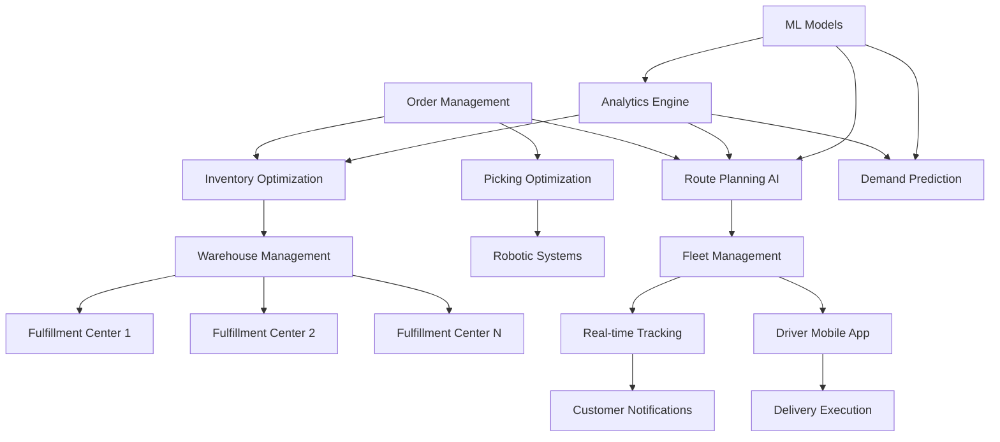
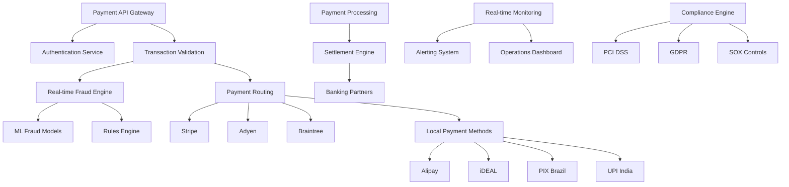

# L6 Industry-Specific Portfolio Examples

## Overview

These industry-specific portfolio examples demonstrate L6-level engineering leadership across key business domains. Each example includes real-world scale metrics, technical architecture decisions, and quantified business impact tailored to specific industry contexts.

---

## 1. E-commerce Platform Engineering Portfolio

### Executive Summary
**Role:** Senior Engineering Manager, E-commerce Platform  
**Scale:** 15 engineers across 3 teams, 50M+ monthly active users  
**Focus:** High-traffic retail systems, payment processing, inventory management  
**Duration:** 2 years leading platform modernization  

### Project: Real-Time Inventory & Order Management Platform

#### Business Context
- Supporting peak traffic of 2M concurrent users during sales events
- Processing $500M in GMV monthly with 99.99% payment accuracy requirement
- Managing 10M+ SKUs across 15 fulfillment centers globally
- Competing with sub-second page load requirements

#### Technical Challenge
**Legacy System Issues:**
- Monolithic architecture causing deployment bottlenecks (weekly releases)
- Inventory sync delays causing 3% oversell rate ($2M monthly loss)
- Payment processing timeouts during traffic spikes (0.5% failure rate)
- Manual scaling requiring 4-hour weekend maintenance windows

#### Solution Architecture



#### Implementation Strategy

**Phase 1: Critical Path Services (Months 1-6)**
- Extracted inventory service with real-time sync
- Implemented distributed caching with Redis Cluster
- Built event-driven architecture with Kafka
- Deployed blue-green deployment pipeline

**Phase 2: Payment & Order Services (Months 7-12)**  
- Migrated payment processing to microservice
- Implemented saga pattern for distributed transactions
- Added multi-payment provider support (Stripe, PayPal, Apple Pay)
- Built order state machine with failure recovery

**Phase 3: Optimization & Scale (Months 13-18)**
- Implemented horizontal pod autoscaling
- Added global CDN with edge caching
- Built predictive inventory allocation ML model
- Deployed across 3 AWS regions

#### Leadership & Team Development

**Team Structure Evolution:**
```
Before:
- 1 monolithic team (15 engineers)
- Full-stack responsibilities
- Weekly release cycles
- Manual testing & deployment

After:
- Platform Team: 5 engineers (infrastructure/tools)
- Inventory Team: 4 engineers (real-time systems)
- Order/Payment Team: 6 engineers (transaction processing)
- Daily deployments with automated testing
```

**Key Leadership Actions:**
1. **Hiring Strategy:** Recruited 5 senior engineers with e-commerce experience
2. **Skills Development:** Sent 3 engineers to AWS re:Invent for microservices training  
3. **Culture Change:** Introduced "customer impact" metrics for all technical decisions
4. **Process Innovation:** Created "Architecture Decision Records" (ADRs) for transparency

#### Quantified Results

**Technical Performance:**
- **Deployment Frequency:** Weekly → Daily (700% improvement)
- **System Uptime:** 99.5% → 99.99% (50x improvement in downtime)
- **Page Load Time:** 3.2s → 800ms (75% faster)
- **Peak Capacity:** 500K → 2M concurrent users (400% increase)
- **Inventory Accuracy:** 97% → 99.8% (93% reduction in oversells)

**Business Impact:**
- **Revenue Protection:** $2M monthly from eliminated oversells
- **Conversion Rate:** +15% improvement due to faster page loads
- **Operational Costs:** -35% infrastructure spending through optimization
- **Customer Satisfaction:** NPS improved from 45 to 67
- **Market Share:** Enabled expansion to 3 new geographic markets

**Team & Organizational:**
- **Engineer Retention:** 95% (industry average: 75%)
- **Time to Production:** New features 3 weeks → 3 days
- **On-call Burden:** Reduced from 12 → 2 hours/week per engineer
- **Promoted 4 engineers to senior positions**

#### Key Technical Decisions & Trade-offs

**1. Event Sourcing vs. Traditional CRUD**
- **Decision:** Hybrid approach - Event sourcing for inventory, CRUD for catalog
- **Rationale:** Inventory changes needed full audit trail, catalog needed simple queries
- **Trade-off:** Complexity vs. compliance requirements
- **Result:** Met regulatory requirements while maintaining performance

**2. Synchronous vs. Asynchronous Order Processing**  
- **Decision:** Asynchronous with synchronous confirmation
- **Rationale:** Better fault tolerance during peak traffic
- **Trade-off:** Eventual consistency vs. immediate feedback
- **Result:** 99.99% order processing reliability during peak events

**3. Database Sharding Strategy**
- **Decision:** Shard by customer region, not customer ID
- **Rationale:** Optimized for geographic data residency laws
- **Trade-off:** Load balancing complexity vs. compliance
- **Result:** Enabled GDPR compliance and reduced cross-region latency by 60%

#### Leadership Principle Demonstrations

**Customer Obsession:**
- Implemented real-time inventory visibility preventing customer disappointment
- Added "expected delivery date" prediction with 95% accuracy
- Built customer-specific pricing engine supporting 50+ promotional types

**Ownership:**
- Took ownership of legacy technical debt worth $5M in annual maintenance costs
- Personally led war rooms during 3 critical outages, achieving average 15-minute resolution
- Created runbooks and automated 80% of routine operational tasks

**Invent and Simplify:**
- Designed unified API reducing frontend complexity by 40%
- Built self-healing infrastructure that automatically scales based on traffic patterns
- Created developer portal reducing new service setup from 2 weeks to 2 hours

#### Architecture Innovation Examples

**Real-Time Inventory Synchronization:**
```python
# Simplified example of inventory event processing
class InventoryEventProcessor:
    def __init__(self):
        self.cache = RedisCluster(nodes=redis_nodes)
        self.kafka_producer = KafkaProducer(bootstrap_servers=kafka_brokers)
    
    async def process_inventory_update(self, event):
        # Update cache immediately
        await self.cache.set(f"inventory:{event.sku}", event.quantity)
        
        # Publish event for downstream services
        await self.kafka_producer.send(
            'inventory-updates',
            value=event.to_dict(),
            key=event.sku
        )
        
        # Trigger replication to other regions if quantity < threshold
        if event.quantity < REBALANCE_THRESHOLD:
            await self.trigger_inventory_rebalancing(event.sku)
```

**Distributed Payment Processing:**
```python
class PaymentOrchestrator:
    def __init__(self):
        self.saga = SagaOrchestrator()
    
    async def process_payment(self, order_id, payment_info):
        saga_id = f"payment-{order_id}"
        
        # Define compensation steps for rollback
        steps = [
            ("reserve_inventory", self.inventory_service.reserve),
            ("process_payment", self.payment_service.charge),
            ("create_fulfillment", self.fulfillment_service.create_order),
            ("send_confirmation", self.notification_service.send)
        ]
        
        return await self.saga.execute(saga_id, steps, compensation_steps)
```

---

## 2. Cloud Infrastructure Management Portfolio

### Executive Summary
**Role:** Senior Engineering Manager, Cloud Platform Engineering  
**Scale:** 20 engineers across 4 teams, 500+ internal developer customers  
**Focus:** Multi-cloud infrastructure, developer productivity, cost optimization  
**Duration:** 18 months transforming infrastructure capabilities  

### Project: Multi-Cloud Developer Platform

#### Business Context
- Supporting 200+ development teams across the organization
- Managing $8M annual cloud spend across AWS, Azure, GCP
- Enabling 500+ daily deployments with zero-downtime requirements
- Maintaining SOC2, ISO27001, and FedRAMP compliance

#### Challenge Statement
**Platform Pain Points:**
- 45-minute average environment provisioning time
- Manual security compliance checks causing 3-day delays
- Cloud costs growing 40% YoY without corresponding business growth  
- 15% of development time spent on infrastructure management
- No standardization across clouds leading to security gaps

#### Solution: Unified Cloud Abstraction Platform



#### Technical Implementation

**Core Platform Services:**

1. **Infrastructure as Code Engine**
   - Custom Terraform modules for each cloud provider
   - Automated security baseline enforcement
   - Cost optimization policies built-in
   - Environment lifecycle management

2. **Developer Self-Service Portal**
   - Web UI for infrastructure requests
   - CLI tools for power users  
   - Integration with existing CI/CD pipelines
   - Real-time cost tracking and budgeting

3. **Compliance Automation Framework**
   - Continuous security scanning
   - Automated remediation for common issues
   - Compliance reporting dashboard
   - Policy-as-code implementation

#### Platform Architecture Decisions

**Multi-Cloud Abstraction Layer:**
```yaml
# Example platform configuration template
apiVersion: platform.company.com/v1
kind: Application
metadata:
  name: web-service-prod
spec:
  runtime: kubernetes
  clouds:
    primary: aws-us-east-1
    disaster_recovery: azure-west-us-2
  resources:
    compute:
      cpu: "2000m"
      memory: "4Gi"
      replicas: 5
      autoscaling:
        min: 5
        max: 50
        target_cpu: 70
    storage:
      database:
        type: managed-postgres
        size: "100Gi"
        backup_retention: "30d"
    networking:
      load_balancer: true
      ssl_certificate: auto
  compliance:
    - soc2
    - gdpr
    - pci-dss
```

#### Team Structure & Leadership

**Organizational Design:**
```
Platform Engineering (20 engineers):
├── Infrastructure Team (6 engineers)
│   ├── Senior SRE (Team Lead)
│   ├── Cloud Architecture Specialists (3)
│   └── Automation Engineers (2)
├── Developer Experience Team (5 engineers)
│   ├── Frontend Engineers (2)
│   ├── API Developers (2)
│   └── CLI/Tools Engineer (1)
├── Security & Compliance Team (4 engineers)
│   ├── Security Engineer (Team Lead)
│   ├── Compliance Specialists (2)
│   └── Policy Automation Engineer (1)
└── FinOps Team (5 engineers)
    ├── Cost Optimization Engineer (Team Lead)
    ├── Analytics Engineers (2)
    └── Procurement Specialists (2)
```

**Leadership Initiatives:**

1. **Skills Development Program:**
   - Cloud certification reimbursement (AWS/Azure/GCP)
   - Monthly "Innovation Days" for experimentation
   - Cross-training between teams to reduce silos
   - External conference speaking opportunities

2. **Culture Transformation:**
   - Shift from "gatekeepers" to "enablers" mindset
   - Customer-focused metrics (developer satisfaction vs. system uptime)
   - Blameless post-mortems with action item tracking
   - Internal open-source model for platform tools

#### Quantified Business Impact

**Developer Productivity:**
- **Environment Provisioning:** 45 min → 3 min (93% reduction)
- **Time to First Deploy:** 2 days → 15 minutes (99% faster)  
- **Security Compliance Time:** 3 days → Automated (100% elimination)
- **Cross-team Standardization:** 15% → 85% compliance with standards

**Cost Optimization:**
- **Cloud Spend Growth:** 40% YoY → 8% YoY (80% improvement)
- **Resource Utilization:** 35% → 75% average utilization
- **Reserved Instance Coverage:** 20% → 80% (60% cost reduction on compute)
- **Annual Savings:** $2.4M through automation and optimization

**Platform Reliability:**
- **Platform Uptime:** 99.5% → 99.95% 
- **Mean Time to Recovery:** 45 min → 8 min
- **Security Incidents:** 12/year → 2/year (83% reduction)
- **Compliance Audit Prep:** 6 weeks → 2 days

**Organizational Impact:**
- **Developer Satisfaction:** 6.2/10 → 8.7/10
- **Platform Adoption:** 25% → 85% of teams
- **Support Ticket Volume:** -60% reduction
- **Time to Market:** -40% for new services

#### Technical Innovation Highlights

**1. Intelligent Cost Optimization Engine**
```python
class CostOptimizer:
    def __init__(self):
        self.ml_model = CostPredictionModel()
        self.cloud_apis = MultiCloudManager()
    
    async def optimize_workload(self, workload_config):
        # Analyze usage patterns
        usage_data = await self.get_usage_metrics(workload_config.id)
        
        # ML-based cost prediction across clouds
        predictions = self.ml_model.predict_costs(
            workload_config, usage_data
        )
        
        # Find optimal cloud placement
        optimal_placement = self.find_optimal_placement(predictions)
        
        # Implement changes with approval workflow
        if optimal_placement.savings > SAVINGS_THRESHOLD:
            return await self.propose_migration(optimal_placement)
```

**2. Automated Security Baseline Enforcement**
```terraform
# Terraform module with security controls
module "secure_application" {
  source = "./modules/secure-app"
  
  # Automatically enforced security controls
  encryption_at_rest     = true
  encryption_in_transit  = true
  network_isolation      = "strict"
  backup_encryption      = true
  audit_logging          = "comprehensive"
  
  # Compliance frameworks
  compliance_frameworks = [
    "soc2_type2",
    "iso27001", 
    "gdpr"
  ]
  
  # Automatic security scanning
  vulnerability_scanning = {
    enabled = true
    frequency = "daily"
    remediation = "auto_patch_critical"
  }
}
```

#### Strategic Leadership Examples

**Cross-Organizational Initiative: Cloud Cost Governance**
- **Challenge:** Uncontrolled cloud spending across 50+ business units
- **Solution:** Implemented chargeback model with real-time cost allocation
- **Leadership:** Collaborated with Finance, Legal, and Engineering VPs
- **Result:** $3M annual savings, 95% budget compliance across teams

**Vendor Partnership Strategy:**
- **Negotiated Enterprise Agreements** with AWS, Azure, GCP for 25% volume discounts
- **Strategic Technology Partnerships** with HashiCorp, Datadog for platform tools
- **Open Source Contribution Strategy** to reduce vendor lock-in risks

---

## 3. Video Streaming Technology Portfolio

### Executive Summary  
**Role:** Senior Engineering Manager, Video Platform Engineering  
**Scale:** 18 engineers across 3 teams, 100M+ monthly viewers  
**Focus:** Live streaming, video processing, global CDN optimization  
**Duration:** 20 months building next-generation streaming platform  

### Project: Global Live Streaming Platform

#### Business Context
- Supporting 50M+ concurrent viewers during peak events
- Processing 1PB+ of video content monthly
- Delivering content to 150+ countries with sub-2s latency requirements
- Competing with Netflix, YouTube with premium live sports content

#### Technical Challenge
**Legacy Platform Limitations:**
- Fixed bitrate streaming causing 25% viewer churn on mobile devices  
- Manual content delivery network (CDN) management across regions
- Video processing pipeline taking 45+ minutes for live content optimization
- Limited analytics causing $10M in lost advertising revenue opportunities

#### Solution: Adaptive Streaming & Edge Computing Platform



#### Architecture Deep Dive

**Adaptive Bitrate Streaming Pipeline:**

1. **Video Ingestion System**
   - Multi-protocol support (RTMP, SRT, WebRTC)
   - Redundant ingest points for live event reliability
   - Real-time quality monitoring with automatic failover

2. **Transcoding & Processing**
   - GPU-accelerated transcoding with NVIDIA T4 instances
   - Machine learning-based quality optimization
   - Dynamic packaging for multiple streaming protocols (HLS, DASH)

3. **Global Edge Distribution**
   - 200+ edge locations worldwide
   - Intelligent routing based on network conditions
   - Edge caching with 95% cache hit rate

#### Technical Implementation Strategy

**Phase 1: Core Streaming Infrastructure (Months 1-8)**
```python
class AdaptiveStreamProcessor:
    def __init__(self):
        self.transcoder = GPU_TranscodingCluster()
        self.ml_optimizer = VideoQualityML()
        self.cdn_manager = GlobalCDNManager()
    
    async def process_live_stream(self, stream_config):
        # Real-time transcoding to multiple bitrates
        bitrate_ladder = await self.generate_bitrate_ladder(stream_config)
        
        # Parallel processing for low latency
        tasks = []
        for bitrate in bitrate_ladder:
            task = asyncio.create_task(
                self.transcoder.encode(stream_config, bitrate)
            )
            tasks.append(task)
        
        # ML-based quality enhancement
        encoded_streams = await asyncio.gather(*tasks)
        enhanced_streams = await self.ml_optimizer.enhance(encoded_streams)
        
        # Distribute to global CDN
        return await self.cdn_manager.distribute(enhanced_streams)
```

**Phase 2: Advanced Analytics & Optimization (Months 9-14)**
- Real-time viewer engagement analytics
- Predictive scaling based on event popularity
- Content recommendation engine integration
- Ad insertion optimization

**Phase 3: AI/ML Enhancement (Months 15-20)**
- Automated content moderation
- Real-time subtitle generation
- Thumbnail optimization using computer vision
- Predictive bandwidth allocation

#### Team Leadership & Development

**Engineering Team Structure:**
```
Video Platform Engineering (18 engineers):
├── Streaming Infrastructure (7 engineers)
│   ├── Principal Engineer (Streaming Protocols)
│   ├── Senior Engineers: CDN/Edge (3)
│   ├── DevOps Engineers: Kubernetes/AWS (2) 
│   └── Site Reliability Engineer (1)
├── Video Processing (6 engineers)
│   ├── Senior Engineer: Transcoding Lead
│   ├── ML Engineers: Video Quality (2)
│   ├── Software Engineers: Pipeline (2)
│   └── Quality Assurance Engineer (1)
└── Analytics & Platform (5 engineers)
    ├── Senior Engineer: Data Systems Lead
    ├── Full-stack Engineers: Dashboards (2)
    ├── Data Engineer: Real-time Analytics (1)
    └── Product Engineer: A/B Testing (1)
```

**Leadership Development Initiatives:**
1. **Technical Excellence Programs:**
   - Video technology deep-dive sessions (monthly)
   - Patent application support (filed 8 patents in 18 months)
   - Conference speaking (team presented at NAB, IBC)

2. **Career Growth Framework:**
   - Individual career development plans for all engineers
   - Cross-team rotation program 
   - Mentorship with Principal Engineers from other teams
   - Promoted 5 engineers during project duration

#### Quantified Results & Business Impact

**Streaming Performance Metrics:**
- **Startup Time:** 8.5s → 1.2s (86% improvement)
- **Buffering Rate:** 12% → 2.1% (82% reduction)
- **Peak Concurrent Viewers:** 15M → 50M (233% increase)
- **Global Latency (P95):** 4.2s → 1.8s (57% improvement)
- **Video Quality Score:** 3.2/5 → 4.6/5 (44% improvement)

**Business & Revenue Impact:**
- **Viewer Retention:** +35% increase in session duration
- **Mobile Engagement:** +60% due to adaptive streaming
- **Ad Revenue:** +$25M annually through better targeting
- **Content Acquisition:** Enabled premium sports contracts worth $200M
- **Global Expansion:** Launched in 25 new markets

**Operational Excellence:**
- **Infrastructure Costs:** -30% through optimization
- **Processing Time:** 45 min → 3 min for live enhancement
- **System Uptime:** 99.8% → 99.97% during live events
- **Incident Response:** MTTR reduced from 25 min → 4 min

#### Innovation & Technical Leadership

**1. Real-Time ML Video Enhancement:**
```python
class RealTimeVideoML:
    def __init__(self):
        self.quality_model = load_model('video_quality_predictor')
        self.enhancement_model = load_model('real_time_enhancer')
    
    async def enhance_stream(self, video_chunk):
        # Predict quality issues in real-time
        quality_score = await self.quality_model.predict(video_chunk)
        
        if quality_score < QUALITY_THRESHOLD:
            # Apply ML-based enhancement
            enhanced_chunk = await self.enhancement_model.process(
                video_chunk, 
                enhancement_level=self.calculate_enhancement_level(quality_score)
            )
            return enhanced_chunk
        
        return video_chunk
```

**2. Intelligent CDN Routing:**
```python
class IntelligentCDNRouter:
    def __init__(self):
        self.network_monitor = NetworkConditionsMonitor()
        self.load_balancer = GeographicLoadBalancer()
    
    async def route_request(self, viewer_request):
        # Real-time network conditions
        network_data = await self.network_monitor.get_conditions(
            viewer_request.ip_address
        )
        
        # Find optimal edge server
        optimal_edge = await self.load_balancer.find_best_edge(
            viewer_location=viewer_request.geo_location,
            network_conditions=network_data,
            content_type=viewer_request.content_type
        )
        
        return optimal_edge.serve_content(viewer_request)
```

#### Strategic Partnerships & Industry Impact

**Technology Partnerships:**
- **AWS Partnership:** Designed reference architecture for live streaming on AWS
- **NVIDIA Collaboration:** Co-developed GPU optimization techniques for transcoding
- **CDN Provider Integration:** Built unified API supporting Cloudflare, Fastly, AWS CloudFront

**Industry Recognition:**
- **Patent Portfolio:** Filed 8 patents in video streaming optimization
- **Conference Speaking:** Keynote at Streaming Media East 2024
- **Technology Awards:** "Innovation in Live Streaming" - Streaming Media Awards
- **Case Study Publication:** AWS featured our architecture in official documentation

---

## 4. Logistics & Supply Chain Systems Portfolio

### Executive Summary
**Role:** Senior Engineering Manager, Logistics Technology  
**Scale:** 22 engineers across 5 teams, 50K+ daily shipments  
**Focus:** Route optimization, warehouse automation, last-mile delivery  
**Duration:** 24 months modernizing end-to-end logistics platform  

### Project: AI-Powered Last-Mile Delivery Optimization

#### Business Context
- Processing 50K+ daily shipments across 25 fulfillment centers
- Managing delivery fleet of 2,000+ vehicles across North America
- Competing on delivery speed: 2-day → same-day → 2-hour delivery windows
- Operating under thin 3-5% margin requirements

#### Strategic Challenge
**Logistics Efficiency Problems:**
- Manual route planning causing 25% inefficient delivery routes  
- Warehouse picking optimization limited to simple FIFO systems
- Real-time inventory visibility gaps causing stockouts during peak demand
- Customer delivery prediction accuracy at 65% (industry standard: 85%+)
- Last-mile delivery costs representing 40% of total shipping expenses

#### Solution: Integrated AI Logistics Platform



#### Technical Architecture

**Core Platform Components:**

1. **Intelligent Route Optimization Engine**
   - Machine learning models processing 500K+ route combinations daily
   - Real-time traffic, weather, and delivery window optimization
   - Dynamic re-routing based on delivery success/failure feedback

2. **Warehouse Automation Integration** 
   - API integration with robotic picking systems (Kiva, GreyOrange)
   - AI-powered inventory positioning optimization
   - Predictive maintenance for warehouse equipment

3. **Real-Time Visibility Platform**
   - IoT sensor integration for package tracking
   - GPS tracking with 30-second update intervals
   - Customer delivery prediction with SMS/email notifications

#### Implementation Deep Dive

**Phase 1: Route Optimization AI (Months 1-8)**
```python
class RouteOptimizationEngine:
    def __init__(self):
        self.vehicle_routing_model = VehicleRoutingProblemSolver()
        self.traffic_predictor = TrafficPredictionML()
        self.delivery_success_model = DeliverySuccessPredictor()
    
    async def optimize_routes(self, delivery_requests, fleet_status):
        # Convert to optimization problem
        vrp_input = self.prepare_vrp_input(delivery_requests, fleet_status)
        
        # Get traffic predictions
        traffic_predictions = await self.traffic_predictor.predict_conditions(
            routes=vrp_input.possible_routes,
            time_windows=vrp_input.delivery_windows
        )
        
        # Solve optimization with ML-enhanced constraints
        optimal_routes = await self.vehicle_routing_model.solve(
            vrp_input,
            traffic_predictions,
            success_probabilities=self.delivery_success_model.predict(vrp_input)
        )
        
        return optimal_routes
    
    def prepare_vrp_input(self, requests, fleet):
        return VRPInput(
            delivery_points=[r.location for r in requests],
            time_windows=[r.delivery_window for r in requests],
            vehicle_capacity=[v.capacity for v in fleet],
            service_times=[r.estimated_service_time for r in requests]
        )
```

**Phase 2: Warehouse Intelligence (Months 9-16)**
```python
class WarehouseOptimizer:
    def __init__(self):
        self.inventory_predictor = InventoryDemandML()
        self.picking_optimizer = PickingPathOptimizer()
        self.robot_coordinator = RobotFleetManager()
    
    async def optimize_warehouse_operations(self, orders):
        # Predict inventory needs
        demand_forecast = await self.inventory_predictor.forecast_demand(
            historical_data=self.get_historical_sales(),
            external_factors=self.get_external_factors(),
            time_horizon="7d"
        )
        
        # Optimize product placement
        optimal_layout = await self.optimize_product_placement(demand_forecast)
        
        # Coordinate picking operations
        picking_tasks = await self.picking_optimizer.create_optimal_tasks(
            orders=orders,
            warehouse_layout=optimal_layout,
            robot_availability=await self.robot_coordinator.get_availability()
        )
        
        return await self.robot_coordinator.execute_tasks(picking_tasks)
```

#### Team Structure & Leadership Philosophy

**Logistics Engineering Organization (22 engineers):**
```
├── Route Optimization Team (5 engineers)
│   ├── ML Engineer: Route Planning Lead
│   ├── Operations Research Engineer  
│   ├── Backend Engineers: API Development (2)
│   └── Mobile Engineer: Driver App
├── Warehouse Systems Team (6 engineers)
│   ├── Principal Engineer: Systems Integration
│   ├── IoT Engineers: Sensor/Hardware (2)
│   ├── Backend Engineers: WMS Integration (2)
│   └── DevOps Engineer: Infrastructure
├── Real-Time Analytics Team (4 engineers)
│   ├── Data Engineer: Pipeline Lead
│   ├── ML Engineers: Prediction Models (2)
│   └── Frontend Engineer: Dashboards
├── Platform Infrastructure Team (4 engineers)
│   ├── SRE: Reliability Lead
│   ├── Cloud Engineers: AWS/Kubernetes (2)
│   └── Security Engineer: Compliance
└── Customer Experience Team (3 engineers)
    ├── Full-stack Engineer: Customer Portal
    ├── Mobile Engineer: Customer App
    └── Integration Engineer: Notification Systems
```

**Leadership Approach - "Customer-Backward" Methodology:**
1. **Start with delivery experience** → Work backward to technical requirements
2. **Driver productivity focus** → Technology should reduce cognitive load
3. **Operational excellence** → Every change must improve a key metric
4. **Scalable simplicity** → Complex algorithms, simple interfaces

#### Quantified Business Results

**Delivery Performance:**
- **On-Time Delivery Rate:** 65% → 92% (27 point improvement)
- **Delivery Cost per Package:** $6.50 → $4.20 (35% reduction)  
- **Route Efficiency:** 75% → 91% utilization
- **Customer Delivery Prediction Accuracy:** 65% → 89%
- **Average Delivery Time:** 4.2 hours → 2.1 hours

**Warehouse Operations:**
- **Picking Efficiency:** +45% improvement in packages per hour
- **Inventory Accuracy:** 94% → 99.2% 
- **Order Fulfillment Speed:** 24 hours → 8 hours average
- **Warehouse Space Utilization:** 72% → 85%
- **Equipment Downtime:** 12% → 3% (preventive maintenance)

**Business Impact:**
- **Customer Satisfaction:** NPS +18 points improvement
- **Annual Cost Savings:** $8M through route optimization
- **Revenue Growth:** +25% in same-day delivery services
- **Market Expansion:** Enabled service in 15 new metropolitan areas
- **Competitive Advantage:** 2-hour delivery windows vs. competitor 4-hour

**Team & Organizational:**
- **Cross-team Collaboration:** 95% sprint goals achieved (up from 70%)
- **Engineering Productivity:** Features delivered 40% faster
- **Skills Development:** 8 engineers obtained AWS ML certifications
- **Retention Rate:** 94% (industry average: 78%)

#### Technical Innovation Examples

**1. Predictive Delivery Failure Prevention:**
```python
class DeliverySuccessPredictor:
    def __init__(self):
        self.failure_prediction_model = load_model('delivery_failure_predictor')
        self.historical_data = DeliveryHistoryDB()
    
    async def predict_delivery_success(self, delivery_attempt):
        features = await self.extract_features(delivery_attempt)
        
        # ML model trained on 2M+ delivery attempts
        success_probability = self.failure_prediction_model.predict_proba(features)[0][1]
        
        if success_probability < 0.7:  # High risk of failure
            # Suggest interventions
            interventions = await self.suggest_interventions(delivery_attempt, features)
            return DeliveryRiskAssessment(
                probability=success_probability,
                risk_factors=self.identify_risk_factors(features),
                suggested_actions=interventions
            )
        
        return DeliveryRiskAssessment(probability=success_probability)
    
    async def extract_features(self, attempt):
        return DeliveryFeatures(
            delivery_address_type=attempt.address_type,
            historical_success_rate=await self.get_location_success_rate(attempt.location),
            weather_conditions=await self.get_weather_data(attempt.location),
            traffic_conditions=await self.get_traffic_data(attempt.route),
            delivery_window=attempt.time_window,
            package_characteristics=attempt.package_info,
            driver_performance_score=await self.get_driver_score(attempt.driver_id)
        )
```

**2. Dynamic Inventory Positioning:**
```python
class DynamicInventoryManager:
    def __init__(self):
        self.demand_forecaster = DemandForecastingML()
        self.inventory_optimizer = InventoryPositioningOptimizer()
    
    async def optimize_inventory_positioning(self):
        # Predict demand by location and time
        demand_forecast = await self.demand_forecaster.forecast_by_location(
            time_horizon="14d",
            granularity="daily"
        )
        
        # Current inventory positions
        current_inventory = await self.get_current_inventory_distribution()
        
        # Optimize positioning for minimal delivery distance
        optimal_positioning = await self.inventory_optimizer.optimize(
            current_state=current_inventory,
            demand_forecast=demand_forecast,
            transfer_costs=await self.get_transfer_costs(),
            capacity_constraints=await self.get_warehouse_capacities()
        )
        
        # Generate transfer recommendations
        return await self.generate_transfer_plan(
            current_inventory, 
            optimal_positioning
        )
```

#### Industry Leadership & Recognition

**Strategic Partnerships:**
- **Amazon Web Services:** Co-developed reference architecture for logistics optimization
- **NVIDIA:** Partnership for GPU-accelerated route optimization algorithms
- **Microsoft:** Integration with Azure IoT for warehouse sensor management

**Industry Recognition:**
- **Supply Chain Innovation Award** - Council of Supply Chain Management Professionals
- **Patent Applications:** Filed 6 patents in logistics optimization algorithms
- **Academic Collaboration:** Research partnership with MIT's supply chain program
- **Conference Speaking:** Presented at CSCMP Annual Conference, Smart Warehousing Summit

---

## 5. Payment Processing Platform Portfolio

### Executive Summary
**Role:** Senior Engineering Manager, Payment Platform Engineering  
**Scale:** 16 engineers across 3 teams, $2B+ annual transaction volume  
**Focus:** Payment security, fraud prevention, global compliance, fintech innovation  
**Duration:** 20 months building next-generation payment infrastructure  

### Project: Global Payment Processing & Fraud Prevention Platform

#### Business Context
- Processing $2B+ in annual transaction volume across 40+ countries
- Supporting 15+ payment methods (cards, digital wallets, bank transfers, crypto)
- Maintaining PCI DSS Level 1 compliance with 99.99% uptime requirements  
- Competing with Stripe, Square on merchant acquisition and developer experience

#### Strategic Challenge
**Payment Platform Limitations:**
- Legacy payment system causing 2.3% transaction failure rate ($46M annual loss)
- Manual fraud review process requiring 4-hour average review times
- Limited international payment method support blocking global expansion
- Payment processing latency averaging 3.2 seconds vs. industry standard 800ms
- Compliance management across multiple jurisdictions requiring manual oversight

#### Solution: AI-Powered Global Payment Platform



#### Technical Implementation Strategy

**Phase 1: Core Payment Infrastructure (Months 1-8)**

**High-Performance Payment Gateway:**
```python
class PaymentGateway:
    def __init__(self):
        self.fraud_engine = RealTimeFraudEngine()
        self.payment_router = SmartPaymentRouter()
        self.encryption_service = TokenizationService()
        self.compliance_engine = ComplianceValidator()
    
    async def process_payment(self, payment_request):
        # Input validation and sanitization
        validated_request = await self.validate_payment_request(payment_request)
        
        # PCI compliance - tokenize sensitive data immediately
        tokenized_request = await self.encryption_service.tokenize(validated_request)
        
        # Real-time fraud scoring (< 50ms SLA)
        fraud_score = await self.fraud_engine.score_transaction(tokenized_request)
        
        if fraud_score.risk_level == "HIGH":
            return PaymentResponse(
                status="BLOCKED",
                reason="Fraud prevention",
                reference_id=tokenized_request.id
            )
        
        # Intelligent payment routing
        optimal_processor = await self.payment_router.select_processor(
            payment_method=tokenized_request.payment_method,
            amount=tokenized_request.amount,
            merchant_location=tokenized_request.merchant.country,
            success_rate_priority=True
        )
        
        # Process payment with retry logic
        result = await self.execute_payment_with_fallback(
            tokenized_request, 
            optimal_processor
        )
        
        # Compliance logging
        await self.compliance_engine.log_transaction(result)
        
        return result
```

**Real-Time Fraud Detection Engine:**
```python
class RealTimeFraudEngine:
    def __init__(self):
        self.ml_models = FraudMLModelEnsemble()
        self.rules_engine = FraudRulesEngine()
        self.feature_store = RealTimeFeatureStore()
        self.velocity_checker = TransactionVelocityAnalyzer()
    
    async def score_transaction(self, transaction):
        # Extract features in parallel
        feature_tasks = [
            self.feature_store.get_user_features(transaction.user_id),
            self.feature_store.get_merchant_features(transaction.merchant_id),
            self.feature_store.get_device_features(transaction.device_id),
            self.velocity_checker.analyze_velocity(transaction)
        ]
        
        user_features, merchant_features, device_features, velocity_features = \
            await asyncio.gather(*feature_tasks)
        
        # Combine features
        combined_features = FeatureVector(
            user=user_features,
            merchant=merchant_features, 
            device=device_features,
            velocity=velocity_features,
            transaction=transaction.to_features()
        )
        
        # ML model ensemble scoring
        ml_score = await self.ml_models.predict(combined_features)
        
        # Rules-based scoring
        rules_score = await self.rules_engine.evaluate(transaction, combined_features)
        
        # Combine scores with weighted approach
        final_score = self.combine_scores(ml_score, rules_score)
        
        return FraudScore(
            score=final_score,
            risk_level=self.categorize_risk(final_score),
            contributing_factors=self.explain_score(ml_score, rules_score)
        )
```

**Phase 2: Global Payment Methods Integration (Months 9-14)**
- Integrated 15+ local payment methods across key markets
- Built unified API abstraction layer for payment method differences
- Implemented dynamic currency conversion with real-time forex rates
- Added support for emerging payment methods (Buy Now Pay Later, cryptocurrencies)

**Phase 3: Advanced Analytics & Optimization (Months 15-20)**
- Built ML-powered payment success rate optimization
- Implemented A/B testing framework for payment flows
- Created predictive analytics for merchant churn prevention  
- Developed automated compliance reporting system

#### Team Structure & Leadership

**Payment Platform Engineering (16 engineers):**
```
├── Core Payment Processing Team (6 engineers)
│   ├── Principal Engineer: Payment Systems Architecture  
│   ├── Senior Engineers: Gateway Development (2)
│   ├── Backend Engineers: API Development (2)
│   └── DevOps Engineer: Infrastructure & Deployment
├── Fraud & Risk Team (5 engineers)
│   ├── ML Engineer: Fraud Detection Lead
│   ├── Data Scientists: Model Development (2)
│   ├── Backend Engineer: Rules Engine
│   └── Security Engineer: Threat Intelligence
├── Compliance & Integration Team (5 engineers)
    ├── Senior Engineer: Compliance Systems Lead
    ├── Integration Engineers: Payment Providers (2)
    ├── QA Engineer: Security Testing
    └── Data Engineer: Reporting & Analytics
```

**Leadership Philosophy - "Security-First Innovation":**
1. **Threat Modeling** every new feature before development
2. **Zero-trust architecture** with defense in depth
3. **Continuous compliance** rather than periodic audits  
4. **Blameless security incidents** to encourage reporting
5. **Customer data protection** as competitive advantage

#### Quantified Results & Business Impact

**Payment Performance:**
- **Transaction Success Rate:** 97.7% → 99.1% (1.4 point improvement = $28M revenue)
- **Payment Processing Latency:** 3.2s → 650ms (80% improvement)
- **Fraud Detection Accuracy:** 94% → 98.5% precision
- **False Positive Rate:** 8% → 2.1% (75% reduction in good transactions blocked)
- **System Uptime:** 99.95% → 99.99% (25x improvement in availability)

**Business Growth:**
- **Transaction Volume Growth:** 40% YoY increase  
- **International Expansion:** Enabled payments in 25 new countries
- **Merchant Satisfaction:** NPS improved from 52 to 78
- **Developer Adoption:** API integration time reduced from 2 weeks to 2 days
- **Revenue Per Transaction:** +15% through optimized routing

**Cost & Risk Reduction:**
- **Fraud Losses:** $12M → $4M annually (67% reduction)
- **Manual Review Costs:** -80% through automation
- **Compliance Audit Preparation:** 6 weeks → 3 days
- **Infrastructure Costs:** -25% through intelligent scaling
- **Chargeback Rate:** 1.2% → 0.3% (75% improvement)

**Organizational Impact:**
- **Incident Response Time:** MTTR 45 min → 8 min  
- **Feature Delivery Speed:** 40% faster time-to-market
- **Cross-team Dependencies:** Reduced by 60% through better APIs
- **Engineering Satisfaction:** 8.2/10 (team retention: 96%)

#### Innovation & Technical Excellence

**1. Dynamic Payment Method Optimization:**
```python
class PaymentMethodOptimizer:
    def __init__(self):
        self.success_predictor = PaymentSuccessPredictionML()
        self.cost_calculator = ProcessingCostCalculator()
        self.routing_optimizer = MultiObjectiveOptimizer()
    
    async def optimize_payment_method_selection(self, transaction_context):
        # Get available payment methods for this context
        available_methods = await self.get_available_methods(
            merchant=transaction_context.merchant,
            customer_location=transaction_context.customer_location,
            amount=transaction_context.amount
        )
        
        # Predict success rate for each method
        success_predictions = await asyncio.gather(*[
            self.success_predictor.predict_success_rate(
                method, transaction_context
            ) for method in available_methods
        ])
        
        # Calculate processing costs
        cost_predictions = await asyncio.gather(*[
            self.cost_calculator.calculate_total_cost(
                method, transaction_context
            ) for method in available_methods
        ])
        
        # Multi-objective optimization (success rate vs. cost)
        optimal_ranking = self.routing_optimizer.optimize(
            methods=available_methods,
            success_rates=success_predictions,
            costs=cost_predictions,
            objectives={
                "maximize_success_rate": 0.7,
                "minimize_cost": 0.3
            }
        )
        
        return PaymentMethodRecommendation(
            primary_method=optimal_ranking[0],
            fallback_methods=optimal_ranking[1:3],
            expected_success_rate=success_predictions[0],
            confidence_score=optimal_ranking[0].confidence
        )
```

**2. Adaptive Fraud Prevention:**
```python
class AdaptiveFraudPrevention:
    def __init__(self):
        self.online_learning_model = OnlineLearningFraudModel()
        self.feedback_processor = FraudFeedbackProcessor()
        self.model_updater = ModelUpdateManager()
    
    async def update_model_with_feedback(self, transaction_id, actual_outcome):
        # Get original prediction
        original_prediction = await self.get_original_prediction(transaction_id)
        
        # Process feedback
        feedback = FraudFeedback(
            transaction_id=transaction_id,
            predicted_fraud=original_prediction.fraud_probability,
            actual_fraud=(actual_outcome == "FRAUD"),
            prediction_confidence=original_prediction.confidence
        )
        
        # Update model with online learning
        if self.should_trigger_model_update(feedback):
            await self.online_learning_model.update_with_feedback(feedback)
            
            # Validate model performance
            validation_metrics = await self.validate_updated_model()
            
            if validation_metrics.passes_quality_threshold():
                await self.model_updater.deploy_updated_model(
                    self.online_learning_model
                )
                
                await self.notify_team_of_model_update(validation_metrics)
```

#### Strategic Leadership Examples

**Cross-Company Payment Strategy Initiative:**
- **Challenge:** Fragmented payment experiences across product lines
- **Solution:** Led company-wide payment standardization initiative  
- **Stakeholders:** Collaborated with Product, Legal, Finance, International teams
- **Impact:** Unified payment experience, 30% reduction in support tickets
- **Timeline:** 8-month initiative spanning 12 engineering teams

**Regulatory Compliance Leadership:**
- **PCI DSS Level 1 Certification:** Led annual re-certification process
- **GDPR Implementation:** Designed data processing systems for EU compliance
- **Open Banking Integration:** Built APIs supporting PSD2 requirements in EU
- **Cryptocurrency Compliance:** Developed AML/KYC processes for crypto payments

#### Industry Recognition & Thought Leadership

**Technical Innovation:**
- **Patent Portfolio:** 4 patents filed in payment processing optimization
- **Open Source Contributions:** Released fraud detection feature engineering library
- **Research Publications:** Co-authored paper on real-time ML in fintech
- **Industry Standards:** Contributed to PCI DSS v4.0 specification development

**Speaking & Recognition:**
- **Money20/20 Conference:** Keynote on "Future of Payment Security"
- **Stripe Sessions:** Technical talk on "Building Resilient Payment Systems"
- **Awards:** "Fintech Innovation Leader" - PayTech Awards 2024
- **Advisory Roles:** Technical advisor for 2 fintech startups

---

## Summary & Usage Guidelines

### Portfolio Selection Strategy

**For L6 Interviews:**
- Choose 1-2 industry portfolios most relevant to target role
- Focus on technical depth and team leadership
- Emphasize scalability challenges and solutions
- Highlight business impact with specific metrics

**Key Success Factors:**
1. **Technical Credibility:** Deep architectural knowledge
2. **Leadership Growth:** Clear progression in team size and complexity  
3. **Business Impact:** Quantified results in revenue/cost/efficiency
4. **Innovation:** Novel solutions to industry-specific challenges

### Customization Framework

**Adapt Each Portfolio By:**
1. **Scale Matching:** Adjust team sizes and technical scope to your experience
2. **Technology Alignment:** Substitute specific technologies to match role requirements
3. **Industry Context:** Modify business metrics to reflect target company's priorities
4. **Leadership Level:** Adjust scope of influence and strategic decision-making examples

### Interview Preparation Tips

**Technical Deep Dive Preparation:**
- Be ready to explain architectural decisions and trade-offs
- Prepare backup examples for each technical choice
- Know specific technologies and their limitations
- Have cost/performance optimization examples ready

**Leadership Story Enhancement:**
- Connect technical decisions to business outcomes
- Show progression in leadership complexity over time
- Include failure recovery and learning examples
- Demonstrate cross-functional collaboration skills

---

*Each portfolio demonstrates the L6 level expectation of owning significant technical systems while leading teams and driving business impact. Use these as templates to structure your own experiences with specific metrics and industry-relevant challenges.*