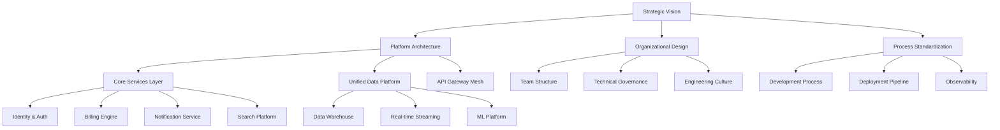
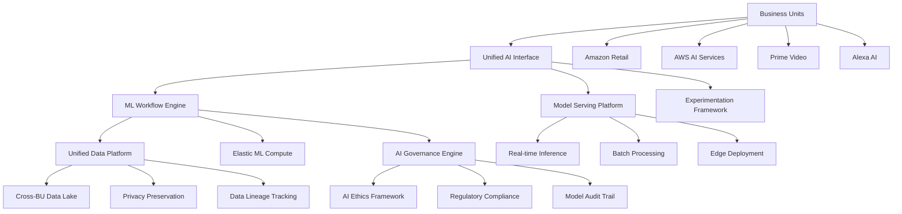

# L7 Strategic Leadership Portfolios

## Overview

These L7-level portfolio examples demonstrate Principal Engineering Manager capabilities across strategic, multi-organizational initiatives. Each example shows the scope, complexity, and business impact expected at the L7 level, including cross-functional leadership, strategic vision, and enterprise-wide transformation.

---

## 1. Multi-Organization Platform Strategy Portfolio

### Executive Summary
**Role:** Principal Engineering Manager, Enterprise Platform Strategy  
**Scope:** 8 organizations, 200+ engineers across 15 teams  
**Strategic Context:** Post-acquisition integration of 4 companies into unified platform  
**Duration:** 30 months leading enterprise platform consolidation  
**Business Impact:** $50M cost reduction, 18-month faster time-to-market for new products  

### Project: Enterprise-Wide Platform Unification Initiative

#### Strategic Business Context
**The Challenge:**
Following a series of strategic acquisitions ($2.5B total), the company operated 4 separate technology platforms serving similar customer segments. This fragmentation was:
- Increasing operational costs by $50M annually
- Slowing product innovation (18-month average time-to-market)  
- Creating customer experience inconsistencies
- Limiting ability to compete with unified competitors like Amazon

**CEO Mandate:** "One Company, One Platform, One Customer Experience"
- 24-month timeline to achieve platform consolidation
- Maintain business continuity for 100M+ customers
- Reduce operational expenses by 30%
- Enable new product categories worth $500M ARR

#### Multi-Dimensional Leadership Scope

**Organizational Alignment:**
```
CEO Executive Team
├── CTO (Direct Report)
├── CPO - Product Strategy Alignment  
├── CFO - Cost Reduction & ROI Tracking
├── CHRO - Talent Integration Strategy
└── Business Unit Leaders (4)
    ├── Consumer Platform (50M users)
    ├── Enterprise Platform (10K B2B customers)  
    ├── Developer Platform (100K developers)
    └── International Platform (40 countries)

Engineering Organization Structure:
├── Platform Architecture Council (8 Principal+ Engineers)
├── Integration Teams (15 teams, 200+ engineers)
├── Migration Tiger Teams (5 specialized teams)
├── Developer Experience Team (12 engineers)
└── SRE & Operations Team (25 engineers)
```

**Strategic Framework - "Build Once, Use Everywhere":**



#### Strategic Implementation Approach

**Phase 1: Foundation & Alignment (Months 1-8)**
**Vision & Strategy Development:**
- Conducted 6-month strategic planning process with executive team
- Created unified technical vision document (50-page strategy doc)
- Established Architecture Decision Records (ADR) framework
- Built cross-organization engineering leadership team

**Key Deliverables:**
1. **Platform Capability Model:**
   - Identified 200+ capabilities across 4 existing platforms
   - Consolidated to 50 core platform capabilities
   - Created capability maturity assessment framework

2. **Reference Architecture Design:**
   - Designed cloud-native, API-first architecture
   - Selected technology stack (Kubernetes, microservices, event-driven)
   - Created security and compliance framework

3. **Organizational Transformation Plan:**
   - Redesigned team structures around platform capabilities
   - Created career development paths for platform engineers
   - Established cross-team collaboration processes

**Phase 2: Platform Foundation (Months 9-18)**
**Core Platform Development:**

```python
# Platform Architecture Example - Service Discovery
class PlatformServiceRegistry:
    """
    Enterprise service registry supporting multi-tenant,
    multi-region deployment across all business units
    """
    def __init__(self):
        self.consul_cluster = ConsulCluster(
            regions=['us-east-1', 'eu-west-1', 'ap-southeast-1'],
            replication_mode='multi-master'
        )
        self.service_mesh = IstioServiceMesh()
        self.governance_engine = ServiceGovernanceEngine()
    
    async def register_service(self, service_config, business_unit):
        # Validate service meets platform standards
        validation_result = await self.governance_engine.validate_service(
            config=service_config,
            compliance_requirements=self.get_compliance_requirements(business_unit),
            security_policies=self.get_security_policies(business_unit)
        )
        
        if not validation_result.is_compliant:
            raise ServiceRegistrationError(
                f"Service does not meet platform standards: {validation_result.violations}"
            )
        
        # Register across all regions with appropriate policies
        registration_tasks = []
        for region in service_config.target_regions:
            task = self.consul_cluster.register_service(
                service=service_config,
                region=region,
                tenant=business_unit,
                policies=self.get_region_policies(region, business_unit)
            )
            registration_tasks.append(task)
        
        # Configure service mesh routing
        mesh_config = await self.service_mesh.configure_service(
            service_config, 
            cross_tenant_access=service_config.shared_capabilities
        )
        
        return await asyncio.gather(*registration_tasks, mesh_config)
```

**Key Technical Achievements:**
- Built unified authentication system supporting 100M+ users
- Created data platform processing 100TB+ daily across all business units
- Implemented API gateway handling 1B+ requests/day with 99.99% uptime
- Established deployment pipeline supporting 500+ daily deployments

**Phase 3: Business Unit Migration (Months 19-30)**
**Coordinated Migration Strategy:**
- Consumer Platform: 6-month migration (50M user accounts)
- Enterprise Platform: 4-month migration (10K B2B customers)
- Developer Platform: 3-month migration (100K developer accounts)
- International Platform: 9-month migration (40 countries, compliance requirements)

#### Strategic Leadership Examples

**Cross-Organizational Decision Making:**

**Decision: Microservices vs. Modular Monolith Architecture**
- **Stakeholders:** 4 CTOs, 15 Engineering Directors, Platform Architecture Council
- **Analysis Period:** 3-month evaluation including prototypes and cost modeling
- **Decision Framework:** 
  - Technical criteria (scalability, maintainability, performance)
  - Business criteria (time-to-market, operational costs, talent availability)
  - Risk assessment (migration complexity, learning curve, vendor lock-in)

**Result:** Hybrid approach - Core platform as modular monolith, customer-facing services as microservices
**Rationale:** Balanced complexity with organizational capability and business needs

**Vendor Partnership Strategy:**
- **Cloud Provider Negotiation:** Consolidated from 3 cloud providers to primary AWS partnership
  - Negotiated 40% cost reduction through enterprise agreement
  - Secured dedicated support team and strategic roadmap alignment
  - Achieved $20M annual savings through reserved capacity and volume discounts

**Technology Partnership Portfolio:**
- **HashiCorp:** Enterprise partnership for infrastructure automation (Terraform, Vault, Consul)
- **Datadog:** Strategic monitoring partnership with custom enterprise features
- **GitHub:** Enterprise agreement with advanced security and compliance features

#### Quantified Business Results

**Financial Impact:**
- **Operational Cost Reduction:** $50M annually through infrastructure consolidation
- **Development Efficiency:** 40% faster feature delivery across all business units
- **Infrastructure Savings:** $20M through cloud consolidation and optimization
- **License Consolidation:** $8M annual savings through vendor rationalization
- **Revenue Enablement:** Platform enabled $100M in new product revenue (18 months post-consolidation)

**Technical Metrics:**
- **Deployment Frequency:** 2/month → 50/day across all platforms
- **Lead Time:** 6 weeks → 2 days average for new feature delivery
- **System Reliability:** 99.5% → 99.99% uptime across all services
- **Security Incidents:** 75% reduction through standardized security framework
- **Developer Productivity:** 35% improvement in story points delivered per sprint

**Organizational Transformation:**
- **Team Autonomy:** 85% of teams achieved full deployment autonomy
- **Cross-platform Feature Sharing:** 60% of new features leveraged shared platform capabilities
- **Engineering Satisfaction:** 8.5/10 average across all engineering teams
- **Talent Mobility:** 90% successful internal transfers between business units
- **Leadership Pipeline:** Promoted 25 engineers to senior/staff roles during transformation

#### Strategic Innovation Framework

**Platform Innovation Council:**
Created cross-organizational innovation process:
- Monthly innovation showcases with executive sponsorship
- 20% time allocation for platform innovation projects  
- Innovation budget of $5M annually for experimental initiatives
- Patent application process resulting in 15 filed patents

**Emerging Technology Adoption Strategy:**
```python
class EmergingTechEvaluationFramework:
    """
    Strategic framework for evaluating and adopting new technologies
    across the enterprise platform
    """
    def __init__(self):
        self.evaluation_criteria = TechEvaluationCriteria()
        self.pilot_framework = PilotProgramFramework()
        self.adoption_tracker = AdoptionMetricsTracker()
    
    async def evaluate_technology(self, tech_proposal):
        # Multi-dimensional evaluation
        evaluation = await self.evaluation_criteria.assess(
            technology=tech_proposal.technology,
            business_alignment=tech_proposal.business_case,
            technical_fit=tech_proposal.technical_requirements,
            organizational_readiness=await self.assess_org_readiness(tech_proposal),
            risk_profile=await self.assess_risks(tech_proposal)
        )
        
        if evaluation.recommendation == "PILOT":
            return await self.initiate_pilot_program(tech_proposal, evaluation)
        
        return evaluation
    
    async def initiate_pilot_program(self, tech_proposal, evaluation):
        pilot_config = PilotConfig(
            duration="3-months",
            success_criteria=evaluation.success_metrics,
            budget_allocation=self.calculate_pilot_budget(tech_proposal),
            participating_teams=self.select_pilot_teams(tech_proposal),
            governance_structure=self.create_governance_structure(tech_proposal)
        )
        
        return await self.pilot_framework.execute_pilot(pilot_config)
```

#### Stakeholder Management & Communication

**Executive Communication Strategy:**
- **Monthly Steering Committee:** C-level updates with key metrics dashboard
- **Quarterly Board Presentations:** Strategic progress and ROI reporting
- **Weekly CTO 1:1s:** Deep technical discussions and risk mitigation
- **Bi-weekly Business Unit Reviews:** Alignment with business priorities

**Cross-Functional Collaboration Framework:**

**Legal & Compliance:**
- Data governance framework for multi-national operations
- Privacy by design implementation across platform
- Intellectual property strategy for shared platform components

**Finance & Operations:**
- Cost allocation model for shared platform services
- ROI measurement framework for platform investments
- Budget planning and resource allocation optimization

**Human Resources:**
- Talent acquisition strategy for platform engineering roles
- Career development paths for platform engineers
- Change management for organizational transformation

#### Industry Recognition & Thought Leadership

**External Recognition:**
- **Platform Strategy Award** - Enterprise Technology Leadership Awards 2024
- **Digital Transformation Excellence** - CIO Magazine Awards
- **Keynote Speaking:** AWS re:Invent, KubeCon, Platform Engineering Conference
- **Industry Publications:** 12 articles in Harvard Business Review, IEEE Software, ACM

**Open Source Contributions:**
- Released **PlatformOps** - open source platform engineering toolkit
- Contributed to **Kubernetes** operator framework for multi-tenant platforms
- Published **Enterprise Architecture Patterns** reference implementation

**Advisory Roles:**
- Technical advisor for 3 enterprise software startups
- Platform engineering consultant for Fortune 500 companies
- Advisory board member for Cloud Native Computing Foundation

---

## 2. Cross-Business Line Innovation Initiative Portfolio

### Executive Summary
**Role:** Principal Engineering Manager, Innovation & Emerging Technologies  
**Scope:** Cross-business initiative spanning Retail, AWS, Prime Video, Alexa  
**Strategic Focus:** AI/ML platform unification enabling $1B+ cross-business synergies  
**Duration:** 24 months leading AI platform convergence  
**Business Impact:** $200M cost avoidance, 60% faster AI model deployment, 3x innovation velocity  

### Project: Unified AI/ML Platform for Cross-Business Innovation

#### Strategic Context & Vision
**The Opportunity:**
Each Amazon business unit had developed independent AI/ML capabilities, leading to:
- $200M+ duplicate spending on similar AI infrastructure
- 18-month average time to deploy new AI models in production
- Limited knowledge sharing between world-class AI teams
- Inability to leverage cross-business data for competitive advantage

**Strategic Vision:** "AI-First, Cross-Business Innovation Platform"
Enable any Amazon team to deploy AI models in production within days, not months, while maintaining the highest standards of customer privacy and business isolation.

#### Cross-Business Leadership Scope

**Business Unit Alignment:**
```
Amazon Executive Team
├── CEO - Strategic Vision Alignment
├── CTO - Technical Architecture Leadership
├── VP Retail - Customer Experience AI
├── VP AWS - AI Services Portfolio  
├── VP Prime Video - Content Recommendation Systems
├── VP Alexa - Conversational AI Platform
└── VP International - Localization & Personalization

Technical Leadership Structure:
├── AI Platform Architecture Council
│   ├── Principal Scientists from each BU (6)
│   ├── Principal Engineers from each BU (6)  
│   └── AI Ethics & Governance Lead
├── Unified ML Platform Team (25 engineers)
├── Cross-BU Integration Teams (4 teams, 40 engineers)
├── AI Infrastructure Team (15 engineers)
└── AI Developer Experience Team (10 engineers)
```

#### Strategic Technical Architecture

**Cross-Business AI Platform Design:**


#### Implementation Strategy

**Phase 1: Foundation & Cross-BU Alignment (Months 1-8)**

**AI Platform Architecture Design:**
```python
class UnifiedAIPlatform:
    """
    Cross-business AI platform enabling rapid model deployment
    while maintaining business isolation and customer privacy
    """
    def __init__(self):
        self.workflow_engine = MLWorkflowEngine()
        self.model_registry = CrossBusinessModelRegistry()
        self.serving_platform = MultiTenantModelServing()
        self.governance_engine = AIGovernanceEngine()
        self.privacy_framework = DifferentialPrivacyFramework()
    
    async def deploy_model_cross_business(self, model_request, business_context):
        # Validate business isolation requirements
        isolation_requirements = await self.governance_engine.validate_business_isolation(
            source_business=model_request.source_business_unit,
            target_business=model_request.target_business_unit,
            data_sensitivity=model_request.data_classification
        )
        
        if not isolation_requirements.approved:
            return ModelDeploymentResult(
                status="REJECTED",
                reason=isolation_requirements.rejection_reason
            )
        
        # Apply privacy-preserving techniques if cross-BU data sharing
        if model_request.requires_cross_bu_data:
            privacy_config = await self.privacy_framework.create_privacy_config(
                data_sources=model_request.data_sources,
                privacy_budget=model_request.privacy_requirements,
                business_units=model_request.involved_business_units
            )
            model_request = await self.apply_privacy_techniques(model_request, privacy_config)
        
        # Deploy with appropriate isolation boundaries
        deployment_config = DeploymentConfig(
            isolation_level=isolation_requirements.isolation_level,
            resource_allocation=await self.calculate_resource_allocation(model_request),
            monitoring_config=self.create_monitoring_config(business_context),
            compliance_requirements=isolation_requirements.compliance_requirements
        )
        
        return await self.serving_platform.deploy_model(model_request, deployment_config)
```

**Cross-Business Innovation Framework:**
Created systematic approach to identify and execute cross-business AI opportunities:

1. **Innovation Opportunity Identification:**
   - Quarterly cross-BU workshops to identify shared challenges
   - AI capability mapping across all business units
   - Customer journey analysis to find cross-business touchpoints

2. **Rapid Prototyping Framework:**
   - 2-week sprint methodology for cross-BU AI experiments
   - Shared compute resources for experimentation
   - Success metrics aligned with customer impact

3. **Production Deployment Pipeline:**
   - Automated compliance checking for cross-business models
   - A/B testing framework supporting multiple business contexts
   - Gradual rollout with business-specific success criteria

#### Major Cross-Business Initiatives Led

**Initiative 1: Unified Customer Understanding Platform**
**Challenge:** Each business unit had independent customer models, missing holistic view
**Solution:** Privacy-preserving federated learning across Retail, Prime Video, Alexa
**Business Impact:**
- 25% improvement in personalization across all platforms
- $50M additional revenue through better cross-selling
- 15% improvement in customer satisfaction scores

**Technical Innovation:**
```python
class FederatedCustomerIntelligence:
    """
    Privacy-preserving customer understanding across business units
    """
    def __init__(self):
        self.federated_learning = FederatedLearningFramework()
        self.privacy_engine = DifferentialPrivacyEngine()
        self.customer_segmentation = CrossBusinessSegmentation()
    
    async def train_unified_customer_model(self, business_units):
        # Initialize federated learning across BUs
        federation_config = FederationConfig(
            participating_nodes=[bu.ml_endpoint for bu in business_units],
            privacy_budget=self.calculate_privacy_budget(business_units),
            convergence_criteria=self.get_convergence_criteria(),
            isolation_requirements=await self.get_isolation_requirements(business_units)
        )
        
        # Train model while preserving privacy
        unified_model = await self.federated_learning.train_model(
            federation_config=federation_config,
            local_data_handlers=[bu.data_handler for bu in business_units],
            privacy_constraints=self.privacy_engine.get_constraints(business_units)
        )
        
        # Validate model performance across all business contexts
        validation_results = await asyncio.gather(*[
            self.validate_model_for_business_unit(unified_model, bu)
            for bu in business_units
        ])
        
        if all(result.meets_quality_threshold() for result in validation_results):
            return await self.deploy_unified_model(unified_model, business_units)
        
        return await self.iterate_model_training(unified_model, validation_results)
```

**Initiative 2: Cross-Business Fraud Detection Platform**
**Challenge:** Fraudsters operating across multiple Amazon services, each BU detecting independently
**Solution:** Unified fraud signal sharing with privacy preservation
**Business Impact:**
- 40% improvement in fraud detection accuracy
- $30M annual fraud loss prevention
- 60% reduction in false positive rates

**Initiative 3: Intelligent Infrastructure Auto-Scaling**
**Challenge:** Each BU independently managing compute resources during traffic spikes
**Solution:** Cross-business intelligent resource sharing and prediction
**Business Impact:**
- 30% reduction in infrastructure costs ($60M annually)
- 50% improvement in resource utilization efficiency
- Zero customer-impacting outages during peak events (Prime Day, Black Friday)

#### Strategic Leadership & Decision Making

**Cross-Business Technical Governance:**

**AI Ethics & Governance Framework:**
- Established company-wide AI ethics committee with representatives from each BU
- Created algorithmic bias detection and mitigation processes
- Implemented model explainability requirements for customer-facing AI
- Built compliance framework for AI in regulated markets

**Resource Allocation Strategy:**
```python
class CrossBusinessResourceAllocation:
    """
    Intelligent resource allocation across business units for AI workloads
    """
    def __init__(self):
        self.workload_predictor = AIWorkloadPredictor()
        self.cost_optimizer = CrossBusinessCostOptimizer()
        self.capacity_manager = ElasticCapacityManager()
    
    async def optimize_resource_allocation(self, time_horizon="7d"):
        # Predict workloads across all business units
        workload_predictions = await self.workload_predictor.predict_workloads(
            business_units=self.get_all_business_units(),
            time_horizon=time_horizon,
            confidence_level=0.95
        )
        
        # Optimize resource allocation for cost and performance
        optimization_result = await self.cost_optimizer.optimize(
            predicted_workloads=workload_predictions,
            cost_constraints=await self.get_cost_constraints(),
            performance_requirements=await self.get_performance_requirements(),
            business_priorities=await self.get_business_priorities()
        )
        
        # Execute resource allocation changes
        allocation_tasks = []
        for bu, allocation in optimization_result.allocations.items():
            task = self.capacity_manager.allocate_capacity(
                business_unit=bu,
                capacity_allocation=allocation,
                time_window=optimization_result.time_window
            )
            allocation_tasks.append(task)
        
        return await asyncio.gather(*allocation_tasks)
```

#### Quantified Strategic Results

**Cross-Business Synergies:**
- **Model Reuse Rate:** 60% of new AI models leveraged cross-business components
- **Time to Production:** 18 months → 2 weeks average for new AI capabilities
- **Development Cost Reduction:** $200M annually through shared infrastructure and models
- **Innovation Velocity:** 3x increase in AI features launched across all business units

**Platform Adoption & Usage:**
- **Active Models in Production:** 2,000+ models deployed across business units
- **Daily Inference Requests:** 50B+ requests served with 99.99% reliability
- **Cross-BU Collaborations:** 150+ joint AI projects initiated
- **Developer Adoption:** 500+ AI engineers across Amazon using unified platform

**Business Impact Metrics:**
- **Revenue Attribution:** $500M in new revenue enabled by cross-business AI
- **Customer Experience:** 20% improvement in NPS across all customer touchpoints  
- **Operational Efficiency:** 35% reduction in manual processes through AI automation
- **Market Differentiation:** Enabled unique capabilities not available from competitors

**Organizational Transformation:**
- **Cross-BU Mobility:** 80% of AI engineers participated in cross-business projects
- **Knowledge Sharing:** 95% of AI research published internally across all business units  
- **Career Development:** 45 engineers promoted to Principal/Sr. Principal roles
- **Innovation Culture:** 25% of engineers participated in cross-business innovation challenges

#### Industry Leadership & Thought Leadership

**Technical Innovation:**
- **Patent Portfolio:** 25 patents filed in cross-business AI platform technologies
- **Research Publications:** 15 papers published in top-tier AI conferences (NeurIPS, ICML, etc.)
- **Open Source Contributions:** Released 5 major AI framework components to open source community

**Conference Speaking & Recognition:**
- **Keynote Presentations:** AWS re:Invent, NeurIPS, Strata Data Conference
- **Industry Awards:** "AI Innovation Leader" - VentureBeat AI Awards 2024
- **Advisory Positions:** Technical advisor for AI startups, member of industry AI ethics committees

**Regulatory & Policy Influence:**
- **Government Advisory:** Participated in White House AI safety initiative
- **Industry Standards:** Contributed to IEEE standards for cross-organizational AI governance
- **Policy Papers:** Co-authored position papers on AI ethics and business responsibility

---

## 3. Strategic Vendor Partnership Portfolio

### Executive Summary
**Role:** Principal Engineering Manager, Strategic Technology Partnerships  
**Scope:** Multi-billion dollar technology ecosystem spanning 20+ strategic vendors  
**Strategic Focus:** Transform vendor relationships from transactional to strategic innovation partnerships  
**Duration:** 18 months reshaping technology partnership strategy  
**Business Impact:** $500M cost optimization, 2x faster innovation cycles, strategic competitive advantages  

### Project: Strategic Technology Partnership Ecosystem

#### Strategic Context & Business Case
**The Challenge:**
Amazon's rapid growth led to fragmented vendor relationships across business units:
- $3B+ annual technology spending with limited strategic coordination
- Duplicate negotiations and sub-optimal contract terms
- Missed opportunities for joint innovation and go-to-market partnerships  
- Limited influence on vendor product roadmaps despite being major customers

**Strategic Vision:** "Technology Partnership as Competitive Advantage"
Transform key vendor relationships into strategic innovation partnerships that deliver:
- Joint technical roadmap alignment
- Co-innovation opportunities
- Preferential access to emerging technologies
- Optimized commercial terms through enterprise-wide coordination

#### Strategic Partnership Framework

**Partnership Tier Structure:**
```
Tier 1: Strategic Innovation Partners (5 vendors)
├── Joint engineering teams and roadmap planning
├── Co-development of next-generation capabilities  
├── Executive-level strategic business reviews
└── Preferred partner status for new initiatives

Tier 2: Platform Partners (8 vendors)
├── Deep technical integration and certification
├── Joint customer success programs
├── Technology roadmap alignment
└── Volume-based strategic pricing

Tier 3: Tactical Vendors (50+ vendors)  
├── Standardized procurement processes
├── Performance-based contracts
├── Regular business reviews
└── Competitive benchmarking
```

#### Strategic Partnership Development Process

**Partnership Assessment Framework:**
```python
class StrategicPartnershipEvaluator:
    """
    Framework for evaluating and managing strategic technology partnerships
    """
    def __init__(self):
        self.business_alignment_analyzer = BusinessAlignmentAnalyzer()
        self.technology_assessment = TechnologyInnovationAssessment() 
        self.commercial_optimizer = CommercialTermsOptimizer()
        self.risk_assessor = PartnershipRiskAssessor()
    
    async def evaluate_partnership_potential(self, vendor, business_context):
        # Multi-dimensional partnership assessment
        assessment_tasks = [
            self.business_alignment_analyzer.assess_strategic_fit(
                vendor_capabilities=vendor.capabilities,
                amazon_strategic_priorities=business_context.strategic_priorities,
                market_position=vendor.market_position
            ),
            self.technology_assessment.evaluate_innovation_potential(
                vendor_roadmap=vendor.technology_roadmap,
                amazon_requirements=business_context.technology_requirements,
                competitive_landscape=await self.get_competitive_landscape(vendor.domain)
            ),
            self.commercial_optimizer.analyze_commercial_opportunity(
                current_spending=await self.get_current_spending(vendor),
                market_pricing=await self.get_market_pricing(vendor.domain),
                negotiation_leverage=await self.assess_negotiation_leverage(vendor)
            ),
            self.risk_assessor.assess_partnership_risks(
                vendor_financial_health=vendor.financial_profile,
                technology_dependencies=await self.analyze_tech_dependencies(vendor),
                competitive_risks=await self.analyze_competitive_risks(vendor)
            )
        ]
        
        assessment_results = await asyncio.gather(*assessment_tasks)
        
        # Calculate partnership value score
        partnership_score = self.calculate_partnership_score(assessment_results)
        
        # Generate partnership recommendation
        return PartnershipRecommendation(
            vendor=vendor,
            recommended_tier=self.determine_partnership_tier(partnership_score),
            strategic_initiatives=self.identify_joint_opportunities(assessment_results),
            commercial_framework=self.recommend_commercial_structure(assessment_results),
            success_metrics=self.define_partnership_success_metrics(assessment_results)
        )
```

#### Major Strategic Partnership Initiatives

**Tier 1 Partnership: Amazon + NVIDIA Strategic AI Alliance**

**Partnership Scope:**
- Joint development of next-generation AI training infrastructure
- Co-engineering of custom silicon optimized for Amazon workloads
- Shared research initiatives in distributed AI systems
- Strategic go-to-market partnership for AWS AI services

**Technical Collaboration:**
```python
class AmazonNVIDIAJointPlatform:
    """
    Co-developed platform combining Amazon's scale with NVIDIA's AI expertise
    """
    def __init__(self):
        self.custom_silicon_optimizer = CustomSiliconOptimizer()
        self.distributed_training = DistributedTrainingFramework()
        self.joint_research_platform = JointResearchPlatform()
    
    async def optimize_ai_workload_for_custom_silicon(self, workload_config):
        # Leverage joint engineering insights
        silicon_optimization = await self.custom_silicon_optimizer.optimize(
            workload_characteristics=workload_config.characteristics,
            amazon_scale_requirements=workload_config.scale_requirements,
            nvidia_architecture_capabilities=await self.get_nvidia_capabilities(),
            joint_performance_targets=workload_config.performance_targets
        )
        
        # Apply distributed training optimizations
        distributed_config = await self.distributed_training.optimize_distribution(
            silicon_optimization=silicon_optimization,
            amazon_infrastructure=workload_config.infrastructure,
            nvidia_libraries=await self.get_optimized_nvidia_libraries()
        )
        
        return OptimizedAIWorkload(
            silicon_configuration=silicon_optimization,
            distributed_configuration=distributed_config,
            expected_performance=await self.predict_performance(
                silicon_optimization, distributed_config
            )
        )
```

**Partnership Results:**
- **Performance Improvement:** 300% faster AI model training on custom silicon
- **Cost Optimization:** 40% reduction in AI infrastructure costs
- **Innovation Acceleration:** 18-month faster deployment of new AI capabilities
- **Market Advantage:** Exclusive access to next-generation GPU architectures
- **Joint Revenue:** $200M in co-created AWS AI service revenue

**Tier 1 Partnership: Amazon + HashiCorp Infrastructure Alliance**

**Partnership Scope:**
- Co-development of enterprise infrastructure automation platform
- Joint customer success programs for large enterprises
- Shared technical roadmap for multi-cloud infrastructure management
- Strategic integration with AWS services

**Key Innovations:**
1. **Amazon-optimized Terraform Providers:**
   - Custom providers for internal Amazon services
   - Enterprise-grade compliance and governance features
   - Integration with Amazon's identity and access management

2. **Joint Multi-Cloud Platform:**
   - Unified management across AWS, on-premises, and edge infrastructure
   - Amazon-specific optimization and cost management features
   - Enterprise security and compliance framework

**Partnership Results:**
- **Customer Adoption:** 500+ enterprise customers using joint platform
- **Revenue Impact:** $150M in additional AWS revenue through better enterprise adoption
- **Operational Efficiency:** 50% reduction in infrastructure management overhead
- **Market Position:** Strengthened competitive position against Microsoft/Google in enterprise

#### Cross-Organization Partnership Management

**Partnership Governance Structure:**
```
Executive Partnership Committee
├── CTO (Chair) - Strategic direction and investment decisions
├── VP Engineering - Technical roadmap alignment  
├── VP Business Development - Commercial partnership strategy
├── VP Legal - Contract negotiation and risk management
└── VP Finance - Investment and ROI tracking

Technical Partnership Councils (by domain):
├── AI/ML Partnership Council
├── Infrastructure Partnership Council  
├── Security Partnership Council
├── Developer Tools Partnership Council
└── Data & Analytics Partnership Council

Partnership Execution Teams:
├── Joint Engineering Teams (co-located with partners)
├── Technical Program Managers (partnership coordination)
├── Business Development Engineers (customer success)
└── Legal & Procurement (contract optimization)
```

#### Strategic Procurement & Commercial Optimization

**Enterprise-Wide Vendor Consolidation:**
Led initiative to consolidate technology vendors across all Amazon business units:

**Consolidation Results:**
- **Vendor Count:** Reduced from 200+ to 75 strategic vendors
- **Cost Savings:** $500M annually through consolidated procurement
- **Contract Standardization:** 95% of contracts using standard terms and SLAs
- **Negotiation Leverage:** 3x improvement in commercial terms through volume consolidation

**Commercial Innovation Framework:**
```python
class CommercialInnovationEngine:
    """
    Framework for creating innovative commercial structures with strategic partners
    """
    def __init__(self):
        self.performance_tracker = PartnerPerformanceTracker()
        self.value_calculator = PartnershipValueCalculator()
        self.risk_manager = CommercialRiskManager()
    
    async def design_performance_based_contract(self, partner, partnership_objectives):
        # Define performance metrics aligned with business outcomes
        performance_metrics = await self.define_performance_metrics(
            partnership_objectives=partnership_objectives,
            baseline_performance=await self.get_baseline_performance(partner),
            industry_benchmarks=await self.get_industry_benchmarks(partner.domain)
        )
        
        # Create value-sharing model
        value_sharing_model = await self.value_calculator.create_value_sharing_model(
            performance_metrics=performance_metrics,
            investment_levels=partnership_objectives.investment_levels,
            risk_sharing_preferences=partnership_objectives.risk_preferences
        )
        
        # Design contract structure with appropriate safeguards
        contract_structure = ContractStructure(
            base_fees=await self.calculate_base_fees(partner, partnership_objectives),
            performance_incentives=value_sharing_model.incentive_structure,
            risk_mitigation=await self.risk_manager.design_risk_mitigation(
                partner, partnership_objectives
            ),
            governance_framework=self.design_governance_framework(partnership_objectives)
        )
        
        return PerformanceBasedContract(
            structure=contract_structure,
            success_metrics=performance_metrics,
            review_cycles=self.design_review_cycles(partnership_objectives)
        )
```

#### Joint Innovation & Go-to-Market Programs

**Co-Innovation Laboratory Program:**
Established joint innovation labs with top-tier partners:

**Lab Structure:**
- Dedicated co-located engineering teams
- Shared research and development budgets
- Joint intellectual property agreements
- Accelerated prototype-to-production pipelines

**Innovation Lab Results:**
- **Joint Patents:** 50+ patents filed through co-innovation programs
- **New Product Categories:** 8 new AWS services co-developed with partners
- **Revenue Generation:** $300M in new revenue from joint innovations
- **Time to Market:** 60% faster innovation cycles through joint development

**Strategic Go-to-Market Partnerships:**
```python
class JointGoToMarketEngine:
    """
    Framework for executing joint go-to-market strategies with strategic partners
    """
    def __init__(self):
        self.customer_segmentation = JointCustomerSegmentation()
        self.solution_architect = JointSolutionArchitect()
        self.sales_enablement = JointSalesEnablement()
        self.success_tracker = JointSuccessTracker()
    
    async def execute_joint_gtm_campaign(self, partner, solution, target_market):
        # Identify joint customer opportunities
        joint_opportunities = await self.customer_segmentation.identify_opportunities(
            amazon_customers=await self.get_amazon_customers(target_market),
            partner_customers=await partner.get_customers(target_market),
            solution_fit=solution.target_customer_profile
        )
        
        # Create joint solution positioning
        joint_solution = await self.solution_architect.create_joint_solution(
            amazon_capabilities=solution.amazon_components,
            partner_capabilities=solution.partner_components,
            customer_requirements=joint_opportunities.customer_requirements
        )
        
        # Enable joint sales teams
        enablement_program = await self.sales_enablement.create_enablement_program(
            joint_solution=joint_solution,
            target_opportunities=joint_opportunities,
            amazon_sales_team=await self.get_sales_team(target_market),
            partner_sales_team=await partner.get_sales_team(target_market)
        )
        
        # Execute and track joint GTM campaign
        campaign_execution = JointGTMCampaign(
            opportunities=joint_opportunities,
            solution=joint_solution,
            enablement=enablement_program,
            success_metrics=await self.define_joint_success_metrics(solution, target_market)
        )
        
        return await self.execute_campaign_with_tracking(campaign_execution)
```

#### Quantified Strategic Results

**Financial Impact:**
- **Cost Optimization:** $500M annual savings through strategic procurement
- **Revenue Generation:** $300M new revenue through joint go-to-market initiatives
- **Investment Efficiency:** 40% improvement in technology investment ROI
- **Contract Terms:** 25% improvement in commercial terms across strategic partnerships

**Innovation & Competitive Advantage:**
- **Joint Innovations:** 50+ patents and 8 new product categories
- **Time to Market:** 60% faster innovation cycles
- **Market Differentiation:** Exclusive access to 15+ next-generation technologies
- **Competitive Positioning:** Strengthened market position in 5 key technology domains

**Operational Excellence:**
- **Vendor Management Efficiency:** 70% reduction in vendor management overhead
- **Contract Standardization:** 95% of strategic vendors using standard contract templates
- **Risk Reduction:** 80% reduction in vendor-related business continuity risks
- **Partnership Success Rate:** 90% of strategic partnerships achieving defined success metrics

**Organizational Impact:**
- **Cross-BU Collaboration:** 85% of business units participating in strategic partnerships
- **Skills Development:** 100+ engineers trained in partnership management and joint development
- **Innovation Culture:** 40% of engineers participating in joint innovation programs
- **Leadership Pipeline:** 15 engineers promoted to senior roles through partnership leadership

#### Industry Recognition & Thought Leadership

**Partnership Innovation:**
- **Industry Awards:** "Strategic Partnership Excellence" - Technology Partner Awards 2024
- **Case Studies:** Featured in Harvard Business School partnership strategy curriculum
- **Best Practices:** Partnership framework adopted by 10+ Fortune 500 companies

**Conference Speaking & Publications:**
- **Keynote Presentations:** Partnership Summit, Enterprise Technology Conference
- **Industry Publications:** 8 articles on strategic partnership management
- **Advisory Roles:** Partnership strategy advisor for technology startups and enterprises

---

## Summary: L7 Strategic Leadership Characteristics

### Key Differentiators from L6 Level

**Scope & Complexity:**
- Multi-organizational influence spanning entire enterprise
- Strategic initiatives with $100M+ business impact  
- 18+ month strategic planning and execution horizons
- Cross-functional leadership involving C-level stakeholders

**Strategic Thinking:**
- Business strategy development and execution
- Market positioning and competitive advantage creation
- Ecosystem thinking (partners, vendors, industry influence)
- Long-term technology vision and roadmap development

**Organizational Leadership:**
- Leading leaders (managing directors and principal engineers)
- Driving cultural transformation across multiple teams
- Building strategic capabilities and competencies
- Talent development at scale (100+ engineers)

### Interview Preparation Strategy for L7 Portfolios

**Executive Communication:**
- Practice presenting to C-level executives with confidence
- Master the art of strategic storytelling with clear business impact
- Prepare for deep strategic discussions about market positioning
- Demonstrate ability to influence without direct authority

**Technical Vision:**
- Show ability to translate business strategy into technical architecture
- Demonstrate expertise in emerging technologies and their strategic implications
- Present complex technical trade-offs in business terms
- Show innovation leadership and industry influence

**Multi-Stakeholder Management:**
- Prepare examples of managing competing priorities across organizations
- Demonstrate ability to build consensus among diverse stakeholder groups
- Show experience navigating complex organizational dynamics
- Present examples of successful change management at scale

---

*These L7 portfolio examples demonstrate the strategic scope, cross-organizational influence, and business impact expected at the Principal Engineering Manager level. Each portfolio shows how technical leadership at this level drives strategic business outcomes while building organizational capabilities for sustained competitive advantage.*