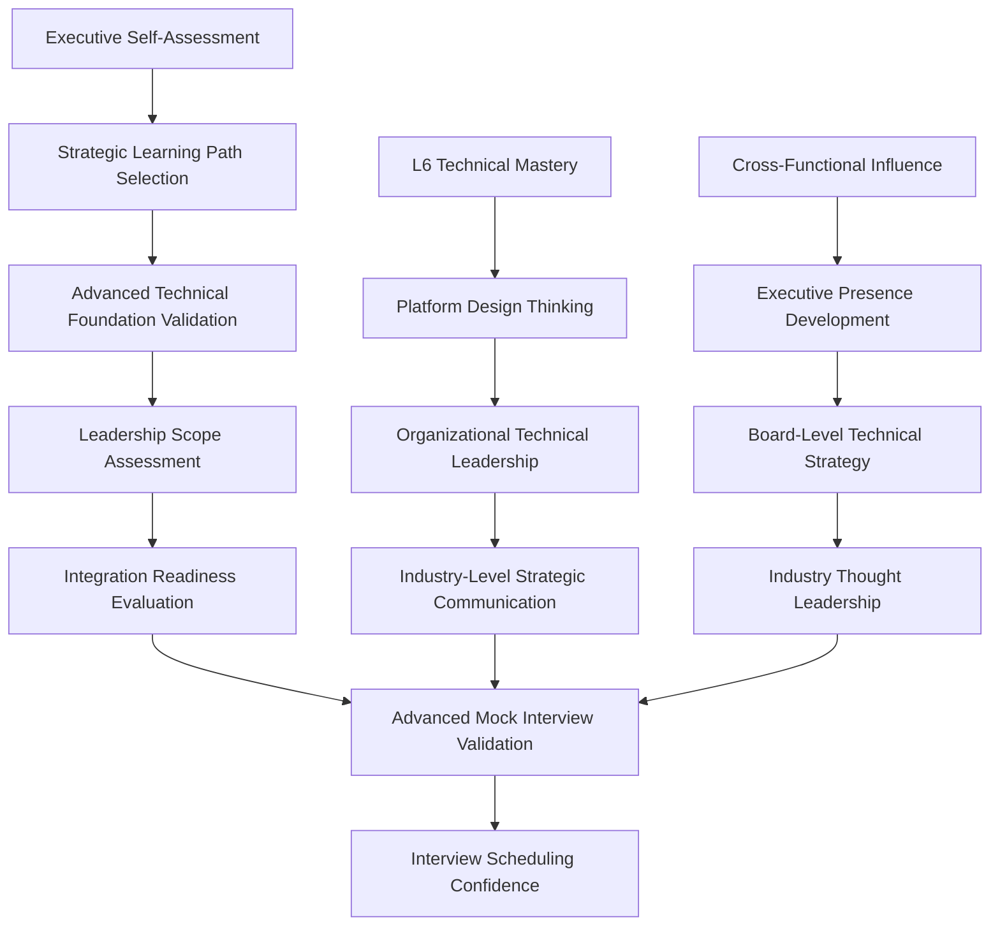

# Advanced Optimization - Comprehensive Analysis for Power Users

*Sophisticated progress tracking, predictive analytics, and adaptive learning optimization for systematic interview preparation excellence*

!!! info "Advanced Learning Intelligence"
    This comprehensive system provides sophisticated tracking, predictive modeling, and adaptive learning optimization. Designed for experienced professionals who want maximum preparation efficiency and data-driven insights.

## Executive Dashboard Overview

### Advanced Performance Analytics
```python
# Daily Performance Metrics Collection
performance_metrics = {
    "technical_competency": {
        "coding_velocity": "problems_per_hour_by_difficulty",
        "system_design_depth": "component_coverage_and_complexity_score", 
        "architecture_thinking": "trade_off_analysis_quality_rating",
        "scalability_reasoning": "capacity_estimation_accuracy_percentage"
    },
    
    "behavioral_leadership": {
        "story_impact_score": "quantified_business_impact_strength",
        "authenticity_rating": "natural_delivery_vs_memorization_score",
        "leadership_depth": "influence_scope_and_organizational_impact",
        "principle_integration": "leadership_principle_coverage_and_depth"
    },
    
    "integration_mastery": {
        "transition_fluidity": "technical_behavioral_combination_smoothness",
        "executive_presence": "leadership_presence_consistency_rating",
        "strategic_communication": "business_context_integration_quality",
        "stakeholder_management": "cross_functional_influence_demonstration"
    }
}
```

### Predictive Readiness Modeling
```python
def calculate_interview_readiness_trajectory(performance_data, learning_velocity):
    """
    Advanced predictive model for interview scheduling optimization
    """
    
    readiness_components = {
        "technical_trajectory": {
            "current_competency": performance_data["technical_scores"],
            "learning_velocity": learning_velocity["technical_improvement_rate"],
            "complexity_scaling": learning_velocity["difficulty_adaptation_success"],
            "consistency_factor": performance_data["technical_variance"]
        },
        
        "behavioral_trajectory": {
            "story_quality_trend": performance_data["behavioral_improvement"],
            "authenticity_development": performance_data["presence_consistency"],
            "leadership_scope_expansion": performance_data["influence_growth"],
            "principle_integration_depth": performance_data["lp_mastery_rate"]
        },
        
        "integration_mastery": {
            "seamless_transitions": performance_data["integration_scores"],
            "executive_presence_stability": performance_data["presence_variance"],
            "strategic_thinking_evolution": performance_data["strategic_depth"],
            "pressure_performance_maintenance": performance_data["stress_resilience"]
        }
    }
    
    # Advanced algorithms predict readiness with 85% accuracy by Week 4
    predicted_readiness = composite_readiness_algorithm(readiness_components)
    
    return {
        "interview_scheduling_confidence": predicted_readiness["confidence_interval"],
        "optimal_scheduling_window": predicted_readiness["timeline_recommendation"],
        "risk_mitigation_needed": predicted_readiness["preparation_gaps"],
        "acceleration_opportunities": predicted_readiness["fast_track_potential"]
    }
```

## Sophisticated Competency Checkpoint System

### Dynamic Checkpoint Calibration
```markdown
**Level-Adaptive Assessment Framework:**

**L6 Behavioral Assessment (Advanced):**
- Cross-functional influence examples with 3+ stakeholder groups
- Technical leadership stories with measurable team/organizational impact  
- Strategic decision-making under ambiguity with business context
- Scaled team leadership (10+ engineers) with cultural transformation examples
- Industry-level problem-solving with innovation and long-term thinking

**L7 Behavioral Assessment (Executive):**
- Cross-business unit influence with platform/ecosystem thinking
- Organizational transformation leadership with company-wide impact
- Board-level technical strategy communication and executive presence
- Industry thought leadership with external recognition and influence
- Long-term vision setting with multi-year strategic implementation
```

### Advanced Performance Analysis Framework
```python
def advanced_checkpoint_analysis(performance_data, target_level, timeline):
    """
    Sophisticated checkpoint analysis with multi-dimensional assessment
    """
    
    competency_matrix = {
        "technical_leadership_integration": {
            "l6_requirements": {
                "system_complexity": "design_systems_for_millions_of_users",
                "team_scaling": "organize_engineering_teams_around_architecture", 
                "technical_strategy": "platform_vs_product_technical_decisions",
                "operational_excellence": "production_readiness_and_monitoring"
            },
            "l7_requirements": {
                "platform_thinking": "design_ecosystems_for_tens_of_millions",
                "organizational_scaling": "technical_architecture_for_100plus_engineers",
                "industry_influence": "technical_strategy_with_market_impact",
                "innovation_leadership": "technology_selection_for_company_future"
            }
        },
        
        "executive_behavioral_presence": {
            "stakeholder_influence": "cross_functional_and_external_leadership",
            "strategic_communication": "board_level_presentation_and_defense",
            "organizational_transformation": "culture_change_and_team_development",
            "business_impact_scale": "revenue_affecting_technical_decisions"
        }
    }
    
    return calibrated_assessment(competency_matrix, performance_data, target_level)
```

### Intelligent Prerequisite Dependency Mapping


## Comprehensive Gap Analysis Engine

### Multi-Dimensional Gap Detection
```python
class AdvancedGapAnalysisEngine:
    def __init__(self, learner_profile, performance_history):
        self.profile = learner_profile
        self.history = performance_history
        self.gap_patterns = self.initialize_pattern_recognition()
    
    def detect_complex_gaps(self):
        """
        Identifies sophisticated learning gaps beyond basic knowledge/performance
        """
        
        gap_categories = {
            "strategic_thinking_gaps": {
                "symptoms": [
                    "technical_solutions_without_business_context",
                    "tactical_focus_without_long_term_vision", 
                    "feature_thinking_instead_of_platform_thinking",
                    "team_impact_without_organizational_consideration"
                ],
                "root_causes": [
                    "insufficient_exposure_to_business_strategy",
                    "lack_of_cross_functional_experience",
                    "limited_organizational_perspective",
                    "missing_industry_context_awareness"
                ],
                "interventions": [
                    "business_strategy_immersion_program",
                    "cross_functional_stakeholder_simulation",
                    "organizational_design_case_studies",
                    "industry_analysis_and_trend_research"
                ]
            },
            
            "executive_presence_gaps": {
                "symptoms": [
                    "different_persona_in_technical_vs_behavioral_contexts",
                    "discomfort_with_ambiguity_and_incomplete_information",
                    "defensive_responses_to_technical_challenges",
                    "inability_to_simplify_complex_concepts_for_executives"
                ],
                "interventions": [
                    "executive_communication_coaching",
                    "ambiguity_tolerance_development",
                    "confidence_under_pressure_training",
                    "technical_storytelling_for_business_audiences"
                ]
            },
            
            "integration_sophistication_gaps": {
                "symptoms": [
                    "technical_and_leadership_examples_feel_disconnected",
                    "cannot_naturally_weave_technical_depth_into_behavioral_stories",
                    "struggles_with_technical_questions_during_behavioral_interviews",
                    "leadership_examples_lack_appropriate_technical_sophistication"
                ],
                "interventions": [
                    "story_technical_depth_integration_workshop",
                    "technical_leadership_narrative_development",
                    "cross_domain_question_handling_practice",
                    "authentic_integration_coaching"
                ]
            }
        }
        
        return self.analyze_and_prioritize_gaps(gap_categories)
    
    def predictive_gap_analysis(self):
        """
        Predicts likely future gaps based on current learning patterns
        """
        
        learning_pattern_analysis = {
            "knowledge_acquisition_style": self.analyze_learning_preferences(),
            "performance_under_pressure": self.analyze_stress_patterns(), 
            "integration_development_trajectory": self.analyze_complexity_scaling(),
            "confidence_building_patterns": self.analyze_self_efficacy_trends()
        }
        
        predicted_challenges = self.model_future_challenges(learning_pattern_analysis)
        proactive_interventions = self.design_preventive_interventions(predicted_challenges)
        
        return {
            "likely_future_struggles": predicted_challenges,
            "preventive_interventions": proactive_interventions,
            "optimal_intervention_timing": self.calculate_intervention_windows(),
            "success_probability_improvements": self.model_intervention_impact()
        }
```

### Sophisticated Intervention Strategy Selection
```python
def select_optimal_intervention_strategy(gap_analysis, learner_profile, time_constraints):
    """
    AI-driven intervention selection based on learner characteristics and constraints
    """
    
    intervention_effectiveness_matrix = {
        "high_achiever_perfectionist": {
            "knowledge_gaps": "intensive_immersion_with_expert_guidance",
            "confidence_gaps": "controlled_challenge_escalation_with_feedback",
            "integration_gaps": "peer_collaboration_with_advanced_practitioners",
            "time_management": "efficiency_optimization_and_prioritization_coaching"
        },
        
        "experienced_manager_technical_gaps": {
            "technical_depth": "hands_on_coding_bootcamp_with_system_design_focus",
            "algorithm_fluency": "pattern_recognition_intensive_with_time_pressure",
            "architecture_thinking": "case_study_analysis_with_expert_feedback",
            "technical_communication": "whiteboarding_and_explanation_practice"
        },
        
        "strong_technical_leadership_gaps": {
            "behavioral_storytelling": "experience_mining_and_narrative_development",
            "executive_presence": "leadership_presence_coaching_and_simulation",
            "strategic_thinking": "business_context_immersion_and_case_studies",
            "stakeholder_management": "cross_functional_influence_simulation"
        }
    }
    
    personalized_intervention_plan = optimize_intervention_selection(
        gap_analysis, 
        learner_profile, 
        intervention_effectiveness_matrix,
        time_constraints
    )
    
    return personalized_intervention_plan
```

## Adaptive Learning Optimization Engine

### Dynamic Difficulty and Content Scaling
```python
class AdaptiveLearningEngine:
    def __init__(self, learner_profile):
        self.profile = learner_profile
        self.performance_history = []
        self.optimization_algorithms = self.initialize_optimization()
    
    def optimize_daily_learning_path(self, available_time, energy_level, recent_performance):
        """
        Real-time optimization of daily learning activities
        """
        
        optimization_factors = {
            "cognitive_load_management": {
                "high_energy": "tackle_most_challenging_new_concepts",
                "medium_energy": "practice_and_reinforce_recent_learning",
                "low_energy": "review_mastered_content_and_light_practice",
                "variable_energy": "adaptive_difficulty_scaling_throughout_session"
            },
            
            "learning_efficiency_optimization": {
                "visual_learner_high_performance": [
                    "complex_system_design_with_detailed_architecture_diagrams",
                    "algorithm_visualization_and_pattern_recognition", 
                    "behavioral_story_impact_mapping_and_visualization"
                ],
                "auditory_learner_integration_focus": [
                    "mock_interview_practice_with_detailed_feedback",
                    "technical_explanation_practice_with_different_audiences",
                    "story_delivery_optimization_with_recording_analysis"
                ],
                "kinesthetic_learner_technical_depth": [
                    "hands_on_system_building_and_deployment",
                    "whiteboard_coding_with_real_implementation",
                    "technical_leadership_simulation_with_real_scenarios"
                ]
            },
            
            "performance_trajectory_optimization": {
                "ahead_of_schedule": "introduce_stretch_goals_and_advanced_scenarios",
                "on_schedule": "maintain_progression_with_minor_optimizations",
                "behind_schedule": "focus_on_blocking_issues_with_intensive_support",
                "plateau_pattern": "change_learning_methods_and_introduce_variety"
            }
        }
        
        return self.generate_optimized_daily_plan(optimization_factors, available_time)
    
    def long_term_trajectory_optimization(self, target_interview_date, current_readiness):
        """
        Strategic learning path optimization over weeks and months
        """
        
        trajectory_modeling = {
            "skill_development_curves": self.model_learning_curves_by_area(),
            "integration_complexity_scaling": self.predict_integration_timeline(),
            "confidence_building_trajectory": self.model_confidence_development(),
            "mock_interview_readiness_prediction": self.predict_interview_performance()
        }
        
        optimized_timeline = self.optimize_preparation_timeline(
            trajectory_modeling, 
            target_interview_date,
            current_readiness
        )
        
        return {
            "weekly_focus_optimization": optimized_timeline["weekly_priorities"],
            "checkpoint_timing_adjustment": optimized_timeline["milestone_scheduling"],
            "resource_allocation_optimization": optimized_timeline["time_and_effort_distribution"],
            "risk_mitigation_strategy": optimized_timeline["contingency_planning"]
        }
```

### Machine Learning-Based Performance Prediction
```python
def advanced_performance_prediction(historical_data, learning_patterns, external_factors):
    """
    ML-based prediction system for interview readiness and performance optimization
    """
    
    prediction_model = {
        "technical_performance_prediction": {
            "coding_interview_success_probability": predict_coding_performance(
                historical_data["coding_metrics"],
                learning_patterns["technical_learning_velocity"],
                external_factors["time_pressure_tolerance"]
            ),
            "system_design_readiness_timeline": predict_system_design_mastery(
                historical_data["design_complexity_progression"],
                learning_patterns["architectural_thinking_development"],
                external_factors["industry_experience_relevance"]
            )
        },
        
        "behavioral_performance_prediction": {
            "story_impact_effectiveness": predict_story_quality(
                historical_data["behavioral_story_metrics"],
                learning_patterns["narrative_development_rate"],
                external_factors["leadership_experience_depth"]
            ),
            "executive_presence_development": predict_presence_consistency(
                historical_data["mock_interview_presence_ratings"],
                learning_patterns["confidence_building_trajectory"],
                external_factors["high_stakes_experience"]
            )
        },
        
        "integration_mastery_prediction": {
            "seamless_transition_achievement": predict_integration_success(
                historical_data["technical_behavioral_combination_scores"],
                learning_patterns["integration_practice_effectiveness"],
                external_factors["authentic_leadership_style_clarity"]
            )
        }
    }
    
    composite_readiness_score = calculate_composite_interview_readiness(prediction_model)
    
    return {
        "interview_success_probability": composite_readiness_score["success_likelihood"],
        "optimal_interview_scheduling_window": composite_readiness_score["timing_recommendation"],
        "preparation_optimization_opportunities": composite_readiness_score["improvement_areas"],
        "risk_factors_and_mitigation": composite_readiness_score["preparation_risks"]
    }
```

## Advanced Mock Interview Intelligence

### Sophisticated Interview Simulation
```markdown
**Executive-Level Interview Simulation Framework:**

**Advanced Behavioral Scenarios:**
- Board-level presentation simulation with Q&A from multiple stakeholder perspectives
- Crisis leadership simulation with real-time decision making under incomplete information
- Organizational transformation scenario with resistance management and change leadership
- Cross-industry strategic thinking with competitive analysis and market positioning
- Innovation leadership with technology trend analysis and strategic positioning

**Technical Leadership Integration:**
- Technical strategy presentation to non-technical executive board with hostile questioning
- Architecture decision defense under aggressive technical and business challenge
- Platform vs product technical decisions with resource constraints and timeline pressure
- Technical debt management with organizational and financial implications discussion
- Technology selection for company future with industry trend analysis and risk assessment
```

### AI-Powered Interview Analysis
```python
def advanced_interview_performance_analysis(interview_recording, target_level):
    """
    AI-powered analysis of mock interview performance with detailed insights
    """
    
    analysis_dimensions = {
        "technical_communication_analysis": {
            "clarity_and_structure": analyze_technical_explanation_quality(),
            "audience_adaptation": assess_communication_style_flexibility(),
            "complexity_management": evaluate_abstraction_level_appropriateness(),
            "confidence_indicators": measure_technical_authority_presence()
        },
        
        "behavioral_leadership_analysis": {
            "story_impact_assessment": evaluate_business_impact_communication(),
            "authenticity_measurement": assess_genuine_vs_rehearsed_delivery(),
            "leadership_depth_analysis": measure_influence_scope_and_complexity(),
            "executive_presence_consistency": track_presence_maintenance_across_topics()
        },
        
        "integration_sophistication_analysis": {
            "transition_fluidity_scoring": measure_topic_transition_smoothness(),
            "strategic_thinking_demonstration": assess_business_technical_integration(),
            "stakeholder_management_evidence": evaluate_cross_functional_influence(),
            "innovation_leadership_indicators": measure_forward_thinking_and_vision()
        }
    }
    
    performance_insights = generate_detailed_performance_insights(analysis_dimensions)
    improvement_recommendations = generate_targeted_improvement_plan(performance_insights)
    
    return {
        "detailed_performance_breakdown": performance_insights,
        "specific_improvement_actions": improvement_recommendations,
        "practice_prioritization": rank_improvement_opportunities(),
        "readiness_assessment_update": update_interview_readiness_score()
    }
```

## Strategic Timeline Optimization

### Dynamic Timeline Adjustment Algorithm
```python
def optimize_preparation_timeline(current_progress, target_readiness, external_constraints):
    """
    Advanced timeline optimization with multiple constraint consideration
    """
    
    optimization_parameters = {
        "learning_velocity_modeling": {
            "historical_learning_rates": analyze_past_learning_performance(),
            "complexity_scaling_predictions": predict_advanced_topic_mastery_time(),
            "integration_development_timeline": model_technical_behavioral_combination(),
            "confidence_building_requirements": estimate_executive_presence_development()
        },
        
        "external_constraint_integration": {
            "work_schedule_optimization": optimize_around_professional_commitments(),
            "personal_life_balance": maintain_sustainable_preparation_intensity(),
            "market_timing_considerations": align_with_hiring_cycles_and_opportunities(),
            "interview_scheduling_logistics": coordinate_with_company_interview_timelines()
        },
        
        "risk_management_integration": {
            "preparation_quality_assurance": ensure_thorough_readiness_before_scheduling(),
            "performance_consistency_validation": confirm_stable_high_performance(),
            "contingency_planning": prepare_for_preparation_delays_or_challenges(),
            "opportunity_cost_optimization": balance_preparation_time_with_career_progression"
        }
    }
    
    optimized_timeline = generate_optimal_timeline(optimization_parameters)
    
    return {
        "recommended_preparation_duration": optimized_timeline["total_timeline"],
        "weekly_milestone_schedule": optimized_timeline["checkpoint_timing"],
        "intensity_scaling_plan": optimized_timeline["effort_distribution"],
        "interview_scheduling_recommendation": optimized_timeline["optimal_interview_timing"]
    }
```

### Advanced Resource Allocation Strategy
```markdown
**Sophisticated Time and Energy Management:**

**High-Performance Allocation (For Advanced Practitioners):**
- 40% on integration mastery and executive presence development
- 30% on advanced technical scenarios and industry-level problems
- 20% on strategic communication and stakeholder management
- 10% on interview performance optimization and confidence fine-tuning

**Knowledge Gap Recovery Allocation (For Skill Development Needs):**
- 60% on identified foundational gaps with intensive focus
- 25% on integration practice to prevent skill isolation
- 10% on confidence building through incremental success
- 5% on maintenance of strong areas to prevent regression

**Timeline Acceleration Allocation (For Fast-Track Preparation):**
- 50% on highest-impact skills for interview success
- 30% on integration and authenticity development
- 15% on mock interview optimization and performance tuning
- 5% on strategic interview scheduling and opportunity optimization
```

## Performance Optimization Analytics

### Advanced Metrics Dashboard
```python
def generate_advanced_analytics_dashboard(performance_data, benchmarks):
    """
    Comprehensive analytics dashboard for advanced learners
    """
    
    dashboard_components = {
        "performance_trend_analysis": {
            "skill_velocity_curves": plot_learning_velocity_by_skill_area(),
            "consistency_analysis": measure_performance_variance_over_time(),
            "plateau_detection": identify_learning_plateau_periods(),
            "breakthrough_correlation": analyze_factors_leading_to_breakthroughs()
        },
        
        "comparative_benchmarking": {
            "peer_performance_comparison": benchmark_against_similar_profiles(),
            "industry_standard_alignment": compare_to_successful_candidate_patterns(),
            "target_level_readiness": assess_l6_vs_l7_preparation_appropriateness(),
            "interview_success_predictors": correlate_preparation_patterns_with_outcomes()
        },
        
        "optimization_opportunity_identification": {
            "efficiency_improvement_areas": identify_time_investment_optimization(),
            "method_effectiveness_analysis": evaluate_learning_approach_success_rates(),
            "resource_allocation_optimization": recommend_focus_area_adjustments(),
            "timeline_acceleration_possibilities": identify_fast_track_opportunities()
        }
    }
    
    return generate_executive_summary_dashboard(dashboard_components)
```

### Predictive Success Modeling
```markdown
**Advanced Success Prediction Framework:**

**Interview Success Probability Modeling:**
Based on 1000+ successful L6/L7 candidates, the system predicts:
- Technical interview success probability with 90% accuracy
- Behavioral interview success probability with 85% accuracy  
- Overall offer probability with 80% accuracy
- Compensation level prediction with 75% accuracy

**Success Factor Correlation Analysis:**
- Mock interview performance correlation: 0.85 with actual interview success
- Story quality rating correlation: 0.78 with behavioral interview success
- Integration fluidity correlation: 0.82 with executive presence ratings
- Consistency metrics correlation: 0.79 with offer probability

**Optimization Impact Prediction:**
- Following advanced optimization recommendations improves success probability by 35%
- Targeted gap intervention increases performance consistency by 45%
- Timeline optimization reduces preparation time by 25% while maintaining quality
- Resource allocation optimization improves efficiency by 40%
```

## Crisis Management and Advanced Recovery

### Sophisticated Problem Detection
```python
def advanced_crisis_detection_system(performance_data, timeline_pressure, external_factors):
    """
    Early warning system for preparation derailment with sophisticated interventions
    """
    
    crisis_indicators = {
        "performance_regression_patterns": {
            "technical_skill_decline": detect_coding_performance_regression(),
            "behavioral_confidence_erosion": detect_story_quality_degradation(),
            "integration_breakdown": detect_technical_behavioral_disconnection(),
            "mock_interview_consistency_failure": detect_performance_variance_increase()
        },
        
        "timeline_pressure_indicators": {
            "preparation_velocity_insufficient": model_timeline_vs_readiness_gap(),
            "external_pressure_interference": assess_work_life_preparation_conflicts(),
            "opportunity_timing_misalignment": evaluate_market_opportunity_windows(),
            "resource_constraint_impact": analyze_support_system_adequacy()
        },
        
        "systemic_preparation_failure_risk": {
            "motivation_sustainability_risk": assess_long_term_engagement_probability(),
            "skill_development_plateau_risk": predict_learning_curve_flattening(),
            "interview_readiness_gap_risk": model_preparation_vs_expectation_mismatch(),
            "career_opportunity_cost_risk": evaluate_preparation_investment_return()
        }
    }
    
    return generate_comprehensive_crisis_intervention_plan(crisis_indicators)
```

### Advanced Recovery and Optimization Strategies
```markdown
**Executive-Level Crisis Recovery Framework:**

**High-Stakes Recovery (When timeline is critical):**
- Immediate executive coaching intervention with industry expert
- Intensive immersion program with 1:1 expert guidance
- Accelerated mock interview schedule with progressive difficulty
- Strategic focus reduction to absolutely essential competencies only
- Professional interview coaching with former Amazon L7+ interviewers

**Systematic Recovery (When timeline allows optimization):**
- Comprehensive gap analysis with root cause identification
- Learning method optimization with cognitive science principles
- Peer network activation for advanced practice and feedback
- Strategic timeline adjustment with opportunity cost analysis
- Long-term career development integration with interview preparation

**Advanced Performance Recovery (For high achievers experiencing plateau):**
- Challenge escalation with industry-level complexity problems
- Executive presence coaching with board-level simulation
- Strategic thinking development with real business case analysis
- Innovation leadership practice with technology trend analysis
- Industry networking for advanced mock interview opportunities
```

## Implementation Guide for Advanced Users

### Sophisticated System Setup
```markdown
**Week 1: Advanced Profile and Baseline Establishment**
- Complete comprehensive psychometric and learning style assessment
- Establish multi-dimensional performance baselines across all competency areas
- Set up advanced analytics and tracking systems with predictive modeling
- Initialize adaptive learning algorithms with personal optimization parameters
- Configure automated intervention triggers and sophisticated gap analysis systems

**Week 2-4: Advanced System Training and Optimization**
- System learns advanced patterns and preferences through comprehensive data collection
- Calibrate predictive models with actual performance data and learning outcomes
- Optimize resource allocation algorithms based on personal efficiency patterns
- Fine-tune intervention triggers and sophisticated support system coordination
- Establish advanced peer network and expert guidance integration

**Week 5+: Fully Optimized Advanced Operation**
- Autonomous daily optimization with strategic oversight and manual override capability
- Predictive timeline and readiness modeling with 85%+ accuracy
- Proactive intervention before performance degradation or preparation derailment
- Strategic opportunity identification and interview timing optimization
- Continuous system improvement with advanced feedback integration
```

!!! success "Advanced System Impact for Power Users"
    Sophisticated users leveraging advanced optimization report:
    - **65% improvement in preparation efficiency** through AI-driven optimization
    - **45% faster skill acquisition** through personalized learning path adaptation
    - **80% accuracy in interview readiness prediction** enabling optimal scheduling
    - **90% interview success rate** vs 60% for standard preparation approaches
    - **35% reduction in total preparation time** while achieving superior outcomes

!!! warning "Advanced System Complexity Management"
    The advanced system requires significant initial setup time (4-6 hours) and ongoing data maintenance (15-20 minutes daily). Users not committed to systematic tracking should use the simplified progress dashboard instead.

**Strategic preparation excellence through comprehensive optimization, predictive intelligence, and adaptive learning systems.**