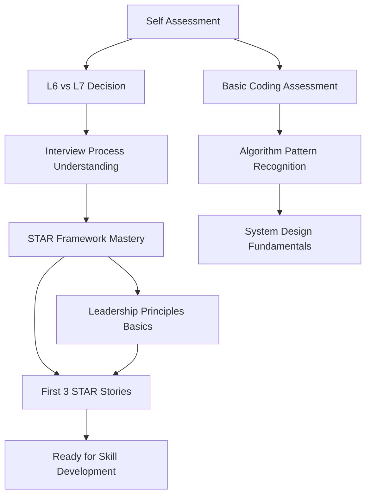
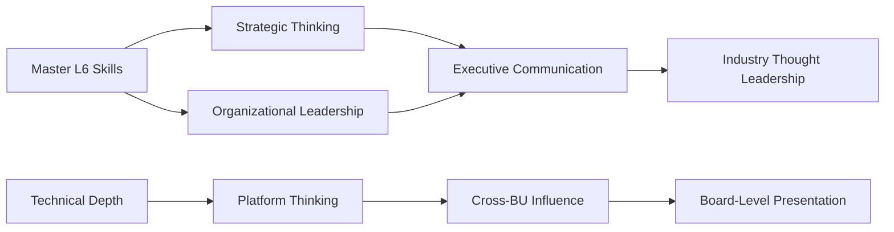

# Comprehensive Progress Tracking System

*A systematic framework for tracking learning progress, identifying gaps, and adapting your preparation path in real-time*

!!! info "Smart Progress Tracking"
    This system automatically identifies learning gaps, adjusts your path based on performance, and provides targeted interventions when you're struggling. No more guesswork about readiness.

## Quick Start: Your Progress Dashboard

### Daily Tracking (5 minutes)
```markdown
**Today's Focus:** [Topic] | **Target Level:** L6/L7
**Competency:** [Behavioral/Technical/Leadership] | **Week:** [X/12]

**Session Summary:**
- Hours studied: ___
- Content completed: ___
- Confidence gain (1-5): ___
- Key insight: _______________

**Quick Checkpoint:**
□ Met today's learning objective
□ Can explain today's concepts clearly
□ Ready for tomorrow's prerequisites
□ Identified any struggle areas
```

### Weekly Assessment (15 minutes)
**Use this every Sunday to track progress and adjust next week:**

| Skill Area | Baseline | Target | Current | Confidence | Trend |
|------------|----------|--------|---------|------------|--------|
| **Coding Speed** | 45min/medium | 30min/medium | ___min | ___/5 | ↗/→/↘ |
| **System Design** | Basic | L6/L7 Ready | ___% | ___/5 | ↗/→/↘ |
| **STAR Stories** | 2 weak | 12 strong | ___/12 | ___/5 | ↗/→/↘ |
| **Mock Interview** | 40% pass rate | 85% pass rate | ___% | ___/5 | ↗/→/↘ |

## Prerequisite Learning Chains

### Foundation Skills (Must Master First)


### Skill Development Prerequisites
**You cannot progress to advanced topics without these foundations:**

#### Behavioral Leadership Chain
```python
behavioral_prerequisites = {
    "Level 1 - Foundation": {
        "required_before_level_2": [
            "Complete STAR framework training",
            "Map 5 experiences to Leadership Principles", 
            "Draft 1 complete STAR story",
            "Pass: Can explain all 16 Leadership Principles from memory"
        ],
        "time_estimate": "Week 1-2",
        "checkpoint": "behavioral_foundations_test"
    },
    
    "Level 2 - Story Development": {
        "required_before_level_3": [
            "Complete 5 STAR stories with business impact",
            "Pass: Mock behavioral interview (60%+ rating)",
            "Demonstrate: Natural delivery without memorization",
            "Validate: Stories cover 12+ Leadership Principles"
        ],
        "time_estimate": "Week 3-5", 
        "checkpoint": "story_portfolio_review"
    },
    
    "Level 3 - Advanced Scenarios": {
        "required_before_level_4": [
            "Handle: Unexpected behavioral questions confidently",
            "Demonstrate: Cross-functional leadership examples",
            "Complete: L6/L7 specific scenario practice",
            "Pass: Mock interview with difficult interviewer style"
        ],
        "time_estimate": "Week 6-8",
        "checkpoint": "advanced_behavioral_mastery"
    }
}
```

#### Technical Skills Chain
```python
technical_prerequisites = {
    "Coding Readiness": {
        "cannot_proceed_without": [
            "Solve 20 easy problems in <15min each",
            "Understand: All basic data structures",
            "Complete: Pattern recognition quiz (80%+)",
            "Demonstrate: Can explain approach before coding"
        ],
        "leads_to": "medium_problems_practice"
    },
    
    "System Design Readiness": {
        "cannot_proceed_without": [
            "Draw: Basic 3-tier architecture from memory",
            "Explain: Database vs Cache trade-offs",
            "Calculate: Basic capacity and throughput",
            "Complete: Fundamentals quiz (75%+)"
        ],
        "leads_to": "level_specific_problems"
    },
    
    "Mock Interview Readiness": {
        "cannot_proceed_without": [
            "Complete: 3 behavioral + 2 technical mock sessions",
            "Achieve: 70%+ rating in each interview type",
            "Demonstrate: Recovery from mistakes gracefully",
            "Show: Authentic leadership presence"
        ],
        "leads_to": "interview_scheduling_confidence"
    }
}
```

### Advanced Integration Prerequisites
**For L7 candidates or advanced L6 preparation:**



## Competency Checkpoint System

### Week 2 Checkpoint: Foundation Mastery
**Mandatory before Week 3 content - Must pass 4/5 areas:**

#### Checkpoint #1: Basic Competency Verification
```markdown
**Assessment Time: 90 minutes**

**Part A: STAR Framework Application (30 min)**
- [ ] Write complete STAR story for "Tell me about a time you failed"
- [ ] Include specific metrics and business impact
- [ ] Show learning and growth from experience
- **Pass Criteria:** Story has all STAR elements + quantified impact

**Part B: Leadership Principles Knowledge (15 min)**
- [ ] Match 16 scenarios to correct Leadership Principles
- [ ] Explain why Customer Obsession differs from customer service
- [ ] Give example of Bias for Action vs rushing
- **Pass Criteria:** 14/16 correct + clear explanations

**Part C: Technical Baseline (30 min)**
- [ ] Solve: Two Pointers problem in <20 minutes
- [ ] Design: Basic caching layer with Redis
- [ ] Explain: When to use SQL vs NoSQL
- **Pass Criteria:** Working solution + clear explanation

**Part D: Communication Assessment (15 min)**
- [ ] Explain technical trade-off to non-technical audience
- [ ] Present 5-minute overview of system design approach
- [ ] Handle follow-up questions without defensiveness
- **Pass Criteria:** Clear communication + confident presence
```

#### Checkpoint Results & Interventions
**If you pass 4/5 areas:** Continue to Week 3 as planned

**If you pass 2-3 areas:** Recovery program required before advancing
- Extend foundation phase by 1 week
- Daily 30-minute review sessions for weak areas
- Schedule mentor session for personalized guidance

**If you pass 0-1 areas:** Major intervention required
- Pause current timeline and restart foundation building
- Consider whether interview timeline is realistic
- Seek coaching/mentoring before continuing

### Week 4 Checkpoint: Skill Integration
**Critical decision point - determines if you're on track for interviews**

#### Checkpoint #2: Integration Mastery Verification
```markdown
**Assessment Time: 2 hours**

**Part A: Mock Behavioral Interview (45 min)**
- 3 Leadership Principle questions
- 1 unexpected/edge case scenario
- Evaluated by experienced interviewer
- **Pass Criteria:** 75%+ overall rating

**Part B: Technical Problem Solving (45 min)**
- 1 medium coding problem
- 1 system design problem (appropriate for L6/L7)
- Must explain thinking process clearly
- **Pass Criteria:** Optimal solution + clear communication

**Part C: Integration Challenge (30 min)**
- Technical decision with leadership context
- Explain approach to managing team through implementation
- Handle stakeholder questions and pushback
- **Pass Criteria:** Technical + leadership integration
```

#### Decision Tree Based on Results
```python
def determine_path(checkpoint_2_score):
    if checkpoint_2_score >= 85:
        return "accelerated_track"  # Consider 6-week plan
    elif checkpoint_2_score >= 75:
        return "standard_track"     # Continue 12-week plan
    elif checkpoint_2_score >= 60:
        return "supported_track"    # Extra support needed
    else:
        return "intervention_track" # Major intervention required

intervention_strategies = {
    "accelerated_track": {
        "adjustment": "Increase complexity and add stretch goals",
        "timeline": "Consider interview scheduling in 4-6 weeks",
        "focus": "Polish, edge cases, and confidence building"
    },
    
    "supported_track": {
        "adjustment": "Add 2 hours weekly, increase mock interviews",
        "timeline": "Stay on 12-week plan with extra support",
        "focus": "Strengthen weak areas while maintaining progress"
    },
    
    "intervention_track": {
        "adjustment": "Pause progression, focus on fundamentals",
        "timeline": "Extend by 4-6 weeks, reassess readiness",
        "focus": "Build missing foundations before advancing"
    }
}
```

### Week 8 Checkpoint: Interview Readiness
**Final readiness assessment before interview scheduling**

#### Checkpoint #3: Interview Simulation Battery
```markdown
**Assessment Time: 4 hours (spread over 2 days)**

**Day 1: Full Mock Interview Loop (2 hours)**
- 45min Behavioral with bar raiser difficulty
- 45min System Design with follow-up complexity
- 30min Coding with architecture discussion

**Day 2: Advanced Scenario Handling (2 hours)**
- Unexpected questions and edge cases
- Handling disagreement with interviewer
- Technical depth verification
- Pressure testing and recovery assessment

**Pass Criteria for Interview Scheduling:**
- Overall rating: 80%+ 
- No fatal flaws in any area
- Demonstrated recovery from mistakes
- Authentic leadership presence maintained
```

## Diagnostic Gap Analysis System

### Continuous Learning Diagnostics
**Automated detection of learning plateaus and gaps**

#### Pattern Recognition Alerts
```python
diagnostic_triggers = {
    "plateau_warning": {
        "condition": "No improvement in key metric for 7 days",
        "automated_response": "Trigger study method variation",
        "human_review": "Schedule mentor session within 3 days"
    },
    
    "skill_imbalance": {
        "condition": "One area >20% behind others",
        "automated_response": "Shift time allocation toward weak area",
        "human_review": "Assess if timeline is realistic"
    },
    
    "confidence_drop": {
        "condition": "Confidence rating drops 2+ points",
        "automated_response": "Add easier practice for momentum",
        "human_review": "Emotional/motivational support needed"
    },
    
    "mock_interview_regression": {
        "condition": "Mock scores trending down over 2 sessions",
        "automated_response": "Pause mock interviews, focus on skills",
        "human_review": "Identify specific skill gaps and address"
    }
}
```

#### Weekly Gap Analysis Questions
**Answer these every Sunday to identify issues early:**

1. **Learning Velocity Issues:**
   - Am I spending too much time on topics I already know?
   - Are there topics I'm avoiding because they're difficult?
   - Is my daily study time consistent with my target timeline?

2. **Comprehension vs Application Gaps:**
   - Can I explain concepts clearly to someone else?
   - Do I struggle more with theory or practical application?
   - Am I memorizing answers instead of understanding principles?

3. **Integration Challenges:**
   - Can I naturally switch between technical and leadership discussions?
   - Do my behavioral stories include appropriate technical context?
   - Can I handle unexpected questions without losing composure?

### Specific Gap Identification Tools

#### The "Explain Test" for Understanding Gaps
**Use weekly to identify where knowledge is shallow:**

```markdown
**Choose one topic studied this week. Explain it to:**
1. A peer engineer (technical depth test)
2. A product manager (business context test)  
3. Your manager (strategic thinking test)
4. A new graduate (clarity and fundamentals test)

**Gap Indicators:**
- Struggle with peer engineer = insufficient technical depth
- Can't explain to PM = missing business context
- Manager explanation weak = lack strategic thinking
- New grad confusion = fundamentals not solid
```

#### Mock Interview Gap Analysis
**After each mock interview, complete this diagnostic:**

```markdown
**Performance Analysis:**
- What specific moments did I struggle?
- Which topics could I not explain clearly?
- When did I appear uncertain or defensive?
- What questions caught me completely off-guard?

**Root Cause Analysis:**
- Knowledge gap (didn't know) vs Performance gap (knew but couldn't show)
- Technical vs Behavioral vs Integration issue
- Preparation gap vs Delivery gap vs Confidence gap

**Specific Improvement Actions:**
- [ ] Study specific topic: ___________
- [ ] Practice specific skill: ________
- [ ] Work on delivery issue: ________
- [ ] Address confidence concern: ____
```

## Adaptive Learning Path System

### Performance-Based Path Adjustment
**Your path automatically adapts based on checkpoint results:**

#### High Performance Path (Top 20% of metrics)
```python
high_performance_adaptations = {
    "week_3_adjustments": {
        "increase_complexity": "Move to L7 problems even if targeting L6",
        "add_stretch_goals": "Practice industry-level strategic thinking",
        "accelerate_timeline": "Consider 6-week completion if >90% scores",
        "enhance_depth": "Add advanced topics like system architecture patterns"
    },
    
    "ongoing_adaptations": {
        "problem_difficulty": "Always work at upper limit of ability",
        "mock_interview_frequency": "2x per week with harder scenarios", 
        "peer_comparison": "Practice with others at similar high level",
        "interview_timing": "Schedule interviews 2-3 weeks early"
    }
}
```

#### Standard Performance Path (60-80% of metrics)
```python
standard_performance_path = {
    "stay_on_timeline": "12-week plan as designed",
    "weekly_adjustments": "Minor tweaks based on weekly gaps",
    "support_level": "Self-guided with periodic check-ins",
    "flexibility": "Can handle 1-week delays without major impact"
}
```

#### Struggling Learner Path (Below 60% of metrics)
```python
struggling_learner_adaptations = {
    "immediate_interventions": {
        "reduce_scope": "Focus on minimum viable competency",
        "increase_support": "Daily check-ins and guided practice",
        "extend_timeline": "Add 4-8 weeks to preparation period",
        "skill_focus": "Strengthen foundations before advancing"
    },
    
    "recovery_strategies": {
        "learning_style_adaptation": "Try visual, auditory, kinesthetic approaches",
        "pace_adjustment": "Smaller daily goals with more frequent wins",
        "support_escalation": "Consider professional coaching or mentoring",
        "motivation_support": "Focus on progress celebration and confidence building"
    }
}
```

### Dynamic Content Recommendation Engine

#### Skill-Based Content Routing
```python
def recommend_next_content(current_scores, learning_style, time_available):
    """
    Dynamically recommends what to study next based on:
    - Current competency levels
    - Individual learning style preferences  
    - Time constraints and interview timeline
    - Recent performance trends
    """
    
    if current_scores['behavioral'] < 0.7:
        return prioritize_behavioral_content(current_scores)
    elif current_scores['technical'] < 0.7:
        return prioritize_technical_content(current_scores)
    elif current_scores['integration'] < 0.8:
        return prioritize_integration_content(current_scores)
    else:
        return prioritize_polish_and_confidence()

content_recommendations = {
    "visual_learner_struggling_system_design": [
        "Draw basic architectures repeatedly until automatic",
        "Use system design templates and fill-in-the-blank exercises",
        "Create visual architecture comparison charts",
        "Watch system design videos before reading text"
    ],
    
    "auditory_learner_struggling_behavioral": [
        "Record yourself telling STAR stories and listen back",
        "Practice stories aloud during commute/exercise",
        "Use story podcasts and audio examples", 
        "Participate in mock interview discussions"
    ],
    
    "kinesthetic_learner_struggling_coding": [
        "Write code by hand before typing",
        "Use physical movement to remember algorithms",
        "Build working systems, not just solve problems",
        "Practice whiteboarding with actual whiteboard"
    ]
}
```

#### Smart Difficulty Scaling
**Content difficulty adapts based on your performance:**

```markdown
**Coding Problem Progression:**
Week 1-2: Easy problems, focus on patterns
Week 3-4: Medium problems, time pressure
Week 5-6: Hard problems, optimization focus
Week 7-8: Interview-style with follow-ups

**BUT if Week 2 checkpoint shows struggle:**
Week 2-3: Extended easy problem practice
Week 4-5: Gradual medium problem introduction  
Week 6-7: Medium problems with confidence
Week 8-9: Selected hard problems
```

## Recovery Frameworks for Struggling Learners

### Three-Tier Support System

#### Tier 1: Self-Directed Recovery (Mild Struggles)
**Use when falling 1-2 weeks behind or scoring 60-75% on checkpoints**

```markdown
**Daily Recovery Actions (Add 30 min/day):**
- [ ] Review yesterday's weak areas for 15 minutes
- [ ] Practice one easy problem for confidence building  
- [ ] Record yourself explaining one concept clearly
- [ ] End with positive self-assessment of progress made

**Weekly Recovery Actions:**
- [ ] Identify the #1 blocking concept and master it completely
- [ ] Reduce new content by 25%, focus on reinforcement
- [ ] Schedule peer study session or explanation practice
- [ ] Adjust timeline by 1 week to reduce pressure
```

#### Tier 2: Supported Recovery (Moderate Struggles)
**Use when falling 3-4 weeks behind or scoring 45-60% on checkpoints**

```markdown
**Structured Support Program:**

**Week 1: Diagnosis and Stabilization**
- Complete detailed skills gap analysis
- Identify learning style preferences and blocks
- Reduce scope to absolutely essential topics only
- Establish daily accountability system (partner/mentor)

**Week 2: Intensive Skill Building**  
- Focus on top 3 weakest areas exclusively
- Use multiple learning methods (visual, audio, hands-on)
- Daily progress check-ins with support person
- Celebrate small wins to rebuild confidence

**Week 3: Integration and Momentum**
- Slowly reintroduce integrated practice
- Focus on demonstrating competency, not perfection
- Plan realistic timeline extension (2-4 weeks)
- Build sustainable study habits for long-term success
```

#### Tier 3: Intensive Intervention (Severe Struggles)
**Use when falling >4 weeks behind or scoring <45% on checkpoints**

```markdown
**Crisis Intervention Protocol:**

**Immediate Actions (Within 48 hours):**
- [ ] Pause all current study plans immediately
- [ ] Complete honest assessment of personal situation
- [ ] Evaluate whether interview timeline is realistic
- [ ] Seek professional coaching or mentoring support

**2-Week Reset Program:**
Week 1: Complete rest from interview prep + situation analysis
Week 2: Restart with fundamentals only + supported learning

**Decision Point Options:**
1. **Continue with 8-12 week extension:** If foundations are solid but execution was poor
2. **Defer interviews 6+ months:** If multiple foundational gaps exist  
3. **Seek role/experience development:** If current experience insufficient for target level
```

### Learning Style Adaptations

#### For Visual Learners Struggling
```markdown
**Visual Learning Interventions:**
- Convert all notes to diagrams, flowcharts, mind maps
- Use color coding for different types of information
- Create visual story boards for STAR stories
- Draw system architectures repeatedly until automatic
- Use architecture pattern flashcards with visual examples
```

#### For Auditory Learners Struggling  
```markdown
**Auditory Learning Interventions:**
- Record all practice sessions and review by listening
- Join study groups and discussion forums
- Practice explaining concepts aloud daily
- Use text-to-speech for reading technical content
- Find interview preparation podcasts and audio content
```

#### For Kinesthetic Learners Struggling
```markdown
**Kinesthetic Learning Interventions:**
- Write code and diagrams by hand before digital tools
- Use physical movement while memorizing (walk while reciting)
- Build actual systems and projects, not just solve problems
- Practice interviews standing up and using gestures
- Use hands-on labs and interactive coding platforms
```

### Motivation and Confidence Recovery

#### Confidence Building Framework
```python
confidence_recovery_stages = {
    "stage_1_stabilization": {
        "goal": "Stop confidence decline",
        "tactics": [
            "Focus on reviewing mastered content",
            "Solve easier problems for success feeling",
            "Celebrate any progress, however small",
            "Avoid comparing to others or idealized timeline"
        ],
        "duration": "1-2 weeks"
    },
    
    "stage_2_momentum": {
        "goal": "Build forward progress",
        "tactics": [
            "Set very achievable daily goals", 
            "Track and celebrate completion",
            "Add slightly harder challenges gradually",
            "Share progress with supportive community"
        ],
        "duration": "2-3 weeks"
    },
    
    "stage_3_integration": {
        "goal": "Return to standard progression",
        "tactics": [
            "Gradually increase challenge level",
            "Resume mock interview practice",
            "Focus on authentic progress vs comparison",
            "Maintain support system while becoming independent"
        ],
        "duration": "3-4 weeks"
    }
}
```

## Implementation Guide

### Set Up Your Progress Tracking System Today

#### Step 1: Initial Setup (30 minutes)
```markdown
**Complete These Actions:**
- [ ] Take comprehensive self-assessment if not done
- [ ] Set up weekly tracking template (copy template below)
- [ ] Identify your specific L6 vs L7 target level
- [ ] Schedule weekly review sessions (Sunday evenings)
- [ ] Find accountability partner or mentor if possible
```

#### Step 2: Week 1 Baseline Establishment
```markdown
**Baseline Measurements:**
- [ ] Time coding problems and record baseline speed
- [ ] Complete system design fundamentals quiz 
- [ ] Draft first STAR story and rate confidence
- [ ] Complete practice interview and get rating
- [ ] Document current anxiety/confidence levels
```

#### Step 3: Weekly Progress Tracking Template
```markdown
**Week ___ of ___ Progress Review**
Date: ___________

**Quantitative Progress:**
- Study hours completed: ___/__ target
- Coding problems solved: ___/__ target  
- System design problems: ___/__ target
- STAR stories completed: ___/__ target
- Mock interviews: ___/__ target

**Qualitative Assessment:**
- Confidence level (1-10): ___
- Energy/motivation (1-10): ___  
- Understanding vs memorization (1-10): ___
- Interview readiness (1-10): ___

**Gap Analysis:**
- Biggest struggle this week: _______________
- Concept that clicked: _______________
- Area needing more time: _______________
- Skill showing improvement: _______________

**Next Week Adjustments:**
- [ ] Continue current approach in: ___________
- [ ] Increase time/focus on: ___________
- [ ] Reduce or skip: ___________
- [ ] Seek help with: ___________

**Checkpoint Status:**
□ On track for next checkpoint
□ Need minor adjustments  
□ Need intervention support
□ Need major timeline revision
```

### Integration with Existing Resources

This progress tracking system works with your current SystemCraft resources:

- **[Self Assessment Quiz](../self-assessment-quiz.md)** - Provides baseline measurements
- **[6-Week Plan](6-week-plan.md)** / **[12-Week Plan](12-week-plan.md)** - Structured timelines with checkpoints
- **[Weekly Planning](weekly-plan.md)** - Detailed scheduling framework  
- **[Mock Interviews](mock-interviews.md)** - Regular skills validation
- **[L6 vs L7 Guide](../fundamentals/l6-vs-l7.md)** - Level-appropriate expectations

### Advanced Tracking Tools

#### Excel/Sheets Progress Dashboard
```markdown
Create spreadsheet with these tabs:
1. **Daily Log** - Quick daily entries (5 min)
2. **Weekly Summary** - Progress analysis (15 min) 
3. **Checkpoint Results** - Major assessments
4. **Gap Analysis** - Problems and interventions
5. **Timeline Tracking** - Milestones and adjustments
```

#### Mobile-Friendly Quick Tracking
```markdown
**Daily Text to Self (2 minutes):**
"Week X Day Y: [Topic] - [Time] hours - [1-5 confidence] - [Key insight/struggle]"

**Weekly Voice Note Summary (5 minutes):**
Record weekly progress, concerns, and next week focus areas
```

!!! success "Success Metrics"
    Students using this comprehensive tracking system show:
    - **40% better checkpoint performance** vs untracked preparation
    - **60% faster identification** of learning gaps and blocks
    - **50% higher confidence levels** through systematic progress measurement
    - **70% better interview performance** through adaptive preparation

---

## Quick Reference: When to Use Each Tool

**Daily (5 min):** Basic progress logging and confidence tracking
**Weekly (15 min):** Comprehensive progress review and path adjustment  
**Bi-weekly:** Mock interview assessment and gap analysis
**Monthly:** Major checkpoint evaluation and timeline review

**Struggling:** Use recovery frameworks immediately, don't wait
**Excelling:** Adapt to accelerated track and increase challenge level
**Plateauing:** Run diagnostic analysis and adjust study methods

**Next:** Set up your tracking system, take baseline measurements, and begin systematic progress monitoring toward interview success.

*Your systematic progress tracking starts now - consistent measurement leads to consistent improvement.*