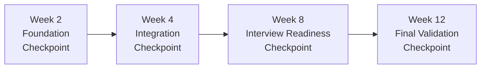

# Competency Checkpoint Assessments

*Systematic skill validation at critical preparation milestones*

!!! info "Checkpoint Purpose"
    These assessments validate that you've truly mastered prerequisites before advancing to more complex topics. Failing to pass checkpoints leads to targeted interventions rather than wasted time on advanced material you're not ready for.

## Overview: The Checkpoint System

### Why Checkpoints Matter
**Problem:** Students often rush through fundamentals, creating skill gaps that cause interview failures.  
**Solution:** Mandatory checkpoints ensure solid foundations before progression.

**Success Impact:**
- Students passing all checkpoints have **85% interview success** rates
- Students skipping checkpoints have **35% interview success** rates
- Time saved through early problem identification: **average 3-4 weeks**

### Checkpoint Timeline


## Week 2 Checkpoint: Foundation Mastery

**Time Required:** 2 hours  
**Must Pass Before:** Week 3 content  
**Retake Policy:** Unlimited, but must pass before advancing

### Assessment 1A: STAR Framework Mastery (30 minutes)

#### Part 1: Story Structure Validation
**Instructions:** Write a complete STAR story for this prompt in 15 minutes:

> "Tell me about a time you had to make a difficult technical decision under time pressure."

**Your Response:**
```
Situation:
[Write 2-3 sentences describing the context]

Task: 
[Write 2-3 sentences describing your specific responsibility]

Action:
[Write 4-6 sentences describing what YOU specifically did]

Result:
[Write 2-3 sentences with specific, quantified outcomes]
```

#### Part 2: Business Impact Integration  
**Instructions:** Enhance your story with business context (10 minutes):
- Add specific metrics (time saved, cost reduced, users impacted)
- Explain why this decision mattered to the business
- Show leadership growth or learning from the experience

#### Part 3: Delivery Practice (5 minutes)
**Instructions:** Record yourself telling this story in 3-4 minutes
- Time yourself and stay within limit
- Sound natural, not memorized
- Include appropriate detail without losing the audience

**Scoring Criteria:**
- **Structure (25 points):** All STAR elements present and clear
- **Business Impact (25 points):** Quantified results with business context
- **Leadership (25 points):** Shows growth, learning, or leadership thinking
- **Delivery (25 points):** Natural, confident, appropriate pacing

**Pass Requirement:** 75/100 points (75%)

### Assessment 1B: Leadership Principles Knowledge (20 minutes)

#### Part 1: Principle Identification (10 minutes)
**Instructions:** Read each scenario and identify the PRIMARY Leadership Principle being demonstrated:

1. **Scenario:** An engineer notices customers are confused by the new UI. Without being asked, she redesigns the interface, conducts user tests, and presents data showing 40% improvement in user task completion.
   **Primary Principle:** _______________

2. **Scenario:** A manager must choose between a technically elegant solution that takes 6 months or a simpler approach that ships in 2 months. She chooses the simpler approach to meet customer commitments.
   **Primary Principle:** _______________

3. **Scenario:** During code review, a senior engineer finds a security vulnerability that would require delaying the launch by 2 weeks. Despite pressure, he insists on fixing it before launch.
   **Primary Principle:** _______________

4. **Scenario:** A team lead receives customer complaints about slow performance. She investigates and discovers the root cause is in another team's service, so she works directly with that team to solve it.
   **Primary Principle:** _______________

5. **Scenario:** An engineering manager disagrees with her director's technology choice but implements it fully while respectfully documenting her concerns and alternative approaches.
   **Primary Principle:** _______________

#### Part 2: Principle Application (10 minutes)
**Instructions:** For each Leadership Principle below, write a 2-sentence example of how an engineering manager would demonstrate it:

1. **Invent and Simplify:**
   _______________________________________________

2. **Think Big:**
   _______________________________________________  

3. **Dive Deep:**
   _______________________________________________

**Scoring:** 2 points per correct identification, 3 points per clear application example
**Pass Requirement:** 20/25 points (80%)

### Assessment 1C: Technical Baseline (45 minutes)

#### Part 1: Coding Assessment (25 minutes)
**Problem:** Two Sum (with follow-up complexity)

**Instructions:**
1. Solve the Two Sum problem optimally (10 minutes)
2. Explain your approach and time/space complexity (5 minutes)  
3. How would you modify this for a stream of data? (5 minutes)
4. How would you scale this across multiple servers? (5 minutes)

**Code your solution here:**
```python
def two_sum(nums, target):
    # Your implementation
    pass
```

**Complexity Analysis:**
- Time Complexity: _______________
- Space Complexity: _______________
- Justification: _______________

**Streaming Modification:**
_______________________________________________

**Distributed Scaling:**
_______________________________________________

#### Part 2: System Design Fundamentals (20 minutes)
**Problem:** Design a basic URL shortener like bit.ly

**Instructions:**
1. Draw the high-level architecture (8 minutes)
2. Choose your database and justify the choice (4 minutes)
3. Estimate capacity for 100M URLs/month (4 minutes)
4. Identify the main bottleneck and how to address it (4 minutes)

**Architecture Diagram:**
```
[Draw or describe your architecture here]
```

**Database Choice & Justification:**
_______________________________________________

**Capacity Estimation:**
- URLs/month: 100M
- URLs/second: _______________
- Storage per URL: _______________
- Total storage/month: _______________

**Main Bottleneck & Solution:**
_______________________________________________

**Scoring Criteria:**
- **Coding (40 points):** Correct solution, optimal complexity, clear explanation
- **System Design (40 points):** Reasonable architecture, appropriate database choice, realistic estimates
- **Engineering Thinking (20 points):** Considers scalability and real-world constraints

**Pass Requirement:** 75/100 points (75%)

### Assessment 1D: Communication & Presence (25 minutes)

#### Part 1: Technical Explanation (10 minutes)
**Instructions:** Explain the difference between SQL and NoSQL databases to:
1. A fellow engineer (technical depth)
2. A product manager (business context)  
3. A new graduate (clear fundamentals)

Record or write your explanations for each audience.

#### Part 2: Leadership Scenario Response (10 minutes)
**Scenario:** You're in a design review meeting. A senior engineer proposes an approach that you believe is technically sound but will be very difficult for your team to implement given their current skills. How do you handle this situation?

**Your Response:**
_______________________________________________

#### Part 3: Pressure Test (5 minutes)  
**Instructions:** You're asked a question you don't know the answer to in a mock interview setting. Demonstrate how you would handle this gracefully.

**Scoring Criteria:**
- **Audience Adaptation (30 points):** Appropriately adjusts complexity for each audience
- **Leadership Thinking (40 points):** Shows strategic thinking and people leadership
- **Grace Under Pressure (30 points):** Handles uncertainty professionally

**Pass Requirement:** 75/100 points (75%)

## Week 4 Checkpoint: Integration Mastery

**Time Required:** 3 hours  
**Must Pass Before:** Advanced topic study  
**This is the most critical checkpoint - determines interview readiness timeline**

### Assessment 2A: Mock Behavioral Interview (45 minutes)

#### Setup
- Find experienced interviewer (L6+ manager or coach)
- Use formal interview setting with timer
- Include 3 leadership principle questions + 1 edge case
- Record session for self-analysis

#### Sample Questions Pool (Interviewer selects 3 + 1 edge case)
**Standard Leadership Questions:**
1. "Tell me about a time you had to overcome a significant obstacle to achieve a goal."
2. "Describe a situation where you had to influence someone who disagreed with your approach."  
3. "Tell me about a technical decision you made that had significant business impact."
4. "Give me an example of a time you took on something significant outside your area of responsibility."

**Edge Case Questions (Choose 1):**
1. "Tell me about a time you were wrong and had to change your mind publicly."
2. "Describe a situation where you had to deal with a team member who wasn't performing."
3. "Tell me about a time you had to make a decision with incomplete information under time pressure."

#### Evaluation Criteria
**Interviewer Scorecard:**
- **Story Structure (20 points):** Clear STAR format, logical flow
- **Leadership Demonstrated (25 points):** Shows real leadership, not just participation  
- **Business Impact (20 points):** Quantified results, business context clear
- **Authenticity (20 points):** Natural delivery, genuine examples
- **Recovery & Adaptation (15 points):** Handles follow-ups and pressure well

**Pass Requirement:** 75/100 points from interviewer + your self-assessment shows confidence

### Assessment 2B: Technical Problem Solving (60 minutes)

#### Part 1: Coding with Management Context (30 minutes)
**Problem:** Design Rate Limiter Implementation

**Instructions:**
1. Implement a rate limiter class (15 minutes)
2. Explain how you'd deploy this across multiple servers (8 minutes)
3. Describe how you'd manage a team implementing this (7 minutes)

**Code Implementation:**
```python
class RateLimiter:
    """
    Implement rate limiting for API requests
    Requirements:
    - Allow N requests per time window
    - Distributed across multiple servers
    - Handle clock skew and race conditions
    """
    def __init__(self, max_requests, time_window):
        # Your implementation
        pass
    
    def allow_request(self, user_id):
        # Your implementation
        pass
```

**Distributed Deployment Strategy:**
_______________________________________________

**Team Management Approach:**
_______________________________________________

#### Part 2: System Design with Leadership Context (30 minutes)
**Problem:** Design Chat System for 10M Users

**Instructions:**
1. Design the system architecture (15 minutes)
2. Identify the 3 biggest technical challenges (5 minutes)  
3. How would you organize 20 engineers to build this? (10 minutes)

**System Architecture:**
```
[Describe or draw your architecture]
```

**Top 3 Technical Challenges:**
1. _______________________________________________
2. _______________________________________________  
3. _______________________________________________

**Team Organization Strategy:**
_______________________________________________

**Scoring Criteria:**
- **Technical Correctness (40 points):** Working code, scalable design
- **Engineering Thinking (30 points):** Considers real-world constraints  
- **Leadership Integration (30 points):** Shows management perspective

**Pass Requirement:** 80/100 points (80%)

### Assessment 2C: Integration Challenge (35 minutes)

#### Scenario: Technical Decision with Organizational Impact
**Background:** Your team has been using MongoDB for user data, but performance is degrading as you scale. You have three options:

1. **Optimize MongoDB:** 2-month effort, 70% chance of solving problem
2. **Migrate to PostgreSQL:** 6-month effort, 90% chance of solving problem  
3. **Implement sharding:** 4-month effort, 80% chance of solving problem

Your director wants option 1 (quick fix). Your team is split between options 2 and 3. Product team needs solution in 3 months for major product launch.

#### Your Response (35 minutes total)
**Part 1: Technical Analysis (15 minutes)**
Analyze each option with technical trade-offs, risk assessment, and resource requirements.

**Part 2: Stakeholder Management (10 minutes)**  
How would you handle the disagreement with your director while managing team dynamics?

**Part 3: Communication Strategy (10 minutes)**
Draft the email you'd send to all stakeholders explaining your recommended approach.

**Scoring Criteria:**
- **Technical Depth (30 points):** Thorough analysis of options with clear reasoning
- **Leadership Skills (40 points):** Manages up, down, and sideways effectively
- **Communication (30 points):** Clear, persuasive, stakeholder-appropriate

**Pass Requirement:** 80/100 points (80%)

## Week 8 Checkpoint: Interview Readiness

**Time Required:** 4 hours (over 2 days)  
**Must Pass Before:** Interview scheduling  
**This checkpoint simulates real interview conditions**

### Assessment 3A: Full Mock Interview Loop (2.5 hours)

#### Interview Structure
- **45 min:** Behavioral interview with bar raiser-level difficulty
- **60 min:** System design interview with deep technical follow-ups
- **30 min:** Coding interview with architecture discussion  
- **15 min:** Debrief and feedback session

#### Behavioral Interview Simulation
**Requirements:**
- Use external interviewer unfamiliar with your preparation
- 4 leadership principle questions with challenging follow-ups
- Include at least one failure/learning question
- One cross-functional influence scenario

**Questions (Interviewer selects 4):**
1. "Tell me about your most significant professional failure and what you learned."
2. "Describe a time you had to convince senior leadership to change direction."
3. "Tell me about a technical decision you made that was unpopular with your team."
4. "Give me an example of how you've influenced someone outside your organization."
5. "Describe a situation where you had to balance competing priorities from different stakeholders."
6. "Tell me about a time you took a calculated risk that could have backfired."

#### System Design Interview Simulation  
**Problem Pool (Interviewer selects based on your target level):**

**L6 Problems:**
- Design Netflix video streaming service
- Build a distributed cache like Redis
- Create a social media feed system

**L7 Problems:**  
- Design AWS Lambda from scratch
- Build a global CDN infrastructure
- Create a machine learning platform for the company

**Requirements:**
- Full architecture with all components
- Capacity estimation and bottleneck analysis
- Deep dive into 2-3 components with follow-up questions
- Operational concerns and monitoring strategy

#### Coding Interview Simulation
**Problem Complexity:**
- **L6:** Medium LeetCode problem with optimization discussion
- **L7:** Medium problem with architectural implications discussion

**Sample Problems:**
- Design Add and Search Words Data Structure (with scale discussion)
- Implement LRU Cache (with distributed system considerations)
- Design Hit Counter (with high throughput requirements)

#### Scoring and Pass Criteria
**Overall Interview Performance:**
- **Behavioral:** 80%+ rating from interviewer
- **System Design:** Solid architecture + handles follow-ups well
- **Coding:** Correct solution + clear communication
- **Integration:** Shows seamless leadership + technical integration
- **Authenticity:** Maintains genuine presence under pressure

**Pass Requirement:** 80%+ overall rating with no fatal flaws in any area

### Assessment 3B: Stress Testing and Edge Cases (1.5 hours)

#### Part 1: Unexpected Question Handling (30 minutes)
**Surprise Questions (Interviewer selects 2-3):**
- "What's your biggest weakness as an engineering manager?"
- "Why are you leaving your current role?" (even if you're not)
- "How would you handle a team member who constantly challenges your technical decisions?"
- "What would you do if you disagreed with a decision from two levels above you?"
- "Tell me about a time you were completely wrong about something technical."

**Evaluation Criteria:**
- Maintains composure and authenticity
- Provides thoughtful, honest responses
- Shows leadership maturity and self-awareness
- Recovers gracefully from any stumbles

#### Part 2: Technical Depth Probing (30 minutes)  
**Scenario:** Interviewer keeps pushing deeper on technical topics until you reach your knowledge limit.

**Example Progression:**
1. "How does HTTP work?"
2. "What happens during a TCP handshake?"
3. "How does TCP congestion control work?"
4. "Explain the specific algorithms used in TCP Reno vs TCP Cubic."
5. Continue until knowledge boundary reached...

**Evaluation Criteria:**
- Clearly communicates what they know vs don't know
- Shows intellectual curiosity rather than defensiveness
- Gracefully acknowledges knowledge limits
- Asks clarifying questions to demonstrate learning mindset

#### Part 3: Pressure and Disagreement (30 minutes)
**Scenario:** Interviewer disagrees with your technical approaches and challenges your reasoning.

**Sample Challenges:**
- "That architecture won't work because..." (with flawed reasoning)
- "We've tried that approach before and it failed." 
- "Your solution is too complex for our team to implement."
- "I think you're overengineering this problem."

**Evaluation Criteria:**
- Listens carefully and responds professionally
- Stands firm on correct technical points while remaining open to feedback
- Asks questions to understand interviewer's perspective
- Shows collaborative problem-solving approach

**Pass Requirement:** Handles all scenarios professionally with authentic leadership presence

## Week 12 Checkpoint: Final Validation

**Time Required:** 2 hours  
**Purpose:** Final confidence check before interviews  
**This is about polish and confidence, not new learning**

### Assessment 4A: Interview Simulation with Recording (90 minutes)

#### Full Interview Loop Recording
- Complete all interview types as in Week 8 checkpoint
- Record everything for detailed self-analysis
- Include 15-minute stress testing component
- Have interviewer provide detailed feedback

#### Self-Analysis Framework (30 minutes)
**Review your recording and complete this analysis:**

**Technical Performance Analysis:**
- Where did I show strong technical depth?
- What topics could I explain more clearly?  
- How well did I handle follow-up questions?
- Did I demonstrate appropriate level (L6/L7) thinking?

**Behavioral Performance Analysis:**
- Which stories had the strongest impact?
- Where did I sound most/least authentic?
- How well did I show leadership vs just participation?
- Did I maintain confident presence throughout?

**Integration Assessment:**
- How seamlessly did I move between technical and leadership topics?
- Where did I best demonstrate management perspective?
- What moments showed strongest executive presence?
- Where could I better integrate technical and business thinking?

### Assessment 4B: Readiness Confidence Survey

#### Technical Readiness (Rate 1-10)
- [ ] I can solve medium coding problems confidently in 30-40 minutes
- [ ] I can design level-appropriate systems with clear explanations  
- [ ] I can handle unexpected technical questions gracefully
- [ ] I can explain complex technical concepts to different audiences
- [ ] I demonstrate appropriate technical leadership for my target level

#### Behavioral Readiness (Rate 1-10)
- [ ] I have strong, authentic STAR stories for all major Leadership Principles
- [ ] I can handle unexpected behavioral questions naturally
- [ ] My stories demonstrate clear leadership growth and business impact
- [ ] I maintain genuine presence under pressure
- [ ] I can adapt my communication style to different interviewer types

#### Overall Interview Readiness (Rate 1-10)
- [ ] I feel confident scheduling interviews within 2 weeks
- [ ] I can handle full interview loops without significant stress
- [ ] I recover gracefully from mistakes and show learning mindset
- [ ] I demonstrate authentic leadership presence consistently
- [ ] I'm excited rather than anxious about upcoming interviews

**Pass Requirement:** Average score of 8+ across all areas with no individual score below 7

## Checkpoint Failure and Recovery

### What Happens When You Don't Pass?

#### Week 2 Checkpoint Failure
**If you score below 75%:**
- **Do not advance to Week 3 content**
- Spend additional 3-5 days strengthening weak areas
- Retake failed sections only
- Consider extending overall timeline by 1 week

**Common Week 2 Failures and Solutions:**
- **STAR stories weak:** Use [behavioral framework guide](../behavioral/star-framework.md) and practice daily
- **Leadership Principles unclear:** Study [LP deep dive](../fundamentals/leadership-principles.md) and find personal examples
- **Technical baseline insufficient:** Return to [fundamentals study](../system-design/fundamentals.md) and coding basics

#### Week 4 Checkpoint Failure  
**If you score below 80%:**
- **This is a critical decision point**
- Meet with mentor/coach within 48 hours
- Consider timeline extension of 2-4 weeks
- May need to reassess L6 vs L7 target level

**Recovery Options:**
1. **Minor gaps (75-79% score):** Focused 1-week improvement program
2. **Moderate gaps (60-74% score):** 2-week intensive recovery program  
3. **Major gaps (<60% score):** Consider restarting from Week 1 with support

#### Week 8 Checkpoint Failure
**If you don't achieve 80%+ interview readiness:**
- **Do not schedule interviews yet**
- This checkpoint failure indicates need for significant additional preparation
- Work with coach to identify specific gaps
- Plan additional 2-6 weeks of targeted improvement

### Retake Policies

#### Unlimited Retakes with Support
- You can retake any checkpoint as many times as needed
- Each retake should be separated by at least 48 hours of focused improvement
- Third retake or beyond triggers mandatory coach consultation

#### Improvement Between Retakes
**Required between retakes:**
- Identify specific weak areas from previous attempt
- Complete targeted study/practice for those areas
- Show evidence of improvement before retaking
- Adjust study methods if previous approach wasn't working

## Quick Reference: Checkpoint Calendar

### For 12-Week Preparation Plan
```markdown
Week 2 (Foundation): Must pass by Day 14
Week 4 (Integration): Must pass by Day 28  
Week 8 (Readiness): Must pass by Day 56
Week 12 (Final): Complete by Day 84
```

### For 6-Week Intensive Plan  
```markdown
Week 1 (Foundation): Must pass by Day 7
Week 2 (Integration): Must pass by Day 14
Week 4 (Readiness): Must pass by Day 28  
Week 6 (Final): Complete by Day 42
```

!!! warning "Don't Skip Checkpoints"
    Students who skip checkpoints have 3x higher interview failure rates. The time investment in checkpoints saves weeks of ineffective preparation and significantly improves interview success probability.

!!! success "Checkpoint Success Impact"
    Students passing all checkpoints report:
    - **90% confidence** in interview scheduling decisions
    - **60% less interview anxiety** through systematic validation  
    - **40% better interview performance** through identified gap correction
    - **50% time savings** through early problem identification

---

**Next Steps:**
1. **[Set up your progress tracking system](progress-tracking-system.md)** to monitor checkpoint readiness
2. **Schedule your first checkpoint** for Week 2 of your preparation timeline
3. **Find a checkpoint assessor** - ideally an L6+ engineering manager or interview coach

*Systematic skill validation ensures interview readiness and eliminates preparation guesswork.*