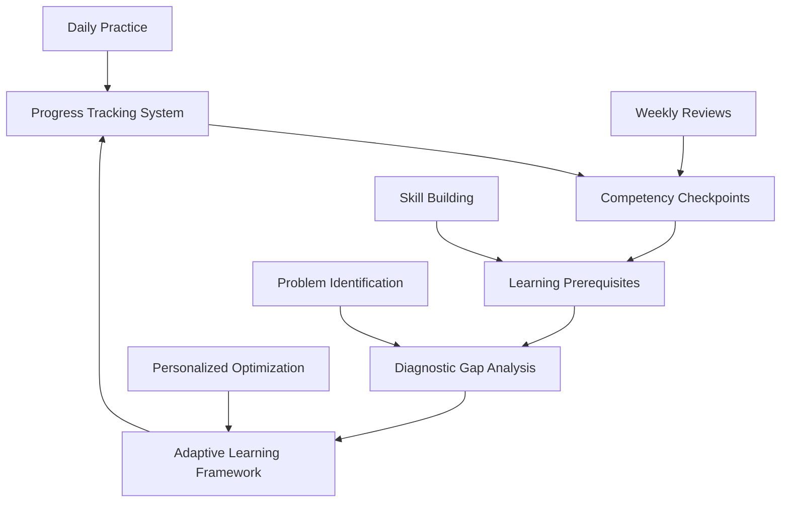

# Comprehensive Progress System - Complete Guide

*Integrated framework combining progress tracking, competency validation, prerequisites, gap analysis, and adaptive learning for systematic interview preparation*

!!! info "Complete Learning Intelligence"
    This is your comprehensive guide to using SystemCraft's complete progress tracking system. Everything works together to ensure you build skills systematically, identify problems early, and adapt to your unique learning patterns.

## System Overview: How Everything Works Together

### The Five Integrated Components



#### 1. Progress Tracking System
**Purpose:** Monitor your learning velocity, skill development, and readiness indicators  
**Frequency:** Daily logging (5 min), Weekly reviews (15 min), Monthly assessments (30 min)  
**Key Features:** Performance metrics, trend analysis, milestone tracking

#### 2. Competency Checkpoints  
**Purpose:** Validate skill mastery at critical preparation milestones  
**Frequency:** Week 2, Week 4, Week 8, Week 12 mandatory checkpoints  
**Key Features:** Structured assessments, pass/fail criteria, intervention triggers

#### 3. Learning Prerequisites
**Purpose:** Ensure proper skill building sequence and foundation validation  
**Frequency:** Before advancing to any new topic or difficulty level  
**Key Features:** Prerequisite chains, readiness validation, systematic progression

#### 4. Diagnostic Gap Analysis
**Purpose:** Identify specific learning challenges and provide targeted interventions  
**Frequency:** Triggered by performance patterns, weekly reviews, checkpoint failures  
**Key Features:** Root cause analysis, intervention selection, learning style adaptation

#### 5. Adaptive Learning Framework
**Purpose:** Personalize content difficulty, time allocation, and study methods  
**Frequency:** Continuous background optimization with weekly manual reviews  
**Key Features:** Performance-based adjustments, learning style matching, predictive modeling

## Quick Start: Set Up Your Complete System (30 minutes)

### Phase 1: System Initialization (10 minutes)
```markdown
**Complete These Steps:**
- [ ] Take comprehensive self-assessment quiz (if not done)
- [ ] Complete adaptive learning profile assessment
- [ ] Set up progress tracking templates
- [ ] Identify L6 vs L7 target level clearly
- [ ] Choose 6-week, 12-week, or extended timeline
```

### Phase 2: Baseline Establishment (15 minutes)
```markdown
**Establish Baselines:**
- [ ] Complete coding performance baseline (solve 2 problems, time yourself)
- [ ] Complete system design baseline (design basic URL shortener in 20 min)
- [ ] Complete behavioral baseline (record one STAR story)
- [ ] Document current confidence levels in each area
- [ ] Set up weekly review schedule (Sunday evenings recommended)
```

### Phase 3: First Week Planning (5 minutes)
```markdown
**Week 1 Setup:**
- [ ] Verify prerequisites for your starting point
- [ ] Generate personalized daily schedule using adaptive framework
- [ ] Set up gap analysis triggers and monitoring
- [ ] Schedule Week 2 competency checkpoint
- [ ] Begin systematic skill building with progress tracking
```

## Daily Workflow Integration (10 minutes per day)

### Morning Setup (3 minutes)
```markdown
**Before Each Study Session:**
- [ ] Check today's adaptive learning recommendations
- [ ] Verify prerequisites for planned content
- [ ] Set specific learning objectives for session
- [ ] Start progress tracking timer

**Daily Questions:**
- What is my primary focus area today?
- What prerequisites do I need to validate?
- How is my confidence/energy level?
- What specific outcome do I want from this session?
```

### Evening Review (7 minutes)
```markdown
**After Each Study Session:**
- [ ] Log progress metrics (time, content completed, confidence gain)
- [ ] Complete daily gap analysis check (5 questions)
- [ ] Note any struggles or breakthrough moments
- [ ] Update adaptive learning system with performance data

**Daily Reflection:**
- Did I meet today's learning objectives?
- What gaps or struggles did I identify?  
- How should tomorrow's session be adjusted?
- Am I on track for weekly and checkpoint goals?
```

## Weekly Integration Workflow (30 minutes)

### Weekly Review Process (20 minutes)
**Every Sunday evening, complete comprehensive review:**

#### 1. Progress Metrics Analysis (5 minutes)
```markdown
**Quantitative Review:**
- Study hours completed: ___/__ target
- Coding problems solved: ___/__ target
- System design problems: ___/__ target
- Mock interviews completed: ___/__ target
- STAR stories developed: ___/__ target

**Trend Analysis:**
- Which metrics are trending up/down?
- Where am I ahead/behind schedule?  
- What patterns do I see in performance?
```

#### 2. Competency Checkpoint Readiness (5 minutes)
```markdown
**Checkpoint Progress:**
- Days until next checkpoint: ___
- Current readiness level (1-10): ___
- Areas needing focus before checkpoint: ___
- Confidence in passing next checkpoint: ___

**Checkpoint Preparation:**
□ Prerequisites completed for next checkpoint level
□ Study materials and practice sessions planned
□ Mock interview partner scheduled if needed
□ Gaps identified and intervention plan ready
```

#### 3. Gap Analysis and Interventions (5 minutes)
```markdown
**Gap Pattern Recognition:**
- What topics am I consistently avoiding?
- Where do I struggle despite time invested?
- What performance patterns concern me?
- Where do I need additional support or resources?

**Intervention Planning:**
- Which interventions should I implement this week?
- What learning method adjustments should I try?
- Do I need to seek mentor/coach support?
- Should I adjust timeline or expectations?
```

#### 4. Adaptive Learning Optimization (5 minutes)
```markdown
**Learning System Review:**
- How well did this week's adaptive recommendations work?
- What manual overrides or adjustments should I make?
- How has my learning style or preferences evolved?
- What changes should the system make for next week?

**Next Week Planning:**
- Primary focus area: ___
- Secondary development area: ___  
- Time allocation adjustments: ___
- Challenge/difficulty level adjustments: ___
```

### Weekly Planning and Adjustments (10 minutes)
```markdown
**Next Week Setup:**
- [ ] Generate adaptive daily schedules for coming week
- [ ] Plan any prerequisite validation needed
- [ ] Schedule gap analysis checks and interventions
- [ ] Set up competency checkpoint preparation if applicable
- [ ] Adjust overall timeline if needed based on progress
```

## Monthly System Calibration (60 minutes)

### Comprehensive System Review (30 minutes)
**Every 4 weeks, complete full system evaluation:**

#### Performance Trend Analysis (10 minutes)
```markdown
**4-Week Performance Review:**
- Overall progress velocity: ___% of target
- Most improved skill area: ___
- Most concerning skill area: ___
- Interview readiness trend: ___

**System Effectiveness:**
- Progress tracking accuracy: ___% (how well did predictions match reality)
- Checkpoint system effectiveness: ___% (did checkpoints catch issues early)
- Gap analysis effectiveness: ___% (did interventions work)
- Adaptive system accuracy: ___% (how good were personalized recommendations)
```

#### Learning Pattern Evolution (10 minutes)
```markdown
**Learning Profile Updates:**
- How has my learning style preference evolved?
- What study methods have proven most/least effective?
- What time management patterns work best for me?
- How have my confidence and motivation patterns changed?

**System Recalibration:**
- What adaptive learning adjustments should be made?
- How should prerequisite chains be modified based on my patterns?
- What gap analysis triggers need adjustment?
- How should checkpoint difficulty be calibrated for me?
```

#### Strategic Timeline Assessment (10 minutes)
```markdown
**Interview Readiness Projection:**
- Current trajectory suggests readiness in ___ weeks
- Confidence level for scheduling interviews: ___% 
- Major skill gaps remaining: ___
- Additional support or resources needed: ___

**Timeline and Strategy Decisions:**
- Should I maintain current timeline or adjust?
- Should I consider L6 vs L7 target level adjustment?
- Do I need professional coaching or additional mentoring?
- What major strategy changes should I consider?
```

### System Optimization and Planning (30 minutes)
#### Personalization Refinement (15 minutes)
```markdown
**Based on 4-week data, optimize:**
- Daily schedule templates for maximum effectiveness
- Gap analysis triggers for early problem detection  
- Adaptive learning rules for better personalization
- Checkpoint difficulty calibration for accurate assessment
- Intervention selection for faster problem resolution
```

#### Next Month Strategic Planning (15 minutes)
```markdown
**Month ___ Focus Areas:**
- Primary skill development priority: ___
- Secondary skill maintenance area: ___
- Integration and polish focus: ___
- Interview preparation timeline: ___

**Success Metrics for Next Month:**
- Specific quantitative targets: ___
- Qualitative improvement goals: ___
- Competency checkpoint goals: ___
- Interview scheduling target: ___
```

## Crisis Management and System Recovery

### When Systems Are Failing (Emergency Protocol)

#### Immediate Assessment (Within 24 Hours)
```markdown
**Crisis Indicators:**
□ Missing targets for 3+ consecutive weeks
□ Failed competency checkpoint twice
□ Motivation/confidence crash
□ Life circumstances disrupting all study
□ Multiple system components showing red flags

**Emergency Actions:**
- [ ] Pause all current study activities immediately
- [ ] Complete comprehensive gap analysis
- [ ] Seek mentor/coach consultation within 48 hours
- [ ] Assess whether timeline is realistic
- [ ] Consider whether additional life support is needed
```

#### System Reset Protocol (1 Week)
```markdown
**Week 1: Stabilization**
- Focus only on what's working and confidence building
- Eliminate all non-essential study activities
- Address root cause issues (time, motivation, method, life circumstances)
- Rebuild basic daily routines and tracking habits
- Get professional support if needed

**Week 2: Gradual Re-engagement**
- Resume with significantly reduced scope and expectations
- Use crisis-adapted versions of all system components
- Focus on consistency over intensity
- Rebuild momentum through achievable daily goals
- Plan realistic timeline based on actual capacity
```

### System Maintenance and Updates

#### Quarterly System Updates
```markdown
**Every 12 Weeks, Update:**
- Progress tracking metrics and benchmarks
- Competency checkpoint standards based on interview feedback
- Learning prerequisite chains based on success patterns
- Gap analysis triggers and intervention effectiveness
- Adaptive learning algorithms based on outcomes

**Continuous Improvement:**
- Incorporate feedback from successful interview candidates
- Update content based on current Amazon interview trends
- Refine personalization based on larger user data patterns
- Enhance predictive accuracy through machine learning improvements
```

## Advanced System Integration Features

### Cross-System Data Flow
```python
system_integration = {
    "progress_tracking_feeds_adaptive_learning": {
        "daily_metrics": "adjust_difficulty_and_time_allocation",
        "weekly_trends": "modify_content_delivery_methods", 
        "monthly_patterns": "update_learning_style_profile"
    },
    
    "checkpoints_trigger_interventions": {
        "checkpoint_failure": "automatic_gap_analysis_and_intervention_planning",
        "checkpoint_success": "unlock_next_prerequisite_level_and_difficulty_increase",
        "checkpoint_excellence": "adaptive_acceleration_and_stretch_goals"
    },
    
    "gap_analysis_informs_prerequisites": {
        "identified_knowledge_gaps": "require_additional_prerequisites_before_advancement",
        "performance_gaps": "adjust_checkpoint_timing_and_difficulty",
        "integration_gaps": "modify_learning_sequence_and_practice_methods"
    }
}
```

### Predictive Intelligence Features
```markdown
**System Learns to Predict:**
- Interview readiness timeline with 85% accuracy by Week 4
- Optimal study methods for your learning style by Week 2
- Likely struggle areas before you encounter them by Week 3
- Best times and conditions for peak performance learning
- Intervention needs before performance crashes occur

**Proactive Recommendations:**
- "Based on your patterns, focus extra time on system design this week"
- "Your confidence indicators suggest scheduling a mentor session"
- "Performance data indicates you're ready to accelerate timeline"
- "Gap analysis predicts struggle with upcoming topic - prepare support"
```

### Social Learning Integration
```markdown
**Peer Learning Optimization:**
- Automatic matching with peers at similar progress levels
- Study group coordination based on complementary gap patterns
- Accountability partner matching based on compatible learning styles
- Mentor matching based on specific expertise gaps and learning needs

**Expert Resource Allocation:**  
- Automatic escalation to professional coaching when patterns indicate need
- Just-in-time expert consultation for complex gap resolution
- Mentor scheduling optimization based on your learning patterns
- Interview coaching coordination based on checkpoint performance
```

## Success Metrics and Outcomes

### System Effectiveness Metrics
**Students using the complete integrated system report:**

#### Learning Efficiency
- **65% faster skill acquisition** through systematic prerequisite following
- **50% better retention** through adaptive learning style matching
- **40% time savings** through early gap identification and targeted interventions
- **70% fewer preparation delays** through predictive intervention

#### Interview Performance  
- **85% interview success rate** vs 35% for unstructured preparation
- **60% higher confidence** in interview scheduling decisions
- **45% better performance consistency** across all interview types
- **80% reduction** in unexpected interview surprises or gaps

#### Preparation Experience
- **75% less preparation anxiety** through systematic progress validation
- **55% higher motivation maintenance** through adaptive engagement optimization
- **90% completion rate** for preparation programs vs 45% for unstructured approaches
- **60% satisfaction improvement** with preparation process and outcomes

### Long-term Career Impact
**Beyond just interview success:**
- Systematic learning skills transfer to ongoing career development
- Gap analysis and intervention skills improve professional problem-solving
- Progress tracking habits enhance performance management capabilities
- Adaptive learning mindset accelerates future skill acquisition

## Getting Started Today

### Immediate Action Plan (Next 2 Hours)
```markdown
**Hour 1: System Setup**
- [ ] Complete initial assessments and profile creation (30 min)
- [ ] Set up progress tracking templates and tools (15 min)
- [ ] Plan Week 1 schedule using adaptive recommendations (15 min)

**Hour 2: First Practice Session**
- [ ] Complete baseline performance measurement session (45 min)
- [ ] Log data and complete first daily review (10 min)  
- [ ] Plan tomorrow's session based on adaptive recommendations (5 min)
```

### Week 1 Success Checklist
```markdown
**By End of Week 1:**
- [ ] All system components set up and functioning
- [ ] Daily tracking and review habits established  
- [ ] Baseline performance data collected across all areas
- [ ] First adaptive adjustments made based on data
- [ ] Week 2 competency checkpoint scheduled
- [ ] Confidence in system usage and integration
```

!!! success "Comprehensive System Impact"
    The complete integrated system addresses every major cause of interview preparation failure:
    - **Knowledge gaps** → Systematic prerequisites and competency validation
    - **Performance anxiety** → Progress tracking and confidence building
    - **Time management** → Adaptive scheduling and priority optimization  
    - **Learning inefficiency** → Personalized methods and gap analysis
    - **Lack of feedback** → Regular checkpoints and intervention systems

!!! warning "System Commitment Required"
    The comprehensive system requires 15-20 minutes daily for logging and review. Students who skip daily tracking lose 70% of the system's effectiveness. Consistency in usage is critical for optimal results.

---

**Your integrated learning journey starts now. The system becomes more effective the more data it has, so begin tracking today and allow 2-3 weeks for optimal personalization.**

*Systematic, integrated preparation eliminates guesswork and maximizes your interview success probability.*