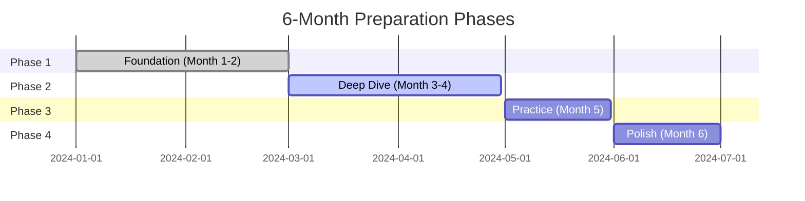

# Complete 6-Month Amazon L6/L7 Interview Preparation Timeline

## 📅 Your Strategic & Tactical Preparation Roadmap

This comprehensive guide combines strategic planning with detailed daily execution to prepare you for Amazon L6/L7 Engineering Manager interviews over 6 months, requiring **15-20 hours per week** of focused preparation.

!!! success "Success Insights from Recent Candidates"
    **L6 Hire**: "Following a structured timeline was crucial. I spent 6 months preparing, landed multiple L6 offers."
    
    **L7 Success**: "The day-by-day schedule kept me on track. Having both strategic goals AND daily tasks was the winning combination."

## 📚 Real Timeline Examples

📝 **[See Actual Preparation Timelines](../experiences/timeline-examples.md)** for detailed day-by-day schedules from successful candidates:

- **8-Week L6 Intensive**: IC to Manager transition success story
- **12-Week L7 Strategic**: Director to Principal Manager approach  
- **6-Week Recovery**: Second attempt success after targeted improvement

## 📊 Preparation Overview

For comprehensive L6 vs L7 differences and expectations, see **[L6 vs L7 Complete Guide](../fundamentals/l6-vs-l7.md)**.

### Time Investment & Success Rates

| Level | Total Hours | Weekly Hours | Success Rate |
|-------|-------------|--------------|--------------|
| **L6** | 360-400 | 15-17 | 65% with proper prep |
| **L7** | 400-450 | 17-20 | 45% with proper prep |

### Study Area Allocation

| Area | L6 Hours | L6 Weekly | L7 Hours | L7 Weekly |
|------|----------|-----------|----------|-----------|
| System Design | 120 (33%) | 5 hrs | 150 (38%) | 6 hrs |
| Coding/Technical | 100 (28%) | 4 hrs | 100 (25%) | 4 hrs |
| Leadership/Behavioral | 80 (22%) | 3 hrs | 90 (23%) | 3.5 hrs |
| Mock Interviews | 60 (17%) | 2.5 hrs | 60 (14%) | 2.5 hrs |
| **Total** | **360** | **15** | **400** | **16.5** |

### Phase Overview



## 📆 Month 1: Foundation Building

### Strategic Goals
- Establish baseline skills and knowledge gaps
- Build consistent study habits and environment
- Complete foundational learning
- Begin regular practice routines

### Week 1: Assessment & Setup

#### Day 1-2: Initial Assessment
**Morning (1 hour)**
- [ ] Complete comprehensive self-assessment
- [ ] Identify target level (L6 vs L7)
- [ ] Document current gaps and strengths
- [ ] Set specific interview timeline goals

**Evening (1.5 hours)**
- [ ] Set up development environment
- [ ] Create detailed tracking spreadsheet
- [ ] Join study communities (Blind, Reddit, Discord)
- [ ] Schedule study blocks for next 4 weeks

**Resources to Acquire**:
- LeetCode Premium subscription
- System Design Course (Grokking or similar)
- AWS Free Tier Account
- Interview practice platforms

#### Day 3-4: Baseline Testing
**Baseline Metrics to Establish**:
```python
baseline_metrics = {
    "leetcode_easy_time": 0,  # Target: 15 min
    "leetcode_medium_time": 0,  # Target: 30 min
    "system_design_completeness": 0,  # Target: 80%
    "star_story_quality": 0,  # Target: 4/5
}
```

**Testing Tasks**:
- [ ] Solve 3 LeetCode problems (1 easy, 2 medium) - time yourself
- [ ] Complete 1 system design problem in 45 minutes
- [ ] Write 3 STAR stories from different experiences
- [ ] Record scores and improvement areas

#### Day 5-7: Study Plan Creation
- [ ] Create personalized 6-month calendar
- [ ] Block daily study time in calendar
- [ ] Schedule weekly review sessions
- [ ] Plan first mock interview for Week 8
- [ ] Create backup plans for schedule disruptions

### Week 2: Core Fundamentals

#### Daily Schedule Template
```markdown
6:00-7:00 AM: Coding Practice (1 hour)
- Warm-up: 1 easy problem (15 min)
- Main: 1 medium problem (35 min)
- Review: Study solutions (10 min)

12:00-12:30 PM: Technical Reading (30 min)
- System design articles
- AWS documentation
- Architecture blogs

7:00-9:00 PM: Deep Study (2 hours)
- Leadership Principles study
- System design concepts
- STAR story development
```

#### Week 2 Specific Goals
- [ ] Study all 16 Leadership Principles in detail
- [ ] Complete CS fundamentals review
- [ ] Solve 10 coding problems
- [ ] Draft 5 STAR stories
- [ ] Learn basic distributed systems concepts

### Week 3-4: Building Momentum

#### Coding Focus (Week 3)
**Daily Practice Routine**:
- **Monday**: Arrays and Strings
- **Tuesday**: Linked Lists and Trees
- **Wednesday**: Graphs and Algorithms
- **Thursday**: Dynamic Programming
- **Friday**: Hash Tables and Heaps
- **Weekend**: Review and harder problems

**Week 3 Goals**:
- [ ] 15 problems solved (cumulative: 25)
- [ ] Master 3 problem patterns
- [ ] Improve medium problem time to <35 minutes

#### System Design Focus (Week 4)
**Daily Design Practice**:
- **Monday**: Design URL Shortener
- **Tuesday**: Design Chat System
- **Wednesday**: Design Social Media Feed
- **Thursday**: Design E-commerce Platform
- **Friday**: Design Video Streaming Service
- **Weekend**: Review and optimize designs

**Week 4 Goals**:
- [ ] Complete 5 end-to-end system designs
- [ ] Learn 5 AWS services in detail
- [ ] Practice explaining designs clearly

### Month 1 Deliverables Checklist
- [ ] **Coding**: 25+ problems solved, <30 min medium problems
- [ ] **System Design**: 6 complete designs with diagrams
- [ ] **Behavioral**: 10 STAR stories drafted
- [ ] **Habits**: Consistent daily study routine established
- [ ] **Tracking**: Baseline metrics and progress tracking system

## 📆 Month 2: Technical Deep Dive

### Strategic Goals
- Master core algorithms and data structures
- Deep understanding of distributed systems
- AWS services expertise
- Begin advanced system design patterns

### Week 5-6: Advanced Algorithms & Distributed Systems

#### Coding Patterns Schedule
**Week 5 - Advanced Patterns**:
- **Day 1**: Sliding Window Pattern (3 problems)
- **Day 2**: Two Pointers (3 problems)
- **Day 3**: Fast & Slow Pointers (3 problems)
- **Day 4**: Merge Intervals (3 problems)
- **Day 5**: Cyclic Sort (3 problems)
- **Weekend**: Pattern mixing and review

**Week 6 - Distributed Systems Study**:
- **Day 1**: CAP Theorem and trade-offs
- **Day 2**: Consistency models (Strong, Eventual, etc.)
- **Day 3**: Consensus algorithms (Raft, Paxos)
- **Day 4**: Replication strategies
- **Day 5**: Partitioning approaches
- **Weekend**: Practice explaining these concepts

### Week 7-8: AWS Services Mastery

#### Service Learning Schedule
**Week 7 - Core Services**:
- **Monday**: DynamoDB internals and scaling
- **Tuesday**: S3 architecture and optimization
- **Wednesday**: Lambda and serverless patterns
- **Thursday**: SQS/SNS messaging patterns
- **Friday**: CloudFront and CDN optimization
- **Weekend**: Build small demo applications

**Week 8 - Advanced Integration**:
- **Monday**: API Gateway and microservices
- **Tuesday**: VPC networking and security
- **Wednesday**: Auto Scaling and Load Balancing
- **Thursday**: Monitoring (CloudWatch, X-Ray)
- **Friday**: CI/CD with AWS services
- **Weekend**: **First Mock Interview**

### Month 2 Deliverables
- [ ] **Coding**: 50+ problems total, mastered 8 patterns
- [ ] **AWS**: Deep knowledge of 15 core services
- [ ] **Distributed Systems**: Can explain CAP, consensus, consistency
- [ ] **Design**: 10 total system designs completed
- [ ] **Mock**: First mock interview completed with feedback

## 📆 Month 3: System Design Excellence

### Strategic Goals
- Master system design interview format
- Learn advanced architectural patterns
- Practice L6/L7 specific design problems
- Integrate AWS services into designs

### Week 9-10: Design Patterns & Architecture

#### Daily Design Practice
**Week 9 - Core Patterns**:
- **Monday**: Microservices vs Monoliths (Design: E-commerce backend)
- **Tuesday**: Event-driven architecture (Design: Order processing)
- **Wednesday**: CQRS and Event Sourcing (Design: Banking system)
- **Thursday**: API Gateway patterns (Design: Mobile app backend)
- **Friday**: Service mesh concepts (Design: Multi-service platform)
- **Weekend**: Practice whiteboarding these designs

**Week 10 - Advanced Patterns**:
- **Monday**: Saga pattern for distributed transactions
- **Tuesday**: Circuit breaker and bulkhead patterns
- **Wednesday**: Cache patterns (Write-through, Write-back, etc.)
- **Thursday**: Database patterns (Sharding, Federation, etc.)
- **Friday**: Search and indexing architectures
- **Weekend**: Integration practice

### Week 11-12: Scale Challenges

#### L6 vs L7 Design Problems
**Week 11 - L6 Scale Problems**:
- **Monday**: Design notification system (10M users)
- **Tuesday**: Design ride-sharing platform (1M rides/day)
- **Wednesday**: Design video streaming (5M concurrent users)
- **Thursday**: Design chat application (50M messages/day)
- **Friday**: Design social media feed (100M posts/day)

**Week 12 - L7 Scale Problems**:
- **Monday**: Design global CDN (billions of requests)
- **Tuesday**: Design distributed database (petabyte scale)
- **Wednesday**: Design ML platform (thousands of models)
- **Thursday**: Design multi-tenant SaaS (millions of tenants)
- **Friday**: Design IoT data pipeline (trillion events/day)

### Month 3 Deliverables
- [ ] **Coding**: 70+ problems total
- [ ] **Design**: 20 system designs, including 5 L6 and 5 L7 scale
- [ ] **Patterns**: Master 10 architectural patterns
- [ ] **Speed**: Complete designs in 35-45 minutes
- [ ] **Whiteboarding**: Comfortable explaining designs visually

## 📆 Month 4: Leadership & Behavioral Mastery

### Strategic Goals
- Develop compelling STAR stories for all Leadership Principles
- Practice behavioral interview techniques
- Integrate technical and behavioral skills
- Begin regular mock interviews

### Week 13-14: Leadership Principles Deep Dive

#### Leadership Principles Story Development Schedule
**Week 13 - Core Principles (Customer Obsession through Think Big)**:
- **Monday**: Customer Obsession (2 stories)
- **Tuesday**: Ownership (2 stories)
- **Wednesday**: Invent and Simplify (2 stories)
- **Thursday**: Are Right, A Lot (2 stories)
- **Friday**: Learn and Be Curious (2 stories)
- **Weekend**: Think Big (2 stories)

**Week 14 - Action Principles (Bias for Action through Success & Scale)**:
- **Monday**: Bias for Action (2 stories)
- **Tuesday**: Frugality (2 stories)
- **Wednesday**: Earn Trust (2 stories)
- **Thursday**: Dive Deep (2 stories)
- **Friday**: Have Backbone; Disagree and Commit (2 stories)
- **Weekend**: Deliver Results + Strive to be Earth's Best Employer + Success and Scale (3 stories)

### Week 15-16: Integration Practice

#### Combined Practice Schedule
**Week 15 - Behavioral Focus**:
- **Daily**: 1 hour system design + 1.5 hours behavioral practice
- **Monday-Friday**: Practice storytelling and follow-up questions
- **Weekend**: Full behavioral mock interview

**Week 16 - Technical Integration**:
- **Daily**: Combine technical problems with leadership scenarios
- **Practice**: "How do you handle technical disagreements?" with coding
- **Practice**: System design with team dynamics questions

### Month 4 Deliverables
- [ ] **Stories**: 25+ STAR stories covering all 16 Leadership Principles
- [ ] **Quality**: Stories average 4/5 quality score
- [ ] **Integration**: Can seamlessly blend technical and behavioral
- [ ] **Mocks**: 2 full behavioral mock interviews completed
- [ ] **Confidence**: Comfortable with all question types

## 📆 Month 5: Intensive Practice

### Strategic Goals
- Peak performance preparation
- Intensive mock interview practice
- Address remaining weaknesses
- Build interview day confidence

### Week 17-18: Problem Solving Sprint

#### Daily Sprint Schedule
**Structure**: 3 hours daily focused practice
```markdown
6:00-7:30 AM: Coding Sprint (1.5 hours)
- 2 medium + 1 hard problem
- Focus on speed and accuracy
- Practice explaining solutions

12:00-1:00 PM: System Design Sprint (1 hour)
- Complete design in 45 minutes
- 15 minutes self-evaluation

7:00-7:30 PM: Behavioral Review (30 minutes)
- Practice 1 story with different angles
- Record and self-evaluate delivery
```

**Week 17 Goals**:
- [ ] Solve 20+ problems (medium/hard focus)
- [ ] Complete 7 system designs
- [ ] Refine 10 best STAR stories
- [ ] Achieve consistent quality scores

**Week 18 Goals**:
- [ ] Achieve <25 min medium problem average
- [ ] Complete designs in <40 minutes
- [ ] Perfect 5 strongest STAR stories
- [ ] Score 4.5/5 on mock interviews

### Week 19-20: Mock Interview Marathon

#### Mock Interview Schedule
**Week 19 - Component Focus**:
- **Monday**: Coding mock interview
- **Tuesday**: System design mock interview
- **Wednesday**: Behavioral mock interview
- **Thursday**: Bar raiser mock interview
- **Friday**: Technical leadership mock interview
- **Weekend**: Full interview loop simulation

**Week 20 - Integration & Polish**:
- **Monday**: Full L6 interview loop
- **Tuesday**: Full L7 interview loop
- **Wednesday**: Address feedback from previous mocks
- **Thursday**: Final technical mock
- **Friday**: Final behavioral mock
- **Weekend**: Rest and confidence building

### Month 5 Deliverables
- [ ] **Mocks**: 10+ complete mock interviews
- [ ] **Feedback**: Addressed all major feedback points
- [ ] **Consistency**: Scoring 4+ on all interview components
- [ ] **Confidence**: Ready for actual interview scheduling
- [ ] **Skills**: Peak performance in all areas

## 📆 Month 6: Final Polish & Peak Performance

### Strategic Goals
- Maintain peak performance
- Final refinements based on feedback
- Mental preparation and confidence building
- Interview scheduling and logistics

### Week 21-22: Targeted Refinement

#### Weakness Targeting Schedule
**Week 21 - Identify and Address Gaps**:
```python
# Track and improve weak areas
weak_areas = {
    "coding_speed": {"target": "25min", "current": "30min"},
    "system_design_depth": {"target": "4.5/5", "current": "4.0/5"},
    "story_impact": {"target": "4.5/5", "current": "4.0/5"},
    "confidence": {"target": "High", "current": "Medium"}
}

# Daily focus on lowest scoring area
for area in weak_areas:
    if weak_areas[area]["current"] < weak_areas[area]["target"]:
        allocate_extra_time(area)
```

**Week 22 - Final Preparation**:
- **Monday-Wednesday**: Address any remaining weaknesses
- **Thursday-Friday**: Light practice and confidence building
- **Weekend**: Rest and mental preparation

### Week 23: Peak Week

#### Final Week Schedule
**Monday-Tuesday**: Final mock interviews
**Wednesday**: Rest day - no intensive practice
**Thursday**: Light review and prep material organization
**Friday**: Final preparation and confidence building
**Weekend**: Rest and mental preparation

### Week 24: Interview Week

#### Interview Day Preparation
**7 Days Before**:
- [ ] Confirm all interview logistics
- [ ] Prepare questions to ask interviewers
- [ ] Organize all preparation materials
- [ ] Plan rest and nutrition schedule

**1 Day Before**:
- [ ] Light review of key concepts
- [ ] Prepare outfit and materials
- [ ] Get good night's sleep
- [ ] Set positive mindset

**Interview Day**:
- [ ] Execute preparation routine
- [ ] Arrive early and composed
- [ ] Demonstrate learned skills confidently
- [ ] Follow up appropriately

### Month 6 Deliverables
- [ ] **Peak Performance**: Consistent 4.5/5 scores
- [ ] **Interview Scheduled**: Amazon interview booked
- [ ] **Logistics**: All interview logistics confirmed
- [ ] **Confidence**: High confidence and positive mindset
- [ ] **Execution**: Ready to perform at peak level

## 📊 Progress Tracking System

### Weekly Tracker Template
```markdown
# Week X Progress
**Coding**: Problems solved this week: X/target
- Easy: X (target: <15min avg)
- Medium: X (target: <30min avg)
- Hard: X (target: <45min avg)

**System Design**: Designs completed: X/target
- Quality score: X/5
- Time taken: X minutes (target: <45min)

**Behavioral**: Stories practiced: X
- New stories: X
- Quality improvements: X
- Mock interviews: X

**Goals for Next Week**:
- [ ] Goal 1
- [ ] Goal 2
- [ ] Goal 3
```

### Monthly Review Template
```markdown
# Month X Review
**Achievements**:
- What went well
- Milestones reached
- Skills improved

**Challenges**:
- Areas that need work
- Unexpected difficulties
- Schedule adjustments needed

**Next Month Focus**:
- Key priorities
- Specific goals
- Resource needs
```

## 📈 Success Metrics by Month

### Expected Progress Curve
```python
expected_progress = {
    "month_1": {"coding": 60, "design": 50, "behavioral": 70},
    "month_2": {"coding": 75, "design": 65, "behavioral": 80},
    "month_3": {"coding": 85, "design": 80, "behavioral": 85},
    "month_4": {"coding": 90, "design": 85, "behavioral": 90},
    "month_5": {"coding": 95, "design": 90, "behavioral": 95},
    "month_6": {"coding": 95, "design": 95, "behavioral": 95}
}
```

## 💡 Adaptation Strategies

### When Behind Schedule
- Focus on highest-impact activities
- Extend timeline by 2-4 weeks
- Increase daily study time temporarily
- Prioritize mock interviews and feedback

### When Ahead of Schedule
- Add more advanced problems
- Seek additional mock interviews
- Study advanced topics
- Help others to reinforce learning

### When Struggling with Specific Areas
- **Coding**: Focus on pattern recognition, use spaced repetition
- **System Design**: Study more case studies, get feedback
- **Behavioral**: Work with career coach, practice storytelling

## 🎯 Final Success Checklist

### 30 Days Before Interview
- [ ] Confirmed interview date and logistics
- [ ] Completed at least 8 mock interviews
- [ ] Scoring consistently 4+ on all components
- [ ] Addressed all major feedback points

### 7 Days Before Interview
- [ ] Final mock interview completed
- [ ] All materials organized and ready
- [ ] Questions to ask interviewers prepared
- [ ] Rest and nutrition plan in place

### Interview Day
- [ ] Well-rested and properly nourished
- [ ] Arrived early and composed
- [ ] Confident in preparation quality
- [ ] Ready to demonstrate Amazon Leadership Principles

---

**Success Philosophy**: "Consistent daily effort compounds into interview excellence. Trust the process, track progress, and maintain confidence in your preparation."

**Next Steps**: Use this timeline as your foundation, but adapt it to your specific situation, strengths, and schedule constraints. The key is consistent daily progress toward your Amazon L6/L7 interview goals.
