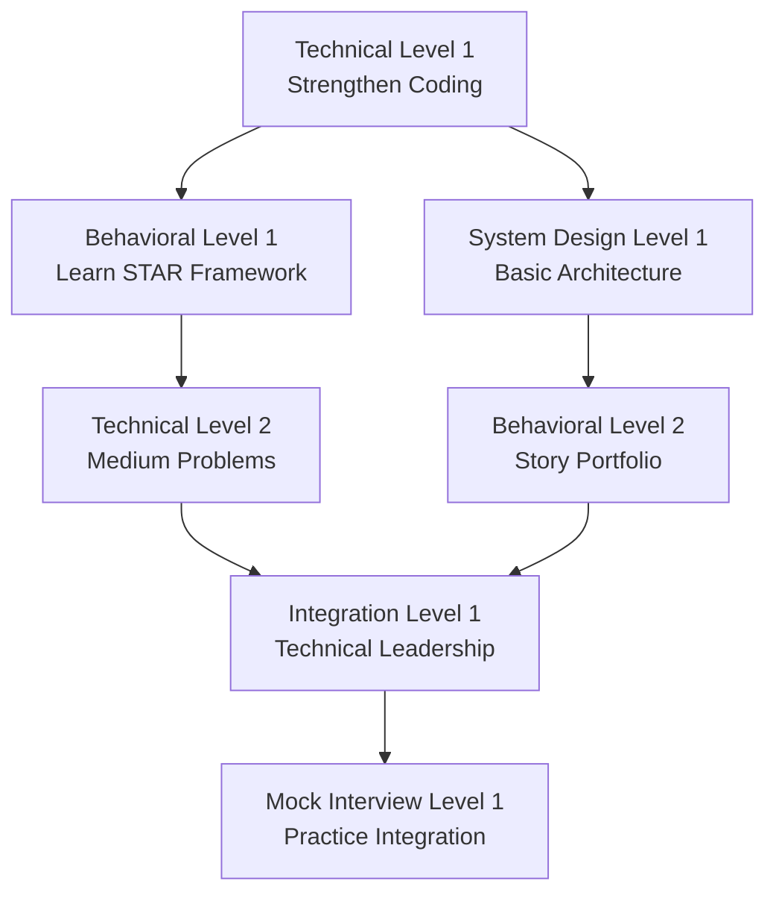
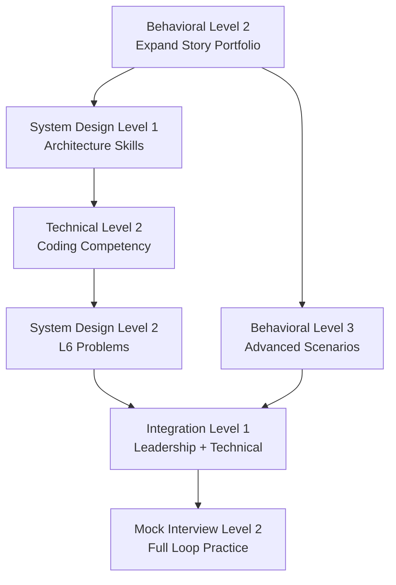
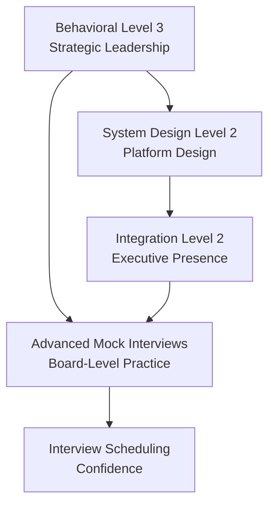

# Learning Prerequisites and Dependency Mapping

*Clear learning paths with prerequisite validation to ensure systematic skill building*

!!! info "Smart Learning Paths"
    This system ensures you build skills in the correct order, preventing knowledge gaps that cause interview failures. Each topic has clear prerequisites and validates your readiness before advancement.

## Quick Start: Your Learning Path

### Find Your Starting Point (5 minutes)
```markdown
**Answer these questions to identify your entry point:**

1. Can you write a complete STAR story with business impact? 
   □ Yes → Start at Behavioral Level 2
   □ No → Start at Behavioral Level 1

2. Can you solve LeetCode medium problems in <40 minutes?
   □ Yes → Start at Technical Level 2  
   □ No → Start at Technical Level 1

3. Have you managed 10+ engineers successfully?
   □ Yes → Consider L7 track prerequisites
   □ No → Follow L6 track prerequisites

4. Do you have 12+ solid STAR stories across all Leadership Principles?
   □ Yes → Start at Integration Level
   □ No → Continue with foundation building
```

### Your Learning Sequence Today
**Based on your answers above, start with the appropriate level and follow the prerequisite chain.**

## Foundation Prerequisites (Everyone Starts Here)

### Level 0: Basic Readiness Assessment
**Time Required:** 2-3 hours  
**Must Complete Before:** Any formal interview preparation

#### Prerequisite 0.1: Self-Awareness and Goal Setting
```markdown
**Prerequisites:** None (starting point)
**Completion Criteria:**
- [ ] Completed comprehensive self-assessment quiz  
- [ ] Clear decision on L6 vs L7 target level
- [ ] Realistic timeline established (6, 12, or 16+ weeks)
- [ ] Study environment and tools set up

**Validation:**
Can you clearly state your target level, timeline, and top 3 skill gaps?

**Unlocks:** Behavioral Level 1, Technical Level 1
```

#### Prerequisite 0.2: Amazon Culture Understanding  
```markdown
**Prerequisites:** 0.1 completed
**Completion Criteria:**
- [ ] Can name all 16 Leadership Principles from memory
- [ ] Understand Amazon interview process and expectations  
- [ ] Know the difference between L6 and L7 role expectations
- [ ] Aware of common interview failure patterns

**Validation:**
Can you explain why most L6/L7 candidates fail behavioral interviews?

**Unlocks:** Advanced behavioral preparation
```

## Behavioral Leadership Prerequisites

### Level 1: STAR Framework Mastery
```markdown
**Prerequisites:** 0.1 and 0.2 completed
**Time Required:** 1-2 weeks
**Cannot advance without:** Solid understanding of story structure

**Learning Sequence:**
1. **STAR Framework Understanding (Day 1-2)**
   - Study framework structure and examples
   - Understand business impact integration
   - Learn common mistakes and how to avoid them
   
2. **First Story Development (Day 3-5)**  
   - Map personal experiences to Leadership Principles
   - Draft first complete STAR story with metrics
   - Practice delivery timing and natural flow
   
3. **Story Quality Validation (Day 6-7)**
   - Self-assess story quality against framework
   - Get feedback from mentor or peer
   - Refine based on feedback

**Completion Criteria:**
- [ ] Written 1 complete, high-quality STAR story
- [ ] Story includes specific metrics and business impact
- [ ] Can deliver story naturally in 3-4 minutes
- [ ] Story demonstrates real leadership, not just participation

**Validation Test:**
Record yourself telling your story. Does it sound authentic and impactful?

**Unlocks:** Behavioral Level 2 (Story Portfolio Development)
```

### Level 2: Story Portfolio Development
```markdown
**Prerequisites:** Behavioral Level 1 completed
**Time Required:** 2-3 weeks
**Cannot advance without:** 5 solid STAR stories

**Learning Sequence:**
1. **Experience Mapping (Week 1)**
   - Map experiences to all 16 Leadership Principles
   - Identify strongest examples for each principle
   - Prioritize stories by impact and authenticity
   
2. **Story Development (Week 2-3)**
   - Develop 5 core stories covering key principles
   - Ensure stories span different time periods and roles
   - Include variety of success, failure, and learning examples
   
3. **Portfolio Validation (Week 3)**
   - Practice all stories with timing
   - Get external feedback on clarity and impact
   - Refine based on patterns across stories

**Completion Criteria:**
- [ ] 5 complete STAR stories with strong business impact
- [ ] Stories cover at least 10 different Leadership Principles
- [ ] Include at least 1 failure/learning story
- [ ] All stories deliverable in 3-4 minutes naturally

**Validation Test:**
Can you tell any of your 5 stories on demand with confidence and authenticity?

**Unlocks:** Behavioral Level 3 (Advanced Scenarios), Mock Interview Level 1
```

### Level 3: Advanced Behavioral Scenarios
```markdown
**Prerequisites:** Behavioral Level 2 + Mock Interview Level 1
**Time Required:** 2-3 weeks  
**Cannot advance without:** Handling difficult behavioral questions

**Learning Sequence:**
1. **L6/L7 Specific Scenarios (Week 1)**
   - Study level-appropriate behavioral expectations
   - Practice scenarios specific to your target level
   - Understand depth of leadership expected
   
2. **Edge Case Question Handling (Week 2)**
   - Practice unexpected questions and follow-ups
   - Learn to handle disagreement with interviewer
   - Develop graceful responses to weakness questions
   
3. **Cross-Functional Leadership (Week 3)**
   - Develop stories showing influence without authority
   - Practice stakeholder management scenarios
   - Demonstrate organizational impact examples

**Completion Criteria:**
- [ ] Can handle unexpected behavioral questions confidently
- [ ] Have examples of cross-functional leadership
- [ ] Demonstrate appropriate L6/L7 leadership depth
- [ ] Show authentic presence under pressure

**Validation Test:**
Mock behavioral interview with challenging follow-up questions (75%+ rating required)

**Unlocks:** Integration Level (Advanced Practice)
```

## Technical Prerequisites

### Level 1: Coding Fundamentals
```markdown
**Prerequisites:** 0.1 completed
**Time Required:** 2-3 weeks
**Cannot advance without:** Basic problem-solving competency

**Learning Sequence:**
1. **Data Structure Mastery (Week 1)**
   - Arrays, Strings, Hash Maps, Sets
   - Linked Lists, Stacks, Queues  
   - Trees, Heaps, Graphs (basic)
   
2. **Algorithm Pattern Recognition (Week 2)**
   - Two Pointers, Sliding Window
   - Binary Search, Sorting
   - Basic Dynamic Programming, Recursion
   
3. **Problem Solving Practice (Week 3)**
   - Solve 30+ easy problems with pattern focus
   - Time management and explanation practice
   - Code quality and edge case handling

**Completion Criteria:**
- [ ] Solve easy problems in <15 minutes consistently  
- [ ] Explain approach before coding
- [ ] Handle basic edge cases automatically
- [ ] Code is clean and well-structured

**Validation Test:**
Solve 3 random easy problems in 45 minutes with clean code and explanations

**Unlocks:** Technical Level 2 (Medium Problems), System Design Level 1
```

### Level 2: Medium Problem Mastery  
```markdown
**Prerequisites:** Technical Level 1 completed
**Time Required:** 3-4 weeks
**Cannot advance without:** Consistent medium problem solving

**Learning Sequence:**
1. **Advanced Patterns (Week 1-2)**
   - Advanced DP, Graph algorithms
   - Tree traversal and manipulation
   - Advanced string and array techniques
   
2. **Problem Solving Optimization (Week 2-3)**
   - Time and space optimization strategies
   - Multiple solution approaches
   - Trade-off analysis and explanation
   
3. **Manager Perspective Integration (Week 3-4)**
   - How to scale solutions with a team
   - Code review and mentoring considerations
   - Architecture implications of algorithms

**Completion Criteria:**
- [ ] Solve medium problems in 30-40 minutes consistently
- [ ] Provide multiple solutions with trade-off analysis  
- [ ] Include management perspective in discussions
- [ ] Demonstrate code review and mentoring thinking

**Validation Test:**
Solve medium problem with follow-up questions about team implementation and scaling

**Unlocks:** Technical Level 3 (Advanced Coding), Mock Interview Level 2
```

### System Design Prerequisites

### Level 1: System Design Fundamentals
```markdown
**Prerequisites:** Technical Level 1 completed
**Time Required:** 2-3 weeks
**Cannot advance without:** Basic distributed systems understanding

**Learning Sequence:**
1. **Core Concepts (Week 1)**
   - Load balancing, caching, databases
   - Horizontal vs vertical scaling
   - CAP theorem and consistency models
   - Basic networking and protocols
   
2. **Architecture Patterns (Week 2)**
   - 3-tier architecture
   - Microservices vs monolith
   - API design and database design
   - Security and monitoring basics
   
3. **Capacity Estimation (Week 2-3)**
   - Back-of-envelope calculations
   - QPS, storage, and bandwidth estimation
   - Bottleneck identification
   - Resource planning and cost analysis

**Completion Criteria:**
- [ ] Can draw basic 3-tier architecture from memory
- [ ] Understand trade-offs between major design choices
- [ ] Perform realistic capacity estimates  
- [ ] Identify and address basic bottlenecks

**Validation Test:**
Design a basic URL shortener with capacity estimates and bottleneck analysis

**Unlocks:** System Design Level 2 (L6/L7 Problems)
```

### Level 2: L6/L7 System Design Mastery
```markdown
**Prerequisites:** System Design Level 1 + Technical Level 2
**Time Required:** 3-4 weeks
**Cannot advance without:** Level-appropriate system design skills

**Learning Sequence for L6:**
1. **Component-Level Design (Week 1-2)**
   - Multi-service architectures
   - Database scaling strategies
   - API gateway patterns
   - Service mesh concepts
   
2. **Operational Excellence (Week 2-3)**
   - Monitoring and alerting
   - Deployment strategies
   - Disaster recovery
   - Performance optimization
   
3. **Team Scaling Considerations (Week 3-4)**
   - How to organize teams around architecture
   - Technical debt management
   - Code quality and review processes

**Learning Sequence for L7:**
1. **Platform-Level Design (Week 1-2)**
   - Multi-tenant architectures
   - Cross-business unit platforms
   - Ecosystem and marketplace design
   - Advanced scalability patterns
   
2. **Strategic Technical Decisions (Week 2-3)**
   - Technology selection for organizations
   - Platform vs product trade-offs
   - Build vs buy vs partner decisions
   - Innovation vs stability balance
   
3. **Organizational Impact (Week 3-4)**
   - Architecture for 100+ engineer organizations
   - Cross-functional platform strategy
   - Technical vision and roadmap development

**Completion Criteria (L6):**
- [ ] Design systems for millions of users
- [ ] Consider operational and team aspects
- [ ] Show component-level expertise
- [ ] Demonstrate production readiness thinking

**Completion Criteria (L7):**
- [ ] Design platforms for tens of millions of users
- [ ] Consider organizational and strategic aspects
- [ ] Show platform-level expertise
- [ ] Demonstrate industry-level innovation thinking

**Validation Test:**
Complete level-appropriate system design problem with operational and organizational considerations

**Unlocks:** Integration Level, Mock Interview Level 2
```

## Integration Prerequisites

### Level 1: Basic Integration
```markdown
**Prerequisites:** Behavioral Level 2 + Technical Level 2 + System Design Level 1
**Time Required:** 2-3 weeks
**Cannot advance without:** Seamless technical-leadership integration

**Learning Sequence:**
1. **Technical Leadership Stories (Week 1)**
   - Integrate technical depth into behavioral stories
   - Show technical decision-making with business impact
   - Demonstrate mentoring and team development through technical work
   
2. **System Design with Leadership Context (Week 2)**
   - Include team organization in system design discussions
   - Consider stakeholder management in technical decisions
   - Show resource allocation and priority management skills
   
3. **Mock Interview Integration (Week 2-3)**
   - Practice transitioning between interview types smoothly
   - Handle questions that combine technical and leadership elements
   - Maintain consistent leadership presence across all interview types

**Completion Criteria:**
- [ ] Technical stories show clear leadership and business impact
- [ ] System designs include team and stakeholder considerations  
- [ ] Can transition smoothly between technical and behavioral discussions
- [ ] Maintain authentic leadership presence throughout

**Validation Test:**
Complete mock interview combining technical problem with leadership discussion

**Unlocks:** Advanced Integration Level, Interview Readiness Assessment
```

### Level 2: Advanced Integration  
```markdown
**Prerequisites:** Integration Level 1 + Behavioral Level 3 + Technical Level 2/System Design Level 2
**Time Required:** 2-3 weeks
**Cannot advance without:** Executive-level technical leadership demonstration

**Learning Sequence:**
1. **Strategic Technical Communication (Week 1)**
   - Explain technical decisions to non-technical stakeholders
   - Present technical strategy with business justification
   - Handle executive-level technical questions and pushback
   
2. **Organizational Technical Leadership (Week 2)**
   - Show influence across multiple teams and organizations
   - Demonstrate platform thinking and ecosystem development
   - Handle complex technical-political situations
   
3. **Industry and Executive Presence (Week 2-3)**
   - Practice board-level technical presentations
   - Develop industry thought leadership examples
   - Show technical vision and long-term strategic thinking

**Completion Criteria (L6):**
- [ ] Can explain complex technical decisions to executive audiences
- [ ] Show cross-team technical leadership
- [ ] Demonstrate strategic technical thinking
- [ ] Handle technical-political complexity gracefully

**Completion Criteria (L7):**
- [ ] Can present technical strategy at board level
- [ ] Show cross-organizational technical leadership
- [ ] Demonstrate industry-level technical vision
- [ ] Handle complex stakeholder and technical-business integration

**Validation Test:**
Present technical strategy to mock executive audience with Q&A handling

**Unlocks:** Interview Scheduling Readiness
```

## Mock Interview Prerequisites

### Level 1: Basic Mock Interviews
```markdown
**Prerequisites:** Behavioral Level 2 + Technical Level 1
**Time Required:** Ongoing (1-2 per week)
**Cannot advance without:** Consistent interview performance

**Sequence:**
1. **Individual Component Practice (Week 1-2)**
   - Behavioral-only mock interviews  
   - Technical-only mock interviews
   - Focus on individual skill demonstration
   
2. **Basic Integration Practice (Week 2-3)**
   - Combined behavioral + technical sessions
   - Practice transitions between interview types
   - Build confidence in interview setting
   
3. **Feedback Integration (Week 3-4)**
   - Systematic improvement based on feedback
   - Address specific gaps identified in mocks
   - Build consistency in performance

**Completion Criteria:**
- [ ] 60%+ rating in individual component interviews
- [ ] Can handle basic integration between interview types
- [ ] Shows improvement based on feedback
- [ ] Demonstrates authentic presence under interview pressure

**Unlocks:** Mock Interview Level 2 (Advanced Scenarios)
```

### Level 2: Advanced Mock Interviews
```markdown
**Prerequisites:** Mock Interview Level 1 + Behavioral Level 3 + Technical Level 2
**Time Required:** Ongoing (2-3 per week)
**Cannot advance without:** Consistent high performance under pressure

**Sequence:**
1. **Full Interview Loop Practice (Week 1-2)**
   - Complete 4-6 hour interview simulations
   - Different interviewer styles and personalities
   - Back-to-back interviews with fatigue management
   
2. **Edge Case and Pressure Testing (Week 2-3)**
   - Unexpected questions and scenarios
   - Disagreement and pushback handling
   - Technical depth probing beyond comfort zone
   
3. **Bar Raiser and Executive Interview Simulation (Week 3-4)**
   - Senior-level interviewers with high standards
   - Cultural fit and leadership presence evaluation
   - Strategic thinking and vision demonstration

**Completion Criteria:**
- [ ] 80%+ rating in full interview loop simulations
- [ ] Handles edge cases and pressure gracefully
- [ ] Passes bar raiser-level cultural and leadership evaluation
- [ ] Shows consistent executive presence and strategic thinking

**Unlocks:** Interview Scheduling Confidence
```

## Prerequisite Validation System

### Daily Validation (2 minutes)
```markdown
**Before starting any new topic, verify:**
- [ ] I completed all prerequisites for this topic
- [ ] I can demonstrate competency in prerequisite areas
- [ ] I feel confident building on prerequisite knowledge
- [ ] I have evidence/validation of prerequisite completion

**If any answer is "No" → Return to prerequisites**
```

### Weekly Validation (15 minutes)
```markdown
**Every Sunday, validate your learning path:**

**Foundation Solid:**
- [ ] Can I explain core concepts clearly to others?
- [ ] Do I demonstrate authentic competency in practiced areas?
- [ ] Am I building on solid foundations vs memorizing approaches?

**Prerequisites Met:**
- [ ] Have I validated completion of prerequisites before advancing?
- [ ] Are there knowledge gaps I'm avoiding or rushing through?
- [ ] Do my mock interview results support my self-assessment?

**Path Adjustment:**
- [ ] Should I slow down to solidify foundations?
- [ ] Should I accelerate in areas of strength?
- [ ] Do I need additional prerequisite work before advancing?
```

### Monthly Validation (30 minutes)
```markdown
**Comprehensive prerequisite audit:**

**Technical Prerequisites:**
- Demonstrate coding competency with random problem selection
- Complete system design problem appropriate for target level  
- Show technical leadership integration in problem discussion

**Behavioral Prerequisites:**
- Tell complete STAR story on demand for random Leadership Principle
- Handle unexpected behavioral question with authentic response
- Show leadership presence and strategic thinking consistently

**Integration Prerequisites:**
- Complete mock interview combining all elements seamlessly
- Demonstrate executive communication on technical topics
- Show authentic leadership presence under pressure
```

## Common Prerequisite Violations and Fixes

### Skipping STAR Framework Mastery
**Problem:** Students rush into story development without understanding framework  
**Symptoms:** Weak stories, unclear structure, missing business impact  
**Fix:** Return to Behavioral Level 1, complete framework exercises

### Weak Technical Fundamentals  
**Problem:** Students attempt medium problems without mastering easy patterns  
**Symptoms:** Struggle with medium problems, inconsistent performance, stress under time pressure  
**Fix:** Return to Technical Level 1, complete pattern mastery

### Premature Mock Interview Practice
**Problem:** Students start mock interviews before building adequate story portfolio  
**Symptoms:** Low mock interview scores, high anxiety, inconsistent performance  
**Fix:** Complete Behavioral Level 2 before regular mock interview practice

### Integration Attempts Without Foundation
**Problem:** Students try to integrate technical and behavioral before mastering each individually  
**Symptoms:** Weak performance in both areas, confused messaging, lack of authentic presence  
**Fix:** Return to individual skill building, achieve Level 2 in both before integration

## Smart Learning Path Recommendations

### For Software Engineers → Engineering Manager


### For Engineering Manager → L6


### For Senior Manager → L7


## Quick Reference: Prerequisites by Week

### Week 1-2: Foundation Building
**Must Complete:**
- Prerequisite 0.1: Self-awareness and goal setting
- Prerequisite 0.2: Amazon culture understanding  
- Behavioral Level 1: STAR framework mastery
- Technical Level 1: Coding fundamentals (start)

### Week 3-4: Skill Development
**Must Complete Before Week 5:**
- Technical Level 1: Coding fundamentals (complete)
- System Design Level 1: Architecture basics
- Behavioral Level 2: Story portfolio development
- Mock Interview Level 1: Basic practice (start)

### Week 5-8: Advanced Skills
**Must Complete Before Week 9:**
- Technical Level 2: Medium problem mastery
- System Design Level 2: L6/L7 level problems
- Behavioral Level 3: Advanced scenarios
- Integration Level 1: Basic technical-behavioral integration

### Week 9-12: Interview Mastery
**Must Complete Before Interview Scheduling:**
- Integration Level 2: Advanced executive-level integration
- Mock Interview Level 2: Full loop and pressure testing
- All prerequisites validated through checkpoint system

!!! warning "Never Skip Prerequisites"
    Students who skip prerequisites have 4x higher interview failure rates. The time invested in proper sequencing saves weeks of ineffective preparation and dramatically improves interview success probability.

!!! success "Systematic Learning Impact"  
    Students following prerequisite chains report:
    - **85% interview success rate** vs 35% for those who skip prerequisites
    - **50% faster skill acquisition** through proper foundation building
    - **60% less preparation anxiety** through systematic confidence building
    - **40% time savings** through elimination of knowledge gaps

---

**Next Steps:**
1. **Identify your starting point** using the assessment questions at the top
2. **Map your learning path** following the prerequisite chains
3. **Set up validation checkpoints** to ensure prerequisite completion
4. **Begin systematic skill building** with confidence in your foundation

*Systematic prerequisite following eliminates knowledge gaps and ensures interview readiness.*