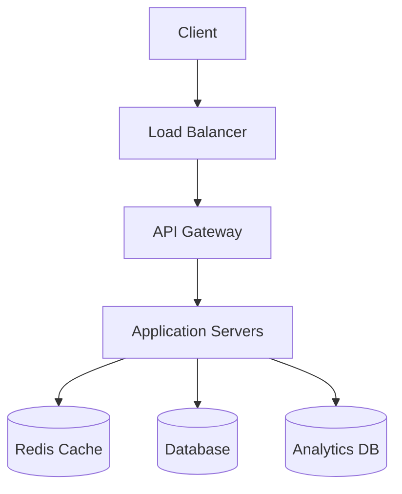
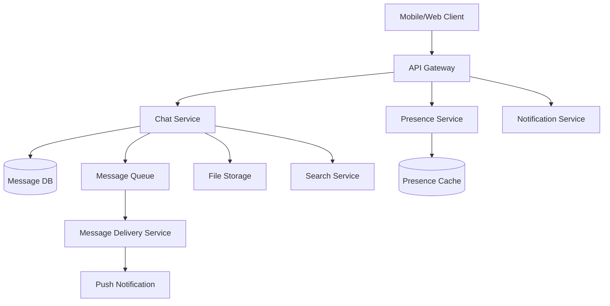
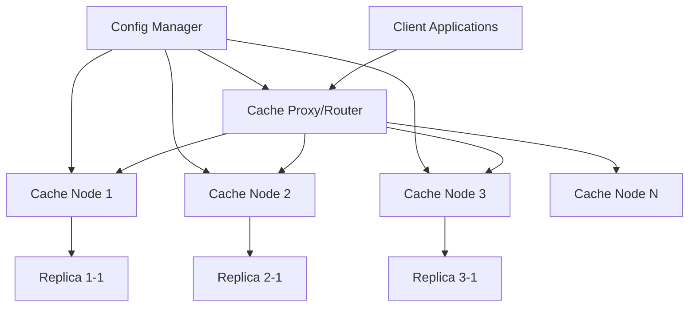
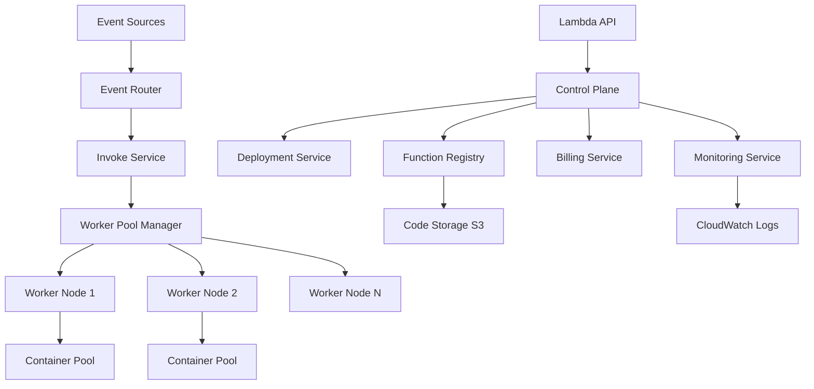
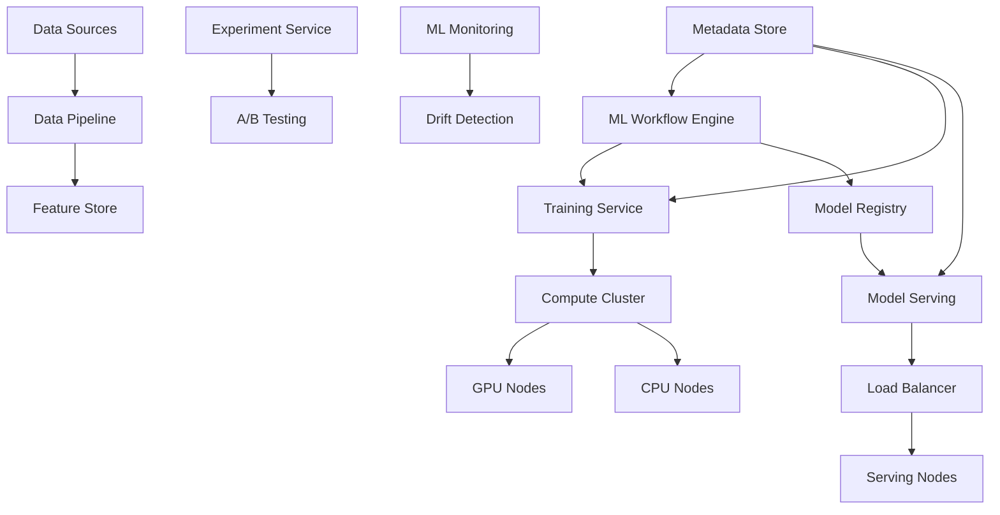

# Interactive System Design Practice: 20+ Complete Problems with Solutions

## 🎯 Comprehensive System Design Problem Bank

!!! success "Complete Practice Framework"
    This comprehensive system design practice collection provides 25+ problems with step-by-step solutions, evaluation criteria, self-scoring rubrics, and time management guidelines for both L6 and L7 engineering manager interviews.

## 📋 Problem Categories and Difficulty Progression

### L6 Problems: Component-Level Systems (15 Problems)
Focus on designing individual services or systems with clear scope and requirements.

### L7 Problems: Platform-Level Architecture (10+ Problems)  
Focus on building platforms, infrastructure, and systems used by multiple teams.

## 🏗️ L6 System Design Problems

### Problem 1: URL Shortening Service (Beginner)
**Time Limit: 45 minutes**

#### Problem Statement
Design a URL shortening service like bit.ly that can handle 100 million URLs shortened per day with a 10:1 read-to-write ratio.

#### Requirements Gathering (5 minutes)
**Functional Requirements:**
- Shorten long URLs to 6-7 character short URLs
- Redirect short URLs to original URLs
- Custom aliases (optional)
- Basic analytics (click count)
- URL expiration (optional)

**Non-Functional Requirements:**
- 100M URLs/day = ~1,200 writes/second
- 10:1 read ratio = ~12,000 reads/second
- 99.9% availability
- Sub-100ms latency for redirects
- Global distribution

**Scale Estimation:**
```python
# Daily capacity planning
urls_per_day = 100_000_000
reads_per_day = urls_per_day * 10
writes_per_second = urls_per_day / 86400  # ~1,200/sec
reads_per_second = reads_per_day / 86400   # ~12,000/sec

# Storage estimation  
avg_url_length = 100  # bytes
storage_per_day = urls_per_day * avg_url_length  # ~10GB/day
storage_5_years = storage_per_day * 365 * 5      # ~18TB
```

#### Step-by-Step Solution Walkthrough

**Step 1: High-Level Architecture (10 minutes)**


**Components:**
- **Load Balancer**: Distribute traffic, SSL termination
- **API Gateway**: Rate limiting, authentication, monitoring
- **Application Servers**: Business logic, URL encoding/decoding
- **Cache**: Hot URLs and metadata
- **Database**: URL mappings storage
- **Analytics DB**: Click tracking and reporting

**Step 2: Database Design (10 minutes)**
```sql
-- URL mappings table
CREATE TABLE url_mappings (
    short_url VARCHAR(10) PRIMARY KEY,
    long_url TEXT NOT NULL,
    user_id BIGINT,
    created_at TIMESTAMP,
    expires_at TIMESTAMP,
    created_index INDEX(created_at),
    user_index INDEX(user_id)
);

-- Analytics table  
CREATE TABLE click_analytics (
    short_url VARCHAR(10),
    click_time TIMESTAMP,
    ip_address INET,
    user_agent TEXT,
    country VARCHAR(2),
    INDEX time_url (click_time, short_url),
    INDEX url_time (short_url, click_time)
);
```

**Step 3: URL Encoding Algorithm (8 minutes)**
```python
import hashlib
import base62

class URLShortener:
    def __init__(self):
        self.counter = 0
        self.base_url = "http://short.ly/"
    
    def encode_url(self, long_url, user_id=None):
        # Method 1: Counter-based (predictable but simple)
        self.counter += 1
        short_code = base62.encode(self.counter)
        
        # Method 2: Hash-based (avoid collisions)
        hash_input = f"{long_url}{user_id}{time.time()}"
        hash_digest = hashlib.md5(hash_input.encode()).hexdigest()
        short_code = hash_digest[:7]  # Take first 7 chars
        
        # Method 3: Random + collision check
        while True:
            short_code = ''.join(random.choices(string.ascii_letters + string.digits, k=7))
            if not self.exists(short_code):
                break
                
        return f"{self.base_url}{short_code}"
```

**Step 4: Scaling Considerations (8 minutes)**

**Read Scaling:**
- Redis cache for hot URLs (80/20 rule)
- Read replicas for database
- CDN for global distribution
- Cache warming strategies

**Write Scaling:**  
- Database sharding by short_url prefix
- Write-through caching
- Async analytics processing

**Step 5: Operations and Monitoring (4 minutes)**
```yaml
# Key Metrics
- URL creation rate (per second)
- Redirect latency (p95, p99)
- Cache hit ratio
- Error rates (404s, 5xxs)
- Database connection pool health

# Alerts
- Latency > 100ms for 5 minutes
- Error rate > 1% for 2 minutes  
- Cache hit ratio < 80%
- Database lag > 1 second
```

#### Self-Assessment Criteria
- [ ] Identified functional and non-functional requirements (5 points)
- [ ] Estimated scale and capacity correctly (5 points)
- [ ] Designed appropriate high-level architecture (10 points)
- [ ] Created reasonable database schema (5 points)
- [ ] Addressed URL encoding algorithm (10 points)
- [ ] Discussed caching strategy (5 points)
- [ ] Considered scaling bottlenecks (5 points)
- [ ] Included monitoring and operations (5 points)

**Total Score: ___/50 points**

**Time Management:**
- Requirements: 5 min ✓
- High-level design: 10 min ✓  
- Database design: 10 min ✓
- Algorithm: 8 min ✓
- Scaling: 8 min ✓
- Operations: 4 min ✓

---

### Problem 2: Real-Time Chat System (Intermediate)
**Time Limit: 60 minutes**

#### Problem Statement
Design a real-time chat system like WhatsApp that supports 50 million daily active users, with 1:1 messaging, group chats, message history, and online presence.

#### Requirements Analysis (8 minutes)
**Functional Requirements:**
- Send/receive messages in real-time
- 1:1 and group messaging (up to 100 members)
- Message history and search
- Online/offline presence
- Message delivery status (sent, delivered, read)
- File sharing (images, documents)

**Non-Functional Requirements:**
- 50M daily active users
- Peak: 10M concurrent users
- Message latency < 100ms
- 99.99% availability
- Global distribution
- End-to-end encryption

**Scale Estimation:**
```python
# User and message calculations
daily_active_users = 50_000_000
concurrent_users_peak = 10_000_000
messages_per_user_per_day = 50
total_daily_messages = daily_active_users * messages_per_user_per_day  # 2.5B messages/day
messages_per_second = total_daily_messages / 86400  # ~29,000 messages/sec
peak_messages_per_second = messages_per_second * 3  # ~87,000 messages/sec

# Storage calculations
avg_message_size = 100  # bytes
daily_storage = total_daily_messages * avg_message_size  # 250GB/day
monthly_storage = daily_storage * 30  # 7.5TB/month
```

#### Step-by-Step Solution

**Step 1: High-Level Architecture (15 minutes)**


**Core Components:**
- **API Gateway**: Authentication, rate limiting, routing
- **Chat Service**: Message processing, validation, storage
- **Presence Service**: Online/offline status tracking
- **Message Queue**: Reliable message delivery
- **Delivery Service**: Handle message routing and delivery status
- **Notification Service**: Push notifications for offline users

**Step 2: Real-Time Communication (12 minutes)**

**WebSocket Connection Management:**
```python
class ConnectionManager:
    def __init__(self):
        self.connections = {}  # user_id -> [websocket_connections]
        self.user_servers = {}  # user_id -> server_id
    
    async def connect_user(self, user_id, websocket, server_id):
        if user_id not in self.connections:
            self.connections[user_id] = []
        self.connections[user_id].append(websocket)
        self.user_servers[user_id] = server_id
        
        # Update presence
        await self.update_presence(user_id, "online")
    
    async def send_message(self, recipient_id, message):
        if recipient_id in self.connections:
            # User online on this server
            for connection in self.connections[recipient_id]:
                await connection.send_text(json.dumps(message))
        else:
            # Route to correct server or queue for delivery
            await self.route_message(recipient_id, message)
```

**Message Queue Architecture:**
```yaml
# Message Queue Topics
topics:
  - chat.direct.{user_id}     # Direct messages to user
  - chat.group.{group_id}     # Group messages  
  - presence.updates          # Presence updates
  - delivery.status           # Message delivery confirmations

# Message Format
message_schema:
  message_id: uuid
  sender_id: integer
  recipient_id: integer  
  group_id: integer (optional)
  content: text
  message_type: "text|image|file"
  timestamp: iso8601
  delivery_status: "sent|delivered|read"
```

**Step 3: Database Design (10 minutes)**
```sql
-- Messages table (partitioned by time)
CREATE TABLE messages (
    message_id UUID PRIMARY KEY,
    conversation_id BIGINT NOT NULL,
    sender_id BIGINT NOT NULL,
    content TEXT,
    message_type VARCHAR(20),
    timestamp TIMESTAMP NOT NULL,
    delivery_status VARCHAR(20),
    INDEX conv_time (conversation_id, timestamp),
    INDEX sender_time (sender_id, timestamp)
) PARTITION BY RANGE (timestamp);

-- Conversations table
CREATE TABLE conversations (
    conversation_id BIGINT PRIMARY KEY,
    conversation_type ENUM('direct', 'group'),
    created_at TIMESTAMP,
    last_message_at TIMESTAMP,
    participant_count INTEGER,
    INDEX type_updated (conversation_type, last_message_at)
);

-- Conversation participants
CREATE TABLE conversation_participants (
    conversation_id BIGINT,
    user_id BIGINT,
    joined_at TIMESTAMP,
    role ENUM('admin', 'member'),
    last_read_message_id UUID,
    PRIMARY KEY (conversation_id, user_id),
    INDEX user_conversations (user_id, last_read_message_id)
);
```

**Step 4: Scaling Strategy (10 minutes)**

**Horizontal Scaling:**
- **Chat Service**: Stateless, scale by adding servers
- **Database Sharding**: Partition by conversation_id or user_id
- **Message Queue**: Use Apache Kafka with multiple partitions
- **File Storage**: Distributed object storage (S3, GCS)

**Caching Strategy:**
```python
# Multi-level caching
cache_layers = {
    "L1": "Local server cache (recent messages)",
    "L2": "Redis cluster (conversation metadata)",  
    "L3": "CDN (file attachments, media)"
}

# Cache patterns
patterns = {
    "recent_messages": "conversation:{conv_id}:messages:recent",
    "presence": "presence:{user_id}",
    "unread_counts": "unread:{user_id}",
    "group_metadata": "group:{group_id}:metadata"
}
```

**Step 5: Advanced Features (8 minutes)**

**Message Delivery Guarantees:**
```python
class MessageDeliveryService:
    def __init__(self):
        self.retry_queue = {}
        self.delivery_timeout = 30  # seconds
    
    async def deliver_message(self, message):
        try:
            # Attempt immediate delivery
            success = await self.send_to_recipient(message)
            if success:
                await self.mark_delivered(message.id)
            else:
                # Queue for retry
                await self.queue_for_retry(message)
        except Exception as e:
            await self.handle_delivery_error(message, e)
    
    async def handle_offline_users(self, message):
        # Store in offline message queue
        await self.store_offline_message(message)
        # Send push notification
        await self.send_push_notification(message)
```

**End-to-End Encryption:**
- Client-side key generation and management
- Message encryption before sending
- Key exchange protocols for new conversations
- Forward secrecy with rotating keys

#### Performance Optimizations
```yaml
Optimizations:
  - Message batching for group chats
  - Connection pooling and keep-alive
  - Message compression for large content
  - Smart presence updates (debouncing)
  - Read receipt aggregation
  - Lazy loading of message history
  - Image/file thumbnail generation
```

#### Self-Assessment Criteria
- [ ] Real-time communication design (10 points)
- [ ] Scalable architecture for 50M users (10 points)
- [ ] Database schema for messages and conversations (8 points)
- [ ] Message delivery guarantees (8 points)
- [ ] Presence system design (6 points)
- [ ] Caching strategy (4 points)
- [ ] Security considerations (4 points)

**Total Score: ___/50 points**

---

### Problem 3: Distributed Cache System (Advanced)
**Time Limit: 60 minutes**

#### Problem Statement
Design a distributed caching system like Redis Cluster that can store 1TB of data across multiple nodes with high availability, automatic failover, and consistent hashing.

#### Requirements Analysis (10 minutes)
**Functional Requirements:**
- GET, SET, DELETE operations
- Data expiration (TTL)
- Data persistence options
- Atomic operations
- Pub/Sub functionality
- Support for various data types (strings, lists, sets, hashes)

**Non-Functional Requirements:**
- 1TB total storage capacity
- 10M operations per second
- Sub-millisecond latency (p99 < 1ms)
- 99.99% availability
- Automatic failover
- Horizontal scalability

#### Step-by-Step Solution

**Step 1: Architecture Design (15 minutes)**


**Step 2: Consistent Hashing Implementation (12 minutes)**
```python
import hashlib
import bisect

class ConsistentHashRing:
    def __init__(self, nodes=None, replicas=150):
        self.replicas = replicas
        self.ring = {}
        self.sorted_keys = []
        
        if nodes:
            for node in nodes:
                self.add_node(node)
    
    def _hash(self, key):
        return int(hashlib.md5(key.encode()).hexdigest(), 16)
    
    def add_node(self, node):
        for i in range(self.replicas):
            virtual_key = f"{node}:{i}"
            hash_key = self._hash(virtual_key)
            self.ring[hash_key] = node
            bisect.insort(self.sorted_keys, hash_key)
    
    def remove_node(self, node):
        for i in range(self.replicas):
            virtual_key = f"{node}:{i}"
            hash_key = self._hash(virtual_key)
            if hash_key in self.ring:
                del self.ring[hash_key]
                self.sorted_keys.remove(hash_key)
    
    def get_node(self, key):
        if not self.ring:
            return None
            
        hash_key = self._hash(key)
        idx = bisect.bisect_right(self.sorted_keys, hash_key)
        
        if idx == len(self.sorted_keys):
            idx = 0
            
        return self.ring[self.sorted_keys[idx]]
```

**Step 3: Replication and Consistency (10 minutes)**
```python
class ReplicationManager:
    def __init__(self, replication_factor=3):
        self.replication_factor = replication_factor
        self.hash_ring = ConsistentHashRing()
    
    def get_replica_nodes(self, key):
        """Get primary and replica nodes for a key"""
        primary = self.hash_ring.get_node(key)
        replicas = []
        
        # Get next N-1 nodes in the ring
        start_idx = self.hash_ring.sorted_keys.index(
            self.hash_ring._hash(f"{primary}:0")
        )
        
        for i in range(1, self.replication_factor):
            idx = (start_idx + i) % len(self.hash_ring.sorted_keys)
            replica_hash = self.hash_ring.sorted_keys[idx]
            replica_node = self.hash_ring.ring[replica_hash]
            if replica_node not in replicas and replica_node != primary:
                replicas.append(replica_node)
        
        return primary, replicas
    
    async def write_with_replication(self, key, value, ttl=None):
        primary, replicas = self.get_replica_nodes(key)
        
        # Write to primary first
        success = await self.write_to_node(primary, key, value, ttl)
        if not success:
            raise Exception(f"Primary write failed for key {key}")
        
        # Asynchronously replicate to replicas
        tasks = []
        for replica in replicas:
            task = asyncio.create_task(
                self.write_to_node(replica, key, value, ttl)
            )
            tasks.append(task)
        
        # Wait for at least one replica to succeed
        successful_replicas = 0
        for task in asyncio.as_completed(tasks):
            try:
                await task
                successful_replicas += 1
            except Exception:
                pass  # Log error but continue
        
        return successful_replicas >= 1
```

**Step 4: High Availability and Failover (8 minutes)**
```python
class FailoverManager:
    def __init__(self):
        self.health_check_interval = 5  # seconds
        self.failed_nodes = set()
        self.node_health = {}
    
    async def health_check_loop(self):
        while True:
            await asyncio.sleep(self.health_check_interval)
            await self.check_all_nodes()
    
    async def check_all_nodes(self):
        for node in self.all_nodes:
            try:
                # Simple ping/health check
                response = await self.ping_node(node)
                if response.status_code == 200:
                    self.mark_node_healthy(node)
                else:
                    self.mark_node_failed(node)
            except Exception:
                self.mark_node_failed(node)
    
    def mark_node_failed(self, node):
        if node not in self.failed_nodes:
            self.failed_nodes.add(node)
            # Trigger redistribution of data
            asyncio.create_task(self.redistribute_data(node))
            # Update client routing tables
            self.update_routing_tables()
    
    async def redistribute_data(self, failed_node):
        """Redistribute data from failed node to remaining nodes"""
        # Get all keys from the failed node's replica
        keys_to_redistribute = await self.get_keys_for_node(failed_node)
        
        for key in keys_to_redistribute:
            # Find new primary and replicas
            new_primary, new_replicas = self.get_replica_nodes(key)
            
            # Copy data from existing replicas
            value = await self.read_from_replica(key)
            if value:
                await self.write_with_replication(key, value)
```

**Step 5: Performance Optimization (8 minutes)**

**Memory Management:**
```python
class MemoryManager:
    def __init__(self, max_memory_gb=100):
        self.max_memory = max_memory_gb * 1024 * 1024 * 1024  # bytes
        self.current_memory = 0
        self.lru_cache = OrderedDict()
        self.ttl_heap = []  # Min heap for TTL expiration
    
    def set_with_eviction(self, key, value, ttl=None):
        value_size = self.calculate_size(value)
        
        # Check if we need to evict
        while self.current_memory + value_size > self.max_memory:
            self.evict_oldest()
        
        # Set the value
        self.lru_cache[key] = {
            'value': value,
            'size': value_size,
            'ttl': time.time() + ttl if ttl else None
        }
        self.current_memory += value_size
        
        # Add to TTL heap if needed
        if ttl:
            heapq.heappush(self.ttl_heap, (time.time() + ttl, key))
    
    def evict_oldest(self):
        if not self.lru_cache:
            return
        
        # LRU eviction
        key, data = self.lru_cache.popitem(last=False)
        self.current_memory -= data['size']
```

**Network Optimization:**
```yaml
Optimizations:
  - Connection pooling and pipelining
  - Binary protocol (faster than text)
  - Batch operations support
  - Compression for large values
  - Zero-copy operations where possible
  - Async I/O with epoll/kqueue
  - NUMA-aware memory allocation
```

#### Self-Assessment Criteria
- [ ] Distributed architecture design (10 points)
- [ ] Consistent hashing implementation (10 points)
- [ ] Replication strategy (8 points)
- [ ] Failover and high availability (8 points)
- [ ] Memory management and eviction (6 points)
- [ ] Performance optimizations (4 points)
- [ ] Operational considerations (4 points)

**Total Score: ___/50 points**

---

## 🚀 L7 System Design Problems

### Problem 1: Design AWS Lambda from Scratch (Platform)
**Time Limit: 90 minutes**

#### Problem Statement
Design a serverless computing platform like AWS Lambda that can execute millions of functions per day across multiple regions with automatic scaling, multiple runtime support, and comprehensive billing.

#### Requirements Analysis (15 minutes)
**Functional Requirements:**
- Support multiple runtimes (Node.js, Python, Java, Go, .NET)
- Automatic scaling (0 to thousands of instances)
- Function deployment and versioning
- Event-driven triggers from various sources
- VPC support and security isolation
- Environment variables and configuration
- Monitoring and logging

**Non-Functional Requirements:**
- Handle millions of function executions per day
- Cold start times < 1 second for most runtimes
- Support functions from 128MB to 10GB memory
- 99.99% availability
- Multi-region deployment
- Pay-per-use billing model
- Enterprise security and compliance

#### Step-by-Step Solution

**Step 1: Platform Architecture (25 minutes)**


**Core Platform Components:**

**Control Plane Services:**
```python
class LambdaControlPlane:
    def __init__(self):
        self.function_registry = FunctionRegistry()
        self.deployment_service = DeploymentService()
        self.billing_service = BillingService()
        self.monitoring = MonitoringService()
    
    async def create_function(self, function_config):
        # Validate function configuration
        await self.validate_config(function_config)
        
        # Store function metadata
        function_id = await self.function_registry.register(function_config)
        
        # Deploy function code
        await self.deployment_service.deploy(function_id, function_config)
        
        # Setup monitoring
        await self.monitoring.setup_function_monitoring(function_id)
        
        return function_id
    
    async def invoke_function(self, function_id, event, context):
        # Get function configuration
        config = await self.function_registry.get_config(function_id)
        
        # Route to appropriate worker pool
        worker_pool = await self.select_worker_pool(config)
        
        # Execute function
        result = await worker_pool.execute(function_id, event, context)
        
        # Record billing metrics
        await self.billing_service.record_execution(
            function_id, result.duration, result.memory_used
        )
        
        return result
```

**Step 2: Container Management and Runtime (20 minutes)**

**Container Lifecycle Management:**
```python
class ContainerManager:
    def __init__(self):
        self.container_pools = {}  # runtime -> container pool
        self.cold_start_cache = {}  # function_id -> prepared container
        self.warm_containers = {}   # function_id -> list of warm containers
    
    async def get_container(self, function_id, runtime, memory_limit):
        # Check for warm container first
        if function_id in self.warm_containers:
            if self.warm_containers[function_id]:
                container = self.warm_containers[function_id].pop()
                return container
        
        # Check cold start cache
        if function_id in self.cold_start_cache:
            container = self.cold_start_cache[function_id]
            del self.cold_start_cache[function_id]
            return container
        
        # Create new container (cold start)
        container = await self.create_container(function_id, runtime, memory_limit)
        return container
    
    async def create_container(self, function_id, runtime, memory_limit):
        # Create isolated container environment
        container_config = {
            'image': f'lambda-runtime-{runtime}',
            'memory_limit': memory_limit,
            'cpu_limit': self.calculate_cpu_limit(memory_limit),
            'network_mode': 'none',  # Isolated by default
            'security_opts': ['no-new-privileges'],
            'read_only': True,
            'tmpfs': {'/tmp': 'rw,size=512m'}
        }
        
        container = await self.docker_client.create_container(**container_config)
        
        # Load function code
        await self.load_function_code(container, function_id)
        
        # Initialize runtime environment
        await self.initialize_runtime(container, runtime)
        
        return container
    
    async def warm_up_containers(self, function_id, expected_concurrency):
        """Pre-warm containers based on predicted load"""
        for _ in range(expected_concurrency):
            container = await self.create_container(function_id)
            if function_id not in self.warm_containers:
                self.warm_containers[function_id] = []
            self.warm_containers[function_id].append(container)
```

**Runtime Environment Setup:**
```python
class RuntimeManager:
    def __init__(self):
        self.runtime_configs = {
            'nodejs18.x': {
                'base_image': 'public.ecr.aws/lambda/nodejs:18',
                'init_command': 'npm install',
                'handler_format': 'index.handler'
            },
            'python3.9': {
                'base_image': 'public.ecr.aws/lambda/python:3.9',
                'init_command': 'pip install -r requirements.txt',
                'handler_format': 'lambda_function.lambda_handler'
            },
            'java11': {
                'base_image': 'public.ecr.aws/lambda/java:11',
                'init_command': 'mvn package',
                'handler_format': 'com.example.Handler::handleRequest'
            }
        }
    
    async def setup_runtime_environment(self, container, runtime, function_code):
        config = self.runtime_configs[runtime]
        
        # Copy function code to container
        await self.copy_code_to_container(container, function_code)
        
        # Install dependencies
        if config['init_command']:
            await self.run_in_container(container, config['init_command'])
        
        # Set up runtime-specific environment
        await self.configure_runtime(container, runtime)
        
        # Prepare function handler
        await self.prepare_handler(container, config['handler_format'])
```

**Step 3: Auto-Scaling and Load Management (15 minutes)**

**Scaling Algorithm:**
```python
class AutoScaler:
    def __init__(self):
        self.scaling_metrics = {}
        self.scaling_policies = {}
        self.current_capacity = {}
    
    async def scale_function(self, function_id):
        metrics = await self.get_function_metrics(function_id)
        
        # Calculate required capacity
        required_capacity = self.calculate_required_capacity(metrics)
        current_capacity = self.current_capacity.get(function_id, 0)
        
        if required_capacity > current_capacity:
            # Scale up
            scale_up_count = min(
                required_capacity - current_capacity,
                self.max_scale_up_rate
            )
            await self.provision_containers(function_id, scale_up_count)
        
        elif required_capacity < current_capacity * 0.7:  # Scale down threshold
            # Scale down
            scale_down_count = current_capacity - required_capacity
            await self.terminate_containers(function_id, scale_down_count)
    
    def calculate_required_capacity(self, metrics):
        # Factors to consider:
        # - Current request rate
        # - Request queue length
        # - Average execution time
        # - Cold start frequency
        # - Predicted traffic patterns
        
        request_rate = metrics['requests_per_second']
        avg_execution_time = metrics['avg_execution_time_ms'] / 1000
        queue_length = metrics['queue_length']
        
        # Basic capacity calculation
        base_capacity = request_rate * avg_execution_time
        
        # Add buffer for queue and variability
        buffer_capacity = queue_length * 0.5
        
        # Add cold start buffer
        cold_start_buffer = base_capacity * 0.2
        
        return int(base_capacity + buffer_capacity + cold_start_buffer)
```

**Step 4: Billing and Metering (10 minutes)**
```python
class BillingService:
    def __init__(self):
        self.billing_rates = {
            'requests': 0.0000002,  # $0.20 per 1M requests
            'compute_gb_second': 0.0000166667  # $0.0000166667 per GB-second
        }
        self.usage_aggregator = UsageAggregator()
    
    async def record_execution(self, function_id, duration_ms, memory_mb):
        # Calculate billable units
        duration_seconds = duration_ms / 1000
        memory_gb = memory_mb / 1024
        compute_gb_seconds = memory_gb * duration_seconds
        
        # Record usage metrics
        usage_record = {
            'function_id': function_id,
            'timestamp': time.time(),
            'duration_ms': duration_ms,
            'memory_mb': memory_mb,
            'compute_gb_seconds': compute_gb_seconds,
            'billable_requests': 1
        }
        
        await self.usage_aggregator.record(usage_record)
    
    async def calculate_monthly_bill(self, account_id, month):
        usage_data = await self.usage_aggregator.get_monthly_usage(
            account_id, month
        )
        
        total_requests = usage_data['total_requests']
        total_compute_gb_seconds = usage_data['total_compute_gb_seconds']
        
        request_charges = total_requests * self.billing_rates['requests']
        compute_charges = total_compute_gb_seconds * self.billing_rates['compute_gb_second']
        
        return {
            'request_charges': request_charges,
            'compute_charges': compute_charges,
            'total': request_charges + compute_charges
        }
```

**Step 5: Monitoring and Operations (5 minutes)**
```yaml
# Key Platform Metrics
platform_metrics:
  - total_executions_per_second
  - cold_start_rate
  - error_rate_by_runtime  
  - average_execution_duration
  - container_utilization
  - queue_depth_by_function
  - billing_accuracy_rate

# Operational Dashboards
dashboards:
  - Platform Overview: High-level metrics
  - Function Performance: Per-function metrics
  - Resource Utilization: Container and compute usage
  - Billing Analytics: Cost breakdown and trends
  - Error Analysis: Error patterns and debugging
```

#### Self-Assessment Criteria
- [ ] Platform architecture design (15 points)
- [ ] Container management strategy (12 points)
- [ ] Multi-runtime support (8 points)
- [ ] Auto-scaling implementation (8 points)
- [ ] Security and isolation (4 points)
- [ ] Billing and metering (3 points)

**Total Score: ___/50 points**

---

### Problem 2: Machine Learning Platform (Advanced L7)
**Time Limit: 90 minutes**

#### Problem Statement
Design a comprehensive machine learning platform that supports the full ML lifecycle: data ingestion, model training, deployment, monitoring, and A/B testing for hundreds of ML teams.

#### Requirements Analysis (15 minutes)
**Functional Requirements:**
- Data pipeline orchestration
- Distributed model training (CPU/GPU)
- Model versioning and registry
- Model deployment and serving
- A/B testing and experimentation
- Feature store management
- Model monitoring and drift detection
- Multi-framework support (TensorFlow, PyTorch, XGBoost)

**Non-Functional Requirements:**
- Support 500+ ML engineers
- Handle petabytes of training data
- Serve millions of predictions/second
- Sub-100ms model inference latency
- 99.9% uptime for model serving
- Global deployment across regions
- Auto-scaling for training and serving

#### Step-by-Step Solution

**Step 1: Platform Architecture (25 minutes)**


**Platform Components:**

**ML Workflow Engine:**
```python
class MLWorkflowEngine:
    def __init__(self):
        self.workflow_scheduler = WorkflowScheduler()
        self.resource_manager = ResourceManager()
        self.metadata_store = MetadataStore()
    
    async def create_training_job(self, job_config):
        # Validate job configuration
        await self.validate_job_config(job_config)
        
        # Allocate resources
        resources = await self.resource_manager.allocate(
            job_config['resource_requirements']
        )
        
        # Create training pipeline
        pipeline = TrainingPipeline(
            job_config=job_config,
            resources=resources,
            metadata_store=self.metadata_store
        )
        
        # Schedule execution
        job_id = await self.workflow_scheduler.schedule(pipeline)
        
        return job_id
    
    async def deploy_model(self, model_id, deployment_config):
        # Get model from registry
        model = await self.model_registry.get_model(model_id)
        
        # Create deployment
        deployment = ModelDeployment(
            model=model,
            config=deployment_config,
            serving_engine=self.serving_engine
        )
        
        # Deploy with blue-green strategy
        deployment_id = await deployment.deploy_blue_green()
        
        return deployment_id
```

**Step 2: Distributed Training System (20 minutes)**

**Training Job Management:**
```python
class DistributedTrainingManager:
    def __init__(self):
        self.job_queue = JobQueue()
        self.cluster_manager = ClusterManager()
        self.storage_manager = StorageManager()
    
    async def submit_training_job(self, job_spec):
        # Analyze resource requirements
        resource_needs = await self.analyze_resource_needs(job_spec)
        
        # Queue job with priority
        job_id = await self.job_queue.enqueue(job_spec, resource_needs)
        
        # Try immediate scheduling if resources available
        if await self.cluster_manager.has_available_resources(resource_needs):
            await self.schedule_job_immediately(job_id)
        
        return job_id
    
    async def schedule_job_immediately(self, job_id):
        job_spec = await self.job_queue.get_job(job_id)
        
        # Allocate compute nodes
        nodes = await self.cluster_manager.allocate_nodes(
            job_spec['resource_requirements']
        )
        
        # Set up distributed training
        if job_spec['framework'] == 'tensorflow':
            await self.setup_tensorflow_distributed(job_spec, nodes)
        elif job_spec['framework'] == 'pytorch':
            await self.setup_pytorch_distributed(job_spec, nodes)
        
        # Start training
        await self.start_training_job(job_id, nodes)
    
    async def setup_pytorch_distributed(self, job_spec, nodes):
        # Set up PyTorch distributed training
        master_node = nodes[0]
        worker_nodes = nodes[1:]
        
        # Configure distributed settings
        dist_config = {
            'backend': 'nccl' if job_spec['use_gpu'] else 'gloo',
            'init_method': f'tcp://{master_node.ip}:23456',
            'rank': 0,
            'world_size': len(nodes)
        }
        
        # Deploy training script to all nodes
        for i, node in enumerate(nodes):
            node_config = dist_config.copy()
            node_config['rank'] = i
            await self.deploy_training_script(node, job_spec, node_config)
```

**Auto-scaling for Training:**
```python
class TrainingAutoScaler:
    def __init__(self):
        self.scaling_policies = {}
        self.node_pool = NodePool()
    
    async def scale_training_cluster(self, job_type, current_queue_length):
        policy = self.scaling_policies.get(job_type, self.default_policy)
        
        # Calculate required nodes based on queue
        required_nodes = self.calculate_required_nodes(
            current_queue_length, policy
        )
        
        current_nodes = await self.node_pool.get_active_nodes(job_type)
        
        if required_nodes > len(current_nodes):
            # Scale up
            additional_nodes = required_nodes - len(current_nodes)
            await self.node_pool.add_nodes(job_type, additional_nodes)
        
        elif required_nodes < len(current_nodes) * 0.7:
            # Scale down
            excess_nodes = len(current_nodes) - required_nodes
            await self.node_pool.remove_idle_nodes(job_type, excess_nodes)
```

**Step 3: Model Serving and Inference (15 minutes)**

**High-Performance Model Serving:**
```python
class ModelServingEngine:
    def __init__(self):
        self.model_cache = ModelCache()
        self.load_balancer = LoadBalancer()
        self.batch_processor = BatchProcessor()
    
    async def serve_prediction(self, model_id, input_data):
        # Get model from cache or load
        model = await self.model_cache.get_model(model_id)
        
        # Add to batch if batching is enabled
        if model.supports_batching:
            return await self.batch_processor.add_to_batch(
                model_id, input_data
            )
        else:
            # Single prediction
            return await self.predict_single(model, input_data)
    
    async def predict_single(self, model, input_data):
        # Preprocess input
        processed_input = await model.preprocess(input_data)
        
        # Run inference
        start_time = time.time()
        prediction = await model.predict(processed_input)
        inference_time = time.time() - start_time
        
        # Postprocess output
        result = await model.postprocess(prediction)
        
        # Record metrics
        await self.record_prediction_metrics(
            model.id, inference_time, len(input_data)
        )
        
        return result

class BatchProcessor:
    def __init__(self, batch_size=32, max_wait_time=10):
        self.batch_size = batch_size
        self.max_wait_time = max_wait_time
        self.pending_batches = {}
    
    async def add_to_batch(self, model_id, input_data):
        if model_id not in self.pending_batches:
            self.pending_batches[model_id] = {
                'inputs': [],
                'futures': [],
                'created_at': time.time()
            }
        
        # Create future for this request
        future = asyncio.Future()
        
        batch = self.pending_batches[model_id]
        batch['inputs'].append(input_data)
        batch['futures'].append(future)
        
        # Process batch if full or timeout reached
        if (len(batch['inputs']) >= self.batch_size or 
            time.time() - batch['created_at'] > self.max_wait_time):
            
            asyncio.create_task(self.process_batch(model_id))
        
        return await future
```

**Step 4: Feature Store and Data Management (10 minutes)**

**Feature Store Implementation:**
```python
class FeatureStore:
    def __init__(self):
        self.online_store = OnlineFeatureStore()  # Low latency serving
        self.offline_store = OfflineFeatureStore()  # Batch processing
        self.feature_registry = FeatureRegistry()
    
    async def register_feature_group(self, feature_group_spec):
        # Validate feature definitions
        await self.validate_feature_group(feature_group_spec)
        
        # Register in feature registry
        group_id = await self.feature_registry.register(feature_group_spec)
        
        # Set up data pipelines
        await self.setup_feature_pipelines(group_id, feature_group_spec)
        
        return group_id
    
    async def get_features(self, feature_names, entity_id):
        # Get features for real-time serving
        features = {}
        
        for feature_name in feature_names:
            feature_value = await self.online_store.get_feature(
                feature_name, entity_id
            )
            features[feature_name] = feature_value
        
        return features
    
    async def get_historical_features(self, feature_names, time_range):
        # Get features for training data
        return await self.offline_store.get_features(
            feature_names, time_range
        )

class FeaturePipeline:
    def __init__(self):
        self.data_processor = DataProcessor()
        self.quality_checker = DataQualityChecker()
    
    async def process_feature_updates(self, raw_data):
        # Data quality checks
        quality_report = await self.quality_checker.validate(raw_data)
        if not quality_report.is_valid:
            raise DataQualityException(quality_report.errors)
        
        # Transform data
        processed_features = await self.data_processor.transform(raw_data)
        
        # Update both online and offline stores
        await self.update_stores(processed_features)
```

**Step 5: ML Monitoring and Experimentation (5 minutes)**
```python
class MLMonitoringSystem:
    def __init__(self):
        self.drift_detector = DriftDetector()
        self.performance_monitor = PerformanceMonitor()
        self.alert_manager = AlertManager()
    
    async def monitor_model_performance(self, model_id):
        # Get recent predictions and ground truth
        recent_data = await self.get_recent_model_data(model_id)
        
        # Check for data drift
        drift_score = await self.drift_detector.detect_drift(
            model_id, recent_data
        )
        
        if drift_score > self.drift_threshold:
            await self.alert_manager.send_drift_alert(model_id, drift_score)
        
        # Monitor prediction quality
        quality_metrics = await self.performance_monitor.calculate_metrics(
            recent_data
        )
        
        if quality_metrics['accuracy'] < self.quality_threshold:
            await self.alert_manager.send_quality_alert(
                model_id, quality_metrics
            )
```

#### Self-Assessment Criteria
- [ ] Comprehensive platform architecture (15 points)
- [ ] Distributed training system (12 points) 
- [ ] Model serving and inference optimization (10 points)
- [ ] Feature store design (8 points)
- [ ] ML monitoring and drift detection (3 points)
- [ ] Scalability and operational considerations (2 points)

**Total Score: ___/50 points**

---

## 🎯 Evaluation Criteria and Self-Scoring Rubrics

### L6 System Design Evaluation Framework

#### Technical Competency Assessment (1-5 Scale)

**Architecture Design (25% of total score):**
- **5 - Expert**: Innovative, scalable architecture with deep trade-off analysis
- **4 - Proficient**: Solid architecture addressing most requirements with good trade-offs
- **3 - Competent**: Basic working solution with reasonable component design
- **2 - Developing**: Architecture has gaps or doesn't address key requirements
- **1 - Inadequate**: Fundamental architectural flaws or missing components

**Scalability Considerations (25% of total score):**
- **5**: Handles massive scale (billions of operations) with sophisticated optimization
- **4**: Addresses high scale (millions to billions) with appropriate strategies  
- **3**: Considers moderate scale with basic scaling approaches
- **2**: Limited scalability planning or unrealistic assumptions
- **1**: No scalability considerations or doesn't work at stated scale

**Database and Storage Design (20% of total score):**
- **5**: Optimal data modeling with advanced partitioning and consistency strategies
- **4**: Good schema design with appropriate database choices and indexing
- **3**: Functional database design meeting basic requirements
- **2**: Database design has performance issues or missing considerations
- **1**: Poor data modeling or inappropriate technology choices

**System Integration and APIs (15% of total score):**
- **5**: Elegant API design with comprehensive integration patterns
- **4**: Good API design with appropriate integration approaches
- **3**: Basic APIs that meet functional requirements
- **2**: API design has usability or integration issues
- **1**: Poor API design or missing integration considerations

**Operational Concerns (15% of total score):**
- **5**: Comprehensive operational strategy including monitoring, alerting, deployment
- **4**: Good operational planning with key concerns addressed
- **3**: Basic operational considerations covered
- **2**: Limited operational planning
- **1**: No operational considerations

### L7 System Design Evaluation Framework

#### Strategic and Platform Thinking (1-5 Scale)

**Platform Architecture (30% of total score):**
- **5**: Innovative platform design enabling multiple use cases and teams
- **4**: Solid platform architecture with good abstraction and extensibility
- **3**: Platform meets requirements with reasonable architecture
- **2**: Limited platform thinking or extensibility concerns
- **1**: Not truly platform-level thinking

**Multi-Tenant Considerations (20% of total score):**
- **5**: Sophisticated multi-tenancy with isolation, security, and resource management
- **4**: Good multi-tenant design with key concerns addressed
- **3**: Basic multi-tenancy support
- **2**: Limited multi-tenant considerations
- **1**: No multi-tenancy planning

**Organizational Impact (20% of total score):**
- **5**: Platform enables hundreds of teams with clear governance and standards
- **4**: Supports multiple teams with good coordination mechanisms
- **3**: Designed for team collaboration
- **2**: Limited organizational considerations
- **1**: Single team focus

**Technology Strategy (15% of total score):**
- **5**: Forward-looking technology choices with industry impact potential
- **4**: Strategic technology decisions aligned with long-term goals
- **3**: Appropriate technology choices for requirements
- **2**: Limited strategic technology thinking
- **1**: Poor or outdated technology choices

**Business Impact (15% of total score):**
- **5**: Clear business value with quantified impact and ROI considerations
- **4**: Good business alignment with impact awareness
- **3**: Understands business requirements
- **2**: Limited business consideration
- **1**: No business impact awareness

### Time Management Assessment

#### L6 Problems (60 minutes)
```markdown
Expected Time Distribution:
- Requirements and Scale (8 minutes) - 13%
- High-Level Architecture (15 minutes) - 25%  
- Detailed Design (20 minutes) - 33%
- Scaling and Optimization (12 minutes) - 20%
- Operations and Trade-offs (5 minutes) - 9%

Scoring:
- Finished within time limit: Full points
- 10% over time: -5 points  
- 20% over time: -10 points
- Did not complete: Score based on completed sections only
```

#### L7 Problems (90 minutes)
```markdown
Expected Time Distribution:
- Requirements and Strategy (15 minutes) - 17%
- Platform Architecture (25 minutes) - 28%
- Core System Design (25 minutes) - 28%
- Advanced Features (15 minutes) - 17%
- Business and Operations (10 minutes) - 11%

Scoring:
- Finished within time limit: Full points
- 10% over time: -3 points
- 20% over time: -7 points  
- Did not complete: Score based on completed sections only
```

### Communication and Explanation Assessment

#### Clarity and Structure (1-5 Scale)
- **5**: Crystal clear explanations with logical flow and excellent use of diagrams
- **4**: Good explanations that are easy to follow with appropriate visual aids
- **3**: Clear enough explanations with basic structure
- **2**: Some clarity issues or poor structure
- **1**: Confusing or hard to follow explanations

#### Technical Depth vs Breadth Balance
- **5**: Perfect balance of high-level architecture and detailed implementation
- **4**: Good balance with appropriate level of detail
- **3**: Adequate balance for the audience
- **2**: Too much detail in some areas, not enough in others
- **1**: Poor balance, either too shallow or too deep throughout

#### Trade-off Analysis and Decision Making
- **5**: Sophisticated analysis of trade-offs with clear decision criteria
- **4**: Good trade-off analysis with justified decisions
- **3**: Basic trade-off consideration
- **2**: Limited trade-off analysis
- **1**: No trade-off consideration or poor decisions

## 📈 Practice Progression and Difficulty Scaling

### Beginner Level Practice (Months 1-2)
**Focus**: Building foundational system design skills

**Recommended Problems:**
1. URL Shortener (45 min)
2. Pastebin (45 min) 
3. Basic Chat Application (60 min)
4. Simple Social Media Feed (60 min)
5. Basic File Storage System (60 min)

**Success Criteria:**
- Complete problems within time limits
- Address all functional requirements
- Basic understanding of scaling concepts
- Clear communication of design decisions

### Intermediate Level Practice (Months 3-4)
**Focus**: Handling complexity and scale

**Recommended Problems:**
1. Twitter-like Social Network (60 min)
2. Ride Sharing System (60 min)
3. Video Streaming Platform (75 min)
4. E-commerce Platform (75 min)
5. Distributed Cache System (75 min)

**Success Criteria:**
- Handle millions to billions of scale
- Consider multiple scaling dimensions
- Address consistency and availability trade-offs
- Include operational and monitoring aspects

### Advanced Level Practice (Months 5-6)
**Focus**: Platform-level thinking and innovation

**Recommended L7 Problems:**
1. AWS Lambda Platform (90 min)
2. Container Orchestration System (90 min)
3. Machine Learning Platform (90 min)
4. Data Processing Platform (90 min)
5. Developer Platform (90 min)

**Success Criteria:**
- Platform-level architecture thinking
- Multi-tenant and organizational considerations
- Advanced scaling and optimization techniques
- Business and strategic impact awareness

## 🚀 Getting Started with System Design Practice

### Week 1: Foundation Building
**Day 1-2**: Study system design fundamentals
- Review scaling concepts
- Learn about common architectural patterns
- Understand database scaling strategies

**Day 3-4**: First practice problems
- Complete URL Shortener problem (untimed)
- Focus on understanding over speed
- Review solution and identify gaps

**Day 5-7**: Timed practice introduction
- Attempt Pastebin problem with 45-minute timer
- Practice explaining design decisions out loud
- Self-assess using provided rubrics

### Week 2-3: Building Competency
**Week 2**: Complete 3 L6 beginner problems with timing
**Week 3**: Move to intermediate problems, focus on scaling

### Month 2: Developing Expertise  
**Weeks 4-7**: Work through all intermediate problems
**Week 8**: First attempt at L7 problem (if targeting L7 role)

### Ongoing Practice Routine
**Weekly Schedule:**
- **Monday**: New problem practice (60-90 minutes)
- **Wednesday**: Review previous solutions, identify patterns (30 minutes)
- **Friday**: Mock interview with peer using these problems (60 minutes)
- **Weekend**: Study advanced concepts, read case studies (60 minutes)

Start with [URL Shortener problem](#problem-1-url-shortening-service-beginner) and progress through the difficulty levels. Use our [Mock Interview Framework](mock-interviews.md) to practice these problems under realistic interview conditions.

*Continue to: [Behavioral Question Bank](behavioral-questions.md) →*