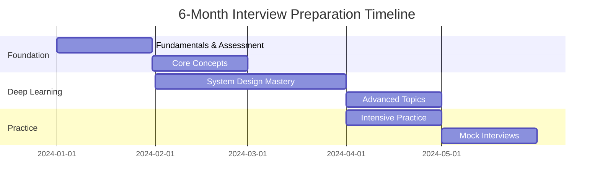

# 6-Month Amazon L6/L7 Interview Study Plan

## 📅 Complete Preparation Timeline

This comprehensive study plan is designed to prepare you for Amazon L6/L7 Engineering Manager interviews over 6 months, requiring **15-20 hours per week** of focused preparation.

!!! success "Success Story"
    **January 2024 L6 Hire**: "Following a structured timeline was crucial. I spent 6 months preparing, landed multiple L6 offers."

## 📚 Real Timeline Examples

📝 **[See Actual Preparation Timelines](experiences/timeline-examples.md)** for detailed day-by-day schedules from successful candidates:

- **8-Week L6 Intensive**: IC to Manager transition success story
- **12-Week L7 Strategic**: Director to Principal Manager approach  
- **6-Week Recovery**: Second attempt success after targeted improvement

## 🎯 Study Plan Overview



## 📊 Time Allocation by Role

For comprehensive L6 vs L7 differences and expectations, see **[L6 vs L7 Complete Guide](fundamentals/l6-vs-l7.md)**.

### Preparation Time Allocation

| Level | Total Hours | Weekly Hours | Success Rate |
|-------|-------------|--------------|--------------|
| **L6** | 360-400 | 15-17 | 65% with proper prep |
| **L7** | 400-450 | 17-20 | 45% with proper prep |

#### Detailed Time Breakdown

| Area | L6 Hours | L6 Weekly | L7 Hours | L7 Weekly |
|------|----------|-----------|----------|-----------|
| System Design | 120 (33%) | 5 hrs | 150 (38%) | 6 hrs |
| Coding/Technical | 100 (28%) | 4 hrs | 100 (25%) | 4 hrs |
| Leadership/Behavioral | 80 (22%) | 3 hrs | 90 (23%) | 3.5 hrs |
| Mock Interviews | 60 (17%) | 2.5 hrs | 60 (14%) | 2.5 hrs |
| **Total** | **360** | **15** | **400** | **16.5** |

## 📆 Month-by-Month Breakdown

### Month 1: Foundation Building

#### Week 1: Assessment & Setup

##### Day 1-2: Initial Assessment
**Morning (1 hour)**
- [ ] Complete self-assessment quiz
- [ ] Identify target level (L6 vs L7)
- [ ] Document current gaps

**Evening (1.5 hours)**
- [ ] Set up study environment
- [ ] Create tracking spreadsheet
- [ ] Join study communities

**Resources Needed**:
- LeetCode Premium
- System Design Course
- AWS Free Tier Account

##### Day 3-4: Baseline Testing
**Tasks**:
- [ ] Solve 3 LeetCode problems (measure current level)
- [ ] Complete 1 system design (45 minutes)
- [ ] Write 2 STAR stories

**Baseline Metrics to Track**:
```python
baseline_metrics = {
    "leetcode_easy_time": 0,  # Target: 15 min
    "leetcode_medium_time": 0,  # Target: 30 min
    "system_design_completeness": 0,  # Target: 80%
    "star_story_quality": 0,  # Target: 4/5
}
```

##### Day 5-7: Study Plan Creation
- [ ] Create 6-month calendar
- [ ] Block daily study time
- [ ] Schedule weekly reviews
- [ ] Plan first mock interview (Week 8)

#### Week 2: Core Fundamentals

##### Daily Schedule Template
```markdown
6:00-7:00 AM: Coding practice
- Warm-up: 1 easy (15 min)
- Main: 1 medium (35 min)
- Review: Solutions (10 min)

12:00-12:30 PM: Reading
- System design articles
- AWS documentation
- Leadership principles

8:00-9:30 PM: Deep work
- Mon/Wed/Fri: System design
- Tue/Thu: Behavioral stories
- Sat: Mock practice
- Sun: Week review
```

##### Week 2 Specific Goals
- [ ] 10 LeetCode problems solved
- [ ] 2 system designs completed
- [ ] 5 STAR stories written
- [ ] AWS: Understand EC2, S3, DynamoDB basics

#### Week 3-4: Building Momentum

##### Coding Focus (Week 3)
**Pattern: Two Pointers**
- Day 15: Two Sum, 3Sum
- Day 16: Container With Most Water
- Day 17: Trapping Rain Water
- Day 18: Remove Duplicates
- Day 19: Practice day
- Day 20-21: Review and reinforce

##### System Design Focus (Week 4)
**Topic: Distributed Systems Basics**
- Day 22: CAP Theorem deep dive
- Day 23: Consistency models
- Day 24: Design URL shortener
- Day 25: Design Pastebin
- Day 26: Caching strategies
- Day 27-28: First mock system design

**Month 1 Deliverables Checklist:**
- [ ] 40 coding problems solved
- [ ] 4 system designs completed
- [ ] 10 STAR stories drafted
- [ ] 5 AWS services studied
- [ ] 1 mock interview scheduled

### Month 2: Technical Deep Dive

#### Week 5-6: Advanced Algorithms

##### Coding Patterns Schedule
| Day | Pattern | Problems | Time |
|-----|---------|----------|------|
| 29-30 | Sliding Window | 5 problems | 2.5 hrs |
| 31-32 | BFS/DFS | 5 problems | 2.5 hrs |
| 33-34 | Binary Search | 5 problems | 2.5 hrs |
| 35-36 | Dynamic Programming | 5 problems | 3 hrs |
| 37-38 | Heap/Priority Queue | 5 problems | 2.5 hrs |
| 39-40 | Graph Algorithms | 5 problems | 3 hrs |
| 41-42 | Review and Practice | 10 problems | 5 hrs |

#### Week 7-8: AWS Services Mastery

##### Service Learning Schedule
```markdown
Week 7:
- Mon: DynamoDB deep dive (partitioning, GSI/LSI)
- Tue: S3 architecture (consistency, storage classes)
- Wed: Lambda & serverless (cold starts, limits)
- Thu: SQS/SNS (fan-out patterns, DLQ)
- Fri: API Gateway & CloudFront
- Weekend: Build sample project

Week 8:
- Mon: RDS & Aurora (replication, scaling)
- Tue: ECS/EKS (container orchestration)
- Wed: Kinesis (streaming, sharding)
- Thu: ElastiCache (Redis vs Memcached)
- Fri: CloudWatch & X-Ray (monitoring)
- Weekend: Second mock interview
```

**Month 2 Deliverables:**
- [ ] 80 total coding problems (cumulative)
- [ ] 8 system designs (cumulative)
- [ ] 20 STAR stories (all LPs covered)
- [ ] 10 AWS services mastered
- [ ] 2 mock interviews completed

### Month 3: System Design Mastery

#### Week 9-10: Design Patterns

##### Daily Design Practice
```markdown
Week 9 - Core Patterns:
Day 57: Microservices vs Monolith
Day 58: Event-driven architecture
Day 59: CQRS and Event Sourcing
Day 60: Design Twitter
Day 61: Design Uber
Day 62-63: Mock and review

Week 10 - Advanced Patterns:
Day 64: Cell-based architecture
Day 65: Service mesh
Day 66: API Gateway patterns
Day 67: Design YouTube
Day 68: Design WhatsApp
Day 69-70: Mock with feedback
```

#### Week 11-12: Scale Challenges

##### L6 vs L7 Design Problems

**L6 Focus Problems**:
1. Design a ride-sharing service (Uber/Lyft)
2. Design a video streaming platform
3. Design a payment system
4. Design a notification system
5. Design a search engine

**L7 Focus Problems**:
1. Design AWS S3 from scratch
2. Design a global e-commerce platform
3. Design a machine learning platform
4. Design a multi-region database
5. Design a container orchestration system

**Month 3 Deliverables:**
- [ ] 100 coding problems (cumulative)
- [ ] 16 system designs (cumulative)
- [ ] All STAR stories polished
- [ ] 3 mock interviews completed
- [ ] Design portfolio created

### Month 4: Leadership & Behavioral

#### Week 13-14: Leadership Principles Deep Dive

##### Leadership Principles Story Development Schedule
```markdown
Week 13 - Core LPs:
Mon: Customer Obsession (3 stories)
Tue: Ownership (3 stories)
Wed: Invent and Simplify (3 stories)
Thu: Are Right, A Lot (3 stories)
Fri: Learn and Be Curious (3 stories)
Weekend: Practice delivery

Week 14 - Additional LPs:
Mon: Hire and Develop (3 stories)
Tue: Highest Standards (3 stories)
Wed: Think Big (3 stories)
Thu: Bias for Action (3 stories)
Fri: Remaining LPs (6 stories)
Weekend: Full behavioral mock
```

#### Week 15-16: Integration Practice

##### Combined Practice Schedule
- Daily: 1 coding + 1 behavioral
- Every other day: System design
- Weekly: Full mock loop
- Weekend: Review and refine

**Month 4 Deliverables:**
- [ ] 120 coding problems (cumulative)
- [ ] 20 system designs (cumulative)
- [ ] 48+ STAR stories (3 per LP)
- [ ] 5 mock interviews completed
- [ ] Weak areas identified

### Month 5: Intensive Practice

#### Week 17-18: Problem Solving Sprint

##### Daily Sprint Schedule
```markdown
Morning (6-8 AM):
- 2 LeetCode mediums (30 min each)
- Review solutions (20 min)
- Note patterns (10 min)

Lunch (12-1 PM):
- System design reading
- AWS service review
- LP story practice

Evening (7-10 PM):
- Full system design (60 min)
- Behavioral practice (30 min)
- Review and plan (30 min)
```

#### Week 19-20: Mock Interview Marathon

##### Mock Interview Schedule

**Week 19**:
- Mon: Coding mock (Pramp)
- Tue: System design mock (friend)
- Wed: Behavioral mock (coach)
- Thu: Review all feedback
- Fri: Address weak areas
- Sat: Full loop simulation
- Sun: Rest and review

**Week 20**:
- Mon-Wed: Daily mini-mocks
- Thu: Amazon employee mock
- Fri: Bar Raiser practice
- Weekend: Feedback integration

**Month 5 Deliverables:**
- [ ] 140 coding problems (cumulative)
- [ ] 28 system designs (cumulative)
- [ ] All stories memorized
- [ ] 8+ mock interviews
- [ ] Consistent 4+ scores in mocks

### Month 6: Final Polish

#### Week 21-22: Targeted Refinement

##### Weakness Targeting
```python
# Track and improve weak areas
weak_areas = {
    "graph_problems": {"current": 60, "target": 90},
    "distributed_systems": {"current": 70, "target": 95},
    "think_big_stories": {"current": 2, "target": 5},
    "speaking_pace": {"current": "fast", "target": "measured"}
}

# Daily focus on lowest scoring area
for area in sorted(weak_areas, key=lambda x: weak_areas[x]["current"]):
    practice_intensively(area)
```

#### Week 23: Peak Week

##### Final Week Schedule
```markdown
Monday - Wednesday:
- Light practice only (1 hour/day)
- Review notes
- Polish top stories
- Mental preparation

Thursday - Friday:
- Mock interview conditions
- Full loop simulation
- Early sleep

Weekend before:
- Saturday: Light review
- Sunday: Rest completely
```

#### Week 24: Interview Week

##### Interview Day Preparation

**Day Before**:
- [ ] Review top 10 stories
- [ ] Practice power poses
- [ ] Test all technology
- [ ] Prepare questions to ask
- [ ] Get 8+ hours sleep

**Interview Day**:
```markdown
-2 hours: Light breakfast
-1 hour: Warm-up problem
-30 min: Review notes
-15 min: Power poses
0: Begin interview
```

**Month 6 Deliverables:**
- [ ] 150+ coding problems
- [ ] 30+ system designs
- [ ] 10+ mock interviews
- [ ] All stories polished
- [ ] 90%+ confidence level

## 📖 Weekly Study Schedule Template

### Optimal Weekly Schedule (15 hours)

| Day | Morning (1hr) | Evening (1-2hrs) | Focus |
|-----|---------------|------------------|-------|
| **Monday** | Coding practice | System design study | Technical |
| **Tuesday** | AWS service deep dive | Behavioral stories | Mixed |
| **Wednesday** | Coding practice | System design practice | Technical |
| **Thursday** | Leadership principles | Technical reading | Leadership |
| **Friday** | Coding practice | Week review & planning | Review |
| **Saturday** | Mock interview (2-3hrs) | Feedback analysis | Practice |
| **Sunday** | System design (2hrs) | Portfolio work | Projects |

### Daily Minimums
- **Coding**: 1 problem (even on non-coding days)
- **Reading**: 1 technical article
- **Review**: 15 minutes of previous work
- **Notes**: Document one key learning

## 📚 Resource Schedule

### Books by Month
1. **Month 1**: "Cracking the Coding Interview" (review)
2. **Month 2**: "Designing Data-Intensive Applications"
3. **Month 3**: "System Design Interview" (Alex Xu)
4. **Month 4**: "The Manager's Path" (leadership focus)
5. **Month 5**: "Building Microservices" (architecture)
6. **Month 6**: Review and reference only

### Online Courses Timeline
- **Weeks 1-4**: AWS Certified Solutions Architect prep
- **Weeks 5-8**: Distributed Systems course (MIT/Stanford)
- **Weeks 9-12**: System Design Interview course
- **Weeks 13-16**: Leadership/Management course
- **Weeks 17-24**: Practice and mock interviews only

## 🎯 Milestone Checkpoints

### Month 2 Checkpoint
- [ ] 50 coding problems solved (80% success rate)
- [ ] 6 system designs (can complete in 45 minutes)
- [ ] 15 STAR stories (memorized)
- [ ] 5 AWS services (expert level)

### Month 4 Checkpoint
- [ ] 100 coding problems (90% success rate)
- [ ] 18 system designs (production-ready)
- [ ] 25 STAR stories (polished)
- [ ] 10 AWS services (expert level)
- [ ] 3 successful mock interviews

### Month 6 Target
- [ ] 150+ coding problems
- [ ] 30 system designs
- [ ] 30 STAR stories
- [ ] 15 AWS services
- [ ] 8+ mock interviews
- [ ] 90% confidence level

## 🔄 Adaptation Strategies

### If Behind Schedule
1. **Prioritize**: Focus on system design and leadership
2. **Extend**: Add 1 month if needed
3. **Intensify**: Increase to 20 hours/week
4. **Get Help**: Consider coaching/tutoring

### If Ahead of Schedule
1. **Deepen**: Add more L7-specific content
2. **Broaden**: Include adjacent technologies
3. **Mentor**: Help others (teaching reinforces)
4. **Innovate**: Create novel solutions

### If Struggling with Specific Area
1. **Double Down**: Allocate 50% more time
2. **Get Support**: Find specialized resources
3. **Practice More**: Increase repetitions
4. **Simplify**: Break into smaller chunks

## 📊 Progress Tracking

### Weekly Metrics
```python
# Track these every Sunday
weekly_metrics = {
    "coding_problems": 0,      # Target: 6-8
    "system_designs": 0,        # Target: 1-2
    "mock_interviews": 0,       # Target: 0.5
    "study_hours": 0,          # Target: 15
    "confidence_level": 0,      # Scale: 1-10
}
```

### Enhanced Weekly Tracker
```python
# Week X Progress
week_x = {
    "coding_problems": {
        "target": 10,
        "completed": 0,
        "success_rate": 0
    },
    "system_designs": {
        "target": 2,
        "completed": 0,
        "quality_score": 0
    },
    "behavioral_stories": {
        "target": 5,
        "completed": 0,
        "memorized": 0
    },
    "mock_interviews": {
        "target": 1,
        "completed": 0,
        "average_score": 0
    },
    "study_hours": {
        "target": 15,
        "actual": 0
    }
}
```

### Monthly Review Template
```markdown
Month X Review:

Achievements:
- [ ] Met coding target
- [ ] Met design target
- [ ] Met behavioral target
- [ ] Completed mocks

Challenges:
- 
- 

Adjustments for Next Month:
- 
- 

Confidence Level: _/10
```

## 🎯 Success Metrics by Month

### Expected Progress Curve

| Month | Coding Success Rate | Design Completeness | LP Story Quality | Mock Score |
|-------|-------------------|-------------------|------------------|------------|
| 1 | 40% | 50% | 2/5 | 2.5/5 |
| 2 | 55% | 60% | 3/5 | 3/5 |
| 3 | 70% | 70% | 3.5/5 | 3.5/5 |
| 4 | 80% | 80% | 4/5 | 4/5 |
| 5 | 85% | 85% | 4.5/5 | 4.3/5 |
| 6 | 90% | 90% | 4.7/5 | 4.5/5 |

## 💡 Time Management Tips

### Efficient Study Techniques

1. **Pomodoro for Coding**: 25 min problem, 5 min break
2. **System Design Batching**: 2-hour deep sessions
3. **Story Practice**: During commute/walks
4. **Mock Review**: Video record and 2x playback

### When Behind Schedule

**Recovery Strategies**:
1. Focus on high-impact areas (System Design for L7)
2. Reduce breadth, increase depth
3. Add 30 min daily for 2 weeks
4. Skip low-frequency patterns
5. Get professional coaching

### When Ahead of Schedule

**Enhancement Options**:
1. Add specialty areas (ML/AI for 2025)
2. Extra mock interviews
3. Help others (teaching reinforces)
4. Build demonstration projects
5. Write technical blogs

## ⚠️ Common Timeline Mistakes

1. **Starting Too Late**: 3 months insufficient for L6/L7
2. **Inconsistent Practice**: Daily practice beats weekend marathons
3. **Ignoring Weak Areas**: These become interview killers
4. **No Mock Interviews**: Real practice essential
5. **Burning Out**: Plan rest days

## 🏃 Sprint Weeks

### Coding Sprint (Month 3, Week 2)
- Solve 30 problems in one week
- Focus on medium difficulty
- Time each problem strictly
- Review patterns daily

### Design Sprint (Month 4, Week 2)
- Complete 1 design daily
- Each from different domain
- Present to study group
- Incorporate feedback immediately

### Interview Sprint (Month 5, Week 3)
- Daily mock interviews
- Different interviewer each day
- Video record everything
- Detailed feedback analysis

## 🎯 Final Month Schedule

### Week 21: Peak Practice
- 2 problems daily
- 1 system design daily
- 1 behavioral daily
- Review all materials

### Week 22: Mock Loop
- Monday: Full mock loop
- Tuesday-Wednesday: Address feedback
- Thursday: Mini mock loop
- Friday: Final adjustments

### Week 23: Polish
- Review top designs
- Practice problem variations
- Refine STAR stories
- Mental preparation

### Week 24: Interview Week
- Light practice only
- Review notes
- Rest and relaxation
- Confidence building

## 💡 Success Tips

!!! success "Proven Strategies"
    1. **Consistency > Intensity**: Daily practice beats weekend marathons
    2. **Active > Passive**: Solve problems rather than watching solutions
    3. **Feedback Loop**: Get external feedback weekly
    4. **Simulate Reality**: Practice with time pressure and constraints
    5. **Health First**: Maintain exercise, sleep, and nutrition

## 🎯 Final Month Checklist

### 30 Days Before
- [ ] All stories written and polished
- [ ] 100+ coding problems solved
- [ ] 20+ system designs completed
- [ ] 5+ mock interviews done
- [ ] Schedule cleared for final month

### 14 Days Before
- [ ] Peak performance reached
- [ ] All materials organized
- [ ] Technology tested
- [ ] Interview logistics confirmed
- [ ] Support system in place

### 7 Days Before
- [ ] Tapering practice
- [ ] Mental preparation
- [ ] Physical health optimal
- [ ] Confidence high
- [ ] Ready to succeed

## 📋 Pre-Interview Checklist

### 1 Week Before
- [ ] Confirm interview logistics
- [ ] Review top 20 problems/designs
- [ ] Polish STAR stories
- [ ] Plan interview day schedule
- [ ] Prepare questions to ask

### 1 Day Before
- [ ] Light review only
- [ ] Prepare materials
- [ ] Test technology setup
- [ ] Get good sleep
- [ ] Visualize success

### Interview Day
- [ ] Healthy breakfast
- [ ] Arrive early/test connection
- [ ] Warm up with easy problem
- [ ] Review notes briefly
- [ ] Stay confident!

---

!!! success "You Can Do This!"
    Following this timeline, hundreds of candidates have successfully landed L6/L7 roles at Amazon. The best preparation combines consistent practice with strategic focus. Trust the process, stay consistent, track your progress, and remember: preparation breeds confidence, and confidence breeds success.

---

*Next: [Quick Reference Guide](quick-reference.md) →*