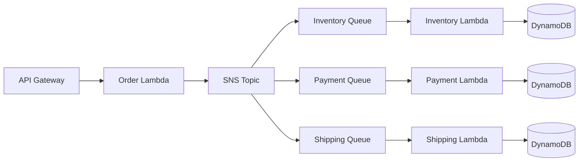
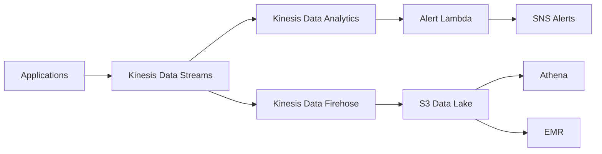

# AWS Services Deep Dive for L6/L7 Interviews

## 🚀 AWS Knowledge: The Hidden Differentiator

!!! danger "2025 Reality Check"
    **December 2024 Interview**: "Deep AWS knowledge separated strong candidates. Knowing DynamoDB internals and S3 consistency models was crucial."
    
    **L7 Hire**: "I discussed cell-based architecture from S3 and it impressed the panel."

## 📊 AWS Services by Interview Importance

### Priority Matrix for L6/L7

| Service | L6 Importance | L7 Importance | Interview Frequency |
|---------|--------------|---------------|-------------------|
| **DynamoDB** | Critical | Critical | 90% |
| **S3** | Critical | Critical | 85% |
| **Lambda** | High | Critical | 80% |
| **EC2/Auto Scaling** | High | High | 75% |
| **SQS/SNS** | High | High | 70% |
| **API Gateway** | Medium | High | 65% |
| **Kinesis** | Medium | Critical | 60% |
| **CloudFront** | Medium | High | 55% |
| **ECS/EKS** | Medium | Critical | 50% |
| **SageMaker/Bedrock** | Low | High | 40% (rising) |

## 🔍 Critical AWS Services Deep Dive

### 1. DynamoDB - The Interview Favorite

#### Core Concepts You Must Know

```python
# DynamoDB Partition Key Selection
"""
Interview Question: Your DynamoDB table is experiencing hot partitions. How do you fix it?
"""

# Bad: Hot partition
partition_key = user_id  # Popular users cause hot partitions

# Good: Distributed writes
import random
partition_key = f"{user_id}#{random.randint(0, 9)}"
# Now queries need to check 10 partitions but writes are distributed

# Better: Time-based sharding for time-series data
from datetime import datetime
partition_key = f"{user_id}#{datetime.now().strftime('%Y-%m')}"
```

#### DynamoDB Design Patterns

**Single Table Design** (L7 must-know):
```python
# Instead of multiple tables, use one table with different patterns
table_design = {
    "PK": "Entity#ID",
    "SK": "Metadata|Timestamp|RelatedEntity",
    
    # User entity
    "PK": "USER#123",
    "SK": "METADATA",
    
    # User's orders
    "PK": "USER#123", 
    "SK": "ORDER#2024-01-15#456",
    
    # Order details
    "PK": "ORDER#456",
    "SK": "METADATA",
    
    # Access patterns:
    # 1. Get user: PK=USER#123, SK=METADATA
    # 2. Get user orders: PK=USER#123, SK begins_with ORDER
    # 3. Get order: PK=ORDER#456, SK=METADATA
}
```

#### Interview Scenarios & Solutions

**Scenario 1**: "Design a shopping cart that handles Black Friday traffic"

```python
# Solution approach
shopping_cart_design = {
    "table": "ShoppingCarts",
    "partition_key": "SessionID",
    "sort_key": "ItemID",
    
    "capacity": {
        "normal": {"RCU": 1000, "WCU": 1000},
        "black_friday": {"RCU": 40000, "WCU": 40000}
    },
    
    "optimizations": [
        "Enable auto-scaling with target 70%",
        "Use DynamoDB Accelerator (DAX) for reads",
        "Implement write sharding for hot items",
        "Use Global Secondary Index for user lookups",
        "Enable point-in-time recovery"
    ],
    
    "hot_partition_mitigation": [
        "Adaptive capacity (automatic)",
        "Write sharding with random suffix",
        "Burst capacity utilization"
    ]
}
```

**Scenario 2**: "Handle 1 million writes per second"

```python
# Calculation for L6/L7 discussion
writes_per_second = 1_000_000
write_capacity_unit = 1  # 1 KB per write
partition_throughput = 1000  # WCU per partition

required_partitions = writes_per_second / partition_throughput  # 1000
monthly_cost = required_partitions * 1000 * 0.00065 * 730  # ~$475K

# Optimization discussion
optimizations = {
    "batching": "Use BatchWriteItem (25 items per request)",
    "compression": "Compress data before writing",
    "archival": "Move old data to S3",
    "aggregation": "Aggregate writes in Kinesis first"
}
```

### 2. S3 - Understanding at Scale

#### Consistency Model (Changed in 2020)
```python
# Pre-2020: Eventual consistency for overwrites
# Post-2020: Strong read-after-write consistency

# Interview talking points
s3_consistency = {
    "read_after_write": "Strong consistency (since Dec 2020)",
    "list_after_write": "Strong consistency",
    "list_after_delete": "Strong consistency",
    
    "implications": [
        "No need for sleep/retry in tests",
        "Can immediately read after write",
        "Simplifies application logic"
    ]
}
```

#### S3 Request Patterns & Optimization

```python
# Request rate limits (2024)
s3_limits = {
    "PUT/COPY/POST/DELETE": 3500,  # requests/sec per prefix
    "GET/HEAD": 5500,  # requests/sec per prefix
    
    "scaling": "Automatic - no prefix randomization needed"
}

# Multipart upload optimization
def optimize_large_file_upload(file_size_gb):
    if file_size_gb < 0.1:  # 100 MB
        return "Single PUT"
    elif file_size_gb < 5:  # 5 GB
        return "Optional multipart"
    else:  # > 5 GB
        return "Mandatory multipart"
    
    # Optimal part size
    part_size_mb = min(100, max(5, file_size_gb * 1000 / 10000))
    return f"Use {part_size_mb} MB parts"
```

#### S3 Storage Classes Strategy

```python
# Cost optimization for L7 discussions
storage_strategy = {
    "S3 Standard": {
        "use_case": "Frequently accessed data",
        "cost_per_gb": 0.023,
        "retrieval": "Free"
    },
    "S3 Standard-IA": {
        "use_case": "Monthly access",
        "cost_per_gb": 0.0125,
        "retrieval": "$0.01/GB"
    },
    "S3 Intelligent-Tiering": {
        "use_case": "Unknown access patterns",
        "cost_per_gb": 0.023,  # Auto-moves between tiers
        "retrieval": "Free"
    },
    "S3 Glacier Instant": {
        "use_case": "Quarterly access",
        "cost_per_gb": 0.004,
        "retrieval": "$0.03/GB"
    },
    "S3 Glacier Flexible": {
        "use_case": "Yearly access",
        "cost_per_gb": 0.0036,
        "retrieval": "1-12 hours"
    }
}

# Lifecycle policy example
lifecycle_policy = {
    "rules": [
        {"days": 0, "storage_class": "STANDARD"},
        {"days": 30, "storage_class": "STANDARD_IA"},
        {"days": 90, "storage_class": "GLACIER"},
        {"days": 365, "storage_class": "DEEP_ARCHIVE"},
        {"days": 2555, "action": "DELETE"}  # 7 years
    ]
}
```

### 3. Lambda - Serverless at Scale

#### Cold Start Optimization
```python
# Cold start mitigation strategies
cold_start_solutions = {
    "provisioned_concurrency": {
        "cost": "$0.000004 per GB-second",
        "use_case": "Predictable traffic",
        "warmup_time": "< 100ms"
    },
    "container_reuse": {
        "technique": "Keep connections outside handler",
        "benefit": "Reuse across invocations"
    },
    "smaller_packages": {
        "technique": "Minimize dependencies",
        "target": "< 50 MB zipped"
    },
    "language_choice": {
        "fastest": ["Rust", "Go", "Node.js"],
        "slowest": ["Java", "C#"]
    }
}

# Connection pooling pattern
import boto3

# Outside handler - reused across invocations
dynamodb = boto3.resource('dynamodb')
table = dynamodb.Table('my-table')

def lambda_handler(event, context):
    # Use pre-initialized resources
    return table.get_item(Key={'id': event['id']})
```

#### Lambda Limits & Workarounds

```python
lambda_limits_2024 = {
    "timeout": {"limit": "15 minutes", "workaround": "Step Functions"},
    "memory": {"limit": "10 GB", "workaround": "ECS Fargate"},
    "storage": {"limit": "512 MB /tmp", "workaround": "EFS mount"},
    "payload": {"limit": "6 MB sync", "workaround": "S3 + presigned URL"},
    "concurrent": {"limit": "1000 default", "workaround": "Request increase"}
}
```

### 4. API Gateway - The Front Door

#### Request Flow Architecture
```python
# API Gateway patterns for L6 interviews
api_gateway_patterns = {
    "rest_api": {
        "use_case": "RESTful services",
        "features": ["Request validation", "SDK generation"],
        "limits": {"rate": 10000, "burst": 5000}
    },
    "http_api": {
        "use_case": "High performance, low cost",
        "features": ["JWT authorization", "OIDC"],
        "cost": "70% cheaper than REST"
    },
    "websocket_api": {
        "use_case": "Real-time bidirectional",
        "features": ["Connection management", "Route selection"],
        "limits": {"connections": 500000, "messages": "No limit"}
    }
}

# Rate limiting implementation
rate_limit_config = {
    "method": "Token bucket",
    "rate": 1000,  # requests per second
    "burst": 2000,  # burst capacity
    "per_api_key": True,
    "response_429": {
        "message": "Rate limit exceeded",
        "retry_after": 1
    }
}
```

### 5. Kinesis - Stream Processing

#### Kinesis vs SQS vs SNS Decision Tree
```python
def choose_messaging_service(requirements):
    if requirements.get("ordered_processing"):
        if requirements.get("replay_capability"):
            return "Kinesis Data Streams"
        else:
            return "SQS FIFO"
    elif requirements.get("fanout_pattern"):
        return "SNS + SQS"
    elif requirements.get("simple_queue"):
        return "SQS Standard"
    elif requirements.get("real_time_analytics"):
        return "Kinesis Data Analytics"
    else:
        return "EventBridge"

# Shard calculation for interviews
def calculate_kinesis_shards(
    records_per_second=1000,
    avg_record_size_kb=1,
    read_applications=3
):
    # Write capacity: 1000 records/sec OR 1 MB/sec per shard
    write_shards = max(
        records_per_second / 1000,
        (records_per_second * avg_record_size_kb) / 1000
    )
    
    # Read capacity: 2 MB/sec per shard per application
    read_requirement = (records_per_second * avg_record_size_kb * read_applications) / 1000
    read_shards = read_requirement / 2
    
    return max(write_shards, read_shards)
```

### 6. CloudFront - CDN Architecture

#### Cache Optimization Strategies
```python
cloudfront_caching = {
    "cache_behaviors": [
        {
            "path": "/api/*",
            "ttl": 0,  # No caching for APIs
            "forward": ["headers", "query_strings", "cookies"]
        },
        {
            "path": "/static/*",
            "ttl": 86400,  # 1 day for static assets
            "compress": True
        },
        {
            "path": "/images/*",
            "ttl": 604800,  # 1 week for images
            "compress": False
        }
    ],
    
    "invalidation_strategy": {
        "cost": "$0.005 per path",
        "alternative": "Versioned URLs (/v2/style.css)"
    },
    
    "origin_shield": {
        "use_case": "Reduce origin load",
        "benefit": "Extra caching layer",
        "cost": "$0.001 per 10,000 requests"
    }
}
```

## 🏗️ Architecture Patterns Using AWS Services

### Pattern 1: Event-Driven Microservices



### Pattern 2: Real-Time Analytics Pipeline



## 💰 Cost Optimization Discussions

### L7 Level Cost Analysis

```python
# Example: Video streaming platform cost optimization
monthly_costs = {
    "current": {
        "CloudFront": 50000,  # TB transfer
        "S3": 30000,  # Storage + requests
        "EC2": 40000,  # Origin servers
        "DynamoDB": 20000,  # Metadata
        "Total": 140000
    },
    
    "optimized": {
        "CloudFront": 35000,  # Origin Shield + better caching
        "S3": 20000,  # Intelligent Tiering
        "EC2": 20000,  # Spot instances + auto-scaling
        "DynamoDB": 10000,  # On-demand + DAX
        "Total": 85000  # 40% reduction
    },
    
    "techniques": [
        "S3 Intelligent-Tiering for automatic cost optimization",
        "CloudFront Origin Shield to reduce origin hits by 60%",
        "DynamoDB on-demand for variable workloads",
        "EC2 Spot Fleet for 70% compute savings",
        "Reserved Capacity for predictable workloads"
    ]
}
```

## 🎯 Interview Scenarios with AWS Services

### Scenario 1: "Design a Global File Sync Service"

```python
solution = {
    "requirements": {
        "users": "100M globally",
        "files": "10 files per user average",
        "size": "100 MB average file size",
        "sync": "Real-time across devices"
    },
    
    "architecture": {
        "storage": "S3 with Cross-Region Replication",
        "cdn": "CloudFront for global distribution",
        "metadata": "DynamoDB Global Tables",
        "sync": "AppSync with GraphQL subscriptions",
        "compute": "Lambda for file processing",
        "auth": "Cognito for user management"
    },
    
    "optimizations": {
        "deduplication": "Content-based hashing",
        "compression": "Client-side before upload",
        "chunking": "Multipart upload for large files",
        "caching": "CloudFront + ElastiCache"
    }
}
```

### Scenario 2: "Handle 1 Billion Events per Day"

```python
solution = {
    "ingestion": "Kinesis Data Streams (1000 shards)",
    "processing": "Kinesis Analytics for real-time",
    "storage": "S3 via Kinesis Firehose",
    "query": "Athena for ad-hoc analysis",
    "monitoring": "CloudWatch + X-Ray",
    
    "calculations": {
        "events_per_second": 1_000_000_000 / 86400,  # ~11,574
        "kinesis_shards": 12,  # With headroom
        "monthly_cost": 12 * 0.015 * 24 * 30  # ~$130
    }
}
```

## 📚 Must-Know AWS Concepts for Interviews

### Networking & Security

```python
networking_concepts = {
    "VPC": {
        "CIDR": "10.0.0.0/16 typical",
        "Subnets": "Public (IGW) vs Private (NAT)",
        "Peering": "Cross-VPC communication",
        "Endpoints": "Private connection to AWS services"
    },
    
    "Security": {
        "Security Groups": "Instance-level firewall (stateful)",
        "NACLs": "Subnet-level firewall (stateless)",
        "WAF": "Application-layer protection",
        "Shield": "DDoS protection"
    },
    
    "Load Balancing": {
        "ALB": "Layer 7, HTTP/HTTPS",
        "NLB": "Layer 4, TCP/UDP, ultra-low latency",
        "CLB": "Legacy, avoid in new designs"
    }
}
```

### Disaster Recovery Patterns

```python
dr_patterns = {
    "Backup & Restore": {
        "RTO": "Hours",
        "RPO": "Hours",
        "Cost": "$",
        "Use": "Non-critical systems"
    },
    "Pilot Light": {
        "RTO": "Minutes to hours",
        "RPO": "Minutes",
        "Cost": "$$",
        "Use": "Critical systems with some downtime tolerance"
    },
    "Warm Standby": {
        "RTO": "Minutes",
        "RPO": "Seconds",
        "Cost": "$$$",
        "Use": "Business-critical systems"
    },
    "Multi-Site Active-Active": {
        "RTO": "Zero",
        "RPO": "Zero",
        "Cost": "$$$$",
        "Use": "Mission-critical, no downtime"
    }
}
```

## ✅ AWS Knowledge Checklist for Interviews

### L6 Minimum Requirements
- [ ] DynamoDB partitioning and GSI/LSI
- [ ] S3 consistency and storage classes
- [ ] Lambda cold starts and limits
- [ ] API Gateway patterns
- [ ] SQS vs SNS vs Kinesis
- [ ] CloudFront caching
- [ ] Basic VPC networking
- [ ] Auto-scaling strategies
- [ ] Cost optimization basics
- [ ] CloudWatch monitoring

### L7 Additional Requirements
- [ ] Cell-based architecture
- [ ] Multi-region strategies
- [ ] Advanced DynamoDB patterns
- [ ] Kinesis scaling and sharding
- [ ] Service mesh concepts
- [ ] Cost optimization at scale
- [ ] Disaster recovery patterns
- [ ] Security best practices
- [ ] ML services integration
- [ ] Container orchestration

## 🎓 Study Resources

### AWS Documentation
- [DynamoDB Best Practices](https://docs.aws.amazon.com/amazondynamodb/latest/developerguide/best-practices.html)
- [S3 Performance Guidelines](https://docs.aws.amazon.com/AmazonS3/latest/userguide/optimizing-performance.html)
- [Lambda Best Practices](https://docs.aws.amazon.com/lambda/latest/dg/best-practices.html)

### re:Invent Videos
- "Amazon DynamoDB Deep Dive: Advanced Design Patterns"
- "Amazon S3 Best Practices"
- "Optimizing Lambda Performance"

### Whitepapers
- Well-Architected Framework
- DynamoDB Whitepaper
- S3 Request Rate Performance

---

!!! tip "Interview Pro Tip"
    Don't just memorize services—understand the trade-offs. Interviewers want to see you can make informed decisions about when to use each service and why. Always connect technical choices to business impact.

---

*Next: [Well-Architected Framework](well-architected.md) →*