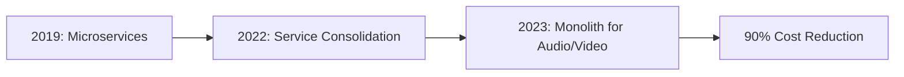
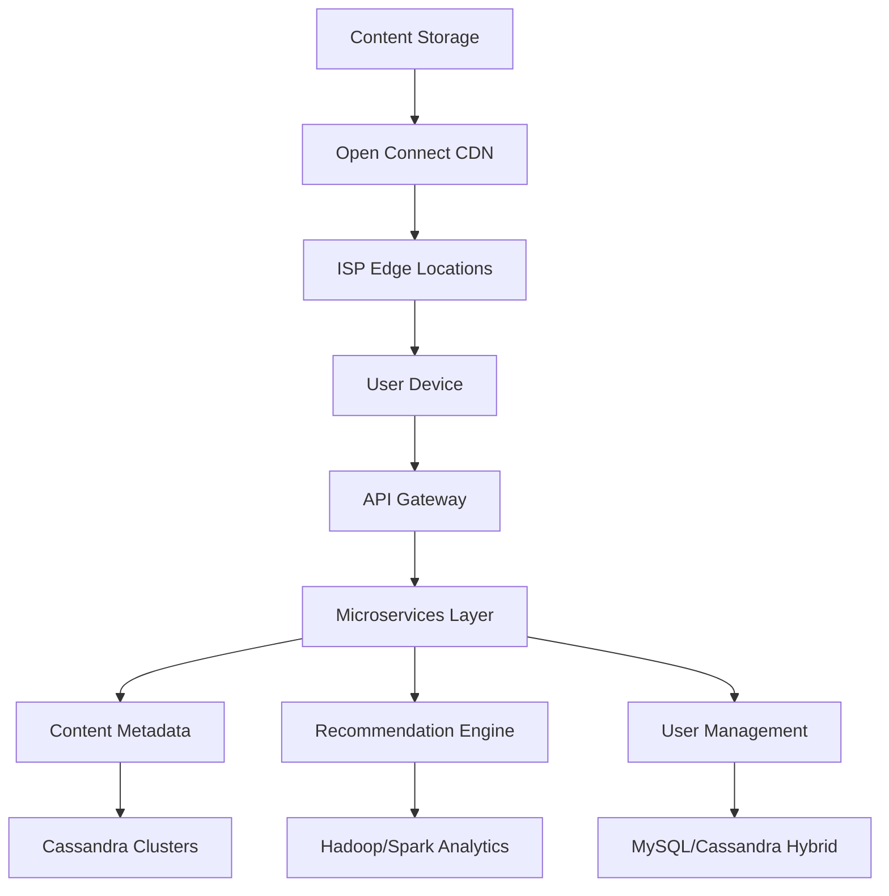
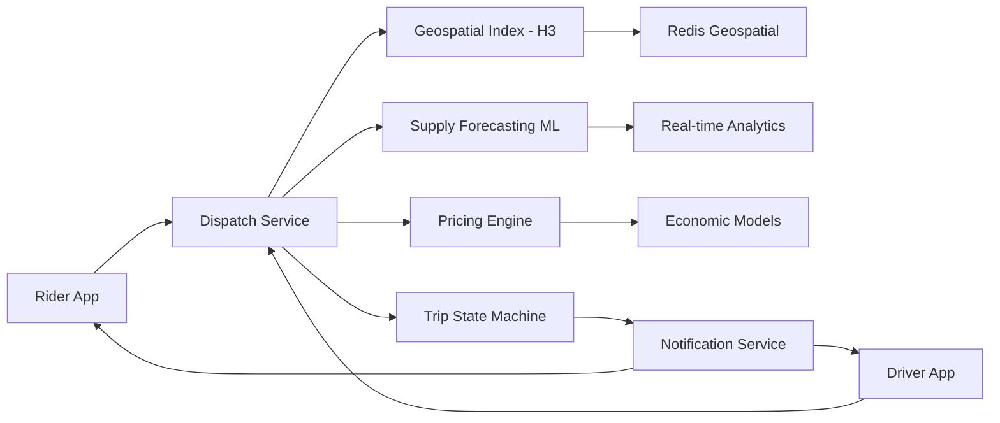
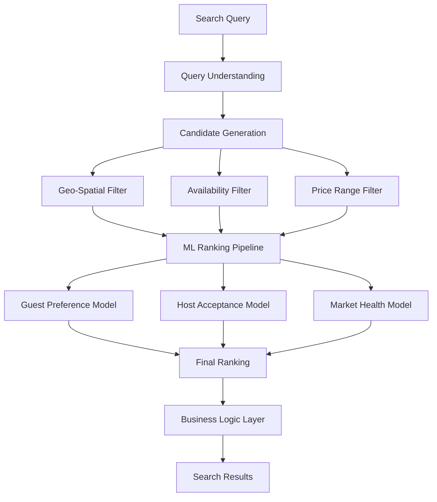
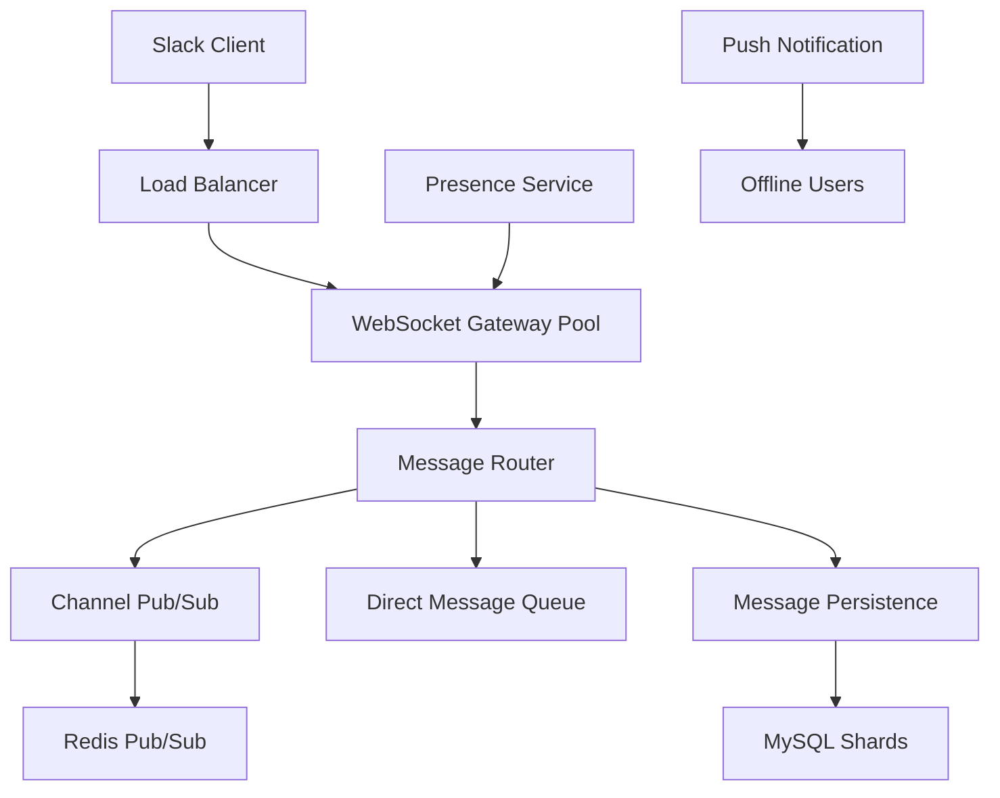

# Real-World System Design Case Studies for L6/L7 Interviews

## 🎯 Overview

This collection features 10 comprehensive case studies from real-world systems at Amazon scale, designed to prepare L6/L7 engineering managers for system design interviews. Each case study includes architectural decisions, trade-offs, lessons learned, and interview applications.

## 📊 Case Study Categories

| Category | L6 Focus | L7 Focus |
|----------|----------|----------|
| **E-Commerce** | Component optimization | Platform strategy |
| **Streaming** | Service reliability | Global distribution |
| **Databases** | Scaling patterns | Consistency models |
| **Serverless** | Function architecture | Multi-tenant platforms |
| **ML/AI** | Pipeline design | Platform capabilities |

## 🏢 Amazon Internal System Case Studies

### Case Study 1: Amazon Prime Video Architecture Evolution

**System Overview:**
- **Scale**: 200M+ subscribers, 175+ countries
- **Data**: 18 exabytes of content, 100K+ hours of video
- **Traffic**: 5B+ hours streamed annually

**Architectural Journey:**



**Key Design Decisions:**

1. **Initial Microservices Architecture (2019)**
   ```
   Components:
   - Video Ingestion Service
   - Quality Conversion Service  
   - Audio Processing Service
   - Packaging Service
   - Distribution Service
   
   Problems:
   - High inter-service communication costs
   - Complex orchestration overhead
   - Difficult debugging across services
   ```

2. **Migration to Monolith (2022-2023)**
   ```
   Benefits:
   - 90% reduction in infrastructure costs
   - Simplified deployment and monitoring
   - Better performance (no network hops)
   - Easier debugging and testing
   
   Trade-offs:
   - Reduced team autonomy
   - Harder to scale individual components
   - Single point of failure risk
   ```

**L6 Interview Application:**
- When to consolidate services for efficiency
- Cost optimization through architecture changes
- Team structure impacts on architecture

**L7 Interview Application:**
- Platform vs product architectural decisions
- Organization-wide cost optimization strategies
- Technical leadership during major migrations

**Lessons Learned:**
1. Microservices aren't always the answer at scale
2. Cost can drive architectural decisions
3. Team structure should align with architecture
4. Monitoring costs are often overlooked

---

### Case Study 2: Amazon DynamoDB - NoSQL at Scale

**System Overview & Business Context:**
Amazon DynamoDB powers some of the world's largest applications, handling mission-critical workloads for Amazon.com, Alexa, and thousands of AWS customers. The system was born from Amazon's need for a highly available, scalable database that could handle massive traffic spikes during events like Prime Day.

- **Scale**: 10 trillion requests per day across all customers
- **Latency**: Single-digit millisecond performance globally  
- **Availability**: 99.999% SLA with multi-AZ deployment
- **Global Reach**: 25+ AWS regions with Global Tables
- **Business Impact**: Powers $386B in annual GMV for Amazon retail

**Core Architecture:**

```python
# Simplified DynamoDB Architecture Components
class DynamoDBArchitecture:
    def __init__(self):
        self.storage_nodes = []  # Distributed storage
        self.request_routers = []  # Request routing layer
        self.metadata_service = MetadataService()
        self.replication_manager = ReplicationManager()
    
    def handle_write(self, item, consistency_level):
        # 1. Hash key to determine partition
        partition = self.consistent_hash(item.key)
        
        # 2. Find storage nodes for partition
        nodes = self.get_nodes_for_partition(partition)
        
        # 3. Write based on consistency level
        if consistency_level == "EVENTUAL":
            # Write to one node, replicate async
            primary = nodes[0]
            primary.write(item)
            self.replicate_async(item, nodes[1:])
        else:  # STRONG consistency
            # Write to majority before returning
            successful_writes = 0
            for node in nodes:
                if node.write(item):
                    successful_writes += 1
                if successful_writes > len(nodes) / 2:
                    return True
        
        return False
```

**Key Design Patterns:**

1. **Consistent Hashing for Data Distribution**
   - Virtual nodes for better distribution
   - Automatic rebalancing on node addition/removal
   - Partition key design impacts

2. **Multi-Master Replication**
   - Last-writer-wins conflict resolution
   - Vector clocks for causality tracking
   - Cross-region replication with eventual consistency

3. **Adaptive Capacity Management**
   - Auto-scaling based on consumed capacity
   - Burst capacity for traffic spikes
   - Global secondary index management

**Scaling Challenges and Solutions:**

1. **Hot Partition Problem**
   - Adaptive capacity automatically redistributes load
   - Intelligent tiering moves cold data to IA storage
   - Auto-scaling responds to traffic patterns in real-time

2. **Global Consistency at Scale**
   - Eventually consistent reads by default for performance
   - Strongly consistent reads available when needed
   - Global Tables provide multi-region active-active setup

3. **Cost Management**
   - On-demand pricing eliminates capacity planning
   - Reserved capacity for predictable workloads
   - Intelligent tiering reduces storage costs by up to 60%

**Lessons for L6/L7 Managers:**

**L6 Leadership Lessons:**
- Partition key design is critical - educate teams early
- Monitor consumption metrics, not just performance
- Implement gradual rollout strategies for schema changes
- Build abstraction layers to handle consistency trade-offs

**L7 Strategic Lessons:**
- Platform decisions impact entire engineering organization
- Operational simplicity enables team autonomy
- Global infrastructure requires regional compliance awareness  
- Cost optimization at scale requires proactive tooling

**Interview Application Tips:**

**For L6 Candidates:**
- Demonstrate understanding of NoSQL vs SQL trade-offs
- Show experience with partition key design decisions
- Explain hot partition mitigation strategies
- Calculate read/write capacity requirements for given scenarios

**For L7 Candidates:**
- Discuss global database strategy across multiple services
- Evaluate build vs buy decisions for database infrastructure
- Plan multi-year migration from relational to NoSQL
- Design organizational patterns around database platforms

---

### Case Study 3: AWS Lambda Cold Start Optimization

**System Overview:**
- **Scale**: 100+ billion function invocations monthly
- **Languages**: 10+ runtime environments
- **Latency**: P50 < 20ms, P99 < 100ms cold starts
- **Isolation**: Complete function isolation

**Cold Start Architecture:**

```python
class LambdaColdStartOptimization:
    def __init__(self):
        self.container_pool = ContainerPool()
        self.runtime_cache = RuntimeCache()
        self.predictive_scaling = PredictiveScaler()
    
    def optimize_cold_start(self, function_config):
        optimizations = []
        
        # 1. Container pre-warming
        if self.should_prewarm(function_config):
            containers = self.predictive_scaling.predict_needed(
                function_config.arn,
                time_window=300  # 5 minutes
            )
            self.container_pool.prewarm(containers)
            optimizations.append("pre-warming")
        
        # 2. Runtime snapshot caching
        if function_config.runtime in self.snapshot_supported:
            snapshot = self.runtime_cache.get_snapshot(
                function_config.runtime,
                function_config.layers
            )
            optimizations.append("snapshot-restore")
        
        # 3. Provisioned concurrency
        if function_config.provisioned_concurrency > 0:
            self.maintain_warm_pool(
                function_config.arn,
                function_config.provisioned_concurrency
            )
            optimizations.append("provisioned-concurrency")
        
        return optimizations
```

**Optimization Strategies:**

1. **Firecracker MicroVMs**
   - 125ms VM boot time
   - 5ms snapshot restore
   - Memory deduplication across VMs

2. **Container Reuse Patterns**
   - Keep-alive for 15 minutes
   - Connection pooling persistence
   - Tmp directory cleanup strategies

3. **Predictive Scaling**
   - ML-based traffic prediction
   - Preemptive container warming
   - Regional capacity planning

**L6 Interview Application:**
- Function optimization techniques
- Container lifecycle management
- Performance vs cost trade-offs

**L7 Interview Application:**
- Platform-level optimization strategies
- Multi-tenant resource management
- Innovation in serverless architectures

---

### Case Study 4: Amazon S3 Consistency Model Evolution

**System Overview:**
- **Scale**: 100+ trillion objects stored
- **Throughput**: 100+ million requests per second
- **Durability**: 99.999999999% (11 9's)
- **Availability**: 99.99% SLA

**Consistency Evolution:**

```
Timeline:
2006: Eventual consistency only
2020: Strong read-after-write consistency
2023: Conditional writes and object locking
```

**Architecture for Strong Consistency:**

```python
class S3ConsistencyArchitecture:
    def __init__(self):
        self.metadata_store = DistributedMetadataStore()
        self.object_store = ObjectStorageCluster()
        self.consistency_manager = ConsistencyManager()
    
    def put_object(self, bucket, key, data):
        # 1. Generate unique version ID
        version_id = self.generate_version_id()
        
        # 2. Distributed transaction for metadata
        with self.metadata_store.transaction() as txn:
            # Check for conflicts
            current = txn.get(f"{bucket}/{key}")
            if current and not self.can_overwrite(current):
                raise ConflictException()
            
            # Write object data first
            locations = self.object_store.write(
                data, 
                replication_factor=3,
                availability_zones=3
            )
            
            # Update metadata with strong consistency
            metadata = {
                "version": version_id,
                "locations": locations,
                "timestamp": time.time(),
                "checksum": self.calculate_checksum(data)
            }
            
            # Commit metadata atomically
            txn.put(f"{bucket}/{key}", metadata)
            txn.commit()
        
        # 3. Async replication to other regions
        self.replicate_async(bucket, key, data)
        
        return version_id
```

**Key Design Decisions:**

1. **Metadata Consistency**
   - Strongly consistent metadata layer
   - Distributed consensus for updates
   - Caching with invalidation

2. **Data Durability**
   - Erasure coding across AZs
   - Background verification
   - Automatic repair

3. **Performance at Scale**
   - Request routing optimization
   - Intelligent tiering
   - Parallel uploads/downloads

**L6 Interview Focus:**
- Consistency model trade-offs
- Distributed transaction design
- Cache invalidation strategies

**L7 Interview Focus:**
- Platform evolution strategies
- Backward compatibility maintenance
- Global consistency at scale

---

### Case Study 5: Amazon Search Platform Architecture

**System Overview:**
- **Scale**: 350M+ products, 2B+ daily searches
- **Latency**: P99 < 100ms globally
- **Personalization**: Real-time ML ranking
- **Languages**: 20+ languages supported

**Search Architecture:**

```python
class AmazonSearchPlatform:
    def __init__(self):
        self.index_shards = []  # Distributed index
        self.ranking_service = MLRankingService()
        self.query_processor = QueryProcessor()
        self.cache_layer = MultiTierCache()
    
    def search(self, query, user_context):
        # 1. Query understanding
        processed_query = self.query_processor.process(
            query,
            spell_check=True,
            synonym_expansion=True,
            intent_detection=True
        )
        
        # 2. Distributed search
        shard_results = []
        for shard in self.select_shards(processed_query):
            results = shard.search_parallel(
                processed_query,
                timeout_ms=50
            )
            shard_results.append(results)
        
        # 3. Merge and rank
        merged = self.merge_results(shard_results)
        
        # 4. Personalized ranking
        ranked = self.ranking_service.rank(
            merged,
            user_context,
            features=[
                "click_history",
                "purchase_history", 
                "browsing_pattern",
                "demographic"
            ]
        )
        
        # 5. Post-processing
        return self.post_process(
            ranked,
            include_sponsored=True,
            diversify=True
        )
```

**Key Components:**

1. **Inverted Index Design**
   - Sharding by category and attributes
   - Real-time index updates
   - Compression techniques

2. **ML Ranking Pipeline**
   - Feature extraction at scale
   - A/B testing framework
   - Real-time model serving

3. **Caching Strategy**
   - Query result caching
   - Partial result caching
   - Personalization-aware invalidation

**L6 Interview Application:**
- Search relevance optimization
- Distributed index management
- Caching strategies for search

**L7 Interview Application:**
- Platform capabilities for search
- ML platform integration
- Global search infrastructure

---

## 🌐 Industry Benchmark Case Studies

### Case Study 6: Netflix Streaming Architecture - Global Content Delivery

**System Overview & Business Context:**
Netflix transformed from a DVD-by-mail service to the world's largest streaming platform, fundamentally changing how content is delivered globally. Their architecture handles massive scale while maintaining high quality user experience across 190+ countries with varying network conditions.

- **Scale**: 260M+ subscribers streaming 1B+ hours daily
- **Content**: 15,000+ titles, 200+ original series/films annually  
- **Global Reach**: 190+ countries with localized content
- **CDN**: 200+ Open Connect locations worldwide
- **Peak Traffic**: 15% of global internet bandwidth during prime time

**Key Architectural Patterns:**

```yaml
Netflix Architecture Stack:
  API Gateway:
    - Zuul for routing
    - Rate limiting per user
    - Circuit breakers
  
  Service Mesh:
    - Service discovery (Eureka)
    - Load balancing (Ribbon)
    - Resilience (Hystrix)
  
  Data Layer:
    - EVCache for caching
    - Cassandra for persistence
    - S3 for blob storage
  
  Streaming:
    - Adaptive bitrate
    - CDN integration
    - Predictive caching
```

**Circuit Breaker Pattern Implementation:**

```python
class NetflixCircuitBreaker:
    def __init__(self, failure_threshold=50, timeout=60):
        self.failure_threshold = failure_threshold
        self.timeout = timeout
        self.failure_count = 0
        self.last_failure_time = None
        self.state = "CLOSED"  # CLOSED, OPEN, HALF_OPEN
    
    def call_service(self, service_func, *args):
        if self.state == "OPEN":
            if self._should_attempt_reset():
                self.state = "HALF_OPEN"
            else:
                raise CircuitOpenException()
        
        try:
            result = service_func(*args)
            self._on_success()
            return result
        except Exception as e:
            self._on_failure()
            raise e
    
    def _on_success(self):
        self.failure_count = 0
        if self.state == "HALF_OPEN":
            self.state = "CLOSED"
    
    def _on_failure(self):
        self.failure_count += 1
        self.last_failure_time = time.time()
        
        if self.failure_count >= self.failure_threshold:
            self.state = "OPEN"
```

**Technical Architecture with Key Design Decisions:**



**Key Design Decisions & Trade-offs:**

1. **Microservices vs Monolith Trade-off**
   - **Decision**: 700+ microservices architecture
   - **Benefits**: Team autonomy, independent deployment, technology diversity
   - **Trade-offs**: Network overhead, operational complexity, debugging challenges
   - **Result**: Enables rapid feature development across 30+ engineering teams

2. **Open Connect CDN Strategy**
   - **Decision**: Build proprietary CDN instead of using third-party
   - **Benefits**: Complete control over content delivery, cost reduction
   - **Investment**: $1B+ infrastructure, partnerships with 1000+ ISPs
   - **Result**: 95% of traffic served from ISP networks, reducing internet transit costs

**Scaling Challenges and Solutions:**

1. **Global Content Localization**
   - Challenge: Serving relevant content across 190+ countries
   - Solution: Regional content catalogs with licensing-aware recommendations
   - Innovation: Machine learning for subtitle/dubbing optimization

2. **Network Variability Management**  
   - Challenge: Maintaining quality across varying network conditions
   - Solution: Adaptive bitrate streaming with 20+ quality levels
   - Innovation: Predictive caching based on viewing patterns

3. **Peak Traffic Handling**
   - Challenge: 30x traffic spike during major releases
   - Solution: Pre-positioning content at edge locations
   - Innovation: Machine learning predicts popular content by region

**Lessons for L6/L7 Managers:**

**L6 Leadership Lessons:**
- Invest in automation for microservices operational complexity
- Build strong observability before scaling service architecture  
- Create clear service ownership and on-call responsibilities
- Design for graceful degradation from day one

**L7 Strategic Lessons:**
- Global infrastructure requires long-term strategic thinking
- Content licensing constraints drive technical architecture decisions
- Platform reliability directly impacts customer satisfaction and churn
- Innovation in content delivery creates competitive advantages

**Interview Application Tips:**

**For L6 Candidates:**
- Design adaptive bitrate streaming algorithms
- Explain circuit breaker patterns with Netflix examples
- Discuss service mesh implementation challenges
- Calculate CDN cache hit ratios and cost implications

**For L7 Candidates:**
- Strategy for global content delivery platform
- Build vs buy decisions for CDN infrastructure
- Organizational design around microservices architecture
- Multi-year platform evolution planning

---

### Case Study 7: Uber's Real-time Dispatch System - Geospatial Optimization

**System Overview & Business Context:**
Uber revolutionized transportation by creating the world's largest real-time dispatch system, connecting millions of riders with drivers instantly. The core challenge is solving the "assignment problem" at massive scale while optimizing for multiple objectives: minimizing rider wait time, maximizing driver utilization, and ensuring marketplace liquidity.

- **Scale**: 150M+ users, 25M+ trips daily across 10,000+ cities
- **Matching Speed**: 90% of rides matched within 15 seconds
- **Real-time Updates**: 10M+ location updates per second
- **Geographic Coverage**: 70+ countries with varying road networks
- **Economic Impact**: $37.3B gross bookings annually

**Marketplace Matching Architecture:**

```python
class UberMarketplaceMatcher:
    def __init__(self):
        self.geospatial_index = H3Index()  # Hexagonal hierarchical index
        self.pricing_engine = DynamicPricingEngine()
        self.dispatch_system = DispatchSystem()
    
    def match_ride(self, ride_request):
        # 1. Find nearby drivers
        nearby_drivers = self.geospatial_index.find_within_radius(
            ride_request.pickup_location,
            radius_km=5,
            max_drivers=50
        )
        
        # 2. Filter and rank drivers
        eligible_drivers = []
        for driver in nearby_drivers:
            if self.is_eligible(driver, ride_request):
                score = self.calculate_match_score(
                    driver,
                    ride_request,
                    factors={
                        "distance": 0.3,
                        "driver_rating": 0.2,
                        "completion_rate": 0.2,
                        "utilization": 0.3
                    }
                )
                eligible_drivers.append((driver, score))
        
        # 3. Dynamic pricing calculation
        surge_multiplier = self.pricing_engine.calculate_surge(
            ride_request.pickup_location,
            supply=len(eligible_drivers),
            demand=self.get_local_demand()
        )
        
        # 4. Dispatch to best driver
        if eligible_drivers:
            best_driver = max(eligible_drivers, key=lambda x: x[1])
            return self.dispatch_system.dispatch(
                best_driver[0],
                ride_request,
                surge_multiplier
            )
        
        return None
```

**Key Design Challenges:**

1. **Geospatial Indexing**
   - H3 hexagonal grid system
   - Multi-resolution search
   - Real-time index updates

2. **Dynamic Pricing**
   - Supply-demand balancing
   - Predictive demand modeling
   - Price elasticity optimization

3. **Dispatch Optimization**
   - Batching strategies
   - Driver utilization
   - Fairness algorithms

**Technical Architecture with Diagrams:**



**Key Design Decisions & Trade-offs:**

1. **H3 Hexagonal Indexing vs Traditional Grid**
   - **Decision**: Adopted Uber H3 hexagonal hierarchical spatial index
   - **Benefits**: Uniform coverage, efficient neighbor queries, multi-resolution
   - **Trade-offs**: Learning curve, custom tooling required
   - **Result**: 30% improvement in supply-demand matching accuracy

2. **Real-time vs Batch Optimization**
   - **Decision**: Hybrid approach with real-time matching and batch rebalancing  
   - **Benefits**: Sub-second matching with global optimization
   - **Trade-offs**: Complex state synchronization
   - **Result**: 15% improvement in driver utilization

**Scaling Challenges and Solutions:**

1. **Geospatial Query Performance**
   - Challenge: Sub-second radius queries across millions of moving objects
   - Solution: Multi-level spatial indexing with Redis Geospatial + H3
   - Innovation: Predictive indexing based on traffic patterns
   - Result: <50ms P99 for proximity queries

2. **Multi-Objective Optimization at Scale**
   - Challenge: Balance rider ETA, driver utilization, and marketplace health
   - Solution: Machine learning models with real-time feature computation
   - Innovation: Contextual bandit algorithms for dynamic pricing
   - Result: 20% improvement in marketplace efficiency metrics

3. **Cross-City Demand Prediction** 
   - Challenge: Forecasting supply needs across 10,000+ cities
   - Solution: Hierarchical time series models with external signal integration
   - Innovation: Weather, events, and traffic data fusion
   - Result: 25% reduction in rider wait times during peak hours

**Lessons for L6/L7 Managers:**

**L6 Leadership Lessons:**
- Invest early in geospatial expertise and tooling
- Real-time systems require extensive monitoring and alerting
- Optimize for multiple metrics, not just single objectives  
- Build simulation environments for algorithm testing

**L7 Strategic Lessons:**
- Marketplace health metrics drive architectural decisions
- Global platforms require local optimization strategies
- Data network effects create competitive moats
- Platform efficiency improvements compound over time

**Interview Application Tips:**

**For L6 Candidates:**
- Design efficient spatial indexing for moving objects
- Implement real-time matching algorithms with constraints
- Handle geospatial edge cases (bridges, tunnels, GPS errors)
- Calculate capacity requirements for location update throughput

**For L7 Candidates:**  
- Design multi-city marketplace optimization strategies
- Plan geographic expansion architecture decisions
- Build vs buy for mapping and routing services
- Create organizational structure around real-time platform

---

### Case Study 8: Spotify's Music Recommendation System

**System Overview:**
- **Scale**: 500M+ users, 100M+ songs
- **Recommendations**: 40B+ per day
- **Latency**: < 200ms recommendation generation
- **Personalization**: 1M+ features per user

**Recommendation Architecture:**

```python
class SpotifyRecommendationPlatform:
    def __init__(self):
        self.feature_store = FeatureStore()
        self.model_registry = ModelRegistry()
        self.candidate_generator = CandidateGenerator()
        self.ranker = PersonalizedRanker()
    
    def generate_recommendations(self, user_id, context):
        # 1. Feature extraction
        user_features = self.feature_store.get_features(
            user_id,
            features=[
                "listening_history",
                "skip_rate",
                "genre_preferences",
                "time_patterns",
                "social_signals"
            ]
        )
        
        # 2. Candidate generation (multiple strategies)
        candidates = []
        
        # Collaborative filtering
        cf_candidates = self.candidate_generator.collaborative_filtering(
            user_features,
            limit=1000
        )
        candidates.extend(cf_candidates)
        
        # Content-based filtering
        cb_candidates = self.candidate_generator.content_based(
            user_features,
            audio_features=True,
            limit=500
        )
        candidates.extend(cb_candidates)
        
        # Trending and editorial
        trending = self.candidate_generator.get_trending(
            context.location,
            limit=200
        )
        candidates.extend(trending)
        
        # 3. Ranking with deep learning model
        model = self.model_registry.get_model("ranking_v2")
        scores = model.predict(
            user_features,
            candidates,
            context
        )
        
        # 4. Post-processing
        recommendations = self.post_process(
            candidates,
            scores,
            diversify=True,
            explain=True
        )
        
        return recommendations
```

**ML Pipeline Components:**

1. **Feature Engineering**
   - Real-time feature computation
   - Feature versioning
   - A/B testing framework

2. **Model Serving**
   - Online/offline hybrid
   - Model caching strategies
   - Fallback mechanisms

3. **Feedback Loop**
   - Implicit feedback processing
   - Real-time model updates
   - Exploration vs exploitation

**L6 Interview Application:**
- ML system design at scale
- Feature store architecture
- Real-time personalization

**L7 Interview Application:**
- ML platform capabilities
- Experimentation framework
- Global recommendation infrastructure

---

### Case Study 9: Airbnb's Search Platform - ML-powered Discovery

**System Overview & Business Context:**
Airbnb created one of the world's most sophisticated search and discovery platforms, transforming how people find unique accommodations globally. The system solves the complex three-sided matching problem: guests seeking the perfect stay, hosts wanting qualified bookings, and Airbnb optimizing marketplace health and revenue.

- **Scale**: 7M+ active listings across 100K+ cities
- **Search Volume**: 5M+ searches daily, 1B+ annually
- **Bookings**: 400M+ guest arrivals since launch
- **ML Pipeline**: 150+ machine learning models in production
- **Personalization**: 10M+ unique search ranking models

**Search Ranking Architecture:**

```python
class AirbnbSearchPlatform:
    def __init__(self):
        self.location_service = LocationService()
        self.pricing_model = PricingModel()
        self.ranking_model = DeepRankingModel()
        self.experimentation = ExperimentationPlatform()
    
    def search_listings(self, query, user_context):
        # 1. Query understanding and expansion
        parsed_query = self.parse_search_query(
            query,
            detect_location=True,
            extract_dates=True,
            identify_amenities=True
        )
        
        # 2. Retrieval with geo-filtering
        candidates = self.location_service.find_listings(
            parsed_query.location,
            radius_km=50,
            filters={
                "availability": parsed_query.dates,
                "capacity": parsed_query.guests,
                "price_range": parsed_query.budget
            }
        )
        
        # 3. Multi-objective ranking
        rankings = {}
        
        # Guest preference score
        guest_scores = self.ranking_model.score_for_guest(
            candidates,
            user_context,
            features=["past_bookings", "search_history", "wish_lists"]
        )
        
        # Host preference score (likelihood to accept)
        host_scores = self.ranking_model.score_for_host(
            candidates,
            user_context,
            features=["guest_rating", "verification", "trip_purpose"]
        )
        
        # Platform optimization score
        platform_scores = self.calculate_platform_value(
            candidates,
            metrics=["booking_probability", "revenue", "market_health"]
        )
        
        # 4. Combined ranking with experimentation
        treatment = self.experimentation.get_treatment(user_context.user_id)
        
        final_scores = self.combine_scores(
            guest_scores,
            host_scores,
            platform_scores,
            weights=treatment.ranking_weights
        )
        
        # 5. Re-rank for diversity and fairness
        return self.apply_business_logic(
            candidates,
            final_scores,
            promote_new_hosts=True,
            ensure_diversity=True
        )
```

**Key Innovation Areas:**

1. **Two-Sided Marketplace Optimization**
   - Guest-host matching
   - Market liquidity management
   - Trust and safety signals

2. **Experimentation at Scale**
   - Interference detection
   - Long-term value optimization
   - Market-level experiments

**Technical Architecture with Diagrams:**



**Key Design Decisions & Trade-offs:**

1. **Three-Sided Optimization Strategy**
   - **Decision**: Optimize for guest satisfaction, host acceptance, AND platform revenue
   - **Benefits**: Sustainable marketplace growth, reduced cancellations
   - **Trade-offs**: Complex model training, conflicting objectives
   - **Result**: 40% improvement in booking conversion rates

2. **Personalization vs Privacy**
   - **Decision**: Heavy personalization while maintaining user privacy
   - **Benefits**: Highly relevant search results, increased engagement
   - **Trade-offs**: Complex data governance, GDPR compliance overhead
   - **Result**: 25% increase in user engagement with personalized results

**Scaling Challenges and Solutions:**

1. **Real-time ML Inference at Scale**
   - Challenge: 5M+ daily searches requiring sub-200ms ML inference
   - Solution: Hierarchical model serving with feature caching
   - Innovation: Dynamic model selection based on search complexity
   - Result: P99 search latency under 300ms globally

2. **Global Market Adaptation** 
   - Challenge: Different search behaviors across 220+ countries
   - Solution: Country-specific ranking models with global fallbacks
   - Innovation: Cultural preference learning through implicit feedback
   - Result: 30% improvement in booking rates in international markets

3. **Seasonal Demand Optimization**
   - Challenge: Extreme seasonality affecting search relevance
   - Solution: Time-aware ranking with demand forecasting
   - Innovation: Event-driven re-ranking for holidays and festivals
   - Result: 20% better inventory utilization during peak seasons

**Lessons for L6/L7 Managers:**

**L6 Leadership Lessons:**
- ML model performance must be measured by business metrics, not just ML metrics
- Search ranking requires deep domain expertise beyond general ML
- A/B testing frameworks are critical for marketplace optimization
- Feature engineering often matters more than model complexity

**L7 Strategic Lessons:**
- Search platforms create sustainable competitive advantages
- Global marketplace requires local optimization strategies  
- ML infrastructure investments compound over time
- Trust and safety must be embedded in ranking algorithms

**Interview Application Tips:**

**For L6 Candidates:**
- Design ML pipeline for real-time search ranking
- Handle cold start problems for new listings/users
- Implement A/B testing for marketplace experiments
- Balance multiple objectives in ranking algorithms

**For L7 Candidates:**
- Build vs buy strategy for ML infrastructure platforms
- Global search platform expansion strategies
- Organizational design around ML-powered products
- Long-term evolution from search to AI-powered discovery

---

### Case Study 10: Slack's Real-time Messaging - WebSocket at Scale

**System Overview & Business Context:**
Slack transformed workplace communication by building a real-time messaging platform that scales to millions of concurrent users. The system handles the complex challenge of maintaining persistent WebSocket connections while ensuring message delivery, ordering, and synchronization across multiple devices per user.

- **Scale**: 20M+ daily active users, 750,000+ paid teams
- **Messages**: 10B+ messages sent monthly
- **Concurrency**: 10M+ simultaneous WebSocket connections
- **Reliability**: 99.99% message delivery rate
- **Global Presence**: Real-time sync across 6 AWS regions

**Real-Time Architecture:**

```python
class SlackRealtimeMessaging:
    def __init__(self):
        self.websocket_gateways = []  # Connection management
        self.message_router = MessageRouter()
        self.presence_service = PresenceService()
        self.message_store = MessageStore()
        
    def handle_message(self, message, team_id, channel_id):
        # 1. Validate and persist message
        message_id = self.message_store.persist(
            team_id=team_id,
            channel_id=channel_id,
            message=message,
            timestamp=time.time()
        )
        
        # 2. Find all recipients
        channel_members = self.get_channel_members(team_id, channel_id)
        online_members = self.presence_service.filter_online(channel_members)
        
        # 3. Fan-out strategy based on channel size
        if len(channel_members) < 500:
            # Direct delivery for small channels
            for member in online_members:
                connections = self.get_user_connections(member.user_id)
                for conn in connections:
                    self.send_to_connection(conn, {
                        "type": "message",
                        "channel": channel_id,
                        "message": message,
                        "ts": message_id
                    })
        else:
            # Pub/sub for large channels
            self.publish_to_channel(
                f"team:{team_id}:channel:{channel_id}",
                message,
                message_id
            )
        
        # 4. Update unread counters
        self.update_unread_counts(channel_members, channel_id, message_id)
        
        # 5. Send push notifications to offline users
        offline_members = set(channel_members) - set(online_members)
        self.queue_push_notifications(offline_members, message, channel_id)
        
        return message_id
    
    def manage_websocket_connection(self, user_id, team_id):
        # 1. Connection balancing across gateways
        gateway = self.select_optimal_gateway(
            user_id,
            factors={
                "geographic_proximity": 0.4,
                "current_load": 0.4,
                "connection_affinity": 0.2
            }
        )
        
        # 2. Connection state management
        connection = gateway.establish_connection(user_id)
        
        # 3. Subscribe to relevant channels
        user_channels = self.get_user_channels(user_id, team_id)
        for channel_id in user_channels:
            self.subscribe_to_channel(
                connection, 
                f"team:{team_id}:channel:{channel_id}"
            )
        
        # 4. Connection health monitoring
        self.setup_heartbeat(connection, interval=30)
        
        return connection
```

**Technical Architecture with Diagrams:**



**Key Design Decisions & Trade-offs:**

1. **WebSocket Connection Management**
   - **Decision**: Persistent connections with sticky session affinity
   - **Benefits**: Real-time delivery, reduced connection overhead
   - **Trade-offs**: Connection state management complexity, memory usage
   - **Result**: 99.99% message delivery with <100ms latency

2. **Message Ordering Strategy**
   - **Decision**: Timestamp-based ordering with logical clocks
   - **Benefits**: Consistent message ordering across devices
   - **Trade-offs**: Additional metadata overhead
   - **Result**: Eliminates message reordering issues at scale

**Scaling Challenges and Solutions:**

1. **Connection Scale Management**
   - Challenge: 10M+ concurrent WebSocket connections
   - Solution: Horizontal gateway scaling with connection pooling
   - Innovation: Intelligent connection balancing based on user activity
   - Result: 99.9% connection uptime with auto-failover

2. **Message Fan-out Optimization**
   - Challenge: Large channel message delivery (100K+ members)
   - Solution: Hybrid direct/pub-sub delivery based on channel size
   - Innovation: Adaptive batching for bulk delivery
   - Result: <2 second delivery to 99% of online users

3. **Cross-Device Synchronization**
   - Challenge: Real-time sync across multiple user devices
   - Solution: Device-aware message delivery with read state tracking
   - Innovation: Intelligent notification suppression
   - Result: Seamless multi-device experience

**Lessons for L6/L7 Managers:**

**L6 Leadership Lessons:**
- WebSocket connection management requires dedicated expertise
- Message delivery semantics must be defined upfront  
- Presence systems are deceptively complex at scale
- Monitor connection health, not just message throughput

**L7 Strategic Lessons:**
- Real-time platforms enable new product capabilities
- Connection infrastructure is a competitive differentiator
- Global real-time sync requires edge presence
- Platform reliability drives user adoption and retention

**Interview Application Tips:**

**For L6 Candidates:**
- Design WebSocket connection pooling and failover
- Implement message ordering with concurrent delivery
- Handle network partitions and connection recovery
- Calculate infrastructure costs for persistent connections

**For L7 Candidates:**
- Strategy for global real-time messaging platform
- Build vs buy decisions for WebSocket infrastructure  
- Organization design around real-time platform teams
- Long-term evolution from messaging to collaboration platform

---

## 📝 Interview Application Framework

### How to Use These Case Studies

#### For L6 Interviews:

1. **Component-Level Focus**
   - Pick specific subsystems from each case study
   - Demonstrate deep technical understanding
   - Show practical implementation experience

2. **Problem-Solving Approach**
   - Identify bottlenecks in the architecture
   - Propose optimization strategies
   - Calculate capacity requirements

3. **Team Leadership Angle**
   - How would you organize teams around these systems?
   - What metrics would you track?
   - How would you handle technical debt?

#### For L7 Interviews:

1. **Platform Thinking**
   - Abstract patterns from multiple case studies
   - Design extensible platform capabilities
   - Consider organizational impact

2. **Strategic Decision Making**
   - Analyze build vs buy decisions
   - Evaluate architectural trade-offs
   - Plan multi-year evolution

3. **Innovation and Vision**
   - Identify opportunities for breakthrough improvements
   - Propose next-generation architectures
   - Consider emerging technology integration

### Common Interview Questions

**L6 Level Questions:**
1. "How would you scale Discord's message delivery to 10x current load?"
2. "Design a caching strategy for Amazon's search platform"
3. "Optimize Uber's driver matching algorithm for rural areas"

**L7 Level Questions:**
1. "How would you evolve DynamoDB's architecture for the next 5 years?"
2. "Design a unified ML platform for Amazon's various recommendation systems"
3. "Create a global strategy for Netflix's content delivery network"

### Key Takeaways for Interviews

1. **Always Consider Trade-offs**
   - Performance vs cost
   - Consistency vs availability
   - Complexity vs maintainability

2. **Think About Evolution**
   - How did these systems grow?
   - What would you do differently?
   - What's the next challenge?

3. **Connect to Business Value**
   - How do architectural decisions impact revenue?
   - What's the customer experience impact?
   - How does this enable business growth?

## 📚 Additional Resources

- [System Design Fundamentals](fundamentals.md)
- [L6 Design Problems](l6-problems.md)
- [L7 Design Problems](l7-problems.md)
- [AWS Services Deep Dive](aws-services.md)

---

*Remember: These case studies represent real architectural decisions made at scale. In your interview, demonstrate not just knowledge of these systems, but the ability to think critically about their design choices and propose improvements.*