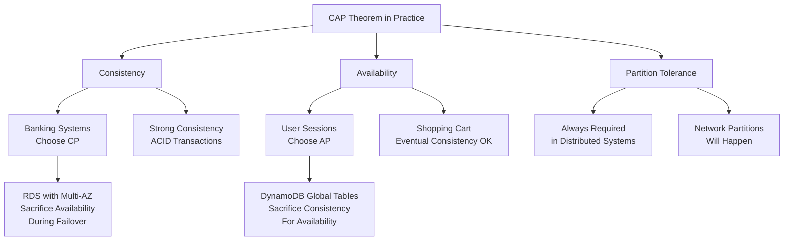
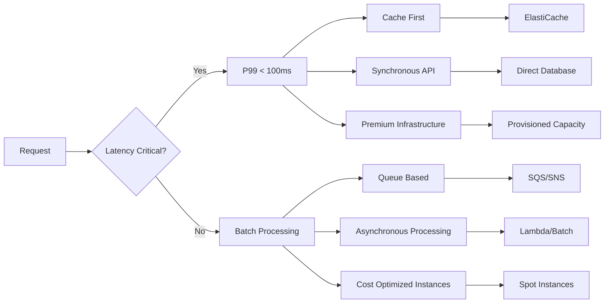
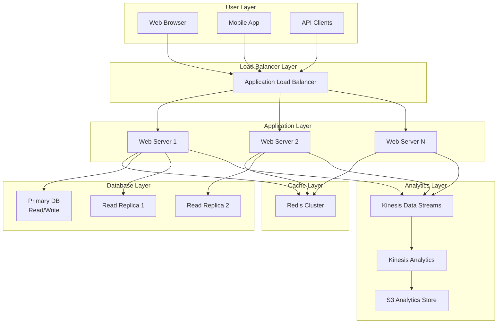

# System Design Fundamentals for Amazon L6/L7 Interviews

## 🏗️ The Amazon System Design Reality

System design interviews at Amazon are not just about technical architecturethey're about demonstrating your ability to think at scale, make trade-offs under uncertainty, and design systems that embody Amazon's operational excellence. For L6/L7 candidates, the expectation is that you can design production-ready systems that serve millions to billions of users while considering cost, reliability, and maintainability.

!!! quote "2024 Candidate Insights"
    **L7 Success (September 2024):** "They didn't just want to see I could design a systemthey wanted to see I could design a system that would survive Amazon's scale and operational complexity."
    
    **L6 Feedback (November 2024):** "I focused too much on the perfect technical solution and not enough on the practical trade-offs. Amazon wants to see how you make decisions with incomplete information."

## 📊 System Design Interview Structure at Amazon

### Interview Format and Expectations

| Level | Duration | Scope | Success Criteria |
|:-----:|:--------:|-------|------------------|
| **L6** | 60 minutes | Multi-service system | Production-ready design with clear scaling strategy |
| **L7** | 90 minutes | Platform/ecosystem | Innovative architecture with organizational impact |

### Typical Question Progression
```markdown
**Minutes 0-10: Problem Clarification**
- Functional requirements gathering
- Non-functional requirements (scale, performance, availability)
- Constraints and assumptions validation
- Success metrics definition

**Minutes 10-30: High-Level Architecture**
- System components identification
- Data flow design
- API design and contracts
- Technology stack selection

**Minutes 30-50: Deep Dive and Scaling**
- Database design and sharding strategies
- Caching layers and performance optimization
- Reliability and fault tolerance
- Security and compliance considerations

**Minutes 50-60: Operational Excellence**
- Monitoring and alerting strategy
- Deployment and rollback procedures
- Cost optimization approaches
- Maintenance and evolution planning
```

## 🎯 Amazon's System Design Philosophy

### Core Principles for L6/L7 Design

#### 1. Customer Obsession in Architecture
```python
# Amazon's approach to system design prioritizes customer experience
customer_obsession_design = {
    "latency": "Single-digit milliseconds for critical paths",
    "availability": "99.99% for customer-facing services",
    "consistency": "Eventual consistency acceptable if UX benefits",
    "error_handling": "Graceful degradation over hard failures",
    "personalization": "Built-in from day one, not bolted on"
}

# Example: Design decisions for Prime Video streaming
design_decisions = {
    "CDN_strategy": "Edge locations globally for < 50ms latency",
    "adaptive_bitrate": "Quality adjusts to network conditions",
    "offline_viewing": "Download capability for poor connectivity",
    "error_recovery": "Seamless failover to different quality streams"
}
```

#### 2. Operational Excellence Framework
```markdown
**Amazon's Operational Excellence Pillars:**

1. **Design for Operations**
   - Every component has monitoring/alerting built-in
   - Automated deployment and rollback procedures
   - Clear ownership and on-call responsibilities
   - Runbooks for all failure scenarios

2. **Build for Scale**
   - Horizontal scaling as default approach
   - Stateless services and shared-nothing architecture
   - Database sharding strategies from day one
   - Queue-based asynchronous processing

3. **Embrace Failure**
   - Circuit breakers and bulkheads pattern
   - Chaos engineering and fault injection
   - Multi-region active-active architecture
   - Graceful degradation over hard failures

4. **Optimize Costs**
   - Resource-based pricing models
   - Auto-scaling based on demand patterns
   - Spot instances and reserved capacity optimization
   - Data lifecycle management and archival strategies
```

#### 3. Leadership Principles in Technical Design

**Ownership in System Design:**
- Design systems you can operate and maintain long-term
- Include monitoring, alerting, and debugging capabilities
- Plan for on-call burden and operational complexity
- Consider total cost of ownership, not just development cost

**Deliver Results Through Architecture:**
- Focus on business outcomes, not just technical elegance
- Design for measurable customer impact
- Include A/B testing and experimentation capabilities
- Plan for rapid iteration and feature development

## 🏗️ Essential System Design Components

### 1. Load Balancing and Traffic Management

#### Amazon's Approach to Load Balancing
```markdown
**Application Load Balancer (ALB) Patterns:**
- Layer 7 routing based on content, headers, or path
- Health checks with custom endpoints and criteria
- Weighted routing for gradual traffic shifting
- Multi-target group routing for blue-green deployments

**Network Load Balancer (NLB) for High Performance:**
- Layer 4 routing for ultra-low latency requirements
- Static IP addresses for whitelisting scenarios
- Cross-zone load balancing for availability
- Connection draining for graceful scaling

**Global Load Balancing with Route 53:**
- Geolocation routing for compliance requirements
- Latency-based routing for performance optimization
- Health checks with fallback regions
- Weighted policies for traffic splitting
```

#### Real-World Example: E-commerce Platform Load Balancing
```yaml
# Production load balancing configuration for L6 scale
load_balancer_architecture:
  global_dns:
    primary_region: "us-east-1"
    secondary_region: "us-west-2"
    health_check_interval: "30s"
    failover_threshold: "3_consecutive_failures"
  
  application_tier:
    alb_configuration:
      target_groups:
        - web_servers: "weight: 80"
        - mobile_api: "weight: 20"
      health_check: "/health"
      deregistration_delay: "300s"
  
  auto_scaling:
    min_capacity: 4
    max_capacity: 100
    target_cpu_utilization: 70
    scale_out_cooldown: "300s"
    scale_in_cooldown: "300s"
```

### 2. Database Design and Data Management

#### Choosing the Right Database for Amazon Scale

```markdown
**RDS vs DynamoDB Decision Matrix:**

| Requirement | RDS (PostgreSQL/MySQL) | DynamoDB |
|-------------|------------------------|----------|
| **ACID Transactions** |  Full ACID compliance | L Limited transaction support |
| **Complex Queries** |  SQL, joins, aggregations | L Simple key-value queries only |
| **Scaling** | L Vertical scaling limits |  Automatic horizontal scaling |
| **Performance** | L I/O bound, predictable load |  Single-digit millisecond latency |
| **Cost at Scale** | L Expensive for large datasets |  Pay-per-request pricing |
| **Operational Burden** | L Requires tuning and maintenance |  Fully managed |

**Decision Framework:**
- Use RDS for: Financial systems, complex reporting, existing SQL workflows
- Use DynamoDB for: User sessions, gaming leaderboards, IoT data, real-time applications
- Use both: CQRS pattern with RDS for writes, DynamoDB for reads
```

#### Database Sharding Strategies for L6/L7 Scale

```python
# Horizontal sharding implementation example
class ShardingStrategy:
    def __init__(self, num_shards=16):
        self.num_shards = num_shards
        self.shard_map = {}
    
    def get_shard_key(self, user_id):
        """Consistent hashing for user data distribution"""
        return hash(user_id) % self.num_shards
    
    def get_database_connection(self, shard_key):
        """Return appropriate database connection for shard"""
        return f"user_db_shard_{shard_key}"
    
    def cross_shard_query(self, query_params):
        """Handle queries that span multiple shards"""
        results = []
        for shard in range(self.num_shards):
            shard_result = self.query_shard(shard, query_params)
            results.extend(shard_result)
        return self.merge_results(results)

# L6 Challenge: Design for 10M users
# L7 Challenge: Design for 1B+ users with global distribution
```

### 3. Caching Architecture

#### Multi-Layer Caching Strategy

```markdown
**Amazon's Caching Hierarchy:**

1. **CDN Layer (CloudFront)**
   - Static assets (images, CSS, JavaScript)
   - API responses with appropriate TTL
   - Geographic distribution for global latency
   - Cache invalidation strategies

2. **Application-Level Caching (ElastiCache)**
   - Redis for complex data structures and pub/sub
   - Memcached for simple key-value caching
   - Cluster mode for high availability
   - Cache-aside vs write-through patterns

3. **Database Query Caching**
   - Query result caching for expensive operations
   - Materialized views for complex aggregations
   - Database connection pooling
   - Query optimization and indexing strategies

**Cache Invalidation Strategies:**
- Time-based TTL for frequently changing data
- Event-driven invalidation for critical updates
- Cache versioning for gradual rollouts
- Cache warming for predictable traffic patterns
```

#### Real-World Caching Implementation
```json
{
  "caching_strategy": {
    "user_profile": {
      "cache_type": "Redis",
      "ttl": "1_hour",
      "invalidation": "user_update_event",
      "backup_strategy": "database_fallback"
    },
    "product_catalog": {
      "cache_type": "CloudFront + ElastiCache",
      "ttl": "24_hours",
      "invalidation": "inventory_change_event",
      "warming_strategy": "scheduled_job_4am"
    },
    "search_results": {
      "cache_type": "Elasticsearch + Redis",
      "ttl": "15_minutes",
      "invalidation": "content_update_event",
      "personalization": "user_based_cache_keys"
    }
  },
  "performance_targets": {
    "cache_hit_ratio": "> 95%",
    "cache_latency": "< 1ms",
    "fallback_latency": "< 100ms"
  }
}
```

### 4. Microservices Architecture and Communication

#### Service Decomposition Strategy

```markdown
**Amazon's Microservices Principles:**

1. **Single Responsibility**
   - Each service owns one business capability
   - Clear boundaries and minimal coupling
   - Independent deployment and scaling
   - Team ownership and accountability

2. **Database per Service**
   - No shared databases between services
   - Data consistency through event sourcing
   - SAGA pattern for distributed transactions
   - API contracts for data access

3. **Fault Isolation**
   - Circuit breaker pattern implementation
   - Bulkhead pattern for resource isolation
   - Timeout and retry configurations
   - Graceful degradation strategies

**Service Communication Patterns:**
- Synchronous: REST APIs for real-time operations
- Asynchronous: SQS/SNS for eventual consistency
- Event sourcing: Event store for audit trails
- CQRS: Separate read/write models for optimization
```

#### Inter-Service Communication Example
```yaml
# Microservices communication architecture
services:
  user_service:
    responsibilities:
      - User authentication and authorization
      - Profile management
      - Preference settings
    apis:
      - POST /users/authenticate
      - GET /users/{user_id}/profile
      - PUT /users/{user_id}/preferences
    
  order_service:
    responsibilities:
      - Order creation and management
      - Payment processing coordination
      - Order history and tracking
    dependencies:
      - user_service: "user authentication"
      - inventory_service: "stock validation"
      - payment_service: "payment processing"
    
  notification_service:
    responsibilities:
      - Email and SMS notifications
      - Push notification management
      - Notification preferences
    communication_pattern: "event_driven"
    message_queues:
      - order_events: "SQS queue for order updates"
      - user_events: "SNS topic for user changes"
```

## <� Amazon-Specific System Design Patterns

### 1. The "Everything is an API" Pattern

```markdown
**Amazon's API-First Philosophy:**

Every system component should be accessible via well-defined APIs:
- Internal teams consume APIs just like external customers
- Versioning strategy for backward compatibility
- Rate limiting and authentication for all APIs
- Comprehensive documentation and SDK generation

**API Design Principles:**
1. **RESTful when possible, GraphQL when complex**
2. **Idempotent operations for reliability**
3. **Consistent error handling and status codes**
4. **Comprehensive monitoring and analytics**
5. **Security by default (HTTPS, authentication, authorization)**
```

### 2. The "Two-Pizza Team" Architecture Pattern

```python
# Service architecture for independent team ownership
team_service_architecture = {
    "team_size": "6-8 engineers",
    "service_ownership": "full_lifecycle",
    "deployment_independence": True,
    "technology_choice_freedom": True,
    "operational_responsibility": "24/7_on_call",
    
    "boundaries": {
        "data_ownership": "exclusive_database_access",
        "api_contracts": "backward_compatible_versioning",
        "deployment_pipeline": "independent_ci_cd",
        "monitoring": "team_specific_dashboards"
    },
    
    "communication": {
        "sync_apis": "real_time_operations",
        "async_events": "eventual_consistency",
        "shared_nothing": "no_direct_database_access"
    }
}
```

### 3. The "Backwards Compatibility" Pattern

```markdown
**API Evolution Strategy:**

1. **Additive Changes Only**
   - New fields can be added to responses
   - New optional parameters can be added to requests
   - New endpoints can be added to existing services

2. **Deprecation Timeline**
   - Announce deprecation 6 months in advance
   - Provide migration guides and tools
   - Monitor usage and assist remaining clients
   - Remove deprecated functionality after 12 months

3. **Versioning Strategy**
   - URL versioning: /v1/users, /v2/users
   - Header versioning: API-Version: 2.0
   - Content negotiation: Accept: application/vnd.api+json;version=2

**Example: User Service API Evolution**
```
# Version 1.0
GET /v1/users/{id}
Response: {"id": 123, "name": "John", "email": "john@example.com"}

# Version 2.0 (Backwards Compatible)
GET /v1/users/{id}
Response: {"id": 123, "name": "John", "email": "john@example.com", "preferences": {...}}

# Version 2.0 (New Endpoint)
GET /v2/users/{id}
Response: {"user_id": 123, "full_name": "John Doe", "contact": {"email": "john@example.com"}}
```

## =� Scaling Strategies for L6/L7 Interviews

### Horizontal vs Vertical Scaling Decision Framework

```markdown
**When to Use Horizontal Scaling:**
 Stateless applications
 Read-heavy workloads
 Predictable traffic patterns
 Cost-sensitive operations
 High availability requirements

**When to Use Vertical Scaling:**
 Database operations requiring ACID properties
 Legacy applications with shared state
 Complex in-memory caching requirements
 Temporary traffic spikes
 Rapid deployment needs

**Hybrid Approach for L7 Scale:**
- Auto-scaling groups for web tier (horizontal)
- RDS with read replicas (mixed approach)
- Elasticsearch clusters (horizontal)
- Cache clusters with automatic failover (horizontal)
```

### Real-World Scaling Example: Video Streaming Service

```yaml
# L7-level scaling architecture for global video streaming
global_streaming_architecture:
  content_delivery:
    edge_locations: 200+
    origin_servers: 
      - primary: "us-east-1"
      - secondary: "eu-west-1"
      - tertiary: "ap-southeast-1"
    
  video_processing:
    encoding_pipeline:
      instances: "auto-scaling 10-1000"
      instance_type: "c5.24xlarge with GPU"
      processing_queue: "SQS FIFO with visibility timeout"
    
    storage_tier:
      hot_storage: "S3 Standard for recent content"
      warm_storage: "S3 IA for older content"
      cold_storage: "Glacier for archival"
    
  user_facing_services:
    api_gateway:
      throttling: "10000 requests/second per user"
      caching: "CloudFront with 24-hour TTL"
    
    recommendation_engine:
      compute: "EMR clusters with Spark"
      data_store: "DynamoDB with GSI"
      real_time_updates: "Kinesis Data Streams"
    
  database_architecture:
    user_data: "DynamoDB with global tables"
    content_metadata: "Aurora PostgreSQL with cross-region replicas"
    analytics: "Redshift with daily ETL from S3"
```

## = Security and Compliance at Scale

### Security by Design Principles

```markdown
**Amazon's Security Framework for System Design:**

1. **Identity and Access Management**
   - IAM roles and policies for service-to-service communication
   - Least privilege principle for all system components
   - Regular access reviews and automatic policy enforcement
   - Multi-factor authentication for administrative access

2. **Data Protection**
   - Encryption at rest using AWS KMS
   - Encryption in transit with TLS 1.3
   - Data classification and handling procedures
   - Key rotation and access logging

3. **Network Security**
   - VPC isolation and security groups
   - Private subnets for database and application tiers
   - WAF protection for web-facing applications
   - DDoS protection with AWS Shield

4. **Monitoring and Incident Response**
   - CloudTrail for API call logging
   - GuardDuty for threat detection
   - Security hub for compliance monitoring
   - Automated incident response workflows
```

### Compliance Considerations for L6/L7 Design

```python
# Compliance requirements affecting system architecture
compliance_requirements = {
    "GDPR": {
        "data_residency": "EU data must stay in EU regions",
        "right_to_be_forgotten": "Hard delete capability required",
        "data_portability": "Export APIs for user data",
        "consent_management": "Granular privacy preferences"
    },
    
    "SOX": {
        "audit_trails": "Immutable logs for financial transactions",
        "change_management": "Approval workflows for production changes",
        "access_controls": "Segregation of duties enforcement",
        "data_integrity": "Checksums and validation for financial data"
    },
    
    "HIPAA": {
        "encryption": "AES-256 for all PHI data",
        "access_logging": "Detailed audit logs for data access",
        "business_associate_agreements": "Third-party service contracts",
        "minimum_necessary": "Role-based data access controls"
    }
}
```

## =� Performance Optimization and Monitoring

### Key Performance Metrics for L6/L7 Systems

```markdown
**Application Performance Metrics:**
- Response time percentiles (P50, P95, P99, P99.9)
- Throughput (requests per second)
- Error rates and error distribution
- Availability and uptime measurements

**Infrastructure Performance Metrics:**
- CPU utilization and memory usage
- Network throughput and latency
- Disk I/O and storage utilization
- Database connection pool metrics

**Business Performance Metrics:**
- Conversion rates and user engagement
- Revenue per user and customer lifetime value
- Feature adoption and usage patterns
- Customer satisfaction scores
```

### Monitoring Architecture Example

```json
{
  "monitoring_stack": {
    "metrics_collection": {
      "application_metrics": "CloudWatch custom metrics",
      "infrastructure_metrics": "CloudWatch agent",
      "custom_dashboards": "CloudWatch dashboards + Grafana"
    },
    
    "logging_strategy": {
      "application_logs": "CloudWatch Logs with structured JSON",
      "access_logs": "ALB access logs to S3",
      "audit_logs": "CloudTrail for API calls"
    },
    
    "alerting_framework": {
      "real_time_alerts": "CloudWatch alarms + SNS",
      "escalation_policy": "PagerDuty integration",
      "alert_fatigue_prevention": "ML-based anomaly detection"
    },
    
    "distributed_tracing": {
      "service": "AWS X-Ray",
      "custom_instrumentation": "OpenTelemetry",
      "performance_analysis": "Request flow visualization"
    }
  }
}
```

## <� L6 vs L7 System Design Differentiation

### L6 System Design Expectations

```markdown
**L6 Focus Areas:**
- Design scalable systems for millions of users
- Demonstrate understanding of common patterns
- Show ability to handle typical scaling challenges
- Focus on production readiness and reliability
- Understand cost implications and trade-offs

**Typical L6 Problems:**
- Design a URL shortener (like bit.ly)
- Build a chat messaging system
- Create a ride-sharing service backend
- Design a social media feed system
- Build a payment processing system

**L6 Success Criteria:**
 Clear understanding of system components
 Appropriate technology choices with justification
 Scaling strategy for expected growth
 Consideration of failure modes and reliability
 Monitoring and operational aspects
```

### L7 System Design Expectations

```markdown
**L7 Focus Areas:**
- Design platform-level systems affecting entire organizations
- Demonstrate innovative thinking and industry influence
- Show deep understanding of distributed systems trade-offs
- Focus on long-term evolution and organizational impact
- Consider regulatory, compliance, and global scale challenges

**Typical L7 Problems:**
- Design AWS Lambda (serverless computing platform)
- Build a global CDN from scratch
- Create a machine learning platform for the company
- Design a real-time fraud detection system
- Build a global payment infrastructure

**L7 Success Criteria:**
 Innovation beyond standard patterns
 Deep understanding of distributed systems principles
 Consideration of organizational and team implications
 Global scale and multi-region considerations
 Platform thinking and ecosystem development
```

## =� System Design Interview Checklist

### Pre-Interview Preparation (4 Weeks Out)

```markdown
**Fundamental Concepts Review:**
- [ ] CAP theorem and consistency models
- [ ] Database sharding and replication strategies
- [ ] Caching patterns and cache invalidation
- [ ] Load balancing and traffic routing
- [ ] Microservices communication patterns
- [ ] Security and authentication mechanisms

**AWS Services Deep Dive:**
- [ ] EC2, ELB, Auto Scaling fundamentals
- [ ] RDS vs DynamoDB use cases and trade-offs
- [ ] S3 storage classes and lifecycle policies
- [ ] CloudFront and global content delivery
- [ ] SQS, SNS, and asynchronous messaging
- [ ] Lambda and serverless architecture patterns

**Practice Problems:**
- [ ] Complete 20+ system design problems
- [ ] Practice both L6 and L7 level problems
- [ ] Time yourself: 60 minutes for L6, 90 minutes for L7
- [ ] Record yourself and review for clarity
- [ ] Get feedback from experienced engineers
```

### During the Interview

```markdown
**First 10 Minutes - Requirements Gathering:**
- [ ] Ask clarifying questions about functional requirements
- [ ] Establish scale estimates (users, requests, data size)
- [ ] Confirm non-functional requirements (availability, consistency)
- [ ] Validate assumptions with the interviewer
- [ ] Define success metrics and constraints

**Next 20 Minutes - High-Level Design:**
- [ ] Draw system components and their relationships
- [ ] Explain data flow through the system
- [ ] Choose appropriate technologies with justification
- [ ] Address the primary use cases
- [ ] Get interviewer buy-in before diving deeper

**Next 20 Minutes - Detailed Design:**
- [ ] Design database schema and access patterns
- [ ] Implement caching strategy
- [ ] Address scaling bottlenecks
- [ ] Design APIs and data contracts
- [ ] Consider security and authentication

**Final 10 Minutes - Wrap Up:**
- [ ] Discuss monitoring and operational aspects
- [ ] Address failure modes and reliability
- [ ] Consider cost optimization opportunities
- [ ] Discuss future evolution and maintenance
- [ ] Answer any remaining questions
```

### Post-Interview Self-Assessment

```markdown
**Technical Accuracy:**
- [ ] Did I choose appropriate technologies for the scale?
- [ ] Were my estimates reasonable and well-justified?
- [ ] Did I address the major scaling bottlenecks?
- [ ] Were my API designs clear and consistent?
- [ ] Did I consider security and reliability adequately?

**Communication Effectiveness:**
- [ ] Did I ask good clarifying questions?
- [ ] Was my explanation clear and well-structured?
- [ ] Did I engage with the interviewer's feedback?
- [ ] Did I manage time effectively?
- [ ] Was I able to defend my design choices?

**Amazon Culture Alignment:**
- [ ] Did I demonstrate customer obsession in my design?
- [ ] Did I show ownership thinking about operations?
- [ ] Did I consider cost optimization throughout?
- [ ] Did I show dive deep technical understanding?
- [ ] Did I demonstrate deliver results focus?
```

## =� Advanced Topics for L7 Candidates

### Distributed Systems Consensus

```python
# Raft consensus algorithm implementation concepts
class RaftNode:
    def __init__(self, node_id, cluster_nodes):
        self.node_id = node_id
        self.cluster_nodes = cluster_nodes
        self.state = "follower"  # follower, candidate, leader
        self.current_term = 0
        self.voted_for = None
        self.log = []
        self.commit_index = 0
        
    def start_election(self):
        """Candidate starts election process"""
        self.state = "candidate"
        self.current_term += 1
        self.voted_for = self.node_id
        
        # Request votes from other nodes
        votes_received = 1  # Vote for self
        for node in self.cluster_nodes:
            if node != self.node_id:
                vote = self.request_vote(node)
                if vote:
                    votes_received += 1
        
        # Become leader if majority votes received
        if votes_received > len(self.cluster_nodes) // 2:
            self.state = "leader"
            self.send_heartbeats()
    
    def replicate_log_entry(self, entry):
        """Leader replicates log entry to followers"""
        if self.state != "leader":
            return False
        
        self.log.append(entry)
        successful_replications = 1  # Leader has entry
        
        for node in self.cluster_nodes:
            if node != self.node_id:
                success = self.send_append_entries(node, entry)
                if success:
                    successful_replications += 1
        
        # Commit if majority of nodes have replicated
        if successful_replications > len(self.cluster_nodes) // 2:
            self.commit_index = len(self.log) - 1
            return True
        
        return False
```

### Event Sourcing and CQRS Implementation

```markdown
**Event Sourcing for L7 Scale Systems:**

Benefits for Amazon-scale systems:
- Complete audit trail for compliance
- Time-travel queries for debugging
- Event replay for system recovery
- Horizontal scaling of read models

Implementation considerations:
- Event versioning and schema evolution
- Snapshot strategies for performance
- Event ordering and causality
- Eventual consistency handling

**CQRS Implementation Pattern:**
```json
{
  "command_side": {
    "purpose": "Handle writes and business logic",
    "database": "Aurora PostgreSQL with ACID properties",
    "scaling": "Vertical scaling with read replicas",
    "events": "Publish events to Kinesis after commit"
  },
  "query_side": {
    "purpose": "Optimized read models for different use cases",
    "databases": [
      "DynamoDB for user-facing queries",
      "Elasticsearch for search functionality",
      "Redshift for analytics and reporting"
    ],
    "scaling": "Horizontal scaling per use case",
    "consistency": "Eventual consistency acceptable"
  },
  "event_stream": {
    "technology": "Kinesis Data Streams",
    "retention": "7 days for replay capability",
    "consumers": "Lambda functions for read model updates",
    "ordering": "Partition by aggregate ID"
  }
}
```

## =� Key Takeaways and Next Steps

!!! success "Critical Success Factors"
    1. **Start with Requirements**: Always clarify functional and non-functional requirements before designing
    2. **Think in Trade-offs**: Every design decision has trade-offs; articulate them clearly
    3. **Design for Operations**: Include monitoring, alerting, and debugging from the beginning
    4. **Scale Appropriately**: Don't over-engineer for scale you don't need, but plan for growth
    5. **Embrace Amazon Culture**: Show customer obsession, ownership, and operational excellence in your design

### Recommended Learning Path

```markdown
**Week 1-2: Foundation Building**
- [ ] Review distributed systems fundamentals
- [ ] Study AWS services and their use cases
- [ ] Practice basic system design problems

**Week 3-4: Pattern Recognition**
- [ ] Learn common system design patterns
- [ ] Study real-world architectures (Netflix, Uber, etc.)
- [ ] Practice intermediate complexity problems

**Week 5-6: Advanced Concepts**
- [ ] Dive deep into consensus algorithms and distributed transactions
- [ ] Study microservices patterns and anti-patterns
- [ ] Practice L7-level platform design problems

**Week 7-8: Interview Simulation**
- [ ] Conduct mock interviews with experienced engineers
- [ ] Practice time management and communication
- [ ] Refine your design process and templates
```

## 🔄 Trade-Off Analysis Framework for Amazon Interviews

### The Amazon Decision-Making Process

```markdown
**Amazon's Trade-off Analysis Framework:**

1. **Customer Impact Assessment**
   - How does this decision affect customer experience?
   - What are the latency/availability implications?
   - How does it impact cost passed to customers?

2. **Operational Complexity Evaluation**
   - What's the operational burden of this choice?
   - How does it affect on-call load and debugging?
   - What's the learning curve for the team?

3. **Cost-Benefit Analysis**
   - What are the infrastructure costs at scale?
   - How does this impact development velocity?
   - What's the total cost of ownership over 3 years?

4. **Risk Assessment**
   - What are the failure modes of this approach?
   - How does this affect our blast radius?
   - What's our recovery strategy if this fails?
```

### CAP Theorem Applied to Real Amazon Systems



#### Real-World CAP Theorem Examples

```python
# Example: Amazon shopping cart trade-offs
shopping_cart_decisions = {
    "consistency_model": "eventual_consistency",
    "rationale": {
        "customer_impact": "User can continue shopping even during network issues",
        "business_impact": "Better conversion rates vs perfect consistency",
        "technical_trade_off": "Accept duplicate items vs cart unavailability"
    },
    
    "implementation": {
        "primary_storage": "DynamoDB with local strong consistency",
        "conflict_resolution": "Last writer wins with timestamp",
        "reconciliation": "Background process merges conflicting states",
        "user_experience": "Show merged cart with confirmation dialog"
    },
    
    "monitoring": {
        "conflict_rate": "< 0.01% of cart operations",
        "reconciliation_latency": "< 30 seconds",
        "customer_complaints": "Track 'missing items' reports"
    }
}
```

### Latency vs Throughput Trade-offs

```markdown
**When to Optimize for Latency:**
- Real-time user interactions (search suggestions, chat)
- Financial transactions requiring immediate feedback
- Gaming and interactive applications
- Mobile applications with limited bandwidth

**When to Optimize for Throughput:**
- Batch processing and ETL operations
- Log processing and analytics
- Image/video processing pipelines
- Background synchronization tasks

**Amazon's Approach to Latency-Throughput Balance:**
```



### Cost vs Performance Analysis

```json
{
  "cost_performance_matrix": {
    "high_performance_high_cost": {
      "use_cases": ["Real-time trading", "Gaming leaderboards", "Live streaming"],
      "aws_services": ["DynamoDB On-Demand", "Lambda Provisioned Concurrency", "ElastiCache"],
      "cost_multiplier": "3-5x standard",
      "performance_gain": "10-100x latency improvement"
    },
    
    "balanced_approach": {
      "use_cases": ["E-commerce", "Social media", "Content management"],
      "aws_services": ["RDS", "EC2 Auto Scaling", "CloudFront"],
      "cost_multiplier": "1-2x standard",
      "performance_gain": "2-5x latency improvement"
    },
    
    "cost_optimized": {
      "use_cases": ["Data processing", "Backup systems", "Analytics"],
      "aws_services": ["Spot Instances", "S3 IA/Glacier", "Reserved Instances"],
      "cost_multiplier": "0.1-0.5x standard",
      "performance_trade_off": "Higher latency acceptable"
    }
  }
}
```

## 🏗️ Complete System Design Walkthrough: URL Shortener

### L6-Level URL Shortener Design (60-Minute Interview)

#### Phase 1: Requirements Gathering (10 minutes)

```markdown
**Functional Requirements:**
- Shorten long URLs to 6-7 character codes
- Redirect users when they click shortened URLs
- Custom aliases (optional)
- URL expiration (optional)
- Analytics on click counts

**Non-Functional Requirements:**
- 100M URLs created per month
- 100:1 read-to-write ratio (10B redirects per month)
- 99.9% availability
- < 100ms latency for redirects
- 5 years of URL retention

**Scale Estimation:**
- 100M URLs/month = ~40 URLs/second
- 10B redirects/month = ~4000 redirects/second
- Storage: 100M URLs × 500 bytes = 50GB per month
- Bandwidth: 4000 RPS × 500 bytes = 2MB/s
```

#### Phase 2: High-Level Architecture (15 minutes)



#### Phase 3: API Design (10 minutes)

```python
# REST API Design for URL Shortener

class URLShortenerAPI:
    """
    API endpoints for L6-level URL shortener system
    """
    
    def create_short_url(self, request):
        """
        POST /api/v1/urls
        {
            "long_url": "https://example.com/very/long/url",
            "custom_alias": "my-link",  # optional
            "expiration_date": "2024-12-31T23:59:59Z"  # optional
        }
        
        Response:
        {
            "short_url": "https://short.ly/abc123",
            "short_code": "abc123",
            "long_url": "https://example.com/very/long/url",
            "created_at": "2024-01-01T00:00:00Z",
            "expires_at": "2024-12-31T23:59:59Z"
        }
        """
        pass
    
    def redirect_url(self, short_code):
        """
        GET /{short_code}
        
        Response: 301 Redirect to long URL
        Headers: Location: https://example.com/very/long/url
        """
        pass
    
    def get_analytics(self, short_code):
        """
        GET /api/v1/analytics/{short_code}
        
        Response:
        {
            "short_code": "abc123",
            "total_clicks": 1500,
            "unique_clicks": 1200,
            "clicks_by_date": {...},
            "top_referrers": [...],
            "geographic_distribution": {...}
        }
        """
        pass

# URL encoding algorithm
import base62
import hashlib
import time

def generate_short_code(long_url, user_id=None):
    """
    Generate short code using base62 encoding
    """
    # Approach 1: Counter-based (simple, sequential)
    # Pros: Predictable length, no collisions
    # Cons: Predictable, requires coordination
    
    # Approach 2: Hash-based (chosen for this design)
    # Pros: Distributed generation, random
    # Cons: Potential collisions, need retry logic
    
    hash_input = f"{long_url}_{user_id}_{time.time()}"
    hash_value = hashlib.sha256(hash_input.encode()).hexdigest()
    
    # Take first 43 bits for base62 encoding (7 characters)
    numeric_hash = int(hash_value[:11], 16)
    short_code = base62.encode(numeric_hash)[:7]
    
    return short_code
```

#### Phase 4: Database Design (10 minutes)

```sql
-- Database schema for URL shortener
-- Using PostgreSQL for ACID properties and complex queries

-- Main URLs table
CREATE TABLE urls (
    id BIGSERIAL PRIMARY KEY,
    short_code VARCHAR(10) UNIQUE NOT NULL,
    long_url TEXT NOT NULL,
    user_id BIGINT,
    created_at TIMESTAMP DEFAULT NOW(),
    expires_at TIMESTAMP,
    is_active BOOLEAN DEFAULT TRUE,
    click_count BIGINT DEFAULT 0
);

-- Indexes for performance
CREATE INDEX idx_urls_short_code ON urls(short_code);
CREATE INDEX idx_urls_user_id ON urls(user_id);
CREATE INDEX idx_urls_created_at ON urls(created_at);

-- Analytics table for detailed click tracking
CREATE TABLE url_clicks (
    id BIGSERIAL PRIMARY KEY,
    short_code VARCHAR(10) NOT NULL,
    clicked_at TIMESTAMP DEFAULT NOW(),
    ip_address INET,
    user_agent TEXT,
    referrer TEXT,
    country VARCHAR(2),
    city VARCHAR(100)
);

-- Partitioning strategy for analytics table
CREATE TABLE url_clicks_y2024m01 PARTITION OF url_clicks
    FOR VALUES FROM ('2024-01-01') TO ('2024-02-01');

-- Users table (optional, for authenticated users)
CREATE TABLE users (
    id BIGSERIAL PRIMARY KEY,
    email VARCHAR(255) UNIQUE,
    api_key VARCHAR(64) UNIQUE,
    created_at TIMESTAMP DEFAULT NOW(),
    plan_type VARCHAR(20) DEFAULT 'free',
    monthly_limit INTEGER DEFAULT 1000
);
```

#### Phase 5: Scaling Strategy (10 minutes)

```markdown
**Scaling Bottlenecks and Solutions:**

1. **Database Write Bottleneck (URL Creation)**
   - Problem: 40 writes/second on single primary
   - Solution: Database sharding by short_code hash
   - Implementation: 16 shards, route by hash(short_code) % 16

2. **Database Read Bottleneck (URL Redirects)**
   - Problem: 4000 reads/second from single database
   - Solution: Read replicas + aggressive caching
   - Implementation: 3 read replicas, 95% cache hit ratio

3. **Cache Layer Scaling**
   - Problem: Redis memory limits and single point of failure
   - Solution: Redis Cluster with automatic failover
   - Implementation: 6 nodes (3 primary + 3 replicas)

4. **Application Layer Scaling**
   - Problem: EC2 instances hitting CPU/memory limits
   - Solution: Auto Scaling Groups with target tracking
   - Implementation: Min 2, Max 20 instances, 70% CPU target
```

```python
# Sharding strategy implementation
class URLShardingStrategy:
    def __init__(self, num_shards=16):
        self.num_shards = num_shards
        self.shard_connections = self._initialize_connections()
    
    def get_shard_for_write(self, short_code):
        """Route new URL creation to appropriate shard"""
        shard_id = hash(short_code) % self.num_shards
        return self.shard_connections[shard_id]['write']
    
    def get_shard_for_read(self, short_code):
        """Route URL reads to appropriate shard (with read replicas)"""
        shard_id = hash(short_code) % self.num_shards
        # Use read replica for better performance
        return self.shard_connections[shard_id]['read']
    
    def get_user_urls(self, user_id):
        """Query across all shards for user's URLs"""
        results = []
        for shard in self.shard_connections:
            shard_results = shard['read'].execute(
                "SELECT * FROM urls WHERE user_id = %s", (user_id,)
            )
            results.extend(shard_results)
        return results

# Caching strategy
class URLCacheManager:
    def __init__(self, redis_cluster):
        self.redis = redis_cluster
        self.url_ttl = 24 * 60 * 60  # 24 hours
        self.analytics_ttl = 5 * 60   # 5 minutes
    
    def get_url(self, short_code):
        """Get URL from cache with fallback to database"""
        cached_url = self.redis.get(f"url:{short_code}")
        if cached_url:
            return json.loads(cached_url)
        
        # Cache miss - fetch from database
        url_data = self.database.get_url(short_code)
        if url_data:
            self.redis.setex(
                f"url:{short_code}", 
                self.url_ttl, 
                json.dumps(url_data)
            )
        return url_data
    
    def increment_click_count(self, short_code):
        """Async increment click count"""
        # Use Redis for fast increment, sync to DB periodically
        pipeline = self.redis.pipeline()
        pipeline.incr(f"clicks:{short_code}")
        pipeline.expire(f"clicks:{short_code}", self.analytics_ttl)
        pipeline.execute()
```

#### Phase 6: Monitoring and Operations (5 minutes)

```json
{
  "monitoring_strategy": {
    "application_metrics": {
      "url_creation_rate": "Target: 40/sec, Alert if > 100/sec",
      "redirect_latency": "P95 < 50ms, Alert if P95 > 100ms",
      "cache_hit_ratio": "Target: > 95%, Alert if < 90%",
      "error_rate": "Target: < 0.1%, Alert if > 1%"
    },
    
    "infrastructure_metrics": {
      "database_connections": "Alert if > 80% of pool",
      "redis_memory_usage": "Alert if > 75%",
      "ec2_cpu_utilization": "Auto-scale at 70%",
      "alb_target_response_time": "Alert if > 200ms"
    },
    
    "business_metrics": {
      "daily_url_creation": "Track trends and capacity planning",
      "top_domains": "Identify potential abuse patterns",
      "geographic_distribution": "Plan CDN expansion",
      "user_retention": "Track API usage patterns"
    }
  },
  
  "alerting_runbooks": {
    "high_redirect_latency": {
      "investigation_steps": [
        "Check cache hit ratio",
        "Verify database performance",
        "Check network connectivity",
        "Review recent deployments"
      ],
      "escalation_path": "L1 -> L2 -> Engineering Manager",
      "auto_mitigation": "Scale out application tier"
    }
  }
}
```

### Common L6 Interview Mistakes to Avoid

```markdown
**Technical Mistakes:**
❌ Starting with complex sharding before simple solutions
❌ Over-engineering for scale not in requirements  
❌ Ignoring caching until the end of the interview
❌ Not considering data consistency requirements
❌ Forgetting about URL validation and security

**Process Mistakes:**
❌ Jumping to detailed design without high-level architecture
❌ Not asking clarifying questions about scale and requirements
❌ Spending too much time on one component
❌ Not considering operational aspects (monitoring, deployment)
❌ Not justifying technology choices

**Amazon-Specific Mistakes:**
❌ Not considering cost optimization strategies
❌ Ignoring customer impact of design decisions  
❌ Not planning for failure scenarios
❌ Overlooking compliance and security requirements
❌ Not showing ownership thinking about operations
```

---

**Related Resources:**
- [AWS Services Deep Dive](aws-services.md) - Detailed AWS service patterns and use cases
- [L6 System Design Problems](l6-problems.md) - Practice problems for L6 candidates
- [L7 System Design Problems](l7-problems.md) - Advanced problems for L7 candidates  
- [Scale Architecture Patterns](scale-architecture.md) - Advanced scaling strategies
- [System Design Case Studies](case-studies.md) - Real-world implementation examples

*Continue to: [AWS Services for System Design](aws-services.md) �*