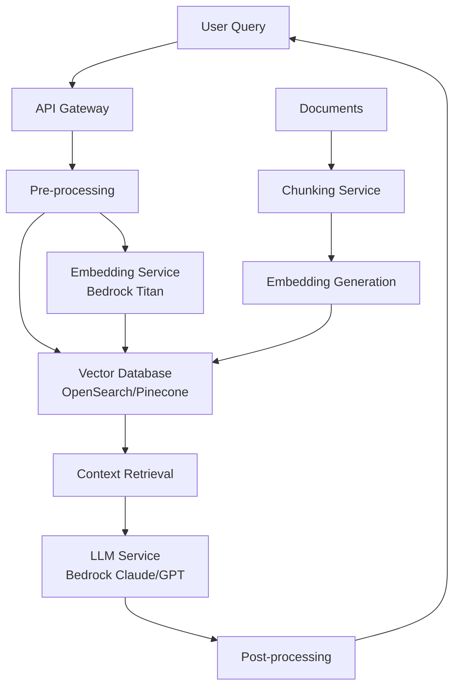
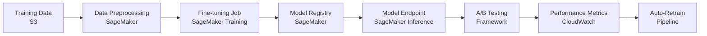
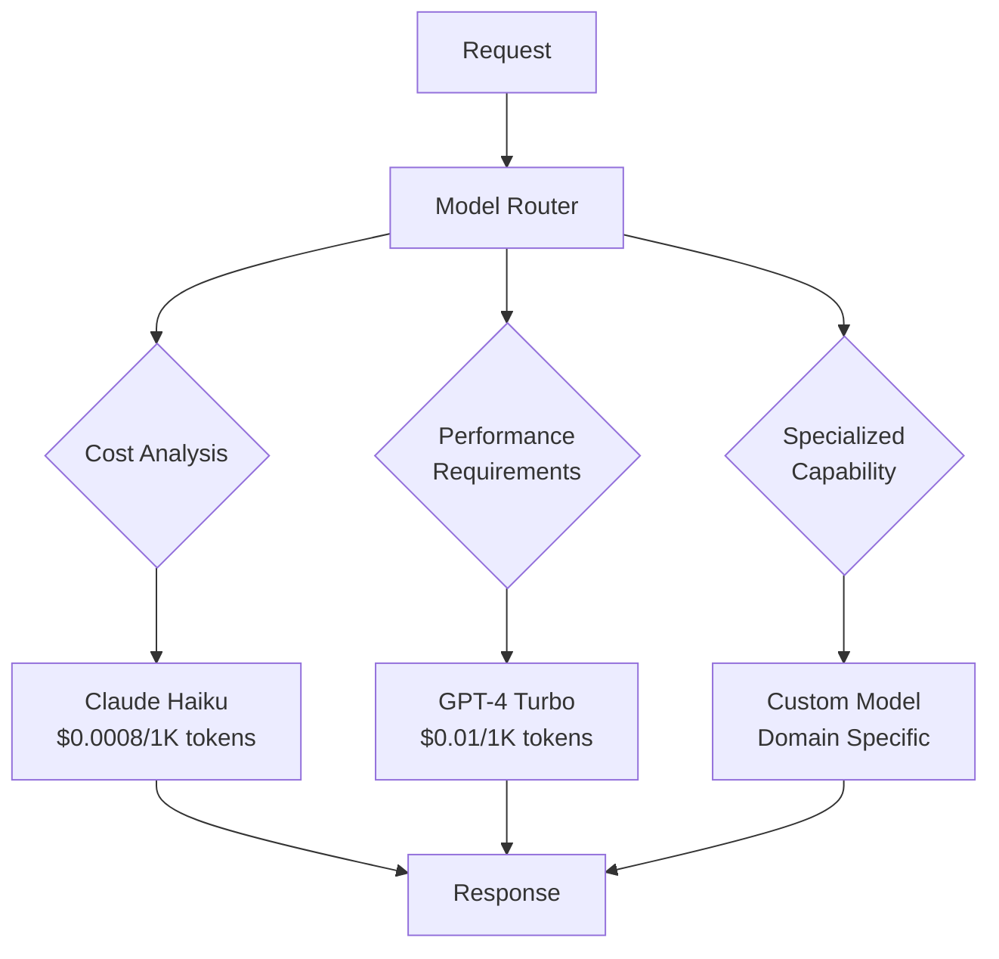
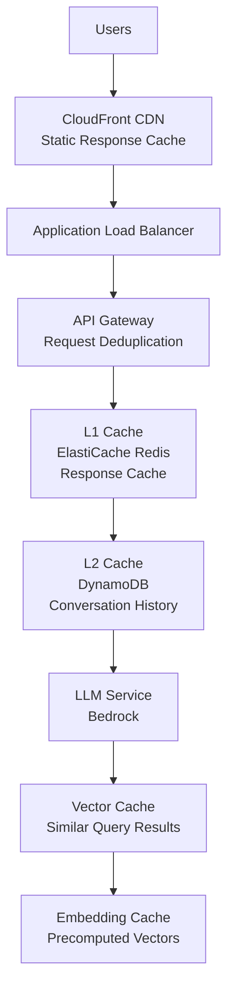
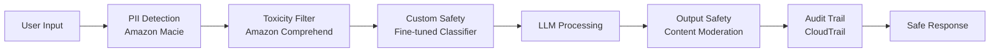

# Generative AI System Design for Amazon L6/L7 Interviews

## 🤖 Leading AI/ML at Amazon Scale (2025)

Generative AI has become a cornerstone of Amazon's technical strategy. As an L6/L7 engineering manager, you need to demonstrate expertise in architecting GenAI systems that serve millions of customers while optimizing for cost, reliability, and performance.

!!! quote "Real L7 Engineering Manager (January 2025)"
    "GenAI system design isn't about using the latest model—it's about building sustainable platforms that scale across business units while managing token costs and ensuring responsible AI practices."

## 📊 Market Context & Business Impact

### 2025 GenAI Landscape at Amazon
- **Amazon Bedrock**: $1.2B+ ARR in foundation model services
- **CodeWhisperer**: 10M+ developers using AI-assisted coding
- **Alexa AI**: Next-gen conversational experiences
- **Supply Chain AI**: $500M+ savings through predictive optimization
- **Customer Service AI**: 40% reduction in human-agent escalations

### Cost Economics Reality
```python
# Token Economics for Enterprise GenAI (2025)
claude_3_5_sonnet_cost = {
    'input_tokens': 0.003,    # per 1K tokens
    'output_tokens': 0.015,   # per 1K tokens
    'context_window': 200_000  # tokens
}

# Example: Customer service chatbot
monthly_conversations = 10_000_000
avg_input_tokens = 1000
avg_output_tokens = 500

monthly_cost = (
    (monthly_conversations * avg_input_tokens / 1000) * claude_3_5_sonnet_cost['input_tokens'] +
    (monthly_conversations * avg_output_tokens / 1000) * claude_3_5_sonnet_cost['output_tokens']
)
# Result: ~$105,000/month for 10M conversations
```

## 🏗️ GenAI Architecture Patterns

### 1. RAG (Retrieval-Augmented Generation) Architecture



**Key Components:**
- **Document Ingestion**: S3 → Lambda → Textract → Chunking
- **Vector Storage**: OpenSearch with k-NN or dedicated vector DB
- **Embedding Generation**: Bedrock Titan Embeddings
- **LLM Orchestration**: Bedrock with model routing
- **Context Assembly**: Smart retrieval with re-ranking

**Cost Optimization:**
```python
# RAG Cost Optimization Strategies
class RAGCostOptimizer:
    def __init__(self):
        self.chunk_cache = {}  # Cache frequent chunks
        self.embedding_cache = {}  # Cache embeddings
        
    def optimize_retrieval(self, query):
        # Semantic caching to reduce embedding calls
        embedding_key = hash(query)
        if embedding_key in self.embedding_cache:
            return self.embedding_cache[embedding_key]
        
        # Use cheaper models for initial filtering
        initial_results = self.vector_search_coarse(query)
        
        # Re-rank with expensive model only for top candidates
        refined_results = self.rerank_with_llm(initial_results[:20])
        
        return refined_results
```

### 2. Fine-tuning Architecture



**When to Fine-tune vs RAG:**

| Use Case | RAG | Fine-tuning | Hybrid |
|----------|-----|-------------|---------|
| **Knowledge Updates** | ✅ Dynamic | ❌ Static | ✅ Best of both |
| **Domain Expertise** | ⚠️ Context dependent | ✅ Embedded knowledge | ✅ Specialized + Current |
| **Cost at Scale** | 💰 Token costs | 💰💰 Training costs | 💰💰💰 Highest |
| **Latency** | ⚠️ Retrieval overhead | ✅ Direct inference | ⚠️ Multi-step |
| **Data Privacy** | ⚠️ External calls | ✅ Contained model | ✅ Private deployment |

### 3. Multi-Model Orchestration



**Smart Routing Logic:**
```python
class ModelRouter:
    def __init__(self):
        self.models = {
            'claude-haiku': {'cost': 0.0008, 'speed': 'fast', 'capability': 'general'},
            'claude-sonnet': {'cost': 0.003, 'speed': 'medium', 'capability': 'advanced'},
            'gpt-4-turbo': {'cost': 0.01, 'speed': 'medium', 'capability': 'reasoning'},
            'custom-finance': {'cost': 0.005, 'speed': 'fast', 'capability': 'finance'}
        }
    
    def route_request(self, request):
        # Route based on complexity, cost budget, and domain
        if request.budget < 0.001:
            return 'claude-haiku'
        elif request.domain == 'finance':
            return 'custom-finance'
        elif request.requires_reasoning():
            return 'gpt-4-turbo'
        else:
            return 'claude-sonnet'
```

## 🔧 Amazon Bedrock Integration Patterns

### Foundation Model Access

```python
import boto3
from typing import Dict, List, Optional

class BedrockService:
    def __init__(self):
        self.bedrock = boto3.client('bedrock-runtime', region_name='us-east-1')
        
    async def invoke_claude(self, prompt: str, max_tokens: int = 1000) -> str:
        """Invoke Claude 3.5 Sonnet with error handling and retries"""
        body = {
            "messages": [{"role": "user", "content": prompt}],
            "max_tokens": max_tokens,
            "temperature": 0.7,
            "anthropic_version": "bedrock-2023-05-31"
        }
        
        try:
            response = self.bedrock.invoke_model(
                modelId="anthropic.claude-3-5-sonnet-20241022-v2:0",
                body=json.dumps(body)
            )
            
            result = json.loads(response['body'].read())
            return result['content'][0]['text']
            
        except ClientError as e:
            if e.response['Error']['Code'] == 'ThrottlingException':
                await self._handle_throttling()
                return await self.invoke_claude(prompt, max_tokens)
            raise
```

### Cost Management Strategies

```python
class TokenManager:
    def __init__(self):
        self.token_budget = {}
        self.model_costs = {
            'claude-3-5-sonnet': {'input': 0.003, 'output': 0.015},
            'claude-3-haiku': {'input': 0.00025, 'output': 0.00125},
            'titan-text': {'input': 0.0008, 'output': 0.0016}
        }
    
    def estimate_cost(self, model: str, input_tokens: int, output_tokens: int) -> float:
        costs = self.model_costs[model]
        return (input_tokens / 1000) * costs['input'] + (output_tokens / 1000) * costs['output']
    
    def select_cost_optimal_model(self, task_complexity: str, budget: float) -> str:
        if budget < 0.001:
            return 'claude-3-haiku'  # Most cost-effective
        elif task_complexity == 'high' and budget > 0.01:
            return 'claude-3-5-sonnet'  # Best performance
        else:
            return 'titan-text'  # Balanced option
```

## 🚀 Scaling Patterns for Millions of Users

### 1. Caching Architecture



**Multi-Level Caching Strategy:**
```python
class MultiLevelCache:
    def __init__(self):
        self.l1_cache = Redis()  # Sub-millisecond responses
        self.l2_cache = DynamoDB()  # Context and conversation history
        self.l3_cache = S3()  # Long-term conversation archives
        
    async def get_response(self, query_hash: str) -> Optional[str]:
        # L1: Exact match cache (1ms response)
        response = await self.l1_cache.get(query_hash)
        if response:
            return response
            
        # L2: Semantic similarity cache (10ms response)
        similar_queries = await self.l2_cache.similarity_search(query_hash)
        if similar_queries and similar_queries[0].similarity > 0.95:
            response = similar_queries[0].response
            await self.l1_cache.set(query_hash, response, ttl=3600)
            return response
            
        return None  # Cache miss - proceed to LLM
```

### 2. Request Deduplication

```python
class RequestDeduplicator:
    def __init__(self):
        self.active_requests = {}  # In-flight request tracking
        
    async def deduplicate_request(self, request_key: str, handler):
        """Prevent duplicate LLM calls for identical requests"""
        if request_key in self.active_requests:
            # Wait for existing request to complete
            return await self.active_requests[request_key]
        
        # Create new request future
        future = asyncio.create_task(handler())
        self.active_requests[request_key] = future
        
        try:
            result = await future
            return result
        finally:
            del self.active_requests[request_key]
```

### 3. Auto-scaling for GenAI Workloads

```yaml
# SageMaker Auto-scaling Configuration
AutoScalingTarget:
  Type: AWS::ApplicationAutoScaling::ScalableTarget
  Properties:
    ServiceNamespace: sagemaker
    ResourceId: endpoint/genai-inference-endpoint/variant/primary
    ScalableDimension: sagemaker:variant:DesiredInstanceCount
    MinCapacity: 2
    MaxCapacity: 100
    
AutoScalingPolicy:
  Type: AWS::ApplicationAutoScaling::ScalingPolicy
  Properties:
    TargetTrackingScalingPolicies:
      - MetricType: SageMakerVariantInvocationsPerInstance
        TargetValue: 1000
        ScaleOutCooldown: 300  # 5 minutes
        ScaleInCooldown: 900   # 15 minutes
```

## 🛡️ Responsible AI & Safety Patterns

### Content Filtering Architecture



**Implementation:**
```python
class SafetyPipeline:
    def __init__(self):
        self.comprehend = boto3.client('comprehend')
        self.textract = boto3.client('textract')
        self.audit_logger = AuditLogger()
        
    async def safety_check(self, content: str, user_id: str) -> Dict:
        """Multi-layer safety checking"""
        checks = {
            'pii_detected': await self._detect_pii(content),
            'toxicity_score': await self._detect_toxicity(content),
            'custom_policy_violation': await self._check_custom_policies(content),
            'context_appropriateness': await self._check_context(content, user_id)
        }
        
        # Audit all safety checks
        await self.audit_logger.log_safety_check(user_id, content, checks)
        
        return {
            'safe': all(check['passed'] for check in checks.values()),
            'details': checks
        }
```

### Bias Detection and Mitigation

```python
class BiasMonitor:
    def __init__(self):
        self.bias_metrics = {}
        
    async def monitor_response_bias(self, prompt: str, response: str, user_demographics: Dict):
        """Monitor for demographic bias in responses"""
        bias_indicators = {
            'gender_bias': self._detect_gender_bias(response),
            'cultural_bias': self._detect_cultural_bias(response),
            'age_bias': self._detect_age_bias(response)
        }
        
        # Track bias metrics by demographic groups
        for demographic, value in user_demographics.items():
            key = f"{demographic}_{value}"
            if key not in self.bias_metrics:
                self.bias_metrics[key] = []
            
            self.bias_metrics[key].append(bias_indicators)
        
        # Alert if bias threshold exceeded
        if any(score > 0.7 for score in bias_indicators.values()):
            await self._alert_bias_detection(prompt, response, bias_indicators)
```

## 💰 Cost Optimization Strategies (2025)

### 1. Token Optimization Techniques

```python
class TokenOptimizer:
    def __init__(self):
        self.compression_ratio = 0.3  # 70% token reduction typical
        
    def optimize_prompt(self, prompt: str) -> str:
        """Reduce token count while preserving meaning"""
        optimizations = [
            self._remove_redundancy,
            self._compress_examples,
            self._abbreviate_common_terms,
            self._use_structured_format
        ]
        
        optimized = prompt
        for optimization in optimizations:
            optimized = optimization(optimized)
            
        return optimized
    
    def batch_requests(self, requests: List[str]) -> List[str]:
        """Combine multiple requests into single API call"""
        # Combine up to 10 requests per batch for cost efficiency
        batches = []
        for i in range(0, len(requests), 10):
            batch = requests[i:i+10]
            combined_prompt = self._create_batch_prompt(batch)
            batches.append(combined_prompt)
        
        return batches
```

### 2. Model Selection Economics

```python
# Cost comparison for different model choices (2025)
MONTHLY_USAGE = {
    'requests': 10_000_000,
    'avg_input_tokens': 1000,
    'avg_output_tokens': 500
}

MODEL_COSTS = {
    'claude-3-haiku': {
        'input': 0.00025,
        'output': 0.00125,
        'monthly_cost': 3750,  # $3,750/month
        'use_case': 'Simple Q&A, content generation'
    },
    'claude-3-5-sonnet': {
        'input': 0.003,
        'output': 0.015,
        'monthly_cost': 105000,  # $105,000/month
        'use_case': 'Complex reasoning, analysis'
    },
    'gpt-4-turbo': {
        'input': 0.01,
        'output': 0.03,
        'monthly_cost': 250000,  # $250,000/month
        'use_case': 'Advanced reasoning, specialized tasks'
    }
}

# Smart routing can save 60-80% on costs
def calculate_savings_with_routing():
    # Route 60% to Haiku, 30% to Sonnet, 10% to GPT-4
    mixed_cost = (
        MONTHLY_USAGE['requests'] * 0.6 * (MODEL_COSTS['claude-3-haiku']['monthly_cost'] / MONTHLY_USAGE['requests']) +
        MONTHLY_USAGE['requests'] * 0.3 * (MODEL_COSTS['claude-3-5-sonnet']['monthly_cost'] / MONTHLY_USAGE['requests']) +
        MONTHLY_USAGE['requests'] * 0.1 * (MODEL_COSTS['gpt-4-turbo']['monthly_cost'] / MONTHLY_USAGE['requests'])
    )
    return mixed_cost  # ~$58,500/month vs $250,000/month (77% savings)
```

## 🎯 Interview Framework: GenAI System Design

### Question Types You'll Face

1. **"Design a ChatGPT competitor using AWS services"**
   - Focus: Multi-model architecture, cost optimization, safety
   - Key components: Bedrock integration, conversation memory, scaling patterns

2. **"Build an enterprise knowledge base with RAG"**
   - Focus: Document ingestion, vector search, access control
   - Key components: Data pipeline, embedding strategy, security

3. **"Design an AI code review system for 10,000 developers"**
   - Focus: Code understanding, diff analysis, feedback generation
   - Key components: Git integration, specialized models, CI/CD

### Response Framework

**1. Requirements Clarification (3 minutes)**
```
- Scale: How many users? Requests per second?
- Functionality: What AI capabilities are needed?
- Data: What data sources? Privacy requirements?
- Performance: Latency and accuracy requirements?
- Budget: Cost constraints?
```

**2. High-Level Architecture (8 minutes)**
```
- Draw the key components
- Show data flow
- Identify scaling bottlenecks
- Discuss model selection
```

**3. Deep Dive (15 minutes)**
```
- API design and contracts
- Data pipeline architecture
- Model serving infrastructure
- Caching and optimization strategies
- Safety and compliance measures
```

**4. Scale and Optimize (8 minutes)**
```
- Horizontal scaling patterns
- Cost optimization techniques
- Performance monitoring
- A/B testing framework
```

**5. Trade-offs and Alternatives (6 minutes)**
```
- Model choice trade-offs
- Build vs buy decisions
- Consistency vs performance
- Cost vs quality trade-offs
```

## 📊 Success Metrics & KPIs

### Technical Metrics
```python
GENAI_METRICS = {
    'performance': {
        'response_time_p99': 2000,  # milliseconds
        'token_generation_rate': 50,  # tokens/second
        'model_availability': 99.9,  # percent
        'cache_hit_rate': 80  # percent
    },
    'quality': {
        'user_satisfaction': 4.2,  # out of 5
        'response_accuracy': 92,  # percent
        'safety_filter_precision': 99.5,  # percent
        'bias_detection_rate': 95  # percent
    },
    'cost': {
        'cost_per_1k_tokens': 0.005,  # dollars
        'monthly_token_budget': 1000000,  # dollars
        'cost_optimization_ratio': 0.4,  # 40% reduction
        'roi_multiplier': 3.2  # 3.2x return
    }
}
```

### Business Impact Metrics
- **Customer Experience**: Response quality, conversation completion rate
- **Operational Efficiency**: Automation rate, human handoff reduction
- **Revenue Impact**: Conversion improvement, user engagement increase
- **Cost Savings**: Infrastructure cost reduction, operational cost savings

## 🚨 Common Pitfalls and Red Flags

### Technical Red Flags
❌ **Over-reliance on single model**: No fallback or routing strategy
❌ **Ignoring token costs**: Not optimizing for cost at scale
❌ **Missing safety measures**: No content filtering or bias monitoring
❌ **No caching strategy**: Every request hits expensive LLM
❌ **Poor error handling**: No graceful degradation

### L6/L7 Specific Expectations

**L6 Focus:**
- Component-level GenAI system design
- Specific service integration (Bedrock, SageMaker)
- Performance optimization techniques
- Basic cost analysis

**L7 Focus:**
- Platform-level AI strategy
- Multi-team coordination and API standards
- Advanced cost optimization across business units
- Responsible AI governance frameworks
- Strategic build vs buy decisions

## 🎓 Practice Problems

### L6 Level Practice
1. **AI Customer Service Chatbot** - Design a conversational AI for e-commerce support
2. **Content Generation API** - Build a scalable content creation service
3. **Document Summarization System** - Process and summarize enterprise documents

### L7 Level Practice
1. **Multi-Modal AI Platform** - Support text, image, and video processing
2. **Enterprise AI Governance** - Build responsible AI compliance platform
3. **AI Agent Marketplace** - Platform for deploying and managing AI agents

## 📚 Essential Resources

### AWS Documentation
- [Amazon Bedrock Developer Guide](https://docs.aws.amazon.com/bedrock/)
- [SageMaker JumpStart Foundation Models](https://docs.aws.amazon.com/sagemaker/latest/dg/studio-jumpstart.html)
- [Amazon Textract AI Services](https://docs.aws.amazon.com/textract/)

### Research Papers
- "Attention Is All You Need" (Transformer Architecture)
- "Retrieval-Augmented Generation for Knowledge-Intensive NLP Tasks"
- "Constitutional AI: Harmlessness from AI Feedback"

### Industry Reports
- "State of AI Report 2024" - Nathan Benaich
- "AI Index Report 2024" - Stanford HAI
- "Generative AI in Enterprise" - McKinsey 2024

---

!!! success "Key Takeaways for L6/L7"
    1. **Cost Optimization is Critical**: Token costs can quickly spiral - demonstrate optimization strategies
    2. **Safety is Non-negotiable**: Show responsible AI practices from day one
    3. **Scale Thoughtfully**: Design for millions of users with appropriate caching and routing
    4. **Business Impact Focus**: Connect technical decisions to measurable business outcomes
    5. **Build Platforms, Not Just Features**: Think beyond single-use cases to reusable AI infrastructure

*Continue to: [ML Systems Design](ml-systems-design.md) →*