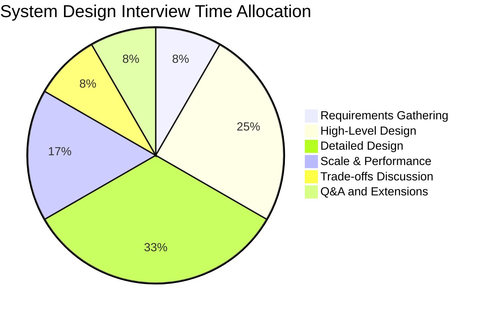
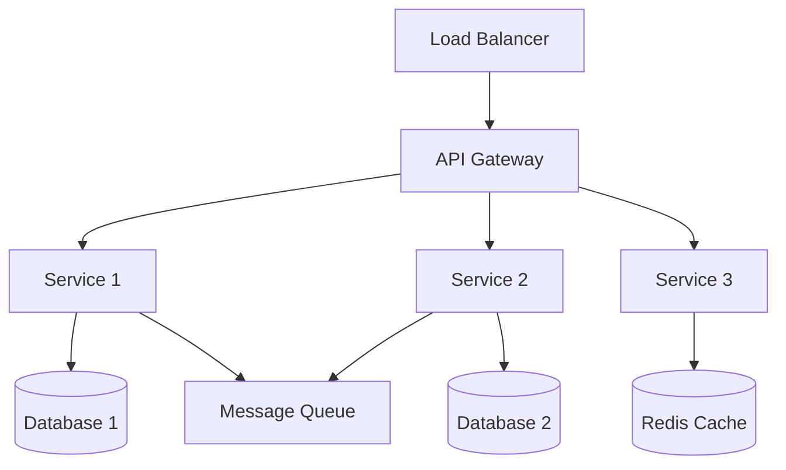
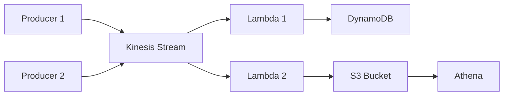
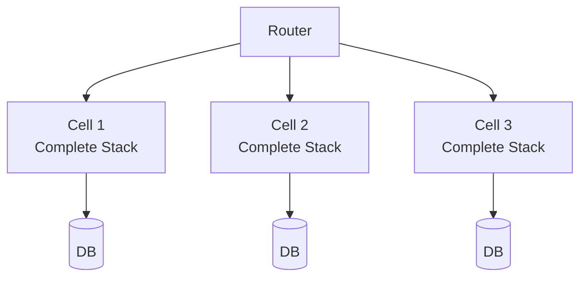

# System Design Mastery for Amazon L6/L7 Interviews

## 🏗️ Architecting at Amazon Scale

System design is the most critical component of Amazon L6/L7 engineering manager interviews. You'll need to demonstrate your ability to architect solutions that handle **hundreds of millions to billions of users**, not theoretical academic exercises.

!!! quote "Real L7 Candidate (December 2024)"
    "System design at L7 level isn't about drawing boxes and arrows—it's about organizational design, cost optimization, and strategic trade-offs."

## 🔧 Real Technical Examples

📚 **[Technical Examples Library](../experiences/technical-examples.md)** - Level-specific approaches with real implementation details

- **Database Decisions**: DynamoDB vs RDS for 100K QPS scenarios
- **Architecture Patterns**: Microservices vs Monolith with organizational implications  
- **Performance Optimization**: Real case studies with quantified results
- **Platform Strategy**: L7-level technical decision frameworks

## 📊 System Design Interview Breakdown

### Interview Format
- **Duration**: 45-60 minutes (L6), 60-90 minutes (L7)
- **Style**: Collaborative whiteboarding (virtual or physical)
- **Evaluation**: Architecture, trade-offs, scalability, leadership

### Time Management Strategy


## 🎯 What Interviewers Evaluate

### Technical Dimensions

| Aspect | What They Look For | Red Flags |
|--------|-------------------|-----------|
| **Scale** | Can handle Amazon-scale traffic | Designs for thousands not billions |
| **Reliability** | 99.99% uptime considerations | Ignores failure modes |
| **Performance** | Sub-second latency goals | No performance metrics |
| **Cost** | Cost-effective at scale | Over-engineered solutions |
| **Security** | Defense in depth | Afterthought security |
| **Operability** | Easy to maintain and monitor | Complex operations |

### Leadership Dimensions

- How you gather requirements (Customer Obsession)
- How you make trade-offs (Are Right, A Lot)
- How you handle ambiguity (Bias for Action)
- How you consider costs (Frugality)
- How you plan for growth (Think Big)

## 📚 Core System Design Patterns

### 1. Microservices Architecture



**When to Use**: Complex systems with independent scaling needs
**Trade-offs**: Complexity vs flexibility
**Amazon Examples**: Most Amazon services

### 2. Event-Driven Architecture



**When to Use**: Decoupled, asynchronous processing
**Trade-offs**: Eventual consistency vs real-time
**Amazon Examples**: Order processing, Analytics pipelines

### 3. Cell-Based Architecture



**When to Use**: Blast radius reduction
**Trade-offs**: Resource efficiency vs isolation
**Amazon Examples**: S3, Route 53

## 🔧 Essential AWS Services Knowledge

### Must-Know Services for L6

| Service | Key Concepts | Interview Usage |
|---------|--------------|-----------------|
| **EC2** | Auto-scaling, instance types | Compute layer design |
| **S3** | Consistency, storage classes | Object storage patterns |
| **DynamoDB** | Partitioning, GSI/LSI | NoSQL design |
| **RDS** | Read replicas, Multi-AZ | Relational data patterns |
| **SQS/SNS** | Fan-out, DLQ | Async processing |
| **Lambda** | Cold starts, limits | Serverless patterns |
| **CloudFront** | Edge locations, caching | CDN strategy |

### Additional for L7

| Service | Key Concepts | Interview Usage |
|---------|--------------|-----------------|
| **Kinesis** | Sharding, stream processing | Real-time analytics |
| **ECS/EKS** | Container orchestration | Microservices platform |
| **Step Functions** | Workflow orchestration | Complex workflows |
| **EventBridge** | Event routing | Event-driven architecture |
| **Bedrock** | Foundation models | AI/ML integration |

## 📐 System Design Framework

### Step 1: Requirements Gathering (5 minutes)

**Functional Requirements**
- Core features
- User interactions
- Data types

**Non-Functional Requirements**
- Scale (users, requests/sec, data volume)
- Performance (latency, throughput)
- Availability (uptime targets)
- Consistency requirements

**Constraints**
- Budget
- Team size
- Timeline
- Technical constraints

### Step 2: Capacity Estimation (5 minutes)

```python
# Example: Social Media Platform
daily_active_users = 100_000_000
posts_per_user_per_day = 5
average_post_size = 1_000  # bytes
reads_per_write = 100  # read heavy

# Calculate
total_posts_per_day = daily_active_users * posts_per_user_per_day
write_qps = total_posts_per_day / 86400  # ~5,800 writes/sec
read_qps = write_qps * reads_per_write  # ~580,000 reads/sec
daily_storage = total_posts_per_day * average_post_size  # ~500 GB/day
yearly_storage = daily_storage * 365  # ~180 TB/year
```

### Step 3: High-Level Design (15 minutes)

Start with basic components:
1. Client layer (Web, Mobile, API)
2. Application layer (Services)
3. Data layer (Databases, Caches)
4. Infrastructure (CDN, Load Balancers)

### Step 4: Detailed Design (20 minutes)

Deep dive into:
- API design
- Database schema
- Service interactions
- Data flow
- Algorithm choices

### Step 5: Scale & Optimize (10 minutes)

Address:
- Bottlenecks
- Caching strategies
- Database optimization
- Horizontal scaling
- Geographic distribution

### Step 6: Trade-offs & Alternatives (5 minutes)

Discuss:
- Alternative approaches
- Technology choices
- Consistency vs availability
- Cost vs performance
- Complexity vs maintainability

## 🎯 L6 System Design Examples

### Example 1: Design Amazon's Book Recommendation System

**Key Points**:
- Collaborative filtering at scale
- Real-time vs batch processing
- Personalization pipeline
- A/B testing infrastructure
- Cold start problem

### Example 2: Design a Distributed Task Scheduler

**Key Points**:
- Job queue management
- Worker pool scaling
- Failure handling
- Priority scheduling
- Monitoring and alerting

### Example 3: Design a Global Content Delivery Network

**Key Points**:
- Edge server placement
- Cache invalidation strategies
- Origin shield pattern
- Request routing
- Bandwidth optimization

## 🚀 L7 System Design Examples

### Example 1: Design AWS Lambda from Scratch

**Key Points**:
- Container lifecycle management
- Cold start optimization
- Resource isolation
- Billing infrastructure
- Multi-tenant architecture

### Example 2: Design a Machine Learning Platform

**Key Points**:
- Training pipeline
- Model serving infrastructure
- Feature store design
- Experiment tracking
- Multi-framework support

### Example 3: Design Amazon's Supply Chain Platform

**Key Points**:
- Global inventory tracking
- Predictive analytics
- Multi-modal transportation
- Warehouse automation
- Real-time optimization

## 📊 Common Design Patterns at Scale

### 1. Sharding Strategies

```python
# Consistent Hashing
def get_shard(key, num_shards):
    hash_value = hashlib.md5(key.encode()).hexdigest()
    return int(hash_value, 16) % num_shards

# Range-based Sharding
def get_shard_by_range(value, ranges):
    for i, (start, end) in enumerate(ranges):
        if start <= value < end:
            return i
```

### 2. Caching Patterns

**Cache-Aside**
```python
def get_data(key):
    data = cache.get(key)
    if data is None:
        data = database.get(key)
        cache.set(key, data, ttl=3600)
    return data
```

**Write-Through**
```python
def save_data(key, value):
    cache.set(key, value)
    database.save(key, value)
```

### 3. Rate Limiting

```python
# Token Bucket Algorithm
class TokenBucket:
    def __init__(self, capacity, refill_rate):
        self.capacity = capacity
        self.tokens = capacity
        self.refill_rate = refill_rate
        self.last_refill = time.time()
    
    def consume(self, tokens=1):
        self.refill()
        if self.tokens >= tokens:
            self.tokens -= tokens
            return True
        return False
```

## ✅ System Design Checklist

Before you finish, ensure you've covered:

- [ ] Functional requirements met
- [ ] Scale requirements addressed
- [ ] Data model defined
- [ ] API contracts specified
- [ ] Failure scenarios handled
- [ ] Monitoring/alerting planned
- [ ] Security considered
- [ ] Cost estimated
- [ ] Team structure discussed
- [ ] Migration/rollout planned

## 🤖 AI/ML System Design (2025 Focus)

Amazon's 2025 technical interviews now heavily emphasize AI/ML system design. These are critical areas:

### 🚀 Generative AI Systems
📚 **[Generative AI Systems Design](generative-ai-systems.md)** - Master Amazon Bedrock and GenAI architectures
- RAG (Retrieval-Augmented Generation) patterns
- Multi-model orchestration and cost optimization
- Token economics and scaling strategies
- Responsible AI and safety patterns

### 🔬 ML Infrastructure & MLOps
📚 **[ML Systems Design](ml-systems-design.md)** - Build production ML platforms at scale
- Feature store architecture (real-time vs batch)
- Model serving and inference optimization
- MLOps pipelines and deployment patterns
- Vector databases and embedding systems

### 🎯 ML Design Problems
📚 **[ML Design Problems](ml-design-problems.md)** - Practice with 10 production scenarios
- ChatGPT competitor using AWS services
- AI code review system for 10K developers
- Multi-modal AI platform (text, image, video)
- Real-time fraud detection at scale

## 🎓 Practice Problems by Difficulty

### L6 Level (Component Systems)
1. URL Shortener
2. Pastebin
3. Twitter Timeline
4. Uber/Lyft
5. WhatsApp
6. YouTube
7. Google Drive
8. Ticketmaster
9. **AI Customer Service Chatbot**
10. **Real-time Fraud Detection**

### L7 Level (Platform Systems)
1. AWS S3
2. Google Spanner
3. Kubernetes
4. Kafka
5. Cassandra
6. Facebook's TAO
7. Google's Borg
8. Amazon's Dynamo
9. **Amazon Bedrock Platform**
10. **Multi-Modal AI Infrastructure**

## 📚 Essential Reading

### Papers
- [Amazon DynamoDB Paper](https://www.allthingsdistributed.com/files/amazon-dynamo-sosp2007.pdf)
- [Google Spanner](https://research.google/pubs/pub39966/)
- [Facebook TAO](https://www.usenix.org/system/files/conference/atc13/atc13-bronson.pdf)

### Books
- "Designing Data-Intensive Applications" - Martin Kleppmann
- "System Design Interview" Vol 1 & 2 - Alex Xu
- "Building Microservices" - Sam Newman

### Videos
- AWS re:Invent System Design talks
- InfoQ architecture presentations
- High Scalability case studies

## 💡 Pro Tips

!!! success "Interview Success Tips"
    1. **Start simple, then add complexity** - Don't over-engineer initially
    2. **Drive the discussion** - Take ownership of the design
    3. **Think out loud** - Verbalize your thought process
    4. **Ask clarifying questions** - Don't assume requirements
    5. **Consider trade-offs** - Nothing is perfect at scale
    6. **Know your numbers** - Memorize common metrics
    7. **Draw clear diagrams** - Visual communication is key
    8. **Discuss team aspects** - How would you build this?

## 🎯 Next Steps

1. **Start with AI/ML (2025 Priority)**: Master [Generative AI Systems](generative-ai-systems.md)
2. **Learn ML Infrastructure**: Study [ML Systems Design](ml-systems-design.md)
3. **Practice ML Problems**: Work through [ML Design Problems](ml-design-problems.md)
4. **Master AWS**: Deep dive into [AWS Services](aws-services.md)
5. **Practice L6 Problems**: Work through [L6 Design Problems](l6-problems.md)
6. **Practice L7 Problems**: Challenge yourself with [L7 Design Problems](l7-problems.md)
7. **Study Cases**: Learn from [Real Case Studies](case-studies.md)

---

!!! quote "Remember"
    "System design isn't about finding the 'right' answer—it's about demonstrating your ability to think through complex problems, make informed trade-offs, and communicate effectively. Focus on the journey, not just the destination."

---

*Continue to: [Design Fundamentals](fundamentals.md) →*