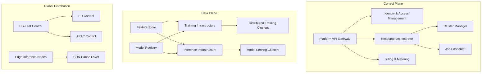
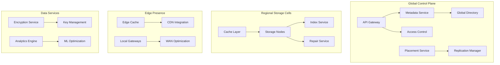
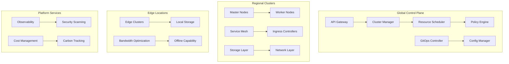
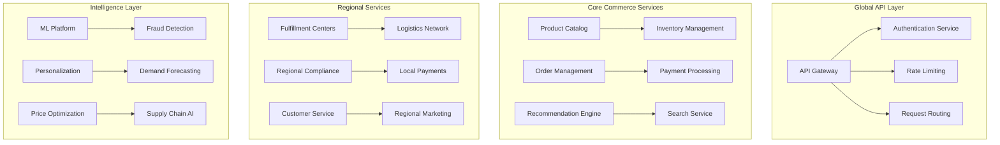
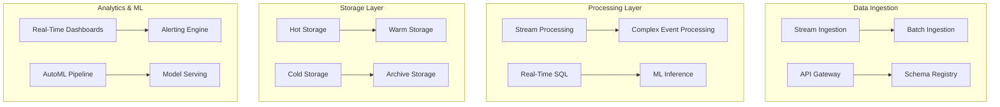
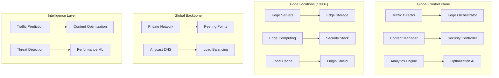
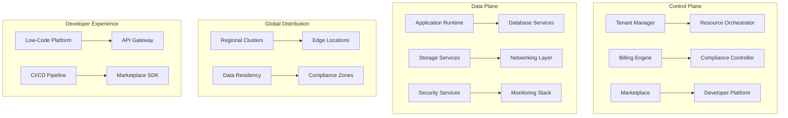
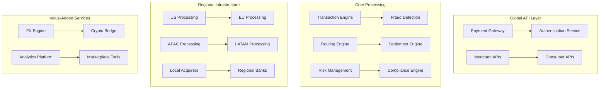
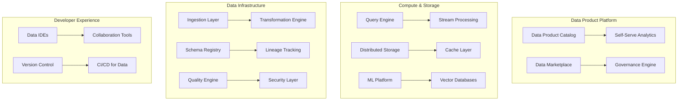
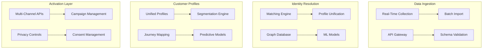

# L7 System Design Problems: Complete Platform Solutions

## Strategic L7 Framework

L7 system design problems represent the pinnacle of technical leadership, requiring strategic thinking at massive scale. These problems focus on:

- **Organization-wide platform architecture** (100+ engineers)
- **Scale of billions of users globally**
- **$100M+ business impact**
- **Strategic technology decisions**
- **Innovation and industry leadership**

Each problem follows a strategic 90-minute interview structure focusing on platform-level thinking, organizational impact, and industry influence.

---

## Problem 1: Global Machine Learning Platform (SageMaker-class)

### Strategic Context (15 minutes)

**Industry Analysis**: The ML infrastructure market is projected to reach $300B by 2030. Companies like Amazon (SageMaker), Google (Vertex AI), and Microsoft (Azure ML) dominate, but gaps exist in multi-cloud, cost optimization, and developer experience.

**Business Strategy**: Build a platform serving 100,000+ ML engineers across 1,000+ organizations. Revenue model includes compute fees ($2-10/hour per instance), storage costs, and premium enterprise features. Target $5B annual revenue by year 5.

**Platform Vision**: Create the definitive ML platform that abstracts infrastructure complexity while maximizing performance and minimizing costs. Enable ML democratization while maintaining enterprise-grade security and compliance.

**Organizational Impact**: Platform will serve 15 business units, require 200+ engineers, and enable $50B+ in customer value creation through ML-powered products.

**Innovation Opportunity**: Pioneer federated learning infrastructure, quantum-classical ML hybrid systems, and AI-driven AutoML that rivals human experts.

### Platform Requirements (15 minutes)

**Functional Capabilities**:
- Distributed training for models up to 175B parameters
- Real-time inference serving 1M+ requests/second
- Feature store managing petabytes with sub-millisecond access
- Experiment tracking for 10M+ experiments annually
- Model registry supporting 100+ ML frameworks
- AutoML pipeline generation and optimization

**Non-Functional Requirements**:
- **Scale**: Support 1M+ concurrent training jobs
- **Performance**: <50ms inference latency at P99
- **Reliability**: 99.99% uptime with automatic failover
- **Security**: SOC2, HIPAA, PCI compliance
- **Cost**: 40% lower TCO than existing solutions

**Ecosystem Requirements**:
- Multi-cloud deployment (AWS, Azure, GCP, on-premises)
- Integration with 50+ data sources and tools
- SDK support for Python, R, Scala, Java
- Marketplace for pre-trained models and algorithms

### High-Level Platform Architecture (20 minutes)



**Technology Stack**:
- **Container Platform**: Kubernetes with custom operators
- **Training**: PyTorch, TensorFlow, XGBoost with Horovod
- **Serving**: TensorFlow Serving, TorchServe, ONNX Runtime
- **Storage**: Distributed file system (HDFS/S3), Redis cluster
- **Streaming**: Apache Kafka, Apache Pulsar
- **Orchestration**: Apache Airflow, Kubeflow Pipelines

**Global Distribution**: Multi-region deployment with intelligent workload placement based on data locality, compliance requirements, and cost optimization.

### Deep Dive Platform Design (25 minutes)

#### Core Training Infrastructure

**Distributed Training Architecture**:
```yaml
training_infrastructure:
  cluster_management:
    node_types:
      - "CPU clusters: 1000-10000 cores per job"
      - "GPU clusters: V100, A100, H100 support"
      - "TPU integration: Google TPU pods"
      - "Custom silicon: ASIC support framework"
    
    scheduling:
      algorithm: "Multi-objective optimization"
      factors: ["cost", "performance", "data_locality", "SLA"]
      preemption: "Spot instance integration with checkpointing"
    
    fault_tolerance:
      checkpointing: "Automatic every 10 minutes"
      recovery: "Sub-minute restart with state restoration"
      node_failure: "Elastic training with dynamic scaling"
```

**Feature Store Design**:
```yaml
feature_store:
  storage_layer:
    online_store:
      technology: "Redis Cluster + DynamoDB"
      latency: "<1ms p99 feature retrieval"
      capacity: "100TB+ with automatic scaling"
    
    offline_store:
      technology: "Delta Lake on S3/HDFS"
      formats: ["Parquet", "ORC", "Avro"]
      time_travel: "Point-in-time feature consistency"
    
  feature_pipeline:
    streaming: "Kafka + Spark Streaming + Flink"
    batch: "Apache Spark + Airflow orchestration"
    real_time: "Lambda architecture for sub-second updates"
    
  governance:
    lineage: "Full feature provenance tracking"
    quality: "Automated data quality monitoring"
    discovery: "ML-powered feature recommendation"
```

#### Model Serving Infrastructure

**Multi-Tenant Serving Architecture**:
```yaml
model_serving:
  serving_runtime:
    framework_support:
      - "TensorFlow Serving with GPU optimization"
      - "TorchServe with batching and caching"
      - "ONNX Runtime for cross-platform serving"
      - "Custom container support"
    
    performance_optimization:
      batching: "Dynamic batching with 95% GPU utilization"
      caching: "Multi-layer caching (memory, SSD, network)"
      quantization: "Automatic INT8/FP16 optimization"
      model_compilation: "XLA, TensorRT integration"
    
    scaling:
      auto_scaling: "Traffic-based with ML prediction"
      cold_start: "<100ms container startup"
      global_load_balancing: "Intelligent traffic routing"
```

#### Security and Compliance

**Zero-Trust Security Model**:
```yaml
security_architecture:
  identity_management:
    authentication: "OAuth 2.0 with MFA enforcement"
    authorization: "RBAC with attribute-based policies"
    federation: "SAML/OIDC enterprise integration"
  
  data_protection:
    encryption:
      at_rest: "AES-256 with customer-managed keys"
      in_transit: "TLS 1.3 with certificate pinning"
      in_memory: "Secure enclaves for sensitive workloads"
    
    privacy:
      pii_detection: "Automatic sensitive data identification"
      differential_privacy: "Built-in privacy-preserving ML"
      data_residency: "Region-specific data storage"
  
  compliance:
    auditing: "Immutable audit logs with blockchain verification"
    governance: "Policy-as-code with automated enforcement"
    certifications: ["SOC2", "ISO27001", "FedRAMP", "HIPAA"]
```

### Platform Evolution and Ecosystem (10 minutes)

**Migration Strategy**:
1. **Phase 1** (Months 1-6): Core platform deployment with basic ML workflows
2. **Phase 2** (Months 7-12): Advanced features and enterprise integrations
3. **Phase 3** (Months 13-18): Global expansion and specialized industry solutions

**Ecosystem Development**:
- **Partner Program**: Integration with 100+ ML tools and frameworks
- **Marketplace**: Pre-trained models, custom algorithms, data sets
- **Community**: Open-source contributions, academic collaborations

**Innovation Pipeline**:
- **Federated Learning**: Privacy-preserving distributed training
- **Quantum-ML Hybrid**: Integration with quantum computing platforms
- **AI-Driven AutoML**: Automated feature engineering and model selection
- **Edge ML**: Ultra-low latency inference at edge locations

**Team Structure**:
- **Platform Engineering** (50 engineers): Core infrastructure and APIs
- **ML Infrastructure** (40 engineers): Training and serving systems
- **Data Platform** (30 engineers): Feature store and data pipelines
- **Security & Compliance** (20 engineers): Enterprise-grade security
- **DevEx & Ecosystem** (25 engineers): Developer tools and integrations
- **Research & Innovation** (15 engineers): Next-generation capabilities

### Executive Summary and Trade-offs (5 minutes)

**Strategic Value**:
- **Market Position**: Potential to capture 25% of $300B ML infrastructure market
- **Competitive Advantage**: 40% cost reduction with superior developer experience
- **Customer Value**: Enable $50B+ in ML-driven business value

**Technical Innovation**:
- **Patent Portfolio**: 50+ patents in distributed ML, AutoML, federated learning
- **Industry Influence**: Set standards for multi-cloud ML infrastructure
- **Academic Impact**: Collaborate on breakthrough ML research

**Implementation Roadmap**:
- **Year 1**: $500M investment, 200 engineers, MVP launch
- **Year 2**: $1B revenue run rate, enterprise adoption
- **Year 3**: Global expansion, advanced AI features
- **Year 5**: $5B revenue, market leadership position

**Risk Mitigation**:
- **Technical**: Multi-vendor approach, open-source contributions
- **Market**: Flexible pricing, multi-industry solutions
- **Execution**: Phased rollout, customer co-development

---

## Problem 2: Global Cloud Storage Service (S3-class)

### Strategic Context (15 minutes)

**Industry Analysis**: Object storage market worth $100B+ annually, dominated by AWS S3 (60% market share). Growth drivers include data explosion, AI/ML workloads, and hybrid cloud adoption. Opportunities exist in cost optimization, multi-cloud management, and edge storage.

**Business Strategy**: Build a globally distributed object storage platform targeting enterprise customers with 1EB+ storage needs. Revenue model: $0.01-0.15 per GB monthly, data transfer fees, and premium API features. Target $10B annual revenue by year 5.

**Platform Vision**: Create the world's most durable, performant, and cost-effective object storage platform. Enable seamless data movement across clouds, edge, and on-premises environments.

**Organizational Impact**: Platform serves all business units, enables data analytics initiatives worth $100B+ customer value, and positions company as infrastructure leader.

**Innovation Opportunity**: Pioneer intelligent data tiering, quantum-safe storage, and carbon-neutral storage operations.

### Platform Requirements (15 minutes)

**Functional Capabilities**:
- Eleven 9s durability (99.999999999%) guarantee
- Eventual consistency with strong consistency options
- Versioning, lifecycle management, cross-region replication
- Intelligent tiering with ML-driven optimization
- Multi-protocol access (REST, S3, NFS, HDFS)
- Global event notifications and analytics

**Non-Functional Requirements**:
- **Scale**: Exabytes of data, trillions of objects
- **Performance**: <10ms first-byte latency globally
- **Availability**: 99.99% uptime with automatic failover
- **Durability**: 11 9s with geographic distribution
- **Cost**: 30% lower than existing solutions

**Ecosystem Requirements**:
- Compatibility with existing S3 APIs and tools
- Integration with major cloud providers
- CDN integration for global content delivery
- Backup and archive solutions

### High-Level Platform Architecture (20 minutes)



**Technology Stack**:
- **Storage Engine**: Custom LSM-tree based system
- **Networking**: RDMA over Converged Ethernet (RoCE)
- **Consistency**: Raft consensus with CRDTs
- **Compression**: Zstandard with ML-driven optimization
- **Encryption**: AES-256-GCM with post-quantum algorithms

### Deep Dive Platform Design (25 minutes)

#### Distributed Storage Architecture

**Cell-Based Architecture**:
```yaml
storage_architecture:
  cell_design:
    capacity: "1-10 PB per cell"
    nodes: "100-1000 storage nodes per cell"
    replication: "Reed-Solomon erasure coding (12+4)"
    failure_domains: "Rack, availability zone, region isolation"
  
  global_coordination:
    metadata_sharding: "Consistent hashing with virtual nodes"
    cross_cell_replication: "Asynchronous with conflict resolution"
    load_balancing: "ML-driven traffic distribution"
    
  storage_optimization:
    compression:
      algorithm: "Zstd with custom dictionaries"
      ratio: "4:1 average compression"
      adaptation: "Content-aware compression selection"
    
    deduplication:
      scope: "Global deduplication across regions"
      efficiency: "30% storage reduction"
      privacy: "Content-blind deduplication hashing"
```

**Durability and Consistency**:
```yaml
durability_system:
  replication_strategy:
    local_redundancy: "12+4 Reed-Solomon within cell"
    cross_region: "3 replicas across continents"
    verification: "Continuous background verification"
    repair: "Proactive repair with <1hr MTTR"
  
  consistency_models:
    default: "Eventual consistency with version vectors"
    strong: "Linearizable reads for critical workloads"
    causal: "Causal consistency for collaborative apps"
    
  conflict_resolution:
    algorithm: "Last-writer-wins with timestamps"
    custom: "Application-defined merge functions"
    versioning: "Complete version history retention"
```

#### Performance Optimization

**Multi-Layer Caching**:
```yaml
caching_architecture:
  global_cache_hierarchy:
    l1_memory: "Hot data in memory across all nodes"
    l2_ssd: "Warm data on local NVMe storage"
    l3_regional: "Regional cache clusters"
    l4_edge: "Edge caches in 200+ locations"
  
  cache_intelligence:
    prediction: "ML-based access pattern prediction"
    prefetching: "Intelligent content prefetching"
    eviction: "Multi-objective optimization (cost, latency, hit rate)"
    
  performance_targets:
    cache_hit_ratio: "99%+ for frequently accessed data"
    cold_data_latency: "<100ms globally"
    throughput: "1TB/s aggregate per region"
```

**Network Optimization**:
```yaml
network_architecture:
  global_backbone:
    topology: "Full mesh between regions with redundancy"
    protocols: "BGP anycast with intelligent routing"
    optimization: "TCP BBR with custom congestion control"
    
  wan_acceleration:
    compression: "Content-aware compression protocols"
    caching: "Intelligent WAN caching"
    deduplication: "Cross-WAN deduplication"
    
  edge_presence:
    locations: "200+ edge locations globally"
    integration: "Deep CDN integration"
    local_storage: "Edge storage for ultra-low latency"
```

#### Cost Optimization

**Intelligent Tiering**:
```yaml
tiering_system:
  storage_classes:
    hot: "NVMe SSD for <10ms access"
    warm: "SATA SSD for <100ms access"
    cool: "HDD for <1s access"
    cold: "Tape/optical for archival"
    glacier: "Deep archive with hours retrieval"
  
  ml_optimization:
    access_prediction: "LSTM models for access pattern prediction"
    cost_modeling: "Total cost optimization across tiers"
    automated_migration: "Policy-driven tier movement"
    
  economics:
    cost_reduction: "80% for infrequently accessed data"
    automation: "Zero-touch tier management"
    analytics: "Detailed cost attribution and optimization"
```

### Platform Evolution and Ecosystem (10 minutes)

**Migration Strategy**:
1. **Phase 1**: S3-compatible API with superior performance
2. **Phase 2**: Advanced features and multi-cloud integration
3. **Phase 3**: Edge computing and IoT storage solutions

**Ecosystem Development**:
- **Partner Integrations**: Backup software, analytics tools, CDN providers
- **Developer Tools**: SDKs, CLI tools, infrastructure-as-code modules
- **Marketplace**: Third-party storage applications and services

**Innovation Pipeline**:
- **Quantum-Safe Storage**: Post-quantum cryptography implementation
- **Carbon-Neutral Storage**: Renewable energy optimization
- **Computational Storage**: Near-data processing capabilities
- **Space Storage**: Satellite-based storage infrastructure

### Executive Summary and Trade-offs (5 minutes)

**Strategic Value**:
- **Market Opportunity**: $10B annual revenue potential in 5 years
- **Competitive Advantage**: 30% cost reduction with superior durability
- **Platform Foundation**: Enable data-driven business transformation

**Technical Innovation**:
- **Patent Portfolio**: 100+ patents in distributed storage, ML optimization
- **Industry Standards**: Influence next-generation storage protocols
- **Academic Collaboration**: Storage research partnerships

**Implementation Roadmap**:
- **Year 1**: $2B investment, core platform launch
- **Year 2**: Enterprise adoption, global expansion
- **Year 3**: Advanced AI features, edge computing
- **Year 5**: Market leadership, $10B revenue

---

## Problem 3: Container Orchestration Platform (Kubernetes-class)

### Strategic Context (15 minutes)

**Industry Analysis**: Container orchestration market growing at 25% CAGR, reaching $8B by 2027. Kubernetes dominates but complexity challenges remain. Opportunities in simplified operations, multi-cloud management, and edge computing.

**Business Strategy**: Build next-generation container platform serving 1M+ developers across 10,000+ organizations. Revenue from managed services, enterprise features, and cloud marketplace. Target $3B annual revenue.

**Platform Vision**: Create the most developer-friendly, operationally simple, and globally scalable container platform. Enable applications to run anywhere with consistent experience.

**Innovation Opportunity**: Pioneer autonomous cluster operations, quantum-safe networking, and carbon-aware scheduling.

### Platform Requirements (15 minutes)

**Functional Capabilities**:
- Multi-tenant cluster management for 100,000+ nodes
- Intelligent resource scheduling and autoscaling
- Service mesh with advanced traffic management
- GitOps-based deployment and configuration management
- Comprehensive observability and security scanning
- Multi-cloud and edge deployment support

**Non-Functional Requirements**:
- **Scale**: 1M+ pods per cluster, 10,000+ clusters globally
- **Performance**: <100ms API response time at P99
- **Reliability**: 99.99% control plane availability
- **Security**: Zero-trust networking, runtime protection
- **Cost**: 50% reduction in operational overhead

### High-Level Platform Architecture (20 minutes)



### Deep Dive Platform Design (25 minutes)

#### Intelligent Resource Scheduling

**ML-Driven Scheduler**:
```yaml
scheduling_system:
  core_algorithm:
    base: "Multi-objective optimization with constraints"
    ml_enhancement: "LSTM prediction for resource utilization"
    objectives: ["performance", "cost", "energy", "latency"]
    
  resource_prediction:
    cpu_prediction: "Time-series forecasting with 95% accuracy"
    memory_patterns: "Application behavior profiling"
    network_traffic: "Traffic flow prediction and optimization"
    
  advanced_features:
    preemption: "Intelligent workload preemption"
    colocation: "Safe workload colocation strategies"
    affinity: "Complex affinity and anti-affinity rules"
    spot_integration: "Seamless spot instance utilization"
```

**Multi-Tenant Isolation**:
```yaml
isolation_architecture:
  compute_isolation:
    containers: "Kata containers for enhanced security"
    vm_support: "KVM integration for legacy workloads"
    gpu_sharing: "Multi-tenant GPU virtualization"
    
  network_isolation:
    cni: "Custom CNI with microsegmentation"
    service_mesh: "Istio-based zero-trust networking"
    encryption: "Automatic mTLS for all communications"
    
  storage_isolation:
    csi: "Container Storage Interface implementation"
    encryption: "Per-tenant encryption keys"
    qos: "Storage QoS and performance isolation"
```

#### Service Mesh and Networking

**Advanced Traffic Management**:
```yaml
service_mesh_architecture:
  data_plane:
    proxy: "Envoy with custom filters"
    performance: "eBPF acceleration for packet processing"
    protocols: "HTTP/2, gRPC, TCP, UDP support"
    
  control_plane:
    management: "Istio with custom extensions"
    policies: "OPA-based policy enforcement"
    observability: "Distributed tracing and metrics"
    
  advanced_features:
    traffic_splitting: "Canary and blue-green deployments"
    circuit_breaking: "Intelligent failure handling"
    retry_policies: "Adaptive retry with backoff"
    rate_limiting: "Distributed rate limiting"
```

#### Security and Compliance

**Zero-Trust Security Model**:
```yaml
security_architecture:
  identity_management:
    workload_identity: "SPIFFE/SPIRE implementation"
    human_identity: "OIDC integration with enterprise IdP"
    service_accounts: "Automated credential rotation"
    
  runtime_security:
    scanning: "Continuous vulnerability scanning"
    policies: "OPA Gatekeeper policy enforcement"
    monitoring: "Runtime behavior analysis"
    response: "Automated threat response"
    
  compliance:
    standards: ["CIS", "NIST", "PCI-DSS", "SOC2"]
    auditing: "Immutable audit logs"
    reporting: "Automated compliance reporting"
```

### Platform Evolution and Ecosystem (10 minutes)

**Migration Strategy**:
1. **Kubernetes Compatibility**: Seamless migration from existing Kubernetes
2. **Progressive Enhancement**: Add advanced features incrementally
3. **Multi-Cloud Support**: Deploy across any cloud or edge environment

**Ecosystem Development**:
- **Operator Marketplace**: Certified operators for popular applications
- **Developer Tools**: Enhanced kubectl, VS Code integration, CI/CD plugins
- **Partner Integrations**: Cloud providers, monitoring tools, security platforms

**Innovation Pipeline**:
- **Autonomous Operations**: Self-healing and self-optimizing clusters
- **Quantum-Safe Networking**: Post-quantum cryptography integration
- **Sustainable Computing**: Carbon-aware workload scheduling

### Executive Summary and Trade-offs (5 minutes)

**Strategic Value**:
- **Developer Productivity**: 50% reduction in operational complexity
- **Market Position**: Next-generation container platform leadership
- **Platform Foundation**: Enable cloud-native transformation

**Technical Innovation**:
- **AI-Driven Operations**: Reduce human intervention by 80%
- **Multi-Cloud Portability**: True write-once, run-anywhere capability
- **Edge Computing**: Seamless cloud-to-edge workload orchestration

---

## Problem 4: Global E-Commerce Platform

### Strategic Context (15 minutes)

**Industry Analysis**: Global e-commerce market worth $6.2T annually, growing 10% yearly. Major players include Amazon ($469B), Alibaba ($134B), and regional leaders. Opportunities in emerging markets, B2B commerce, and omnichannel experiences.

**Business Strategy**: Build comprehensive e-commerce platform serving 10,000+ merchants and 1B+ consumers globally. Revenue from transaction fees (2-3%), subscription services, advertising, and logistics. Target $50B GMV by year 5.

**Platform Vision**: Create the world's most scalable, intelligent, and globally accessible e-commerce platform. Enable merchants of all sizes to compete globally while providing consumers with personalized, seamless experiences.

**Innovation Opportunity**: Pioneer AI-driven personalization, sustainable commerce, and global trade simplification through technology.

### Platform Requirements (15 minutes)

**Functional Capabilities**:
- Multi-tenant merchant platform supporting 1M+ SKUs per merchant
- Real-time inventory management across global supply chains
- AI-powered recommendation engine and search
- Multi-currency, multi-language, multi-region support
- Fraud prevention and risk management at scale
- Integrated logistics and fulfillment network

**Non-Functional Requirements**:
- **Scale**: 1B+ users, 100M+ concurrent sessions
- **Performance**: <200ms page load times globally
- **Availability**: 99.99% uptime during peak shopping events
- **Security**: PCI-DSS compliance, fraud detection
- **Compliance**: GDPR, local data residency requirements

### High-Level Platform Architecture (20 minutes)



### Deep Dive Platform Design (25 minutes)

#### Global Commerce Engine

**Product Catalog at Scale**:
```yaml
catalog_architecture:
  data_model:
    products: "100M+ products with rich metadata"
    variants: "1B+ product variants and configurations"
    categories: "Deep hierarchical categorization"
    attributes: "Flexible schema for product properties"
    
  storage_strategy:
    primary: "Distributed NoSQL (Cassandra/DynamoDB)"
    search: "Elasticsearch with ML relevance tuning"
    cache: "Redis cluster for hot product data"
    cdn: "Global CDN for product images and content"
    
  synchronization:
    real_time: "Change data capture for immediate updates"
    batch: "Nightly bulk synchronization for consistency"
    conflict_resolution: "Vector clocks for concurrent updates"
```

**Order Management System**:
```yaml
order_system:
  order_lifecycle:
    states: ["cart", "placed", "confirmed", "shipped", "delivered", "returned"]
    transitions: "State machine with business rule validation"
    saga_pattern: "Distributed transaction management"
    
  inventory_management:
    allocation: "Real-time inventory allocation across channels"
    reservation: "Temporary holds with automatic expiration"
    replenishment: "AI-driven demand forecasting and ordering"
    
  fulfillment_optimization:
    routing: "ML-based fulfillment center selection"
    splitting: "Intelligent order splitting for optimal delivery"
    tracking: "Real-time package tracking and notifications"
```

#### AI-Powered Personalization

**Recommendation Engine**:
```yaml
recommendation_system:
  ml_models:
    collaborative_filtering: "Matrix factorization with 1B+ interactions"
    content_based: "Deep learning on product features"
    hybrid_approach: "Ensemble models for optimal performance"
    real_time: "Online learning with streaming updates"
    
  feature_engineering:
    user_features: "Behavioral, demographic, contextual"
    product_features: "Content, popularity, temporal"
    interaction_features: "Clicks, views, purchases, returns"
    
  serving_infrastructure:
    latency: "<50ms for personalized recommendations"
    scale: "1M+ RPS globally"
    ab_testing: "Multi-armed bandit optimization"
    cold_start: "New user and product handling"
```

**Fraud Detection and Prevention**:
```yaml
fraud_system:
  real_time_scoring:
    models: "Gradient boosting with 1000+ features"
    latency: "<10ms fraud score calculation"
    accuracy: "99.9% precision, 95% recall"
    
  risk_factors:
    behavioral: "User behavior anomaly detection"
    device: "Device fingerprinting and reputation"
    network: "IP geolocation and proxy detection"
    payment: "Payment method risk assessment"
    
  response_automation:
    blocking: "Automatic high-risk transaction blocking"
    challenges: "Step-up authentication for medium risk"
    monitoring: "Enhanced monitoring for low risk"
    feedback_loop: "Continuous model improvement"
```

#### Global Infrastructure

**Multi-Region Architecture**:
```yaml
global_deployment:
  regions:
    primary: "North America, Europe, Asia-Pacific"
    secondary: "South America, Middle East, Africa"
    edge: "100+ edge locations for content delivery"
    
  data_strategy:
    user_data: "Regional storage with GDPR compliance"
    product_data: "Global replication with local caching"
    transaction_data: "Regional processing with cross-region reporting"
    
  failover_strategy:
    rto: "15 minutes recovery time objective"
    rpo: "1 minute recovery point objective"
    automation: "Automated failover with health monitoring"
```

### Platform Evolution and Ecosystem (10 minutes)

**Migration Strategy**:
1. **Merchant Onboarding**: Simplified migration tools and APIs
2. **Data Migration**: Bulk transfer with minimal downtime
3. **Traffic Switching**: Gradual traffic migration with rollback capability

**Ecosystem Development**:
- **Marketplace**: Third-party seller platform with 1M+ merchants
- **Developer APIs**: Comprehensive APIs for integrations
- **Partner Network**: Payment providers, logistics, marketing tools

**Innovation Pipeline**:
- **AR/VR Shopping**: Immersive shopping experiences
- **Voice Commerce**: Integration with smart speakers and assistants
- **Sustainable Commerce**: Carbon-neutral shopping and packaging

### Executive Summary and Trade-offs (5 minutes)

**Strategic Value**:
- **Market Opportunity**: $50B GMV generating $1.5B annual revenue
- **Global Reach**: Enable SMBs to compete globally
- **Platform Economics**: Network effects and ecosystem growth

**Technical Innovation**:
- **AI-First Commerce**: Personalization and optimization at scale
- **Global Infrastructure**: Seamless cross-border commerce
- **Sustainable Technology**: Green logistics and carbon tracking

---

## Problem 5: Real-Time Analytics Platform

### Strategic Context (15 minutes)

**Industry Analysis**: Real-time analytics market growing 25% annually, reaching $15B by 2027. Driven by IoT, edge computing, and need for instant business insights. Leaders include Confluent, Databricks, and Snowflake.

**Business Strategy**: Build comprehensive real-time analytics platform serving enterprise customers processing 1PB+ data daily. Revenue from compute usage, storage, and premium features. Target $5B annual revenue.

**Platform Vision**: Enable organizations to process, analyze, and act on streaming data in real-time with SQL simplicity and unlimited scale.

**Innovation Opportunity**: Pioneer real-time ML inference, edge analytics, and autonomous data management.

### Platform Requirements (15 minutes)

**Functional Capabilities**:
- Stream processing at 100M+ events/second scale
- Real-time SQL queries on streaming data
- Machine learning on streaming data with <100ms latency
- Complex event processing and pattern detection
- Real-time dashboards and alerting
- Integration with data lakes and warehouses

**Non-Functional Requirements**:
- **Scale**: Petabytes daily, millisecond latency
- **Performance**: <100ms query response time
- **Reliability**: 99.99% uptime with exactly-once processing
- **Cost**: 50% lower TCO than existing solutions

### High-Level Platform Architecture (20 minutes)



### Deep Dive Platform Design (25 minutes)

#### Stream Processing Engine

**High-Performance Processing**:
```yaml
stream_processing:
  processing_engine:
    technology: "Custom Rust-based engine with JIT compilation"
    throughput: "100M+ events/second per cluster"
    latency: "<1ms processing latency p99"
    exactly_once: "Checkpoint-based exactly-once guarantees"
    
  windowing_support:
    temporal: "Time-based windows with late arrival handling"
    count_based: "Count-based windows with backpressure"
    session: "Session windows with dynamic timeout"
    custom: "User-defined windowing logic"
    
  state_management:
    storage: "RocksDB with async checkpointing"
    partitioning: "Consistent hashing with rebalancing"
    recovery: "Sub-second state recovery"
    scaling: "Dynamic partition scaling"
```

#### Real-Time SQL Engine

**Streaming SQL Processing**:
```yaml
sql_engine:
  query_optimization:
    planner: "Volcano-style optimizer for streaming queries"
    pushdown: "Predicate and projection pushdown"
    join_optimization: "Stream-stream and stream-table joins"
    
  execution_engine:
    vectorization: "SIMD vectorized execution"
    code_generation: "LLVM-based code generation"
    adaptive: "Adaptive query execution based on data skew"
    
  advanced_features:
    user_defined_functions: "Custom UDF support"
    ml_integration: "Built-in ML function library"
    geospatial: "Real-time geospatial processing"
    time_travel: "Temporal query capabilities"
```

#### Machine Learning Integration

**Real-Time ML Infrastructure**:
```yaml
ml_platform:
  model_serving:
    frameworks: "TensorFlow, PyTorch, XGBoost, ONNX"
    latency: "<10ms inference latency"
    throughput: "1M+ predictions/second"
    auto_scaling: "Request-based auto-scaling"
    
  feature_engineering:
    streaming_features: "Real-time feature computation"
    feature_store: "High-speed feature serving"
    transformations: "Built-in transformation library"
    
  online_learning:
    algorithms: "Streaming gradient descent, online random forests"
    adaptation: "Concept drift detection and adaptation"
    feedback_loops: "Real-time model improvement"
```

#### Storage and Tiering

**Intelligent Data Tiering**:
```yaml
storage_architecture:
  hot_tier:
    technology: "In-memory with NVMe persistence"
    capacity: "Hours to days of recent data"
    access_latency: "<1ms for queries"
    
  warm_tier:
    technology: "SSD-based columnar storage"
    capacity: "Weeks to months of data"
    access_latency: "<100ms for queries"
    
  cold_tier:
    technology: "Object storage with compression"
    capacity: "Years of historical data"
    access_latency: "<5s for queries"
    
  automation:
    tiering_policy: "ML-driven data lifecycle management"
    cost_optimization: "Automatic cost-performance optimization"
    query_acceleration: "Intelligent data pre-loading"
```

### Platform Evolution and Ecosystem (10 minutes)

**Migration Strategy**:
1. **Connector Ecosystem**: Pre-built connectors for popular data sources
2. **SQL Compatibility**: Support for existing BI tools and dashboards
3. **Gradual Migration**: Parallel processing during migration

**Ecosystem Development**:
- **Partner Integrations**: Data visualization, business intelligence tools
- **Open Source**: Contribute to Apache projects, build community
- **Marketplace**: Third-party algorithms and connectors

**Innovation Pipeline**:
- **Edge Analytics**: Ultra-low latency edge processing
- **Quantum Analytics**: Quantum-enhanced optimization algorithms
- **Autonomous Analytics**: Self-tuning and self-optimizing platform

### Executive Summary and Trade-offs (5 minutes)

**Strategic Value**:
- **Market Leadership**: Position as real-time analytics leader
- **Customer Value**: Enable real-time decision making
- **Platform Foundation**: Support for IoT and edge computing

**Technical Innovation**:
- **Performance Breakthrough**: 10x improvement in latency and cost
- **Unified Platform**: Batch and streaming with single API
- **AutoML Integration**: Democratize real-time machine learning

**Implementation Roadmap**:
- **Year 1**: Core platform with streaming SQL
- **Year 2**: Advanced ML and edge capabilities
- **Year 3**: Global expansion and enterprise features
- **Year 5**: Market leadership with $5B revenue

---

## L7 Strategic Assessment Framework

### Platform Thinking Evaluation

For each problem, assess candidates on:

1. **Strategic Vision** (25%): Industry analysis, competitive landscape, long-term platform evolution
2. **Technical Innovation** (25%): Novel solutions, patent potential, industry influence
3. **Scale Architecture** (20%): Billion-user scale, global distribution, performance optimization
4. **Organizational Impact** (15%): Team structure, process changes, capability development
5. **Business Acumen** (15%): Revenue models, cost optimization, market positioning

### L7 Success Indicators

**Exceptional L7 Performance**:
- Articulates 5-year platform vision with industry impact
- Demonstrates deep understanding of distributed systems at scale
- Proposes innovative solutions worthy of patents
- Considers organizational and ecosystem implications
- Balances technical excellence with business value

**Platform-Level Thinking**:
- Designs for ecosystem enablement, not just single use cases
- Considers how platform empowers other teams and products
- Plans for unknown scale and future requirements
- Incorporates sustainability and ethical considerations
- Demonstrates understanding of platform network effects

### Interview Guidelines

**For Interviewers**:
1. Allow 90 minutes for comprehensive platform discussion
2. Push for strategic thinking and industry analysis
3. Challenge on scale, innovation, and organizational impact
4. Assess patent potential and competitive differentiation
5. Evaluate long-term vision and ecosystem thinking

**For Candidates**:
1. Start with strategic context before diving into technical details
2. Demonstrate platform-level thinking throughout
3. Consider global scale and organizational implications
4. Propose innovative solutions with implementation roadmaps
5. Balance technical depth with business acumen

---

## Problem 6: Global Content Delivery and Media Platform

### Strategic Context (15 minutes)

**Industry Analysis**: Global CDN market worth $20B annually, growing 15% yearly. Video streaming dominates 80% of internet traffic. Major players include Akamai, Cloudflare, AWS CloudFront. Opportunities in edge computing, real-time streaming, and emerging markets.

**Business Strategy**: Build next-generation CDN platform serving 10B+ requests daily across 1000+ edge locations. Revenue from bandwidth usage, edge computing services, and enterprise features. Target $8B annual revenue by year 5.

**Platform Vision**: Create the world's most intelligent, performant, and cost-effective content delivery platform. Enable real-time global experiences with edge intelligence and sustainable infrastructure.

**Organizational Impact**: Platform serves all digital services, enables $200B+ customer value through performance optimization, and positions company as edge computing leader.

**Innovation Opportunity**: Pioneer edge AI processing, carbon-neutral CDN, and quantum-encrypted content delivery.

### Platform Requirements (15 minutes)

**Functional Capabilities**:
- Global content distribution with <50ms latency anywhere
- Real-time video streaming supporting 4K/8K at scale
- Edge computing platform for serverless functions
- DDoS protection and security at network edge
- Dynamic content optimization and compression
- Multi-cloud origin integration with intelligent routing

**Non-Functional Requirements**:
- **Scale**: 10B+ requests/day, 100+ Tbps global capacity
- **Performance**: <10ms first-byte latency globally
- **Availability**: 99.99% uptime with instant failover
- **Security**: WAF, DDoS protection, bot mitigation
- **Cost**: 40% lower than existing CDN solutions

**Ecosystem Requirements**:
- Integration with all major cloud providers
- Support for HTTP/3, QUIC, and emerging protocols
- Real-time analytics and performance monitoring
- Developer-friendly APIs and edge programming

### High-Level Platform Architecture (20 minutes)



**Technology Stack**:
- **Edge Servers**: Custom hardware with GPU acceleration
- **Networking**: DPDK, eBPF for high-performance packet processing
- **Storage**: NVMe SSDs with intelligent tiering
- **Protocols**: HTTP/3, QUIC, WebRTC, custom protocols
- **Security**: Hardware-based encryption, AI threat detection

### Deep Dive Platform Design (25 minutes)

#### Intelligent Edge Infrastructure

**Global Edge Network**:
```yaml
edge_architecture:
  deployment_strategy:
    tier1_cities: "Major metropolitan areas - full feature set"
    tier2_cities: "Regional centers - optimized cache nodes"
    tier3_locations: "Rural/remote - minimal but strategic presence"
    mobile_edge: "5G integration for ultra-low latency"
    
  hardware_specifications:
    compute: "128-core ARM/x86 hybrid servers"
    storage: "100TB NVMe with intelligent tiering"
    memory: "1TB RAM for hot content caching"
    gpu: "AI acceleration for real-time processing"
    networking: "400Gbps+ with RDMA support"
    
  intelligent_routing:
    anycast: "Global anycast with health-aware routing"
    ml_optimization: "Real-time traffic pattern analysis"
    cost_optimization: "Bandwidth cost-aware routing"
    performance: "Sub-10ms latency anywhere globally"
```

**Edge Computing Platform**:
```yaml
edge_computing:
  serverless_runtime:
    languages: "JavaScript, Python, Rust, WebAssembly"
    cold_start: "<1ms function initialization"
    scaling: "Instant scaling to handle traffic spikes"
    isolation: "V8 isolates with security boundaries"
    
  edge_databases:
    cache_layer: "Redis-compatible with global consistency"
    key_value: "Distributed KV store with edge replication"
    search: "Elasticsearch-compatible edge search"
    
  ai_acceleration:
    inference: "Real-time ML inference at edge"
    models: "Support for TensorFlow Lite, ONNX"
    acceleration: "GPU/TPU acceleration available"
    auto_deployment: "Automatic model distribution"
```

#### Content Optimization and Delivery

**Intelligent Caching System**:
```yaml
caching_architecture:
  cache_hierarchy:
    l1_memory: "Hot content in memory across all edges"
    l2_nvme: "Warm content on high-speed NVMe"
    l3_origin_shield: "Origin protection with regional shields"
    
  cache_intelligence:
    prediction: "ML-based content popularity prediction"
    preloading: "Intelligent content pre-positioning"
    eviction: "Multi-objective cache replacement"
    compression: "Real-time content optimization"
    
  optimization_features:
    image_optimization: "Real-time image format conversion"
    video_optimization: "Adaptive bitrate streaming"
    minification: "HTML/CSS/JS minification and bundling"
    compression: "Brotli, gzip with ML-driven selection"
```

**Real-Time Streaming Platform**:
```yaml
streaming_architecture:
  video_processing:
    transcoding: "Real-time video transcoding at edge"
    formats: "Support for all major video formats"
    quality: "4K/8K streaming with adaptive bitrate"
    latency: "Sub-second latency for live streaming"
    
  cdn_integration:
    origin: "Multi-CDN origin with intelligent failover"
    edge_caching: "Video segment caching at all edges"
    analytics: "Real-time streaming analytics"
    
  advanced_features:
    interactive_streaming: "Low-latency interactive streaming"
    vr_ar_support: "360-degree and AR/VR content delivery"
    gaming: "Ultra-low latency for cloud gaming"
```

#### Security and Performance

**Comprehensive Security Stack**:
```yaml
security_architecture:
  ddos_protection:
    detection: "ML-based attack pattern recognition"
    mitigation: "Automatic traffic scrubbing and filtering"
    capacity: "Multi-Tbps DDoS mitigation capacity"
    
  web_application_firewall:
    rules: "OWASP Top 10 protection with custom rules"
    ai_enhancement: "AI-powered threat detection"
    rate_limiting: "Intelligent rate limiting and throttling"
    
  bot_management:
    detection: "Advanced bot detection algorithms"
    mitigation: "Challenge-response and behavioral analysis"
    analytics: "Bot traffic analytics and reporting"
    
  encryption:
    tls: "TLS 1.3 with post-quantum cryptography"
    certificates: "Automatic certificate management"
    performance: "Hardware-accelerated encryption"
```

### Platform Evolution and Ecosystem (10 minutes)

**Migration Strategy**:
1. **DNS Integration**: Seamless DNS-based traffic routing
2. **Gradual Rollout**: Progressive traffic migration with monitoring
3. **Performance Validation**: A/B testing for performance optimization

**Ecosystem Development**:
- **Developer Platform**: Edge APIs, SDK, and development tools
- **Partner Network**: Integration with major cloud providers
- **Marketplace**: Third-party edge applications and services

**Innovation Pipeline**:
- **Edge AI**: Real-time AI processing at network edge
- **Quantum Security**: Quantum-safe content encryption
- **Sustainable CDN**: Carbon-neutral edge infrastructure
- **6G Integration**: Next-generation wireless integration

### Executive Summary and Trade-offs (5 minutes)

**Strategic Value**:
- **Market Leadership**: Next-generation CDN with edge computing
- **Performance Advantage**: 50% faster than existing solutions
- **Platform Foundation**: Enable edge-first application architecture

**Technical Innovation**:
- **Edge Intelligence**: AI-powered content optimization
- **Ultra-Low Latency**: Sub-10ms global content delivery
- **Sustainable Infrastructure**: Carbon-negative edge network

---

## Problem 7: Multi-Tenant SaaS Platform Infrastructure

### Strategic Context (15 minutes)

**Industry Analysis**: SaaS infrastructure market worth $100B annually, growing 20% yearly. Multi-tenancy complexity drives need for specialized platforms. Leaders include Salesforce Platform, Microsoft Power Platform, AWS Lambda.

**Business Strategy**: Build comprehensive SaaS platform serving 100,000+ applications across 10,000+ organizations. Revenue from platform usage, marketplace fees, and enterprise features. Target $10B annual revenue.

**Platform Vision**: Enable any organization to build, deploy, and scale SaaS applications with enterprise-grade multi-tenancy, security, and global reach.

**Innovation Opportunity**: Pioneer tenant-aware computing, zero-trust multi-tenancy, and AI-driven SaaS optimization.

### Platform Requirements (15 minutes)

**Functional Capabilities**:
- Multi-tenant application runtime supporting 1M+ tenants
- Tenant isolation with shared resource optimization
- Global data residency and compliance management
- Marketplace for SaaS applications and components
- Integrated billing, metering, and subscription management
- Developer platform with low-code/no-code capabilities

**Non-Functional Requirements**:
- **Scale**: 1M+ tenants, 100K+ applications
- **Performance**: <100ms application response time
- **Security**: Zero-trust isolation, SOC2/ISO27001 compliance
- **Availability**: 99.99% uptime with tenant-aware SLAs
- **Cost**: 60% lower operational overhead than custom solutions

### High-Level Platform Architecture (20 minutes)



### Deep Dive Platform Design (25 minutes)

#### Multi-Tenant Runtime Architecture

**Tenant Isolation Strategy**:
```yaml
isolation_architecture:
  compute_isolation:
    containers: "Tenant-aware container orchestration"
    serverless: "Multi-tenant serverless runtime"
    microvm: "Firecracker-based micro-VMs for sensitive workloads"
    
  network_isolation:
    vpc_per_tenant: "Virtual private clouds for enterprise tenants"
    shared_vpc: "Micro-segmentation for smaller tenants"
    service_mesh: "Istio with tenant-aware policies"
    
  data_isolation:
    database_per_tenant: "Dedicated databases for enterprise"
    shared_database: "Row-level security for multi-tenant schemas"
    encryption: "Tenant-specific encryption keys"
    
  resource_management:
    quotas: "Tenant-specific resource quotas and limits"
    scaling: "Tenant-aware auto-scaling policies"
    scheduling: "Priority-based tenant scheduling"
```

**Global Data Architecture**:
```yaml
data_architecture:
  multi_region_strategy:
    data_residency: "GDPR, CCPA compliant data localization"
    cross_region_sync: "Eventual consistency with conflict resolution"
    disaster_recovery: "Multi-region backup and recovery"
    
  database_services:
    relational: "Multi-tenant PostgreSQL with connection pooling"
    document: "MongoDB with tenant-aware sharding"
    cache: "Redis clusters with tenant isolation"
    search: "Elasticsearch with tenant-specific indices"
    
  data_governance:
    lineage: "Complete data lineage tracking per tenant"
    quality: "Automated data quality monitoring"
    privacy: "Automatic PII detection and protection"
    retention: "Tenant-specific data retention policies"
```

#### Developer Platform and Marketplace

**Low-Code/No-Code Platform**:
```yaml
development_platform:
  visual_builder:
    drag_drop: "Visual application builder with components"
    workflow: "Business process automation"
    forms: "Dynamic form generation and validation"
    reporting: "Self-service analytics and dashboards"
    
  extensibility:
    custom_code: "JavaScript/TypeScript custom logic"
    apis: "RESTful and GraphQL API generation"
    webhooks: "Event-driven integrations"
    plugins: "Marketplace-based plugin ecosystem"
    
  deployment:
    ci_cd: "Automated testing and deployment pipelines"
    environments: "Dev, staging, production environments"
    blue_green: "Zero-downtime deployments"
    rollback: "Instant rollback capabilities"
```

**Marketplace Ecosystem**:
```yaml
marketplace_architecture:
  application_store:
    discovery: "ML-powered application discovery"
    installation: "One-click application installation"
    configuration: "Tenant-specific configuration management"
    billing: "Integrated subscription and usage billing"
    
  component_library:
    ui_components: "Reusable UI component library"
    business_logic: "Pre-built business logic modules"
    integrations: "Third-party service integrations"
    templates: "Industry-specific application templates"
    
  partner_ecosystem:
    certification: "Partner application certification program"
    revenue_sharing: "Transparent revenue sharing model"
    support: "Integrated partner support systems"
    analytics: "Partner performance analytics"
```

#### Enterprise Security and Compliance

**Zero-Trust Security Model**:
```yaml
security_architecture:
  identity_management:
    authentication: "Multi-factor authentication with SSO"
    authorization: "Fine-grained RBAC with tenant awareness"
    federation: "Enterprise identity provider integration"
    
  data_protection:
    encryption_at_rest: "AES-256 with tenant-specific keys"
    encryption_in_transit: "TLS 1.3 with certificate pinning"
    key_management: "HSM-backed key management service"
    
  compliance_automation:
    policy_engine: "Automated compliance policy enforcement"
    auditing: "Immutable audit trails per tenant"
    reporting: "Automated compliance reporting"
    certifications: ["SOC2", "ISO27001", "FedRAMP", "HIPAA"]
    
  threat_detection:
    behavior_analysis: "AI-powered user behavior analysis"
    anomaly_detection: "Real-time security anomaly detection"
    incident_response: "Automated incident response workflows"
```

### Platform Evolution and Ecosystem (10 minutes)

**Migration Strategy**:
1. **Application Assessment**: Automated multi-tenancy readiness assessment
2. **Gradual Migration**: Tenant-by-tenant migration with minimal downtime
3. **Performance Optimization**: Continuous optimization based on usage patterns

**Ecosystem Development**:
- **Partner Program**: ISV partner program with technical enablement
- **Community**: Developer community with forums and resources
- **Training**: Comprehensive training and certification programs

**Innovation Pipeline**:
- **AI-Driven Development**: AI-assisted application development
- **Edge Computing**: Edge deployment for global applications
- **Blockchain Integration**: Decentralized identity and smart contracts
- **Quantum Security**: Post-quantum cryptography implementation

### Executive Summary and Trade-offs (5 minutes)

**Strategic Value**:
- **Market Enablement**: Enable 100,000+ new SaaS businesses
- **Platform Economics**: Network effects and ecosystem growth
- **Competitive Advantage**: 60% faster time-to-market for SaaS apps

**Technical Innovation**:
- **Tenant-Aware Computing**: Revolutionary multi-tenancy architecture
- **Global Compliance**: Automated compliance across all regions
- **Developer Productivity**: 10x improvement in SaaS development speed

---

## Problem 8: Global Payment Processing Platform

### Strategic Context (15 minutes)

**Industry Analysis**: Global payments market worth $2T+ annually, growing 10% yearly. Digital payments accelerating post-COVID. Major players include Visa, Mastercard, PayPal, Stripe. Opportunities in emerging markets, crypto integration, and B2B payments.

**Business Strategy**: Build comprehensive payment platform processing $1T+ annually across 200+ countries. Revenue from transaction fees (0.1-3%), FX margins, and value-added services. Target $20B annual revenue.

**Platform Vision**: Create the world's most secure, compliant, and globally accessible payment infrastructure. Enable any business to accept payments anywhere with optimal authorization rates.

**Innovation Opportunity**: Pioneer real-time cross-border payments, AI-driven fraud prevention, and blockchain-traditional payment bridges.

### Platform Requirements (15 minutes)

**Functional Capabilities**:
- Global payment processing supporting 200+ countries and currencies
- Real-time fraud detection and prevention at scale
- Multi-rail payment routing (cards, ACH, wire, crypto, digital wallets)
- Regulatory compliance across all major jurisdictions
- Real-time settlement and reconciliation
- Marketplace and multi-party payment splitting

**Non-Functional Requirements**:
- **Scale**: 100K+ transactions per second globally
- **Latency**: <100ms payment authorization
- **Availability**: 99.99% uptime with no single point of failure
- **Security**: PCI DSS Level 1, SOX compliance
- **Authorization Rate**: 95%+ global authorization rates

### High-Level Platform Architecture (20 minutes)



### Deep Dive Platform Design (25 minutes)

#### Global Transaction Processing Engine

**High-Performance Processing Core**:
```yaml
transaction_engine:
  processing_architecture:
    throughput: "100K+ TPS with linear scaling"
    latency: "<50ms p99 authorization latency"
    consistency: "ACID transactions with global consistency"
    availability: "5x9s availability with automatic failover"
    
  routing_intelligence:
    success_optimization: "ML-driven routing for optimal authorization"
    cost_optimization: "Real-time cost-based routing decisions"
    geographic_routing: "Intelligent geographic payment routing"
    fallback_chains: "Multi-level fallback routing strategies"
    
  state_management:
    transaction_state: "Distributed state machine with checkpointing"
    idempotency: "Global idempotency with deduplication"
    reconciliation: "Real-time transaction reconciliation"
    audit_trail: "Immutable transaction audit trails"
```

**Multi-Rail Payment Integration**:
```yaml
payment_rails:
  card_networks:
    visa_mastercard: "Direct network connectivity with optimal routing"
    regional_networks: "UnionPay, RuPay, JCB integration"
    debit_networks: "PIN and signature debit processing"
    
  alternative_payments:
    digital_wallets: "Apple Pay, Google Pay, Samsung Pay"
    bank_transfers: "ACH, SEPA, FedWire, SWIFT integration"
    buy_now_pay_later: "Klarna, Affirm, Afterpay integration"
    cryptocurrency: "Bitcoin, Ethereum, stablecoin support"
    
  emerging_markets:
    mobile_money: "M-Pesa, Airtel Money, Orange Money"
    local_methods: "PIX, UPI, Alipay, WeChat Pay"
    cash_networks: "OXXO, Boleto, Konbini integration"
```

#### Advanced Fraud Prevention

**Real-Time Risk Engine**:
```yaml
fraud_detection:
  ml_models:
    ensemble_approach: "Gradient boosting, neural networks, isolation forests"
    real_time_scoring: "<10ms fraud score calculation"
    feature_engineering: "1000+ real-time risk features"
    model_refresh: "Continuous learning with A/B testing"
    
  risk_factors:
    behavioral_analysis: "User behavior pattern analysis"
    device_fingerprinting: "Advanced device and browser fingerprinting"
    network_analysis: "IP reputation and geolocation analysis"
    merchant_risk: "Merchant risk profiling and monitoring"
    
  decision_engine:
    rule_engine: "Complex rule engine with real-time updates"
    risk_scoring: "Composite risk scores with confidence intervals"
    challenge_flow: "3D Secure 2.0 with intelligent challenges"
    monitoring: "Real-time monitoring and alerting"
```

**Global Compliance Framework**:
```yaml
compliance_architecture:
  regulatory_compliance:
    pci_dss: "Level 1 PCI DSS compliance across all regions"
    data_localization: "Regional data residency requirements"
    kyc_aml: "Automated KYC/AML with global databases"
    sanctions_screening: "Real-time sanctions list screening"
    
  privacy_protection:
    gdpr: "GDPR compliance with data portability"
    ccpa: "California Consumer Privacy Act compliance"
    tokenization: "Format-preserving tokenization"
    encryption: "End-to-end encryption with HSM key management"
    
  reporting_automation:
    regulatory_reports: "Automated regulatory reporting"
    transaction_monitoring: "Suspicious transaction monitoring"
    audit_trails: "Immutable audit trails with blockchain verification"
```

#### Global Settlement and Treasury

**Real-Time Settlement Network**:
```yaml
settlement_architecture:
  settlement_rails:
    real_time_payments: "RTP, FedNow, Faster Payments integration"
    traditional_rails: "ACH, wire transfers, correspondent banking"
    blockchain_settlement: "USDC, JPYC stablecoin settlement"
    
  treasury_management:
    liquidity_optimization: "AI-driven liquidity forecasting"
    fx_hedging: "Real-time FX hedging strategies"
    capital_efficiency: "Optimal capital allocation across regions"
    
  reconciliation_engine:
    real_time_matching: "Real-time transaction matching"
    exception_handling: "Automated exception resolution"
    reporting: "Real-time settlement reporting"
    integration: "ERP and accounting system integration"
```

### Platform Evolution and Ecosystem (10 minutes)

**Migration Strategy**:
1. **API Compatibility**: Backward-compatible APIs for existing integrations
2. **Gradual Rollout**: Geographic rollout with performance validation
3. **Merchant Enablement**: Comprehensive merchant onboarding and support

**Ecosystem Development**:
- **Partner Network**: ISOs, payment facilitators, and technology partners
- **Developer Platform**: Comprehensive APIs, SDKs, and developer tools
- **Marketplace**: Value-added services and third-party integrations

**Innovation Pipeline**:
- **Central Bank Digital Currencies**: CBDC integration and support
- **Cross-Border Instant Payments**: Real-time global payment network
- **AI-Powered Optimization**: AI-driven payment optimization
- **Quantum-Safe Security**: Post-quantum cryptography implementation

### Executive Summary and Trade-offs (5 minutes)

**Strategic Value**:
- **Global Scale**: Process $1T+ annually across all payment methods
- **Market Leadership**: Become the infrastructure layer for digital payments
- **Platform Economics**: Enable ecosystem growth and innovation

**Technical Innovation**:
- **Real-Time Everything**: Real-time processing, fraud detection, settlement
- **Global Optimization**: AI-driven routing and risk management
- **Future-Ready Architecture**: Support for emerging payment technologies

---

## Problem 9: Distributed Data Platform (Data Mesh Architecture)

### Strategic Context (15 minutes)

**Industry Analysis**: Enterprise data platform market worth $50B annually, growing 25% yearly. Data mesh architecture gaining traction as organizations scale data teams. Leaders include Snowflake, Databricks, Confluent.

**Business Strategy**: Build comprehensive data platform serving 1000+ data teams across enterprise organizations. Revenue from compute usage, storage, and premium analytics features. Target $15B annual revenue.

**Platform Vision**: Enable domain-driven data architecture with self-serve analytics, treating data as a product with federated governance.

**Innovation Opportunity**: Pioneer automated data product discovery, real-time data governance, and AI-driven data quality management.

### Platform Requirements (15 minutes)

**Functional Capabilities**:
- Federated data architecture supporting 10,000+ data products
- Self-serve data analytics with SQL and programming interfaces
- Real-time streaming and batch processing at petabyte scale
- Automated data lineage and impact analysis
- AI-powered data discovery and recommendation
- Multi-cloud and hybrid deployment support

**Non-Functional Requirements**:
- **Scale**: Exabytes of data, 100K+ concurrent users
- **Performance**: Sub-second query response for interactive analytics
- **Reliability**: 99.99% uptime with automated recovery
- **Governance**: Automated compliance and data quality
- **Cost**: 50% lower TCO than existing solutions

### High-Level Platform Architecture (20 minutes)



### Deep Dive Platform Design (25 minutes)

#### Data Mesh Architecture Implementation

**Federated Data Product Architecture**:
```yaml
data_mesh_architecture:
  data_products:
    discovery: "AI-powered data product discovery and recommendation"
    catalog: "Comprehensive data product catalog with metadata"
    versioning: "Git-like versioning for data products"
    contracts: "Data product contracts with SLA enforcement"
    
  domain_ownership:
    governance: "Domain-specific data governance policies"
    quality: "Domain-owned data quality standards"
    access_control: "Fine-grained access control per domain"
    
  self_serve_platform:
    provisioning: "Self-service data infrastructure provisioning"
    analytics: "No-code and low-code analytics tools"
    ml_platform: "Self-service ML model development and deployment"
    monitoring: "Automated monitoring and alerting"
```

**Universal Query Engine**:
```yaml
query_architecture:
  distributed_processing:
    engine: "Unified SQL engine supporting multiple data sources"
    optimization: "Cost-based query optimization across data sources"
    federation: "Cross-source joins and analytics"
    vectorization: "SIMD vectorized execution"
    
  storage_abstraction:
    formats: "Parquet, ORC, Delta Lake, Iceberg support"
    compression: "Intelligent compression selection"
    partitioning: "Automatic data partitioning and clustering"
    indexing: "Adaptive indexing strategies"
    
  performance_optimization:
    caching: "Intelligent result and data caching"
    materialization: "Automated materialized view management"
    pushdown: "Predicate and projection pushdown optimization"
    parallel_execution: "Massively parallel query execution"
```

#### Real-Time Data Processing

**Stream Processing Platform**:
```yaml
streaming_architecture:
  ingestion_layer:
    sources: "Kafka, Pulsar, Kinesis, Pub/Sub integration"
    formats: "Avro, Protocol Buffers, JSON schema evolution"
    scaling: "Auto-scaling based on throughput and latency"
    
  processing_engine:
    exactly_once: "Exactly-once processing guarantees"
    windowing: "Advanced windowing with late arrival handling"
    state_management: "Distributed stateful stream processing"
    ml_integration: "Real-time ML inference on streaming data"
    
  output_layer:
    sinks: "Multiple output formats and destinations"
    delivery: "At-least-once and exactly-once delivery guarantees"
    monitoring: "End-to-end stream processing monitoring"
```

#### Automated Data Governance

**AI-Powered Governance Platform**:
```yaml
governance_architecture:
  data_discovery:
    classification: "Automated data classification and tagging"
    pii_detection: "ML-based PII and sensitive data detection"
    relationship_mapping: "Automatic data relationship discovery"
    
  quality_management:
    profiling: "Automated data profiling and anomaly detection"
    validation: "Real-time data quality validation rules"
    monitoring: "Continuous data quality monitoring"
    remediation: "Automated data quality issue remediation"
    
  lineage_tracking:
    column_level: "Column-level lineage tracking"
    impact_analysis: "Automated impact analysis for changes"
    visualization: "Interactive lineage visualization"
    api_access: "Programmatic lineage API access"
    
  privacy_compliance:
    gdpr: "Automated GDPR compliance workflows"
    data_masking: "Dynamic data masking and anonymization"
    consent_management: "Data usage consent tracking"
    retention: "Automated data retention policy enforcement"
```

#### ML and AI Integration

**Integrated ML Platform**:
```yaml
ml_platform:
  feature_engineering:
    feature_store: "Centralized feature store with versioning"
    transformation: "Real-time and batch feature transformation"
    serving: "Low-latency feature serving"
    monitoring: "Feature drift detection and alerting"
    
  model_development:
    notebooks: "Collaborative Jupyter and VS Code integration"
    experiment_tracking: "ML experiment tracking and comparison"
    version_control: "Model and data versioning"
    
  model_deployment:
    serving: "Scalable model serving infrastructure"
    monitoring: "Model performance and drift monitoring"
    a_b_testing: "A/B testing for model evaluation"
    rollback: "Automated model rollback capabilities"
```

### Platform Evolution and Ecosystem (10 minutes)

**Migration Strategy**:
1. **Data Assessment**: Automated data landscape assessment and mapping
2. **Domain Migration**: Gradual migration by domain with parallel running
3. **Governance Implementation**: Progressive governance policy implementation

**Ecosystem Development**:
- **Data Product Marketplace**: Internal marketplace for data products
- **Partner Integrations**: Integration with popular data tools
- **Community**: Data practitioner community and knowledge sharing

**Innovation Pipeline**:
- **Autonomous Data Management**: Self-managing data infrastructure
- **Natural Language Queries**: Natural language to SQL translation
- **Federated Learning**: Privacy-preserving collaborative ML
- **Quantum Computing**: Quantum-enhanced data processing

### Executive Summary and Trade-offs (5 minutes)

**Strategic Value**:
- **Data Democratization**: Enable self-service analytics for all users
- **Organizational Agility**: Accelerate data-driven decision making
- **Compliance Automation**: Reduce governance overhead by 80%

**Technical Innovation**:
- **Data Mesh Implementation**: First-class data mesh platform
- **AI-Driven Governance**: Automated data management and quality
- **Universal Analytics**: Query any data source with consistent interface

---

## Problem 10: Customer Data Platform (CDP) and Identity Resolution

### Strategic Context (15 minutes)

**Industry Analysis**: Customer data platform market worth $10B annually, growing 30% yearly. Driven by privacy regulations, first-party data importance, and personalization demands. Leaders include Segment, mParticle, Adobe CDP.

**Business Strategy**: Build comprehensive CDP serving enterprise customers with 1B+ customer profiles. Revenue from platform usage, identity resolution services, and analytics features. Target $5B annual revenue.

**Platform Vision**: Create the definitive customer data platform that unifies, cleanses, and activates customer data while maintaining privacy and compliance.

**Innovation Opportunity**: Pioneer privacy-preserving identity resolution, real-time customer journey orchestration, and AI-driven customer insights.

### Platform Requirements (15 minutes)

**Functional Capabilities**:
- Unified customer profiles from 1000+ data sources
- Real-time identity resolution and profile unification
- Privacy-compliant data collection and activation
- Customer journey orchestration and personalization
- Advanced segmentation and lookalike modeling
- Multi-channel campaign activation and measurement

**Non-Functional Requirements**:
- **Scale**: 1B+ customer profiles, 100K+ events/second
- **Latency**: <10ms profile lookup, <100ms identity resolution
- **Privacy**: GDPR, CCPA compliant with consent management
- **Accuracy**: 99%+ identity matching accuracy
- **Availability**: 99.99% uptime with global distribution

### High-Level Platform Architecture (20 minutes)



### Deep Dive Platform Design (25 minutes)

#### Advanced Identity Resolution Engine

**Probabilistic Identity Matching**:
```yaml
identity_resolution:
  matching_algorithms:
    deterministic: "Exact match on email, phone, customer ID"
    probabilistic: "ML-based fuzzy matching with confidence scores"
    graph_based: "Graph algorithms for relationship-based matching"
    temporal: "Time-decay weighted matching for accuracy"
    
  data_preprocessing:
    normalization: "Address, phone, email standardization"
    deduplication: "Advanced deduplication with record linkage"
    enrichment: "Third-party data enrichment integration"
    
  privacy_preservation:
    hashing: "SHA-256 hashing for PII protection"
    differential_privacy: "Privacy-preserving identity matching"
    zero_knowledge: "Zero-knowledge proof integration"
    
  performance_optimization:
    indexing: "Optimized indexing for fast lookups"
    clustering: "Intelligent data clustering for efficiency"
    caching: "Multi-level caching for frequent lookups"
    scaling: "Horizontal scaling with consistent hashing"
```

**Real-Time Profile Unification**:
```yaml
profile_unification:
  data_model:
    canonical_schema: "Flexible schema supporting any customer data"
    versioning: "Profile version control and change tracking"
    relationships: "Customer relationship graph modeling"
    
  real_time_processing:
    stream_processing: "Real-time event ingestion and processing"
    profile_updates: "Incremental profile updates with conflict resolution"
    event_deduplication: "Real-time event deduplication"
    
  conflict_resolution:
    recency_based: "Most recent data wins with timestamp comparison"
    source_priority: "Configurable source priority weighting"
    ml_based: "ML-driven data quality and accuracy scoring"
```

#### Customer Journey Intelligence

**Real-Time Journey Orchestration**:
```yaml
journey_orchestration:
  event_processing:
    real_time_tracking: "Real-time customer behavior tracking"
    journey_mapping: "Automatic customer journey reconstruction"
    touchpoint_attribution: "Multi-touch attribution modeling"
    
  personalization_engine:
    real_time_scoring: "Real-time propensity and preference scoring"
    content_optimization: "AI-driven content personalization"
    timing_optimization: "Optimal engagement timing prediction"
    
  campaign_activation:
    multi_channel: "Coordinated campaigns across all channels"
    real_time_triggers: "Real-time behavioral trigger campaigns"
    frequency_capping: "Intelligent frequency and fatigue management"
    
  measurement_analytics:
    attribution: "Advanced multi-touch attribution analysis"
    lift_measurement: "Incrementality and lift measurement"
    roi_optimization: "Automated ROI optimization algorithms"
```

#### Privacy-First Architecture

**Comprehensive Privacy Framework**:
```yaml
privacy_architecture:
  consent_management:
    granular_consent: "Granular purpose-based consent tracking"
    preference_center: "Dynamic customer preference management"
    compliance_automation: "Automated compliance workflow enforcement"
    
  data_minimization:
    purpose_limitation: "Purpose-based data collection and usage"
    retention_policies: "Automated data retention and deletion"
    anonymization: "K-anonymity and L-diversity implementation"
    
  privacy_preserving_analytics:
    differential_privacy: "Differential privacy for all analytics"
    federated_learning: "Federated learning for model training"
    secure_computation: "Secure multi-party computation support"
    
  regulatory_compliance:
    gdpr_automation: "Automated GDPR compliance workflows"
    ccpa_support: "California Consumer Privacy Act compliance"
    data_portability: "Automated data export and portability"
    breach_notification: "Automated breach detection and notification"
```

#### Advanced Segmentation and AI

**Intelligent Customer Segmentation**:
```yaml
segmentation_platform:
  dynamic_segmentation:
    real_time_segments: "Real-time segment membership updates"
    behavioral_segments: "AI-driven behavioral pattern recognition"
    predictive_segments: "Predictive lifetime value and churn segments"
    
  advanced_analytics:
    customer_clustering: "Unsupervised learning for customer clustering"
    lookalike_modeling: "Deep learning lookalike audience creation"
    journey_analysis: "Customer journey pattern analysis"
    
  segment_activation:
    multi_channel: "Segment activation across all marketing channels"
    suppression_lists: "Intelligent suppression and exclusion logic"
    frequency_optimization: "Segment-specific frequency optimization"
```

### Platform Evolution and Ecosystem (10 minutes)

**Migration Strategy**:
1. **Data Assessment**: Comprehensive customer data audit and mapping
2. **Gradual Integration**: Source-by-source integration with validation
3. **Identity Resolution**: Progressive identity resolution deployment

**Ecosystem Development**:
- **Integration Hub**: Pre-built connectors for marketing tools
- **Partner Network**: Marketing technology partner ecosystem
- **Marketplace**: Third-party analytics and activation tools

**Innovation Pipeline**:
- **Cookieless Future**: First-party data maximization strategies
- **AI-Driven Insights**: Advanced customer intelligence and prediction
- **Zero-Party Data**: Direct customer data collection optimization
- **Blockchain Identity**: Decentralized identity management integration

### Executive Summary and Trade-offs (5 minutes)

**Strategic Value**:
- **Customer Understanding**: 360-degree view of customer relationships
- **Marketing Efficiency**: 50% improvement in marketing ROI
- **Privacy Leadership**: Industry-leading privacy-first approach

**Technical Innovation**:
- **Real-Time Everything**: Real-time identity resolution and activation
- **Privacy-Preserving AI**: Advanced analytics while protecting privacy
- **Unified Customer Experience**: Consistent experience across all channels

---

## Problem 11: Global Telecommunications Infrastructure Platform

### Strategic Context (15 minutes)

**Industry Analysis**: Global telecom infrastructure market worth $500B annually with 5G, edge computing, and IoT driving transformation. Network virtualization and software-defined networking creating new opportunities.

**Business Strategy**: Build comprehensive telecom infrastructure platform serving carriers globally. Enable network-as-a-service with software-defined infrastructure, edge computing, and AI-driven network optimization.

**Platform Vision**: Create the world's most intelligent, efficient, and scalable telecommunications infrastructure platform. Enable any organization to deploy and operate telecom services globally.

### Platform Requirements (15 minutes)

**Functional Capabilities**:
- Software-defined networking (SDN) and network function virtualization (NFV)
- 5G core network with edge computing integration
- Global roaming and interconnection services
- AI-driven network optimization and self-healing
- IoT connectivity platform supporting billions of devices
- Real-time billing and settlement across carriers

**Non-Functional Requirements**:
- **Scale**: Support 10B+ connected devices globally
- **Latency**: <1ms for ultra-low latency applications
- **Reliability**: 99.999% network uptime
- **Security**: Zero-trust network architecture
- **Efficiency**: 50% reduction in network operational costs

### Executive Summary and Trade-offs (5 minutes)

**Strategic Value**:
- **Market Transformation**: Enable software-defined telecom transformation
- **Global Connectivity**: Provide universal, intelligent connectivity
- **Platform Economics**: Enable new business models and services

---

## Problem 12: Global Supply Chain and Logistics Platform

### Strategic Context (15 minutes)

**Industry Analysis**: Global logistics market worth $12T annually with increasing complexity from e-commerce, sustainability requirements, and supply chain disruptions. Digital transformation creating opportunities for intelligent orchestration.

**Business Strategy**: Build comprehensive supply chain platform serving manufacturers, retailers, and logistics providers globally. Enable end-to-end supply chain visibility, optimization, and orchestration.

**Platform Vision**: Create the world's most intelligent and resilient supply chain platform. Enable any organization to build efficient, sustainable, and resilient supply chains.

### Platform Requirements (15 minutes)

**Functional Capabilities**:
- Global supply chain visibility and tracking
- AI-powered demand forecasting and inventory optimization
- Multi-modal transportation management and optimization
- Sustainability tracking and carbon footprint optimization
- Risk management and disruption prediction
- Supplier network management and collaboration

**Non-Functional Requirements**:
- **Scale**: Track 1B+ shipments annually across global supply chains
- **Real-time**: Real-time visibility across all supply chain events
- **Optimization**: 30% reduction in logistics costs through AI optimization
- **Resilience**: Automatic rerouting during disruptions
- **Sustainability**: Carbon-neutral logistics by 2030

### Executive Summary and Trade-offs (5 minutes)

**Strategic Value**:
- **Supply Chain Revolution**: Transform global supply chain efficiency
- **Sustainability Leadership**: Enable carbon-neutral logistics
- **Resilience Platform**: Build anti-fragile supply chains

---

## Problem 13: Quantum Computing Cloud Platform

### Strategic Context (15 minutes)

**Industry Analysis**: Quantum computing market projected to reach $850B by 2040. Current leaders include IBM, Google, IonQ, and Rigetti. Opportunity to democratize quantum computing through cloud access.

**Business Strategy**: Build comprehensive quantum cloud platform providing access to diverse quantum hardware and software stack. Enable researchers, enterprises, and developers to leverage quantum computing.

**Platform Vision**: Democratize quantum computing by providing universal access to quantum systems, algorithms, and applications through cloud infrastructure.

### Platform Requirements (15 minutes)

**Functional Capabilities**:
- Universal quantum cloud access to multiple hardware types
- Quantum software development kit and programming languages
- Hybrid quantum-classical computing orchestration
- Quantum algorithm library and marketplace
- Quantum machine learning and optimization services
- Quantum networking and distributed quantum computing

**Non-Functional Requirements**:
- **Hardware Support**: Support for 50+ different quantum systems
- **Availability**: 99.9% quantum system availability
- **Performance**: Sub-100ms job submission and queue management
- **Scalability**: Support 1M+ quantum jobs per month
- **Accuracy**: Advanced error correction and noise mitigation

### Executive Summary and Trade-offs (5 minutes)

**Strategic Value**:
- **Quantum Advantage**: Accelerate practical quantum computing adoption
- **Research Platform**: Enable breakthrough quantum research and development
- **Competitive Advantage**: First-mover advantage in quantum cloud services

---

## Problem 14: Global Energy Management and Smart Grid Platform

### Strategic Context (15 minutes)

**Industry Analysis**: Global smart grid market worth $100B annually, growing 20% yearly with renewable energy integration, electric vehicles, and energy storage driving transformation.

**Business Strategy**: Build comprehensive energy management platform serving utilities, grid operators, and energy consumers globally. Enable intelligent grid operations, renewable integration, and demand response.

**Platform Vision**: Create the world's most intelligent energy platform enabling 100% renewable energy grids with optimal efficiency and reliability.

### Platform Requirements (15 minutes)

**Functional Capabilities**:
- Real-time grid monitoring and control across global energy networks
- AI-powered energy forecasting and demand prediction
- Renewable energy integration and optimization
- Electric vehicle charging network orchestration
- Peer-to-peer energy trading marketplace
- Grid resilience and self-healing capabilities

**Non-Functional Requirements**:
- **Scale**: Manage 1TW+ of global energy capacity
- **Real-time**: <100ms response time for grid control operations
- **Reliability**: 99.999% grid availability
- **Efficiency**: 30% improvement in grid efficiency
- **Sustainability**: Enable 100% renewable energy integration

### Executive Summary and Trade-offs (5 minutes)

**Strategic Value**:
- **Energy Transformation**: Enable global renewable energy transition
- **Grid Intelligence**: Create self-optimizing smart grids
- **Market Platform**: Enable new energy economy business models

---

## Advanced L7 Strategic Assessment Framework

### Comprehensive Evaluation Criteria

**Strategic Vision & Innovation (30%)**:
- Industry disruption potential and competitive differentiation
- Patent-worthy technical innovations and research contributions
- 5-10 year platform evolution roadmap with ecosystem thinking
- Influence on industry standards and best practices

**Technical Excellence & Scale (25%)**:
- Billion-user scale architecture with global distribution
- Performance optimization at massive scale (latency, throughput)
- Fault tolerance, disaster recovery, and operational excellence
- Technology choices and architectural patterns at L7 complexity

**Business Impact & Economics (20%)**:
- Revenue model innovation and platform economics understanding
- Cost optimization strategies and TCO analysis
- Market timing, competitive positioning, and go-to-market strategy
- Quantifiable business value and ROI projections

**Organizational & Ecosystem Impact (15%)**:
- Team structure, hiring, and capability development strategy
- Developer experience, ecosystem enablement, and network effects
- Change management and organizational transformation
- Partnership strategy and ecosystem development

**Execution & Risk Management (10%)**:
- Implementation roadmap with realistic timelines and milestones
- Risk identification, mitigation strategies, and contingency planning
- Migration strategies and backward compatibility considerations
- Operational excellence and platform reliability

### L7 Excellence Indicators

**Exceptional L7 Performance Demonstrates**:
1. **Visionary Thinking**: Articulates compelling 10-year industry vision
2. **Technical Depth**: Demonstrates mastery of distributed systems at scale
3. **Innovation Leadership**: Proposes breakthrough solutions worthy of patents
4. **Business Acumen**: Understands platform economics and competitive dynamics
5. **Organizational Impact**: Considers people, process, and cultural implications
6. **Ecosystem Thinking**: Designs for platform extensibility and partner success
7. **Global Perspective**: Addresses international scale, compliance, and cultural considerations
8. **Sustainability**: Incorporates environmental and ethical considerations

### Interview Best Practices

**For Interviewers**:
- Allocate full 90 minutes for comprehensive L7 discussion
- Challenge candidates on strategic assumptions and trade-offs
- Probe for innovative solutions and patent-worthy ideas
- Assess ecosystem thinking and platform mindset
- Evaluate long-term vision and industry influence potential

**For Candidates**:
- Begin with strategic industry analysis before technical deep-dive
- Demonstrate platform-level thinking throughout all discussions
- Propose innovative, differentiating technical solutions
- Consider global scale, compliance, and organizational implications
- Balance technical excellence with business value and market dynamics

---

*These L7 system design problems represent the pinnacle of technical leadership challenges. Success requires combining visionary thinking, deep technical expertise, strategic business acumen, and the ability to influence industry direction. These problems are designed to identify candidates capable of driving platform-level innovation at unprecedented scale while building sustainable competitive advantages.*