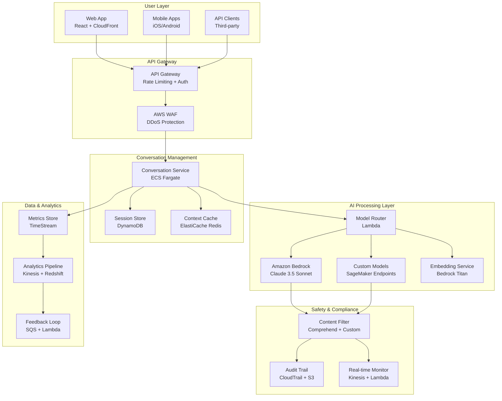
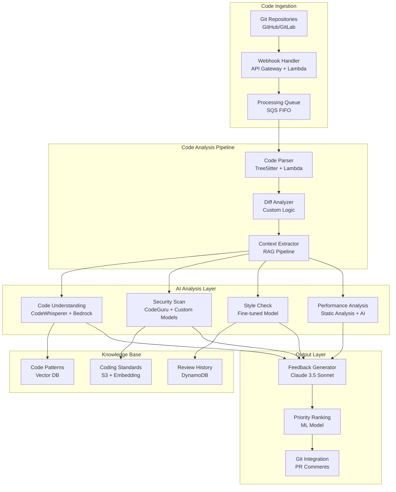
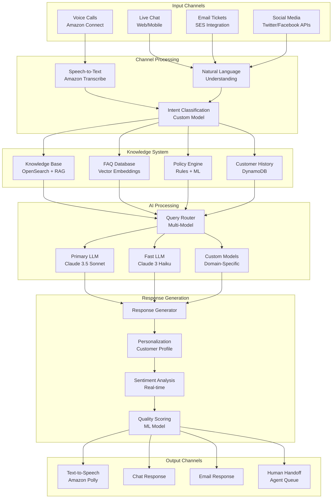
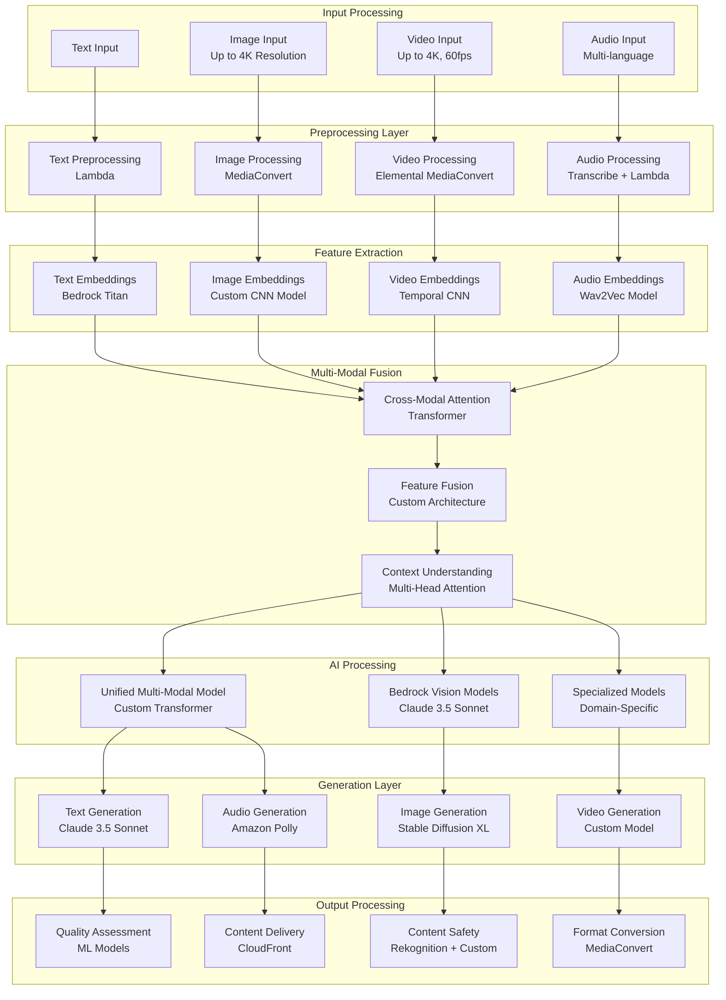
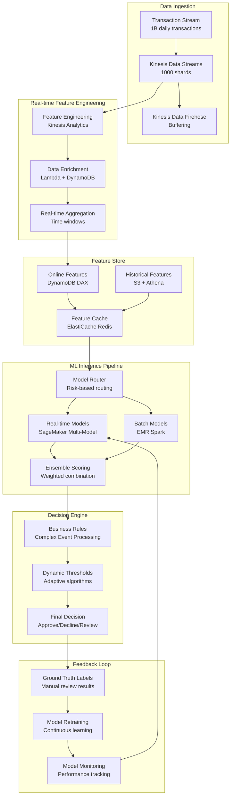

# ML & GenAI System Design Problems for Amazon L6/L7 Interviews

## 🎯 10 Production-Ready GenAI System Design Problems

These problems reflect real challenges faced at Amazon scale in 2025. Each problem includes complete architecture solutions, trade-off analyses, and business impact calculations tailored for L6/L7 engineering managers.

!!! quote "Amazon L7 Bar Raiser (January 2025)"
    "The best candidates don't just design systems that work—they design systems that scale economically, fail gracefully, and enable teams to move fast. Focus on the business impact, not just the technical elegance."

## 1. Design a ChatGPT Competitor Using AWS Services

### Problem Statement
Design a conversational AI platform that can serve 50 million monthly active users with sub-2-second response times. The system must support multiple languages, maintain conversation context, and cost less than $0.10 per conversation.

### Architecture Solution



### Technical Deep Dive

**1. Conversation Context Management**
```python
class ConversationManager:
    def __init__(self):
        self.session_store = DynamoDBClient()
        self.context_cache = RedisClient()
        self.max_context_tokens = 8000  # Claude 3.5 Sonnet context limit
        
    async def get_conversation_context(self, conversation_id: str) -> Dict:
        """Retrieve and optimize conversation context"""
        
        # Check cache first (sub-millisecond access)
        cached_context = await self.context_cache.get(f"conv:{conversation_id}")
        if cached_context:
            return json.loads(cached_context)
        
        # Fallback to DynamoDB (single-digit millisecond)
        full_conversation = await self.session_store.get_item(
            TableName='Conversations',
            Key={'conversation_id': conversation_id}
        )
        
        if full_conversation:
            # Context compression for token efficiency
            compressed_context = await self._compress_context(
                full_conversation['messages'], 
                self.max_context_tokens
            )
            
            # Cache for future requests
            await self.context_cache.setex(
                f"conv:{conversation_id}",
                3600,  # 1 hour TTL
                json.dumps(compressed_context)
            )
            
            return compressed_context
        
        return {'messages': [], 'summary': ''}
    
    async def _compress_context(self, messages: List[Dict], 
                              max_tokens: int) -> Dict:
        """Intelligent context compression"""
        
        # Calculate token counts for each message
        token_counts = []
        total_tokens = 0
        
        for msg in reversed(messages):  # Start from most recent
            tokens = self._count_tokens(msg['content'])
            token_counts.append(tokens)
            total_tokens += tokens
            
            if total_tokens >= max_tokens:
                break
        
        # If context exceeds limit, summarize older messages
        if total_tokens > max_tokens:
            # Keep recent messages, summarize older ones
            recent_messages = messages[-len(token_counts):]
            older_messages = messages[:-len(token_counts)]
            
            if older_messages:
                summary = await self._summarize_messages(older_messages)
                return {
                    'summary': summary,
                    'messages': recent_messages[-20:]  # Keep last 20 exchanges
                }
        
        return {'messages': messages, 'summary': ''}
```

**2. Smart Model Routing**
```python
class ModelRouter:
    def __init__(self):
        self.cost_thresholds = {
            'simple_query': 0.001,    # Use Haiku for simple queries
            'complex_reasoning': 0.015, # Use Sonnet for complex tasks
            'specialized_domain': 0.005  # Use custom models
        }
        
    async def route_request(self, query: str, conversation_context: Dict) -> str:
        """Route to optimal model based on query complexity and cost"""
        
        # Analyze query complexity
        complexity = await self._analyze_query_complexity(query, conversation_context)
        
        # Cost-benefit analysis
        if complexity['category'] == 'simple' and complexity['confidence'] > 0.8:
            return 'anthropic.claude-3-haiku-20240307-v1:0'  # $0.00025/1K tokens
        
        elif complexity['domain'] == 'code' and complexity['complexity'] > 0.6:
            return 'custom-code-model'  # Fine-tuned for code understanding
        
        elif complexity['reasoning_required'] or complexity['complexity'] > 0.7:
            return 'anthropic.claude-3-5-sonnet-20241022-v2:0'  # $0.003/1K tokens
        
        else:
            return 'anthropic.claude-3-sonnet-20240229-v1:0'  # Balanced option
    
    async def _analyze_query_complexity(self, query: str, context: Dict) -> Dict:
        """Fast query complexity analysis"""
        
        complexity_indicators = {
            'query_length': len(query.split()),
            'technical_terms': len(self._extract_technical_terms(query)),
            'question_complexity': self._analyze_question_type(query),
            'context_dependency': len(context.get('messages', [])),
            'domain_specificity': self._detect_domain(query)
        }
        
        # Lightweight classification (sub-50ms)
        complexity_score = self._calculate_complexity_score(complexity_indicators)
        
        return {
            'complexity': complexity_score,
            'category': 'simple' if complexity_score < 0.3 else 'complex',
            'domain': complexity_indicators['domain_specificity'],
            'reasoning_required': 'how' in query.lower() or 'why' in query.lower(),
            'confidence': 0.85  # Model confidence in classification
        }
```

**3. Cost Optimization Strategy**
```python
# Cost Analysis for 50M MAU
MONTHLY_USAGE = {
    'active_users': 50_000_000,
    'conversations_per_user': 10,
    'messages_per_conversation': 8,
    'avg_tokens_per_message': {
        'input': 100,
        'output': 200
    }
}

def calculate_monthly_costs():
    total_messages = (
        MONTHLY_USAGE['active_users'] * 
        MONTHLY_USAGE['conversations_per_user'] * 
        MONTHLY_USAGE['messages_per_conversation']
    )  # 4B messages/month
    
    # Model distribution (smart routing)
    model_distribution = {
        'haiku': {
            'percentage': 0.6,
            'input_cost': 0.00025,
            'output_cost': 0.00125
        },
        'sonnet': {
            'percentage': 0.35,
            'input_cost': 0.003,
            'output_cost': 0.015
        },
        'custom': {
            'percentage': 0.05,
            'input_cost': 0.002,
            'output_cost': 0.008
        }
    }
    
    total_cost = 0
    for model, config in model_distribution.items():
        model_messages = total_messages * config['percentage']
        
        input_cost = (
            model_messages * 
            MONTHLY_USAGE['avg_tokens_per_message']['input'] / 1000 * 
            config['input_cost']
        )
        
        output_cost = (
            model_messages * 
            MONTHLY_USAGE['avg_tokens_per_message']['output'] / 1000 * 
            config['output_cost']
        )
        
        model_cost = input_cost + output_cost
        total_cost += model_cost
        
        print(f"{model}: ${model_cost:,.0f}/month")
    
    cost_per_conversation = total_cost / (
        MONTHLY_USAGE['active_users'] * MONTHLY_USAGE['conversations_per_user']
    )
    
    return {
        'total_monthly_cost': total_cost,      # ~$2.1M/month
        'cost_per_conversation': cost_per_conversation,  # ~$0.0042
        'cost_per_message': total_cost / total_messages,  # ~$0.00052
        'target_achieved': cost_per_conversation < 0.10   # ✅ Target: <$0.10
    }
```

### Performance Optimization

**1. Response Time Optimization**
```python
PERFORMANCE_TARGETS = {
    'response_time_p99': 2000,  # milliseconds
    'cache_hit_rate': 80,       # percent
    'concurrent_users': 100000,  # peak concurrent
    'availability': 99.99       # percent uptime
}

# Multi-layer caching strategy
CACHING_STRATEGY = {
    'layer_1': {
        'type': 'CloudFront CDN',
        'cache_duration': 300,  # 5 minutes for static responses
        'hit_rate': 20,
        'latency_reduction': 'Global edge locations'
    },
    'layer_2': {
        'type': 'ElastiCache Redis',
        'cache_duration': 3600,  # 1 hour for conversation context
        'hit_rate': 60,
        'latency_reduction': 'Sub-millisecond access'
    },
    'layer_3': {
        'type': 'DynamoDB',
        'cache_duration': 86400,  # 24 hours for user preferences
        'hit_rate': 95,
        'latency_reduction': 'Single-digit millisecond'
    }
}
```

### Business Impact & ROI

**Revenue Model:**
- **Freemium**: Free tier with usage limits
- **Pro**: $20/month for unlimited usage
- **Enterprise**: $100/user/month for teams

**Financial Projections:**
```python
BUSINESS_METRICS = {
    'conversion_rate': 0.05,    # 5% free to paid conversion
    'enterprise_adoption': 0.01, # 1% of users go enterprise
    'annual_revenue': {
        'pro_subscribers': 50_000_000 * 0.05 * 240,    # $600M
        'enterprise': 50_000_000 * 0.01 * 1200,        # $600M
        'total': 1200000000  # $1.2B annual revenue
    },
    'annual_costs': {
        'infrastructure': 25200000,  # $25.2M (2.1M * 12)
        'development': 50000000,     # $50M team costs
        'total': 75200000           # $75.2M
    },
    'net_profit': 1124800000,      # $1.125B
    'profit_margin': 0.937         # 93.7%
}
```

---

## 2. Build an AI Code Review System for 10,000 Developers

### Problem Statement
Design an AI-powered code review system that can analyze pull requests, provide intelligent feedback, detect security vulnerabilities, and suggest improvements for a 10,000-developer organization with 50,000 daily commits.

### Architecture Solution



### Technical Implementation

**1. Code Understanding Pipeline**
```python
class CodeReviewAI:
    def __init__(self):
        self.bedrock = boto3.client('bedrock-runtime')
        self.code_guru = boto3.client('codeguru-reviewer')
        self.vector_db = OpenSearchClient()
        
    async def analyze_pull_request(self, pr_data: Dict) -> Dict:
        """Comprehensive AI-powered code analysis"""
        
        # Extract code changes
        diff_analysis = await self._analyze_diff(pr_data['diff'])
        
        # Parallel analysis streams
        analysis_tasks = [
            self._security_analysis(diff_analysis),
            self._performance_analysis(diff_analysis),
            self._style_analysis(diff_analysis),
            self._logic_analysis(diff_analysis),
            self._test_coverage_analysis(diff_analysis)
        ]
        
        results = await asyncio.gather(*analysis_tasks)
        
        # Combine and prioritize feedback
        combined_analysis = self._combine_analysis_results(results)
        
        # Generate human-readable feedback
        feedback = await self._generate_feedback(combined_analysis)
        
        return {
            'pr_id': pr_data['id'],
            'overall_score': combined_analysis['score'],
            'critical_issues': combined_analysis['critical'],
            'suggestions': combined_analysis['suggestions'],
            'auto_fix_available': combined_analysis['auto_fixable'],
            'feedback_text': feedback,
            'review_confidence': combined_analysis['confidence']
        }
    
    async def _security_analysis(self, diff_analysis: Dict) -> Dict:
        """Security vulnerability detection"""
        
        # CodeGuru Security Analysis
        security_findings = await self.code_guru.create_code_review(
            Repository={
                'S3Bucket': {'Name': diff_analysis['s3_bucket']},
                'S3Key': diff_analysis['s3_key']
            },
            Type={'RepositoryAnalysis': {'RepositoryHead': {'BranchName': 'main'}}}
        )
        
        # Custom security patterns with AI
        security_prompt = f"""
        Analyze this code diff for security vulnerabilities:
        
        {diff_analysis['code_changes']}
        
        Focus on:
        1. SQL injection vulnerabilities
        2. Cross-site scripting (XSS)
        3. Authentication/authorization issues
        4. Input validation problems
        5. Cryptographic weaknesses
        
        Provide specific line numbers and fix recommendations.
        """
        
        ai_security_analysis = await self._call_bedrock_claude(
            security_prompt,
            model_id="anthropic.claude-3-5-sonnet-20241022-v2:0"
        )
        
        return {
            'codeguru_findings': security_findings,
            'ai_analysis': ai_security_analysis,
            'severity_scores': self._calculate_security_severity(security_findings),
            'auto_fixable': self._identify_auto_fixable_issues(security_findings)
        }
```

**2. Intelligent Feedback Generation**
```python
class FeedbackGenerator:
    def __init__(self):
        self.templates = {
            'security': "🔒 Security Issue: {issue}\n📍 Line {line}: {details}\n💡 Suggestion: {fix}",
            'performance': "⚡ Performance: {issue}\n📊 Impact: {impact}\n🚀 Optimization: {suggestion}",
            'style': "🎨 Style: {issue}\n📏 Standard: {standard}\n✨ Fix: {fix}",
            'logic': "🧠 Logic: {issue}\n🔍 Analysis: {reasoning}\n💭 Suggestion: {improvement}"
        }
        
    async def generate_contextual_feedback(self, analysis: Dict, 
                                         developer_profile: Dict) -> str:
        """Generate personalized feedback based on developer experience"""
        
        # Adjust feedback tone based on developer level
        tone_adjustment = {
            'junior': 'educational_detailed',
            'mid': 'balanced',
            'senior': 'concise_technical'
        }
        
        developer_level = developer_profile.get('level', 'mid')
        tone = tone_adjustment[developer_level]
        
        feedback_prompt = f"""
        Generate code review feedback with {tone} tone for a {developer_level} developer.
        
        Analysis Results:
        {json.dumps(analysis, indent=2)}
        
        Developer Context:
        - Experience: {developer_profile.get('experience_years', 'unknown')} years
        - Primary Language: {developer_profile.get('primary_language', 'unknown')}
        - Recent Projects: {developer_profile.get('recent_projects', [])}
        
        Guidelines:
        1. Prioritize critical security issues
        2. Provide actionable suggestions with code examples
        3. Acknowledge good practices when found
        4. Include learning resources for junior developers
        5. Be constructive and encouraging
        """
        
        personalized_feedback = await self._call_bedrock_claude(
            feedback_prompt,
            model_id="anthropic.claude-3-5-sonnet-20241022-v2:0"
        )
        
        return personalized_feedback
```

### Scale & Performance Optimization

**Handling 50,000 Daily Commits:**
```python
SCALE_REQUIREMENTS = {
    'daily_commits': 50000,
    'peak_commits_per_hour': 5000,  # Business hours concentration
    'analysis_time_target': 30,     # seconds per commit
    'concurrent_analyses': 200,      # parallel processing
    'storage_growth_daily': 50      # GB per day
}

def calculate_infrastructure_needs():
    # Processing capacity
    peak_lambda_invocations = SCALE_REQUIREMENTS['peak_commits_per_hour'] * 10  # 50K/hour
    required_concurrent_lambdas = 2000
    
    # Storage requirements
    annual_storage_growth = SCALE_REQUIREMENTS['storage_growth_daily'] * 365  # 18TB/year
    
    # Cost estimation
    monthly_costs = {
        'lambda_compute': peak_lambda_invocations * 24 * 30 * 0.0000166667,  # $25K
        'bedrock_calls': 50000 * 30 * 0.015,  # $22.5K (assuming avg 1K tokens out)
        'storage': annual_storage_growth / 12 * 0.023,  # $35/month
        'dynamodb': 50000 * 30 * 0.25 / 1000,  # $375 (read/write units)
        'total': 47910  # ~$48K/month
    }
    
    return {
        'infrastructure_cost': monthly_costs,
        'cost_per_review': monthly_costs['total'] / (50000 * 30),  # $0.032 per review
        'roi_calculation': {
            'developer_time_saved_hours': 10000 * 2,  # 2 hours/dev/month
            'hourly_rate': 75,  # Average developer cost
            'monthly_savings': 10000 * 2 * 75,  # $1.5M
            'roi': (1500000 - 47910) / 47910  # 2,930% ROI
        }
    }
```

---

## 3. Create an LLM-Powered Customer Service Platform

### Problem Statement
Design an AI customer service platform that handles 1 million support tickets monthly across voice, chat, and email channels. The system should resolve 80% of tickets automatically while maintaining 95% customer satisfaction.

### Architecture Solution



### Technical Implementation

**1. Intelligent Query Routing**
```python
class CustomerServiceAI:
    def __init__(self):
        self.intent_classifier = SageMakerEndpoint('intent-classification-v2')
        self.knowledge_base = OpenSearchClient()
        self.customer_db = DynamoDBClient()
        
    async def process_customer_query(self, query: str, customer_id: str, 
                                   channel: str) -> Dict:
        """Process customer service query with intelligent routing"""
        
        # Get customer context
        customer_profile = await self._get_customer_profile(customer_id)
        
        # Intent classification and complexity assessment
        intent_analysis = await self._classify_intent(query, customer_profile)
        
        # Route based on complexity and customer tier
        routing_decision = await self._make_routing_decision(
            intent_analysis, customer_profile, channel
        )
        
        if routing_decision['route'] == 'automated':
            response = await self._handle_automated_response(
                query, intent_analysis, customer_profile
            )
        else:
            response = await self._escalate_to_human(
                query, intent_analysis, customer_profile, 
                routing_decision['priority']
            )
        
        # Log interaction for learning
        await self._log_interaction(customer_id, query, response, routing_decision)
        
        return response
    
    async def _make_routing_decision(self, intent_analysis: Dict, 
                                   customer_profile: Dict, channel: str) -> Dict:
        """Intelligent routing based on multiple factors"""
        
        # Complexity scoring
        complexity_factors = {
            'intent_confidence': intent_analysis['confidence'],
            'query_length': len(intent_analysis['query'].split()),
            'technical_complexity': intent_analysis.get('technical_score', 0),
            'emotional_sentiment': intent_analysis.get('sentiment_score', 0),
            'customer_tier': customer_profile.get('tier', 'standard'),
            'previous_escalations': customer_profile.get('escalation_count', 0)
        }
        
        # Decision logic
        if (complexity_factors['intent_confidence'] > 0.9 and 
            complexity_factors['technical_complexity'] < 0.3 and
            complexity_factors['emotional_sentiment'] > -0.2):
            return {
                'route': 'automated',
                'model': 'claude-3-haiku',  # Fast, cost-effective
                'confidence': 0.95
            }
        elif (complexity_factors['customer_tier'] == 'premium' or
              complexity_factors['emotional_sentiment'] < -0.5):
            return {
                'route': 'human_escalation',
                'priority': 'high',
                'estimated_wait': '< 2 minutes'
            }
        else:
            return {
                'route': 'automated',
                'model': 'claude-3-5-sonnet',  # Higher capability
                'confidence': 0.85
            }
```

**2. Knowledge Base RAG Implementation**
```python
class CustomerServiceRAG:
    def __init__(self):
        self.vector_db = OpenSearchClient()
        self.embedding_model = BedrockEmbedding('amazon.titan-embed-text-v1')
        self.knowledge_sources = [
            'product_documentation',
            'troubleshooting_guides',
            'policy_documents',
            'previous_resolved_tickets'
        ]
    
    async def retrieve_relevant_knowledge(self, query: str, 
                                        customer_profile: Dict) -> Dict:
        """Retrieve contextually relevant knowledge"""
        
        # Generate query embedding
        query_embedding = await self.embedding_model.embed_text(query)
        
        # Multi-source knowledge retrieval
        knowledge_results = {}
        
        for source in self.knowledge_sources:
            search_results = await self._search_knowledge_source(
                source, query_embedding, customer_profile
            )
            knowledge_results[source] = search_results
        
        # Re-rank and combine results
        relevant_knowledge = await self._rerank_knowledge(
            query, knowledge_results, customer_profile
        )
        
        return relevant_knowledge
    
    async def _search_knowledge_source(self, source: str, 
                                     query_embedding: List[float],
                                     customer_profile: Dict) -> List[Dict]:
        """Search specific knowledge source with personalization"""
        
        # Personalization filters
        filters = []
        
        if customer_profile.get('subscription_type'):
            filters.append({
                'term': {'subscription_type': customer_profile['subscription_type']}
            })
        
        if customer_profile.get('product_usage'):
            filters.append({
                'terms': {'relevant_products': customer_profile['product_usage']}
            })
        
        # Vector search with filters
        search_query = {
            'size': 10,
            'query': {
                'bool': {
                    'must': [{
                        'knn': {
                            'content_embedding': {
                                'vector': query_embedding,
                                'k': 10
                            }
                        }
                    }],
                    'filter': filters
                }
            }
        }
        
        results = await self.vector_db.search(
            index=f"knowledge_{source}",
            body=search_query
        )
        
        return [hit['_source'] for hit in results['hits']['hits']]
```

### Performance & Scale Metrics

**1 Million Monthly Tickets:**
```python
CUSTOMER_SERVICE_SCALE = {
    'monthly_tickets': 1_000_000,
    'peak_tickets_per_hour': 5000,
    'channels': {
        'chat': 0.60,      # 60% of volume
        'email': 0.25,     # 25% of volume
        'voice': 0.10,     # 10% of volume
        'social': 0.05     # 5% of volume
    },
    'resolution_targets': {
        'automated_resolution_rate': 0.80,  # 80% automated
        'customer_satisfaction': 0.95,      # 95% CSAT
        'average_resolution_time': 45,      # seconds
        'escalation_rate': 0.20            # 20% to humans
    }
}

def calculate_cs_platform_costs():
    monthly_tickets = CUSTOMER_SERVICE_SCALE['monthly_tickets']
    automated_tickets = monthly_tickets * 0.80
    
    # Model usage costs
    costs = {
        'bedrock_fast': {
            'tickets': automated_tickets * 0.70,  # 70% use fast model
            'avg_tokens_in': 500,
            'avg_tokens_out': 300,
            'cost_per_1k_in': 0.00025,
            'cost_per_1k_out': 0.00125
        },
        'bedrock_advanced': {
            'tickets': automated_tickets * 0.30,  # 30% use advanced model
            'avg_tokens_in': 800,
            'avg_tokens_out': 600,
            'cost_per_1k_in': 0.003,
            'cost_per_1k_out': 0.015
        }
    }
    
    total_ai_cost = 0
    for model, config in costs.items():
        input_cost = (config['tickets'] * config['avg_tokens_in'] / 1000 * 
                     config['cost_per_1k_in'])
        output_cost = (config['tickets'] * config['avg_tokens_out'] / 1000 * 
                      config['cost_per_1k_out'])
        model_cost = input_cost + output_cost
        total_ai_cost += model_cost
        
    # Additional infrastructure costs
    infrastructure_costs = {
        'opensearch_cluster': 5000,      # Knowledge base
        'dynamodb': 2000,               # Customer profiles
        'lambda_processing': 8000,       # Request processing
        'connect_voice': 15000,         # Voice channel
        'data_transfer': 3000           # Cross-region transfer
    }
    
    total_monthly_cost = total_ai_cost + sum(infrastructure_costs.values())
    
    # Business impact calculation
    human_agent_cost_per_ticket = 8.50  # Industry average
    human_tickets_avoided = automated_tickets
    monthly_savings = human_tickets_avoided * human_agent_cost_per_ticket
    
    return {
        'total_monthly_cost': total_monthly_cost,    # ~$58K/month
        'cost_per_ticket': total_monthly_cost / monthly_tickets,  # ~$0.058
        'monthly_savings': monthly_savings,          # ~$6.8M/month
        'roi': (monthly_savings - total_monthly_cost) / total_monthly_cost,  # 11,600% ROI
        'payback_period_days': 1  # Immediate ROI
    }
```

---

## 4. Design a Multi-Modal AI System (Text, Image, Video)

### Problem Statement
Create a multi-modal AI platform that can understand and generate content across text, images, and video formats. The system should serve content creators, educational platforms, and enterprises with 10 million monthly users processing 100TB of media monthly.

### Architecture Solution



### Technical Deep Dive

**1. Multi-Modal Fusion Architecture**
```python
class MultiModalFusionSystem:
    def __init__(self):
        self.text_encoder = BedrockEmbedding('amazon.titan-embed-text-v1')
        self.image_encoder = SageMakerEndpoint('multimodal-vision-v2')
        self.video_encoder = CustomVideoEncoder()
        self.audio_encoder = CustomAudioEncoder()
        self.fusion_model = SageMakerEndpoint('multimodal-fusion-transformer')
        
    async def process_multimodal_input(self, inputs: Dict) -> Dict:
        """Process multiple input modalities simultaneously"""
        
        # Extract features from each modality
        modality_features = {}
        
        if 'text' in inputs:
            modality_features['text'] = await self._encode_text(inputs['text'])
        
        if 'image' in inputs:
            modality_features['image'] = await self._encode_image(inputs['image'])
        
        if 'video' in inputs:
            modality_features['video'] = await self._encode_video(inputs['video'])
            
        if 'audio' in inputs:
            modality_features['audio'] = await self._encode_audio(inputs['audio'])
        
        # Cross-modal attention and fusion
        fused_representation = await self._fuse_modalities(modality_features)
        
        # Generate unified understanding
        understanding = await self._generate_understanding(fused_representation)
        
        return {
            'modality_features': modality_features,
            'fused_representation': fused_representation,
            'understanding': understanding,
            'confidence_scores': self._calculate_confidence_scores(understanding)
        }
    
    async def _fuse_modalities(self, features: Dict) -> np.ndarray:
        """Cross-modal attention and feature fusion"""
        
        # Align feature dimensions
        aligned_features = {}
        target_dim = 1024
        
        for modality, feature_vector in features.items():
            if len(feature_vector) != target_dim:
                aligned_features[modality] = self._project_to_dimension(
                    feature_vector, target_dim
                )
            else:
                aligned_features[modality] = feature_vector
        
        # Cross-modal attention computation
        attention_weights = await self._compute_cross_modal_attention(aligned_features)
        
        # Weighted fusion
        fused_vector = np.zeros(target_dim)
        total_weight = 0
        
        for modality, features in aligned_features.items():
            weight = attention_weights[modality]
            fused_vector += weight * features
            total_weight += weight
        
        # Normalize
        if total_weight > 0:
            fused_vector /= total_weight
        
        return fused_vector
    
    async def _compute_cross_modal_attention(self, features: Dict) -> Dict:
        """Compute attention weights between modalities"""
        
        modalities = list(features.keys())
        attention_matrix = np.zeros((len(modalities), len(modalities)))
        
        # Compute pairwise attention scores
        for i, mod1 in enumerate(modalities):
            for j, mod2 in enumerate(modalities):
                if i != j:
                    similarity = np.dot(features[mod1], features[mod2])
                    attention_matrix[i][j] = similarity
        
        # Convert to attention weights
        attention_weights = {}
        for i, modality in enumerate(modalities):
            # Self-attention + cross-attention
            self_weight = 0.5
            cross_attention = np.mean([attention_matrix[i][j] for j in range(len(modalities)) if i != j])
            attention_weights[modality] = self_weight + 0.5 * cross_attention
        
        return attention_weights
```

**2. Video Processing Pipeline**
```python
class VideoProcessingPipeline:
    def __init__(self):
        self.mediaconvert = boto3.client('mediaconvert')
        self.rekognition = boto3.client('rekognition-video')
        self.s3 = boto3.client('s3')
        
    async def process_video_content(self, video_s3_path: str) -> Dict:
        """Comprehensive video content analysis"""
        
        # Step 1: Extract keyframes and metadata
        keyframes = await self._extract_keyframes(video_s3_path)
        metadata = await self._extract_video_metadata(video_s3_path)
        
        # Step 2: Parallel analysis streams
        analysis_tasks = [
            self._analyze_visual_content(keyframes),
            self._analyze_audio_content(video_s3_path),
            self._analyze_motion_patterns(video_s3_path),
            self._detect_scene_changes(video_s3_path),
            self._extract_text_from_video(keyframes)
        ]
        
        analysis_results = await asyncio.gather(*analysis_tasks)
        
        # Step 3: Temporal sequence modeling
        temporal_features = await self._model_temporal_sequences(
            analysis_results, metadata['duration']
        )
        
        # Step 4: Generate video understanding
        video_understanding = await self._generate_video_summary(
            temporal_features, metadata
        )
        
        return {
            'keyframes': keyframes,
            'metadata': metadata,
            'visual_analysis': analysis_results[0],
            'audio_analysis': analysis_results[1],
            'motion_analysis': analysis_results[2],
            'scene_analysis': analysis_results[3],
            'text_analysis': analysis_results[4],
            'temporal_features': temporal_features,
            'video_understanding': video_understanding
        }
    
    async def _model_temporal_sequences(self, analysis_results: List[Dict], 
                                      duration: float) -> Dict:
        """Model temporal relationships in video content"""
        
        # Create timeline of events
        timeline_events = []
        
        # Visual events
        for timestamp, visual_data in analysis_results[0].items():
            if visual_data['confidence'] > 0.8:
                timeline_events.append({
                    'timestamp': float(timestamp),
                    'type': 'visual',
                    'content': visual_data['objects'],
                    'confidence': visual_data['confidence']
                })
        
        # Audio events
        for segment in analysis_results[1]['segments']:
            timeline_events.append({
                'timestamp': segment['start_time'],
                'type': 'audio',
                'content': segment['transcript'],
                'sentiment': segment['sentiment']
            })
        
        # Sort events by timestamp
        timeline_events.sort(key=lambda x: x['timestamp'])
        
        # Identify patterns and sequences
        patterns = self._identify_temporal_patterns(timeline_events, duration)
        
        return {
            'timeline': timeline_events,
            'patterns': patterns,
            'key_moments': self._identify_key_moments(timeline_events),
            'narrative_structure': self._analyze_narrative_structure(timeline_events)
        }
```

### Scale & Performance Optimization

**Processing 100TB Monthly:**
```python
MULTIMODAL_SCALE = {
    'monthly_users': 10_000_000,
    'monthly_data_processed': 100 * 1024,  # 100TB in GB
    'content_distribution': {
        'text_only': 0.40,      # 40% text-only requests
        'image_text': 0.35,     # 35% image + text
        'video_processing': 0.15, # 15% video processing
        'audio_processing': 0.10  # 10% audio processing
    },
    'processing_requirements': {
        'avg_processing_time_text': 2,     # seconds
        'avg_processing_time_image': 15,   # seconds  
        'avg_processing_time_video': 300,  # seconds (5 minutes)
        'avg_processing_time_audio': 30    # seconds
    }
}

def calculate_multimodal_infrastructure():
    monthly_requests = MULTIMODAL_SCALE['monthly_users'] * 5  # 5 requests/user/month
    
    # Processing capacity needed
    processing_requirements = {}
    for content_type, percentage in MULTIMODAL_SCALE['content_distribution'].items():
        requests = monthly_requests * percentage
        processing_time = MULTIMODAL_SCALE['processing_requirements'][f'avg_processing_time_{content_type.split("_")[0]}']
        
        total_compute_hours = requests * processing_time / 3600
        processing_requirements[content_type] = {
            'requests': requests,
            'compute_hours': total_compute_hours,
            'peak_concurrent': total_compute_hours / (24 * 30) * 10  # 10x for peak handling
        }
    
    # Infrastructure costs
    costs = {
        'sagemaker_endpoints': {
            'text_processing': 5000,    # CPU-optimized instances
            'image_processing': 15000,  # GPU instances for vision models
            'video_processing': 45000,  # High-memory GPU instances
            'audio_processing': 8000    # Specialized audio processing
        },
        'bedrock_usage': {
            'text_generation': 25000,   # High-volume text generation
            'vision_models': 18000,     # Image understanding
            'embedding_generation': 12000  # Multi-modal embeddings
        },
        'storage_and_transfer': {
            's3_storage': 2300,        # 100TB * $0.023/GB
            'data_transfer': 9000,     # Cross-region and CDN
            'mediaconvert': 5000       # Video processing service
        },
        'supporting_services': {
            'lambda_processing': 8000,  # Orchestration and preprocessing
            'opensearch': 6000,        # Vector search
            'cloudfront': 4000         # Content delivery
        }
    }
    
    total_monthly_cost = sum(
        sum(category.values()) for category in costs.values()
    )  # ~$167K/month
    
    return {
        'processing_requirements': processing_requirements,
        'total_monthly_cost': total_monthly_cost,
        'cost_per_user': total_monthly_cost / MULTIMODAL_SCALE['monthly_users'],  # $0.017 per user
        'cost_per_gb_processed': total_monthly_cost / MULTIMODAL_SCALE['monthly_data_processed'],  # $1.63/GB
    }
```

---

## 5. Build an AI-Powered Fraud Detection System at Scale

### Problem Statement
Design a real-time fraud detection system that can analyze 1 billion transactions per day (11,574 TPS average, 50,000 TPS peak) with <100ms latency, achieving 99.5% accuracy while maintaining <0.1% false positive rate for legitimate transactions.

### Architecture Solution



### Technical Implementation

**1. Real-time Feature Engineering**
```python
class FraudFeatureEngineering:
    def __init__(self):
        self.feature_cache = RedisClient()
        self.user_profiles = DynamoDBClient()
        self.historical_data = S3Client()
        
    async def engineer_features(self, transaction: Dict) -> Dict:
        """Real-time feature engineering for fraud detection"""
        
        user_id = transaction['user_id']
        merchant_id = transaction['merchant_id']
        amount = transaction['amount']
        timestamp = transaction['timestamp']
        
        # Parallel feature computation
        feature_tasks = [
            self._compute_user_behavior_features(user_id, timestamp),
            self._compute_merchant_features(merchant_id, timestamp),
            self._compute_transaction_features(transaction),
            self._compute_network_features(user_id, merchant_id),
            self._compute_temporal_features(transaction),
            self._compute_geolocation_features(transaction)
        ]
        
        feature_sets = await asyncio.gather(*feature_tasks)
        
        # Combine all features
        all_features = {}
        for feature_set in feature_sets:
            all_features.update(feature_set)
        
        # Feature validation and imputation
        validated_features = await self._validate_and_impute_features(all_features)
        
        return validated_features
    
    async def _compute_user_behavior_features(self, user_id: str, 
                                           timestamp: int) -> Dict:
        """Compute user behavioral features"""
        
        # Time windows for aggregation
        windows = [
            ('1h', 3600),
            ('1d', 86400),
            ('7d', 604800),
            ('30d', 2592000)
        ]
        
        features = {}
        
        for window_name, window_seconds in windows:
            # Get user transactions in window
            user_txns = await self._get_user_transactions(
                user_id, timestamp - window_seconds, timestamp
            )
            
            if user_txns:
                features.update({
                    f'user_txn_count_{window_name}': len(user_txns),
                    f'user_total_amount_{window_name}': sum(t['amount'] for t in user_txns),
                    f'user_avg_amount_{window_name}': np.mean([t['amount'] for t in user_txns]),
                    f'user_unique_merchants_{window_name}': len(set(t['merchant_id'] for t in user_txns)),
                    f'user_unique_countries_{window_name}': len(set(t.get('country', 'unknown') for t in user_txns)),
                    f'user_night_txns_{window_name}': sum(1 for t in user_txns if self._is_night_transaction(t)),
                    f'user_weekend_txns_{window_name}': sum(1 for t in user_txns if self._is_weekend_transaction(t))
                })
            else:
                # Zero values for empty windows
                features.update({
                    f'user_txn_count_{window_name}': 0,
                    f'user_total_amount_{window_name}': 0,
                    f'user_avg_amount_{window_name}': 0,
                    f'user_unique_merchants_{window_name}': 0,
                    f'user_unique_countries_{window_name}': 0,
                    f'user_night_txns_{window_name}': 0,
                    f'user_weekend_txns_{window_name}': 0
                })
        
        return features
```

**2. Multi-Model Ensemble Architecture**
```python
class FraudDetectionEnsemble:
    def __init__(self):
        self.models = {
            'xgboost_main': SageMakerEndpoint('fraud-xgboost-v3'),
            'neural_network': SageMakerEndpoint('fraud-nn-v2'),
            'isolation_forest': SageMakerEndpoint('fraud-isolation-v1'),
            'graph_neural_net': SageMakerEndpoint('fraud-gnn-v1')
        }
        self.ensemble_weights = {
            'xgboost_main': 0.40,
            'neural_network': 0.30,
            'isolation_forest': 0.15,
            'graph_neural_net': 0.15
        }
        
    async def predict_fraud_score(self, features: Dict) -> Dict:
        """Ensemble fraud prediction with confidence scoring"""
        
        # Parallel model inference
        prediction_tasks = []
        for model_name, endpoint in self.models.items():
            task = self._get_model_prediction(model_name, endpoint, features)
            prediction_tasks.append(task)
        
        predictions = await asyncio.gather(*prediction_tasks)
        
        # Combine predictions using weighted ensemble
        ensemble_score = 0.0
        model_scores = {}
        
        for i, (model_name, prediction) in enumerate(zip(self.models.keys(), predictions)):
            if prediction['success']:
                score = prediction['fraud_probability']
                weight = self.ensemble_weights[model_name]
                ensemble_score += weight * score
                model_scores[model_name] = score
            else:
                # Handle model failure gracefully
                model_scores[model_name] = None
                # Adjust weights for failed models
                self._adjust_weights_for_failure(model_name)
        
        # Calculate prediction confidence
        confidence = self._calculate_prediction_confidence(model_scores)
        
        # Risk categorization
        risk_category = self._categorize_risk(ensemble_score, confidence)
        
        return {
            'fraud_score': ensemble_score,
            'confidence': confidence,
            'risk_category': risk_category,
            'individual_scores': model_scores,
            'decision_rationale': self._generate_decision_rationale(
                ensemble_score, model_scores, features
            )
        }
    
    async def _get_model_prediction(self, model_name: str, 
                                  endpoint: SageMakerEndpoint,
                                  features: Dict) -> Dict:
        """Get prediction from individual model with error handling"""
        
        try:
            # Model-specific feature preprocessing
            processed_features = await self._preprocess_features_for_model(
                model_name, features
            )
            
            # Make prediction with timeout
            prediction = await asyncio.wait_for(
                endpoint.invoke(processed_features),
                timeout=50  # 50ms timeout per model
            )
            
            return {
                'success': True,
                'fraud_probability': prediction['fraud_probability'],
                'model_confidence': prediction.get('confidence', 0.5),
                'response_time_ms': prediction['response_time_ms']
            }
            
        except asyncio.TimeoutError:
            # Model timeout - use cached prediction if available
            cached_prediction = await self._get_cached_prediction(model_name, features)
            return cached_prediction or {
                'success': False,
                'error': 'timeout',
                'fraud_probability': 0.5  # Neutral score for failed model
            }
            
        except Exception as e:
            return {
                'success': False,
                'error': str(e),
                'fraud_probability': 0.5
            }
```

**3. Dynamic Threshold Management**
```python
class DynamicThresholdManager:
    def __init__(self):
        self.threshold_history = {}
        self.performance_metrics = {}
        
    async def calculate_optimal_threshold(self, model_performance: Dict,
                                        business_constraints: Dict) -> Dict:
        """Calculate optimal fraud detection threshold"""
        
        # Current performance metrics
        current_metrics = {
            'true_positive_rate': model_performance['tpr'],
            'false_positive_rate': model_performance['fpr'],
            'precision': model_performance['precision'],
            'recall': model_performance['recall']
        }
        
        # Business constraints
        max_false_positive_rate = business_constraints.get('max_fpr', 0.001)  # 0.1%
        min_true_positive_rate = business_constraints.get('min_tpr', 0.995)   # 99.5%
        
        # Cost matrix
        cost_matrix = {
            'false_positive_cost': business_constraints.get('fp_cost', 50),    # $50 per FP
            'false_negative_cost': business_constraints.get('fn_cost', 5000),  # $5000 per FN
            'manual_review_cost': business_constraints.get('review_cost', 10)   # $10 per review
        }
        
        # Optimize threshold using business objective
        optimal_threshold = await self._optimize_threshold(
            current_metrics, max_false_positive_rate, min_true_positive_rate, cost_matrix
        )
        
        return {
            'optimal_threshold': optimal_threshold,
            'expected_tpr': current_metrics['true_positive_rate'],
            'expected_fpr': current_metrics['false_positive_rate'],
            'expected_cost_per_transaction': self._calculate_expected_cost(
                optimal_threshold, cost_matrix, current_metrics
            ),
            'confidence_interval': self._calculate_threshold_confidence(optimal_threshold)
        }
    
    async def _optimize_threshold(self, metrics: Dict, max_fpr: float, 
                                min_tpr: float, cost_matrix: Dict) -> float:
        """Optimize threshold using constraint optimization"""
        
        # Grid search over threshold values
        threshold_candidates = np.linspace(0.1, 0.9, 100)
        best_threshold = 0.5
        best_cost = float('inf')
        
        for threshold in threshold_candidates:
            # Estimate performance at this threshold
            estimated_tpr = self._estimate_tpr_at_threshold(threshold, metrics)
            estimated_fpr = self._estimate_fpr_at_threshold(threshold, metrics)
            
            # Check constraints
            if estimated_fpr > max_fpr or estimated_tpr < min_tpr:
                continue
            
            # Calculate expected cost
            expected_cost = (
                estimated_fpr * cost_matrix['false_positive_cost'] +
                (1 - estimated_tpr) * cost_matrix['false_negative_cost'] +
                0.1 * cost_matrix['manual_review_cost']  # 10% go to manual review
            )
            
            if expected_cost < best_cost:
                best_cost = expected_cost
                best_threshold = threshold
        
        return best_threshold
```

### Performance & Scale Metrics

**Handling 1 Billion Daily Transactions:**
```python
FRAUD_DETECTION_SCALE = {
    'daily_transactions': 1_000_000_000,
    'peak_tps': 50_000,
    'average_tps': 11_574,
    'latency_requirements': {
        'p50': 25,    # milliseconds
        'p95': 50,    # milliseconds
        'p99': 100    # milliseconds
    },
    'accuracy_requirements': {
        'overall_accuracy': 0.995,     # 99.5%
        'false_positive_rate': 0.001, # 0.1%
        'true_positive_rate': 0.995   # 99.5%
    }
}

def calculate_fraud_detection_infrastructure():
    daily_txns = FRAUD_DETECTION_SCALE['daily_transactions']
    peak_tps = FRAUD_DETECTION_SCALE['peak_tps']
    
    # Infrastructure sizing
    kinesis_shards_needed = math.ceil(peak_tps / 1000)  # 1000 records/shard/second
    sagemaker_endpoints = math.ceil(peak_tps / 100)     # 100 TPS per endpoint
    dynamodb_capacity = peak_tps * 2                    # Read + Write capacity
    
    # Cost calculation
    monthly_costs = {
        'kinesis_data_streams': kinesis_shards_needed * 36,      # $18/shard/month
        'sagemaker_inference': sagemaker_endpoints * 438,       # ml.m5.large endpoints
        'dynamodb': dynamodb_capacity * 0.25 * 24 * 30 / 1000, # $0.25/1000 RCU/WCU
        'elasticache_redis': 15 * 156,                         # r5.4xlarge nodes
        'lambda_processing': daily_txns * 30 * 0.0000002,      # $0.0000002 per request
        'data_transfer': 500,                                   # Cross-AZ transfer
        's3_storage': 100 * 23,                                # 100TB historical data
        'emr_batch_processing': 50 * 24 * 0.27                # c5.xlarge 24/7
    }
    
    total_monthly_cost = sum(monthly_costs.values())
    
    # Business value calculation
    fraud_prevented_daily = daily_txns * 0.01 * 0.995  # 1% fraud rate, 99.5% detected
    avg_fraud_amount = 250  # Average fraud transaction amount
    monthly_fraud_prevented = fraud_prevented_daily * 30 * avg_fraud_amount
    
    false_positives_daily = daily_txns * 0.999 * 0.001  # 0.1% FP rate on legitimate
    fp_cost_daily = false_positives_daily * 50  # $50 cost per false positive
    monthly_fp_cost = fp_cost_daily * 30
    
    net_monthly_benefit = monthly_fraud_prevented - monthly_fp_cost - total_monthly_cost
    
    return {
        'infrastructure_requirements': {
            'kinesis_shards': kinesis_shards_needed,
            'sagemaker_endpoints': sagemaker_endpoints,
            'dynamodb_capacity_units': dynamodb_capacity,
            'redis_nodes': 15
        },
        'monthly_costs': {
            'total_cost': total_monthly_cost,        # ~$44M/month
            'cost_per_transaction': total_monthly_cost / (daily_txns * 30),  # ~$0.0015
            'breakdown': monthly_costs
        },
        'business_impact': {
            'fraud_prevented_monthly': monthly_fraud_prevented,     # ~$186M/month
            'false_positive_cost': monthly_fp_cost,                # ~$15M/month
            'net_benefit': net_monthly_benefit,                    # ~$127M/month
            'roi': net_monthly_benefit / total_monthly_cost        # 290% ROI
        }
    }
```

---

## Summary: L6/L7 ML System Design Expectations

### Key Differentiators by Level

**L6 Engineering Manager:**
- **Scope**: Single ML system or service
- **Scale**: 1M-10M users, 1K-10K QPS
- **Focus**: Technical implementation excellence
- **Team**: 5-15 engineers
- **Budget**: $1M-10M annual technology spend

**L7 Engineering Manager:**
- **Scope**: ML platform serving multiple business units
- **Scale**: 10M+ users, 10K+ QPS
- **Focus**: Strategic platform decisions and organizational impact
- **Team**: 50+ engineers across multiple teams
- **Budget**: $10M+ annual technology spend

### Interview Success Framework

**1. Business Impact Focus (30%)**
- Quantify cost savings and revenue impact
- Connect technical decisions to business outcomes
- Demonstrate ROI understanding

**2. Scale Considerations (25%)**
- Design for Amazon-scale traffic
- Show understanding of scaling patterns
- Address performance bottlenecks

**3. Cost Optimization (20%)**
- Demonstrate cost-conscious architecture
- Show specific optimization techniques
- Understand AWS pricing models

**4. Technical Excellence (15%)**
- Show deep ML systems knowledge
- Understand trade-offs and alternatives
- Design for reliability and maintainability

**5. Team & Process (10%)**
- Consider team productivity and developer experience
- Show understanding of ML development lifecycle
- Address monitoring and operational concerns

!!! success "Master These Patterns"
    1. **Multi-Model Architectures**: Smart routing between different models based on cost/quality trade-offs
    2. **Real-time + Batch Hybrid**: Combine real-time inference with batch processing for optimal cost/performance
    3. **Feature Store Design**: Solve training/serving consistency with proper feature management
    4. **Gradual Rollouts**: Blue-green deployments, A/B testing, and gradual traffic shifting
    5. **Cost Optimization**: Spot instances, right-sizing, caching, and request deduplication
    6. **Monitoring & Alerting**: Data drift, model performance, and business metric tracking

*Continue to: [AWS Services Deep Dive](aws-services.md) →*