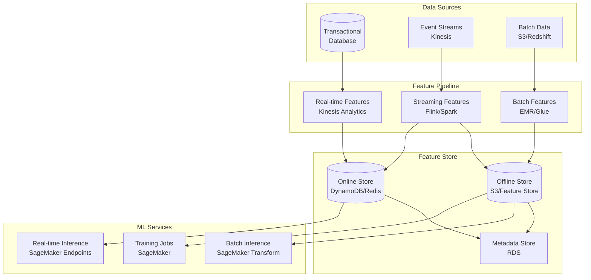
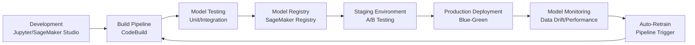
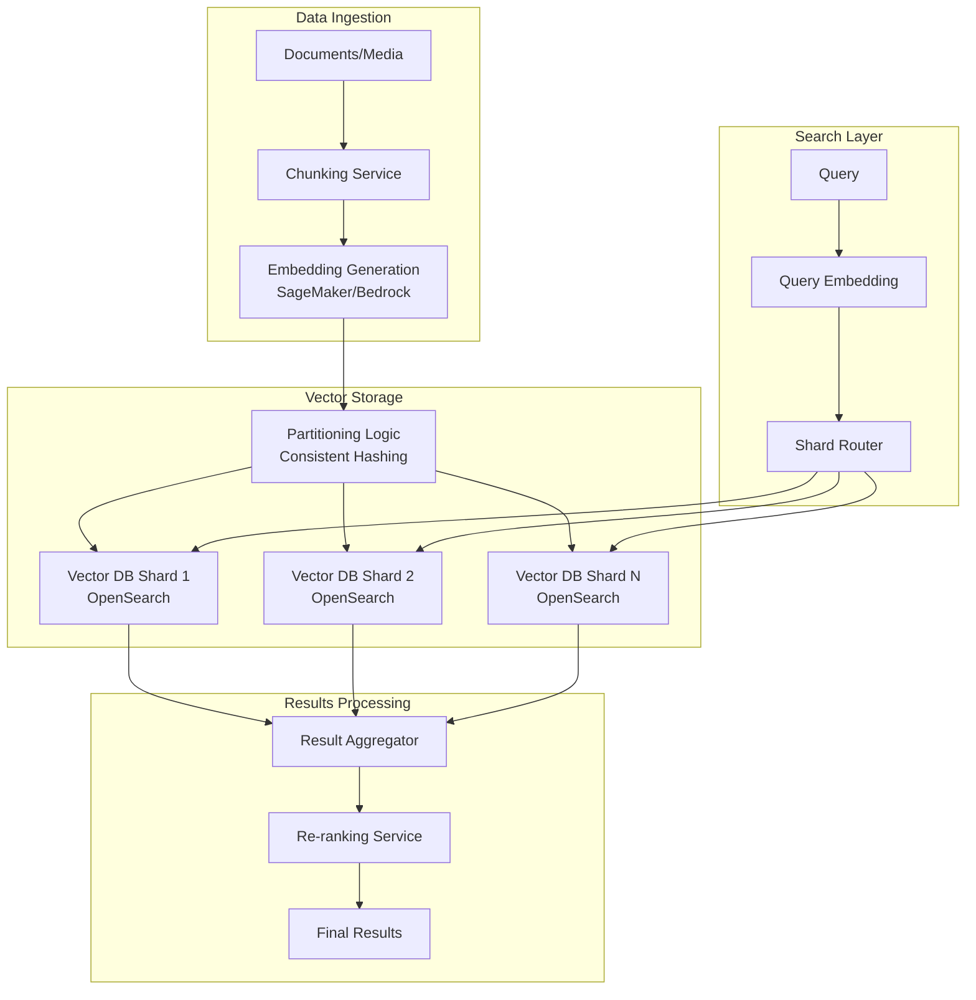
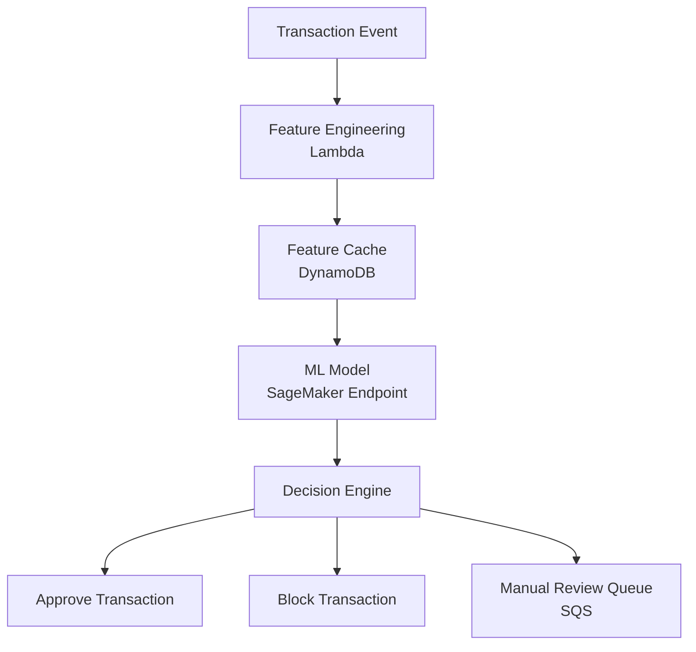
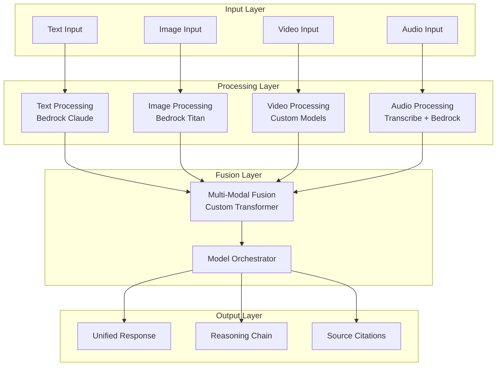

# ML Systems Design for Amazon L6/L7 Interviews

## 🔬 Machine Learning Infrastructure at Amazon Scale

Traditional ML systems form the backbone of Amazon's operations - from recommendation engines serving 300M+ customers to fraud detection processing billions of transactions. As an L6/L7 engineering manager, you must architect ML systems that are reliable, scalable, and cost-effective.

!!! quote "Real L7 ML Platform Manager (December 2024)"
    "ML system design at Amazon scale isn't about building models—it's about building platforms that enable thousands of data scientists to deploy models safely and efficiently across the organization."

## 📊 Amazon ML Landscape (2025)

### Current Scale & Impact
- **Amazon Personalization**: 150B+ recommendations daily
- **Alexa ML**: 100M+ voice interactions processed daily  
- **Supply Chain Optimization**: $2B+ annual savings through ML
- **Fraud Detection**: 99.9% accuracy at 1M+ transactions/second
- **SageMaker Platform**: 100K+ active ML practitioners

### Cost Economics
```python
# Real Amazon ML Infrastructure Costs (2025)
ML_INFRASTRUCTURE_COSTS = {
    'training': {
        'compute_hours_monthly': 50000,  # GPU hours
        'cost_per_hour': 3.06,  # p3.2xlarge
        'monthly_cost': 153000,  # $153K/month
        'optimization_potential': 0.60  # 60% savings with spot instances
    },
    'inference': {
        'requests_per_second': 100000,
        'compute_cost_per_request': 0.0001,
        'monthly_cost': 259200,  # $259K/month
        'optimization_potential': 0.40  # 40% savings with right-sizing
    },
    'storage': {
        'training_data_tb': 100,
        'model_artifacts_tb': 20,
        'feature_store_tb': 50,
        'monthly_cost': 15360,  # $15K/month
        'optimization_potential': 0.70  # 70% savings with tiering
    }
}
```

## 🏗️ ML Feature Store Architecture

### Real-time vs Batch Feature Architecture



### Feature Store Implementation

```python
class EnterpriseFeatureStore:
    def __init__(self):
        self.online_store = DynamoDBClient()
        self.offline_store = S3Client()
        self.metadata_store = RDSClient()
        self.monitoring = CloudWatchClient()
        
    async def get_features(self, entity_id: str, feature_names: List[str], 
                          timestamp: Optional[int] = None) -> Dict:
        """Get features with automatic freshness checking"""
        
        # Check feature freshness requirements
        feature_metadata = await self.metadata_store.get_feature_metadata(feature_names)
        
        features = {}
        stale_features = []
        
        for feature_name in feature_names:
            metadata = feature_metadata[feature_name]
            max_age = metadata['max_age_seconds']
            
            # Try online store first
            feature_value = await self.online_store.get_item(
                key={'entity_id': entity_id, 'feature_name': feature_name}
            )
            
            if feature_value and self._is_fresh(feature_value['timestamp'], max_age):
                features[feature_name] = feature_value['value']
            else:
                stale_features.append(feature_name)
        
        # Handle stale features
        if stale_features:
            await self._handle_stale_features(entity_id, stale_features)
            
        return features
    
    async def compute_and_store_features(self, entity_id: str, 
                                       raw_data: Dict) -> None:
        """Compute features and store in both online/offline stores"""
        
        # Feature computation pipeline
        computed_features = await self._compute_features(raw_data)
        
        # Store in online store for real-time inference
        await self._store_online_features(entity_id, computed_features)
        
        # Store in offline store for training
        await self._store_offline_features(entity_id, computed_features)
        
        # Update metadata
        await self._update_feature_metadata(computed_features)
```

### Training-Serving Consistency Patterns

```python
class TrainingServingConsistency:
    def __init__(self):
        self.feature_transformer = FeatureTransformer()
        self.model_registry = SageMakerModelRegistry()
        
    async def ensure_consistency(self, model_version: str) -> bool:
        """Ensure training and serving use identical feature transformations"""
        
        # Get training feature schema
        training_schema = await self.model_registry.get_training_schema(model_version)
        
        # Get current serving feature schema  
        serving_schema = await self.feature_transformer.get_serving_schema()
        
        # Validate consistency
        consistency_checks = {
            'feature_names': set(training_schema.features) == set(serving_schema.features),
            'data_types': self._validate_data_types(training_schema, serving_schema),
            'transformations': self._validate_transformations(training_schema, serving_schema),
            'version_compatibility': training_schema.version == serving_schema.version
        }
        
        if not all(consistency_checks.values()):
            await self._alert_inconsistency(consistency_checks)
            return False
            
        return True
```

### DynamoDB vs Redis vs S3 Trade-offs

| Aspect | DynamoDB | Redis | S3 |
|--------|----------|-------|-----|
| **Latency** | 1-5ms | <1ms | 10-100ms |
| **Throughput** | 40K RCU/table | 1M+ ops/sec | Unlimited |
| **Cost/GB/month** | $0.25 | $0.096 (ElastiCache) | $0.023 |
| **Consistency** | Eventually consistent | Strong | Eventually consistent |
| **Use Case** | General-purpose online | Ultra-low latency | Large-scale offline |
| **Data Size Limit** | 400KB/item | 512MB/key | 5TB/object |

**Decision Framework:**
```python
def select_feature_store_backend(requirements):
    if requirements.latency_p99 < 1:
        return "redis"  # Ultra-low latency
    elif requirements.throughput > 100000 and requirements.cost_sensitive:
        return "s3"  # High throughput, cost-effective
    elif requirements.multi_region and requirements.managed:
        return "dynamodb"  # Global distribution, fully managed
    else:
        return "hybrid"  # Use multiple stores based on feature type
```

## 🚀 Model Operations (MLOps) Framework

### Model Registry & Versioning



### Model Deployment Patterns

```python
class BlueGreenModelDeployment:
    def __init__(self):
        self.sagemaker = boto3.client('sagemaker')
        self.route53 = boto3.client('route53')
        
    async def deploy_model(self, model_name: str, model_version: str):
        """Deploy model using blue-green pattern"""
        
        # Create new endpoint configuration (Green)
        green_config = await self._create_endpoint_config(
            name=f"{model_name}-green-{model_version}",
            model_name=model_name,
            model_version=model_version
        )
        
        # Deploy green endpoint
        green_endpoint = await self._create_endpoint(
            name=f"{model_name}-green",
            config_name=green_config['EndpointConfigName']
        )
        
        # Validate green endpoint
        validation_passed = await self._validate_endpoint(green_endpoint['EndpointName'])
        
        if validation_passed:
            # Gradually shift traffic from blue to green
            await self._gradual_traffic_shift(
                blue_endpoint=f"{model_name}-blue",
                green_endpoint=f"{model_name}-green",
                shift_duration_minutes=30
            )
        else:
            # Rollback on validation failure
            await self._rollback_deployment(green_endpoint['EndpointName'])
```

### A/B Testing at Scale

```python
class MLABTestingFramework:
    def __init__(self):
        self.experiment_tracker = ExperimentTracker()
        self.metrics_collector = MetricsCollector()
        
    async def create_ab_test(self, experiment_config: Dict):
        """Create A/B test for model comparison"""
        
        experiment = {
            'id': f"exp_{uuid.uuid4()}",
            'models': {
                'control': experiment_config['control_model'],
                'treatment': experiment_config['treatment_model']
            },
            'traffic_split': experiment_config.get('traffic_split', 0.5),
            'success_metrics': experiment_config['success_metrics'],
            'duration_days': experiment_config.get('duration', 14),
            'min_sample_size': experiment_config.get('min_samples', 1000)
        }
        
        # Set up traffic routing
        await self._configure_traffic_routing(experiment)
        
        # Start metrics collection
        await self.metrics_collector.start_collection(experiment['id'])
        
        return experiment['id']
    
    async def analyze_experiment(self, experiment_id: str) -> Dict:
        """Analyze A/B test results with statistical significance"""
        
        metrics = await self.metrics_collector.get_experiment_metrics(experiment_id)
        
        results = {}
        for metric_name in metrics['control'].keys():
            control_values = metrics['control'][metric_name]
            treatment_values = metrics['treatment'][metric_name]
            
            # Statistical significance testing
            stat_test = self._perform_t_test(control_values, treatment_values)
            
            results[metric_name] = {
                'control_mean': np.mean(control_values),
                'treatment_mean': np.mean(treatment_values),
                'improvement': stat_test['improvement'],
                'p_value': stat_test['p_value'],
                'statistically_significant': stat_test['p_value'] < 0.05,
                'confidence_interval': stat_test['confidence_interval']
            }
        
        return results
```

## 🎯 Real-time ML Serving Architecture

### Low-Latency Prediction Endpoints

```mermaid
graph TB
    subgraph "Client Layer"
        MOBILE[Mobile Apps]
        WEB[Web Applications]
        API[API Clients]
    end
    
    subgraph "Edge Layer"
        CDN[CloudFront<br/>Global CDN]
        EDGE[Lambda@Edge<br/>Feature Caching]
    end
    
    subgraph "API Gateway Layer"
        APIGW[API Gateway<br/>Rate Limiting]
        AUTH[Authentication<br/>Cognito/IAM]
    end
    
    subgraph "Inference Layer"
        ALB[Application LB<br/>Health Checks]
        ASG[Auto Scaling Group<br/>GPU Instances]
        CACHE[Redis Cache<br/>Prediction Cache]
    end
    
    subgraph "Model Serving"
        ENDPOINTS[SageMaker Endpoints<br/>Multi-Model]
        BATCH[Batch Transform<br/>Large Scale Inference]
    end
    
    MOBILE --> CDN
    WEB --> CDN
    API --> APIGW
    
    CDN --> EDGE
    EDGE --> APIGW
    APIGW --> AUTH
    AUTH --> ALB
    
    ALB --> ASG
    ASG --> CACHE
    CACHE --> ENDPOINTS
    ENDPOINTS --> BATCH
```

### Caching Strategies for ML Predictions

```python
class MLPredictionCache:
    def __init__(self):
        self.redis_client = redis.Redis()
        self.feature_cache = {}
        self.prediction_cache = {}
        
    async def get_cached_prediction(self, features: Dict, model_id: str) -> Optional[Dict]:
        """Multi-level caching for ML predictions"""
        
        # Level 1: Exact feature match cache
        feature_key = self._create_feature_key(features, model_id)
        cached_prediction = await self.redis_client.get(feature_key)
        
        if cached_prediction:
            return json.loads(cached_prediction)
        
        # Level 2: Similar feature cache (for continuous features)
        if self._has_continuous_features(features):
            similar_prediction = await self._find_similar_cached_prediction(
                features, model_id, similarity_threshold=0.95
            )
            if similar_prediction:
                return similar_prediction
        
        # Level 3: Precomputed batch predictions
        if self._is_batchable_request(features):
            batch_prediction = await self._get_batch_prediction(features, model_id)
            if batch_prediction:
                return batch_prediction
        
        return None
    
    async def cache_prediction(self, features: Dict, model_id: str, 
                             prediction: Dict, ttl: int = 3600):
        """Cache prediction with appropriate TTL"""
        
        feature_key = self._create_feature_key(features, model_id)
        
        # Adjust TTL based on feature volatility
        adjusted_ttl = self._calculate_adaptive_ttl(features, ttl)
        
        await self.redis_client.setex(
            feature_key, 
            adjusted_ttl, 
            json.dumps(prediction)
        )
        
        # Update cache statistics
        await self._update_cache_stats(model_id, 'cache_write')
```

### Auto-scaling Based on Inference Load

```python
class InferenceAutoScaler:
    def __init__(self):
        self.cloudwatch = boto3.client('cloudwatch')
        self.sagemaker = boto3.client('sagemaker')
        self.scaling_policies = {}
        
    def create_scaling_policy(self, endpoint_name: str):
        """Create intelligent scaling policy for ML endpoints"""
        
        policy = {
            'target_metrics': [
                {
                    'name': 'InvocationsPerInstance',
                    'target_value': 1000,
                    'scale_out_cooldown': 300,
                    'scale_in_cooldown': 900
                },
                {
                    'name': 'ModelLatency',
                    'target_value': 500,  # milliseconds
                    'scale_out_cooldown': 180,
                    'scale_in_cooldown': 600
                }
            ],
            'predictive_scaling': {
                'enabled': True,
                'prediction_window_hours': 24,
                'history_window_days': 14
            },
            'cost_optimization': {
                'use_spot_instances': True,
                'spot_ratio': 0.7,
                'graceful_shutdown_seconds': 120
            }
        }
        
        self.scaling_policies[endpoint_name] = policy
        return policy
    
    async def scale_endpoint(self, endpoint_name: str, current_load: Dict):
        """Make scaling decisions based on current metrics"""
        
        policy = self.scaling_policies.get(endpoint_name)
        if not policy:
            return
        
        # Collect current metrics
        metrics = await self._collect_endpoint_metrics(endpoint_name)
        
        # Predictive scaling
        predicted_load = await self._predict_future_load(
            endpoint_name, 
            window_hours=policy['predictive_scaling']['prediction_window_hours']
        )
        
        # Make scaling decision
        scaling_decision = self._make_scaling_decision(
            current_metrics=metrics,
            predicted_load=predicted_load,
            policy=policy
        )
        
        if scaling_decision['action'] != 'no_change':
            await self._execute_scaling_action(endpoint_name, scaling_decision)
```

## 📊 ML Monitoring & Observability

### Data Drift Detection

```python
class DataDriftDetector:
    def __init__(self):
        self.baseline_statistics = {}
        self.drift_thresholds = {
            'psi_threshold': 0.1,  # Population Stability Index
            'js_divergence_threshold': 0.1,  # Jensen-Shannon Divergence
            'ks_test_threshold': 0.05  # Kolmogorov-Smirnov test p-value
        }
    
    async def detect_drift(self, feature_name: str, current_data: np.ndarray) -> Dict:
        """Detect data drift using multiple statistical methods"""
        
        baseline = self.baseline_statistics.get(feature_name)
        if not baseline:
            await self._compute_baseline_statistics(feature_name)
            return {'drift_detected': False, 'reason': 'baseline_not_available'}
        
        drift_results = {}
        
        # Population Stability Index
        psi = self._calculate_psi(baseline['distribution'], current_data)
        drift_results['psi'] = {
            'value': psi,
            'threshold': self.drift_thresholds['psi_threshold'],
            'drift_detected': psi > self.drift_thresholds['psi_threshold']
        }
        
        # Jensen-Shannon Divergence
        js_div = self._calculate_js_divergence(baseline['distribution'], current_data)
        drift_results['js_divergence'] = {
            'value': js_div,
            'threshold': self.drift_thresholds['js_divergence_threshold'],
            'drift_detected': js_div > self.drift_thresholds['js_divergence_threshold']
        }
        
        # Kolmogorov-Smirnov Test
        ks_stat, p_value = stats.ks_2samp(baseline['sample'], current_data)
        drift_results['ks_test'] = {
            'statistic': ks_stat,
            'p_value': p_value,
            'threshold': self.drift_thresholds['ks_test_threshold'],
            'drift_detected': p_value < self.drift_thresholds['ks_test_threshold']
        }
        
        # Overall drift decision
        overall_drift = any(test['drift_detected'] for test in drift_results.values())
        
        return {
            'feature_name': feature_name,
            'drift_detected': overall_drift,
            'detailed_results': drift_results,
            'timestamp': datetime.utcnow().isoformat()
        }
```

### Model Performance Monitoring

```python
class ModelPerformanceMonitor:
    def __init__(self):
        self.cloudwatch = boto3.client('cloudwatch')
        self.performance_baselines = {}
        
    async def monitor_model_performance(self, model_id: str, 
                                      predictions: List[Dict], 
                                      ground_truth: List[Dict] = None):
        """Monitor model performance metrics"""
        
        metrics = {
            'prediction_latency': self._calculate_latency_metrics(predictions),
            'prediction_confidence': self._analyze_prediction_confidence(predictions),
            'error_rate': self._calculate_error_rate(predictions),
            'throughput': self._calculate_throughput(predictions)
        }
        
        # Add accuracy metrics if ground truth available
        if ground_truth:
            accuracy_metrics = self._calculate_accuracy_metrics(predictions, ground_truth)
            metrics.update(accuracy_metrics)
        
        # Compare against baseline
        performance_degradation = await self._detect_performance_degradation(
            model_id, metrics
        )
        
        # Send metrics to CloudWatch
        await self._publish_metrics(model_id, metrics)
        
        # Alert if performance degraded
        if performance_degradation:
            await self._alert_performance_degradation(model_id, performance_degradation)
        
        return metrics
```

### Cost Per Inference Tracking

```python
class MLCostTracker:
    def __init__(self):
        self.cost_breakdown = {
            'compute': {},
            'storage': {},
            'networking': {},
            'data_transfer': {}
        }
    
    def calculate_inference_cost(self, endpoint_name: str, 
                               num_requests: int,
                               request_duration_ms: float) -> Dict:
        """Calculate detailed cost per inference"""
        
        # Get endpoint configuration
        endpoint_config = self._get_endpoint_config(endpoint_name)
        instance_type = endpoint_config['instance_type']
        instance_count = endpoint_config['instance_count']
        
        # Compute costs
        compute_cost_per_hour = AWS_INSTANCE_PRICING[instance_type]['cost_per_hour']
        compute_cost_per_ms = compute_cost_per_hour / (60 * 60 * 1000)
        
        cost_breakdown = {
            'compute_cost': num_requests * request_duration_ms * compute_cost_per_ms,
            'storage_cost': self._calculate_model_storage_cost(endpoint_name),
            'data_transfer_cost': self._calculate_data_transfer_cost(num_requests),
            'overhead_cost': self._calculate_overhead_cost(endpoint_name)
        }
        
        total_cost = sum(cost_breakdown.values())
        cost_per_request = total_cost / num_requests if num_requests > 0 else 0
        
        return {
            'total_cost': total_cost,
            'cost_per_request': cost_per_request,
            'breakdown': cost_breakdown,
            'optimization_recommendations': self._get_cost_optimization_recommendations(
                endpoint_name, cost_breakdown
            )
        }
```

## 🔧 Vector Database & Embedding Systems

### Vector Search at Scale (Billions of Embeddings)



### Similarity Search Optimization

```python
class OptimizedVectorSearch:
    def __init__(self):
        self.opensearch_client = OpenSearchClient()
        self.embedding_cache = {}
        self.index_shards = 10  # Horizontal partitioning
        
    async def search(self, query: str, top_k: int = 10, 
                    filters: Dict = None) -> List[Dict]:
        """Optimized vector similarity search"""
        
        # Get or compute query embedding
        query_embedding = await self._get_cached_embedding(query)
        
        # Multi-stage search for efficiency
        # Stage 1: Coarse search across all shards
        coarse_results = await self._coarse_search(
            query_embedding, 
            top_k * 5,  # Get 5x more results for re-ranking
            filters
        )
        
        # Stage 2: Fine-grained re-ranking
        reranked_results = await self._fine_grained_rerank(
            query, 
            coarse_results,
            top_k
        )
        
        return reranked_results
    
    async def _coarse_search(self, query_embedding: List[float], 
                           top_k: int, filters: Dict) -> List[Dict]:
        """Distributed search across shards"""
        
        search_tasks = []
        for shard_id in range(self.index_shards):
            task = self._search_shard(
                shard_id, 
                query_embedding, 
                top_k // self.index_shards + 10,  # Extra buffer
                filters
            )
            search_tasks.append(task)
        
        # Execute searches in parallel
        shard_results = await asyncio.gather(*search_tasks)
        
        # Merge and sort results
        merged_results = []
        for results in shard_results:
            merged_results.extend(results)
        
        # Sort by similarity score
        merged_results.sort(key=lambda x: x['score'], reverse=True)
        
        return merged_results[:top_k]
```

### Embedding Generation Pipelines

```python
class EmbeddingPipeline:
    def __init__(self):
        self.bedrock = boto3.client('bedrock-runtime')
        self.sagemaker = boto3.client('sagemaker-runtime')
        self.batch_size = 100
        
    async def process_documents(self, documents: List[str]) -> Dict:
        """Process documents through embedding pipeline"""
        
        # Stage 1: Document preprocessing
        processed_docs = await self._preprocess_documents(documents)
        
        # Stage 2: Chunking strategy
        chunks = await self._smart_chunking(processed_docs)
        
        # Stage 3: Batch embedding generation
        embeddings = await self._generate_embeddings_batch(chunks)
        
        # Stage 4: Quality validation
        validated_embeddings = await self._validate_embeddings(embeddings)
        
        # Stage 5: Index management
        await self._update_vector_index(validated_embeddings)
        
        return {
            'processed_documents': len(documents),
            'generated_chunks': len(chunks),
            'embeddings_created': len(embeddings),
            'indexing_status': 'completed'
        }
    
    async def _smart_chunking(self, documents: List[str]) -> List[Dict]:
        """Intelligent document chunking with overlap"""
        
        chunks = []
        for doc_id, document in enumerate(documents):
            # Semantic chunking based on sentence boundaries
            sentences = self._split_into_sentences(document)
            
            # Create overlapping chunks
            chunk_size = 500  # tokens
            overlap = 50     # tokens
            
            for i in range(0, len(sentences), chunk_size - overlap):
                chunk_sentences = sentences[i:i + chunk_size]
                chunk_text = ' '.join(chunk_sentences)
                
                chunks.append({
                    'doc_id': doc_id,
                    'chunk_id': f"{doc_id}_{i}",
                    'text': chunk_text,
                    'start_sentence': i,
                    'end_sentence': min(i + chunk_size, len(sentences))
                })
        
        return chunks
```

### Index Management Strategies

```python
class VectorIndexManager:
    def __init__(self):
        self.opensearch = OpenSearchClient()
        self.index_template = {
            'settings': {
                'number_of_shards': 10,
                'number_of_replicas': 1,
                'index': {
                    'knn': True,
                    'knn.algo_param.ef_search': 100,
                    'knn.algo_param.ef_construction': 200,
                    'knn.space_type': 'cosinesimil'
                }
            },
            'mappings': {
                'properties': {
                    'embedding': {
                        'type': 'knn_vector',
                        'dimension': 1536,  # OpenAI ada-002 dimensions
                        'method': {
                            'name': 'hnsw',
                            'space_type': 'cosinesimil',
                            'engine': 'faiss'
                        }
                    }
                }
            }
        }
    
    async def manage_index_lifecycle(self, index_name: str):
        """Automated index lifecycle management"""
        
        index_stats = await self.opensearch.get_index_stats(index_name)
        
        # Hot-Warm-Cold tiering based on access patterns
        if index_stats['query_frequency'] < 100:  # queries/day
            await self._move_to_warm_tier(index_name)
        elif index_stats['query_frequency'] < 10:  # queries/day
            await self._move_to_cold_tier(index_name)
        
        # Index optimization based on size
        if index_stats['size_gb'] > 100:
            await self._optimize_large_index(index_name)
        
        # Automatic replication adjustment
        optimal_replicas = self._calculate_optimal_replicas(index_stats)
        if optimal_replicas != index_stats['current_replicas']:
            await self._update_replica_count(index_name, optimal_replicas)
```

## 💰 Cost Optimization Deep Dive

### Spot Instances for Training (90% Cost Reduction)

```python
class SpotTrainingManager:
    def __init__(self):
        self.sagemaker = boto3.client('sagemaker')
        self.cost_savings = {}
        
    def create_spot_training_job(self, job_config: Dict) -> Dict:
        """Create cost-optimized training job with spot instances"""
        
        # Enhanced spot configuration
        spot_config = {
            'training_job_name': job_config['job_name'],
            'algorithm_specification': job_config['algorithm_spec'],
            'role_arn': job_config['role_arn'],
            'input_data_config': job_config['input_data'],
            'output_data_config': job_config['output_data'],
            'resource_config': {
                'instance_type': job_config.get('instance_type', 'ml.p3.2xlarge'),
                'instance_count': job_config.get('instance_count', 1),
                'volume_size_in_gb': job_config.get('volume_size', 30)
            },
            'stopping_condition': {
                'max_runtime_in_seconds': job_config.get('max_runtime', 86400)
            },
            'enable_managed_spot_training': True,
            'checkpoint_config': {
                'S3Uri': f"s3://{job_config['s3_bucket']}/checkpoints/{job_config['job_name']}"
            },
            'retry_strategy': {
                'maximum_retry_attempts': 3
            }
        }
        
        # Cost estimation
        on_demand_cost = self._calculate_on_demand_cost(spot_config['resource_config'])
        estimated_spot_cost = on_demand_cost * 0.3  # Typical 70% savings
        
        return {
            'job_config': spot_config,
            'cost_estimation': {
                'on_demand_cost': on_demand_cost,
                'spot_cost': estimated_spot_cost,
                'potential_savings': on_demand_cost - estimated_spot_cost,
                'savings_percentage': 70
            }
        }
```

### Inference Endpoint Right-Sizing

```python
class EndpointOptimizer:
    def __init__(self):
        self.cloudwatch = boto3.client('cloudwatch')
        self.optimization_history = {}
        
    async def analyze_endpoint_utilization(self, endpoint_name: str, 
                                         days: int = 7) -> Dict:
        """Analyze endpoint utilization for right-sizing"""
        
        metrics = await self._get_endpoint_metrics(endpoint_name, days)
        
        analysis = {
            'current_configuration': await self._get_current_config(endpoint_name),
            'utilization_stats': {
                'cpu_utilization_avg': np.mean(metrics['cpu_utilization']),
                'cpu_utilization_p95': np.percentile(metrics['cpu_utilization'], 95),
                'memory_utilization_avg': np.mean(metrics['memory_utilization']),
                'invocations_per_instance': np.mean(metrics['invocations_per_instance']),
                'model_latency_p99': np.percentile(metrics['model_latency'], 99)
            },
            'cost_analysis': await self._analyze_current_costs(endpoint_name, days)
        }
        
        # Generate right-sizing recommendations
        recommendations = await self._generate_rightsizing_recommendations(analysis)
        
        return {
            'analysis': analysis,
            'recommendations': recommendations,
            'potential_monthly_savings': recommendations.get('cost_savings', 0)
        }
    
    async def _generate_rightsizing_recommendations(self, analysis: Dict) -> Dict:
        """Generate specific right-sizing recommendations"""
        
        current_config = analysis['current_configuration']
        utilization = analysis['utilization_stats']
        
        recommendations = {}
        
        # CPU-based recommendations
        if utilization['cpu_utilization_p95'] < 30:
            recommendations['instance_type'] = self._get_smaller_instance_type(
                current_config['instance_type']
            )
            recommendations['reason'] = 'CPU utilization consistently low'
        elif utilization['cpu_utilization_p95'] > 80:
            recommendations['instance_type'] = self._get_larger_instance_type(
                current_config['instance_type']
            )
            recommendations['reason'] = 'CPU utilization too high'
        
        # Instance count recommendations
        if utilization['invocations_per_instance'] < 500:
            recommendations['instance_count'] = max(1, current_config['instance_count'] - 1)
            recommendations['scale_down_reason'] = 'Low request volume per instance'
        
        # Calculate potential savings
        if 'instance_type' in recommendations or 'instance_count' in recommendations:
            current_cost = analysis['cost_analysis']['monthly_cost']
            recommended_cost = self._calculate_recommended_cost(
                recommendations.get('instance_type', current_config['instance_type']),
                recommendations.get('instance_count', current_config['instance_count'])
            )
            recommendations['cost_savings'] = current_cost - recommended_cost
        
        return recommendations
```

## 🎯 L6 vs L7 ML Expectations

### L6 (Component-Level ML Systems)

**System Design Scope:**
- Single ML service or component
- 1-10 models in production
- Team of 5-15 engineers
- Regional deployment

**Technical Focus:**
```python
L6_EXPECTATIONS = {
    'ml_pipeline': {
        'training_pipeline': 'Design end-to-end training pipeline',
        'model_serving': 'Real-time and batch inference patterns',
        'monitoring': 'Basic model performance monitoring',
        'a_b_testing': 'Simple A/B testing framework'
    },
    'scale_requirements': {
        'qps': '1K-10K requests/second',
        'model_size': '< 10GB',
        'training_data': '< 1TB',
        'latency_p99': '< 100ms'
    },
    'aws_services': [
        'SageMaker (Training, Endpoints)',
        'S3 (Data, Model Storage)',
        'DynamoDB (Feature Store)',
        'Lambda (Preprocessing)',
        'CloudWatch (Monitoring)'
    ]
}
```

**Interview Questions:**
1. "Design a product recommendation system for an e-commerce site"
2. "Build a real-time fraud detection system"
3. "Create a content moderation pipeline for user-generated content"

### L7 (Platform-Level ML Infrastructure)

**System Design Scope:**
- ML platform serving multiple business units
- 100+ models in production
- Teams of 50+ engineers
- Multi-region, global deployment

**Technical Focus:**
```python
L7_EXPECTATIONS = {
    'ml_platform': {
        'multi_tenancy': 'Design platform for multiple teams/models',
        'model_governance': 'Model registry, versioning, compliance',
        'auto_scaling': 'Dynamic resource allocation across workloads',
        'cost_optimization': 'Platform-wide cost optimization strategies'
    },
    'scale_requirements': {
        'qps': '100K+ requests/second',
        'model_size': '100GB+ (Large Language Models)',
        'training_data': '100TB+',
        'latency_p99': '< 50ms',
        'availability': '99.99%+'
    },
    'strategic_decisions': [
        'Build vs Buy (Bedrock vs Custom Models)',
        'Multi-cloud strategy',
        'Organizational structure',
        'Technology standardization'
    ]
}
```

**Interview Questions:**
1. "Design Amazon's ML platform serving all business units"
2. "Build a multi-modal AI platform (text, image, video)"
3. "Create an AI governance framework for enterprise compliance"

## 🎓 Practice Problems & Solutions

### L6 Practice: Real-time Fraud Detection System



**Key Discussion Points:**
- Feature engineering for real-time processing
- Model refresh strategies
- False positive/negative trade-offs
- Compliance and auditability

### L7 Practice: Multi-Modal AI Platform



**Key Discussion Points:**
- Cross-modal attention mechanisms
- Unified embedding spaces
- Model coordination and orchestration
- Platform APIs and developer experience

## 🚀 2025 ML Trends & Considerations

### Emerging Patterns
1. **Foundation Model Fine-tuning**: Custom models based on general-purpose LLMs
2. **Edge AI Deployment**: Running models on mobile devices and IoT
3. **Responsible AI by Design**: Built-in bias detection and explanation
4. **Multi-Agent Systems**: Coordinated AI agents for complex tasks
5. **Continuous Learning**: Models that adapt in real-time

### Technical Debt Considerations
```python
ML_TECHNICAL_DEBT = {
    'data_dependencies': 'Unstable data dependencies create hidden coupling',
    'model_complexity': 'Complex ensemble models hard to maintain',
    'feedback_loops': 'Model predictions influence future training data',
    'configuration_debt': 'Experimental configuration becomes production',
    'monitoring_debt': 'Insufficient monitoring of model behavior'
}
```

---

!!! success "Key Takeaways for ML System Design"
    1. **Focus on the Platform**: Think beyond individual models to reusable infrastructure
    2. **Cost is Critical**: Demonstrate understanding of ML economics at scale
    3. **Monitoring is Essential**: Show how you'll detect when models degrade
    4. **Think End-to-End**: Cover the full ML lifecycle from data to deployment
    5. **Scale Considerations**: Design for Amazon-level traffic and data volumes
    6. **Team Dynamics**: Consider how ML systems enable team productivity

*Continue to: [ML Design Problems](ml-design-problems.md) →*