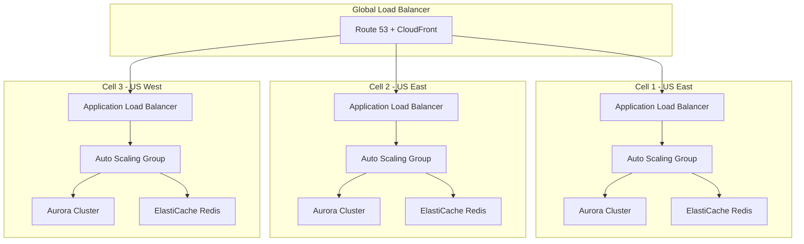
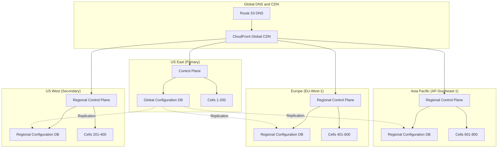
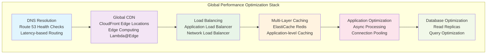
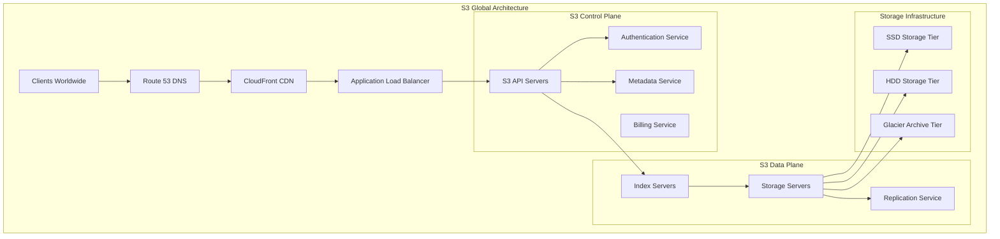

# Scale Architecture Patterns for Amazon L6/L7 Engineering Leaders

## 🎯 Scaling from Thousands to Billions: The Amazon Way

Scaling systems to serve billions of users requires fundamentally different thinking than building applications for thousands. At Amazon, scaling isn't just about handling more traffic—it's about creating resilient, cost-effective systems that maintain operational excellence while growing exponentially. This guide provides the deep architectural patterns and practical frameworks that L6/L7 candidates need to demonstrate Amazon-level scaling expertise.

!!! quote "2024 L7 Success Story"
    **Principal Engineer (December 2024):** "The interviewer didn't just want to see I could scale to billions of users—they wanted to see I could design systems that would scale Amazon's business itself. I focused on cell-based architecture and showed how it enables both technical and organizational scaling."
    
    **L6 Engineering Manager (October 2024):** "I made the mistake of jumping straight into technical solutions. What got me the offer was when I stepped back and showed how different scaling approaches affect team structure, operational burden, and long-term maintainability."

## 📊 The Scaling Spectrum: Understanding Scale Requirements

### Scale Definitions and Architectural Implications

```markdown
**The Amazon Scaling Pyramid:**

🔸 **Startup Scale (1K-10K users)**
- Single server, monolithic architecture
- Manual scaling and deployment
- Development speed over everything
- Technical debt acceptable

🔸 **Growth Scale (10K-1M users)**
- Load balancers, database replication
- Basic auto-scaling, monitoring
- Technical debt becomes operational burden
- First architectural decisions matter

🔸 **L6 Scale (1M-100M users)**
- Microservices, distributed caching
- Regional deployments, data partitioning
- Operational excellence required
- Architecture affects team productivity

🔸 **L7 Scale (100M-1B+ users)**
- Global distribution, cell-based architecture
- Platform thinking, ecosystem design
- Innovation in distributed systems
- Architecture enables business strategy
```

### Scale Transition Points and Architectural Shifts

Each scale transition requires fundamental architectural rethinking, not just adding more servers:

```python
# Scale transition decision framework
scaling_transitions = {
    "1K_to_100K": {
        "bottleneck": "Single server capacity",
        "solution": "Vertical scaling + load balancer",
        "architecture_shift": "Stateless application design",
        "team_impact": "DevOps processes introduction",
        "aws_pattern": "EC2 + ELB + RDS"
    },
    
    "100K_to_10M": {
        "bottleneck": "Database write capacity",
        "solution": "Read replicas + caching + sharding",
        "architecture_shift": "Database scaling strategy",
        "team_impact": "Database expertise required",
        "aws_pattern": "RDS Multi-AZ + ElastiCache + Aurora"
    },
    
    "10M_to_100M": {
        "bottleneck": "Monolithic deployment complexity",
        "solution": "Microservices + API gateway",
        "architecture_shift": "Service-oriented architecture",
        "team_impact": "Team autonomy and ownership",
        "aws_pattern": "API Gateway + Lambda + DynamoDB"
    },
    
    "100M_to_1B": {
        "bottleneck": "Regional capacity and latency",
        "solution": "Global distribution + edge computing",
        "architecture_shift": "Cell-based + multi-region",
        "team_impact": "Platform team structure",
        "aws_pattern": "CloudFront + Global Accelerator + Cross-region"
    }
}
```

## 🏗️ Amazon's Cell-Based Architecture: The Scale Foundation

### Understanding Cell-Based Architecture

Cell-based architecture is Amazon's fundamental approach to achieving massive scale while maintaining operational simplicity. Each "cell" is a complete, isolated stack that serves a subset of users or requests.



### Cell-Based Architecture Implementation

#### Core Principles of Cell Design

```yaml
# Production cell-based architecture for L6/L7 scale
cell_architecture:
  isolation_strategy:
    blast_radius_containment:
      - "Each cell serves maximum 1% of total traffic"
      - "Cell failures don't cascade to other cells"
      - "Independent deployment and rollback per cell"
      - "Isolated data stores and caching layers"
    
    resource_allocation:
      - "Dedicated compute, storage, network per cell"
      - "No shared infrastructure between cells"
      - "Independent scaling policies per cell"
      - "Cell-specific monitoring and alerting"
  
  routing_strategy:
    user_assignment:
      method: "Consistent hashing on user_id"
      algorithm: "SHA-256 with virtual nodes"
      rebalancing: "Gradual migration on cell addition"
      failover: "Automatic routing to healthy cells"
    
    request_routing:
      - "Global DNS resolution to nearest region"
      - "Regional load balancer to available cells"
      - "Health check-based cell selection"
      - "Circuit breaker pattern for cell isolation"
  
  data_strategy:
    partitioning:
      - "User data sharded by user_id to cells"
      - "Shared reference data replicated to all cells"
      - "Cross-cell queries minimized by design"
      - "Event streaming for cross-cell coordination"
    
    consistency:
      - "Strong consistency within cells"
      - "Eventual consistency across cells"
      - "Conflict resolution for cross-cell operations"
      - "Distributed transaction minimization"
```

#### Cell-Based Scaling Example: Social Media Platform

```python
# Social media platform cell architecture implementation
class SocialMediaCellArchitecture:
    def __init__(self):
        self.cells = {}
        self.global_router = GlobalRouter()
        self.cell_manager = CellManager()
    
    def route_user_request(self, user_id, request):
        """Route user request to appropriate cell"""
        cell_id = self.calculate_cell_assignment(user_id)
        
        if not self.cells[cell_id].is_healthy():
            # Failover to alternate cell
            cell_id = self.find_backup_cell(user_id)
        
        return self.cells[cell_id].process_request(request)
    
    def calculate_cell_assignment(self, user_id):
        """Consistent hashing for user-to-cell assignment"""
        hash_value = hashlib.sha256(str(user_id).encode()).hexdigest()
        return int(hash_value, 16) % len(self.cells)
    
    def add_new_cell(self, region, capacity):
        """Add new cell and rebalance traffic"""
        new_cell = self.provision_cell(region, capacity)
        
        # Gradually migrate users to new cell
        migration_plan = self.create_migration_plan(new_cell)
        self.execute_gradual_migration(migration_plan)
        
        # Update routing tables
        self.global_router.update_cell_routing(new_cell)
    
    def handle_cell_failure(self, failed_cell_id):
        """Handle cell failure with automatic failover"""
        affected_users = self.get_cell_users(failed_cell_id)
        
        for user_id in affected_users:
            # Route to backup cell
            backup_cell = self.find_backup_cell(user_id)
            self.temporary_route_override(user_id, backup_cell)
        
        # Trigger cell recovery process
        self.initiate_cell_recovery(failed_cell_id)

# Real-world scale example: Instagram-like platform
instagram_scale_example = {
    "total_users": "2B users globally",
    "daily_active_users": "500M DAU",
    "posts_per_day": "100M posts/day",
    "photos_per_day": "500M photos/day",
    
    "cell_configuration": {
        "users_per_cell": "2M users maximum",
        "total_cells": "1000 cells globally",
        "cells_per_region": "50-200 cells",
        "cell_capacity": "10K requests/second",
        "data_per_cell": "10TB maximum"
    },
    
    "scaling_benefits": {
        "blast_radius": "0.1% of users affected by cell failure",
        "deployment_risk": "Independent rollouts per cell",
        "operational_complexity": "Cell-level debugging and monitoring",
        "team_ownership": "Teams own specific cells/regions"
    }
}
```

## 🌍 Multi-Region Global Scale Architecture

### Global Distribution Strategy

Amazon's approach to global scale involves strategic regional distribution that balances latency, compliance, cost, and operational complexity.



### Multi-Region Implementation Patterns

#### Pattern 1: Active-Active Multi-Region

```yaml
# Active-active multi-region architecture
active_active_pattern:
  regional_deployment:
    primary_regions:
      - "us-east-1: Primary control plane, 40% traffic"
      - "us-west-2: Secondary control plane, 25% traffic"
      - "eu-west-1: European users, 20% traffic"
      - "ap-southeast-1: Asian users, 15% traffic"
    
    traffic_distribution:
      routing_policy: "Latency-based with health checks"
      failover_strategy: "Automatic regional failover"
      data_residency: "GDPR-compliant EU data in EU"
      backup_regions: "Cross-region backup every 4 hours"
  
  data_consistency:
    global_configuration:
      storage: "DynamoDB Global Tables"
      consistency: "Eventually consistent across regions"
      conflict_resolution: "Last-writer-wins with timestamps"
    
    user_data:
      primary_region: "Based on user registration location"
      cross_region_replication: "Async replication for backup"
      data_sovereignty: "Compliant with local regulations"
    
    session_data:
      storage: "ElastiCache Redis with cross-region replication"
      failover: "Session recreation on region failover"
      expiration: "Short TTL to minimize data loss"
  
  operational_strategy:
    deployment:
      rollout_strategy: "Region-by-region canary deployment"
      rollback_capability: "Independent per-region rollback"
      monitoring: "Global and per-region dashboards"
    
    disaster_recovery:
      rpo_target: "15 minutes maximum data loss"
      rto_target: "5 minutes maximum downtime"
      testing: "Monthly disaster recovery drills"
```

#### Pattern 2: Primary-Secondary with Read Replicas

```python
# Multi-region scaling with primary-secondary pattern
class MultiRegionArchitecture:
    def __init__(self):
        self.primary_region = "us-east-1"
        self.secondary_regions = ["us-west-2", "eu-west-1", "ap-southeast-1"]
        self.read_regions = self.secondary_regions + ["us-east-2", "eu-central-1"]
        
    def route_write_request(self, request):
        """All writes go to primary region"""
        return self.send_to_region(self.primary_region, request)
    
    def route_read_request(self, request, user_location):
        """Route reads to nearest region with read replica"""
        optimal_region = self.find_nearest_region(user_location)
        
        if self.is_region_healthy(optimal_region):
            return self.send_to_region(optimal_region, request)
        else:
            # Fallback to primary region
            return self.send_to_region(self.primary_region, request)
    
    def handle_primary_region_failure(self):
        """Promote secondary region to primary"""
        new_primary = self.select_new_primary_region()
        
        # Promote secondary to primary
        self.promote_to_primary(new_primary)
        
        # Update DNS routing
        self.update_global_dns_routing(new_primary)
        
        # Notify operations team
        self.trigger_incident_response("primary_region_failover")

# Example: E-commerce platform global scaling
ecommerce_global_scale = {
    "traffic_distribution": {
        "north_america": "45% of traffic",
        "europe": "30% of traffic", 
        "asia_pacific": "20% of traffic",
        "other_regions": "5% of traffic"
    },
    
    "data_strategy": {
        "product_catalog": "Replicated globally, updated every 15 minutes",
        "user_profiles": "Stored in registration region, cached globally",
        "order_data": "Stored in region where order placed",
        "inventory": "Near-real-time replication, eventual consistency",
        "payment_data": "Encrypted, stored in compliant regions only"
    },
    
    "performance_targets": {
        "api_latency": "<100ms within region, <300ms cross-region",
        "page_load_time": "<2 seconds global average",
        "search_latency": "<50ms with local Elasticsearch clusters",
        "checkout_latency": "<500ms end-to-end including payment"
    }
}
```

## 💰 Cost Optimization at Scale

### The Economics of Scaling

At Amazon scale, cost optimization isn't just about reducing spend—it's about creating sustainable business models that scale economically.

```markdown
**Amazon's Cost Optimization Philosophy:**

1. **Measure Everything**
   - Cost per request, cost per user, cost per transaction
   - Resource utilization across all dimensions
   - Total cost of ownership including operational overhead

2. **Optimize for Variable Costs**
   - Prefer auto-scaling over over-provisioning
   - Use spot instances for fault-tolerant workloads
   - Implement usage-based pricing models

3. **Design for Efficiency**
   - Choose right-sized instances and storage types
   - Optimize data transfer and storage costs
   - Implement intelligent data lifecycle management

4. **Automate Cost Controls**
   - Automated scaling policies and shutdown schedules
   - Cost anomaly detection and alerting
   - Resource optimization recommendations
```

### Practical Cost Optimization Strategies

#### Compute Cost Optimization

```yaml
# Cost-optimized compute architecture for scale
compute_optimization:
  instance_strategy:
    production_workloads:
      - "Reserved instances for baseline capacity (60% savings)"
      - "Spot instances for batch processing (70% savings)"
      - "On-demand instances for traffic spikes"
      - "Graviton processors for 20% better price-performance"
    
    development_environments:
      - "Spot instances with automatic hibernation"
      - "Scheduled start/stop based on business hours"
      - "Shared development resources and environments"
    
    auto_scaling_optimization:
      target_utilization: "70-80% CPU utilization"
      scale_out_policy: "Predictive scaling with machine learning"
      scale_in_policy: "Gradual scale-in with connection draining"
      minimum_capacity: "Based on 95th percentile historical load"
  
  container_optimization:
    orchestration: "ECS Fargate for serverless containers"
    right_sizing: "Automated container sizing based on metrics"
    resource_packing: "High-density container placement"
    serverless_patterns: "Lambda for event-driven workloads"
  
  serverless_adoption:
    event_processing: "Lambda for variable workloads"
    api_backends: "API Gateway + Lambda for low-traffic APIs"
    data_processing: "Step Functions for workflow orchestration"
    cost_model: "Pay-per-execution vs always-on infrastructure"
```

#### Storage Cost Optimization

```python
# Intelligent storage tiering for cost optimization
class IntelligentStorageTiering:
    def __init__(self):
        self.storage_classes = {
            "hot": {"cost_per_gb": 0.023, "retrieval_cost": 0},
            "warm": {"cost_per_gb": 0.0125, "retrieval_cost": 0.01},
            "cold": {"cost_per_gb": 0.004, "retrieval_cost": 0.03},
            "archive": {"cost_per_gb": 0.001, "retrieval_cost": 0.05}
        }
    
    def optimize_data_placement(self, data_access_patterns):
        """Optimize storage placement based on access patterns"""
        optimizations = []
        
        for dataset in data_access_patterns:
            current_cost = self.calculate_current_cost(dataset)
            optimal_tier = self.find_optimal_tier(dataset)
            optimized_cost = self.calculate_optimized_cost(dataset, optimal_tier)
            
            if optimized_cost < current_cost * 0.8:  # 20% savings threshold
                optimizations.append({
                    "dataset": dataset["name"],
                    "current_tier": dataset["current_tier"],
                    "optimal_tier": optimal_tier,
                    "cost_savings": current_cost - optimized_cost,
                    "migration_plan": self.create_migration_plan(dataset, optimal_tier)
                })
        
        return optimizations
    
    def find_optimal_tier(self, dataset):
        """Find optimal storage tier based on access patterns"""
        access_frequency = dataset["access_frequency"]  # requests per month
        data_size_gb = dataset["size_gb"]
        
        if access_frequency > 1000:  # Hot data
            return "hot"
        elif access_frequency > 100:  # Warm data
            return "warm"
        elif access_frequency > 10:   # Cold data
            return "cold"
        else:  # Archive data
            return "archive"

# Real-world example: Media streaming service storage optimization
streaming_service_storage = {
    "content_distribution": {
        "popular_content": {
            "percentage": "20% of catalog",
            "access_pattern": "90% of requests",
            "storage_tier": "S3 Standard + CloudFront",
            "cost_optimization": "Global CDN caching"
        },
        "standard_content": {
            "percentage": "60% of catalog",
            "access_pattern": "9% of requests",
            "storage_tier": "S3 Intelligent-Tiering",
            "cost_optimization": "Automatic tier transitions"
        },
        "archive_content": {
            "percentage": "20% of catalog",
            "access_pattern": "1% of requests",
            "storage_tier": "S3 Glacier Deep Archive",
            "cost_optimization": "12-hour retrieval acceptable"
        }
    },
    
    "cost_impact": {
        "baseline_cost": "$1M/month for 10PB",
        "optimized_cost": "$400K/month after optimization",
        "savings": "60% reduction in storage costs",
        "payback_period": "2 months including migration costs"
    }
}
```

## ⚡ Performance Patterns at Scale

### Latency Optimization Strategies

Performance at scale requires systematic optimization across multiple layers, from network topology to application algorithms.



### Performance Optimization Implementation

#### Layer 1: Network and CDN Optimization

```yaml
# Global performance optimization architecture
performance_optimization:
  network_layer:
    dns_optimization:
      provider: "Route 53 with health checks"
      routing_policy: "Latency-based with geolocation failover"
      ttl_strategy: "Short TTL (60s) for faster failover"
      monitoring: "Real-time DNS query performance tracking"
    
    cdn_strategy:
      global_distribution: "200+ CloudFront edge locations"
      caching_policy: "Aggressive caching with smart invalidation"
      edge_computing: "Lambda@Edge for dynamic content optimization"
      compression: "Gzip and Brotli compression enabled"
      http2_optimization: "HTTP/2 server push for critical resources"
    
    connection_optimization:
      keep_alive: "Long-lived connections with connection pooling"
      tcp_optimization: "TCP BBR congestion control"
      ssl_optimization: "TLS 1.3 with session resumption"
      connection_multiplexing: "HTTP/2 multiplexing for reduced latency"
  
  application_layer:
    caching_strategy:
      l1_cache: "Application memory cache (Redis/Memcached)"
      l2_cache: "Distributed cache cluster with replication"
      l3_cache: "Database query result cache"
      cache_patterns: "Write-through, cache-aside, write-behind"
    
    async_processing:
      background_jobs: "SQS + Lambda for asynchronous processing"
      streaming: "Kinesis for real-time data processing"
      batch_processing: "EMR/Spark for large-scale data processing"
      event_driven: "SNS/EventBridge for decoupled architectures"
    
    database_optimization:
      read_scaling: "Read replicas with intelligent routing"
      write_scaling: "Sharding with consistent hashing"
      query_optimization: "Query analysis and index optimization"
      connection_management: "RDS Proxy for connection pooling"
```

#### Layer 2: Application-Level Performance Patterns

```python
# Performance optimization patterns for high-scale applications
class PerformanceOptimizedService:
    def __init__(self):
        self.cache_layers = self.setup_cache_hierarchy()
        self.connection_pool = self.setup_connection_pooling()
        self.async_processor = self.setup_async_processing()
    
    def setup_cache_hierarchy(self):
        """Implement multi-layer caching strategy"""
        return {
            "l1_local": LRUCache(maxsize=10000),  # Local memory cache
            "l2_distributed": RedisCluster(),     # Distributed cache
            "l3_database": QueryCache()           # Database query cache
        }
    
    def optimized_data_retrieval(self, user_id, data_type):
        """Retrieve data with performance optimization"""
        cache_key = f"{user_id}:{data_type}"
        
        # L1 Cache check (sub-millisecond)
        if data := self.cache_layers["l1_local"].get(cache_key):
            self.metrics.increment("cache.l1.hit")
            return data
        
        # L2 Cache check (1-2 milliseconds)
        if data := self.cache_layers["l2_distributed"].get(cache_key):
            self.cache_layers["l1_local"].set(cache_key, data, ttl=300)
            self.metrics.increment("cache.l2.hit")
            return data
        
        # Database with read replica routing
        data = self.fetch_from_database_optimized(user_id, data_type)
        
        # Populate caches
        self.cache_layers["l2_distributed"].set(cache_key, data, ttl=3600)
        self.cache_layers["l1_local"].set(cache_key, data, ttl=300)
        
        self.metrics.increment("cache.miss")
        return data
    
    def batch_process_requests(self, requests):
        """Batch multiple requests for efficiency"""
        # Group requests by data source
        grouped_requests = self.group_requests_by_source(requests)
        
        # Process each group concurrently
        futures = []
        for source, source_requests in grouped_requests.items():
            future = self.async_processor.submit(
                self.batch_fetch_from_source, source, source_requests
            )
            futures.append(future)
        
        # Collect results
        results = {}
        for future in futures:
            batch_results = future.result()
            results.update(batch_results)
        
        return results
    
    def implement_circuit_breaker(self, service_call, failure_threshold=5):
        """Circuit breaker pattern for resilience"""
        if self.circuit_breaker.is_open(service_call.__name__):
            raise CircuitBreakerOpenException()
        
        try:
            result = service_call()
            self.circuit_breaker.record_success(service_call.__name__)
            return result
        except Exception as e:
            self.circuit_breaker.record_failure(service_call.__name__)
            if self.circuit_breaker.should_open(service_call.__name__):
                self.circuit_breaker.open_circuit(service_call.__name__)
            raise e

# Real-world performance example: Social media timeline generation
timeline_performance_optimization = {
    "challenge": "Generate personalized timeline for 500M users in <100ms",
    
    "optimization_strategy": {
        "pre_computation": {
            "approach": "Pre-compute timelines for active users",
            "trigger": "On friend activity, batch update timelines",
            "storage": "Redis sorted sets for timeline data",
            "refresh_rate": "Real-time for active users, hourly for others"
        },
        
        "caching_layers": {
            "user_timeline": "Redis with 1-hour TTL",
            "post_metadata": "Memcached with 6-hour TTL", 
            "user_profiles": "Local cache with 30-minute TTL",
            "friend_graphs": "Distributed cache with daily refresh"
        },
        
        "database_optimization": {
            "read_replicas": "Geographic read replicas for user data",
            "sharding": "User timeline data sharded by user_id",
            "indexing": "Compound indexes on (user_id, timestamp)",
            "connection_pooling": "PgBouncer with 1000 connection pool"
        }
    },
    
    "performance_results": {
        "p50_latency": "45ms timeline generation",
        "p95_latency": "95ms timeline generation",
        "p99_latency": "150ms timeline generation",
        "cache_hit_ratio": "94% for active user timelines",
        "database_load": "80% reduction in database queries"
    }
}
```

## 🔄 Real-World Scaling Examples: S3 and DynamoDB Deep Dive

### Amazon S3: Exabyte-Scale Storage Architecture



#### S3 Scaling Lessons for L6/L7 Candidates

```python
# S3-inspired scaling architecture principles
class ExabytescaleStorageSystem:
    def __init__(self):
        self.regions = self.initialize_global_regions()
        self.metadata_service = self.setup_metadata_service()
        self.storage_tiers = self.setup_storage_tiers()
        
    def setup_metadata_service(self):
        """Separate metadata from data for independent scaling"""
        return {
            "metadata_storage": "DynamoDB for object metadata",
            "indexing_service": "Elasticsearch for object search",
            "caching_layer": "ElastiCache for frequently accessed metadata",
            "replication": "Cross-region metadata replication",
            "consistency": "Eventually consistent for performance"
        }
    
    def implement_intelligent_tiering(self, object_access_patterns):
        """Automatically tier objects based on access patterns"""
        tiering_decisions = []
        
        for obj in object_access_patterns:
            current_tier = obj["current_tier"]
            access_frequency = obj["access_frequency"]
            size_gb = obj["size_gb"]
            
            optimal_tier = self.calculate_optimal_tier(
                access_frequency, size_gb, obj["access_pattern"]
            )
            
            if optimal_tier != current_tier:
                cost_savings = self.calculate_tier_migration_savings(
                    obj, current_tier, optimal_tier
                )
                
                if cost_savings > 0:
                    tiering_decisions.append({
                        "object_key": obj["key"],
                        "from_tier": current_tier,
                        "to_tier": optimal_tier,
                        "estimated_savings": cost_savings,
                        "migration_schedule": self.schedule_migration(obj)
                    })
        
        return tiering_decisions
    
    def handle_global_request_routing(self, request):
        """Route requests to optimal region based on latency and load"""
        client_location = self.detect_client_location(request)
        
        # Find optimal region considering latency and load
        optimal_region = self.select_optimal_region(
            client_location, 
            self.get_current_regional_loads()
        )
        
        # Check if object exists in optimal region
        if self.object_exists_in_region(request.object_key, optimal_region):
            return self.route_to_region(optimal_region, request)
        else:
            # Route to region with object, update cache
            source_region = self.find_object_source_region(request.object_key)
            self.schedule_async_replication(
                request.object_key, source_region, optimal_region
            )
            return self.route_to_region(source_region, request)

# S3 scaling insights for interviews
s3_scaling_insights = {
    "architecture_principles": {
        "separation_of_concerns": "Control plane vs data plane separation",
        "horizontal_scaling": "Independent scaling of metadata and storage",
        "global_distribution": "Regional presence with intelligent routing",
        "data_durability": "11 9's durability through geographic replication"
    },
    
    "performance_optimizations": {
        "request_routing": "Anycast DNS with health-based routing",
        "data_locality": "Edge caching with CloudFront integration",
        "parallel_processing": "Multipart uploads for large objects",
        "connection_optimization": "HTTP/2 with connection reuse"
    },
    
    "cost_optimizations": {
        "intelligent_tiering": "Automatic tier transitions based on access",
        "lifecycle_policies": "Automated data archival and deletion",
        "compression": "Transparent compression for infrequently accessed data",
        "deduplication": "Block-level deduplication for storage efficiency"
    },
    
    "scaling_numbers": {
        "objects_stored": "Trillions of objects globally",
        "data_stored": "Exabytes of data across all storage classes",
        "requests_per_second": "Tens of millions of requests per second",
        "durability": "99.999999999% (11 9's) designed durability"
    }
}
```

### DynamoDB: Global Database Scaling Architecture

```python
# DynamoDB-inspired global database scaling patterns
class GlobalDatabaseSystem:
    def __init__(self):
        self.partition_manager = PartitionManager()
        self.global_secondary_indexes = GSIManager()
        self.stream_processor = StreamProcessor()
        
    def implement_adaptive_scaling(self, table_metrics):
        """Implement DynamoDB-style adaptive capacity management"""
        scaling_decisions = []
        
        for partition in table_metrics["partitions"]:
            current_capacity = partition["provisioned_capacity"]
            utilization = partition["utilization_metrics"]
            
            # Analyze traffic patterns
            traffic_pattern = self.analyze_traffic_pattern(
                utilization["read_capacity"],
                utilization["write_capacity"],
                utilization["throttled_requests"]
            )
            
            # Calculate optimal capacity
            optimal_capacity = self.calculate_optimal_capacity(
                traffic_pattern, current_capacity
            )
            
            if self.should_scale(current_capacity, optimal_capacity):
                scaling_decisions.append({
                    "partition_id": partition["id"],
                    "current_rcu": current_capacity["read_capacity"],
                    "current_wcu": current_capacity["write_capacity"],
                    "target_rcu": optimal_capacity["read_capacity"],
                    "target_wcu": optimal_capacity["write_capacity"],
                    "scaling_reason": traffic_pattern["scaling_trigger"]
                })
        
        return scaling_decisions
    
    def implement_global_tables(self, table_config):
        """Implement multi-region active-active replication"""
        global_table_setup = {
            "primary_regions": table_config["regions"],
            "replication_strategy": "Last-writer-wins with timestamps",
            "conflict_resolution": "Automatic with configurable rules",
            "consistency_model": "Eventually consistent cross-region",
            "failover_strategy": "Automatic region failover"
        }
        
        # Setup cross-region replication streams
        for source_region in global_table_setup["primary_regions"]:
            for target_region in global_table_setup["primary_regions"]:
                if source_region != target_region:
                    self.setup_replication_stream(
                        source_region, target_region, table_config
                    )
        
        return global_table_setup
    
    def optimize_access_patterns(self, query_patterns):
        """Optimize table design based on access patterns"""
        optimizations = []
        
        # Analyze partition key distribution
        partition_analysis = self.analyze_partition_distribution(query_patterns)
        if partition_analysis["hot_partitions"]:
            optimizations.append({
                "type": "partition_key_optimization",
                "recommendation": "Add randomization suffix to partition key",
                "impact": "Eliminate hot partitions, improve throughput"
            })
        
        # Analyze query patterns for GSI opportunities
        gsi_analysis = self.analyze_gsi_opportunities(query_patterns)
        for gsi_recommendation in gsi_analysis:
            optimizations.append({
                "type": "global_secondary_index",
                "index_name": gsi_recommendation["name"],
                "partition_key": gsi_recommendation["partition_key"],
                "sort_key": gsi_recommendation["sort_key"],
                "projected_attributes": gsi_recommendation["projection"],
                "query_improvement": gsi_recommendation["performance_gain"]
            })
        
        return optimizations

# DynamoDB scaling lessons for L6/L7 interviews
dynamodb_scaling_insights = {
    "partition_management": {
        "automatic_partitioning": "Transparent partition splits and merges",
        "hot_partition_detection": "Adaptive capacity with burst credits",
        "partition_distribution": "Consistent hashing with virtual nodes",
        "rebalancing": "Background partition rebalancing"
    },
    
    "global_distribution": {
        "multi_region_active": "Active-active writes in all regions",
        "conflict_resolution": "Last-writer-wins with vector clocks",
        "eventual_consistency": "Tunable consistency with strong options",
        "cross_region_replication": "Asynchronous with sub-second latency"
    },
    
    "performance_characteristics": {
        "single_digit_latency": "Single-digit millisecond read/write latency",
        "unlimited_scale": "Virtually unlimited throughput capacity",
        "auto_scaling": "Automatic capacity management",
        "global_availability": "99.999% availability SLA"
    },
    
    "cost_optimization": {
        "on_demand_pricing": "Pay-per-request with no capacity planning",
        "reserved_capacity": "Up to 76% savings for predictable workloads",
        "intelligent_tiering": "Automatic archival of infrequently accessed data",
        "compression": "Transparent compression for storage efficiency"
    }
}
```

## 🎯 Interview Framework: Scaling Design Questions

### Time Management for Scaling Problems (60-90 minutes)

```markdown
**Scaling Interview Time Allocation:**

**Minutes 0-15: Scale Requirements and Context**
- Current scale numbers and growth projections
- Performance requirements and SLAs
- Budget constraints and cost targets
- Regulatory and compliance requirements
- Team size and operational capabilities

**Minutes 15-35: High-Level Scaling Strategy**
- Horizontal vs vertical scaling decisions
- Regional distribution strategy
- Database scaling approach
- Caching and CDN strategy
- Technology stack selection with justification

**Minutes 35-55: Detailed Scaling Implementation**
- Database sharding and replication design
- Load balancing and traffic routing
- Caching layers and invalidation strategies
- Auto-scaling policies and triggers
- Monitoring and alerting strategy

**Minutes 55-75: Operational Excellence at Scale**
- Deployment and rollback strategies
- Disaster recovery and business continuity
- Security and compliance at scale
- Cost optimization opportunities
- Performance monitoring and optimization

**Minutes 75-90: Scale Evolution and Trade-offs**
- Migration path from current to target architecture
- Alternative scaling approaches and trade-offs
- Future scaling considerations and flexibility
- Organizational impact and team structure
- Risk mitigation and contingency planning
```

### Common Scaling Interview Questions (2024-2025)

```markdown
**L6 Scaling Questions:**

1. **"Design a system to handle 100M daily active users for our social media platform"**
   - Focus: Database sharding, caching strategies, CDN optimization
   - Key: Show understanding of read/write patterns and data consistency

2. **"Scale our e-commerce platform from 10K to 10M concurrent users during Black Friday"**
   - Focus: Auto-scaling, load balancing, inventory consistency
   - Key: Demonstrate handling of traffic spikes and data integrity

3. **"Design caching architecture for a news website with 50M page views per day"**
   - Focus: Multi-layer caching, cache invalidation, CDN strategy
   - Key: Show understanding of content freshness vs performance trade-offs

**L7 Scaling Questions:**

1. **"Design AWS Lambda from scratch to handle billions of function invocations"**
   - Focus: Container orchestration, multi-tenancy, billing infrastructure
   - Key: Platform thinking and ecosystem considerations

2. **"Scale our data processing platform to handle 1PB of data per day globally"**
   - Focus: Distributed processing, data partitioning, global coordination
   - Key: Show innovation in distributed systems and data management

3. **"Design a global CDN that can compete with CloudFront"**
   - Focus: Global infrastructure, intelligent routing, edge computing
   - Key: Demonstrate industry-level innovation and competitive differentiation
```

### Scaling Mistakes to Avoid

```markdown
**Common L6/L7 Scaling Mistakes:**

1. **Over-Engineering for Future Scale**
   - Mistake: Designing for 1B users when you have 1M
   - Better: Design for 10x current scale with clear evolution path

2. **Ignoring Operational Complexity**
   - Mistake: Choosing complex distributed systems without considering team capabilities
   - Better: Balance technical sophistication with operational simplicity

3. **Focusing Only on Technical Scaling**
   - Mistake: Neglecting cost, team structure, and business implications
   - Better: Consider total cost of ownership and organizational impact

4. **Premature Microservices Adoption**
   - Mistake: Breaking monolith into microservices before understanding scale bottlenecks
   - Better: Start with modular monolith, extract services as bottlenecks emerge

5. **Neglecting Data Consistency Strategy**
   - Mistake: Assuming eventual consistency is always acceptable
   - Better: Define consistency requirements per use case and design accordingly

6. **Underestimating Network and Latency Costs**
   - Mistake: Designing chatty APIs or ignoring geographic distribution
   - Better: Design for network efficiency and regional data locality
```

## 🚀 Practical Next Steps for L6/L7 Candidates

### Study Plan for Scaling Excellence

```markdown
**Week 1-2: Foundation Building**
- [ ] Study AWS Well-Architected Framework scaling principles
- [ ] Practice basic scaling calculations and capacity planning
- [ ] Learn auto-scaling policies and load balancing strategies
- [ ] Review database scaling patterns (sharding, replication, partitioning)

**Week 3-4: Advanced Patterns**
- [ ] Deep dive into cell-based architecture and blast radius isolation
- [ ] Study multi-region deployment patterns and data consistency models
- [ ] Practice cost optimization scenarios and resource allocation
- [ ] Learn caching strategies and cache invalidation patterns

**Week 5-6: Platform-Level Thinking**
- [ ] Study Amazon's scaling innovations (S3, DynamoDB, Lambda architecture)
- [ ] Practice L7-level platform design problems
- [ ] Learn about ecosystem design and API strategy
- [ ] Study organizational implications of scaling decisions

**Week 7-8: Interview Preparation**
- [ ] Practice scaling problems with strict time limits
- [ ] Record yourself explaining scaling decisions and trade-offs
- [ ] Get feedback from experienced engineers on your scaling approaches
- [ ] Practice cost calculations and ROI justifications for scaling investments
```

### Key Resources for Continued Learning

```markdown
**Essential Reading:**
- AWS Architecture Center: Real-world scaling case studies
- High Scalability: Industry scaling lessons and patterns
- Amazon Builder's Library: Amazon's internal scaling practices
- DDIA (Designing Data-Intensive Applications): Fundamental scaling concepts

**Hands-On Practice:**
- AWS Well-Architected Tool: Practice scaling assessments
- Chaos Engineering: Netflix's scaling resilience practices
- Load Testing Tools: Practice capacity planning and bottleneck identification
- Cost Optimization Tools: AWS Cost Explorer, Trusted Advisor

**Community and Networking:**
- AWS re:Invent sessions on scaling and performance
- Engineering blog posts from high-scale companies
- System design interview practice with peers
- Engineering conference talks on scaling challenges and solutions
```

## Summary: Mastering Scale Architecture for Amazon Interviews

Scaling architecture at Amazon isn't just about handling more users—it's about building systems that enable business strategy, reduce operational burden, and create sustainable competitive advantages. The key to success in L6/L7 scaling interviews is demonstrating:

1. **Strategic Thinking**: Understanding business context and competitive implications
2. **Technical Depth**: Knowledge of distributed systems, consistency models, and performance optimization
3. **Operational Excellence**: Considering team impact, cost optimization, and long-term maintainability
4. **Innovation**: Proposing novel solutions that push industry boundaries
5. **Trade-off Analysis**: Articulating clear reasoning for architectural decisions

Remember: At Amazon scale, every architectural decision affects millions of users and billions of dollars in revenue. Show that you can think at that level while maintaining the practical engineering judgment that keeps systems running reliably at massive scale.

---

**Continue Learning:**
- [System Design Fundamentals](fundamentals.md) - Core concepts and patterns
- [L6 System Design Problems](l6-problems.md) - Practice component-level scaling
- [L7 System Design Problems](l7-problems.md) - Practice platform-level scaling
- [AWS Services Deep Dive](aws-services.md) - Learn AWS scaling services and patterns