# User Journey Maps & Personalized Learning Paths

## Overview

This document provides comprehensive user journey mapping for different personas using SystemCraft, with personalized learning paths based on assessment results and user goals.

## User Personas & Journey Flows

### 🎯 Persona 1: New Interview Candidate (40% of users)
**Profile**: Senior Engineer (L5) targeting L6, first Amazon interview
**Goals**: Understand Amazon culture, build interview skills, gain confidence
**Pain Points**: Overwhelming information, unclear where to start

#### Journey Flow


```mermaid
graph TD
    A[Landing Page] --> B[Take Assessment]
    B --> C{Assessment Score}
    C -->|<55| D[Foundation Building Path]
    C -->|55-69| E[Comprehensive Preparation Path]
    C -->|70-84| F[Intensive Preparation Path]
    C -->|85+| G[Polish & Practice Path]
    
    D --> H[🎯 Start Here → 📚 Core Prep Fundamentals]
    E --> I[🎯 Start Here → 📈 12-Week Plan → 📚 Core Prep]
    F --> J[🎯 Start Here → 📈 6-Week Plan → 🚀 Practice]
    G --> K[🎯 Start Here → 🚀 Mock Interviews → 📖 Quick Reference]
```

**Primary Navigation Path**: 🎯 Start Here → 📈 Study Plans → 📚 Core Preparation

### 🚀 Persona 2: Experienced Engineer (35% of users)
**Profile**: Staff/Principal Engineer from other FAANG, targeting L6/L7
**Goals**: Adapt existing skills to Amazon culture, fill specific gaps
**Pain Points**: Time constraints, need targeted preparation

#### Journey Flow


**Primary Navigation Path**: 🎯 Start Here → 🎭 Specialized Tracks → 🚀 Practice & Polish

### 👤 Persona 3: Internal Amazon Candidate (25% of users)
**Profile**: Amazon SDE/Senior SDE seeking promotion to L6/L7
**Goals**: Demonstrate readiness for management role, prove technical leadership
**Pain Points**: Internal expectations, proving management capability

#### Journey Flow


**Primary Navigation Path**: 🎯 Start Here → 📚 Core Preparation → 🎭 Specialized Tracks

## Personalized Learning Paths Based on Assessment Results

### Path A: Foundation Building (<55 Assessment Score)
**Duration**: 16+ weeks
**Focus**: Gain experience and fundamental skills

#### Week 1-4: Fundamentals
- **🎯 Start Here**
  - Complete full assessment and gap analysis
  - Read L6 vs L7 Decision Guide
  - Understand Interview Process Overview

#### Week 5-8: Core Knowledge Building  
- **📚 Core Preparation**
  - Behavioral Leadership: STAR Framework basics
  - System Design: Fundamentals only
  - Technical Coding: Data Structures review

#### Week 9-12: Skill Development
- **📈 Study Plans**
  - Follow Comprehensive Plan (12+ weeks)
  - Focus on Progress Tracking System
  - Use Self-Assessment Tools weekly

#### Week 13-16: Practice Introduction
- **🚀 Practice & Polish**
  - Begin with basic mock interviews
  - Use Skill Assessment Tools
  - Build confidence gradually

### Path B: Comprehensive Preparation (55-69 Assessment Score)
**Duration**: 12 weeks
**Focus**: Systematic skill building with structured progression

#### Week 1-2: Foundation & Assessment
- **🎯 Start Here**
  - Quick Assessment refinement
  - Foundational Mindset development
  - L6 vs L7 target confirmation

#### Week 3-8: Core Skill Building
- **📚 Core Preparation**
  - Behavioral Leadership: Full STAR mastery
  - System Design: Advanced concepts
  - Technical Coding: Pattern recognition

#### Week 9-10: Specialized Focus
- **🎭 Specialized Tracks**
  - Choose relevant Team-Specific track
  - Deep Technical Knowledge areas
  - Level-Specific Playbooks

#### Week 11-12: Integration & Practice
- **🚀 Practice & Polish**
  - Intensive mock interview sessions
  - Video Practice Platform
  - Analytics Dashboard tracking

### Path C: Intensive Preparation (70-84 Assessment Score)
**Duration**: 6-8 weeks
**Focus**: Targeted improvement and practice

#### Week 1: Rapid Assessment & Planning
- **🎯 Start Here**
  - Identify specific weak areas
  - Create targeted improvement plan

#### Week 2-5: Focused Improvement
- **📚 Core Preparation** + **🎭 Specialized Tracks**
  - Address specific gaps identified
  - Team-specific preparation
  - Advanced behavioral scenarios

#### Week 6-8: Intensive Practice
- **🚀 Practice & Polish**
  - Daily mock interviews
  - Video practice with feedback
  - Real-time performance tracking

### Path D: Polish & Practice (85+ Assessment Score)
**Duration**: 2-4 weeks
**Focus**: Final refinements and confidence building

#### Week 1: Final Gaps
- **📚 Core Preparation**
  - Address any remaining weak areas
  - Advanced scenarios practice

#### Week 2-4: Performance Optimization
- **🚀 Practice & Polish**
  - Multiple mock interviews weekly
  - Performance analytics review
  - Interview day simulation

## Navigation Optimization by User Type

### First-Time Visitors
**Goal**: Reduce decision paralysis, provide clear starting point

#### Recommended Flow:
1. **Home Page** → Clear value proposition
2. **🎯 Start Here** → Quick Assessment (5-15 minutes)
3. **Personalized Dashboard** → Based on assessment results
4. **Progressive Disclosure** → Reveal complexity gradually

### Returning Users
**Goal**: Quick access to relevant content, progress tracking

#### Features:
- **Last Visited** sections prominently displayed
- **Progress Indicators** showing completion status
- **Quick Links** to frequently accessed content
- **Search Enhancement** with personalized results

### Mobile Users (40%+ of traffic)
**Goal**: Excellent mobile experience with touch-friendly navigation

#### Mobile-Optimized Journey:
1. **Simplified Navigation** → Collapsible sections
2. **Touch Targets** → 44px minimum sizing
3. **Progressive Loading** → Critical content first
4. **Offline Capability** → Key resources downloadable

## Contextual Navigation Aids

### Breadcrumb System
```
Home > 🎯 Start Here > Quick Assessment > Results & Recommendations
```

### Progress Indicators
- **Section Completion**: ███░░ 60% Complete
- **Overall Progress**: █████████░ 90% Ready for Interview
- **Time Estimates**: 📅 2 weeks remaining in current plan

### Related Content Suggestions
- **"If you liked this"** → Similar content recommendations
- **"Next Steps"** → Logical progression suggestions
- **"Also Consider"** → Alternative approaches

### Quick Access Tools
- **Recently Viewed** → Last 5 accessed pages
- **Bookmarks** → Save important pages
- **Quick Search** → Instant results with highlighting
- **Jump to Section** → Fast navigation within long pages

## Success Metrics & Validation

### User Experience Metrics
- **Time to First Value**: <3 minutes from landing to useful content
- **Task Success Rate**: >85% completion of intended actions
- **User Satisfaction**: 4.5+ stars average rating
- **Mobile Usability**: <2 second load times

### Learning Effectiveness Metrics
- **Assessment Completion**: >70% of visitors complete initial assessment
- **Path Adherence**: >60% follow recommended learning paths
- **Content Engagement**: >5 minutes average session time
- **Return Rate**: >40% return within 7 days

### Navigation Performance Metrics
- **Search Success Rate**: >90% find intended content
- **Navigation Depth**: <3 clicks to any content
- **Mobile Bounce Rate**: <30%
- **Page Load Speed**: <1.5 seconds on mobile

## Implementation Guidelines

### Phase 1: Core Journey Setup (Week 1)
1. Implement assessment-based routing
2. Create personalized dashboard templates
3. Set up progress tracking systems

### Phase 2: Enhanced Navigation (Week 2)
1. Add breadcrumb navigation
2. Implement related content suggestions
3. Create mobile-optimized flows

### Phase 3: Personalization Features (Week 3)
1. Add bookmark and recently viewed features
2. Implement personalized search
3. Create contextual help systems

### Phase 4: Analytics & Optimization (Week 4)
1. Set up user journey tracking
2. Implement A/B testing framework
3. Create performance dashboards

## User Journey Templates

### Template 1: First-Time User (Assessment-Driven)
```markdown
1. Welcome & Value Proposition (30 seconds)
2. Quick Assessment (5-15 minutes)
3. Personalized Results & Recommendations (2 minutes)
4. First Content Engagement (10-15 minutes)
5. Progress Setup & Planning (5 minutes)
```

### Template 2: Experienced User (Goal-Specific)
```markdown
1. Quick Navigation to Known Content (30 seconds)
2. Targeted Skill Assessment (3-5 minutes)
3. Specialized Track Selection (2 minutes)
4. Deep Content Engagement (20-30 minutes)
5. Practice Session Booking (2 minutes)
```

### Template 3: Mobile User (Efficiency-Focused)
```markdown
1. Fast Load & Recognition (2 seconds)
2. Touch-Friendly Navigation (1 minute)
3. Focused Content Consumption (10-15 minutes)
4. Quick Actions (Save, Bookmark, Share) (30 seconds)
5. Seamless Transition to Desktop (if needed)
```

---

*This user journey mapping ensures that SystemCraft serves each user type effectively, reducing cognitive load while maintaining access to comprehensive resources.*